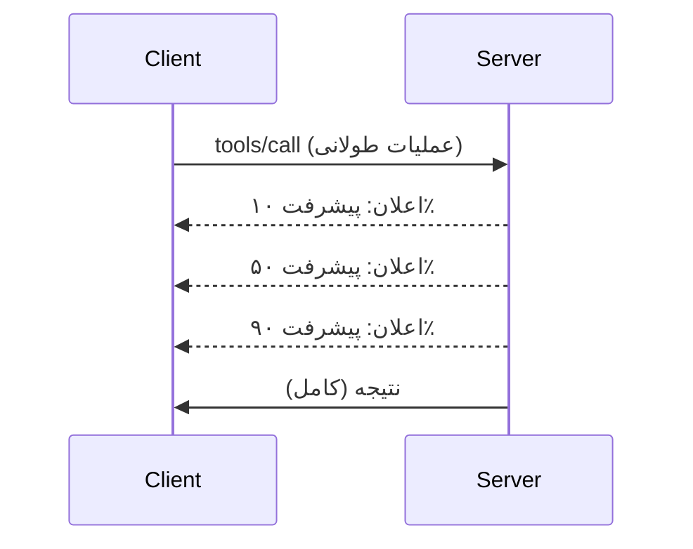

# بررسی عمیق ویژگی‌های پروتکل MCP

این راهنما به بررسی ویژگی‌های پیشرفته پروتکل MCP می‌پردازد که فراتر از مدیریت پایه‌ای ابزارها و منابع هستند. درک این ویژگی‌ها به شما کمک می‌کند سرورهای MCP مقاوم‌تر، کاربرپسندتر و آماده اجرا در محیط تولید بسازید.

## ویژگی‌های پوشش داده شده

1. **اطلاع‌رسانی پیشرفت** - گزارش پیشرفت برای عملیات طولانی‌مدت  
2. **لغو درخواست** - اجازه به مشتریان برای لغو درخواست‌های در حال اجرا  
3. **قالب‌های منابع** - آدرس‌های دینامیک منابع با پارامترها  
4. **رویدادهای چرخه عمر سرور** - مقداردهی اولیه و خاموش‌کردن درست  
5. **کنترل لاگ‌گیری** - پیکربندی لاگ‌گیری سمت سرور  
6. **الگوهای مدیریت خطا** - پاسخ‌های خطای سازگار  

---

## 1. اطلاع‌رسانی پیشرفت

برای عملیات‌هایی که زمان می‌برند (پردازش داده، دانلود فایل، تماس با API)، اطلاع‌رسانی پیشرفت کاربران را مطلع نگه می‌دارد.

### نحوه عملکرد


### پیاده‌سازی پایتون

```python
from mcp.server import Server, NotificationOptions
from mcp.types import ProgressNotification
import asyncio

app = Server("progress-server")

@app.tool()
async def process_large_file(file_path: str, ctx) -> str:
    """Process a large file with progress updates."""
    
    # دریافت اندازه فایل برای محاسبه پیشرفت
    file_size = os.path.getsize(file_path)
    processed = 0
    
    with open(file_path, 'rb') as f:
        while chunk := f.read(8192):
            # پردازش تکه
            await process_chunk(chunk)
            processed += len(chunk)
            
            # ارسال اعلان پیشرفت
            progress = (processed / file_size) * 100
            await ctx.send_notification(
                ProgressNotification(
                    progressToken=ctx.request_id,
                    progress=progress,
                    total=100,
                    message=f"Processing: {progress:.1f}%"
                )
            )
    
    return f"Processed {file_size} bytes"

@app.tool()
async def batch_operation(items: list[str], ctx) -> str:
    """Process multiple items with progress."""
    
    results = []
    total = len(items)
    
    for i, item in enumerate(items):
        result = await process_item(item)
        results.append(result)
        
        # گزارش پیشرفت پس از هر مورد
        await ctx.send_notification(
            ProgressNotification(
                progressToken=ctx.request_id,
                progress=i + 1,
                total=total,
                message=f"Processed {i + 1}/{total}: {item}"
            )
        )
    
    return f"Completed {total} items"
```
  
### پیاده‌سازی تایپ‌اسکریپت

```typescript
import { Server } from "@modelcontextprotocol/sdk/server/index.js";

server.setRequestHandler(CallToolSchema, async (request, extra) => {
  const { name, arguments: args } = request.params;
  
  if (name === "process_data") {
    const items = args.items as string[];
    const results = [];
    
    for (let i = 0; i < items.length; i++) {
      const result = await processItem(items[i]);
      results.push(result);
      
      // ارسال اعلان پیشرفت
      await extra.sendNotification({
        method: "notifications/progress",
        params: {
          progressToken: request.id,
          progress: i + 1,
          total: items.length,
          message: `Processing item ${i + 1}/${items.length}`
        }
      });
    }
    
    return { content: [{ type: "text", text: JSON.stringify(results) }] };
  }
});
```
  
### مدیریت مشتری (پایتون)

```python
async def handle_progress(notification):
    """Handle progress notifications from server."""
    params = notification.params
    print(f"Progress: {params.progress}/{params.total} - {params.message}")

# ثبت کننده هندلر
session.on_notification("notifications/progress", handle_progress)

# فراخوانی ابزار (به‌روزرسانی‌های پیشرفت از طریق هندلر دریافت می‌شوند)
result = await session.call_tool("process_large_file", {"file_path": "/data/large.csv"})
```
  
---

## 2. لغو درخواست

اجازه دهید مشتریان درخواست‌هایی که دیگر لازم نیستند یا زمان‌بر هستند را لغو کنند.

### پیاده‌سازی پایتون

```python
from mcp.server import Server
from mcp.types import CancelledError
import asyncio

app = Server("cancellable-server")

@app.tool()
async def long_running_search(query: str, ctx) -> str:
    """Search that can be cancelled."""
    
    results = []
    
    try:
        for page in range(100):  # جستجو در میان بسیاری از صفحات
            # بررسی اینکه آیا لغو درخواست شده است
            if ctx.is_cancelled:
                raise CancelledError("Search cancelled by user")
            
            # شبیه‌سازی جستجوی صفحه
            page_results = await search_page(query, page)
            results.extend(page_results)
            
            # تأخیر کوچک اجازه بررسی لغو را می‌دهد
            await asyncio.sleep(0.1)
            
    except CancelledError:
        # بازگرداندن نتایج جزئی
        return f"Cancelled. Found {len(results)} results before cancellation."
    
    return f"Found {len(results)} total results"

@app.tool()
async def download_file(url: str, ctx) -> str:
    """Download with cancellation support."""
    
    async with aiohttp.ClientSession() as session:
        async with session.get(url) as response:
            total_size = int(response.headers.get('content-length', 0))
            downloaded = 0
            chunks = []
            
            async for chunk in response.content.iter_chunked(8192):
                if ctx.is_cancelled:
                    return f"Download cancelled at {downloaded}/{total_size} bytes"
                
                chunks.append(chunk)
                downloaded += len(chunk)
            
            return f"Downloaded {downloaded} bytes"
```
  
### پیاده‌سازی زمینه لغو

```python
class CancellableContext:
    """Context object that tracks cancellation state."""
    
    def __init__(self, request_id: str):
        self.request_id = request_id
        self._cancelled = asyncio.Event()
        self._cancel_reason = None
    
    @property
    def is_cancelled(self) -> bool:
        return self._cancelled.is_set()
    
    def cancel(self, reason: str = "Cancelled"):
        self._cancel_reason = reason
        self._cancelled.set()
    
    async def check_cancelled(self):
        """Raise if cancelled, otherwise continue."""
        if self.is_cancelled:
            raise CancelledError(self._cancel_reason)
    
    async def sleep_or_cancel(self, seconds: float):
        """Sleep that can be interrupted by cancellation."""
        try:
            await asyncio.wait_for(
                self._cancelled.wait(),
                timeout=seconds
            )
            raise CancelledError(self._cancel_reason)
        except asyncio.TimeoutError:
            pass  # تایم‌اوت عادی، ادامه دهید
```
  
### لغو سمت مشتری

```python
import asyncio

async def search_with_timeout(session, query, timeout=30):
    """Search with automatic cancellation on timeout."""
    
    task = asyncio.create_task(
        session.call_tool("long_running_search", {"query": query})
    )
    
    try:
        result = await asyncio.wait_for(task, timeout=timeout)
        return result
    except asyncio.TimeoutError:
        # درخواست لغو
        await session.send_notification({
            "method": "notifications/cancelled",
            "params": {"requestId": task.request_id, "reason": "Timeout"}
        })
        return "Search timed out"
```
  
---

## 3. قالب‌های منابع

قالب‌های منابع امکان ساختار URI داینامیک با پارامترها را فراهم می‌کنند که برای APIها و پایگاه‌های داده مفید است.

### تعریف قالب‌ها

```python
from mcp.server import Server
from mcp.types import ResourceTemplate

app = Server("template-server")

@app.list_resource_templates()
async def list_templates() -> list[ResourceTemplate]:
    """Return available resource templates."""
    return [
        ResourceTemplate(
            uriTemplate="db://users/{user_id}",
            name="User Profile",
            description="Fetch user profile by ID",
            mimeType="application/json"
        ),
        ResourceTemplate(
            uriTemplate="api://weather/{city}/{date}",
            name="Weather Data",
            description="Historical weather for city and date",
            mimeType="application/json"
        ),
        ResourceTemplate(
            uriTemplate="file://{path}",
            name="File Content",
            description="Read file at given path",
            mimeType="text/plain"
        )
    ]

@app.read_resource()
async def read_resource(uri: str) -> str:
    """Read resource, expanding template parameters."""
    
    # تجزیه آدرس URI برای استخراج پارامترها
    if uri.startswith("db://users/"):
        user_id = uri.split("/")[-1]
        return await fetch_user(user_id)
    
    elif uri.startswith("api://weather/"):
        parts = uri.replace("api://weather/", "").split("/")
        city, date = parts[0], parts[1]
        return await fetch_weather(city, date)
    
    elif uri.startswith("file://"):
        path = uri.replace("file://", "")
        return await read_file(path)
    
    raise ValueError(f"Unknown resource URI: {uri}")
```
  
### پیاده‌سازی تایپ‌اسکریپت

```typescript
server.setRequestHandler(ListResourceTemplatesSchema, async () => {
  return {
    resourceTemplates: [
      {
        uriTemplate: "github://repos/{owner}/{repo}/issues/{issue_number}",
        name: "GitHub Issue",
        description: "Fetch a specific GitHub issue",
        mimeType: "application/json"
      },
      {
        uriTemplate: "db://tables/{table}/rows/{id}",
        name: "Database Row",
        description: "Fetch a row from a database table",
        mimeType: "application/json"
      }
    ]
  };
});

server.setRequestHandler(ReadResourceSchema, async (request) => {
  const uri = request.params.uri;
  
  // تجزیه‌ی URI مسئله‌ی گیت‌هاب
  const githubMatch = uri.match(/^github:\/\/repos\/([^/]+)\/([^/]+)\/issues\/(\d+)$/);
  if (githubMatch) {
    const [_, owner, repo, issueNumber] = githubMatch;
    const issue = await fetchGitHubIssue(owner, repo, parseInt(issueNumber));
    return {
      contents: [{
        uri,
        mimeType: "application/json",
        text: JSON.stringify(issue, null, 2)
      }]
    };
  }
  
  throw new Error(`Unknown resource URI: ${uri}`);
});
```
  
---

## 4. رویدادهای چرخه عمر سرور

مدیریت درست مقداردهی اولیه و خاموش‌کردن اطمینان از مدیریت پاک منابع را به همراه دارد.

### مدیریت چرخه عمر پایتون

```python
from mcp.server import Server
from contextlib import asynccontextmanager

app = Server("lifecycle-server")

# حالت مشترک
db_connection = None
cache = None

@asynccontextmanager
async def lifespan(server: Server):
    """Manage server lifecycle."""
    global db_connection, cache
    
    # راه اندازی
    print("🚀 Server starting...")
    db_connection = await create_database_connection()
    cache = await create_cache_client()
    print("✅ Resources initialized")
    
    yield  # سرور اینجا اجرا می‌شود
    
    # خاموش کردن
    print("🛑 Server shutting down...")
    await db_connection.close()
    await cache.close()
    print("✅ Resources cleaned up")

app = Server("lifecycle-server", lifespan=lifespan)

@app.tool()
async def query_database(sql: str) -> str:
    """Use the shared database connection."""
    result = await db_connection.execute(sql)
    return str(result)
```
  
### چرخه عمر تایپ‌اسکریپت

```typescript
import { Server } from "@modelcontextprotocol/sdk/server/index.js";

class ManagedServer {
  private server: Server;
  private dbConnection: DatabaseConnection | null = null;
  
  constructor() {
    this.server = new Server({
      name: "lifecycle-server",
      version: "1.0.0"
    });
    
    this.setupHandlers();
  }
  
  async start() {
    // مقداردهی اولیه منابع
    console.log("🚀 Server starting...");
    this.dbConnection = await createDatabaseConnection();
    console.log("✅ Database connected");
    
    // راه‌اندازی سرور
    await this.server.connect(transport);
  }
  
  async stop() {
    // پاک‌سازی منابع
    console.log("🛑 Server shutting down...");
    if (this.dbConnection) {
      await this.dbConnection.close();
    }
    await this.server.close();
    console.log("✅ Cleanup complete");
  }
  
  private setupHandlers() {
    this.server.setRequestHandler(CallToolSchema, async (request) => {
      // استفاده‌ی ایمن از this.dbConnection
      // ...
    });
  }
}

// استفاده با خاموشی نرم و کنترل‌شده
const server = new ManagedServer();

process.on('SIGINT', async () => {
  await server.stop();
  process.exit(0);
});

await server.start();
```
  
---

## 5. کنترل لاگ‌گیری

MCP سطوح لاگ‌گیری سمت سرور را پشتیبانی می‌کند که مشتریان می‌توانند آن را کنترل کنند.

### پیاده‌سازی سطوح لاگ‌گیری

```python
from mcp.server import Server
from mcp.types import LoggingLevel
import logging

app = Server("logging-server")

# نگاشت سطوح MCP به سطوح لاگ‌گیری پایتون
LEVEL_MAP = {
    LoggingLevel.DEBUG: logging.DEBUG,
    LoggingLevel.INFO: logging.INFO,
    LoggingLevel.WARNING: logging.WARNING,
    LoggingLevel.ERROR: logging.ERROR,
}

logger = logging.getLogger("mcp-server")

@app.set_logging_level()
async def set_logging_level(level: LoggingLevel) -> None:
    """Handle client request to change logging level."""
    python_level = LEVEL_MAP.get(level, logging.INFO)
    logger.setLevel(python_level)
    logger.info(f"Logging level set to {level}")

@app.tool()
async def debug_operation(data: str) -> str:
    """Tool with various logging levels."""
    logger.debug(f"Processing data: {data}")
    
    try:
        result = process(data)
        logger.info(f"Successfully processed: {result}")
        return result
    except Exception as e:
        logger.error(f"Processing failed: {e}")
        raise
```
  
### ارسال پیام‌های لاگ به مشتری

```python
@app.tool()
async def complex_operation(input: str, ctx) -> str:
    """Operation that logs to client."""
    
    # ارسال اعلان لاگ به مشتری
    await ctx.send_log(
        level="info",
        message=f"Starting complex operation with input: {input}"
    )
    
    # انجام کار...
    result = await do_work(input)
    
    await ctx.send_log(
        level="debug",
        message=f"Operation complete, result size: {len(result)}"
    )
    
    return result
```
  
---

## 6. الگوهای مدیریت خطا

مدیریت خطای سازگار به بهبود اشکال‌زدایی و تجربه کاربری کمک می‌کند.

### کدهای خطای MCP

```python
from mcp.types import McpError, ErrorCode

class ToolError(McpError):
    """Base class for tool errors."""
    pass

class ValidationError(ToolError):
    """Invalid input parameters."""
    def __init__(self, message: str):
        super().__init__(ErrorCode.INVALID_PARAMS, message)

class NotFoundError(ToolError):
    """Requested resource not found."""
    def __init__(self, resource: str):
        super().__init__(ErrorCode.INVALID_REQUEST, f"Not found: {resource}")

class PermissionError(ToolError):
    """Access denied."""
    def __init__(self, action: str):
        super().__init__(ErrorCode.INVALID_REQUEST, f"Permission denied: {action}")

class InternalError(ToolError):
    """Internal server error."""
    def __init__(self, message: str):
        super().__init__(ErrorCode.INTERNAL_ERROR, message)
```
  
### پاسخ‌های خطای ساختاریافته

```python
@app.tool()
async def safe_operation(input: str) -> str:
    """Tool with comprehensive error handling."""
    
    # اعتبارسنجی ورودی
    if not input:
        raise ValidationError("Input cannot be empty")
    
    if len(input) > 10000:
        raise ValidationError(f"Input too large: {len(input)} chars (max 10000)")
    
    try:
        # بررسی مجوزها
        if not await check_permission(input):
            raise PermissionError(f"read {input}")
        
        # انجام عملیات
        result = await perform_operation(input)
        
        if result is None:
            raise NotFoundError(input)
        
        return result
        
    except ConnectionError as e:
        raise InternalError(f"Database connection failed: {e}")
    except TimeoutError as e:
        raise InternalError(f"Operation timed out: {e}")
    except Exception as e:
        # ثبت خطاهای غیرمنتظره
        logger.exception(f"Unexpected error in safe_operation")
        raise InternalError(f"Unexpected error: {type(e).__name__}")
```
  
### مدیریت خطا در تایپ‌اسکریپت

```typescript
import { McpError, ErrorCode } from "@modelcontextprotocol/sdk/types.js";

function validateInput(data: unknown): asserts data is ValidInput {
  if (typeof data !== "object" || data === null) {
    throw new McpError(
      ErrorCode.InvalidParams,
      "Input must be an object"
    );
  }
  // اعتبارسنجی بیشتر...
}

server.setRequestHandler(CallToolSchema, async (request) => {
  try {
    validateInput(request.params.arguments);
    
    const result = await performOperation(request.params.arguments);
    
    return {
      content: [{ type: "text", text: JSON.stringify(result) }]
    };
    
  } catch (error) {
    if (error instanceof McpError) {
      throw error;  // قبلاً یک خطای MCP
    }
    
    // تبدیل سایر خطاها
    if (error instanceof NotFoundError) {
      throw new McpError(ErrorCode.InvalidRequest, error.message);
    }
    
    // خطای ناشناخته
    console.error("Unexpected error:", error);
    throw new McpError(
      ErrorCode.InternalError,
      "An unexpected error occurred"
    );
  }
});
```
  
---

## ویژگی‌های آزمایشی (MCP 2025-11-25)

این ویژگی‌ها در مشخصات به عنوان آزمایشی مشخص شده‌اند:

### تسک‌ها (عملیات طولانی‌مدت)

```python
# وظایف امکان ردیابی عملیات بلندمدت را با وضعیت فراهم می‌کنند
@app.task()
async def training_task(model_id: str, data_path: str, ctx) -> str:
    """Long-running ML training task."""
    
    # گزارش شروع وظیفه
    await ctx.report_status("running", "Initializing training...")
    
    # حلقه آموزش
    for epoch in range(100):
        await train_epoch(model_id, data_path, epoch)
        await ctx.report_status(
            "running",
            f"Training epoch {epoch + 1}/100",
            progress=epoch + 1,
            total=100
        )
    
    await ctx.report_status("completed", "Training finished")
    return f"Model {model_id} trained successfully"
```
  
### توضیحات ابزار

```python
# حاشیه‌نویسی‌ها اطلاعات متادیتا درباره رفتار ابزار را فراهم می‌کنند
@app.tool(
    annotations={
        "destructive": False,      # داده را تغییر نمی‌دهد
        "idempotent": True,        # امن برای دوباره امتحان کردن
        "timeout_seconds": 30,     # مدت زمان حداکثر مورد انتظار
        "requires_approval": False # نیاز به تأیید کاربر ندارد
    }
)
async def safe_query(query: str) -> str:
    """A read-only database query tool."""
    return await execute_read_query(query)
```
  
---

## مراحل بعدی

- [بخش ۸ - بهترین روش‌ها](../../08-BestPractices/README.md)  
- [۵.۱۴ - مهندسی زمینه](../mcp-contextengineering/README.md)  
- [تغییرات مشخصات MCP](https://spec.modelcontextprotocol.io/)  

---

## منابع اضافی

- [مشخصات MCP 2025-11-25](https://spec.modelcontextprotocol.io/specification/2025-11-25/)  
- [کدهای خطای JSON-RPC 2.0](https://www.jsonrpc.org/specification#error_object)  
- [نمونه‌های SDK پایتون](https://github.com/modelcontextprotocol/python-sdk/tree/main/examples)  
- [نمونه‌های SDK تایپ‌اسکریپت](https://github.com/modelcontextprotocol/typescript-sdk/tree/main/examples)

---

<!-- CO-OP TRANSLATOR DISCLAIMER START -->
**سلب مسئولیت**:  
این سند با استفاده از سرویس ترجمه هوش مصنوعی [Co-op Translator](https://github.com/Azure/co-op-translator) ترجمه شده است. در حالی که ما تلاش می‌کنیم دقت را حفظ کنیم، لطفاً توجه داشته باشید که ترجمه‌های خودکار ممکن است شامل خطاها یا نادرستی‌هایی باشند. سند اصلی به زبان بومی خود باید به عنوان منبع معتبر در نظر گرفته شود. برای اطلاعات حیاتی، ترجمه حرفه‌ای انسانی توصیه می‌شود. ما مسئول هیچ گونه سوءتفاهم یا برداشت نادرست ناشی از استفاده از این ترجمه نیستیم.
<!-- CO-OP TRANSLATOR DISCLAIMER END -->