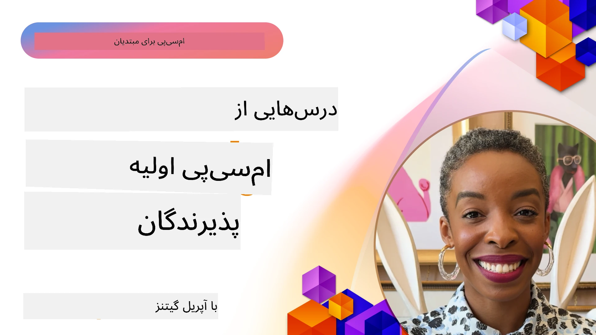

# 🌟 درس‌هایی از پذیرندگان اولیه

[](https://youtu.be/jds7dSmNptE)

_(برای مشاهده ویدئوی این درس روی تصویر بالا کلیک کنید)_

## 🎯 این ماژول چه موضوعاتی را پوشش می‌دهد

این ماژول بررسی می‌کند که چگونه سازمان‌ها و توسعه‌دهندگان واقعی از پروتکل مدل کانتکست (MCP) برای حل چالش‌های واقعی و پیشبرد نوآوری استفاده می‌کنند. از طریق مطالعات موردی دقیق، پروژه‌های عملی و مثال‌های کاربردی، شما کشف خواهید کرد که چگونه MCP امکان یکپارچه‌سازی ایمن و مقیاس‌پذیر هوش مصنوعی را فراهم می‌کند که مدل‌های زبانی، ابزارها، و داده‌های سازمانی را به هم متصل می‌سازد.

### 📚 مشاهده MCP در عمل

می‌خواهید اصول فوق را در ابزارهای آماده برای تولید ببینید؟ به سراغ [**۱۰ سرور MCP مایکروسافت که بهره‌وری توسعه‌دهندگان را متحول می‌کنند**](microsoft-mcp-servers.md) بروید، جایی که سرورهای واقعی MCP مایکروسافت و قابل استفاده امروز را مشاهده خواهید کرد.

## مرور کلی

این درس بررسی می‌کند که چگونه پذیرندگان اولیه از پروتکل مدل کانتکست (MCP) بهره برده‌اند تا چالش‌های دنیای واقعی را حل کرده و نوآوری را در صنایع مختلف پیش ببرند. از طریق مطالعات موردی دقیق و پروژه‌های عملی، خواهید دید که چگونه MCP امکان یکپارچه‌سازی استاندارد، امن و مقیاس‌پذیر هوش مصنوعی را فراهم می‌کند — اتصال مدل‌های زبان بزرگ، ابزارها و داده‌های سازمانی در یک چارچوب متحد. شما تجربه عملی در طراحی و ساخت راهکارهای مبتنی بر MCP کسب خواهید کرد، از الگوهای پیاده‌سازی اثبات شده خواهید آموخت و بهترین شیوه‌ها برای استقرار MCP در محیط‌های تولید را کشف خواهید کرد. این درس همچنین روندهای نوظهور، جهت‌گیری‌های آینده و منابع متن‌باز را برای کمک به شما در ماندن در صدر فناوری MCP و اکوسیستم در حال تحول آن برجسته می‌کند.

## اهداف یادگیری

- تحلیل پیاده‌سازی‌های واقعی MCP در صنایع مختلف  
- طراحی و ساخت کامل برنامه‌های مبتنی بر MCP  
- بررسی روندهای نوظهور و جهت‌گیری‌های آینده در فناوری MCP  
- به‌کارگیری بهترین شیوه‌ها در سناریوهای واقعی توسعه

## پیاده‌سازی‌های واقعی MCP

### مطالعه موردی ۱: خودکارسازی پشتیبانی مشتری سازمانی

یک شرکت چندملیتی راه‌حلی مبتنی بر MCP پیاده‌سازی کرد تا تعاملات هوش مصنوعی را در سراسر سیستم‌های پشتیبانی مشتری خود استانداردسازی کند. این امکان را فراهم کرد تا:

- رابطی یکپارچه برای چندین ارائه‌دهنده LLM ایجاد کنند  
- مدیریت سازگار Promptها بین بخش‌ها حفظ شود  
- کنترل‌های امنیتی و انطباق قوی پیاده‌سازی شود  
- به آسانی بین مدل‌های مختلف هوش مصنوعی بر اساس نیازهای خاص جابجا شوند

**پیاده‌سازی فنی:**

```python
# پیاده‌سازی سرور MCP پایتون برای پشتیبانی مشتری
import logging
import asyncio
from modelcontextprotocol import create_server, ServerConfig
from modelcontextprotocol.server import MCPServer
from modelcontextprotocol.transports import create_http_transport
from modelcontextprotocol.resources import ResourceDefinition
from modelcontextprotocol.prompts import PromptDefinition
from modelcontextprotocol.tool import ToolDefinition

# پیکربندی لاگ‌گیری
logging.basicConfig(level=logging.INFO)

async def main():
    # ایجاد پیکربندی سرور
    config = ServerConfig(
        name="Enterprise Customer Support Server",
        version="1.0.0",
        description="MCP server for handling customer support inquiries"
    )
    
    # مقداردهی اولیه سرور MCP
    server = create_server(config)
    
    # ثبت منابع پایگاه دانش
    server.resources.register(
        ResourceDefinition(
            name="customer_kb",
            description="Customer knowledge base documentation"
        ),
        lambda params: get_customer_documentation(params)
    )
    
    # ثبت قالب‌های پرامپت
    server.prompts.register(
        PromptDefinition(
            name="support_template",
            description="Templates for customer support responses"
        ),
        lambda params: get_support_templates(params)
    )
    
    # ثبت ابزارهای پشتیبانی
    server.tools.register(
        ToolDefinition(
            name="ticketing",
            description="Create and update support tickets"
        ),
        handle_ticketing_operations
    )
    
    # شروع سرور با انتقال HTTP
    transport = create_http_transport(port=8080)
    await server.run(transport)

if __name__ == "__main__":
    asyncio.run(main())
```
  
**نتایج:** کاهش ۳۰ درصدی هزینه‌های مدل، بهبود ۴۵ درصدی در سازگاری پاسخ‌ها، و ارتقاء انطباق در عملیات جهانی.

### مطالعه موردی ۲: دستیار تشخیص پزشکی

یک ارائه‌دهنده خدمات بهداشتی زیرساخت MCP را توسعه داد تا چندین مدل تخصصی پزشکی هوش مصنوعی را ادغام کند در حالی که از داده‌های حساس بیماران محافظت می‌کرد:

- جابجایی بدون درز بین مدل‌های پزشکی عمومی و تخصصی  
- کنترل‌های شدید حفظ حریم خصوصی و ردگیری حسابرسی  
- یکپارچه‌سازی با سیستم‌های موجود پرونده سلامت الکترونیکی (EHR)  
- مهندسی prompt سازگار برای اصطلاحات پزشکی

**پیاده‌سازی فنی:**

```csharp
// C# MCP host application implementation in healthcare application
using Microsoft.Extensions.DependencyInjection;
using ModelContextProtocol.SDK.Client;
using ModelContextProtocol.SDK.Security;
using ModelContextProtocol.SDK.Resources;

public class DiagnosticAssistant
{
    private readonly MCPHostClient _mcpClient;
    private readonly PatientContext _patientContext;
    
    public DiagnosticAssistant(PatientContext patientContext)
    {
        _patientContext = patientContext;
        
        // Configure MCP client with healthcare-specific settings
        var clientOptions = new ClientOptions
        {
            Name = "Healthcare Diagnostic Assistant",
            Version = "1.0.0",
            Security = new SecurityOptions
            {
                Encryption = EncryptionLevel.Medical,
                AuditEnabled = true
            }
        };
        
        _mcpClient = new MCPHostClientBuilder()
            .WithOptions(clientOptions)
            .WithTransport(new HttpTransport("https://healthcare-mcp.example.org"))
            .WithAuthentication(new HIPAACompliantAuthProvider())
            .Build();
    }
    
    public async Task<DiagnosticSuggestion> GetDiagnosticAssistance(
        string symptoms, string patientHistory)
    {
        // Create request with appropriate resources and tool access
        var resourceRequest = new ResourceRequest
        {
            Name = "patient_records",
            Parameters = new Dictionary<string, object>
            {
                ["patientId"] = _patientContext.PatientId,
                ["requestingProvider"] = _patientContext.ProviderId
            }
        };
        
        // Request diagnostic assistance using appropriate prompt
        var response = await _mcpClient.SendPromptRequestAsync(
            promptName: "diagnostic_assistance",
            parameters: new Dictionary<string, object>
            {
                ["symptoms"] = symptoms,
                patientHistory = patientHistory,
                relevantGuidelines = _patientContext.GetRelevantGuidelines()
            });
            
        return DiagnosticSuggestion.FromMCPResponse(response);
    }
}
```
  
**نتایج:** بهبود پیشنهادهای تشخیصی برای پزشکان در حالی که کاملاً منطبق با HIPAA باقی ماند و کاهش قابل توجه در جابجایی بین سیستم‌ها.

### مطالعه موردی ۳: تحلیل ریسک خدمات مالی

یک مؤسسه مالی MCP را به کار گرفت تا فرآیندهای تحلیل ریسک خود را بین بخش‌های مختلف استاندارد کند:

- ایجاد یک رابط یکپارچه برای مدل‌های ریسک اعتباری، تشخیص تقلب و ریسک سرمایه‌گذاری  
- پیاده‌سازی کنترل‌های دسترسی سختگیرانه و نسخه بندی مدل‌ها  
- اطمینان از حسابرسی تمام توصیه‌های هوش مصنوعی  
- حفظ قالب‌بندی داده‌ها به طور یکنواخت در سیستم‌های متنوع

**پیاده‌سازی فنی:**

```java
// سرور MCP جاوا برای ارزیابی ریسک مالی
import org.mcp.server.*;
import org.mcp.security.*;

public class FinancialRiskMCPServer {
    public static void main(String[] args) {
        // ایجاد سرور MCP با ویژگی‌های تطابق مالی
        MCPServer server = new MCPServerBuilder()
            .withModelProviders(
                new ModelProvider("risk-assessment-primary", new AzureOpenAIProvider()),
                new ModelProvider("risk-assessment-audit", new LocalLlamaProvider())
            )
            .withPromptTemplateDirectory("./compliance/templates")
            .withAccessControls(new SOCCompliantAccessControl())
            .withDataEncryption(EncryptionStandard.FINANCIAL_GRADE)
            .withVersionControl(true)
            .withAuditLogging(new DatabaseAuditLogger())
            .build();
            
        server.addRequestValidator(new FinancialDataValidator());
        server.addResponseFilter(new PII_RedactionFilter());
        
        server.start(9000);
        
        System.out.println("Financial Risk MCP Server running on port 9000");
    }
}
```
  
**نتایج:** بهبود انطباق نظارتی، ۴۰ درصد تسریع در چرخه‌های استقرار مدل، و افزایش سازگاری ارزیابی ریسک در بخش‌ها.

### مطالعه موردی ۴: سرور MCP مایکروسافت Playwright برای خودکارسازی مرورگر

مایکروسافت [سرور MCP Playwright](https://github.com/microsoft/playwright-mcp) را توسعه داد تا خودکارسازی مرورگر امن و استانداردسازی شده از طریق پروتکل مدل کانتکست ممکن شود. این سرور آماده برای تولید به عوامل هوش مصنوعی و LLM‌ها اجازه می‌دهد با مرورگرهای وب به صورت کنترل‌شده، قابل حسابرسی و قابل توسعه تعامل کنند — که موارد استفاده‌ای مانند تست وب خودکار، استخراج داده، و گردش‌کارهای انتها به انتها فراهم می‌کند.

> **🎯 ابزار آماده برای تولید**  
>  
> این مطالعه موردی سرور واقعی MCP است که شما امروز می‌توانید استفاده کنید! درباره سرور MCP Playwright و ۹ سرور آماده تولید دیگر مایکروسافت در [**راهنمای سرورهای MCP مایکروسافت**](microsoft-mcp-servers.md#8--playwright-mcp-server) بیشتر بیاموزید.

**ویژگی‌های کلیدی:**  
- ارائه توانایی‌های خودکارسازی مرورگر (ناوبری، پرکردن فرم‌ها، گرفتن اسکرین‌شات و غیره) به‌عنوان ابزارهای MCP  
- اعمال کنترل‌های دسترسی سختگیرانه و ایزوله‌سازی برای جلوگیری از اقدامات غیرمجاز  
- ارائه گزارش‌های حسابرسی دقیق برای تمام تعاملات مرورگر  
- پشتیبانی از ادغام با Azure OpenAI و دیگر ارائه‌دهندگان LLM برای خودکارسازی مبتنی بر عامل  
- نیرو بخشیدن به نماینده کد نویسی GitHub Copilot با قابلیت‌های مرور وب

**پیاده‌سازی فنی:**

```typescript
// تایپ‌اسکریپت: ثبت ابزارهای اتوماسیون مرورگر Playwright در سرور MCP
import { createServer, ToolDefinition } from 'modelcontextprotocol';
import { launch } from 'playwright';

const server = createServer({
  name: 'Playwright MCP Server',
  version: '1.0.0',
  description: 'MCP server for browser automation using Playwright'
});

// ثبت ابزاری برای رفتن به یک آدرس اینترنتی و گرفتن عکس از صفحه
server.tools.register(
  new ToolDefinition({
    name: 'navigate_and_screenshot',
    description: 'Navigate to a URL and capture a screenshot',
    parameters: {
      url: { type: 'string', description: 'The URL to visit' }
    }
  }),
  async ({ url }) => {
    const browser = await launch();
    const page = await browser.newPage();
    await page.goto(url);
    const screenshot = await page.screenshot();
    await browser.close();
    return { screenshot };
  }
);

// راه‌اندازی سرور MCP
server.listen(8080);
```
  
**نتایج:**  
- امکان خودکارسازی مرورگر برنامه‌ریزی شده، امن برای عوامل هوش مصنوعی و LLM‌ها  
- کاهش تلاش تست دستی و بهبود پوشش تست برنامه‌های وب  
- ارائه چارچوب قابل استفاده مجدد و قابل گسترش برای ادغام ابزار مبتنی بر مرورگر در محیط‌های سازمانی  
- تامین نیرو برای قابلیت‌های مرور وب GitHub Copilot

**مراجع:**  
- [مخزن GitHub سرور MCP Playwright](https://github.com/microsoft/playwright-mcp)  
- [راهکارهای هوش مصنوعی و خودکارسازی مایکروسافت](https://azure.microsoft.com/en-us/products/ai-services/)

### مطالعه موردی ۵: Azure MCP – پروتکل مدل کانتکست سازمانی به عنوان سرویس

سرور Azure MCP ([https://aka.ms/azmcp](https://aka.ms/azmcp)) پیاده‌سازی تحت مدیریت و سازمانی پروتکل مدل کانتکست توسط مایکروسافت است که با هدف ارائه امکانات سرور MCP مقیاس‌پذیر، امن و منطبق به‌عنوان سرویس ابری طراحی شده است. Azure MCP امکان استقرار سریع، مدیریت و ادغام سرورهای MCP با سرویس‌های هوش مصنوعی، داده و امنیت Azure را به سازمان‌ها می‌دهد، که باعث کاهش بار عملیاتی و تسریع پذیرش هوش مصنوعی می‌شود.

> **🎯 ابزار آماده برای تولید**  
>  
> این یک سرور واقعی MCP است که امروز می‌توانید استفاده کنید! درباره سرور Azure AI Foundry MCP در [**راهنمای سرورهای MCP مایکروسافت**](microsoft-mcp-servers.md) بیشتر بدانید.

- میزبانی کامل سرور MCP با مقیاس‌بندی، پایش و امنیت داخلی  
- ادغام بومی با Azure OpenAI، Azure AI Search و دیگر سرویس‌های Azure  
- احراز هویت و مجوز سازمانی از طریق Microsoft Entra ID  
- پشتیبانی از ابزارهای سفارشی، قالب‌های prompt و اتصالات منابع  
- انطباق با الزامات امنیتی و مقررات سازمانی

**پیاده‌سازی فنی:**

```yaml
# Example: Azure MCP server deployment configuration (YAML)
apiVersion: mcp.microsoft.com/v1
kind: McpServer
metadata:
  name: enterprise-mcp-server
spec:
  modelProviders:
    - name: azure-openai
      type: AzureOpenAI
      endpoint: https://<your-openai-resource>.openai.azure.com/
      apiKeySecret: <your-azure-keyvault-secret>
  tools:
    - name: document_search
      type: AzureAISearch
      endpoint: https://<your-search-resource>.search.windows.net/
      apiKeySecret: <your-azure-keyvault-secret>
  authentication:
    type: EntraID
    tenantId: <your-tenant-id>
  monitoring:
    enabled: true
    logAnalyticsWorkspace: <your-log-analytics-id>
```
  
**نتایج:**  
- کاهش زمان رسیدن به ارزش پروژه‌های هوش مصنوعی سازمانی با ارائه پلتفرم سرور MCP آماده و مطمئن  
- ساده‌سازی ادغام LLMها، ابزارها و منابع داده سازمانی  
- افزایش امنیت، قابلیت مشاهده و کارایی عملیاتی برای بارهای کاری MCP  
- بهبود کیفیت کد با بهترین شیوه‌های Azure SDK و الگوهای احراز هویت روز

**مراجع:**  
- [مستندات Azure MCP](https://aka.ms/azmcp)  
- [مخزن GitHub سرور Azure MCP](https://github.com/Azure/azure-mcp)  
- [سرویس‌های هوش مصنوعی Azure](https://azure.microsoft.com/en-us/products/ai-services/)  
- [مرکز MCP مایکروسافت](https://mcp.azure.com)

## مطالعه موردی ۶: NLWeb  
MCP (پروتکل مدل کانتکست) پروتکلی نوظهور برای چت‌بات‌ها و دستیارهای هوش مصنوعی برای تعامل با ابزارها است. هر نمونه NLWeb همچنین یک سرور MCP است که یک روش اصلی به نام ask را پشتیبانی می‌کند که برای پرسیدن سؤال به یک وب‌سایت به زبان طبیعی به کار می‌رود. پاسخ بازگردانده شده از schema.org استفاده می‌کند، واژگانی گسترده برای توصیف داده‌های وب. به صورت کلی، MCP مانند NLWeb نسبت به Http مانند HTML است. NLWeb پروتکل‌ها، فرمت‌های Schema.org و کد نمونه را ترکیب می‌کند تا سایت‌ها بتوانند به سرعت این نقاط انتهایی را ایجاد کنند و هم به انسان‌ها از طریق رابط‌های مکالمه‌ای و هم ماشین‌ها از طریق تعامل طبیعی عامل-به-عامل کمک کند.

دو جزء متمایز در NLWeb وجود دارد:  
- یک پروتکل ساده برای شروع، برای برقراری ارتباط با سایت به زبان طبیعی و یک فرمت جواب که از json و schema.org استفاده می‌کند. مستندات API REST برای جزئیات بیشتر موجود است.  
- پیاده‌سازی ساده (۱) که از نشانه‌گذاری موجود استفاده می‌کند، برای سایت‌هایی که می‌توان آنها را به فهرست موارد (محصولات، دستور پخت‌ها، جاذبه‌ها، بررسی‌ها و غیره) خلاصه کرد. همراه با مجموعه‌ای از ویجت‌های رابط کاربری، سایت‌ها می‌توانند به آسانی رابط‌های مکالمه‌ای به محتوای خود ارائه دهند. مستندات «زندگی یک پرسش چت» برای جزئیات بیشتر در دسترس است.

**مراجع:**  
- [مستندات Azure MCP](https://aka.ms/azmcp)  
- [NLWeb](https://github.com/microsoft/NlWeb)

### مطالعه موردی ۷: سرور Azure AI Foundry MCP – ادغام عامل هوش مصنوعی سازمانی

سرورهای Azure AI Foundry MCP نشان می‌دهند که چگونه MCP می‌تواند برای هماهنگ‌سازی و مدیریت عوامل و گردش‌کارهای هوش مصنوعی در محیط‌های سازمانی مورد استفاده قرار گیرد. با ادغام MCP با Azure AI Foundry، سازمان‌ها می‌توانند تعاملات عامل را استاندارد کنند، از مدیریت گردش‌کار Foundry بهره ببرند و استقرارهای امن و مقیاس‌پذیر را تضمین کنند.

> **🎯 ابزار آماده برای تولید**  
>  
> این یک سرور واقعی MCP است که امروز می‌توانید استفاده کنید! درباره سرور Azure AI Foundry MCP در [**راهنمای سرورهای MCP مایکروسافت**](microsoft-mcp-servers.md#9--azure-ai-foundry-mcp-server) بیشتر بیاموزید.

**ویژگی‌های کلیدی:**  
- دسترسی کامل به اکوسیستم هوش مصنوعی Azure، شامل کاتالوگ مدل‌ها و مدیریت استقرار  
- نمایه‌سازی دانش با Azure AI Search برای کاربردهای RAG  
- ابزارهای ارزیابی عملکرد و تضمین کیفیت مدل‌های هوش مصنوعی  
- ادغام با Azure AI Foundry Catalog و Labs برای مدل‌های تحقیقاتی پیشرفته  
- قابلیت مدیریت و ارزیابی عامل‌ها برای سناریوهای تولید

**نتایج:**  
- نمونه‌سازی سریع و نظارت مستحکم بر گردش‌کار عوامل هوش مصنوعی  
- ادغام بی‌نقص با سرویس‌های هوش مصنوعی Azure برای سناریوهای پیشرفته  
- رابط کاربری متحد برای ساخت، استقرار و نظارت بر خطوط لوله عامل  
- ارتقای امنیت، انطباق و بهره‌وری عملیاتی برای سازمان‌ها  
- تسریع پذیرش هوش مصنوعی در حالی که کنترل بر فرآیندهای پیچیده مبتنی بر عامل حفظ می‌شود

**مراجع:**  
- [مخزن GitHub سرور Azure AI Foundry MCP](https://github.com/azure-ai-foundry/mcp-foundry)  
- [ادغام عوامل هوش مصنوعی Azure با MCP (وبلاگ Microsoft Foundry)](https://devblogs.microsoft.com/foundry/integrating-azure-ai-agents-mcp/)

### مطالعه موردی ۸: زمین بازی Foundry MCP – آزمایش و نمونه‌سازی

زمین بازی Foundry MCP محیطی آماده استفاده برای آزمایش سرورهای MCP و ادغام‌های Azure AI Foundry فراهم می‌کند. توسعه‌دهندگان می‌توانند به سرعت نمونه‌سازی، آزمایش و ارزیابی مدل‌های هوش مصنوعی و گردش‌کار عامل‌ها را با استفاده از منابع Azure AI Foundry Catalog و Labs انجام دهند. این زمین بازی تنظیم را ساده می‌کند، پروژه‌های نمونه ارائه می‌دهد و توسعه تعاملی را پشتیبانی می‌کند، که بررسی بهترین شیوه‌ها و سناریوهای جدید را با حداقل سربار ممکن می‌سازد. این ابزار به ویژه برای تیم‌هایی که به دنبال اعتبارسنجی ایده‌ها، به اشتراک‌گذاری آزمایش‌ها و تسریع یادگیری بدون نیاز به زیرساخت‌های پیچیده هستند، مفید است. با پایین آوردن موانع ورود، این زمین بازی به تقویت نوآوری و مشارکت‌های جامعه در اکوسیستم MCP و Azure AI Foundry کمک می‌کند.

**مراجع:**  

- [مخزن GitHub زمین بازی Foundry MCP](https://github.com/azure-ai-foundry/foundry-mcp-playground)

### مطالعه موردی ۹: سرور MCP مستندات Microsoft Learn – دسترسی به مستندات با پشتیبانی هوش مصنوعی

سرور MCP مستندات Microsoft Learn سرویسی ابری است که به دستیارهای هوش مصنوعی دسترسی بلادرنگ به مستندات رسمی مایکروسافت از طریق پروتکل مدل کانتکست می‌دهد. این سرور آماده برای تولید به اکوسیستم جامع Microsoft Learn متصل شده و جستجوی معنایی در تمام منابع رسمی مایکروسافت را ممکن می‌سازد.

> **🎯 ابزار آماده برای تولید**  
>  
> این یک سرور واقعی MCP است که امروز می‌توانید استفاده کنید! درباره سرور MCP مستندات Microsoft Learn در [**راهنمای سرورهای MCP مایکروسافت**](microsoft-mcp-servers.md#1--microsoft-learn-docs-mcp-server) بیشتر بدانید.

**ویژگی‌های کلیدی:**  
- دسترسی بلادرنگ به مستندات رسمی مایکروسافت، مستندات Azure و مستندات Microsoft 365  
- امکانات پیشرفته جستجوی معنایی که زمینه و نیت را درک می‌کند  
- اطلاعات همیشه به‌روز با انتشار محتوای Microsoft Learn  
- پوشش جامع از Microsoft Learn، مستندات Azure و منابع Microsoft 365  
- بازگردانی تا ۱۰ قطعه محتوای با کیفیت همراه با عنوان مقاله و نشانی اینترنتی

**چرا اهمیت دارد:**  
- حل مشکل «دانش منسوخ هوش مصنوعی» برای فناوری‌های مایکروسافت  
- تضمین دسترسی دستیارهای هوش مصنوعی به جدیدترین ویژگی‌های .NET، C#، Azure و Microsoft 365  
- ارائه اطلاعات معتبر و رسمی برای تولید دقیق کد  
- ضروری برای توسعه‌دهندگانی که با فناوری‌های در حال رشد سریع مایکروسافت کار می‌کنند

**نتایج:**  
- بهبود چشمگیر دقت کد تولید شده توسط هوش مصنوعی برای فناوری‌های مایکروسافت  
- کاهش زمان صرف شده برای جستجوی مستندات به‌روز و بهترین شیوه‌ها  
- افزایش بهره‌وری توسعه‌دهنده با بازیابی مستندات مبتنی بر زمینه  
- ادغام بی‌نقص با گردش‌کارهای توسعه بدون ترک محیط IDE

**مراجع:**  
- [مخزن GitHub سرور MCP مستندات Microsoft Learn](https://github.com/MicrosoftDocs/mcp)  
- [مستندات Microsoft Learn](https://learn.microsoft.com/)

## پروژه‌های عملی

### پروژه ۱: ساخت سرور MCP چند ارائه‌دهنده

**هدف:** ایجاد سرور MCP که بتواند درخواست‌ها را بر اساس معیارهای مشخص به چندین ارائه‌دهنده مدل هوش مصنوعی هدایت کند.

**الزامات:**

- پشتیبانی از حداقل سه ارائه‌دهنده مدل متفاوت (مانند OpenAI، Anthropic، مدل‌های محلی)  
- پیاده‌سازی مکانیزم هدایت بر اساس فراداده درخواست  
- ایجاد سیستم پیکربندی برای مدیریت اعتبارنامه ارائه‌دهندگان  
- افزودن کش برای بهینه‌سازی عملکرد و هزینه‌ها  
- ساخت داشبورد ساده برای نظارت بر مصرف

**مراحل پیاده‌سازی:**

1. راه‌اندازی زیرساخت پایه سرور MCP  
2. پیاده‌سازی آداپتورها برای هر سرویس مدل هوش مصنوعی  
3. ایجاد منطق هدایت بر اساس ویژگی‌های درخواست  
4. افزودن مکانیزم‌های کش برای درخواست‌های پرتکرار  
5. توسعه داشبورد نظارتی  
6. تست با الگوهای مختلف درخواست

**فناوری‌ها:** انتخاب از پایتون (.NET/Java/Python بر اساس ترجیح شما)، Redis برای کش، و یک چارچوب وب ساده برای داشبورد.

### پروژه ۲: سامانه مدیریت prompt سازمانی
**هدف:** توسعه سامانه‌ای مبتنی بر MCP برای مدیریت، نسخه‌بندی و استقرار قالب‌های پرامپت در سراسر سازمان.

**نیازمندی‌ها:**

- ایجاد مخزن مرکزی برای قالب‌های پرامپت
- پیاده‌سازی نسخه‌بندی و جریان‌های کاری تایید
- ساخت قابلیت‌های تست قالب با ورودی‌های نمونه
- توسعه کنترل‌های دسترسی مبتنی بر نقش
- ایجاد یک API برای بازیابی و استقرار قالب‌ها

**مراحل پیاده‌سازی:**

1. طراحی طرحواره پایگاه داده برای ذخیره قالب‌ها
2. ایجاد API اصلی برای عملیات CRUD قالب‌ها
3. پیاده‌سازی سیستم نسخه‌بندی
4. ساخت جریان کاری تایید
5. توسعه چارچوب تست
6. ایجاد یک رابط وب ساده برای مدیریت
7. یکپارچه‌سازی با سرور MCP

**فناوری‌ها:** انتخاب چارچوب بک‌اند مورد نظر شما، پایگاه داده SQL یا NoSQL، و چارچوب فرانت‌اند برای رابط مدیریت.

### پروژه ۳: پلتفرم تولید محتوا مبتنی بر MCP

**هدف:** ساخت پلتفرمی برای تولید محتوا که از MCP بهره می‌برد تا نتایج یکنواختی در انواع مختلف محتوا ارائه دهد.

**نیازمندی‌ها:**

- پشتیبانی از فرمت‌های مختلف محتوا (مقالات وبلاگ، شبکه‌های اجتماعی، متون بازاریابی)
- پیاده‌سازی تولید مبتنی بر قالب با گزینه‌های سفارشی‌سازی
- ایجاد سیستم بررسی و بازخورد محتوا
- ردیابی شاخص‌های عملکرد محتوا
- پشتیبانی از نسخه‌بندی و تکرار محتوا

**مراحل پیاده‌سازی:**

1. راه‌اندازی زیرساخت کلاینت MCP
2. ایجاد قالب‌ها برای انواع مختلف محتوا
3. ساخت خط لوله تولید محتوا
4. پیاده‌سازی سیستم بررسی
5. توسعه سیستم ردیابی شاخص‌ها
6. ایجاد رابط کاربری برای مدیریت قالب‌ها و تولید محتوا

**فناوری‌ها:** زبان برنامه‌نویسی، چارچوب وب، و سیستم پایگاه داده مورد علاقه شما.

## جهت‌های آینده فناوری MCP

### روندهای نوظهور

1. **MCP چندرسانه‌ای**
   - توسعه MCP برای استانداردسازی تعاملات با مدل‌های تصویر، صوت و ویدئو
   - توسعه توانایی‌های استدلال چندرسانه‌ای
   - قالب‌های استاندارد پرامپت برای مدالیته‌های مختلف

2. **زیرساخت فدرال MCP**
   - شبکه‌های توزیع‌شده MCP که می‌توانند منابع را بین سازمان‌ها به اشتراک بگذارند
   - پروتکل‌های استاندارد برای اشتراک‌گذاری امن مدل‌ها
   - تکنیک‌های محاسبات حفظ‌کننده حریم خصوصی

3. **بازارهای MCP**
   - اکوسیستم‌هایی برای اشتراک‌گذاری و کسب درآمد از قالب‌ها و افزونه‌های MCP
   - فرایندهای تضمین کیفیت و صدور گواهی
   - ادغام با بازارهای مدل

4. **MCP برای رایانش مرزی**
   - تطبیق استانداردهای MCP برای دستگاه‌های لبه‌ای با منابع محدود
   - پروتکل‌های بهینه برای محیط‌های کم‌عرض‌باند
   - پیاده‌سازی‌های تخصصی MCP برای اکوسیستم‌های IoT

5. **چارچوب‌های قانونی**
   - توسعه افزونه‌های MCP برای انطباق با مقررات
   - سوابق حسابرسی استاندارد و رابط‌های قابلیت توضیح
   - ادغام با چارچوب‌های نوظهور حاکمیت هوش مصنوعی

### راهکارهای MCP از مایکروسافت

مایکروسافت و Azure چندین مخزن متن‌باز را برای کمک به توسعه‌دهندگان جهت پیاده‌سازی MCP در سناریوهای مختلف توسعه داده‌اند:

#### سازمان Microsoft

1. [playwright-mcp](https://github.com/microsoft/playwright-mcp) - سرور MCP Playwright برای اتوماسیون مرورگر و تست
2. [files-mcp-server](https://github.com/microsoft/files-mcp-server) - پیاده‌سازی سرور MCP OneDrive برای تست محلی و مشارکت جامعه
3. [NLWeb](https://github.com/microsoft/NlWeb) - NLWeb مجموعه‌ای از پروتکل‌های باز و ابزارهای متن‌باز مرتبط است. تمرکز اصلی آن بر ایجاد لایه پایه برای وب هوش مصنوعی است

#### سازمان Azure-Samples

1. [mcp](https://github.com/Azure-Samples/mcp) - لینک به نمونه‌ها، ابزارها، و منابع برای ساخت و یکپارچه‌سازی سرورهای MCP در Azure با زبان‌های مختلف
2. [mcp-auth-servers](https://github.com/Azure-Samples/mcp-auth-servers) - نمونه‌های سرور MCP که احراز هویت با مشخصات فعلی Model Context Protocol را نشان می‌دهند
3. [remote-mcp-functions](https://github.com/Azure-Samples/remote-mcp-functions) - صفحه فرود برای پیاده‌سازی‌های Remote MCP Server در Azure Functions با لینک به مخازن زبان‌های مختلف
4. [remote-mcp-functions-python](https://github.com/Azure-Samples/remote-mcp-functions-python) - قالب شروع سریع برای ساخت و استقرار سرورهای MCP راه دور سفارشی با استفاده از Azure Functions و پایتون
5. [remote-mcp-functions-dotnet](https://github.com/Azure-Samples/remote-mcp-functions-dotnet) - قالب شروع سریع برای ساخت و استقرار سرورهای MCP راه دور سفارشی با استفاده از Azure Functions و .NET/C#
6. [remote-mcp-functions-typescript](https://github.com/Azure-Samples/remote-mcp-functions-typescript) - قالب شروع سریع برای ساخت و استقرار سرورهای MCP راه دور سفارشی با Azure Functions و TypeScript
7. [remote-mcp-apim-functions-python](https://github.com/Azure-Samples/remote-mcp-apim-functions-python) - مدیریت API Azure به عنوان دروازه AI به سرورهای MCP راه دور با استفاده از پایتون
8. [AI-Gateway](https://github.com/Azure-Samples/AI-Gateway) - تجربیات APIM ❤️ AI شامل قابلیت‌های MCP، ادغام با Azure OpenAI و AI Foundry

این مخازن پیاده‌سازی‌ها، قالب‌ها و منابع متنوعی را برای کار با Model Context Protocol در زبان‌ها و سرویس‌های مختلف Azure فراهم می‌کنند. آنها طیف وسیعی از کاربردها از پیاده‌سازی‌های پایه سرور تا احراز هویت، استقرار در ابر و سناریوهای یکپارچگی سازمانی را پوشش می‌دهند.

#### دایرکتوری منابع MCP

دایرکتوری [MCP Resources](https://github.com/microsoft/mcp/tree/main/Resources) در مخزن رسمی MCP مایکروسافت مجموعه‌ای گزیده از نمونه منابع، قالب پرامپت‌ها و تعاریف ابزار برای استفاده با سرورهای Model Context Protocol را فراهم می‌کند. این دایرکتوری برای کمک به توسعه‌دهندگان جهت آغاز سریع با MCP با ارائه بلوک‌های ساختاری قابل استفاده مجدد و مثال‌های بهترین شیوه طراحی شده است برای:

- **قالب‌های پرامپت:** قالب‌های آماده برای استفاده در وظایف و سناریوهای رایج هوش مصنوعی که می‌توان آنها را برای پیاده‌سازی‌های سرور MCP خودتان تطبیق داد.
- **تعاریف ابزار:** نمونه‌هایی از طرحواره‌ها و متادیتای ابزار برای استانداردسازی ادغام و فراخوانی ابزارها در سرورهای مختلف MCP.
- **نمونه منابع:** تعاریف نمونه منابع برای اتصال به منابع داده، APIها و سرویس‌های خارجی در چارچوب MCP.
- **پیاده‌سازی‌های مرجع:** نمونه‌های عملی که نشان می‌دهند چگونه منابع، پرامپت‌ها و ابزارها را در پروژه‌های واقعی MCP ساختارمند و سازماندهی کنیم.

این منابع توسعه را تسریع می‌کنند، استانداردسازی را ترویج می‌دهند و کمک می‌کنند بهترین شیوه‌ها هنگام ساخت و استقرار راهکارهای مبتنی بر MCP پیاده‌سازی شود.

#### دایرکتوری منابع MCP

- [MCP Resources (نمونه پرامپت‌ها، ابزارها و تعاریف منابع)](https://github.com/microsoft/mcp/tree/main/Resources)

### فرصت‌های پژوهشی

- تکنیک‌های بهینه‌سازی موثر پرامپت در چارچوب‌های MCP
- مدل‌های امنیتی برای استقرارهای چند مستأجر MCP
- معیارسنجی عملکرد در پیاده‌سازی‌های مختلف MCP
- روش‌های اثبات رسمی برای سرورهای MCP

## نتیجه‌گیری

پروتکل مدل کانتکست (MCP) به سرعت آینده یکپارچه‌سازی استاندارد، امن و متعامل هوش مصنوعی در صنایع مختلف را شکل می‌دهد. از طریق مطالعات موردی و پروژه‌های عملی در این درس، شما دیدید که چگونه پیشروان اولیه—از جمله مایکروسافت و Azure—از MCP برای حل چالش‌های دنیای واقعی، تسریع پذیرش هوش مصنوعی و اطمینان از تطابق، امنیت و مقیاس‌پذیری استفاده می‌کنند. رویکرد مدولار MCP به سازمان‌ها اجازه می‌دهد مدل‌های زبان بزرگ، ابزارها و داده‌های سازمانی را در یک چارچوب واحد و قابل حسابرسی متصل کنند. با ادامه تکامل MCP، مشارکت در جامعه، کاوش منابع متن‌باز و به‌کارگیری بهترین شیوه‌ها کلید ساخت راهکارهای مقاوم و آماده برای آینده هوش مصنوعی خواهد بود.

## منابع بیشتر

- [مخزن MCP Foundry در گیت‌هاب](https://github.com/azure-ai-foundry/mcp-foundry)
- [محیط آزمایشی Foundry MCP](https://github.com/azure-ai-foundry/foundry-mcp-playground)
- [ادغام عوامل هوش مصنوعی Azure با MCP (وبلاگ Microsoft Foundry)](https://devblogs.microsoft.com/foundry/integrating-azure-ai-agents-mcp/)
- [مخزن MCP در گیت‌هاب (مایکروسافت)](https://github.com/microsoft/mcp)
- [دایرکتوری منابع MCP (نمونه پرامپت‌ها، ابزارها و تعاریف منابع)](https://github.com/microsoft/mcp/tree/main/Resources)
- [جامعه و مستندات MCP](https://modelcontextprotocol.io/introduction)
- [مشخصات MCP (2025-11-25)](https://spec.modelcontextprotocol.io/specification/2025-11-25/)
- [مستندات Azure MCP](https://aka.ms/azmcp)
- [ده خطر برتر MCP از OWASP](https://microsoft.github.io/mcp-azure-security-guide/mcp/) - بهترین شیوه‌های امنیتی
- [مخزن سرور Playwright MCP در گیت‌هاب](https://github.com/microsoft/playwright-mcp)
- [سرور MCP پرونده‌ها (OneDrive)](https://github.com/microsoft/files-mcp-server)
- [نمونه‌های MCP Azure](https://github.com/Azure-Samples/mcp)
- [سرورهای احراز هویت MCP (Azure-Samples)](https://github.com/Azure-Samples/mcp-auth-servers)
- [توابع MCP راه دور (Azure-Samples)](https://github.com/Azure-Samples/remote-mcp-functions)
- [توابع MCP راه دور پایتون (Azure-Samples)](https://github.com/Azure-Samples/remote-mcp-functions-python)
- [توابع MCP راه دور .NET (Azure-Samples)](https://github.com/Azure-Samples/remote-mcp-functions-dotnet)
- [توابع MCP راه دور TypeScript (Azure-Samples)](https://github.com/Azure-Samples/remote-mcp-functions-typescript)
- [توابع MCP APIM راه دور پایتون (Azure-Samples)](https://github.com/Azure-Samples/remote-mcp-apim-functions-python)
- [دروازه AI (Azure-Samples)](https://github.com/Azure-Samples/AI-Gateway)
- [راهکارهای هوش مصنوعی و اتوماسیون مایکروسافت](https://azure.microsoft.com/en-us/products/ai-services/)

## تمرین‌ها

1. یکی از مطالعات موردی را تحلیل و رویکرد جایگزینی برای پیاده‌سازی پیشنهاد دهید.
2. یکی از ایده‌های پروژه را انتخاب و مشخصات فنی دقیقی ایجاد کنید.
3. یک صنعت که در مطالعات موردی پوشش داده نشده را بررسی و شرح دهید MCP چگونه می‌تواند چالش‌های خاص آن را برطرف کند.
4. یکی از جهت‌های آینده را بررسی و مفهومی برای افزونه جدید MCP به منظور پشتیبانی از آن ایجاد کنید.

## گام بعدی

کاوش بیشتر: [سرورهای MCP مایکروسافت](./microsoft-mcp-servers.md)

ادامه به: [ماژول ۸: بهترین شیوه‌ها](../08-BestPractices/README.md)

---

<!-- CO-OP TRANSLATOR DISCLAIMER START -->
**سلب مسؤولیت**:
این سند با استفاده از سرویس ترجمه هوش مصنوعی [Co-op Translator](https://github.com/Azure/co-op-translator) ترجمه شده است. در حالی که ما در تلاش برای دقت هستیم، لطفاً توجه داشته باشید که ترجمه‌های خودکار ممکن است حاوی اشتباهات یا نادرستی‌هایی باشند. سند اصلی به زبان مادری خود باید به‌عنوان منبع معتبر در نظر گرفته شود. برای اطلاعات حیاتی، توصیه می‌شود از ترجمه حرفه‌ای انسانی استفاده شود. ما مسئول هیچ گونه سوءتفاهم یا تفسیر نادرستی که ناشی از استفاده از این ترجمه باشد، نیستیم.
<!-- CO-OP TRANSLATOR DISCLAIMER END -->