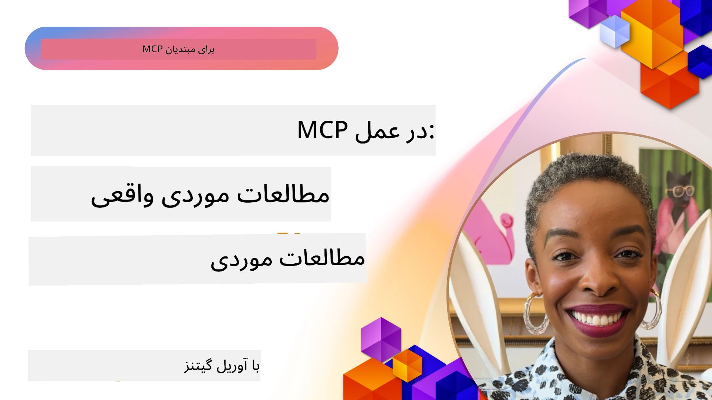

# MCP در عمل: مطالعات موردی واقعی

_(برای دیدن ویدئوی این درس روی تصویر بالا کلیک کنید)_

پروتکل زمینه مدل (MCP) در حال تغییر نحوه تعامل برنامه‌های هوش مصنوعی با داده‌ها، ابزارها و خدمات است. این بخش مطالعات موردی واقعی را ارائه می‌دهد که کاربردهای عملی MCP را در سناریوهای مختلف سازمانی نشان می‌دهد.

## مروری کلی

این بخش نمونه‌های مشخصی از پیاده‌سازی‌های MCP را به نمایش می‌گذارد و نشان می‌دهد که چگونه سازمان‌ها از این پروتکل برای حل چالش‌های پیچیده کسب‌وکار بهره می‌برند. با بررسی این مطالعات موردی، درک بهتری از انعطاف‌پذیری، مقیاس‌پذیری و مزایای عملی MCP در سناریوهای واقعی خواهید داشت.

## اهداف کلیدی یادگیری

با بررسی این مطالعات موردی، شما:

- درک می‌کنید چگونه MCP می‌تواند برای حل مشکلات خاص کسب‌وکار به کار رود
- با الگوهای مختلف ادغام و رویکردهای معماری آشنا می‌شوید
- بهترین روش‌های پیاده‌سازی MCP در محیط‌های سازمانی را می‌شناسید
- بینش‌هایی درباره چالش‌ها و راه‌حل‌های به‌کار رفته در پیاده‌سازی‌های واقعی کسب می‌کنید
- فرصت‌هایی برای استفاده از الگوهای مشابه در پروژه‌های خود شناسایی می‌کنید

## مطالعات موردی برجسته

### 1. [نمایش مرجع Azure AI Travel Agents](./travelagentsample.md)

این مطالعه موردی راه‌حل مرجع جامع مایکروسافت را بررسی می‌کند که نشان می‌دهد چگونه می‌توان یک برنامه برنامه‌ریزی سفر چندعاملی و مجهز به هوش مصنوعی را با استفاده از MCP، Azure OpenAI و Azure AI Search ساخت. این پروژه شامل:

- هماهنگی چندعاملی از طریق MCP
- ادغام داده‌های سازمانی با Azure AI Search
- معماری امن و مقیاس‌پذیر با استفاده از خدمات Azure
- ابزارهای توسعه‌پذیر با اجزای قابل استفاده مجدد MCP
- تجربه کاربری مکالمه‌ای با قدرت Azure OpenAI

جزئیات معماری و پیاده‌سازی بینش‌های ارزشمندی در ساخت سیستم‌های چندعاملی پیچیده با MCP به عنوان لایه هماهنگی ارائه می‌دهد.

### 2. [به‌روزرسانی آیتم‌های Azure DevOps از داده‌های YouTube](./UpdateADOItemsFromYT.md)

این مطالعه موردی کاربرد عملی MCP برای اتوماسیون فرایندهای کاری را نشان می‌دهد. این مورد توضیح می‌دهد چگونه ابزارهای MCP می‌توانند:

- استخراج داده از پلتفرم‌های آنلاین (YouTube)
- به‌روزرسانی آیتم‌های کاری در سیستم‌های Azure DevOps
- ایجاد گردش‌های کاری خودکار قابل تکرار
- ادغام داده‌ها در سیستم‌های مختلف

این مثال نشان می‌دهد که چگونه حتی پیاده‌سازی‌های نسبتاً ساده MCP می‌توانند با خودکارسازی وظایف روزمره و بهبود انسجام داده‌ها در سیستم‌ها به کارایی قابل‌توجهی دست یابند.

### 3. [بازیابی اسناد بلادرنگ با MCP](./docs-mcp/README.md)

در این مطالعه موردی نحوه اتصال یک کلاینت کنسول پایتون به سرور Model Context Protocol (MCP) برای بازیابی و ثبت اسناد مایکروسافت به صورت بلادرنگ و آگاه از زمینه آموزش داده می‌شود. شما یاد خواهید گرفت که چگونه:

- به سرور MCP با استفاده از کلاینت پایتون و SDK رسمی MCP متصل شوید
- از کلاینت‌های HTTP استریمینگ برای بازیابی کارآمد و بلادرنگ داده‌ها استفاده کنید
- ابزارهای اسناد را روی سرور صدا زده و پاسخ‌ها را مستقیماً در کنسول ثبت کنید
- اسناد به‌روز مایکروسافت را بدون ترک ترمینال در جریان کاری خود ادغام کنید

این فصل شامل یک تمرین عملی، نمونه کد حداقلی کاری، و لینک‌هایی به منابع بیشتر برای یادگیری عمیق‌تر است. راهنمای کامل و کد نمونه در فصل مرتبط قابل مشاهده است تا درک کنید MCP چگونه می‌تواند دسترسی به اسناد و بهره‌وری توسعه‌دهنده را در محیط‌های مبتنی بر کنسول متحول کند.

### 4. [وب اپلیکیشن مولد برنامه مطالعه تعاملی با MCP](./docs-mcp/README.md)

این مطالعه موردی نشان می‌دهد چگونه می‌توان یک اپلیکیشن وب تعاملی با استفاده از Chainlit و Model Context Protocol (MCP) ساخت که برنامه‌های مطالعه شخصی‌سازی‌شده برای هر موضوعی تولید می‌کند. کاربران می‌توانند موضوعی مانند «گواهینامه AI-900» و مدت زمان مطالعه (مثلاً ۸ هفته) را مشخص کنند و این اپ برنامه‌ای با تقسیم‌بندی هفتگی محتوای پیشنهادی ارائه می‌دهد. Chainlit یک رابط چت مکالمه‌ای فراهم می‌کند که تجربه را جذاب و تطبیقی می‌کند.

- اپ وب مکالمه‌ای با قدرت Chainlit
- درخواست‌های کاربر محور برای موضوع و مدت زمان
- توصیه‌های محتوا به صورت هفتگی با استفاده از MCP
- پاسخ‌های بلادرنگ و تطبیقی در رابط چت

این پروژه نشان می‌دهد چگونه هوش مصنوعی مکالمه‌ای و MCP می‌توانند ترکیب شوند تا ابزارهای آموزشی پویا و کاربر محور در محیط وب مدرن خلق کنند.

### 5. [اسناد درون ویرایشگر با سرور MCP در VS Code](./docs-mcp/README.md)

این مطالعه موردی نشان می‌دهد چگونه می‌توان اسناد Microsoft Learn Docs را مستقیماً در محیط VS Code با استفاده از سرور MCP آورد—دیگر نیازی به جابجایی بین تب‌های مرورگر نیست! خواهید دید چگونه:

- جستجو و خواندن فوری اسناد در VS Code با استفاده از پنل MCP یا palette فرمان
- ارجاع مستندات و درج لینک‌ها به طور مستقیم در فایل README یا فایل‌های markdown دوره
- استفاده ترکیبی از GitHub Copilot و MCP برای گردش کار بدون درز و هوشمند اسناد و کد
- اعتبارسنجی و بهبود اسناد با بازخورد بلادرنگ و دقت منبع‌شده از مایکروسافت
- ادغام MCP با گردش کارهای GitHub برای اعتبارسنجی مستمر اسناد

پیاده‌سازی شامل:

- پیکربندی نمونه `.vscode/mcp.json` برای راه‌اندازی آسان
- راهنمای تصویری تجربه درون ویرایشگر
- نکاتی برای ترکیب Copilot و MCP برای حداکثر بهره‌وری

این سناریو برای نویسندگان دوره، نویسندگان مستندات و توسعه‌دهندگانی ایده‌آل است که می‌خواهند در ویرایشگر خود متمرکز بمانند و همزمان با اسناد، Copilot و ابزارهای اعتبارسنجی کار کنند—همه با قدرت MCP.

### 6. [ایجاد سرور MCP با APIM](./apimsample.md)

این مطالعه موردی راهنمای گام‌به‌گام ایجاد سرور MCP با استفاده از Azure API Management (APIM) را ارائه می‌دهد. موضوعات پوشش داده شده:

- راه‌اندازی سرور MCP در Azure API Management
- معرفی عملیات API به عنوان ابزارهای MCP
- پیکربندی سیاست‌ها برای محدودیت نرخ و امنیت
- آزمایش سرور MCP با استفاده از Visual Studio Code و GitHub Copilot

این مثال نشان می‌دهد چگونه می‌توان از قابلیت‌های Azure برای ایجاد یک سرور MCP قدرتمند استفاده کرد که در برنامه‌های مختلف بهبود ادغام سیستم‌های هوش مصنوعی با APIهای سازمانی را ممکن می‌سازد.

### 7. [ثبت MCP گیت‌هاب — تسریع ادغام عامل‌محور](https://github.com/mcp)

این مطالعه موردی بررسی می‌کند که چگونه ثبت MCP گیت‌هاب که در سپتامبر ۲۰۲۵ راه‌اندازی شد، یک چالش حیاتی در اکوسیستم هوش مصنوعی را حل می‌کند: یافتن تجزیه‌شده و پراکنده سرورهای Model Context Protocol (MCP).

#### مروری کلی
**ثبت MCP** مشکل پراکندگی سرورهای MCP در مخازن و رجیستری‌ها را که قبلاً ادغام را کند و پرخطا می‌کرد، حل می‌کند. این سرورها امکان تعامل عوامل هوش مصنوعی با سیستم‌های خارجی مانند APIها، بانک‌های اطلاعاتی و منابع مستندات را فراهم می‌کنند.

#### بیان مسئله
توسعه‌دهندگان گردش‌های کاری عامل‌محور با چالش‌های متعددی روبرو بودند:
- **کشف‌پذیری ضعیف** سرورهای MCP در پلتفرم‌های مختلف
- **پرسش‌های تکراری راه‌اندازی** پراکنده در انجمن‌ها و مستندات
- **ریسک‌های امنیتی** از منابع تأییدنشده و غیرقابل اعتماد
- **نبود استانداردسازی** در کیفیت و سازگاری سرورها

#### معماری راه‌حل
ثبت MCP گیت‌هاب سرورهای معتبر MCP را با ویژگی‌های کلیدی متمرکز می‌کند:
- **نصب با یک کلیک** ادغام از طریق VS Code برای راه‌اندازی ساده
- **مرتب‌سازی سیگنال بر نویز** بر اساس ستاره‌ها، فعالیت و اعتبار سنجی جامعه
- **ادغام مستقیم** با GitHub Copilot و سایر ابزارهای سازگار با MCP
- **مدل مشارکت باز** امکان مشارکت جامعه و شرکای سازمانی را فراهم می‌کند

#### تأثیر کسب‌وکار
این رجیستری به بهبودهای مشهود منجر شده است:
- **سرعت بیشتر در شروع به کار** برای توسعه‌دهندگانی که از ابزارهایی مانند Microsoft Learn MCP Server استفاده می‌کنند که مستندات رسمی را مستقیماً به عوامل منتقل می‌کند
- **افزایش بهره‌وری** از طریق سرورهای تخصصی مانند `github-mcp-server` که اتوماسیون زبان طبیعی گیت‌هاب (ایجاد PR، اجرای مجدد CI، اسکن کد) را ممکن می‌سازد
- **اعتماد قوی‌تر به اکوسیستم** با فهرست‌های گزینشی و استانداردهای شفاف پیکربندی

#### ارزش استراتژیک
برای متخصصان مدیریت چرخه زندگی عامل و گردش‌های کاری تولیدپذیر، ثبت MCP ارائه می‌دهد:
- **توانایی استقرار ماژولار عامل** با اجزای استانداردشده
- **خط‌لوله‌های ارزیابی مبتنی بر رجیستری** برای آزمایش و اعتبارسنجی مداوم
- **قابلیت همکاری بین ابزارها** که ادغام بی‌دردسر در پلتفرم‌های مختلف هوش مصنوعی را ممکن می‌سازد

این مطالعه موردی نشان می‌دهد ثبت MCP بیش از یک دفترچه فهرست است—این یک بستر پایه برای ادغام مدل‌های مقیاس‌پذیر و استقرار سیستم‌های عامل‌محور واقعی است.

## نتیجه‌گیری

این هفت مطالعه موردی جامع نشان‌دهنده انعطاف‌پذیری قابل توجه و کاربردهای عملی پروتکل زمینه مدل در سناریوهای متنوع واقعی هستند. از سیستم‌های پیچیده برنامه‌ریزی سفر چندعاملی و مدیریت APIهای سازمانی تا گردش‌های کاری مستندسازی بهینه و ثبت انقلابی MCP گیت‌هاب، این نمونه‌ها نشان می‌دهند که MCP چگونه راهی استاندارد شده و مقیاس‌پذیر برای اتصال سیستم‌های هوش مصنوعی با ابزارها، داده‌ها و خدمات مورد نیاز برای ارائه ارزش استثنایی فراهم می‌کند.

مطالعات موردی ابعاد مختلف پیاده‌سازی MCP را پوشش می‌دهند:
- **ادغام سازمانی**: مدیریت API Azure و اتوماسیون Azure DevOps
- **هماهنگی چندعاملی**: برنامه‌ریزی سفر با عوامل هماهنگ‌شده هوش مصنوعی
- **بهره‌وری توسعه‌دهنده**: ادغام VS Code و دسترسی بلادرنگ به اسناد
- **توسعه اکوسیستم**: ثبت MCP گیت‌هاب به عنوان بستر پایه
- **کاربردهای آموزشی**: مولدهای برنامه مطالعه تعاملی و رابط‌های مکالمه‌ای

با مطالعه این پیاده‌سازی‌ها، شما بینش‌های مهمی در مورد:
- **الگوهای معماری** برای مقیاس‌ها و کاربردهای مختلف
- **استراتژی‌های پیاده‌سازی** که تعادل بین عملکرد و قابلیت نگهداری را فراهم می‌کنند
- **ملاحظات امنیتی و مقیاس‌پذیری** برای استقرارهای تولیدی
- **بهترین روش‌ها** برای توسعه سرور MCP و ادغام کلاینت
- **تفکر اکوسیستم** برای ساخت راه‌حل‌های متصل هوش مصنوعی

کسب می‌کنید. این نمونه‌ها به طور جمعی نشان می‌دهند MCP صرفاً چارچوب نظری نیست بلکه پروتکلی بالغ و آماده تولید است که راه‌حل‌های عملی برای چالش‌های پیچیده کسب‌وکار فراهم می‌کند. چه در حال ساخت ابزارهای ساده اتوماسیون باشید و چه سیستم‌های چندعاملی پیشرفته، الگوها و رویکردهای ارائه شده در اینجا پایه‌ای محکم برای پروژه‌های MCP شما فراهم می‌کنند.

## منابع اضافی

- [مخزن GitHub Azure AI Travel Agents](https://github.com/Azure-Samples/azure-ai-travel-agents)
- [ابزار MCP Azure DevOps](https://github.com/microsoft/azure-devops-mcp)
- [ابزار MCP Playwright](https://github.com/microsoft/playwright-mcp)
- [سرور MCP مستندات مایکروسافت](https://github.com/MicrosoftDocs/mcp)
- [ثبت MCP گیت‌هاب — تسریع ادغام عامل‌محور](https://github.com/mcp)
- [نمونه‌های جامعه MCP](https://github.com/microsoft/mcp)

## مرحله بعد

- قبلی: [فصل ۸: بهترین روش‌ها](../08-BestPractices/README.md)
- بعدی: [فصل ۱۰: بهینه‌سازی گردش‌های کاری هوش مصنوعی: ساخت سرور MCP با کیت ابزار هوش مصنوعی](../10-StreamliningAIWorkflowsBuildingAnMCPServerWithAIToolkit/README.md)

---

<!-- CO-OP TRANSLATOR DISCLAIMER START -->
**سلب مسئولیت**:
این سند با استفاده از سرویس ترجمه هوش مصنوعی [Co-op Translator](https://github.com/Azure/co-op-translator) ترجمه شده است. در حالی که ما تلاش می‌کنیم دقت را حفظ کنیم، لطفاً به این نکته توجه داشته باشید که ترجمه‌های خودکار ممکن است شامل خطاها یا عدم دقت‌هایی باشد. سند اصلی به زبان مادری آن باید به عنوان منبع معتبر در نظر گرفته شود. برای اطلاعات حیاتی، توصیه می‌شود از ترجمه حرفه‌ای انسانی استفاده کنید. ما مسئول هیچ گونه سوءتفاهم یا تفسیر نادرستی که از استفاده از این ترجمه ناشی شود، نیستیم.
<!-- CO-OP TRANSLATOR DISCLAIMER END -->