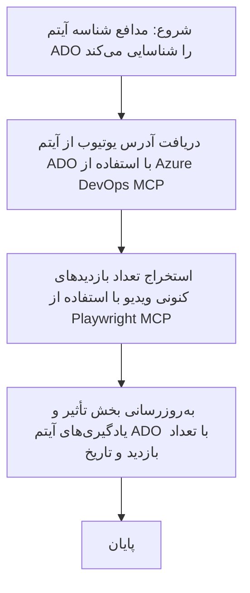

# مطالعه موردی: به‌روزرسانی آیتم‌های Azure DevOps از داده‌های یوتیوب با MCP

> **سلب مسئولیت:** ابزارها و گزارش‌های آنلاین موجودی وجود دارند که می‌توانند فرآیند به‌روزرسانی آیتم‌های Azure DevOps با داده‌های پلتفرم‌هایی مانند یوتیوب را خودکار کنند. سناریوی زیر صرفاً به عنوان یک نمونه موردی برای نشان دادن چگونگی کاربرد ابزارهای MCP در خودکارسازی و ادغام ارائه شده است.

## مرور کلی

این مطالعه موردی یک مثال از چگونگی استفاده از پروتکل زمینه مدل (MCP) و ابزارهای آن برای خودکارسازی فرآیند به‌روزرسانی آیتم‌های کاری Azure DevOps (ADO) با اطلاعاتی از پلتفرم‌های آنلاین مانند یوتیوب را نشان می‌دهد. سناریوی بیان شده صرفاً یکی از نمونه‌های گسترده‌تر قابلیت‌های این ابزارها است که می‌تواند برای بسیاری از نیازهای مشابه خودکارسازی تطبیق یابد.

در این مثال، یک حامی جلسات آنلاین را با استفاده از آیتم‌های ADO پیگیری می‌کند، که هر آیتم شامل URL ویدیوی یوتیوب است. با بهره‌گیری از ابزارهای MCP، حامی می‌تواند آیتم‌های ADO را به روز نگه دارد با جدیدترین معیارهای ویدیو، مانند تعداد بازدیدها، به روشی تکرارپذیر و خودکار. این رویکرد می‌تواند به سایر موارد استفاده که نیاز به ادغام اطلاعات از منابع آنلاین در ADO یا سیستم‌های دیگر دارند، تعمیم یابد.

## سناریو

یک حامی مسئول پیگیری تأثیر جلسات آنلاین و تعاملات جامعه است. هر جلسه به صورت یک آیتم کاری ADO در پروژه 'DevRel' ثبت شده است و آیتم کاری شامل فیلدی برای URL ویدیوی یوتیوب است. برای گزارش دقیق گستره جلسه، حامی نیاز دارد آیتم ADO را با تعداد فعلی بازدیدهای ویدیو و تاریخ بازیابی این اطلاعات به‌روزرسانی کند.

## ابزارهای استفاده شده

- [Azure DevOps MCP](https://github.com/microsoft/azure-devops-mcp): امکان دسترسی برنامه‌نویسی و به‌روزرسانی آیتم‌های کاری ADO از طریق MCP را فراهم می‌کند.
- [Playwright MCP](https://github.com/microsoft/playwright-mcp): عملیات مرورگر را خودکار می‌کند تا داده‌های زنده‌ای مانند آمار ویدیوهای یوتیوب را استخراج کند.

## روند گام به گام

1. **شناسایی آیتم ADO**: شروع با شناسه آیتم کاری ADO (مثلاً 1234) در پروژه 'DevRel'.
2. **بازیابی URL یوتیوب**: استفاده از ابزار Azure DevOps MCP برای دریافت URL یوتیوب از آیتم کاری.
3. **استخراج تعداد بازدید ویدیو**: استفاده از ابزار Playwright MCP برای رفتن به URL یوتیوب و استخراج تعداد بازدید فعلی.
4. **به‌روزرسانی آیتم ADO**: نوشتن جدیدترین تعداد بازدید و تاریخ بازیابی در بخش 'تأثیر و یادگیری‌ها' آیتم کاری ADO با استفاده از ابزار Azure DevOps MCP.

## نمونه پرامپت

```bash
- Work with the ADO Item ID: 1234
- The project is '2025-Awesome'
- Get the YouTube URL for the ADO item
- Use Playwright to get the current views from the YouTube video
- Update the ADO item with the current video views and the updated date of the information
```

## نمودار جریان Mermaid


## پیاده‌سازی فنی

- **هماهنگی MCP**: این روند توسط یک سرور MCP هماهنگ می‌شود که استفاده از هر دو ابزار Azure DevOps MCP و Playwright MCP را مدیریت می‌کند.
- **خودکارسازی**: این فرآیند می‌تواند به صورت دستی فعال شود یا زمان‌بندی شده اجرا گردد تا آیتم‌های ADO به‌روز باقی بمانند.
- **قابلیت گسترش**: الگوی مشابهی می‌تواند گسترش یابد تا آیتم‌های ADO را با معیارهای آنلاین دیگر (مثلاً پسندها، نظرات) یا از پلتفرم‌های دیگر به‌روزرسانی کند.

## نتایج و تأثیر

- **کارایی**: کاهش تلاش‌های دستی برای حامی‌ها با خودکارسازی بازیابی و به‌روزرسانی معیارهای ویدیو.
- **دقت**: تضمین اینکه آیتم‌های ADO با جدیدترین داده‌های موجود از منابع آنلاین همگام باشند.
- **قابلیت تکرار**: ارائه روندی قابل استفاده مجدد برای سناریوهای مشابه که منابع داده یا معیارهای دیگر را درگیر می‌کنند.

## منابع

- [Azure DevOps MCP](https://github.com/microsoft/azure-devops-mcp)
- [Playwright MCP](https://github.com/microsoft/playwright-mcp)
- [پروتکل زمینه مدل (MCP)](https://modelcontextprotocol.io/)

## ادامه کار

- بازگشت به: [مرور مطالعات موردی](./README.md)
- بعدی: [بازیابی مستندات زمان واقعی با MCP](./docs-mcp/README.md)

---

<!-- CO-OP TRANSLATOR DISCLAIMER START -->
**توضیح مهم**:  
این سند با استفاده از سرویس ترجمه هوش مصنوعی [Co-op Translator](https://github.com/Azure/co-op-translator) ترجمه شده است. اگرچه ما در تلاش برای دقت هستیم، لطفاً توجه داشته باشید که ترجمه‌های خودکار ممکن است شامل اشتباهات یا نادرستی‌هایی باشند. سند اصلی به زبان مبدأ به عنوان منبع معتبر باید در نظر گرفته شود. برای اطلاعات حیاتی، توصیه می‌شود از ترجمه حرفه‌ای انسانی استفاده شود. ما در قبال هرگونه سوءتفاهم یا تفسیر نادرست ناشی از استفاده از این ترجمه مسئولیتی نداریم.
<!-- CO-OP TRANSLATOR DISCLAIMER END -->