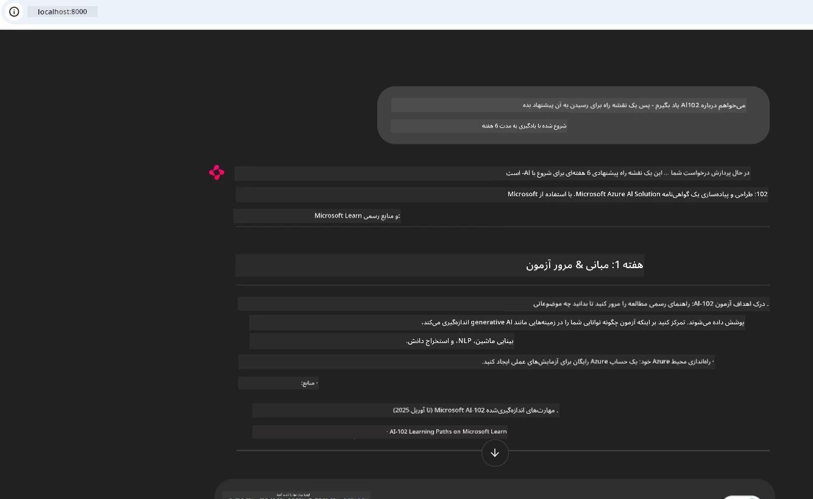
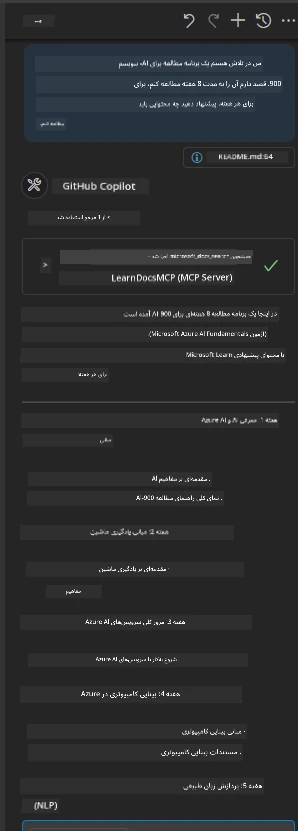

# مطالعه موردی: اتصال به سرور Microsoft Learn Docs MCP از یک کلاینت

تا به حال شده بین سایت‌های مستندات، Stack Overflow و تب‌های بی‌پایان موتورهای جستجو در رفت‌وآمد باشید، آن هم درحالی که در حال حل یک مشکل در کد خود هستید؟ ممکن است یک مانیتور دوم را فقط برای مستندات نگه داشته باشید یا همیشه در حال استفاده از alt-tab بین IDE و مرورگر باشید. آیا بهتر نیست که بتوانید مستندات را مستقیماً به جریان کاری خود بیاورید—یکپارچه با برنامه‌ها، IDE یا حتی ابزارهای سفارشی خودتان؟ در این مطالعه موردی، ما به بررسی چگونگی انجام همین کار خواهیم پرداخت، یعنی اتصال مستقیم به سرور Microsoft Learn Docs MCP از برنامه کلاینت خودتان.

## نمای کلی

توسعه مدرن صرفاً نوشتن کد نیست—بلکه پیدا کردن اطلاعات درست در زمان درست است. مستندات همه جا هستند، اما به ندرت جایی که بیشترین نیاز را دارید: داخل ابزارها و جریان‌های کاری شما. با یکپارچه‌سازی واکشی مستندات مستقیماً در برنامه‌های خود، می‌توانید زمان صرفه‌جویی کنید، از تغییر مکرر زمینه بکاهید و بهره‌وری خود را افزایش دهید. در این بخش، به شما نشان خواهیم داد چگونه یک کلاینت را به سرور Microsoft Learn Docs MCP متصل کنید، تا بتوانید مستندات زمان واقعی و آگاه به زمینه را بدون ترک برنامه خود دریافت کنید.

ما روند برقراری اتصال، ارسال درخواست و مدیریت پاسخ‌های استریمینگ را به صورت کارآمد طی خواهیم کرد. این رویکرد نه تنها جریان کاری شما را ساده می‌کند بلکه درهای ساخت ابزارهای هوشمندتر و مفیدتر برای توسعه‌دهندگان را باز می‌کند.

## اهداف آموزشی

چرا این کار را انجام می‌دهیم؟ زیرا بهترین تجربه‌های توسعه‌دهنده، تجربه‌هایی هستند که اصطکاک را حذف می‌کنند. دنیایی را تصور کنید که در آن ویرایشگر کد، چت‌بات یا برنامه وب شما بتواند فوراً به سوالات مستنداتی شما پاسخ دهد، با استفاده از جدیدترین محتویات Microsoft Learn. در پایان این فصل، شما خواهید دانست چگونه:

- اصول ارتباط کلاینت-سرور MCP برای مستندات را درک کنید
- یک برنامه کنسول یا وب بسازید که به سرور Microsoft Learn Docs MCP متصل شود
- از کلاینت HTTP استریمینگ برای واکشی مستندات به صورت زمان واقعی استفاده کنید
- پاسخ‌های مستندات را در برنامه خود ثبت و تفسیر کنید

خواهید دید که چگونه این مهارت‌ها می‌توانند به ساخت ابزارهایی کمک کنند که نه فقط واکنشی، بلکه واقعاً تعاملی و آگاه به زمینه هستند.

## سناریوی ۱ - واکشی مستندات زمان واقعی با MCP

در این سناریو به شما نشان می‌دهیم چگونه یک کلاینت را به سرور Microsoft Learn Docs MCP متصل کنید، تا بتوانید مستندات زمان واقعی و آگاه به زمینه را بدون ترک برنامه خود دریافت کنید.

بیایید این را عملی کنیم. کار شما نوشتن یک برنامه است که به سرور Microsoft Learn Docs MCP متصل شود، ابزار `microsoft_docs_search` را فراخوانی کند و پاسخ استریمینگ را در کنسول ثبت (log) کند.

### چرا این رویکرد؟
زیرا این پایه اساسی برای ساخت یکپارچه‌سازی‌های پیشرفته‌تر است — چه بخواهید یک چت‌بات، افزونه IDE یا داشبورد وب ایجاد کنید.

شما کد و دستورالعمل‌های این سناریو را در پوشه [`solution`](./solution/README.md) در این مطالعه موردی خواهید یافت. مراحل شما را در راه‌اندازی اتصال راهنمایی خواهد کرد:
- استفاده از SDK رسمی MCP و کلاینت HTTP قابل استریم برای اتصال
- تماس با ابزار `microsoft_docs_search` با پارامتر کوئری برای دریافت مستندات
- پیاده‌سازی لاگینگ صحیح و مدیریت خطاها
- ایجاد یک رابط تعاملی کنسول برای ورود چندین پرس‌وجو توسط کاربران

این سناریو نشان می‌دهد چگونه:
- به سرور Docs MCP متصل شوید
- یک پرس‌وجو ارسال کنید
- نتایج را تجزیه و چاپ کنید

در اینجا نمونه‌ای از اجرای راه‌حل آورده شده است:

```
Prompt> What is Azure Key Vault?
Answer> Azure Key Vault is a cloud service for securely storing and accessing secrets. ...
```

در زیر نمونه‌ای حداقلی ارائه شده است. کد کامل و جزئیات در پوشه solution موجود است.

<details>
<summary>پایتون</summary>

```python
import asyncio
from mcp.client.streamable_http import streamablehttp_client
from mcp import ClientSession

async def main():
    async with streamablehttp_client("https://learn.microsoft.com/api/mcp") as (read_stream, write_stream, _):
        async with ClientSession(read_stream, write_stream) as session:
            await session.initialize()
            result = await session.call_tool("microsoft_docs_search", {"query": "Azure Functions best practices"})
            print(result.content)

if __name__ == "__main__":
    asyncio.run(main())
```

- برای پیاده‌سازی کامل و لاگینگ، به [`scenario1.py`](../../../../09-CaseStudy/docs-mcp/solution/python/scenario1.py) مراجعه کنید.
- برای دستورالعمل نصب و استفاده، فایل [`README.md`](./solution/python/README.md) را در همان پوشه ببینید.
</details>


## سناریوی ۲ - برنامه وب تولیدکننده برنامه مطالعه تعاملی با MCP

در این سناریو خواهید آموخت چگونه Docs MCP را در یک پروژه توسعه وب ادغام کنید. هدف این است که کاربران بتوانند مستندات Microsoft Learn را مستقیماً از یک رابط وب جستجو کنند، و مستندات فوراً در برنامه یا سایت شما قابل دسترسی باشند.

خواهید دید چگونه:
- یک برنامه وب راه‌اندازی کنید
- به سرور Docs MCP متصل شوید
- ورودی کاربران را مدیریت و نتایج را نمایش دهید

نمونه اجرای راه‌حل چنین خواهد بود:

```
User> I want to learn about AI102 - so suggest the roadmap to get it started from learn for 6 weeks

Assistant> Here’s a detailed 6-week roadmap to start your preparation for the AI-102: Designing and Implementing a Microsoft Azure AI Solution certification, using official Microsoft resources and focusing on exam skills areas:

---
## Week 1: Introduction & Fundamentals
- **Understand the Exam**: Review the [AI-102 exam skills outline](https://learn.microsoft.com/en-us/credentials/certifications/exams/ai-102/).
- **Set up Azure**: Sign up for a free Azure account if you don't have one.
- **Learning Path**: [Introduction to Azure AI services](https://learn.microsoft.com/en-us/training/modules/intro-to-azure-ai/)
- **Focus**: Get familiar with Azure portal, AI capabilities, and necessary tools.

....more weeks of the roadmap...

Let me know if you want module-specific recommendations or need more customized weekly tasks!
```

در زیر نمونه‌ای حداقلی ارائه شده است. کد کامل و جزئیات در پوشه solution موجود است.



<details>
<summary>پایتون (Chainlit)</summary>

Chainlit چارچوبی برای ساخت برنامه‌های وب هوش مصنوعی مکالمه‌ای است. ایجاد چت‌بات‌ها و دستیارهای تعاملی که می‌توانند ابزارهای MCP را فراخوانی کنند و نتایج را در زمان واقعی نشان دهند، را آسان می‌کند. این برای نمونه‌سازی سریع و رابط‌های کاربر پسند ایده‌آل است.

```python
import chainlit as cl
import requests

MCP_URL = "https://learn.microsoft.com/api/mcp"

@cl.on_message
def handle_message(message):
    query = {"question": message}
    response = requests.post(MCP_URL, json=query)
    if response.ok:
        result = response.json()
        cl.Message(content=result.get("answer", "No answer found.")).send()
    else:
        cl.Message(content="Error: " + response.text).send()
```

- برای پیاده‌سازی کامل، به [`scenario2.py`](../../../../09-CaseStudy/docs-mcp/solution/python/scenario2.py) مراجعه کنید.
- برای راه‌اندازی و اجرای برنامه، فایل [`README.md`](./solution/python/README.md) را ببینید.
</details>


## سناریوی ۳: مستندات در ویرایشگر با سرور MCP در VS Code

اگر می‌خواهید مستندات Microsoft Learn را مستقیماً در VS Code خود داشته باشید (به جای جابه‌جایی بین تب‌های مرورگر)، می‌توانید از سرور MCP در ویرایشگر خود استفاده کنید. این به شما امکان می‌دهد:
- بدون ترک محیط کدنویسی خود، در VS Code مستندات را جستجو و بخوانید.
- به مستندات ارجاع دهید و لینک‌ها را مستقیماً در فایل‌های README یا دوره خود درج کنید.
- از GitHub Copilot و MCP به صورت ترکیبی برای جریان کاری مستندات پیشرفته و مبتنی بر هوش مصنوعی بهره ببرید.

**خواهید دید چگونه:**
- فایل `.vscode/mcp.json` معتبر را به ریشه فضای کاری خود اضافه کنید (مثال در زیر آمده است).
- پنل MCP را باز کنید یا از پالت دستورات VS Code برای جستجو و درج مستندات استفاده کنید.
- به مستندات مستقیماً در فایل‌های مارک‌داون خود هنگام کار ارجاع دهید.
- این جریان کاری را با GitHub Copilot برای بهره‌وری بیشتر ترکیب کنید.

در اینجا مثالی برای راه‌اندازی سرور MCP در VS Code آورده شده است:

```json
{
  "servers": {
    "LearnDocsMCP": {
      "url": "https://learn.microsoft.com/api/mcp"
    }
  }
}
```

</details>

> برای راهنمایی دقیق با تصاویر و راهنمای گام‌به‌گام به [`README.md`](./solution/scenario3/README.md) مراجعه کنید.



این رویکرد برای هرکسی که در حال ساخت دوره‌های فنی، نوشتن مستندات یا توسعه کد با نیاز به ارجاعات مکرر است، ایده‌آل است.

## نکات کلیدی

یکپارچه‌سازی مستندات مستقیماً در ابزارهای شما فقط یک سهولت نیست—بلکه تغییردهنده بازی در بهره‌وری است. با اتصال به سرور Microsoft Learn Docs MCP از کلاینت خود می‌توانید:

- تغییر زمینه بین کد و مستندات را حذف کنید
- مستندات به‌روز و آگاه به زمینه را به صورت زمان واقعی واکشی کنید
- ابزارهای توسعه‌دهنده هوشمندتر و تعاملی‌تر بسازید

این مهارت‌ها به شما کمک می‌کنند راه‌حل‌هایی بسازید که نه تنها کارآمد بلکه استفاده از آنها لذت‌بخش باشد.

## منابع اضافی

برای تعمیق درک خود، منابع رسمی زیر را بررسی کنید:

- [سرور Microsoft Learn Docs MCP (GitHub)](https://github.com/MicrosoftDocs/mcp)
- [شروع با Azure MCP Server (mcp-python)](https://learn.microsoft.com/en-us/azure/developer/azure-mcp-server/get-started#create-the-python-app)
- [Azure MCP Server چیست؟](https://learn.microsoft.com/en-us/azure/developer/azure-mcp-server/)
- [معرفی Model Context Protocol (MCP)](https://modelcontextprotocol.io/introduction)
- [افزودن افزونه‌ها از یک سرور MCP (پایتون)](https://learn.microsoft.com/en-us/semantic-kernel/concepts/plugins/adding-mcp-plugins)

## گام بعدی

- بازگشت به: [بررسی مطالعات موردی](../README.md)
- ادامه به: [ماژول 10: ساده‌سازی جریان‌های کاری هوش مصنوعی با AI Toolkit](../../10-StreamliningAIWorkflowsBuildingAnMCPServerWithAIToolkit/README.md)

---

<!-- CO-OP TRANSLATOR DISCLAIMER START -->
**سلب مسئولیت**:
این سند با استفاده از سرویس ترجمه مبتنی بر هوش مصنوعی [Co-op Translator](https://github.com/Azure/co-op-translator) ترجمه شده است. در حالی که ما برای دقت تلاش می‌کنیم، لطفاً توجه داشته باشید که ترجمه‌های خودکار ممکن است حاوی خطاها یا نادرستی‌هایی باشند. سند اصلی به زبان مادری خود باید به عنوان منبع معتبر در نظر گرفته شود. برای اطلاعات حساس، توصیه می‌شود از ترجمه حرفه‌ای انسانی استفاده شود. ما مسئول هیچ گونه سوءتفاهم یا برداشت نادرستی که از استفاده از این ترجمه ناشی شود، نیستیم.
<!-- CO-OP TRANSLATOR DISCLAIMER END -->