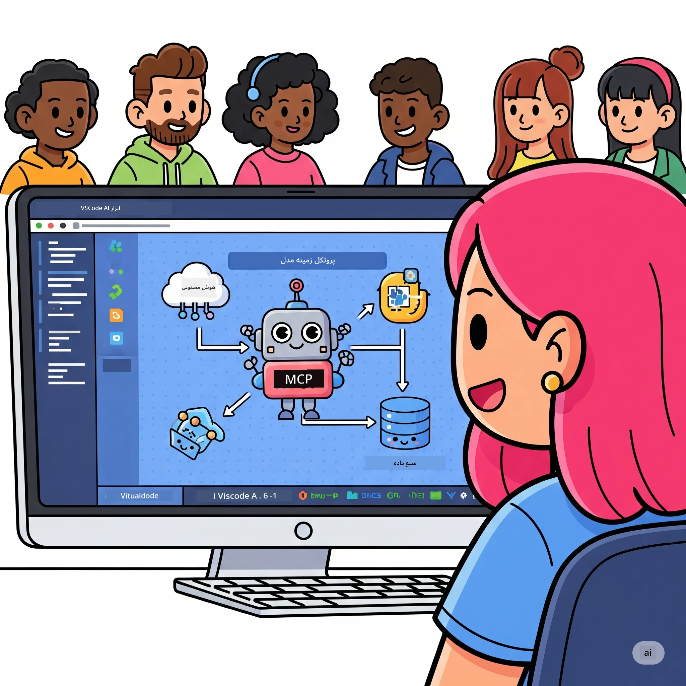

# ساده‌سازی جریان‌های کاری هوش مصنوعی: ساخت یک سرور MCP با ابزار هوش مصنوعی

## 🎯  مرور کلی

_(برای مشاهده ویدئو این درس روی تصویر بالا کلیک کنید)_

به **کارگاه پروتکل مدل کانتکست (MCP)** خوش آمدید! این کارگاه جامع عملی دو فناوری پیشرفته را ترکیب می‌کند تا توسعه برنامه‌های هوش مصنوعی را متحول سازد:

- **🔗 پروتکل مدل کانتکست (MCP)**: یک استاندارد باز برای ادغام بی‌دردسر ابزارهای هوش مصنوعی
- **🛠️ ابزار هوش مصنوعی برای ویژوال استودیو کد (AITK)**: افزونه قدرتمند توسعه هوش مصنوعی مایکروسافت

### 🎓 چه چیزی خواهید آموخت

در پایان این کارگاه، استاد ساخت برنامه‌های هوشمند خواهید بود که مدل‌های هوش مصنوعی را با ابزارها و خدمات دنیای واقعی پیوند می‌دهند. از تست خودکار گرفته تا ادغام‌های سفارشی API، مهارت‌های عملی برای حل چالش‌های پیچیده کسب‌وکار به دست خواهید آورد.

## 🏗️ پشته فناوری

### 🔌 پروتکل مدل کانتکست (MCP)

MCP همانند **"یو‌اس‌بی‌-سی برای هوش مصنوعی"** است - یک استاندارد جهانی که مدل‌های هوش مصنوعی را به ابزارها و منابع داده خارجی متصل می‌کند.

**✨ ویژگی‌های کلیدی:**

- 🔄 **ادغام استاندارد شده**: رابطی جهانی برای اتصال ابزارهای هوش مصنوعی
- 🏛️ **معماری انعطاف‌پذیر**: سرورهای محلی و راه دور از طریق حمل‌ونقل stdio/SSE
- 🧰 **اکوسیستم غنی**: ابزارها، پرامپت‌ها و منابع در یک پروتکل
- 🔒 **آماده سازمانی**: امنیت و قابلیت اطمینان داخلی

**🎯 اهمیت MCP:**
همانطور که USB-C هرج‌ومرج کابل‌ها را حذف کرد، MCP پیچیدگی‌های ادغام هوش مصنوعی را برطرف می‌کند. یک پروتکل، امکانات بی‌نهایت.

### 🤖 ابزار هوش مصنوعی برای ویژوال استودیو کد (AITK)

افزونه پرچم‌دار توسعه هوش مصنوعی مایکروسافت که VS Code را به یک مرکز قدرت هوش مصنوعی تبدیل می‌کند.

**🚀 قابلیت‌های اصلی:**

- 📦 **فهرست مدل‌ها**: دسترسی به مدل‌ها از Azure AI، GitHub، Hugging Face، Ollama
- ⚡ **استنتاج محلی**: اجرای بهینه‌شده با ONNX روی CPU/GPU/NPU
- 🏗️ **سازنده عامل**: توسعه عامل‌های هوش مصنوعی بصری با ادغام MCP
- 🎭 **چند مدلی**: پشتیبانی از متن، تصویر و خروجی ساختاریافته

**💡 مزایای توسعه:**

- استقرار مدل بدون پیکربندی
- مهندسی پرامپت بصری
- زمین بازی آزمایش زنده
- ادغام بی‌وقفه سرور MCP

## 📚 مسیر یادگیری

### [🚀 ماژول ۱: مبانی ابزار هوش مصنوعی](./lab1/README.md)

**مدت زمان**: ۱۵ دقیقه

- 🛠️ نصب و پیکربندی ابزار هوش مصنوعی برای VS Code
- 🗂️ کاوش فهرست مدل‌ها (بیش از ۱۰۰ مدل از GitHub، ONNX، OpenAI، Anthropic، Google)
- 🎮 تسلط بر زمین بازی تعاملی برای تست مدل در زمان واقعی
- 🤖 ساخت اولین عامل هوش مصنوعی خود با سازنده عامل
- 📊 ارزیابی عملکرد مدل با معیارهای داخلی (F1، ارتباط، تشابه، انسجام)
- ⚡ یادگیری پردازش دسته‌ای و قابلیت‌های پشتیبانی چند مدلی

**🎯 نتیجه یادگیری**: ایجاد یک عامل هوش مصنوعی کاربردی با درک جامع از قابلیت‌های AITK

### [🌐 ماژول ۲: MCP با مبانی ابزار هوش مصنوعی](./lab2/README.md)

**مدت زمان**: ۲۰ دقیقه

- 🧠 تسلط بر معماری و مفاهیم پروتکل مدل کانتکست (MCP)
- 🌐 بررسی اکوسیستم سرور MCP مایکروسافت
- 🤖 ساخت عامل خودکارسازی مرورگر با استفاده از سرور Playwright MCP
- 🔧 ادغام سرورهای MCP با سازنده عامل ابزار هوش مصنوعی
- 📊 پیکربندی و تست ابزارهای MCP در عوامل خود
- 🚀 صادر و استقرار عوامل مجهز به MCP برای استفاده در تولید

**🎯 نتیجه یادگیری**: استقرار یک عامل هوش مصنوعی فوق‌العاده مجهز به ابزارهای خارجی از طریق MCP

### [🔧 ماژول ۳: توسعه پیشرفته MCP با ابزار هوش مصنوعی](./lab3/README.md)

**مدت زمان**: ۲۰ دقیقه

- 💻 ساخت سرورهای سفارشی MCP با استفاده از ابزار هوش مصنوعی
- 🐍 پیکربندی و استفاده از آخرین نسخه SDK پایتون MCP (v1.9.3)
- 🔍 راه‌اندازی و استفاده از MCP Inspector برای اشکال‌زدایی
- 🛠️ ساخت سرور هوای MCP با جریان‌های کاری حرفه‌ای اشکال‌زدایی
- 🧪 اشکال‌زدایی سرورهای MCP در محیط‌های سازنده عامل و Inspector

**🎯 نتیجه یادگیری**: توسعه و اشکال‌زدایی سرورهای سفارشی MCP با ابزارهای مدرن

### [🐙 ماژول ۴: توسعه عملی MCP - سرور کلون گیت‌هاب سفارشی](./lab4/README.md)

**مدت زمان**: ۳۰ دقیقه

- 🏗️ ساخت یک سرور کلون MCP واقعی گیت‌هاب برای جریان‌های کاری توسعه
- 🔄 پیاده‌سازی کلون هوشمند مخازن با اعتبارسنجی و مدیریت خطا
- 📁 ایجاد مدیریت هوشمند پوشه‌ها و یکپارچه‌سازی با VS Code
- 🤖 استفاده از حالت عامل GitHub Copilot با ابزارهای سفارشی MCP
- 🛡️ اعمال قابلیت اطمینان آماده برای تولید و سازگاری چندسکویی

**🎯 نتیجه یادگیری**: استقرار یک سرور MCP آماده تولید که جریان‌های واقعی توسعه را ساده می‌کند

## 💡 کاربردها و تاثیرات دنیای واقعی

### 🏢 موارد استفاده سازمانی

#### 🔄 خودکارسازی DevOps

جریان کاری توسعه خود را با اتوماسیون هوشمند متحول کنید:

- **مدیریت هوشمند مخزن**: بازبینی کد و تصمیمات ادغام مبتنی بر هوش مصنوعی
- **CI/CD هوشمند**: بهینه‌سازی خودکار خط لوله بر اساس تغییرات کد
- **طبقه‌بندی مسائل**: دسته‌بندی و اختصاص خودکار باگ‌ها

#### 🧪 انقلاب تضمین کیفیت

تست را با اتوماسیون مبتنی بر هوش مصنوعی ارتقاء دهید:

- **تولید تست هوشمند**: ساخت مجموعه‌های تست جامع به صورت خودکار
- **تست رگرسیون بصری**: تشخیص تغییرات UI با هوش مصنوعی
- **نظارت عملکرد**: شناسایی و حل پیشگیرانه مشکلات

#### 📊 هوشمندی جریان داده

جریان‌های کاری پردازش داده هوشمند بسازید:

- **فرآیندهای ETL تطبیقی**: تبدیل داده‌های خودبهینه‌شونده
- **کشف ناهنجاری**: نظارت بر کیفیت داده در زمان واقعی
- **مسیر‌یابی هوشمند**: مدیریت هوشمند جریان داده

#### 🎧 بهبود تجربه مشتری

تعاملات استثنایی با مشتری ایجاد کنید:

- **پشتیبانی آگاه به زمینه**: عوامل هوش مصنوعی با دسترسی به تاریخچه مشتری
- **حل مسائل پیشگیرانه**: خدمات پیش‌بینی شده به مشتری
- **ادغام چندکاناله**: تجربه هوش مصنوعی یکپارچه در سراسر پلتفرم‌ها

## 🛠️ پیش‌نیازها و راه‌اندازی

### 💻 نیازمندی‌های سیستم

| مؤلفه | نیازمندی | توضیحات |
|-----------|-------------|-------|
| **سیستم عامل** | ویندوز ۱۰ به بالا، مک‌اواس ۱۰.۱۵ به بالا، لینوکس | هر سیستم عامل مدرن |
| **ویژوال استودیو کد** | آخرین نسخه پایدار | لازم برای AITK |
| **Node.js** | نسخه ۱۸ به بالا و npm | برای توسعه سرور MCP |
| **پایتون** | ۳.۱۰ به بالا | اختیاری برای سرورهای MCP پایتون |
| **حافظه** | حداقل ۸ گیگ رم | ۱۶ گیگ توصیه می‌شود برای مدل‌های محلی |

### 🔧 محیط توسعه

#### افزونه‌های پیشنهادی VS Code

- **AI Toolkit** (ms-windows-ai-studio.windows-ai-studio)
- **Python** (ms-python.python)
- **Python Debugger** (ms-python.debugpy)
- **GitHub Copilot** (GitHub.copilot) - اختیاری اما مفید

#### ابزارهای اختیاری

- **uv**: مدیر بسته مدرن پایتون
- **MCP Inspector**: ابزار اشکال‌زدایی بصری برای سرورهای MCP
- **Playwright**: برای نمونه‌های خودکارسازی وب

## 🎖️ نتایج یادگیری و مسیر صدور گواهی

### 🏆 چک‌لیست تسلط مهارت‌ها

با تکمیل این کارگاه، در زمینه‌های زیر تسلط خواهید یافت:

#### 🎯 شایستگی‌های اصلی

- [ ] **تسلط بر پروتکل MCP**: درک عمیق معماری و الگوهای پیاده‌سازی
- [ ] **تبحر در AITK**: استفاده حرفه‌ای از ابزار هوش مصنوعی برای توسعه سریع
- [ ] **توسعه سرور سفارشی**: ساخت، استقرار و نگهداری سرورهای MCP تولیدی
- [ ] **برتری ادغام ابزار**: اتصال بی‌وقفه هوش مصنوعی با جریان‌های کاری توسعه موجود
- [ ] **کاربرد حل مسئله**: به‌کارگیری مهارت‌های آموخته شده در چالش‌های واقعی کسب‌وکار

#### 🔧 مهارت‌های فنی

- [ ] راه‌اندازی و پیکربندی ابزار هوش مصنوعی در VS Code
- [ ] طراحی و پیاده‌سازی سرورهای MCP سفارشی
- [ ] ادغام مدل‌های گیت‌هاب با معماری MCP
- [ ] ساخت جریان‌های کاری تست خودکار با Playwright
- [ ] استقرار عوامل هوش مصنوعی برای استفاده تولید
- [ ] اشکال‌زدایی و بهینه‌سازی عملکرد سرور MCP

#### 🚀 قابلیت‌های پیشرفته

- [ ] معماری ادغام‌های هوش مصنوعی در مقیاس سازمانی
- [ ] اجرای بهترین روش‌های امنیت برای برنامه‌های هوش مصنوعی
- [ ] طراحی معماری‌های مقیاس‌پذیر سرور MCP
- [ ] ساخت زنجیره ابزار سفارشی برای حوزه‌های خاص
- [ ] راهنمایی دیگران در توسعه بومی هوش مصنوعی

## 📖 منابع اضافی

- [مشخصات MCP (2025-11-25)](https://spec.modelcontextprotocol.io/specification/2025-11-25/)
- [مخزن گیت‌هاب ابزار هوش مصنوعی](https://github.com/microsoft/vscode-ai-toolkit)
- [مجموعه نمونه سرورهای MCP](https://github.com/modelcontextprotocol/servers)
- [راهنمای بهترین روش‌ها](https://modelcontextprotocol.io/docs/best-practices)
- [ده مورد برتر امنیتی OWASP MCP](https://microsoft.github.io/mcp-azure-security-guide/mcp/) - بهترین روش‌های امنیتی

---

**🚀 آماده‌اید جریان توسعه هوش مصنوعی خود را متحول کنید؟**

بیایید آینده برنامه‌های هوشمند را با MCP و ابزار هوش مصنوعی با هم بسازیم!

## مرحله بعد

ادامه به: [ماژول 11: آزمایشگاه‌های عملی سرور MCP](../11-MCPServerHandsOnLabs/README.md)

---

<!-- CO-OP TRANSLATOR DISCLAIMER START -->
**سلب مسئولیت**:  
این سند با استفاده از سرویس ترجمه ماشینی [Co-op Translator](https://github.com/Azure/co-op-translator) ترجمه شده است. در حالی که ما به دقت ترجمه اهمیت می‌دهیم، لطفاً توجه داشته باشید که ترجمه‌های خودکار ممکن است شامل خطاها یا نادرستی‌هایی باشند. سند اصلی به زبان بومی خود به عنوان منبع معتبر در نظر گرفته شود. برای اطلاعات حیاتی، ترجمه حرفه‌ای انسانی توصیه می‌شود. ما مسئول هیچ گونه سو تفاهم یا تفسیر نادرستی ناشی از استفاده از این ترجمه نیستیم.
<!-- CO-OP TRANSLATOR DISCLAIMER END -->