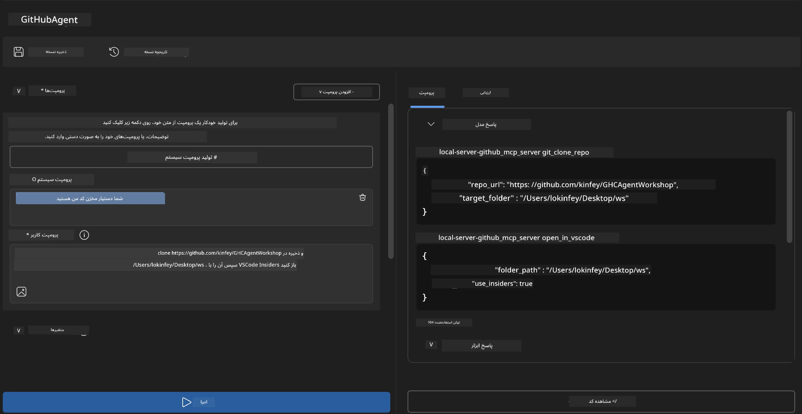
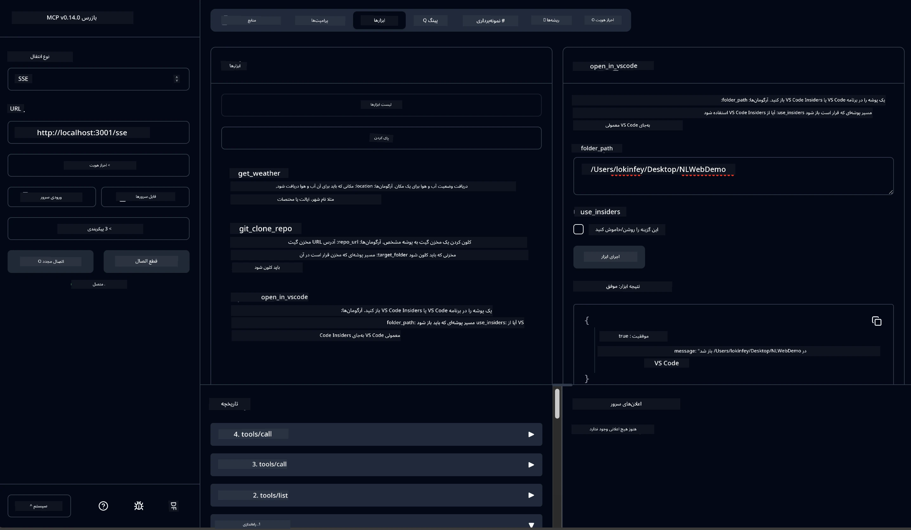

# 🐙 ماژول ۴: توسعه عملی MCP - سرور کلون گیت‌هاب سفارشی


> **⚡ شروع سریع:** ساخت یک سرور MCP آماده تولید که کلون کردن مخازن گیت‌هاب و یکپارچه‌سازی با VS Code را فقط در ۳۰ دقیقه خودکار می‌کند!

## 🎯 اهداف یادگیری

تا پایان این آزمایشگاه، قادر خواهید بود:

- ✅ ایجاد یک سرور MCP سفارشی برای جریان‌های کاری توسعه دنیای واقعی  
- ✅ پیاده‌سازی عملکرد کلون کردن مخازن گیت‌هاب از طریق MCP  
- ✅ یکپارچه‌سازی سرورهای MCP سفارشی با VS Code و Agent Builder  
- ✅ استفاده از حالت Agent در GitHub Copilot با ابزارهای MCP سفارشی  
- ✅ تست و استقرار سرورهای MCP سفارشی در محیط‌های تولیدی  

## 📋 پیش‌نیازها

- تکمیل آزمایشگاه‌های ۱ تا ۳ (مبانی MCP و توسعه پیشرفته)  
- اشتراک GitHub Copilot ([ثبت‌نام رایگان موجود](https://github.com/github-copilot/signup))  
- VS Code با افزونه‌های AI Toolkit و GitHub Copilot  
- نصب و پیکربندی Git CLI  

## 🏗️ مرور پروژه

### **چالش توسعه دنیای واقعی**  
ما به عنوان توسعه‌دهنده‌ها، اغلب از گیت‌هاب برای کلون کردن مخازن استفاده و آن‌ها را در VS Code یا VS Code Insiders باز می‌کنیم. این فرایند دستی شامل:  
۱. باز کردن ترمینال/کامند پرامپت  
۲. رفتن به دایرکتوری مورد نظر  
۳. اجرای فرمان `git clone`  
۴. باز کردن VS Code در دایرکتوری کلون شده  

**راه‌حل MCP ما این فرایند را به یک فرمان هوشمند واحد تبدیل می‌کند!**

### **آنچه خواهید ساخت**  
یک **سرور MCP کلون گیت‌هاب** (`git_mcp_server`) که فراهم می‌کند:

| ویژگی | توضیح | مزیت |
|---------|-------------|---------|
| 🔄 **کلون هوشمند مخزن** | کلون مخازن گیت‌هاب با اعتبارسنجی | بررسی خودکار خطاها |
| 📁 **مدیریت هوشمندانه دایرکتوری** | بررسی و ایجاد امن دایرکتوری‌ها | جلوگیری از بازنویسی ناخواسته |
| 🚀 **یکپارچه‌سازی چندسکویی VS Code** | باز کردن پروژه‌ها در VS Code/Insiders | انتقال بی‌دردسر جریان کاری |
| 🛡️ **مدیریت قوی خطاها** | مدیریت مشکلات شبکه، دسترسی و مسیرها | قابلیت اطمینان آماده تولید |

---

## 📖 پیاده‌سازی گام به گام

### گام ۱: ایجاد Agent گیت‌هاب در Agent Builder

1. **راه‌اندازی Agent Builder** از طریق افزونه AI Toolkit  
2. **ایجاد یک agent جدید** با پیکربندی زیر:  
   ```
   Agent Name: GitHubAgent
   ```
  
3. **راه‌اندازی سرور MCP سفارشی:**  
   - به **Tools** → **Add Tool** → **MCP Server** بروید  
   - گزینه **"Create A new MCP Server"** را انتخاب کنید  
   - قالب **Python** را برای بیشترین انعطاف پذیری انتخاب نمایید  
   - **نام سرور:** `git_mcp_server`

### گام ۲: پیکربندی حالت Agent در GitHub Copilot

1. **باز کردن GitHub Copilot** در VS Code (Ctrl/Cmd + Shift + P → "GitHub Copilot: Open")  
2. **انتخاب مدل Agent** در رابط Copilot  
3. **انتخاب مدل Claude 3.7** برای قابلیت‌های بالاتر استدلال  
4. **فعال‌سازی یکپارچه‌سازی MCP** برای دسترسی به ابزارها  

> **💡 نکته حرفه‌ای:** مدل Claude 3.7 در درک جریان‌های کاری توسعه و الگوهای مدیریت خطا برتری دارد.

### گام ۳: پیاده‌سازی عملکرد اصلی سرور MCP

**از پرامپت دقیق زیر در حالت Agent GitHub Copilot استفاده کنید:**

```
Create two MCP tools with the following comprehensive requirements:

🔧 TOOL A: clone_repository
Requirements:
- Clone any GitHub repository to a specified local folder
- Return the absolute path of the successfully cloned project
- Implement comprehensive validation:
  ✓ Check if target directory already exists (return error if exists)
  ✓ Validate GitHub URL format (https://github.com/user/repo)
  ✓ Verify git command availability (prompt installation if missing)
  ✓ Handle network connectivity issues
  ✓ Provide clear error messages for all failure scenarios

🚀 TOOL B: open_in_vscode
Requirements:
- Open specified folder in VS Code or VS Code Insiders
- Cross-platform compatibility (Windows/Linux/macOS)
- Use direct application launch (not terminal commands)
- Auto-detect available VS Code installations
- Handle cases where VS Code is not installed
- Provide user-friendly error messages

Additional Requirements:
- Follow MCP 1.9.3 best practices
- Include proper type hints and documentation
- Implement logging for debugging purposes
- Add input validation for all parameters
- Include comprehensive error handling
```
  
### گام ۴: تست سرور MCP خود

#### ۴الف. تست در Agent Builder

1. **راه‌اندازی پیکربندی دیباگ** برای Agent Builder  
2. **تنظیم agent خود با این پرامپت سیستم:**

```
SYSTEM_PROMPT:
You are my intelligent coding repository assistant. You help developers efficiently clone GitHub repositories and set up their development environment. Always provide clear feedback about operations and handle errors gracefully.
```
  
3. **تست با سناریوهای واقعی کاربران:**

```
USER_PROMPT EXAMPLES:

Scenario : Basic Clone and Open
"Clone {Your GitHub Repo link such as https://github.com/kinfey/GHCAgentWorkshop
 } and save to {The global path you specify}, then open it with VS Code Insiders"
```
  


**نتایج مورد انتظار:**  
- ✅ کلون موفق با تأیید مسیر  
- ✅ راه‌اندازی خودکار VS Code  
- ✅ پیام‌های خطای واضح برای شرایط نامعتبر  
- ✅ مدیریت درست موارد حاشیه‌ای

#### ۴ب. تست در MCP Inspector



---

**🎉 تبریک!** شما با موفقیت یک سرور MCP عملی، آماده تولید ایجاد کردید که چالش‌های جریان کاری توسعه را حل می‌کند. سرور کلون گیت‌هاب سفارشی شما قدرت MCP را برای خودکارسازی و افزایش بهره‌وری توسعه‌دهنده نشان می‌دهد.

### 🏆 دستاورد کسب شده:  
- ✅ **توسعه‌دهنده MCP** - ساخت سرور MCP سفارشی  
- ✅ **خودکارساز جریان کاری** - بهینه‌سازی فرایندهای توسعه  
- ✅ **متخصص یکپارچه‌سازی** - ارتباط چند ابزار توسعه  
- ✅ **آماده تولید** - ساخت راه‌حل قابل استقرار  

---

## 🎓 اتمام کارگاه: مسیر شما با پروتکل مدل کانتکست

**شرکت‌کننده گرامی کارگاه،**

تبریک می‌گوییم که هر چهار ماژول کارگاه پروتکل مدل کانتکست را کامل کرده‌اید! شما مسیر طولانی را از درک مفاهیم بنیادی AI Toolkit تا ساخت سرورهای MCP آماده تولید که چالش‌های توسعه واقعی را حل می‌کنند، طی کرده‌اید.

### 🚀 مروری بر مسیر یادگیری شما:

**[ماژول ۱](../lab1/README.md)**: با مبانی AI Toolkit، تست مدل و ساخت اولین agent خود شروع کردید.

**[ماژول ۲](../lab2/README.md)**: معماری MCP را آموختید، MCP Playwright را یکپارچه کردید و اولین agent خودکار مرورگر را ساختید.

**[ماژول ۳](../lab3/README.md)**: توسعه سرور MCP سفارشی با Weather MCP server را پیش بردید و ابزارهای اشکال‌زدایی را تسلط یافتید.

**[ماژول ۴](../lab4/README.md)**: اکنون همه چیز را به کار گرفتید تا ابزار خودکار سازی جریان کاری مخازن GitHub را بسازید.

### 🌟 آنچه تسلط یافته‌اید:

- ✅ **اکوسیستم AI Toolkit**: مدل‌ها، agentها و الگوهای یکپارچه‌سازی  
- ✅ **معماری MCP**: طراحی کلاینت-سرور، پروتکل‌های انتقال و امنیت  
- ✅ **ابزارهای توسعه‌دهنده**: از Playground تا Inspector تا استقرار تولید  
- ✅ **توسعه سفارشی**: ساخت، تست و استقرار سرورهای MCP خود  
- ✅ **کاربردهای عملی**: حل چالش‌های واقعی جریان کاری با AI  

### 🔮 گام‌های بعدی شما:

۱. **ساخت سرور MCP خود**: این مهارت‌ها را برای خودکارسازی جریان کاری منحصربه‌فرد خود به‌کار برید  
۲. **پیوستن به جامعه MCP**: آثار خود را به اشتراک گذاشته و از دیگران بیاموزید  
۳. **کاوش یکپارچه‌سازی پیشرفته**: سرورهای MCP را به سیستم‌های سازمانی متصل کنید  
۴. **مشارکت در متن‌باز**: به بهبود ابزارها و مستندات MCP کمک کنید  

به یاد داشته باشید، این کارگاه فقط شروع است. اکوسیستم پروتکل مدل کانتکست به سرعت در حال پیشرفت است و اکنون شما مجهز به ابزارهای پیشرفته AI برای توسعه هستید.

**از مشارکت و تلاش شما برای یادگیری سپاسگزاریم!**

امیدواریم این کارگاه ایده‌هایی را ایجاد کرده باشد که نحوه ساخت و تعامل شما با ابزارهای AI را در مسیر توسعه تغییر دهد.

**کدنویسی خوش!**

---

## ادامه مطلب

تبریک می‌گوییم برای اتمام همه آزمایشگاه‌های ماژول ۱۰!

- بازگشت به: [مرور ماژول ۱۰](../README.md)  
- ادامه به: [ماژول ۱۱: آزمایشگاه‌های عملی سرور MCP](../../11-MCPServerHandsOnLabs/README.md)

---

<!-- CO-OP TRANSLATOR DISCLAIMER START -->
**سلب مسئولیت**:  
این سند با استفاده از خدمت ترجمه ماشینی [Co-op Translator](https://github.com/Azure/co-op-translator) ترجمه شده است. در حالی که ما در تلاش برای دقت هستیم، لطفاً توجه داشته باشید که ترجمه‌های خودکار ممکن است اشتباه یا نادرستی‌هایی داشته باشند. سند اصلی به زبان اصلی خود به عنوان منبع معتبر در نظر گرفته شود. برای اطلاعات حیاتی، ترجمه حرفه‌ای انسانی توصیه می‌شود. ما مسئول هیچ گونه ابهام یا برداشت نادرست ناشی از استفاده از این ترجمه نیستیم.
<!-- CO-OP TRANSLATOR DISCLAIMER END -->