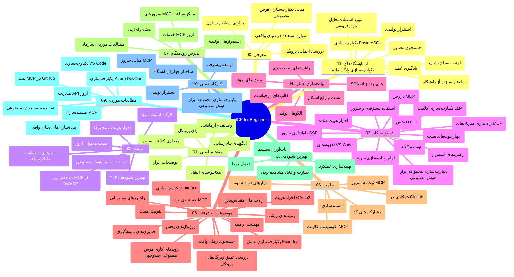

# پروتکل زمینه مدل (MCP) برای مبتدیان - راهنمای مطالعه

این راهنمای مطالعه نمای کلی از ساختار مخزن و محتوای برنامه درسی «پروتکل زمینه مدل (MCP) برای مبتدیان» را ارائه می‌دهد. از این راهنما برای پیمایش مؤثر در مخزن و بهره‌برداری بهینه از منابع موجود استفاده کنید.

## نمای کلی مخزن

پروتکل زمینه مدل (MCP) چارچوبی استاندارد برای تعاملات بین مدل‌های هوش مصنوعی و برنامه‌های مشتری است. این پروتکل در ابتدا توسط Anthropic ایجاد شد و اکنون توسط جامعه گسترده‌تر MCP از طریق سازمان رسمی گیت‌هاب مدیریت می‌شود. این مخزن یک برنامه درسی جامع با مثال‌های عملی کدنویسی به زبان‌های C#، Java، JavaScript، Python و TypeScript فراهم می‌کند که برای توسعه‌دهندگان هوش مصنوعی، معماران سیستم و مهندسان نرم‌افزار طراحی شده است.

## نقشه برنامه درسی تصویری

## ساختار مخزن

مخزن به یازده بخش اصلی سازماندهی شده است که هر کدام به جنبه‌های مختلف MCP می‌پردازند:

1. **مقدمه (00-Introduction/)**
   - نمای کلی پروتکل زمینه مدل
   - اهمیت استانداردسازی در خطوط لوله هوش مصنوعی
   - کاربردها و مزایای عملی

2. **مفاهیم پایه (01-CoreConcepts/)**
   - معماری کلاینت-سرور
   - اجزای کلیدی پروتکل
   - الگوهای پیام‌رسانی در MCP

3. **امنیت (02-Security/)**
   - تهدیدات امنیتی در سیستم‌های مبتنی بر MCP
   - بهترین شیوه‌ها برای ایمن‌سازی پیاده‌سازی‌ها
   - استراتژی‌های احراز هویت و مجوزدهی
   - **مستندات جامع امنیتی**:
     - بهترین شیوه‌های امنیتی MCP ۲۰۲۵
     - راهنمای پیاده‌سازی Azure Content Safety
     - کنترل‌ها و تکنیک‌های امنیتی MCP
     - مرجع سریع بهترین شیوه‌های MCP
   - **موضوعات کلیدی امنیتی**:
     - حملات تزریق پرامپت و مسمومیت ابزارها
     - ربایش نشست و مشکلات نماینده گیج‌شده
     - آسیب‌پذیری‌های عبور توکن
     - مجوزها و کنترل دسترسی‌های بیش از حد
     - امنیت زنجیره تأمین برای اجزای هوش مصنوعی
     - ادغام Microsoft Prompt Shields

4. **شروع به کار (03-GettingStarted/)**
   - راه‌اندازی و پیکربندی محیط
   - ایجاد سرورها و کلاینت‌های پایه MCP
   - ادغام با برنامه‌های موجود
   - شامل بخش‌هایی برای:
     - پیاده‌سازی اولین سرور
     - توسعه کلاینت
     - ادغام کلاینت LLM
     - ادغام VS Code
     - سرور رویدادهای ارسال شده از سرور (SSE)
     - استفاده پیشرفته از سرور
     - استریم HTTP
     - ادغام AI Toolkit
     - استراتژی‌های تست
     - راهنمای استقرار

5. **پیاده‌سازی عملی (04-PracticalImplementation/)**
   - استفاده از SDKها در زبان‌های برنامه‌نویسی مختلف
   - تکنیک‌های عیب‌یابی، تست و اعتبارسنجی
   - طراحی الگوهای پرامپت قابل استفاده مجدد و جریان‌های کاری
   - پروژه‌های نمونه با مثال‌های پیاده‌سازی

6. **موضوعات پیشرفته (05-AdvancedTopics/)**
   - تکنیک‌های مهندسی زمینه
   - ادغام عامل Foundry
   - جریان‌های کاری چندرسانه‌ای هوش مصنوعی
   - دموی احراز هویت OAuth2
   - قابلیت‌های جستجوی بلادرنگ
   - استریم بلادرنگ
   - پیاده‌سازی زمینه‌های ریشه
   - استراتژی‌های مسیر‌یابی
   - تکنیک‌های نمونه‌گیری
   - رویکردهای مقیاس‌پذیری
   - ملاحظات امنیتی
   - ادغام امنیت Entra ID
   - ادغام جستجوی وب

7. **مشارکت‌های جامعه (06-CommunityContributions/)**
   - راهنمای چگونگی مشارکت در کد و مستندات
   - همکاری از طریق گیت‌هاب
   - بهبودها و بازخوردهای هدایت‌شده توسط جامعه
   - استفاده از کلاینت‌های مختلف MCP (Claude Desktop، Cline، VSCode)
   - کار با سرورهای محبوب MCP شامل تولید تصویر

8. **درس‌هایی از پذیرش اولیه (07-LessonsfromEarlyAdoption/)**
   - پیاده‌سازی‌های واقعی و داستان‌های موفقیت
   - ساخت و استقرار راه‌حل‌های مبتنی بر MCP
   - روندها و نقشه راه آینده
   - **راهنمای سرورهای MCP مایکروسافت**: راهنمای جامع برای ۱۰ سرور MCP آماده تولید مایکروسافت شامل:
     - سرور Microsoft Learn Docs MCP
     - سرور Azure MCP (بیش از ۱۵ کانکتور تخصصی)
     - سرور GitHub MCP
     - سرور Azure DevOps MCP
     - سرور MarkItDown MCP
     - سرور SQL Server MCP
     - سرور Playwright MCP
     - سرور Dev Box MCP
     - سرور Azure AI Foundry MCP
     - سرور Microsoft 365 Agents Toolkit MCP

9. **بهترین شیوه‌ها (08-BestPractices/)**
   - بهینه‌سازی عملکرد و تنظیم دقیق
   - طراحی سیستم‌های MCP مقاوم در برابر خطا
   - استراتژی‌های تست و مقاومت

10. **مطالعات موردی (09-CaseStudy/)**
    - **هفت مطالعه موردی جامع** که انعطاف‌پذیری MCP را در سناریوهای متنوع نشان می‌دهند:
    - **عامل‌های سفر Azure AI**: هماهنگی چندعامله با Azure OpenAI و جستجوی AI
    - **ادغام Azure DevOps**: خودکارسازی فرآیندهای کاری با به‌روزرسانی داده‌های YouTube
    - **بازیابی اسناد بلادرنگ**: کلاینت کنسول پایتون با استریم HTTP
    - **تولید برنامه مطالعه تعاملی**: برنامه وب Chainlit با هوش مصنوعی گفتگو محور
    - **مستندسازی درون ویرایشگر**: ادغام VS Code با جریان‌های کاری GitHub Copilot
    - **مدیریت API Azure**: ادغام API سازمانی با ایجاد سرور MCP
    - **ثبت‌نام MCP GitHub**: توسعه اکوسیستم و پلتفرم ادغام عاملی
    - مثال‌های پیاده‌سازی شامل ادغام سازمانی، بهره‌وری توسعه‌دهنده و توسعه اکوسیستم

11. **کارگاه عملی (10-StreamliningAIWorkflowsBuildingAnMCPServerWithAIToolkit/)**
    - کارگاه عملی جامع ترکیب MCP با AI Toolkit
    - ساخت برنامه‌های هوشمند که پل بین مدل‌های هوش مصنوعی و ابزارهای دنیای واقعی است
    - ماژول‌های کاربردی شامل مبانی، توسعه سرور سفارشی و استراتژی‌های استقرار تولید
    - **ساختار آزمایشگاه**:
      - آزمایشگاه ۱: مبانی سرور MCP
      - آزمایشگاه ۲: توسعه پیشرفته سرور MCP
      - آزمایشگاه ۳: ادغام AI Toolkit
      - آزمایشگاه ۴: استقرار و مقیاس‌پذیری تولید
    - رویکرد یادگیری مبتنی بر آزمایشگاه با دستورالعمل‌های مرحله به مرحله

12. **آزمایشگاه‌های ادغام پایگاه داده سرور MCP (11-MCPServerHandsOnLabs/)**
    - **مسیر یادگیری جامع شامل ۱۳ آزمایشگاه** برای ساخت سرورهای MCP آماده تولید با ادغام PostgreSQL
    - **پیاده‌سازی تحلیلی خرده‌فروشی در دنیای واقعی** با استفاده از سناریوی Zava Retail
    - **الگوهای درجه سازمانی** شامل امنیت سطح ردیف (RLS)، جستجوی معنایی و دسترسی داده‌های چندمستأجری
    - **ساختار کامل آزمایشگاه**:
      - **آزمایشگاه‌های ۰۰-۰۳: پایه‌ها** - مقدمه، معماری، امنیت، راه‌اندازی محیط
      - **آزمایشگاه‌های ۰۴-۰۶: ساخت سرور MCP** - طراحی پایگاه داده، پیاده‌سازی سرور MCP، توسعه ابزار
      - **آزمایشگاه‌های ۰۷-۰۹: ویژگی‌های پیشرفته** - جستجوی معنایی، تست و عیب‌یابی، ادغام VS Code
      - **آزمایشگاه‌های ۱۰-۱۲: تولید و بهترین شیوه‌ها** - استقرار، نظارت، بهینه‌سازی
    - **فناوری‌های پوشش داده شده**: چارچوب FastMCP، PostgreSQL، Azure OpenAI، Azure Container Apps، Application Insights
    - **نتایج یادگیری**: سرورهای MCP آماده تولید، الگوهای ادغام پایگاه داده، تحلیل‌های هوش مصنوعی، امنیت سازمانی

## منابع اضافی

مخزن منابع پشتیبانی زیر را شامل می‌شود:

- **پوشه تصاویر**: شامل نمودارها و تصاویر استفاده شده در سراسر برنامه درسی
- **ترجمه‌ها**: پشتیبانی چندزبانه با ترجمه‌های خودکار مستندات
- **منابع رسمی MCP**:
  - [مستندات MCP](https://modelcontextprotocol.io/)
  - [مشخصات MCP](https://spec.modelcontextprotocol.io/)
  - [مخزن گیت‌هاب MCP](https://github.com/modelcontextprotocol)

## نحوه استفاده از این مخزن

1. **یادگیری پی‌در‌پی**: فصل‌ها را به ترتیب (۰ تا ۱۱) دنبال کنید تا یک تجربه یادگیری ساخت‌یافته داشته باشید.
2. **تمرکز بر زبان خاص**: اگر به زبان برنامه‌نویسی خاصی علاقه‌مند هستید، دایرکتوری نمونه‌ها را برای پیاده‌سازی‌ها در زبان مورد علاقه خود بررسی کنید.
3. **پیاده‌سازی عملی**: با بخش «شروع به کار» شروع کنید تا محیط خود را راه‌اندازی کرده و اولین سرور و کلاینت MCP خود را ایجاد کنید.
4. **کاوش پیشرفته**: پس از تسلط بر مبانی، به موضوعات پیشرفته وارد شوید تا دانش خود را گسترش دهید.
5. **تعامل با جامعه**: از طریق بحث‌ها و کانال‌های Discord در جامعه MCP مشارکت کنید تا با کارشناسان و توسعه‌دهندگان دیگر ارتباط برقرار کنید.

## کلاینت‌ها و ابزارهای MCP

برنامه درسی کلاینت‌ها و ابزارهای مختلف MCP را پوشش می‌دهد:

1. **کلاینت‌های رسمی**:
   - Visual Studio Code 
   - MCP در Visual Studio Code
   - Claude Desktop
   - Claude در VSCode 
   - API کلود

2. **کلاینت‌های جامعه**:
   - Cline (ترمینال‌محور)
   - Cursor (ویرایشگر کد)
   - ChatMCP
   - Windsurf

3. **ابزارهای مدیریت MCP**:
   - CLI MCP
   - مدیر MCP
   - متصل‌کننده MCP
   - مسیر‌یاب MCP

## سرورهای محبوب MCP

مخزن سرورهای مختلف MCP را معرفی می‌کند، از جمله:

1. **سرورهای رسمی مایکروسافت MCP**:
   - سرور Microsoft Learn Docs MCP
   - سرور Azure MCP (بیش از ۱۵ کانکتور تخصصی)
   - سرور GitHub MCP
   - سرور Azure DevOps MCP
   - سرور MarkItDown MCP
   - سرور SQL Server MCP
   - سرور Playwright MCP
   - سرور Dev Box MCP
   - سرور Azure AI Foundry MCP
   - سرور Microsoft 365 Agents Toolkit MCP

2. **سرورهای مرجع رسمی**:
   - سیستم فایل
   - Fetch
   - حافظه
   - تفکر متوالی

3. **تولید تصویر**:
   - Azure OpenAI DALL-E 3
   - Stable Diffusion WebUI
   - Replicate

4. **ابزارهای توسعه**:
   - Git MCP
   - کنترل ترمینال
   - دستیار کد

5. **سرورهای تخصصی**:
   - Salesforce
   - Microsoft Teams
   - Jira & Confluence

## مشارکت

این مخزن از مشارکت‌های جامعه استقبال می‌کند. بخش مشارکت‌های جامعه را برای راهنمایی در مورد چگونگی مشارکت موثر در اکوسیستم MCP مشاهده کنید.

----

*این راهنمای مطالعه آخرین بار در ۵ فوریه ۲۰۲۶ به‌روزرسانی شده است، منعکس‌کننده آخرین مشخصات MCP ۲۰۲۵-۱۱-۲۵ و نمای کلی مخزن تا آن تاریخ. محتوای مخزن ممکن است پس از این تاریخ به‌روزرسانی شود.*

---

<!-- CO-OP TRANSLATOR DISCLAIMER START -->
**سلب مسئولیت**:  
این سند با استفاده از سرویس ترجمه هوش مصنوعی [Co-op Translator](https://github.com/Azure/co-op-translator) ترجمه شده است. در حالی که ما تلاش می‌کنیم دقت را حفظ کنیم، لطفاً توجه داشته باشید که ترجمه‌های خودکار ممکن است دارای خطا یا نواقصی باشند. سند اصلی به زبان بومی آن باید به عنوان منبع معتبر در نظر گرفته شود. برای اطلاعات حیاتی، استفاده از ترجمه حرفه‌ای انسانی توصیه می‌شود. ما مسئول هیچگونه سوءتفاهم یا تفسیر نادرستی که ناشی از استفاده از این ترجمه باشد، نیستیم.
<!-- CO-OP TRANSLATOR DISCLAIMER END -->