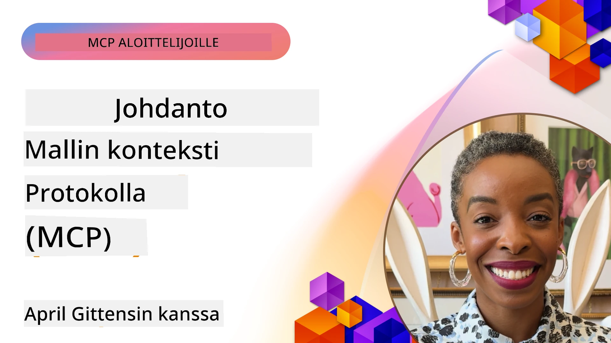
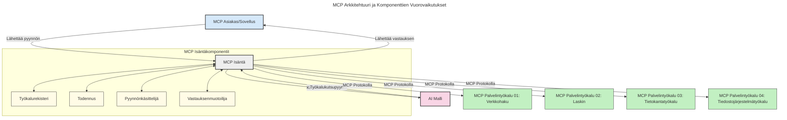
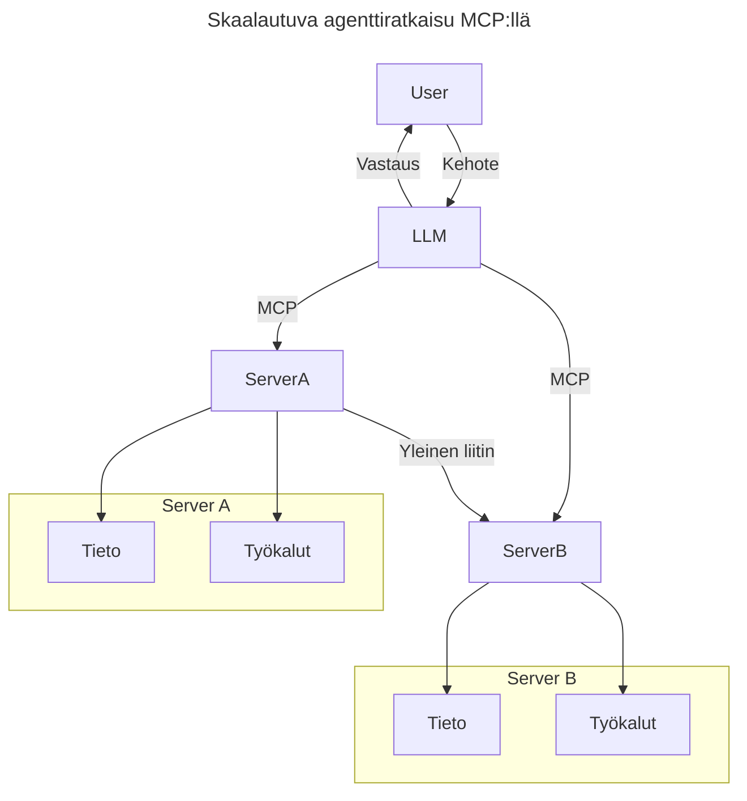
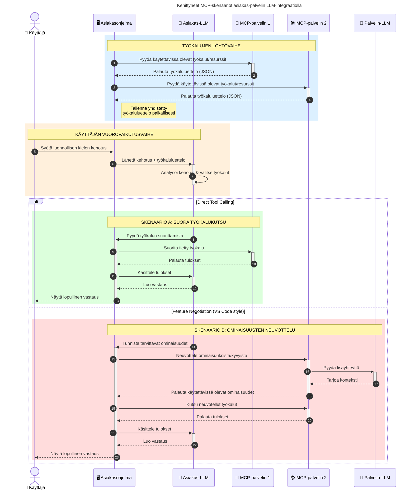

# Johdatus Model Context Protocoliin (MCP): Miksi se on tärkeä skaalautuville tekoälysovelluksille

_(Napsauta yllä olevaa kuvaa nähdäksesi tämän oppitunnin videon)_

Generatiiviset tekoälysovellukset ovat suuri askel eteenpäin, koska ne usein antavat käyttäjän olla vuorovaikutuksessa sovelluksen kanssa luonnollisen kielen kehotteilla. Kuitenkin kun näihin sovelluksiin investoidaan enemmän aikaa ja resursseja, haluat varmistaa, että voit helposti integroida toiminnallisuuksia ja resursseja siten, että niitä on helppo laajentaa, että sovelluksesi voi palvella useamman mallin käyttöä ja käsitellä erilaisia mallien erityispiirteitä. Lyhyesti sanottuna, generatiivisten tekoälysovellusten rakentaminen on helppoa aluksi, mutta niiden kasvaessa ja monimutkaistuessa sinun on aloitettava arkkitehtuurin määrittely ja todennäköisesti tukeuduttava standardiin varmistaaksesi, että sovelluksesi rakennetaan johdonmukaisella tavalla. Tässä tulee kuvaan MCP, joka järjestää asiat ja tarjoaa standardin.

---

## **🔍 Mikä on Model Context Protocol (MCP)?**

**Model Context Protocol (MCP)** on **avoin, standardoitu rajapinta**, jonka avulla suuret kielimallit (LLM) voivat olla saumatonta vuorovaikutuksessa ulkoisten työkalujen, API:en ja tietolähteiden kanssa. Se tarjoaa yhdenmukaisen arkkitehtuurin tekoälymallien toiminnallisuuden laajentamiseen heidän koulutusdatan ulkopuolelle, mahdollistaen älykkäämmät, skaalautuvat ja herkemmin vastaavat tekoälyjärjestelmät.

---

## **🎯 Miksi standardisointi tekoälyssä on tärkeää**

Kun generatiiviset tekoälysovellukset muuttuvat monimutkaisemmiksi, on tärkeää ottaa käyttöön standardeja, jotka varmistavat **skaalautuvuuden, laajennettavuuden, ylläpidettävyyden** ja **toimittajalukituksen välttämisen**. MCP vastaa näihin tarpeisiin:

- Yhdenmukaistaa mallin ja työkalujen integraatiot
- Vähentää haavoittuvia, kertaluonteisia räätälöityjä ratkaisuja
- Mahdollistaa useiden eri toimittajien mallien samanaikaisen käytön yhdessä ekosysteemissä

**Huom:** Vaikka MCP esittää itsensä avoimena standardina, ei ole suunnitelmia standardisoida MCP:tä olemassa olevien standardointielinten kuten IEEE, IETF, W3C, ISO tai muiden vastaavien toimesta.

---

## **📚 Oppimistavoitteet**

Tämän artikkelin lopussa osaat:

- Määritellä **Model Context Protocolin (MCP)** ja sen käyttötapaukset
- Ymmärtää, miten MCP standardisoi mallin ja työkalun välisen viestinnän
- Tunnistaa MCP-arkkitehtuurin ydinkomponentit
- Tutkia MCP:n käytännön sovelluksia yritys- ja kehitysympäristöissä

---

## **💡 Miksi Model Context Protocol (MCP) on merkittävä uudistus**

### **🔗 MCP ratkaisee tekoälyn vuorovaikutuksen sirpaleisuuden**

Ennen MCP:tä mallien liittäminen työkaluihin vaati:

- Räätälöityä koodia jokaiselle työkalun ja mallin parille
- Ei-standardisoituja rajapintoja jokaiselta toimittajalta
- Usein rikkoutuvia päivitysten yhteydessä
- Huonoa skaalautuvuutta työkalujen määrän kasvaessa

### **✅ MCP-standardin hyödyt**

| **Hyöty**                | **Kuvaus**                                                                   |
|--------------------------|-----------------------------------------------------------------------------|
| Yhteensopivuus           | LLM:t toimivat saumattomasti eri toimittajien työkalujen kanssa             |
| Johdonmukaisuus          | Yhtenäinen käyttäytyminen eri alustoilla ja työkaluissa                     |
| Uudelleenkäytettävyys    | Kerran rakennettuja työkaluja voidaan käyttää eri projekteissa ja järjestelmissä |
| Kehityksen nopeutus      | Vähentää kehitysaikaa käyttämällä standardoituja, plug-and-play -rajapintoja |

---

## **🧱 MCP-arkkitehtuurin yleiskatsaus**

MCP noudattaa **asiakas-palvelin -mallia**, jossa:

- **MCP Hostit** ajavat tekoälymalleja
- **MCP Clientit** aloittavat pyynnöt
- **MCP Serverit** tarjoavat kontekstia, työkaluja ja kyvykkyyksiä

### **Keskeiset komponentit:**

- **Resurssit** – staattista tai dynaamista dataa malleille  
- **Kehotteet** – ennalta määriteltyjä työnkulkuja ohjattuun generointiin  
- **Työkalut** – suoritettavia toimintoja, kuten hakuja ja laskelmia  
- **Näytteenotto** – agenttiperäistä käyttäytymistä rekursiivisten vuorovaikutusten kautta
- **Elicitointi** – palvelimen aloittamat käyttäjän syötteen pyynnöt
- **Roots** – tiedostojärjestelmän rajat palvelimen pääsynhallintaan

### **Protokollan arkkitehtuuri:**

MCP käyttää kaksikerroksista arkkitehtuuria:
- **Datalayer**: JSON-RPC 2.0 -pohjainen viestintä elinkaaren hallinnalla ja primitiiveillä
- **Kuljetuslayer**: STDIO (paikallinen) ja Streamable HTTP SSE:llä (etäviestintäkanavat)

---

## Kuinka MCP-palvelimet toimivat

MCP-palvelimet toimivat seuraavasti:

- **Pyyntövirta**:
    1. Pyyntö käynnistyy loppukäyttäjän tai hänen puolestaan toimivan ohjelmiston toimesta.
    2. **MCP Client** lähettää pyynnön **MCP Hostille**, joka hallinnoi tekoälymallin ajoa.
    3. **Tekoälymalli** vastaanottaa käyttäjän kehotteen ja voi pyytää pääsyä ulkoisiin työkaluihin tai dataan yhden tai useamman työkalukutsun kautta.
    4. **MCP Host** – ei malli suoraan – kommunikoi asiaankuuluvien **MCP Serverien** kanssa käyttäen standardoitua protokollaa.
- **MCP Hostin toiminnallisuus**:
    - **Työkalurekisteri**: ylläpitää luetteloa saatavilla olevista työkaluista ja niiden kyvyistä.
    - **Todennus**: varmistaa käyttöoikeudet työkalujen käyttöön.
    - **Pyyntöjen käsittelijä**: käsittelee mallilta saapuvat työkalupyynnöt.
    - **Vastausten muotoilija**: jäsentää työkalujen tuottamat tulokset mallille ymmärrettävään muotoon.
- **MCP Serverin suoritus**:
    - **MCP Host** ohjaa työkalukutsut yhdelle tai useammalle **MCP Serverille**, jotka tarjoavat erikoistuneita toimintoja (esim. haku, laskelmat, tietokantakyselyt).
    - **MCP Serverit** suorittavat omat operaatioonsa ja palauttavat tulokset **MCP Hostille** yhtenäisessä muodossa.
    - **MCP Host** muotoilee ja välittää nämä tulokset takaisin **tekoälymallille**.
- **Vastauksen viimeistely**:
    - **Tekoälymalli** sisällyttää työkalujen tulokset lopulliseen vastaukseen.
    - **MCP Host** lähettää vastauksen takaisin **MCP Clientille**, joka toimittaa sen loppukäyttäjälle tai kutsuvalle ohjelmistolle.
    

## 👨‍💻 Kuinka rakentaa MCP-palvelin (esimerkkien kanssa)

MCP-palvelimet antavat mahdollisuuden laajentaa LLM:ien kyvykkyyksiä tarjoamalla dataa ja toiminnallisuutta.

Valmis kokeilemaan? Tässä on kielikohtaisia ja/tai stack-spesifejä SDK:ita esimerkkeineen yksinkertaisten MCP-palvelimien luomisesta eri kielillä/pinoilla:

- **Python SDK**: https://github.com/modelcontextprotocol/python-sdk

- **TypeScript SDK**: https://github.com/modelcontextprotocol/typescript-sdk

- **Java SDK**: https://github.com/modelcontextprotocol/java-sdk

- **C#/.NET SDK**: https://github.com/modelcontextprotocol/csharp-sdk

## 🌍 MCP:n käytännön käyttötapaukset

MCP mahdollistaa laajan sovelluskirjon laajentamalla tekoälyn kyvykkyyksiä:

| **Sovellus**                 | **Kuvaus**                                                               |
|-----------------------------|--------------------------------------------------------------------------|
| Yritysdatan integrointi     | Yhdistää LLM:t tietokantoihin, CRM-järjestelmiin tai sisäisiin työkaluihin |
| Agenttiperäiset tekoälyjärjestelmät | Mahdollistaa autonomiset agentit työkalujen käyttöön ja päätöksentekoprosesseihin |
| Monimuotoiset sovellukset   | Yhdistää teksti-, kuva- ja ääni-työkalut yhtenäiseen tekoälysovellukseen   |
| Reaaliaikainen dataintegraatio | Tuodaan live-data tekoälyvuorovaikutuksiin tarkempia ja ajantasaisempia tuloksia varten |

### 🧠 MCP = Yleinen standardi tekoälyn vuorovaikutuksille

Model Context Protocol (MCP) toimii yleisenä standardina tekoälyn vuorovaikutuksessa, aivan kuten USB-C standardisoi fyysiset laiteyhteydet. Tekoälyn maailmassa MCP tarjoaa yhdenmukaisen rajapinnan, joka mahdollistaa mallien (client) saumattoman integroinnin ulkoisiin työkaluihin ja tietolähteisiin (server). Tämä poistaa tarpeen moninaisille, räätälöidyille protokollille jokaiselle API:lle tai tietolähteelle.

MCP:n mukainen työkalu (jota kutsutaan MCP-serveriksi) noudattaa yhtenäistä standardia. Nämä palvelimet voivat listata työkalunsa tai toimintonsa ja suorittaa ne, kun tekoälyagentti pyytää. MCP:tä tukevat tekoälyagenttiplatformit osaavat löytää palvelimien saatavilla olevat työkalut ja kutsua niitä tämän standardin mukaisesti.

### 💡 Mahdollistaa tiedon saatavuuden

Työkalujen tarjoamisen lisäksi MCP mahdollistaa tiedon saatavuuden. Se antaa sovelluksille mahdollisuuden tarjota kontekstia suurille kielimalleille (LLM) liittämällä ne erilaisiin tietolähteisiin. Esimerkiksi MCP-palvelin voi edustaa yrityksen asiakirjahakemistoa, jolloin agentit voivat hakea tarpeellista tietoa pyynnöstä. Toinen palvelin voi hallita erityistehtäviä, kuten sähköpostien lähettämistä tai tietueiden päivittämistä. Agentin näkökulmasta nämä ovat vain työkaluja, joita se voi käyttää – jotkut työkalut palauttavat tietoa (tieto-ympäristökontextin), toiset suorittavat toimintoja. MCP hallitsee molemmat tehokkaasti.

Agentti, joka yhdistää MCP-palvelimeen, oppii automaattisesti palvelimen saatavilla olevat kyvykkyydet ja saavutettavissa olevan datan standardoidussa muodossa. Tämä standardisointi mahdollistaa dynaamisen työkalujen saatavuuden. Esimerkiksi uuden MCP-palvelimen lisääminen agentin järjestelmään tekee sen toiminnot heti käytettäviksi ilman lisämuutoksia agentin ohjeistukseen.

Tämä virtaviivainen integraatio vastaa seuraavassa kaaviossa esitettyä mallia, jossa palvelimet tarjoavat sekä työkaluja että tietoa, varmistaen saumatonta yhteistyötä järjestelmien välillä.

### 👉 Esimerkki: Skaalautuva agenttiratkaisu

Universal Connector mahdollistaa MCP-palvelinten kommunikoinnin ja kyvykkyyksien jakamisen keskenään, jolloin ServerA voi delegoida tehtäviä ServerB:lle tai käyttää sen työkaluja ja tietoa. Tämä yhdistää työkalut ja datan palvelinten välillä, tukea skaalautuvia ja modulaarisia agenttiarkkitehtuureja. Koska MCP standardisoi työkalujen esittelyn, agentit voivat dynaamisesti löytää ja ohjata pyyntöjä eri palvelinten välillä ilman kiinteiksi koodattuja integraatioita.

Työkalujen ja tiedon yhdistäminen: Työkaluihin ja dataan pääsee käsiksi eri palvelinten kautta, mahdollistaen skaalautuvampia ja modulaarisempia agenttiperäisiä arkkitehtuureja.

### 🔄 Edistyneet MCP-skenaariot asiakaspuolen LLM-integraatiolla

Perus MCP-arkkitehtuurin lisäksi on edistyneitä skenaarioita, joissa sekä asiakas että palvelin sisältävät LLM:itä, mahdollistaen kehittyneempiä vuorovaikutuksia. Seuraavassa kaaviossa **Client App** voi olla esimerkiksi IDE, jossa on käytettävissä useita MCP-työkaluja LLM:n käyttöön:

## 🔐 MCP:n käytännön hyödyt

Näitä ovat MCP:n käytön käytännön hyödyt:

- **Ajantasaisuus**: Mallit voivat käyttää päivitettyä tietoa koulutusdatan ulkopuolelta
- **Kyvykkyyksien laajennus**: Mallit voivat hyödyntää erikoistyökaluja tehtäviin, joihin niitä ei ole opetettu
- **Havainnointivirheiden vähentyminen**: Ulkoiset tietolähteet tarjoavat faktuaalisen perustan
- **Yksityisyys**: Herkkä data voi pysyä suojatuissa ympäristöissä eikä upotettuna kehotteisiin

## 📌 Keskeiset opit

Tärkeimmät MCP:n käytön opit:

- **MCP** standardisoi, miten tekoälymallit ovat vuorovaikutuksessa työkalujen ja datan kanssa
- Edistää **laajennettavuutta, johdonmukaisuutta ja yhteensopivuutta**
- MCP auttaa **vähentämään kehitysaikaa, parantamaan luotettavuutta ja laajentamaan mallien kyvykkyyksiä**
- Asiakas-palvelin -arkkitehtuuri **mahdollistaa joustavat, laajennettavat tekoälysovellukset**

## 🧠 Harjoitus

Mieti tekoälysovellusta, jota olet kiinnostunut rakentamaan.

- Mitkä **ulkoiset työkalut tai data** voisivat parantaa sen kyvykkyyksiä?
- Kuinka MCP voisi tehdä integraatiosta **yksinkertaisempaa ja luotettavampaa?**

## Lisäresurssit

- [MCP GitHub -varasto](https://github.com/modelcontextprotocol)

## Mitä seuraavaksi

Seuraava: [Luku 1: Peruskäsitteet](../01-CoreConcepts/README.md)

---

<!-- CO-OP TRANSLATOR DISCLAIMER START -->
**Vastuuvapauslauseke**:
Tämä asiakirja on käännetty käyttämällä tekoälypohjaista käännöspalvelua [Co-op Translator](https://github.com/Azure/co-op-translator). Vaikka pyrimme tarkkuuteen, ota huomioon, että automaattiset käännökset saattavat sisältää virheitä tai epätarkkuuksia. Alkuperäinen asiakirja omalla kielellään tulisi pitää virallisena lähteenä. Tärkeiden tietojen osalta suositellaan ammattimaista ihmiskäännöstä. Emme ole vastuussa tämän käännöksen käytöstä aiheutuvista väärinymmärryksistä tai tulkinnoista.
<!-- CO-OP TRANSLATOR DISCLAIMER END -->