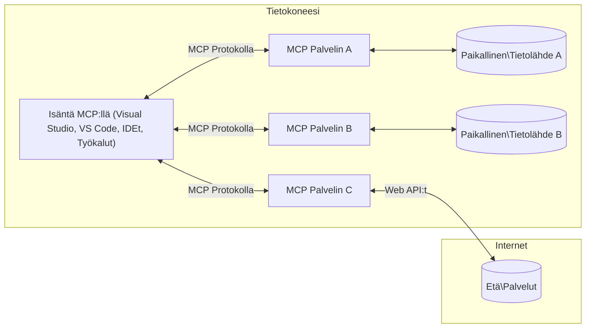

# MCP:n ydinkäsitteet: Model Context Protocolin hallinta tekoälyn integroinnissa

[](https://youtu.be/earDzWGtE84)

_(Napsauta yllä olevaa kuvaa nähdäksesi tämän oppitunnin videon)_

[Model Context Protocol (MCP)](https://github.com/modelcontextprotocol) on tehokas, standardoitu kehys, joka optimoi viestinnän suurten kielimallien (LLM) ja ulkoisten työkalujen, sovellusten ja tietolähteiden välillä. Tämä opas johdattaa sinut MCP:n ydinkäsitteisiin. Opit sen asiakas-palvelinarkkitehtuurista, olennaisista osista, viestintämekaniikoista ja toteutuksen parhaista käytännöistä.

- **Selkeä käyttäjän suostumus**: Kaikkiin tietojen käyttöihin ja toimiin tarvitaan käyttäjän selvä hyväksyntä ennen suorittamista. Käyttäjien on ymmärrettävä selkeästi, mitä tietoja käytetään ja mitä toimintoja suoritetaan, tarjoten tarkat valvontamahdollisuudet käyttöoikeuksiin ja valtuutuksiin.

- **Tietosuojan suojaaminen**: Käyttäjätiedot ovat näkyvissä vain selkeällä suostumuksella ja ne on suojattava vahvoilla käyttöoikeuksilla koko vuorovaikutusketjun ajan. Toteutusten on estettävä asiattomat tietojensiirrot ja ylläpidettävä tiukkoja tietosuoja-alueita.

- **Työkalujen turvallisuus**: Jokainen työkalukutsu edellyttää käyttäjän selkeää suostumusta käyttäen työkalun toiminnallisuuden, parametrien ja mahdollisten vaikutusten ymmärtämistä. Vahvat suojausrajat estävät ei-toivotun, turvattoman tai haitallisen työkalujen käytön.

- **Siirtokerroksen suojaus**: Kaikki viestintäkanavat tulee salata ja todentaa asianmukaisesti. Etäyhteydet tulisi toteuttaa suojatuilla siirtoprotokollilla ja asianmukaisella tunnistetietojen hallinnalla.

#### Toteutusohjeet:

- **Käyttöoikeuksien hallinta**: Toteuta hienojakoiset käyttöoikeusjärjestelmät, jotka antavat käyttäjille mahdollisuuden hallita, mitä palvelimia, työkaluja ja resursseja on käytettävissä
- **Todennus ja valtuutus**: Käytä turvallisia todennusmenetelmiä (OAuth, API-avaimet) asianmukaisella token-hallinnalla ja vanhentumisajalla  
- **Syötteen validointi**: Tarkasta kaikki parametrit ja tietosyötteet määriteltyjen skeemojen mukaisesti estääksesi injektiohyökkäyksiä
- **Tarkastuslokit**: Ylläpidä kattavat lokit kaikista toiminnoista turvallisuuden valvontaa ja vaatimustenmukaisuutta varten

## Yleiskatsaus

Tässä oppitunnissa käsitellään Model Context Protocolin (MCP) perusarkkitehtuuria ja -osia. Opit asiakas-palvelinarkkitehtuurista, keskeisistä komponenteista ja viestintämekanismeista, jotka mahdollistavat MCP:n vuorovaikutukset.

## Keskeiset oppimistavoitteet

Oppitunnin lopuksi osaat:

- Ymmärtää MCP:n asiakas-palvelinarkkitehtuurin.
- Tunnistaa Hostsien, Clientsien ja Serversien roolit ja vastuut.
- Analysoida keskeiset ominaisuudet, jotka tekevät MCP:stä joustavan integraatiokerroksen.
- Oppia, kuinka tieto virtaa MCP-ekosysteemissä.
- Saada käytännön näkemyksiä esimerkkikoodin avulla .NETissä, Javassa, Pythonissa ja JavaScriptissä.

## MCP-arkkitehtuuri: Syvällisempi katsaus

MCP-ekosysteemi rakentuu asiakas-palvelinmallin varaan. Tämä modulaarinen rakenne mahdollistaa tekoälysovellusten tehokkaan vuorovaikutuksen työkalujen, tietokantojen, API:en ja kontekstuaalisten resurssien kanssa. Puretaanpa tämä arkkitehtuuri sen ydinosiin.

Pohjimmiltaan MCP noudattaa asiakas-palvelinarkkitehtuuria, jossa isäntäohjelma voi muodostaa yhteyden useisiin palvelimiin:


- **MCP-isännät**: Ohjelmat kuten VSCode, Claude Desktop, IDE:t tai tekoälytyökalut, jotka haluavat käyttää dataa MCP:n kautta
- **MCP-asiakkaat**: Protokollan asiakkaat, jotka ylläpitävät 1:1-yhteyksiä palvelimiin
- **MCP-palvelimet**: Kevyet ohjelmat, jotka tarjoavat tiettyjä toiminnallisuuksia standardoidun Model Context Protocolin kautta
- **Paikalliset tietolähteet**: Tietokoneesi tiedostot, tietokannat ja palvelut, joihin MCP-palvelimet voivat turvallisesti päästä
- **Etäpalvelut**: Internetin kautta saatavilla olevat ulkoiset järjestelmät, joihin MCP-palvelimet voivat muodostaa yhteyden API:en kautta.

MCP-protokolla on kehittyvä standardi, joka käyttää päivämääräpohjaista versiointia (YYYY-MM-DD-muodossa). Nykyinen protokollan versio on **2025-11-25**. Voit nähdä viimeisimmät päivitykset [protokollan spesifikaatioon](https://modelcontextprotocol.io/specification/2025-11-25/).

### 1. Isännät

Model Context Protocolissa (MCP) **Isännät** ovat tekoälysovelluksia, jotka toimivat ensisijaisina rajapintoina, joiden kautta käyttäjät ovat vuorovaikutuksessa protokollan kanssa. Isännät koordinoivat ja hallinnoivat yhteyksiä useisiin MCP-palvelimiin luomalla erilliset MCP-asiakkaat jokaiselle palvelinyhteydelle. Esimerkkejä Isännistä ovat:

- **Tekoälysovellukset**: Claude Desktop, Visual Studio Code, Claude Code
- **Kehitysympäristöt**: IDE:t ja koodieditorit, joissa on MCP-integraatio  
- **Mukautetut sovellukset**: Tarkoitukseen rakennetut tekoälyagentit ja työkalut

**Isännät** ovat sovelluksia, jotka koordinoivat tekoälymallien vuorovaikutuksia. Ne:

- **Orkestroivat tekoälymalleja**: Suorittavat tai ovat vuorovaikutuksessa LLM:ien kanssa vastauksien tuottamiseksi ja koordinoivat tekoälytyönkulkuja
- **Hallinnoivat asiakasyhteyksiä**: Luovat ja ylläpitävät yhden MCP-asiakkaan per MCP-palvelinyhteys
- **Ohjaavat käyttöliittymää**: Hallitsevat keskustelun kulkua, käyttäjävuorovaikutuksia ja vastausten esittämistä  
- **Valvovat turvallisuutta**: Ohjaavat käyttöoikeuksia, suojausrajoituksia ja todennusta
- **Käsittelevät käyttäjän suostumuksen**: Hallinnoivat käyttäjän hyväksyntää tietojen jakamiseen ja työkalujen suorittamiseen

### 2. Asiakkaat

**Asiakkaat** ovat keskeisiä komponentteja, jotka ylläpitävät omistettuja yksi-yhteen-yhteyksiä hostsien ja MCP-palvelimien välillä. Jokainen MCP-asiakas luodaan Isännän toimesta yhdistämään tiettyyn MCP-palvelimeen varmistaen järjestetyt ja turvalliset viestintäkanavat. Useat asiakkaat mahdollistavat Isännille samanaikaiset yhteydet useisiin palvelimiin.

**Asiakkaat** ovat Isäntäohjelman sisällä toimivia liitinkomponentteja. Ne:

- **Protokollaviestintä**: Lähettävät JSON-RPC 2.0 -pyyntöjä palvelimille kehotteiden ja ohjeiden kanssa
- **Toiminnallisuuskartoitus**: Neuvottelevat tuetuista ominaisuuksista ja protokollaversioista palvelimien kanssa alustuksen aikana
- **Työkalujen suoritus**: Hallinnoivat mallien työkalukutsuja ja käsittelevät vastauksia
- **Reaaliaikaiset päivitykset**: Käsittelevät ilmoituksia ja reaaliaikaisia päivityksiä palvelimilta
- **Vastausten käsittely**: Käsittelevät ja muotoilevat palvelinvastaukset käyttäjille näytettäväksi

### 3. Palvelimet

**Palvelimet** ovat ohjelmia, jotka tarjoavat MCP-asiakkaille kontekstia, työkaluja ja toiminnallisuuksia. Ne voivat toimia paikallisesti (samassa koneessa kuin Isäntä) tai etänä (ulkopuolisilla alustoilla) ja ovat vastuussa asiakaspyyntöjen käsittelystä sekä jäsenneltyjen vastausten tarjoamisesta. Palvelimet tarjoavat tiettyjä toimintoja standardoidun Model Context Protocolin kautta.

**Palvelimet** ovat palveluita, jotka tarjoavat kontekstia ja toiminnallisuuksia. Ne:

- **Ominaisuuksien rekisteröinti**: Rekisteröivät ja tarjoavat asiakkaiden käyttöön saatavilla olevat primitiivit (resurssit, kehotteet, työkalut)
- **Pyyntöjen käsittely**: Vastaanottavat ja suorittavat työkalukutsut, resurssipyyntöjä ja kehotepyyntöjä asiakkailta
- **Kontekstin tarjoaminen**: Tarjoavat kontekstuaalista tietoa ja dataa mallien vastausten parantamiseksi
- **Tilanhallinta**: Ylläpitävät istunnon tilan ja käsittelevät tilallisia vuorovaikutuksia tarvittaessa
- **Reaaliaikaiset ilmoitukset**: Lähettävät ilmoituksia toiminnallisuuden muutoksista ja päivityksistä yhteydessä oleville asiakkaille

Palvelimia voi kehittää kuka tahansa laajentaakseen mallin toiminnallisuuksia erikoistuneilla ominaisuuksilla, ja ne tukevat sekä paikallista että etäkäyttöönottoa.

### 4. Palvelinten primitiivit

Model Context Protocolin (MCP) palvelimet tarjoavat kolme ydintä **primitiiviä**, jotka määrittelevät rikkaiden vuorovaikutusten perustan asiakkaiden, hostsien ja kielimallien välillä. Nämä primitiivit määrittelevät, millaista kontekstuaalista tietoa ja toimintoja protokolla tarjoaa.

MCP-palvelimet voivat tarjota minkä tahansa seuraavista kolmesta ydinfraaktiviteetista:

#### Resurssit 

**Resurssit** ovat tietolähteitä, jotka tarjoavat kontekstuaalista tietoa tekoälysovelluksille. Ne edustavat staattista tai dynaamista sisältöä, joka voi parantaa mallin ymmärrystä ja päätöksentekoa:

- **Kontekstuaalinen data**: Rakennepohjainen informaatio ja konteksti tekoälymallin käyttöön
- **Tietopohjat**: Dokumenttikokoelmat, artikkelit, manuaalit ja tutkimuspaperit
- **Paikalliset tietolähteet**: Tiedostot, tietokannat ja paikallisen järjestelmän tiedot  
- **Ulkoinen data**: API-vastaukset, verkkopalvelut ja etäjärjestelmien tiedot
- **Dynaaminen sisältö**: Reaaliaikainen data, joka päivittyy ulkoisten olosuhteiden mukaan

Resurssit tunnistetaan URI:en avulla ja ne tukevat löytymistä `resources/list`-while ja hakua `resources/read`-menetelmillä:

```text
file://documents/project-spec.md
database://production/users/schema
api://weather/current
```

#### Kehotteet

**Kehotteet** ovat uudelleenkäytettäviä malleja, jotka auttavat jäsentämään vuorovaikutusta kielimallien kanssa. Ne tarjoavat standardoidut vuorovaikutuskuviot ja malleissa käytettävät työnkulut:

- **Mallipohjaiset vuorovaikutukset**: Ennalta rakennetut viestit ja keskustelun aloittajat
- **Työnkulkumallit**: Standardoidut sarjat yleisiin tehtäviin ja vuorovaikutuksiin
- **Few-shot-esimerkit**: Esimerkkipohjaiset mallit mallin ohjaukseen
- **Järjestelmäkehoteet**: Perustavissa olevat kehotteet, jotka määrittelevät mallin käyttäytymisen ja kontekstin
- **Dynaamiset mallit**: Parametrisoidut kehotteet, jotka mukautuvat tiettyihin konteksteihin

Kehotteet tukevat muuttujien korvaamista ja ne voi löytää käyttämällä `prompts/list` ja hakea `prompts/get`:

```markdown
Generate a {{task_type}} for {{product}} targeting {{audience}} with the following requirements: {{requirements}}
```

#### Työkalut

**Työkalut** ovat suoritettavia toimintoja, joita tekoälymallit voivat kutsua tehdäkseen tiettyjä toimintoja. Ne edustavat MCP-ekosysteemin "verbejä", mahdollistaen mallien vuorovaikutuksen ulkoisten järjestelmien kanssa:

- **Suoritettavat funktiot**: Erilliset operaatiot, joita mallit voivat kutsua tietyillä parametreilla
- **Ulkoinen järjestelmäintegraatio**: API-kutsut, tietokantahaut, tiedostotoiminnot, laskelmat
- **Uniikki identiteetti**: Jokaisella työkalulla on oma nimi, kuvaus ja parametrien skeema
- **Rakennepohjainen syöte/tulos**: Työkalut hyväksyvät validoidut parametrit ja palauttavat jäsennellyn, tyypitetyn vastauksen
- **Toimintakyvyt**: Mahdollistavat mallien suorittaa todellisen maailman toimia ja noutaa reaaliaikaisia tietoja

Työkalut määritellään JSON Schemaa käyttäen parametrien validointiin, ja ne löytyvät `tools/list` kautta sekä suoritetaan `tools/call`:lla. Työkaluihin voi myös sisältyä **ikoneja** lisätietona parempaa käyttöliittymän esitystä varten.

**Työkalun merkinnät**: Työkalut tukevat käyttäytymistä kuvaavia merkintöjä (esim. `readOnlyHint`, `destructiveHint`), jotka ilmaisevat, onko työkalu vain luku -tilassa tai tuhoava, auttaen asiakkaita tekemään tietoisia päätöksiä työkalun käytöstä.

Esimerkki työkalun määritelmästä:

```typescript
server.tool(
  "search_products", 
  {
    query: z.string().describe("Search query for products"),
    category: z.string().optional().describe("Product category filter"),
    max_results: z.number().default(10).describe("Maximum results to return")
  }, 
  async (params) => {
    // Suorita haku ja palauta jäsennellyt tulokset
    return await productService.search(params);
  }
);
```

## Asiakasprimitiivit

Model Context Protocolissa (MCP) **asiakkaat** voivat tarjota primitiivejä, joiden avulla palvelimet voivat pyytää lisätoimintoja isäntäohjelmalta. Nämä asiakaspuolen primitiivit mahdollistavat rikkaammat, interaktiivisemmat palvelinratkaisut, jotka pääsevät käsiksi tekoälymallien toimintoihin ja käyttäjävuorovaikutuksiin.

### Näytteenotto

**Näytteenotto** mahdollistaa palvelimien pyytää kielimallin täydentämisiä asiakkaan tekoälysovellukselta. Tämä primitiivi antaa palvelimille pääsyn LLM-toimintoihin ilman oman malliriippuvuuden upottamista:

- **Mallista riippumaton pääsy**: Palvelimet voivat pyytää täydennyksiä ilman LLM-SDK:iden tai mallin hallinnan sisällyttämistä
- **Palvelimen aloittama tekoälytoiminto**: Mahdollistaa palvelimien autonomisen sisällön generoinnin asiakkaan mallin avulla
- **Rekursiiviset LLM-vuorovaikutukset**: Tukee monimutkaisia skenaarioita, joissa palvelimet tarvitsevat tekoälyapua käsittelyssä
- **Dynaaminen sisällön generointi**: Mahdollistaa palvelimien luoda kontekstuaalisia vastauksia hostin mallin avulla
- **Työkalukutsujen tuki**: Palvelimet voivat sisällyttää `tools` ja `toolChoice` parametreja, jotta asiakkaan malli voi kutsua työkaluja näytteenoton aikana

Näytteenotto käynnistetään `sampling/complete` -menetelmällä, jossa palvelimet lähettävät täydennyspyyntöjä asiakkaille.

### Juuret

**Juuret** tarjoavat standardoidun tavan asiakkaille paljastaa tiedostojärjestelmän rajat palvelimille, auttaen palvelimia ymmärtämään, mihin hakemistoihin ja tiedostoihin niillä on pääsy:

- **Tiedostojärjestelmän rajat**: Määrittelevät alueet, joilla palvelimet voivat toimia tiedostojärjestelmässä
- **Käyttöoikeuksien hallinta**: Auttaa palvelimia ymmärtämään, mihin hakemistoihin ja tiedostoihin niillä on oikeudet
- **Dynaamiset päivitykset**: Asiakkaat voivat ilmoittaa palvelimille, kun juuriluettelo muuttuu
- **URI-pohjainen tunnistus**: Juuret käyttävät `file://` URI:ja tunnistaakseen käytettävissä olevat hakemistot ja tiedostot

Juuret löytyvät `roots/list` -menetelmällä ja asiakkaat lähettävät `notifications/roots/list_changed` -ilmoituksen juurien muuttuessa.

### Tiedon keruu

**Tiedon keruu** mahdollistaa palvelimien pyytää lisätietoja tai vahvistuksia käyttäjiltä asiakkaan käyttöliittymän kautta:

- **Käyttäjän syötteen pyynnöt**: Palvelimet voivat pyytää lisätietoja tarvittaessa työkalujen suorittamiseen
- **Vahvistuskeskustelut**: Pyytää käyttäjältä hyväksyntää arkaluontoisiin tai vaikutuksiltaan merkittäviin toimiin
- **Interaktiiviset työnkulut**: Mahdollistavat palvelimien luoda vaiheittaisia käyttäjävuorovaikutuksia
- **Dynaaminen parametrien keruu**: Kerää puuttuvia tai valinnaisia parametreja työkalun käytön aikana

Tiedon keruupyynnöt tehdään `elicitation/request` -menetelmän avulla käyttäjän syötteen keräämiseksi asiakkaan käyttöliittymän kautta.

**URL-tilan tiedon keruu**: Palvelimet voivat myös pyytää URL-pohjaisia käyttäjävuorovaikutuksia, jolloin palvelimet voivat ohjata käyttäjiä ulkoisille verkkosivuille todennusta, vahvistusta tai tiedon syöttöä varten.

### Lokitus

**Lokitus** antaa palvelimille mahdollisuuden lähettää jäsenneltyjä lokiviestejä asiakkaille debuggausta, valvontaa ja toimintojen näkyvyyttä varten:

- **Debug-käyttö**: Antaa palvelimille yksityiskohtaiset suorituksen lokit vianmääritykseen
- **Toiminnan valvonta**: Lähettää tilapäivityksiä ja suorituskykymittareita asiakkaille
- **Virheraportointi**: Tarjoaa yksityiskohtaisen virhekontekstin ja diagnostiikkatiedot
- **Tarkastuspolut**: Luo kattavat lokit palvelimen toiminnoista ja päätöksistä

Lokitusviestit lähetetään asiakkaille tarjoten läpinäkyvyyttä palvelimen toimintoihin ja helpottaen debuggausta.

## Tiedon kulku MCP:ssä

Model Context Protocol (MCP) määrittelee rakenteellisen tiedonkulun isäntien, asiakkaiden, palvelinten ja mallien välillä. Tämän kulun ymmärtäminen auttaa selventämään, miten käyttäjän pyynnöt käsitellään ja miten ulkoiset työkalut ja data integroidaan mallin vastauksiin.

- **Isäntä aloittaa yhteyden**  
  Isäntäohjelma (kuten IDE tai keskusteluliitäntä) muodostaa yhteyden MCP-palvelimeen, tyypillisesti STDIO:n, WebSocketin tai muun tuetun siirtotavan kautta.

- **Toiminnallisuuksien neuvottelu**  
  Asiakas (isännän sisällä) ja palvelin vaihtavat tietoa tuetuista ominaisuuksista, työkaluista, resursseista ja protokollaversioista. Tämä varmistaa, että molemmat osapuolet ymmärtävät sessiota varten käytettävissä olevat kyvyt.

- **Käyttäjän pyyntö**  
  Käyttäjä on vuorovaikutuksessa isännän kanssa (esim. kirjoittaa kehotteen tai komennon). Isäntä kerää tämän syötteen ja välittää sen asiakkaalle käsiteltäväksi.

- **Resurssin tai työkalun käyttö**  
  - Asiakas voi pyytää lisäkontekstia tai resursseja palvelimelta (kuten tiedostoja, tietokanta- tai tietopohja-artikkeleita) mallin ymmärryksen rikastamiseksi.  
  - Jos malli päättää, että työkalu on tarpeen (esim. tiedon hakemiseen, laskelman suorittamiseen tai API-kutsuun), asiakas lähettää työkalukutsupyynnön palvelimelle, määrittäen työkalun nimen ja parametrit.

- **Palvelimen suoritus**  

Palvelin vastaanottaa resurssi- tai työkalupyynnön, suorittaa tarvittavat toiminnot (kuten funktion ajon, tietokantahaun tai tiedoston noutamisen) ja palauttaa tulokset asiakkaalle jäsennellyssä muodossa.

- **Vastauksen luonti**  
  Asiakas yhdistää palvelimen vastaukset (resurssidatat, työkalujen tulosteet jne.) käynnissä olevaan mallin vuorovaikutukseen. Malli käyttää tätä tietoa tuottaakseen kattavan ja asiayhteyteen sopivan vastauksen.

- **Tulosten esittäminen**  
  Isäntä vastaanottaa lopullisen tulosteen asiakkaalta ja esittää sen käyttäjälle, usein sisältäen sekä mallin generoiman tekstin että työkalujen suoritusten tai resurssihakujen tulokset.

Tämä prosessi mahdollistaa MCP:n tukevan kehittyneitä, interaktiivisia ja kontekstitietoisia tekoälysovelluksia yhdistämällä saumattomasti malleja ulkoisiin työkaluihin ja tietolähteisiin.

## Protokollan arkkitehtuuri & kerrokset

MCP koostuu kahdesta erillisestä arkkitehtuurikerroksesta, jotka toimivat yhdessä tarjoten täydellisen viestintäkehikon:

### Data-kerros

**Data-kerros** toteuttaa MCP-protokollan ytimen käyttäen **JSON-RPC 2.0** -protokollaa perustana. Tämä kerros määrittelee viestimallin, semantiikan ja vuorovaikutuskuviot:

#### Ydinkomponentit:

- **JSON-RPC 2.0 -protokolla**: Kaikki viestintä käyttää standardoitua JSON-RPC 2.0 -viestimuotoa metodikutsuissa, vastauksissa ja ilmoituksissa
- **Elinkaaren hallinta**: Käsittelee yhteyden alustamisen, ominaisuuksien neuvottelun ja istunnon päättämisen asiakkaiden ja palvelimien välillä
- **Palvelimen primitiivit**: Mahdollistaa palvelimien tarjoavan perustoiminnallisuutta työkalujen, resurssien ja kehotteiden kautta
- **Asiakasprimitiivit**: Mahdollistaa palvelimien pyytää näytteistystä LLM:istä, saada käyttäjän syötteitä ja lähettää lokiviestejä
- **Reaaliaikaiset ilmoitukset**: Tukee asynkronisia ilmoituksia dynaamisia päivityksiä varten ilman kyselyä

#### Keskeiset ominaisuudet:

- **Protokollaversion neuvottelu**: Käyttää päivämääräpohjaista versiointia (VVVV-KK-PP) yhteensopivuuden varmistamiseksi
- **Ominaisuuksien löytyminen**: Asiakkaat ja palvelimet vaihtavat alustuksen aikana tietoa tuetuista ominaisuuksista
- **Tilalliset istunnot**: Säilyttää yhteystilan useiden vuorovaikutusten ajan asiayhteyden jatkuvuuden varmistamiseksi

### Kuljetuskerros

**Kuljetuskerros** hallinnoi viestintäkanavia, viestien kehystä ja todennusta MCP-osapuolten välillä:

#### Tuetut kuljetusmekanismit:

1. **STDIO-kuljetus**:
   - Käyttää standarditulostus- ja -syöttövirtoja suorassa prosessien välisessä viestinnässä
   - Optimaalinen paikallisille prosesseille samalla koneella ilman verkkoviiveitä
   - Yleisesti käytetty paikallisten MCP-palvelinten toteutuksissa

2. **Streamattava HTTP-kuljetus**:
   - Käyttää HTTP POST -metodia asiakas-palvelin -viesteille  
   - Valinnainen palvelinlähetetyt tapahtumat (SSE) palvelimen ja asiakkaan väliseen striimaukseen
   - Mahdollistaa etäpalvelinviestinnän eri verkkojen yli
   - Tukee standardia HTTP-todennusta (Bearer-tunnukset, API-avaimet, omat otsikot)
   - MCP suosittelee OAuthia turvalliseen token-pohjaiseen todennukseen

#### Kuljetuksen abstraktio:

Kuljetuskerros abstrahoi viestinnän yksityiskohdat data-kerrokselta mahdollistaen saman JSON-RPC 2.0 -viestimuodon käytön kaikilla kuljetusmekanismeilla. Tämä mahdollistaa sovellusten sujuvan siirtymisen paikallisen ja etäpalvelimen välillä.

### Turvallisuusnäkökohdat

MCP-toteutusten on noudatettava useita keskeisiä turvallisuusperiaatteita taatakseen turvalliset, luotettavat ja turvalliset vuorovaikutukset kaikissa protokollan toiminnoissa:

- **Käyttäjän suostumus ja hallinta**: Käyttäjän on annettava nimenomainen suostumus ennen kuin mitään tietoja käytetään tai toimintoja suoritetaan. Käyttäjällä on oltava selkeä kontrolli ja hallinta siitä, mitä tietoja jaetaan ja mitä toimenpiteitä valtuutetaan, tuettuna intuitiivisilla käyttöliittymillä toiminnan tarkasteluun ja hyväksymiseen.

- **Tietosuoja**: Käyttäjätiedot tulee altistaa vain nimenomaisella suostumuksella, ja ne on suojattava asianmukaisin pääsynhallintakeinoin. MCP:n toteuttajien on suojeltava luvattomalta tietojen siirrolta ja varmistettava yksityisyyden säilyminen kaikissa vuorovaikutuksissa.

- **Työkalujen turvallisuus**: Ennen minkään työkalun kutsumista vaaditaan käyttäjän nimenomainen suostumus. Käyttäjien tulee ymmärtää jokaisen työkalun toiminnallisuus, ja vahvat turvallisuusrajat on toteutettava odottamattomien tai vaarallisten suoritusten estämiseksi.

Noudattamalla näitä turvallisuusperiaatteita MCP varmistaa käyttäjien luottamuksen, yksityisyyden ja turvallisuuden kaikissa protokollavuutorovaikutuksissa samalla kun se mahdollistaa tehokkaat tekoälyintegraatiot.

## Koodiesimerkit: keskeiset komponentit

Alla on koodiesimerkkejä suosituilla ohjelmointikielillä, jotka havainnollistavat, kuinka toteuttaa keskeiset MCP-palvelinkomponentit ja työkalut.

### .NET-esimerkki: yksinkertaisen MCP-palvelimen luominen työkaluilla

Tässä on käytännön .NET-koodiesimerkki, joka osoittaa, miten toteuttaa yksinkertainen MCP-palvelin käyttäen omia työkaluja. Tämä esimerkki näyttää, miten työkalut määritellään ja rekisteröidään, miten käsitellään pyyntöjä ja kytketään palvelin Model Context Protocoliin.

```csharp
using System;
using System.Threading.Tasks;
using ModelContextProtocol.Server;
using ModelContextProtocol.Server.Transport;
using ModelContextProtocol.Server.Tools;

public class WeatherServer
{
    public static async Task Main(string[] args)
    {
        // Create an MCP server
        var server = new McpServer(
            name: "Weather MCP Server",
            version: "1.0.0"
        );
        
        // Register our custom weather tool
        server.AddTool<string, WeatherData>("weatherTool", 
            description: "Gets current weather for a location",
            execute: async (location) => {
                // Call weather API (simplified)
                var weatherData = await GetWeatherDataAsync(location);
                return weatherData;
            });
        
        // Connect the server using stdio transport
        var transport = new StdioServerTransport();
        await server.ConnectAsync(transport);
        
        Console.WriteLine("Weather MCP Server started");
        
        // Keep the server running until process is terminated
        await Task.Delay(-1);
    }
    
    private static async Task<WeatherData> GetWeatherDataAsync(string location)
    {
        // This would normally call a weather API
        // Simplified for demonstration
        await Task.Delay(100); // Simulate API call
        return new WeatherData { 
            Temperature = 72.5,
            Conditions = "Sunny",
            Location = location
        };
    }
}

public class WeatherData
{
    public double Temperature { get; set; }
    public string Conditions { get; set; }
    public string Location { get; set; }
}
```

### Java-esimerkki: MCP-palvelinkomponentit

Tämä esimerkki näyttää saman MCP-palvelimen ja työkalujen rekisteröinnin kuin yllä oleva .NET-esimerkki, mutta toteutettuna Javalla.

```java
import io.modelcontextprotocol.server.McpServer;
import io.modelcontextprotocol.server.McpToolDefinition;
import io.modelcontextprotocol.server.transport.StdioServerTransport;
import io.modelcontextprotocol.server.tool.ToolExecutionContext;
import io.modelcontextprotocol.server.tool.ToolResponse;

public class WeatherMcpServer {
    public static void main(String[] args) throws Exception {
        // Luo MCP-palvelin
        McpServer server = McpServer.builder()
            .name("Weather MCP Server")
            .version("1.0.0")
            .build();
            
        // Rekisteröi säätyökalu
        server.registerTool(McpToolDefinition.builder("weatherTool")
            .description("Gets current weather for a location")
            .parameter("location", String.class)
            .execute((ToolExecutionContext ctx) -> {
                String location = ctx.getParameter("location", String.class);
                
                // Hae säädataa (yksinkertaistettu)
                WeatherData data = getWeatherData(location);
                
                // Palauta muotoiltu vastaus
                return ToolResponse.content(
                    String.format("Temperature: %.1f°F, Conditions: %s, Location: %s", 
                    data.getTemperature(), 
                    data.getConditions(), 
                    data.getLocation())
                );
            })
            .build());
        
        // Yhdistä palvelin käyttämällä stdio-siirtoa
        try (StdioServerTransport transport = new StdioServerTransport()) {
            server.connect(transport);
            System.out.println("Weather MCP Server started");
            // Pidä palvelin käynnissä, kunnes prosessi lopetetaan
            Thread.currentThread().join();
        }
    }
    
    private static WeatherData getWeatherData(String location) {
        // Toteutus kutsuisi sää APIa
        // Yksinkertaistettu esimerkkitarkoituksiin
        return new WeatherData(72.5, "Sunny", location);
    }
}

class WeatherData {
    private double temperature;
    private String conditions;
    private String location;
    
    public WeatherData(double temperature, String conditions, String location) {
        this.temperature = temperature;
        this.conditions = conditions;
        this.location = location;
    }
    
    public double getTemperature() {
        return temperature;
    }
    
    public String getConditions() {
        return conditions;
    }
    
    public String getLocation() {
        return location;
    }
}
```

### Python-esimerkki: MCP-palvelimen rakentaminen

Tämä esimerkki käyttää fastmcp-kirjastoa, joten varmista että asennat sen ensin:

```python
pip install fastmcp
```
Koodinäyte:

```python
#!/usr/bin/env python3
import asyncio
from fastmcp import FastMCP
from fastmcp.transports.stdio import serve_stdio

# Luo FastMCP-palvelin
mcp = FastMCP(
    name="Weather MCP Server",
    version="1.0.0"
)

@mcp.tool()
def get_weather(location: str) -> dict:
    """Gets current weather for a location."""
    return {
        "temperature": 72.5,
        "conditions": "Sunny",
        "location": location
    }

# Vaihtoehtoinen lähestymistapa luokan avulla
class WeatherTools:
    @mcp.tool()
    def forecast(self, location: str, days: int = 1) -> dict:
        """Gets weather forecast for a location for the specified number of days."""
        return {
            "location": location,
            "forecast": [
                {"day": i+1, "temperature": 70 + i, "conditions": "Partly Cloudy"}
                for i in range(days)
            ]
        }

# Rekisteröi luokan työkalut
weather_tools = WeatherTools()

# Käynnistä palvelin
if __name__ == "__main__":
    asyncio.run(serve_stdio(mcp))
```

### JavaScript-esimerkki: MCP-palvelimen luominen

Tässä esimerkissä luodaan MCP-palvelin JavaScriptillä ja rekisteröidään siihen kaksi säähän liittyvää työkalua.

```javascript
// Käytetään virallista Model Context Protocol SDK:ta
import { McpServer } from "@modelcontextprotocol/sdk/server/mcp.js";
import { StdioServerTransport } from "@modelcontextprotocol/sdk/server/stdio.js";
import { z } from "zod"; // Parametrien validointia varten

// Luo MCP-palvelin
const server = new McpServer({
  name: "Weather MCP Server",
  version: "1.0.0"
});

// Määrittele säätyökalu
server.tool(
  "weatherTool",
  {
    location: z.string().describe("The location to get weather for")
  },
  async ({ location }) => {
    // Tämä kutsuisi normaalisti sää-API:a
    // Yksinkertaistettu demonstraatiota varten
    const weatherData = await getWeatherData(location);
    
    return {
      content: [
        { 
          type: "text", 
          text: `Temperature: ${weatherData.temperature}°F, Conditions: ${weatherData.conditions}, Location: ${weatherData.location}` 
        }
      ]
    };
  }
);

// Määrittele ennustetyökalu
server.tool(
  "forecastTool",
  {
    location: z.string(),
    days: z.number().default(3).describe("Number of days for forecast")
  },
  async ({ location, days }) => {
    // Tämä kutsuisi normaalisti sää-API:a
    // Yksinkertaistettu demonstraatiota varten
    const forecast = await getForecastData(location, days);
    
    return {
      content: [
        { 
          type: "text", 
          text: `${days}-day forecast for ${location}: ${JSON.stringify(forecast)}` 
        }
      ]
    };
  }
);

// Apufunktiot
async function getWeatherData(location) {
  // Simuloi API-kutsua
  return {
    temperature: 72.5,
    conditions: "Sunny",
    location: location
  };
}

async function getForecastData(location, days) {
  // Simuloi API-kutsua
  return Array.from({ length: days }, (_, i) => ({
    day: i + 1,
    temperature: 70 + Math.floor(Math.random() * 10),
    conditions: i % 2 === 0 ? "Sunny" : "Partly Cloudy"
  }));
}

// Yhdistä palvelin stdio-siirrolla
const transport = new StdioServerTransport();
server.connect(transport).catch(console.error);

console.log("Weather MCP Server started");
```

Tämä JavaScript-esimerkki osoittaa, kuinka luodaan MCP-asiakas, joka yhdistää palvelimeen, lähettää kehotteen ja käsittelee vastauksen, mukaan lukien suoritetut työkalukutsut.

## Turvallisuus ja valtuutus

MCP sisältää useita sisäänrakennettuja käsitteitä ja mekanismeja turvallisuuden ja valtuutuksen hallintaan koko protokollassa:

1. **Työkalujen käyttöoikeuksien hallinta**:  
  Asiakkaat voivat määritellä, mitä työkaluja malli saa käyttää istunnon aikana. Tämä varmistaa, että vain nimenomaisesti valtuutetut työkalut ovat käytettävissä, mikä vähentää ei-toivottujen tai vaarallisten toimintojen riskiä. Käyttöoikeudet voidaan konfiguroida dynaamisesti käyttäjäasetusten, organisaatiopolitiikkojen tai vuorovaikutuksen asiayhteyden mukaan.

2. **Todennus**:  
  Palvelimet voivat vaatia todennusta ennen kuin pääsy annetaan työkaluihin, resursseihin tai arkaluonteisiin toimintoihin. Tämä voi sisältää API-avaimia, OAuth-tunnuksia tai muita todennusjärjestelmiä. Asianmukainen todennus varmistaa, että vain luotettavat asiakkaat ja käyttäjät voivat käyttää palvelimen toiminnallisuuksia.

3. **Validointi**:  
  Kaikkien työkalukutsujen parametrien validointi on pakollista. Jokainen työkalu määrittelee odotetut tyypit, muodot ja rajoitteet parametreilleen, ja palvelin validoi saapuvat pyynnöt niiden mukaisesti. Tämä estää virheellisten tai haitallisten syötteiden pääsyn työkalujen toteutuksiin ja auttaa säilyttämään toimintojen eheyden.

4. **Nopeusrajoitus**:  
  Palvelimet voivat käyttää nopeusrajoituksia estääkseen väärinkäytöksiä ja varmistaakseen resurssien reilun käytön. Nopeusrajoitukset voidaan asettaa käyttäjäkohtaisesti, istunnon mukaan tai globaaleina, ja ne suojaavat palvelinta palvelunestohyökkäyksiltä tai liian suurelta resurssien kulutukselta.

Yhdistämällä nämä mekanismit MCP tarjoaa turvallisen perustan kielimallien integroinnille ulkoisiin työkaluihin ja tietolähteisiin sekä antaa käyttäjille ja kehittäjille hienojakoisen hallinnan pääsyyn ja käyttöön.

## Protokollaviestit & viestintävirta

MCP-viestintä käyttää jäsenneltyjä **JSON-RPC 2.0** -viestejä selkeiden ja luotettavien vuorovaikutusten mahdollistamiseksi isäntien, asiakkaiden ja palvelimien välillä. Protokolla määrittelee erityisiä viestimallimalleja eri toimintaesityypeille:

### Ydinsanomatyyppit:

#### **Alustusviestit**
- **`initialize` -pyyntö**: Perustaa yhteyden ja neuvottelee protokollaversion ja ominaisuudet
- **`initialize` -vastaus**: Vahvistaa tuetut ominaisuudet ja palvelintiedot  
- **`notifications/initialized`**: Ilmoittaa, että alustus on valmis ja istunto alkaa

#### **Löytöviestit**
- **`tools/list` -pyyntö**: Hakee palvelimelta käytettävissä olevat työkalut
- **`resources/list` -pyyntö**: Listaa saatavilla olevat resurssit (datalähteet)
- **`prompts/list` -pyyntö**: Noutaa saatavilla olevat kehotepohjat

#### **Suoritusviestit**  
- **`tools/call` -pyyntö**: Suorittaa tietyn työkalun annetuilla parametreilla
- **`resources/read` -pyyntö**: Hakee sisällön tietyltä resurssilta
- **`prompts/get` -pyyntö**: Hakee kehotepohjan valinnaisilla parametreilla

#### **Asiakaspuolen viestit**
- **`sampling/complete` -pyyntö**: Palvelin pyytää LLM-vastausta asiakkaalta
- **`elicitation/request`**: Palvelin pyytää käyttäjän syötettä asiakasliitännän kautta
- **Lokiviestit**: Palvelin lähettää jäsenneltyjä lokiviestejä asiakkaalle

#### **Ilmoitusviestit**
- **`notifications/tools/list_changed`**: Palvelin ilmoittaa asiakkaalle työkalujen muutoksista
- **`notifications/resources/list_changed`**: Palvelin ilmoittaa asiakkaalle resurssimuutoksista  
- **`notifications/prompts/list_changed`**: Palvelin ilmoittaa asiakkaalle kehotemuutoksista

### Viestin rakenne:

Kaikki MCP-viestit noudattavat JSON-RPC 2.0 -muotoa, jossa:
- **Pyyntöviestit**: Sisältävät `id`-, `method`- ja valinnaiset `params`-kentät
- **Vastausviestit**: Sisältävät `id`-kentän ja joko `result`- tai `error`-kentän  
- **Ilmoitusviestit**: Sisältävät `method`- ja valinnaiset `params`-kentät (ei `id`:tä tai vastausta odoteta)

Tämä jäsennelty viestintä varmistaa luotettavan, jäljitettävän ja laajennettavan vuorovaikutuksen, joka tukee kehittyneitä skenaarioita kuten reaaliaikapäivitykset, työkaluketjut ja vankka virheenkäsittely.

### Tehtävät (kokeellinen)

**Tehtävät** ovat kokeellinen ominaisuus, joka tarjoaa kestävät suorituspaketit mahdollistaen tulosten viivästyneen haku- ja tilan seurannan MCP-pyynnöille:

- **Pitkät käynnissä olevat operaatiot**: Seuraa vaativia laskentoja, työnkulkujen automaatiota ja eräajoa
- **Viivästyneet tulokset**: Kyselyt tehtävän tilasta ja tulosten hakeminen, kun operaatio on valmis
- **Tilan seuranta**: Seuraa tehtävän etenemistä määriteltyjen elinkaaritilojen kautta
- **Monivaiheiset operaatiot**: Tukee monimutkaisia työnkulkuja, jotka kattavat useita vuorovaikutuksia

Tehtävät kietovat tavanomaiset MCP-pyynnöt mahdollistamaan asynkroniset suoritustavat toimintoihin, joita ei voida suorittaa heti loppuun.

## Keskeiset opit

- **Arkkitehtuuri**: MCP käyttää asiakas-palvelin-arkkitehtuuria, jossa isännät hallinnoivat useita asiakasyhteyksiä palvelimille
- **Osapuolet**: Ekosysteemi sisältää isännät (tekoälysovellukset), asiakkaat (protokollaliitännät) ja palvelimet (ominaisuuksien tarjoajat)
- **Kuljetusmekanismit**: Viestintä tukee STDIO:ta (paikallinen) ja Streamattavaa HTTP:tä valinnaisella SSE:llä (etä)
- **Ydinkomponentit**: Palvelimet tarjoavat työkaluja (suoritettavat funktiot), resursseja (datalähteet) ja kehotteita (pohjat)
- **Asiakasprimitiivit**: Palvelimet voivat pyytää näytteistystä (LLM-valmiudet ja työkalukutsujen tuki), kehotteiden pyyntöjä (käyttäjän syötteet mukaan lukien URL-tila), juuria (tiedostojärjestelmän rajat) sekä lokitusta asiakkailta
- **Kokeelliset ominaisuudet**: Tehtävät tarjoavat kestävät suorituksen kääreet pitkille toiminnoille
- **Protokollan perusta**: Rakennettu JSON-RPC 2.0:lle päivämääräpohjaisella versioinnilla (nykyinen: 2025-11-25)
- **Reaaliaikaiset kyvykkyydet**: Tukee ilmoituksia dynaamisia päivityksiä ja reaaliaikaista synkronointia varten
- **Turvallisuus edellä**: Selkeä käyttäjän suostumus, tietosuoja ja turvallinen viestintä ovat keskeisiä vaatimuksia

## Harjoitus

Suunnittele yksinkertainen MCP-työkalu, joka olisi hyödyllinen sinun alallasi. Määrittele:
1. Mikä työkalun nimi olisi
2. Mitä parametreja se vastaanottaisi
3. Mitä tulosta se palauttaisi
4. Miten malli voisi käyttää tätä työkalua ratkaistakseen käyttäjän ongelmia


---

## Mitä seuraavaksi

Seuraavaksi: [Luku 2: Turvallisuus](../02-Security/README.md)

---

<!-- CO-OP TRANSLATOR DISCLAIMER START -->
**Vastuuvapauslauseke**:  
Tämä asiakirja on käännetty käyttämällä tekoälypohjaista käännöspalvelua [Co-op Translator](https://github.com/Azure/co-op-translator). Vaikka pyrimme tarkkuuteen, automaattiset käännökset saattavat sisältää virheitä tai epätarkkuuksia. Alkuperäistä asiakirjaa sen alkuperäiskielellä tulee pitää ensisijaisena lähteenä. Tärkeissä asioissa suositellaan ammattimaista ihmiskäännöstä. Emme ole vastuussa tästä käännöksestä aiheutuvista väärinymmärryksistä tai virhetulkinnasta.
<!-- CO-OP TRANSLATOR DISCLAIMER END -->