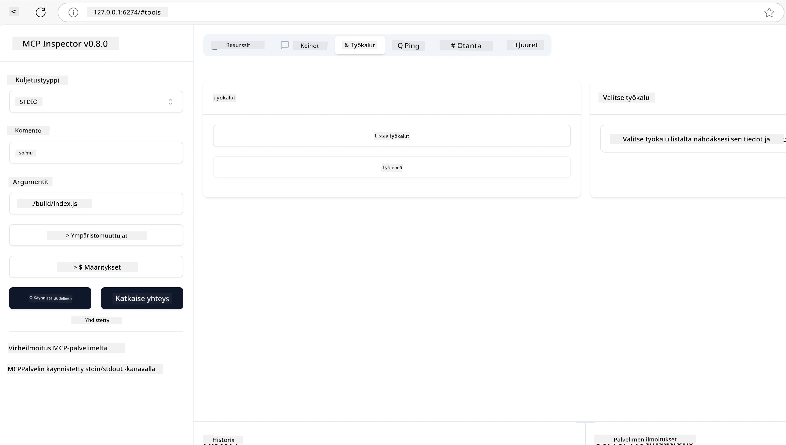
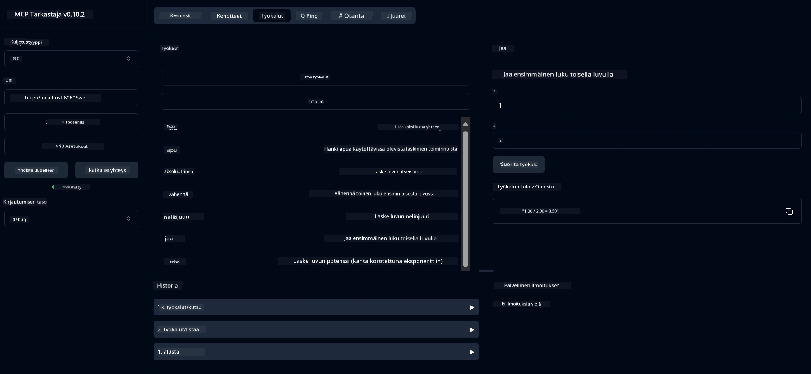
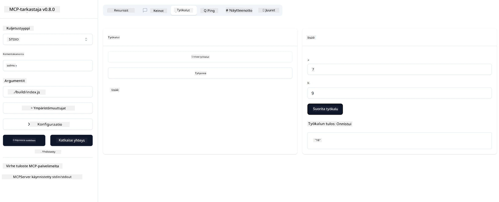

# Aloittaminen MCP:n kanssa

Tervetuloa ensimmäisille askelillesi Model Context Protocolin (MCP) parissa! Olitpa sitten uusi MCP:n käyttäjä tai haluat syventää ymmärrystäsi, tämä opas ohjaa sinut olennaisen asennuksen ja kehitysprosessin läpi. Opit, miten MCP mahdollistaa saumattoman integraation tekoälymallien ja sovellusten välillä, ja miten saat nopeasti ympäristösi valmiiksi MCP-pohjaisten ratkaisujen rakentamista ja testaamista varten.

> Yhteenveto; Jos rakennat tekoälysovelluksia, tiedät, että voit lisätä työkaluja ja muita resursseja LLM:ääsi (laajaa kielimallia) varten, jotta LLM olisi tietävämpi. Jos kuitenkin sijoitat nämä työkalut ja resurssit palvelimelle, sovelluksen ja palvelimen ominaisuuksia voi käyttää mikä tahansa asiakas LLM:n kanssa tai ilman.

## Yleiskatsaus

Tämä oppitunti tarjoaa käytännön ohjeita MCP-ympäristöjen pystyttämiseen ja ensimmäisten MCP-sovellusten rakentamiseen. Opit asentamaan tarvittavat työkalut ja kehykset, rakentamaan perus MCP-palvelimia, luomaan isäntäsovelluksia ja testaamaan toteutuksiasi.

Model Context Protocol (MCP) on avoin protokolla, joka standardisoi, miten sovellukset tarjoavat kontekstia LLM:ille. Ajattele MCP:tä kuin USB-C-porttina tekoälysovelluksille – se tarjoaa standardoidun tavan yhdistää tekoälymallit erilaisiin tietolähteisiin ja työkaluihin.

## Oppimistavoitteet

Tämän oppitunnin lopussa osaat:

- Pystyttää kehitysympäristöt MCP:lle C#:ssa, Javassa, Pythonissa, TypeScriptissä ja Rustissa
- Rakentaa ja ottaa käyttöön perus MCP-palvelimia mukautetuilla ominaisuuksilla (resurssit, kehotteet ja työkalut)
- Luoda isäntäsovelluksia, jotka yhdistävät MCP-palvelimiin
- Testata ja virheenkorjata MCP-toteutuksia

## MCP-ympäristön pystyttäminen

Ennen kuin aloitat MCP:n kanssa työskentelyn, on tärkeää valmistella kehitysympäristösi ja ymmärtää perus työnkulku. Tämä osio ohjaa sinut alkuasetusten läpi, jotta MCP:n kanssa aloittaminen sujuu mutkattomasti.

### Esivaatimukset

Ennen kuin sukellat MCP-kehitykseen, varmista että sinulla on:

- **Kehitysympäristö**: Valitsemallesi kielelle (C#, Java, Python, TypeScript tai Rust)
- **IDE/Editori**: Visual Studio, Visual Studio Code, IntelliJ, Eclipse, PyCharm tai mikä tahansa nykyaikainen koodieditori
- **Paketinhallintaohjelmat**: NuGet, Maven/Gradle, pip, npm/yarn tai Cargo
- **API-avaimet**: Kaikille tekoälypalveluille, joita aiot käyttää isäntäsovelluksissasi

## Perusrakenne MCP-palvelimelle

MCP-palvelin sisältää tyypillisesti:

- **Palvelimen konfigurointi**: Portin, autentikoinnin ja muiden asetusten määrittely
- **Resurssit**: Data ja konteksti, jotka ovat LLM:ien käytettävissä
- **Työkalut**: Toiminnallisuudet, joita mallit voivat kutsua
- **Kehotteet**: Mallipohjat tekstin luomiseen tai jäsentämiseen

Tässä on yksinkertaistettu esimerkki TypeScriptillä:

```typescript
import { McpServer, ResourceTemplate } from "@modelcontextprotocol/sdk/server/mcp.js";
import { StdioServerTransport } from "@modelcontextprotocol/sdk/server/stdio.js";
import { z } from "zod";

// Luo MCP-palvelin
const server = new McpServer({
  name: "Demo",
  version: "1.0.0"
});

// Lisää lisäystyökalu
server.tool("add",
  { a: z.number(), b: z.number() },
  async ({ a, b }) => ({
    content: [{ type: "text", text: String(a + b) }]
  })
);

// Lisää dynaaminen tervehdysresurssi
server.resource(
  "file",
  // 'list'-parametri ohjaa, miten resurssi listaa saatavilla olevat tiedostot. Asettamalla se määrittelemättömäksi estetään listaus tälle resurssille.
  new ResourceTemplate("file://{path}", { list: undefined }),
  async (uri, { path }) => ({
    contents: [{
      uri: uri.href,
      text: `File, ${path}!`
    }]
  })
);

// Lisää tiedostoresurssi, joka lukee tiedoston sisällön
server.resource(
  "file",
  new ResourceTemplate("file://{path}", { list: undefined }),
  async (uri, { path }) => {
    let text;
    try {
      text = await fs.readFile(path, "utf8");
    } catch (err) {
      text = `Error reading file: ${err.message}`;
    }
    return {
      contents: [{
        uri: uri.href,
        text
      }]
    };
  }
);

server.prompt(
  "review-code",
  { code: z.string() },
  ({ code }) => ({
    messages: [{
      role: "user",
      content: {
        type: "text",
        text: `Please review this code:\n\n${code}`
      }
    }]
  })
);

// Aloita viestien vastaanotto stdin:stä ja viestien lähetys stdout:iin
const transport = new StdioServerTransport();
await server.connect(transport);
```

Edellisessä koodissa me:

- Tuomme tarvittavat luokat MCP TypeScript SDK:sta.
- Luomme ja konfiguroimme uuden MCP-palvelininstanssin.
- Rekisteröimme mukautetun työkalun (`calculator`) käsittelijäfunktion kanssa.
- Käynnistämme palvelimen kuuntelemaan saapuvia MCP-pyyntöjä.

## Testaus ja virheenkorjaus

Ennen kuin aloitat MCP-palvelimesi testaamisen, on tärkeää ymmärtää käytettävissä olevat työkalut ja parhaat käytännöt virheenkorjaukseen. Tehokas testaus varmistaa, että palvelimesi toimii odotetusti ja auttaa sinua nopeasti tunnistamaan ja korjaamaan ongelmat. Seuraava osio kuvaa suositeltuja lähestymistapoja MCP-toteutuksesi validointiin.

MCP tarjoaa työkaluja palvelimien testaamiseen ja virheenkorjaukseen:

- **Inspector-työkalu**, tämä graafinen käyttöliittymä mahdollistaa yhteyden palvelimeesi ja työkalujen, kehotteiden sekä resurssien testaamisen.
- **curl**, voit myös yhdistää palvelimeesi komentorivityökalulla kuten curl tai muilla asiakasohjelmilla, jotka voivat luoda ja suorittaa HTTP-komentoja.

### MCP Inspectorin käyttö

[MCP Inspector](https://github.com/modelcontextprotocol/inspector) on visuaalinen testausväline, joka auttaa sinua:

1. **Palvelimen ominaisuuksien löytämisessä**: Havaitsee automaattisesti saatavilla olevat resurssit, työkalut ja kehotteet
2. **Työkalujen suorittamisen testaamisessa**: Kokeile eri parametreja ja näe vastaukset reaaliajassa
3. **Palvelimen metatietojen tarkastelussa**: Tutki palvelimen tietoja, skeemoja ja asetuksia

```bash
# esimerkki TypeScriptistä, MCP Inspectorin asentaminen ja suorittaminen
npx @modelcontextprotocol/inspector node build/index.js
```

Kun suoritat yllä olevat komennot, MCP Inspector käynnistää paikallisen web-käyttöliittymän selaimessasi. Näet kojelaudan, joka näyttää rekisteröidyt MCP-palvelimesi, niiden saatavilla olevat työkalut, resurssit ja kehotteet. Käyttöliittymä mahdollistaa työkalujen suorittamisen interaktiivisen testauksen, palvelimen metatietojen tarkastelun ja reaaliaikaisten vastausten katselun, mikä helpottaa MCP-palvelintoteutustesi validointia ja virheenkorjausta.

Tässä on kuvakaappaus miltä se voi näyttää:



## Yleisiä asennusongelmia ja ratkaisuja

| Ongelma | Mahdollinen ratkaisu |
|---------|---------------------|
| Yhteys evätty | Tarkista, että palvelin on käynnissä ja portti on oikea |
| Työkalun suoritusvirheet | Tarkista parametrien validointi ja virheenkäsittely |
| Autentikointivirheet | Varmista API-avaimet ja käyttöoikeudet |
| Skeeman validointivirheet | Varmista, että parametrit vastaavat määriteltyä skeemaa |
| Palvelin ei käynnisty | Tarkista porttikonfliktit tai puuttuvat riippuvuudet |
| CORS-virheet | Konfiguroi oikeat CORS-otsikot ristiin alkuperäispyyntöjä varten |
| Autentikointiongelmat | Tarkista tokenin voimassaolo ja käyttöoikeudet |

## Paikallinen kehitys

Paikallista kehitystä ja testausta varten voit ajaa MCP-palvelimia suoraan koneellasi:

1. **Käynnistä palvelinprosessi**: Suorita MCP-palvelinsovelluksesi
2. **Konfiguroi verkkoasetukset**: Varmista, että palvelin on saavutettavissa odotetulla portilla
3. **Yhdistä asiakkaat**: Käytä paikallisia yhteysosoitteita kuten `http://localhost:3000`

```bash
# Esimerkki: TypeScript MCP -palvelimen ajaminen paikallisesti
npm run start
# Palvelin käynnissä osoitteessa http://localhost:3000
```

## Ensimmäisen MCP-palvelimen rakentaminen

Olemme käsitelleet [Peruskäsitteet](/01-CoreConcepts/README.md) aiemmassa oppitunnissa, nyt on aika laittaa tuo tieto käytäntöön.

### Mitä palvelin voi tehdä

Ennen kuin alamme kirjoittaa koodia, muistutetaanpa mitä palvelin voi tehdä:

MCP-palvelin voi esimerkiksi:

- Käyttää paikallisia tiedostoja ja tietokantoja
- Yhdistää etä-API:hin
- Suorittaa laskutoimituksia
- Integroituu muihin työkaluihin ja palveluihin
- Tarjota käyttöliittymän vuorovaikutukseen

Hienoa, nyt kun tiedämme mitä voimme tehdä, aloitetaan koodaaminen.

## Harjoitus: Palvelimen luominen

Palvelimen luomiseksi sinun tulee noudattaa seuraavia vaiheita:

- Asenna MCP SDK.
- Luo projekti ja määritä projektin rakenne.
- Kirjoita palvelinkoodi.
- Testaa palvelin.

### -1- Luo projekti

#### TypeScript

```sh
# Luo projektihakemisto ja alusta npm-projekti
mkdir calculator-server
cd calculator-server
npm init -y
```

#### Python

```sh
# Luo projektihakemisto
mkdir calculator-server
cd calculator-server
# Avaa kansio Visual Studio Codessa - Ohita tämä, jos käytät eri IDE:tä
code .
```

#### .NET

```sh
dotnet new console -n McpCalculatorServer
cd McpCalculatorServer
```

#### Java

Javalle luo Spring Boot -projekti:

```bash
curl https://start.spring.io/starter.zip \
  -d dependencies=web \
  -d javaVersion=21 \
  -d type=maven-project \
  -d groupId=com.example \
  -d artifactId=calculator-server \
  -d name=McpServer \
  -d packageName=com.microsoft.mcp.sample.server \
  -o calculator-server.zip
```

Pura zip-tiedosto:

```bash
unzip calculator-server.zip -d calculator-server
cd calculator-server
# valinnainen poista käyttämätön testi
rm -rf src/test/java
```

Lisää seuraava täydellinen konfiguraatio *pom.xml*-tiedostoosi:

```xml
<?xml version="1.0" encoding="UTF-8"?>
<project xmlns="http://maven.apache.org/POM/4.0.0"
    xmlns:xsi="http://www.w3.org/2001/XMLSchema-instance"
    xsi:schemaLocation="http://maven.apache.org/POM/4.0.0 http://maven.apache.org/xsd/maven-4.0.0.xsd">
    <modelVersion>4.0.0</modelVersion>
    
    <!-- Spring Boot parent for dependency management -->
    <parent>
        <groupId>org.springframework.boot</groupId>
        <artifactId>spring-boot-starter-parent</artifactId>
        <version>3.5.0</version>
        <relativePath />
    </parent>

    <!-- Project coordinates -->
    <groupId>com.example</groupId>
    <artifactId>calculator-server</artifactId>
    <version>0.0.1-SNAPSHOT</version>
    <name>Calculator Server</name>
    <description>Basic calculator MCP service for beginners</description>

    <!-- Properties -->
    <properties>
        <java.version>21</java.version>
        <maven.compiler.source>21</maven.compiler.source>
        <maven.compiler.target>21</maven.compiler.target>
    </properties>

    <!-- Spring AI BOM for version management -->
    <dependencyManagement>
        <dependencies>
            <dependency>
                <groupId>org.springframework.ai</groupId>
                <artifactId>spring-ai-bom</artifactId>
                <version>1.0.0-SNAPSHOT</version>
                <type>pom</type>
                <scope>import</scope>
            </dependency>
        </dependencies>
    </dependencyManagement>

    <!-- Dependencies -->
    <dependencies>
        <dependency>
            <groupId>org.springframework.ai</groupId>
            <artifactId>spring-ai-starter-mcp-server-webflux</artifactId>
        </dependency>
        <dependency>
            <groupId>org.springframework.boot</groupId>
            <artifactId>spring-boot-starter-actuator</artifactId>
        </dependency>
        <dependency>
         <groupId>org.springframework.boot</groupId>
         <artifactId>spring-boot-starter-test</artifactId>
         <scope>test</scope>
      </dependency>
    </dependencies>

    <!-- Build configuration -->
    <build>
        <plugins>
            <plugin>
                <groupId>org.springframework.boot</groupId>
                <artifactId>spring-boot-maven-plugin</artifactId>
            </plugin>
            <plugin>
                <groupId>org.apache.maven.plugins</groupId>
                <artifactId>maven-compiler-plugin</artifactId>
                <configuration>
                    <release>21</release>
                </configuration>
            </plugin>
        </plugins>
    </build>

    <!-- Repositories for Spring AI snapshots -->
    <repositories>
        <repository>
            <id>spring-milestones</id>
            <name>Spring Milestones</name>
            <url>https://repo.spring.io/milestone</url>
            <snapshots>
                <enabled>false</enabled>
            </snapshots>
        </repository>
        <repository>
            <id>spring-snapshots</id>
            <name>Spring Snapshots</name>
            <url>https://repo.spring.io/snapshot</url>
            <releases>
                <enabled>false</enabled>
            </releases>
        </repository>
    </repositories>
</project>
```

#### Rust

```sh
mkdir calculator-server
cd calculator-server
cargo init
```

### -2- Lisää riippuvuudet

Nyt kun projekti on luotu, lisätään seuraavaksi riippuvuudet:

#### TypeScript

```sh
# Jos ei ole jo asennettu, asenna TypeScript globaalisti
npm install typescript -g

# Asenna MCP SDK ja Zod skeeman validointia varten
npm install @modelcontextprotocol/sdk zod
npm install -D @types/node typescript
```

#### Python

```sh
# Luo virtuaaliympäristö ja asenna riippuvuudet
python -m venv venv
venv\Scripts\activate
pip install "mcp[cli]"
```

#### Java

```bash
cd calculator-server
./mvnw clean install -DskipTests
```

#### Rust

```sh
cargo add rmcp --features server,transport-io
cargo add serde
cargo add tokio --features rt-multi-thread
```

### -3- Luo projektitiedostot

#### TypeScript

Avaa *package.json* -tiedosto ja korvaa sisältö seuraavalla varmistaaksesi, että voit kääntää ja ajaa palvelimen:

```json
{
  "name": "calculator-server",
  "version": "1.0.0",
  "main": "index.js",
  "type": "module",
  "scripts": {
    "build": "tsc",
    "start": "npm run build && node ./build/index.js",
  },
  "keywords": [],
  "author": "",
  "license": "ISC",
  "description": "A simple calculator server using Model Context Protocol",
  "dependencies": {
    "@modelcontextprotocol/sdk": "^1.16.0",
    "zod": "^3.25.76"
  },
  "devDependencies": {
    "@types/node": "^24.0.14",
    "typescript": "^5.8.3"
  }
}
```

Luo *tsconfig.json* seuraavalla sisällöllä:

```json
{
  "compilerOptions": {
    "target": "ES2022",
    "module": "Node16",
    "moduleResolution": "Node16",
    "outDir": "./build",
    "rootDir": "./src",
    "strict": true,
    "esModuleInterop": true,
    "skipLibCheck": true,
    "forceConsistentCasingInFileNames": true
  },
  "include": ["src/**/*"],
  "exclude": ["node_modules"]
}
```

Luo hakemisto lähdekoodillesi:

```sh
mkdir src
touch src/index.ts
```

#### Python

Luo tiedosto *server.py*

```sh
touch server.py
```

#### .NET

Asenna tarvittavat NuGet-paketit:

```sh
dotnet add package ModelContextProtocol --prerelease
dotnet add package Microsoft.Extensions.Hosting
```

#### Java

Java Spring Boot -projekteissa projektin rakenne luodaan automaattisesti.

#### Rust

Rustissa *src/main.rs* -tiedosto luodaan oletuksena, kun suoritat `cargo init`. Avaa tiedosto ja poista oletuskoodi.

### -4- Luo palvelinkoodi

#### TypeScript

Luo tiedosto *index.ts* ja lisää seuraava koodi:

```typescript
import { McpServer, ResourceTemplate } from "@modelcontextprotocol/sdk/server/mcp.js";
import { StdioServerTransport } from "@modelcontextprotocol/sdk/server/stdio.js";
import { z } from "zod";
 
// Luo MCP-palvelin
const server = new McpServer({
  name: "Calculator MCP Server",
  version: "1.0.0"
});
```

Nyt sinulla on palvelin, mutta se ei tee vielä paljoa, korjataan se.

#### Python

```python
# server.py
from mcp.server.fastmcp import FastMCP

# Luo MCP-palvelin
mcp = FastMCP("Demo")
```

#### .NET

```csharp
using Microsoft.Extensions.DependencyInjection;
using Microsoft.Extensions.Hosting;
using Microsoft.Extensions.Logging;
using ModelContextProtocol.Server;
using System.ComponentModel;

var builder = Host.CreateApplicationBuilder(args);
builder.Logging.AddConsole(consoleLogOptions =>
{
    // Configure all logs to go to stderr
    consoleLogOptions.LogToStandardErrorThreshold = LogLevel.Trace;
});

builder.Services
    .AddMcpServer()
    .WithStdioServerTransport()
    .WithToolsFromAssembly();
await builder.Build().RunAsync();

// add features
```

#### Java

Javalle luo ydinkomponentit palvelimelle. Muokkaa ensin pääsovellusluokkaa:

*src/main/java/com/microsoft/mcp/sample/server/McpServerApplication.java*:

```java
package com.microsoft.mcp.sample.server;

import org.springframework.ai.tool.ToolCallbackProvider;
import org.springframework.ai.tool.method.MethodToolCallbackProvider;
import org.springframework.boot.SpringApplication;
import org.springframework.boot.autoconfigure.SpringBootApplication;
import org.springframework.context.annotation.Bean;
import com.microsoft.mcp.sample.server.service.CalculatorService;

@SpringBootApplication
public class McpServerApplication {

    public static void main(String[] args) {
        SpringApplication.run(McpServerApplication.class, args);
    }
    
    @Bean
    public ToolCallbackProvider calculatorTools(CalculatorService calculator) {
        return MethodToolCallbackProvider.builder().toolObjects(calculator).build();
    }
}
```

Luo laskinpalvelu *src/main/java/com/microsoft/mcp/sample/server/service/CalculatorService.java*:

```java
package com.microsoft.mcp.sample.server.service;

import org.springframework.ai.tool.annotation.Tool;
import org.springframework.stereotype.Service;

/**
 * Service for basic calculator operations.
 * This service provides simple calculator functionality through MCP.
 */
@Service
public class CalculatorService {

    /**
     * Add two numbers
     * @param a The first number
     * @param b The second number
     * @return The sum of the two numbers
     */
    @Tool(description = "Add two numbers together")
    public String add(double a, double b) {
        double result = a + b;
        return formatResult(a, "+", b, result);
    }

    /**
     * Subtract one number from another
     * @param a The number to subtract from
     * @param b The number to subtract
     * @return The result of the subtraction
     */
    @Tool(description = "Subtract the second number from the first number")
    public String subtract(double a, double b) {
        double result = a - b;
        return formatResult(a, "-", b, result);
    }

    /**
     * Multiply two numbers
     * @param a The first number
     * @param b The second number
     * @return The product of the two numbers
     */
    @Tool(description = "Multiply two numbers together")
    public String multiply(double a, double b) {
        double result = a * b;
        return formatResult(a, "*", b, result);
    }

    /**
     * Divide one number by another
     * @param a The numerator
     * @param b The denominator
     * @return The result of the division
     */
    @Tool(description = "Divide the first number by the second number")
    public String divide(double a, double b) {
        if (b == 0) {
            return "Error: Cannot divide by zero";
        }
        double result = a / b;
        return formatResult(a, "/", b, result);
    }

    /**
     * Calculate the power of a number
     * @param base The base number
     * @param exponent The exponent
     * @return The result of raising the base to the exponent
     */
    @Tool(description = "Calculate the power of a number (base raised to an exponent)")
    public String power(double base, double exponent) {
        double result = Math.pow(base, exponent);
        return formatResult(base, "^", exponent, result);
    }

    /**
     * Calculate the square root of a number
     * @param number The number to find the square root of
     * @return The square root of the number
     */
    @Tool(description = "Calculate the square root of a number")
    public String squareRoot(double number) {
        if (number < 0) {
            return "Error: Cannot calculate square root of a negative number";
        }
        double result = Math.sqrt(number);
        return String.format("√%.2f = %.2f", number, result);
    }

    /**
     * Calculate the modulus (remainder) of division
     * @param a The dividend
     * @param b The divisor
     * @return The remainder of the division
     */
    @Tool(description = "Calculate the remainder when one number is divided by another")
    public String modulus(double a, double b) {
        if (b == 0) {
            return "Error: Cannot divide by zero";
        }
        double result = a % b;
        return formatResult(a, "%", b, result);
    }

    /**
     * Calculate the absolute value of a number
     * @param number The number to find the absolute value of
     * @return The absolute value of the number
     */
    @Tool(description = "Calculate the absolute value of a number")
    public String absolute(double number) {
        double result = Math.abs(number);
        return String.format("|%.2f| = %.2f", number, result);
    }

    /**
     * Get help about available calculator operations
     * @return Information about available operations
     */
    @Tool(description = "Get help about available calculator operations")
    public String help() {
        return "Basic Calculator MCP Service\n\n" +
               "Available operations:\n" +
               "1. add(a, b) - Adds two numbers\n" +
               "2. subtract(a, b) - Subtracts the second number from the first\n" +
               "3. multiply(a, b) - Multiplies two numbers\n" +
               "4. divide(a, b) - Divides the first number by the second\n" +
               "5. power(base, exponent) - Raises a number to a power\n" +
               "6. squareRoot(number) - Calculates the square root\n" + 
               "7. modulus(a, b) - Calculates the remainder of division\n" +
               "8. absolute(number) - Calculates the absolute value\n\n" +
               "Example usage: add(5, 3) will return 5 + 3 = 8";
    }

    /**
     * Format the result of a calculation
     */
    private String formatResult(double a, String operator, double b, double result) {
        return String.format("%.2f %s %.2f = %.2f", a, operator, b, result);
    }
}
```

**Valinnaiset komponentit tuotantovalmiille palvelulle:**

Luo käynnistyskonfiguraatio *src/main/java/com/microsoft/mcp/sample/server/config/StartupConfig.java*:

```java
package com.microsoft.mcp.sample.server.config;

import org.springframework.boot.CommandLineRunner;
import org.springframework.context.annotation.Bean;
import org.springframework.context.annotation.Configuration;

@Configuration
public class StartupConfig {
    
    @Bean
    public CommandLineRunner startupInfo() {
        return args -> {
            System.out.println("\n" + "=".repeat(60));
            System.out.println("Calculator MCP Server is starting...");
            System.out.println("SSE endpoint: http://localhost:8080/sse");
            System.out.println("Health check: http://localhost:8080/actuator/health");
            System.out.println("=".repeat(60) + "\n");
        };
    }
}
```

Luo terveystarkastelija *src/main/java/com/microsoft/mcp/sample/server/controller/HealthController.java*:

```java
package com.microsoft.mcp.sample.server.controller;

import org.springframework.http.ResponseEntity;
import org.springframework.web.bind.annotation.GetMapping;
import org.springframework.web.bind.annotation.RestController;
import java.time.LocalDateTime;
import java.util.HashMap;
import java.util.Map;

@RestController
public class HealthController {
    
    @GetMapping("/health")
    public ResponseEntity<Map<String, Object>> healthCheck() {
        Map<String, Object> response = new HashMap<>();
        response.put("status", "UP");
        response.put("timestamp", LocalDateTime.now().toString());
        response.put("service", "Calculator MCP Server");
        return ResponseEntity.ok(response);
    }
}
```

Luo poikkeuskäsittelijä *src/main/java/com/microsoft/mcp/sample/server/exception/GlobalExceptionHandler.java*:

```java
package com.microsoft.mcp.sample.server.exception;

import org.springframework.http.HttpStatus;
import org.springframework.http.ResponseEntity;
import org.springframework.web.bind.annotation.ExceptionHandler;
import org.springframework.web.bind.annotation.RestControllerAdvice;

@RestControllerAdvice
public class GlobalExceptionHandler {

    @ExceptionHandler(IllegalArgumentException.class)
    public ResponseEntity<ErrorResponse> handleIllegalArgumentException(IllegalArgumentException ex) {
        ErrorResponse error = new ErrorResponse(
            "Invalid_Input", 
            "Invalid input parameter: " + ex.getMessage());
        return new ResponseEntity<>(error, HttpStatus.BAD_REQUEST);
    }

    public static class ErrorResponse {
        private String code;
        private String message;

        public ErrorResponse(String code, String message) {
            this.code = code;
            this.message = message;
        }

        // Getters (hakijat)
        public String getCode() { return code; }
        public String getMessage() { return message; }
    }
}
```

Luo mukautettu banneri *src/main/resources/banner.txt*:

```text
_____      _            _       _             
 / ____|    | |          | |     | |            
| |     __ _| | ___ _   _| | __ _| |_ ___  _ __ 
| |    / _` | |/ __| | | | |/ _` | __/ _ \| '__|
| |___| (_| | | (__| |_| | | (_| | || (_) | |   
 \_____\__,_|_|\___|\__,_|_|\__,_|\__\___/|_|   
                                                
Calculator MCP Server v1.0
Spring Boot MCP Application
```

</details>

#### Rust

Lisää seuraava koodi *src/main.rs* -tiedoston alkuun. Tämä tuo tarvittavat kirjastot ja moduulit MCP-palvelimellesi.

```rust
use rmcp::{
    handler::server::{router::tool::ToolRouter, tool::Parameters},
    model::{ServerCapabilities, ServerInfo},
    schemars, tool, tool_handler, tool_router,
    transport::stdio,
    ServerHandler, ServiceExt,
};
use std::error::Error;
```

Laskinpalvelin on yksinkertainen, joka voi laskea kahden luvun summan. Luodaan struct laskinpyynnön esittämiseen.

```rust
#[derive(Debug, serde::Deserialize, schemars::JsonSchema)]
pub struct CalculatorRequest {
    pub a: f64,
    pub b: f64,
}
```

Seuraavaksi luodaan struct laskinpalvelimen esittämiseen. Tämä struct pitää sisällään työkalureitittimen, jota käytetään työkalujen rekisteröintiin.

```rust
#[derive(Debug, Clone)]
pub struct Calculator {
    tool_router: ToolRouter<Self>,
}
```

Nyt voimme toteuttaa `Calculator`-structin luodaksemme uuden palvelininstanssin ja toteuttaa palvelimen käsittelijän palvelintietojen tarjoamiseksi.

```rust
#[tool_router]
impl Calculator {
    pub fn new() -> Self {
        Self {
            tool_router: Self::tool_router(),
        }
    }
}

#[tool_handler]
impl ServerHandler for Calculator {
    fn get_info(&self) -> ServerInfo {
        ServerInfo {
            instructions: Some("A simple calculator tool".into()),
            capabilities: ServerCapabilities::builder().enable_tools().build(),
            ..Default::default()
        }
    }
}
```

Lopuksi meidän täytyy toteuttaa pääfunktio palvelimen käynnistämiseksi. Tämä funktio luo `Calculator`-structin instanssin ja palvelee sitä standardin syötön/ulostulon kautta.

```rust
#[tokio::main]
async fn main() -> Result<(), Box<dyn Error>> {
    let service = Calculator::new().serve(stdio()).await?;
    service.waiting().await?;
    Ok(())
}
```

Palvelin on nyt asetettu tarjoamaan perustietoja itsestään. Seuraavaksi lisäämme työkalun yhteenlaskua varten.

### -5- Työkalun ja resurssin lisääminen

Lisää työkalu ja resurssi lisäämällä seuraava koodi:

#### TypeScript

```typescript
server.tool(
  "add",
  { a: z.number(), b: z.number() },
  async ({ a, b }) => ({
    content: [{ type: "text", text: String(a + b) }]
  })
);

server.resource(
  "greeting",
  new ResourceTemplate("greeting://{name}", { list: undefined }),
  async (uri, { name }) => ({
    contents: [{
      uri: uri.href,
      text: `Hello, ${name}!`
    }]
  })
);
```

Työkalusi ottaa parametrit `a` ja `b` ja suorittaa funktion, joka tuottaa vastauksen muodossa:

```typescript
{
  contents: [{
    type: "text", content: "some content"
  }]
}
```

Resurssiisi pääsee käsiksi merkkijonon "greeting" kautta, se ottaa parametrin `name` ja tuottaa vastaavan vastauksen kuin työkalu:

```typescript
{
  uri: "<href>",
  text: "a text"
}
```

#### Python

```python
# Lisää lisäystyökalu
@mcp.tool()
def add(a: int, b: int) -> int:
    """Add two numbers"""
    return a + b


# Lisää dynaaminen tervehdysresurssi
@mcp.resource("greeting://{name}")
def get_greeting(name: str) -> str:
    """Get a personalized greeting"""
    return f"Hello, {name}!"
```

Edellisessä koodissa me:

- Määrittelimme työkalun `add`, joka ottaa parametrit `a` ja `b`, molemmat kokonaislukuja.
- Loimme resurssin nimeltä `greeting`, joka ottaa parametrin `name`.

#### .NET

Lisää tämä Program.cs -tiedostoosi:

```csharp
[McpServerToolType]
public static class CalculatorTool
{
    [McpServerTool, Description("Adds two numbers")]
    public static string Add(int a, int b) => $"Sum {a + b}";
}
```

#### Java

Työkalut on jo luotu edellisessä vaiheessa.

#### Rust

Lisää uusi työkalu `impl Calculator` -lohkon sisälle:

```rust
#[tool(description = "Adds a and b")]
async fn add(
    &self,
    Parameters(CalculatorRequest { a, b }): Parameters<CalculatorRequest>,
) -> String {
    (a + b).to_string()
}
```

### -6- Lopullinen koodi

Lisätään viimeinen koodi, jota tarvitsemme, jotta palvelin voi käynnistyä:

#### TypeScript

```typescript
// Aloita viestien vastaanottaminen stdin:stä ja viestien lähettäminen stdout:iin
const transport = new StdioServerTransport();
await server.connect(transport);
```

Tässä on koko koodi:

```typescript
// index.ts
import { McpServer, ResourceTemplate } from "@modelcontextprotocol/sdk/server/mcp.js";
import { StdioServerTransport } from "@modelcontextprotocol/sdk/server/stdio.js";
import { z } from "zod";

// Luo MCP-palvelimen
const server = new McpServer({
  name: "Calculator MCP Server",
  version: "1.0.0"
});

// Lisää yhteenlaskutyökalu
server.tool(
  "add",
  { a: z.number(), b: z.number() },
  async ({ a, b }) => ({
    content: [{ type: "text", text: String(a + b) }]
  })
);

// Lisää dynaaminen tervehdysresurssi
server.resource(
  "greeting",
  new ResourceTemplate("greeting://{name}", { list: undefined }),
  async (uri, { name }) => ({
    contents: [{
      uri: uri.href,
      text: `Hello, ${name}!`
    }]
  })
);

// Aloita viestien vastaanotto stdin:stä ja viestien lähetys stdout:iin
const transport = new StdioServerTransport();
server.connect(transport);
```

#### Python

```python
# server.py
from mcp.server.fastmcp import FastMCP

# Luo MCP-palvelin
mcp = FastMCP("Demo")


# Lisää yhteenlaskutyökalu
@mcp.tool()
def add(a: int, b: int) -> int:
    """Add two numbers"""
    return a + b


# Lisää dynaaminen tervehdysresurssi
@mcp.resource("greeting://{name}")
def get_greeting(name: str) -> str:
    """Get a personalized greeting"""
    return f"Hello, {name}!"

# Pääsuorituslohko - tämä tarvitaan palvelimen ajamiseksi
if __name__ == "__main__":
    mcp.run()
```

#### .NET

Luo Program.cs -tiedosto seuraavalla sisällöllä:

```csharp
using Microsoft.Extensions.DependencyInjection;
using Microsoft.Extensions.Hosting;
using Microsoft.Extensions.Logging;
using ModelContextProtocol.Server;
using System.ComponentModel;

var builder = Host.CreateApplicationBuilder(args);
builder.Logging.AddConsole(consoleLogOptions =>
{
    // Configure all logs to go to stderr
    consoleLogOptions.LogToStandardErrorThreshold = LogLevel.Trace;
});

builder.Services
    .AddMcpServer()
    .WithStdioServerTransport()
    .WithToolsFromAssembly();
await builder.Build().RunAsync();

[McpServerToolType]
public static class CalculatorTool
{
    [McpServerTool, Description("Adds two numbers")]
    public static string Add(int a, int b) => $"Sum {a + b}";
}
```

#### Java

Täydellisen pääsovellusluokkasi tulisi näyttää tältä:

```java
// McpServerApplication.java
package com.microsoft.mcp.sample.server;

import org.springframework.ai.tool.ToolCallbackProvider;
import org.springframework.ai.tool.method.MethodToolCallbackProvider;
import org.springframework.boot.SpringApplication;
import org.springframework.boot.autoconfigure.SpringBootApplication;
import org.springframework.context.annotation.Bean;
import com.microsoft.mcp.sample.server.service.CalculatorService;

@SpringBootApplication
public class McpServerApplication {

    public static void main(String[] args) {
        SpringApplication.run(McpServerApplication.class, args);
    }
    
    @Bean
    public ToolCallbackProvider calculatorTools(CalculatorService calculator) {
        return MethodToolCallbackProvider.builder().toolObjects(calculator).build();
    }
}
```

#### Rust

Rust-palvelimen lopullinen koodi näyttää tältä:

```rust
use rmcp::{
    ServerHandler, ServiceExt,
    handler::server::{router::tool::ToolRouter, tool::Parameters},
    model::{ServerCapabilities, ServerInfo},
    schemars, tool, tool_handler, tool_router,
    transport::stdio,
};
use std::error::Error;

#[derive(Debug, serde::Deserialize, schemars::JsonSchema)]
pub struct CalculatorRequest {
    pub a: f64,
    pub b: f64,
}

#[derive(Debug, Clone)]
pub struct Calculator {
    tool_router: ToolRouter<Self>,
}

#[tool_router]
impl Calculator {
    pub fn new() -> Self {
        Self {
            tool_router: Self::tool_router(),
        }
    }
    
    #[tool(description = "Adds a and b")]
    async fn add(
        &self,
        Parameters(CalculatorRequest { a, b }): Parameters<CalculatorRequest>,
    ) -> String {
        (a + b).to_string()
    }
}

#[tool_handler]
impl ServerHandler for Calculator {
    fn get_info(&self) -> ServerInfo {
        ServerInfo {
            instructions: Some("A simple calculator tool".into()),
            capabilities: ServerCapabilities::builder().enable_tools().build(),
            ..Default::default()
        }
    }
}

#[tokio::main]
async fn main() -> Result<(), Box<dyn Error>> {
    let service = Calculator::new().serve(stdio()).await?;
    service.waiting().await?;
    Ok(())
}
```

### -7- Testaa palvelin

Käynnistä palvelin seuraavalla komennolla:

#### TypeScript

```sh
npm run build
```

#### Python

```sh
mcp run server.py
```

> MCP Inspectorin käyttämiseksi käytä komentoa `mcp dev server.py`, joka käynnistää Inspectorin automaattisesti ja tarjoaa tarvittavan välitystunnuksen. Jos käytät `mcp run server.py`, sinun täytyy käynnistää Inspector manuaalisesti ja konfiguroida yhteys.

#### .NET

Varmista, että olet projektihakemistossasi:

```sh
cd McpCalculatorServer
dotnet run
```

#### Java

```bash
./mvnw clean install -DskipTests
java -jar target/calculator-server-0.0.1-SNAPSHOT.jar
```

#### Rust

Suorita seuraavat komennot muotoillaksesi ja ajaaksesi palvelimen:

```sh
cargo fmt
cargo run
```

### -8- Aja Inspectorin avulla

Inspector on loistava työkalu, joka voi käynnistää palvelimesi ja antaa sinun olla vuorovaikutuksessa sen kanssa, jotta voit testata sen toimivuuden. Käynnistetään se:

> [!NOTE]
> komentokentässä saattaa näkyä erilainen komento, koska se sisältää palvelimen ajamiseen tarkoitetun komennon juuri sinun ajoympäristöllesi.

#### TypeScript

```sh
npx @modelcontextprotocol/inspector node build/index.js
```

tai lisää se *package.json* -tiedostoosi näin: `"inspector": "npx @modelcontextprotocol/inspector node build/index.js"` ja aja sitten `npm run inspector`

#### Python

Python käärii Node.js-työkalun nimeltä inspector. On mahdollista kutsua kyseistä työkalua näin:

```sh
mcp dev server.py
```

Kuitenkin se ei toteuta kaikkia työkalun tarjoamia metodeja, joten suositellaan ajamaan Node.js-työkalu suoraan alla kuvatulla tavalla:

```sh
npx @modelcontextprotocol/inspector mcp run server.py
```

Jos käytät työkalua tai IDE:tä, joka sallii komentojen ja argumenttien konfiguroinnin skriptien ajamiseen,
varmistathan, että `Command`-kenttään on asetettu `python` ja `Arguments`-kenttään `server.py`. Tämä varmistaa, että skripti suoritetaan oikein.

#### .NET

Varmista, että olet projektihakemistossasi:

```sh
cd McpCalculatorServer
npx @modelcontextprotocol/inspector dotnet run
```

#### Java

Varmista, että laskinpalvelimesi on käynnissä
Sitten suorita tarkastustyökalu:

```cmd
npx @modelcontextprotocol/inspector
```

Tarkastustyökalun verkkokäyttöliittymässä:

1. Valitse "SSE" siirtotavaksi
2. Aseta URL-osoitteeksi: `http://localhost:8080/sse`
3. Klikkaa "Connect"



**Olet nyt yhteydessä palvelimeen**
**Java-palvelimen testausosio on nyt suoritettu**

Seuraava osio käsittelee vuorovaikutusta palvelimen kanssa.

Sinun pitäisi nähdä seuraava käyttöliittymä:


1. Yhdistä palvelimeen valitsemalla Connect-painike
  Kun olet yhdistänyt palvelimeen, sinun pitäisi nyt nähdä seuraava:

  

1. Valitse "Tools" ja "listTools", sinun pitäisi nähdä "Add" ilmestyvän, valitse "Add" ja täytä parametrien arvot.

  Sinun pitäisi nähdä seuraava vastaus, eli tulos "add"-työkalusta:

  

Onnittelut, olet onnistunut luomaan ja ajamaan ensimmäisen palvelimesi!

#### Rust

Rust-palvelimen ajamiseksi MCP Inspector CLI:llä käytä seuraavaa komentoa:

```sh
npx @modelcontextprotocol/inspector cargo run --cli --method tools/call --tool-name add --tool-arg a=1 b=2
```

### Viralliset SDK:t

MCP tarjoaa virallisia SDK:ita useille kielille:

- [C# SDK](https://github.com/modelcontextprotocol/csharp-sdk) - Ylläpidetään yhteistyössä Microsoftin kanssa
- [Java SDK](https://github.com/modelcontextprotocol/java-sdk) - Ylläpidetään yhteistyössä Spring AI:n kanssa
- [TypeScript SDK](https://github.com/modelcontextprotocol/typescript-sdk) - Virallinen TypeScript-toteutus
- [Python SDK](https://github.com/modelcontextprotocol/python-sdk) - Virallinen Python-toteutus
- [Kotlin SDK](https://github.com/modelcontextprotocol/kotlin-sdk) - Virallinen Kotlin-toteutus
- [Swift SDK](https://github.com/modelcontextprotocol/swift-sdk) - Ylläpidetään yhteistyössä Loopwork AI:n kanssa
- [Rust SDK](https://github.com/modelcontextprotocol/rust-sdk) - Virallinen Rust-toteutus

## Keskeiset opit

- MCP-kehitysympäristön pystyttäminen on suoraviivaista kielikohtaisten SDK:iden avulla
- MCP-palvelinten rakentaminen sisältää työkalujen luomisen ja rekisteröinnin selkeillä skeemoilla
- Testaus ja virheenkorjaus ovat olennaisia luotettavien MCP-toteutusten varmistamiseksi

## Esimerkit

- [Java Calculator](../samples/java/calculator/README.md)
- [.Net Calculator](../../../../03-GettingStarted/samples/csharp)
- [JavaScript Calculator](../samples/javascript/README.md)
- [TypeScript Calculator](../samples/typescript/README.md)
- [Python Calculator](../../../../03-GettingStarted/samples/python)
- [Rust Calculator](../../../../03-GettingStarted/samples/rust)

## Tehtävä

Luo yksinkertainen MCP-palvelin valitsemallasi työkalulla:

1. Toteuta työkalu haluamallasi kielellä (.NET, Java, Python, TypeScript tai Rust).
2. Määrittele syöteparametrit ja paluuarvot.
3. Suorita tarkastustyökalu varmistaaksesi, että palvelin toimii odotetusti.
4. Testaa toteutusta erilaisilla syötteillä.

## Ratkaisu

[Ratkaisu](./solution/README.md)

## Lisäresurssit

- [Rakenna agentteja Model Context Protocolilla Azurella](https://learn.microsoft.com/azure/developer/ai/intro-agents-mcp)
- [Etä-MCP Azure Container Appsilla (Node.js/TypeScript/JavaScript)](https://learn.microsoft.com/samples/azure-samples/mcp-container-ts/mcp-container-ts/)
- [.NET OpenAI MCP Agent](https://learn.microsoft.com/samples/azure-samples/openai-mcp-agent-dotnet/openai-mcp-agent-dotnet/)

## Mitä seuraavaksi

Seuraava: [Aloita MCP-asiakkaiden kanssa](../02-client/README.md)

---

<!-- CO-OP TRANSLATOR DISCLAIMER START -->
**Vastuuvapauslauseke**:
Tämä asiakirja on käännetty käyttämällä tekoälypohjaista käännöspalvelua [Co-op Translator](https://github.com/Azure/co-op-translator). Vaikka pyrimme tarkkuuteen, otathan huomioon, että automaattikäännöksissä saattaa esiintyä virheitä tai epätarkkuuksia. Alkuperäistä asiakirjaa sen alkuperäiskielellä tulee pitää virallisena lähteenä. Tärkeissä asioissa suositellaan ammattimaista ihmiskäännöstä. Emme ole vastuussa tämän käännöksen käytöstä aiheutuvista väärinymmärryksistä tai tulkinnoista.
<!-- CO-OP TRANSLATOR DISCLAIMER END -->