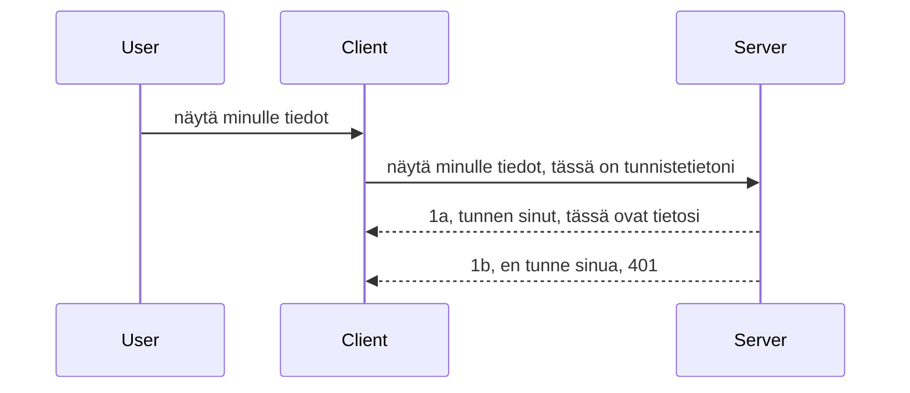

# Yksinkertainen todennus

MCP SDK:t tukevat OAuth 2.1:n käyttöä, joka on rehellisesti sanottuna melko monimutkainen prosessi, johon liittyy käsitteitä kuten todennuspalvelin, resurssipalvelin, tunnistetietojen lähettäminen, koodin hakeminen, koodin vaihtaminen bearer-tokeniksi, kunnes lopulta saat resurssidatasi. Jos et ole tottunut OAuthiin, mikä on hieno toteutettavaksi, on järkevää aloittaa jonkinlaisella perusautentikoinnilla ja kehittää siitä yhä turvallisempaa. Siksi tämä luku on olemassa, jotta sinut rakennetaan kohti kehittyneempää todennusta.

## Todennus, mitä tarkoitamme?

Todennus on lyhenne sanoista authentication ja authorization. Ajatuksena on, että meidän täytyy tehdä kaksi asiaa:

- **Authentication**, eli prosessi, jossa selvitämme, saako henkilö tulla taloomme, onko hänellä oikeus olla "tässä", eli päästä MCP-palvelimemme resurssipalvelimelle, missä MCP:n ominaisuudet sijaitsevat.
- **Authorization**, eli prosessi, jossa selvitämme, onko käyttäjällä pääsy juuri näihin tiettyihin resursseihin, joita hän pyytää, esimerkiksi näihin tilauksiin tai tuotteisiin, tai onko hänen sallittua lukea sisältöä mutta ei poistaa sitä esimerkin vuoksi.

## Tunnistetiedot: miten kerromme järjestelmälle kuka olemme

Useimmat web-kehittäjät ajattelevat järjestelmään kirjautumista tarjoamalla palvelimelle tunnisteen, yleensä salaisuuden, joka kertoo, onko käyttäjällä oikeus olla tässä ("Authentication"). Tämä tunniste on yleensä base64-koodattu versio käyttäjänimestä ja salasanasta tai API-avain, joka yksilöi tietyn käyttäjän.

Tämä lähetetään otsikkona nimeltään "Authorization" kuten alla:

```json
{ "Authorization": "secret123" }
```

Tätä kutsutaan yleensä perusautentikoinniksi. Kokonaisflow toimii näin:


Nyt kun ymmärrämme kuinka se toimii flow:n näkökulmasta, miten toteutamme sen? Useimmissa web-palvelimissa on käsitteellä middleware, joka on koodipätkä, joka suoritetaan osana pyyntöä ja voi tarkistaa tunnistetiedot, ja jos ne ovat valideja, päästää pyynnön läpi. Jos pyynnöllä ei ole kelvollisia tunnisteita, saat autentikointivirheen. Toteutetaanpa tämä:

**Python**

```python
class AuthMiddleware(BaseHTTPMiddleware):
    async def dispatch(self, request, call_next):

        has_header = request.headers.get("Authorization")
        if not has_header:
            print("-> Missing Authorization header!")
            return Response(status_code=401, content="Unauthorized")

        if not valid_token(has_header):
            print("-> Invalid token!")
            return Response(status_code=403, content="Forbidden")

        print("Valid token, proceeding...")
       
        response = await call_next(request)
        # lisää kaikki asiakasotsikot tai muokkaa vastausta jotenkin
        return response


starlette_app.add_middleware(CustomHeaderMiddleware)
```

Tässä olemme:

- Luoneet middleware-luokan nimeltä `AuthMiddleware`, jonka `dispatch`-metodia web-palvelin kutsuu.
- Lisänneet middleware:n web-palvelimelle:

    ```python
    starlette_app.add_middleware(AuthMiddleware)
    ```

- Kirjoittaneet validointilogiikan, joka tarkistaa, onko Authorization-otsikko läsnä ja onko lähetetty salaisuus kelvollinen:

    ```python
    has_header = request.headers.get("Authorization")
    if not has_header:
        print("-> Missing Authorization header!")
        return Response(status_code=401, content="Unauthorized")

    if not valid_token(has_header):
        print("-> Invalid token!")
        return Response(status_code=403, content="Forbidden")
    ```

Jos salaisuus on läsnä ja kelvollinen, annamme pyynnön jatkaa kutsumalla `call_next` ja palautamme vastauksen.

    ```python
    response = await call_next(request)
    # lisää kaikki asiakkaan otsikot tai muuta vastausta jollakin tavalla
    return response
    ```

Toimintaperiaate on se, että jos web-pyyntö tehdään palvelimelle, middleware aktivoituu ja toteutuksensa mukaan joko päästää pyynnön läpi tai palauttaa virheilmoituksen, joka kertoo, että asiakas ei saa jatkaa.

**TypeScript**

Tässä luomme middleware:n suositulla Express-kehyksellä ja sieppaamme pyynnön ennen kuin se saavuttaa MCP-palvelimen. Tässä on koodi:

```typescript
function isValid(secret) {
    return secret === "secret123";
}

app.use((req, res, next) => {
    // 1. Onko Authorization-otsikko läsnä?
    if(!req.headers["Authorization"]) {
        res.status(401).send('Unauthorized');
    }
    
    let token = req.headers["Authorization"];

    // 2. Tarkista pätevyys.
    if(!isValid(token)) {
        res.status(403).send('Forbidden');
    }

   
    console.log('Middleware executed');
    // 3. Siirtää pyynnön seuraavaan vaiheeseen pyyntöputkessa.
    next();
});
```

Tässä koodissa:

1. Tarkistamme ensin, onko Authorization-otsikko läsnä, ellei ole, lähetämme 401-virheen.
2. Varmistamme, että tunniste/token on kelvollinen, ellei ole, lähetämme 403-virheen.
3. Lopuksi pyynnön läpivienti jatkuu ja pyydetty resurssi palautetaan.

## Harjoitus: Toteuta todennus

Otetaan opittu haltuun ja yritetään toteuttaa se. Tässä suunnitelma:

Palvelin

- Luo web-palvelin ja MCP-instanssi.
- Toteuta palvelimelle middleware.

Asiakas

- Lähetä web-pyyntö tunnisteen kanssa otsikossa.

### -1- Luo web-palvelin ja MCP-instanssi

Ensimmäisessä vaiheessa luomme web-palvelininstanssin ja MCP-palvelimen.

**Python**

Tässä luomme MCP-palvelininstanssin, luomme starlette-websovelluksen ja isännöimme sitä uvicornilla.

```python
# luodaan MCP-palvelin

app = FastMCP(
    name="MCP Resource Server",
    instructions="Resource Server that validates tokens via Authorization Server introspection",
    host=settings["host"],
    port=settings["port"],
    debug=True
)

# luodaan starlette web-sovellus
starlette_app = app.streamable_http_app()

# tarjoillaan sovellus uvicornin kautta
async def run(starlette_app):
    import uvicorn
    config = uvicorn.Config(
            starlette_app,
            host=app.settings.host,
            port=app.settings.port,
            log_level=app.settings.log_level.lower(),
        )
    server = uvicorn.Server(config)
    await server.serve()

run(starlette_app)
```

Tässä koodissa:

- Luomme MCP-palvelimen.
- Rakennamme starlette-websovelluksen MCP-palvelimesta, `app.streamable_http_app()`.
- Isännöimme ja palvelamme sovellusta uvicornin avulla `server.serve()`.

**TypeScript**

Tässä luomme MCP-palvelininstanssin.

```typescript
const server = new McpServer({
      name: "example-server",
      version: "1.0.0"
    });

    // ... määritä palvelinresurssit, työkalut ja kehotteet ...
```

Tämä MCP-palvelimen luonti pitää tapahtua POST /mcp -reitissä, joten siirrämme yllä olevan koodin seuraavasti:

```typescript
import express from "express";
import { randomUUID } from "node:crypto";
import { McpServer } from "@modelcontextprotocol/sdk/server/mcp.js";
import { StreamableHTTPServerTransport } from "@modelcontextprotocol/sdk/server/streamableHttp.js";
import { isInitializeRequest } from "@modelcontextprotocol/sdk/types.js"

const app = express();
app.use(express.json());

// Kartta, johon tallennetaan kuljetukset istunnon ID:n mukaan
const transports: { [sessionId: string]: StreamableHTTPServerTransport } = {};

// Käsittele POST-pyynnöt asiakas-palvelin -viestintään
app.post('/mcp', async (req, res) => {
  // Tarkista, onko istunnon ID jo olemassa
  const sessionId = req.headers['mcp-session-id'] as string | undefined;
  let transport: StreamableHTTPServerTransport;

  if (sessionId && transports[sessionId]) {
    // Käytä uudelleen olemassa olevaa kuljetusta
    transport = transports[sessionId];
  } else if (!sessionId && isInitializeRequest(req.body)) {
    // Uusi alustuspyyntö
    transport = new StreamableHTTPServerTransport({
      sessionIdGenerator: () => randomUUID(),
      onsessioninitialized: (sessionId) => {
        // Tallenna kuljetus istunnon ID:n mukaan
        transports[sessionId] = transport;
      },
      // DNS-osoitteen uudelleensitojan suojaus on oletuksena pois päältä taaksepäin yhteensopivuuden vuoksi. Jos ajat tämän palvelimen
      // paikallisesti, varmista että asetat:
      // enableDnsRebindingProtection: true,
      // allowedHosts: ['127.0.0.1'],
    });

    // Siivoa kuljetus, kun se on suljettu
    transport.onclose = () => {
      if (transport.sessionId) {
        delete transports[transport.sessionId];
      }
    };
    const server = new McpServer({
      name: "example-server",
      version: "1.0.0"
    });

    // ... aseta palvelimen resurssit, työkalut ja kehotteet ...

    // Yhdistä MCP-palvelimeen
    await server.connect(transport);
  } else {
    // Virheellinen pyyntö
    res.status(400).json({
      jsonrpc: '2.0',
      error: {
        code: -32000,
        message: 'Bad Request: No valid session ID provided',
      },
      id: null,
    });
    return;
  }

  // Käsittele pyyntö
  await transport.handleRequest(req, res, req.body);
});

// Uudelleenkäytettävä käsittelijä GET- ja DELETE-pyynnöille
const handleSessionRequest = async (req: express.Request, res: express.Response) => {
  const sessionId = req.headers['mcp-session-id'] as string | undefined;
  if (!sessionId || !transports[sessionId]) {
    res.status(400).send('Invalid or missing session ID');
    return;
  }
  
  const transport = transports[sessionId];
  await transport.handleRequest(req, res);
};

// Käsittele GET-pyynnöt palvelimelta asiakkaalle -ilmoituksiin SSE:n kautta
app.get('/mcp', handleSessionRequest);

// Käsittele DELETE-pyynnöt istunnon lopettamiseksi
app.delete('/mcp', handleSessionRequest);

app.listen(3000);
```

Nyt näet kuinka MCP-palvelimen luonti on siirretty `app.post("/mcp")` sisälle.

Siirrytään seuraavaan vaiheeseen, eli middleware:n luontiin, jotta voimme validoida saapuvat tunnisteet.

### -2- Toteuta middleware palvelimelle

Seuraavaksi middleware-osuus. Tässä luomme middleware:n, joka etsii tunnisteen `Authorization`-otsikosta ja validoi sen. Jos hyväksyttävä, pyyntö jatkuu tekemään tarvitsemansa (esim. listaa työkaluja, lue resurssi tai mikä MCP-toiminto asiakkaalla oli).

**Python**

Middleware:n luomiseksi tarvitsemme luokan, joka perii `BaseHTTPMiddleware`-luokan. Kaksi mielenkiintoista asiaa:

- Pyyntö `request`, josta luemme otsikkotiedot.
- `call_next`, callback, jota kutsumme, jos asiakas toi hyväksyttävän tunnisteen.

Aloitetaan käsittelemällä tilanne, jossa `Authorization`-otsikko puuttuu:

```python
has_header = request.headers.get("Authorization")

# otsikkoa ei ole, epäonnistuu koodilla 401, muuten jatka.
if not has_header:
    print("-> Missing Authorization header!")
    return Response(status_code=401, content="Unauthorized")
```

Tässä lähetämme 401 unauthorized -viestin, koska autentikointi epäonnistuu.

Seuraavaksi, jos tunniste on lähetetty, tarkistamme sen kelpoisuuden näin:

```python
 if not valid_token(has_header):
    print("-> Invalid token!")
    return Response(status_code=403, content="Forbidden")
```

Huomaa, että lähetämme 403 forbidden -viestin. Tässä koko middleware, joka toteuttaa kaiken edellä mainitun:

```python
class AuthMiddleware(BaseHTTPMiddleware):
    async def dispatch(self, request, call_next):

        has_header = request.headers.get("Authorization")
        if not has_header:
            print("-> Missing Authorization header!")
            return Response(status_code=401, content="Unauthorized")

        if not valid_token(has_header):
            print("-> Invalid token!")
            return Response(status_code=403, content="Forbidden")

        print("Valid token, proceeding...")
        print(f"-> Received {request.method} {request.url}")
        response = await call_next(request)
        response.headers['Custom'] = 'Example'
        return response

```

Hienoa, mutta entä `valid_token`-funktio? Tässä se on alla:

```python
# ÄLÄ käytä tuotannossa - paranna sitä !!
def valid_token(token: str) -> bool:
    # poista "Bearer " etuliite
    if token.startswith("Bearer "):
        token = token[7:]
        return token == "secret-token"
    return False
```

Tätä pitäisi toki parantaa.

TÄRKEÄÄ: Sinun EI IKINÄ tulisi säilyttää salaisuuksia tässä muodossa koodissa. Arvo kannattaa hakea esim. tietovarastosta tai IDP:stä (identity service provider) tai mieluiten antaa IDP:n hoitaa validointi.

**TypeScript**

Expressissä käytämme `use`-metodia, joka ottaa middleware-funktiot.

Tarvitsemme:

- Tarkistaa `Authorization`-otsikko pyynnöltä.
- Validioida tunniste, ja jos hyväksytty, päästää pyynnön jatkamaan ja asiakas saa tehdä MCP-pyynnönsä (esim. listaus, resurssin luku jne).

Tässä tarkistamme, onko `Authorization`-otsikko lähetetty, ja mikäli ei, keskeytämme pyynnön:

```typescript
if(!req.headers["authorization"]) {
    res.status(401).send('Unauthorized');
    return;
}
```

Jos otsikko puuttuu, saat 401-virheen.

Seuraavaksi tarkistamme tunnisteen kelpoisuuden, ja jos se ei ole kelvollinen, keskeytämme pyynnön hieman erilaisella viestillä:

```typescript
if(!isValid(token)) {
    res.status(403).send('Forbidden');
    return;
} 
```

Nyt saat 403-virheen.

Tässä koko koodi:

```typescript
app.use((req, res, next) => {
    console.log('Request received:', req.method, req.url, req.headers);
    console.log('Headers:', req.headers["authorization"]);
    if(!req.headers["authorization"]) {
        res.status(401).send('Unauthorized');
        return;
    }
    
    let token = req.headers["authorization"];

    if(!isValid(token)) {
        res.status(403).send('Forbidden');
        return;
    }  

    console.log('Middleware executed');
    next();
});
```

Olemme asettaneet web-palvelimen ottamaan vastaan middleware:n, joka tarkistaa asiakkaan lähettämän tunnisteen. Entä itse asiakas?

### -3- Lähetä web-pyyntö tunnisteella otsikossa

Meidän tulee varmistaa, että asiakas välittää tunnisteen otsikon kautta. Koska aiomme käyttää MCP-asiakasta, selvitämme miten se tehdään.

**Python**

Asiakkaalle täytyy lisätä otsikko tunnisteen kanssa näin:

```python
# ÄLÄ kovakoodaa arvoa, pidä se vähintään ympäristömuuttujassa tai turvallisemmassa tallennustilassa
token = "secret-token"

async with streamablehttp_client(
        url = f"http://localhost:{port}/mcp",
        headers = {"Authorization": f"Bearer {token}"}
    ) as (
        read_stream,
        write_stream,
        session_callback,
    ):
        async with ClientSession(
            read_stream,
            write_stream
        ) as session:
            await session.initialize()
      
            # TEE, mitä haluat tehtävän asiakkaassa, esim. luettele työkalut, kutsu työkaluja jne.
```

Huomaa, miten täytämme `headers`-ominaisuuden: ` headers = {"Authorization": f"Bearer {token}"}`.

**TypeScript**

Ratkaistaan tämä kahdessa vaiheessa:

1. Täytetään konfigurointikohde tunnisteellamme.
2. Annetaan konfigurointikohde transportille.

```typescript

// ÄLÄ kovakoodaa arvoa kuten tässä on näytetty. Vähintäänkin pidä se ympäristömuuttujana ja käytä jotain kuten dotenv (kehitystilassa).
let token = "secret123"

// määrittele asiakkaan siirtovaihtoehto-olio
let options: StreamableHTTPClientTransportOptions = {
  sessionId: sessionId,
  requestInit: {
    headers: {
      "Authorization": "secret123"
    }
  }
};

// lähetä vaihtoehto-olio siirtoprosessille
async function main() {
   const transport = new StreamableHTTPClientTransport(
      new URL(serverUrl),
      options
   );
```

Yllä näet, miten loimme `options`-objektin ja laitamme otsikot `requestInit`-ominaisuuteen.

TÄRKEÄÄ: Miten tätä voisi parantaa? Nykyisessä toteutuksessa on ongelmia. Ensinnäkin tunnisteen lähettäminen tällä tavalla on melko riskialtista ellei käytössä ole vähintään HTTPS:ää. Vaikka olisi, tunniste voidaan varastaa, joten tarvitset järjestelmän, jossa voit helposti peruuttaa tokenin ja lisätä tarkistuksia, kuten mistä päin maailmaa pyyntö tulee, tapahtuuko pyyntö liian usein (bottimaista toimintaa), lyhyesti, huolia on paljon.

On kuitenkin todettava, että hyvin yksinkertaisille API:lle, joissa et halua kenenkään soittavan API:llesi ilman autentikointia, tämä on hyvä alku.

Sitten, parannetaan turvallisuutta käyttämällä standardoitua formaattia, kuten JSON Web Tokeneita, eli JWT:tä tai "JOT"-tokeneita.

## JSON Web Tokenit, JWT

Yritämme siis parantaa tilannetta perusautentikoinnin sijaan. Mitä parannuksia JWT:n käyttö tuo välittömästi?

- **Turvallisuusparannukset**. Perusautentikoinnissa lähetät käyttäjätunnuksen ja salasanan base64-koodattuna tokenina (tai API-avaimen) toistuvasti, mikä lisää riskejä. JWT:ssä lähetät käyttäjätunnuksen ja salasanan ja saat tokenin vastauksena, joka myös vanhenee tietyn ajan jälkeen. JWT mahdollistaa hienojakoisen pääsynhallinnan roolien, scopejen ja oikeuksien avulla.
- **Stateless ja skaalautuvuus**. JWT:t ovat itsenäisiä, ne kantavat kaiken käyttäjätiedon ja poistaa tarpeen pitää palvelinpuolen sessiovarastoa. Token voidaan validoida myös paikallisesti.
- **Yhteentoimivuus ja federointi**. JWT:t ovat osa Open ID Connectiä ja niitä käyttävät tunnetut identiteetin tarjoajat, kuten Entra ID, Google Identity ja Auth0. Ne mahdollistavat mm. Single Sign Onin ja muut yritystason toiminnot.
- **Modulaarisuus ja joustavuus**. JWT:tä voi käyttää API Gatewayn, kuten Azure API Managementin, NGINX:n ja muiden kanssa. Ne tukevat autentikointitilanteita ja palvelin-palvelin -viestintää, mukaan lukien peilaus- ja delegointitilanteet.
- **Suorituskyky ja välimuisti**. JWT:t voi välimuistittaa dekoodauksen jälkeen, mikä vähentää tarvetta parsia uudelleen. Tämä auttaa erityisesti suuriliikenteisissä sovelluksissa parantaen läpimenoa ja vähentäen järjestelmän kuormitusta.
- **Edistyneet ominaisuudet**. JWT tukee myös introspektiota (validoinnin tarkistusta palvelimella) ja peruutusta (tokenin tekemistä kelvottomaksi).

Näiden hyötyjen valossa katsotaan, miten voimme siirtyä seuraavalle tasolle toteutuksessamme.

## Perusautentikoinnin muuttaminen JWT:ksi

Muutokset yleisellä tasolla ovat:

- **Opi rakentamaan JWT-token** ja tehdä siitä valmis siirrettäväksi asiakas-palvelin -väliin.
- **Validioi JWT-token**, ja jos kelvollinen, anna asiakkaan päästä resursseihimme.
- **Tokenin turvallinen tallennus**. Kuinka säilytämme tokenin.
- **Suojaa reitit**. Meidän täytyy suojata reitit, omassa tapauksessamme MCP:n reitit ja yksittäiset ominaisuudet.
- **Lisää refresh-tokenit**. Luo lyhytaikaisia tokeneita sekä pitkäikäisiä refresh-tokeneita, joita voidaan käyttää uusien tokenien hankkimiseen vanhentumisen jälkeen. Varmista, että on refresh-päätepiste ja rotaatiostrategia.

### -1- Rakenna JWT-token

JWT-token koostuu seuraavista osista:

- **header**, algoritmi ja token-tyyppi.
- **payload**, claimit kuten sub (käyttäjä tai entiteetti, jonka token edustaa, esim. käyttäjätunnus), exp (vanhenemisaika) ja rooli.
- **signature**, allekirjoitus salaisuudella tai yksityisavaimella.

Tarvitsemme headerin, payloadin ja koodatun tokenin muodostamisen.

**Python**

```python

import jwt
import jwt
from jwt.exceptions import ExpiredSignatureError, InvalidTokenError
import datetime

# JWT:n allekirjoittamiseen käytetty salainen avain
secret_key = 'your-secret-key'

header = {
    "alg": "HS256",
    "typ": "JWT"
}

# käyttäjätiedot, niiden väitteet ja vanhentumisaika
payload = {
    "sub": "1234567890",               # Aihe (käyttäjätunnus)
    "name": "User Userson",                # Mukautettu väite
    "admin": True,                     # Mukautettu väite
    "iat": datetime.datetime.utcnow(),# Annettu
    "exp": datetime.datetime.utcnow() + datetime.timedelta(hours=1)  # Vanhentuminen
}

# koodaa se
encoded_jwt = jwt.encode(payload, secret_key, algorithm="HS256", headers=header)
```

Yllä olevassa koodissa:

- Määritimme headerin, jossa algoritmina HS256 ja tyypiksi JWT.
- Rakensimme payloadin, johon kuuluu subject eli käyttäjätunnus, käyttäjänimi, rooli, milloin token on luotu ja milloin se vanhenee eli toteutimme aikarajoituksen.

**TypeScript**

Tarvitsemme riippuvuudet JWT-tokenin luontiin:

```sh

npm install jsonwebtoken
npm install --save-dev @types/jsonwebtoken
```

Kun tämä on kunnossa, luomme headerin, payloadin ja muodostamme tokenin.

```typescript
import jwt from 'jsonwebtoken';

const secretKey = 'your-secret-key'; // Käytä ympäristömuuttujia tuotannossa

// Määritä hyötykuorma
const payload = {
  sub: '1234567890',
  name: 'User usersson',
  admin: true,
  iat: Math.floor(Date.now() / 1000), // Myöntämispäivämäärä
  exp: Math.floor(Date.now() / 1000) + 60 * 60 // Vanhenee tunnin kuluttua
};

// Määritä otsikko (valinnainen, jsonwebtoken asettaa oletukset)
const header = {
  alg: 'HS256',
  typ: 'JWT'
};

// Luo token
const token = jwt.sign(payload, secretKey, {
  algorithm: 'HS256',
  header: header
});

console.log('JWT:', token);
```

Token on:

Alle kirjoitettu HS256:lla
Voimassa 1 tunnin
Sisältää claimit kuten sub, name, admin, iat ja exp.

### -2- Validioi token

Token täytyy myös validoida palvelimella varmistamaan, että asiakas todella lähettää kelvollisen tokenin. Tässä tehdään monia tarkistuksia rakenteesta ja voimassaolosta. Lisäksi kannattaa tarkistaa, onko käyttäjä järjestelmässäsi ja onko hänen oikeutensa kunnossa.

Tokenin validointiin pitää dekoodata token ja aloittaa tarkistukset:

**Python**

```python

# Purkaa ja vahvistaa JWT:n
try:
    decoded = jwt.decode(token, secret_key, algorithms=["HS256"])
    print("✅ Token is valid.")
    print("Decoded claims:")
    for key, value in decoded.items():
        print(f"  {key}: {value}")
except ExpiredSignatureError:
    print("❌ Token has expired.")
except InvalidTokenError as e:
    print(f"❌ Invalid token: {e}")

```

Tässä kutsutaan `jwt.decode` käyttämällä tokenia, salaisuutta ja algoritmia. Käytämme try-catch -rakennetta, koska epäonnistunut validointi nostaa virheen.

**TypeScript**

Tässä kutsutaan `jwt.verify`, jotta saamme dekoodatun tokenin analysoitavaksi. Jos kutsu epäonnistuu, tokenin rakenne on väärä tai se on vanhentunut.

```typescript

try {
  const decoded = jwt.verify(token, secretKey);
  console.log('Decoded Payload:', decoded);
} catch (err) {
  console.error('Token verification failed:', err);
}
```

HUOM: kuten aiemmin mainittiin, kannattaa suorittaa myös lisätarkistuksia, jotta varmistat tokenin liittyvän käyttäjään järjestelmässäsi ja että käyttäjällä on vaaditut oikeudet.
Seuraavaksi tarkastellaan roolipohjaista käyttöoikeuksien hallintaa, joka tunnetaan myös nimellä RBAC.

## Roolipohjaisen käyttöoikeuksien hallinnan lisääminen

Ajatuksena on ilmaista, että eri rooleilla on erilaiset oikeudet. Esimerkiksi oletamme, että ylläpitäjä voi tehdä kaiken, tavallinen käyttäjä voi lukea/kirjoittaa ja vieras voi vain lukea. Tässä on siis joitakin mahdollisia oikeustasoja:

- Admin.Write 
- User.Read
- Guest.Read

Katsotaan, miten tällainen hallinta voidaan toteuttaa middlewarellä. Middlewarejä voidaan lisätä reitille tai kaikille reiteille.

**Python**

```python
from starlette.middleware.base import BaseHTTPMiddleware
from starlette.responses import JSONResponse
import jwt

# Älä pidä salaisuutta koodissa näin, tämä on vain esittelyä varten. Lue se turvallisesta paikasta.
SECRET_KEY = "your-secret-key" # laita tämä ympäristömuuttujaan
REQUIRED_PERMISSION = "User.Read"

class JWTPermissionMiddleware(BaseHTTPMiddleware):
    async def dispatch(self, request, call_next):
        auth_header = request.headers.get("Authorization")
        if not auth_header or not auth_header.startswith("Bearer "):
            return JSONResponse({"error": "Missing or invalid Authorization header"}, status_code=401)

        token = auth_header.split(" ")[1]
        try:
            decoded = jwt.decode(token, SECRET_KEY, algorithms=["HS256"])
        except jwt.ExpiredSignatureError:
            return JSONResponse({"error": "Token expired"}, status_code=401)
        except jwt.InvalidTokenError:
            return JSONResponse({"error": "Invalid token"}, status_code=401)

        permissions = decoded.get("permissions", [])
        if REQUIRED_PERMISSION not in permissions:
            return JSONResponse({"error": "Permission denied"}, status_code=403)

        request.state.user = decoded
        return await call_next(request)


```

Middlewaren lisäämiseen on muutamia eri tapoja kuten alla:

```python

# Vaihtoehto 1: lisää middlewareä rakennettaessa starlette-sovellusta
middleware = [
    Middleware(JWTPermissionMiddleware)
]

app = Starlette(routes=routes, middleware=middleware)

# Vaihtoehto 2: lisää middlewareä sen jälkeen kun starlette-sovellus on jo rakennettu
starlette_app.add_middleware(JWTPermissionMiddleware)

# Vaihtoehto 3: lisää middlewarea reittikohtaisesti
routes = [
    Route(
        "/mcp",
        endpoint=..., # käsittelijä
        middleware=[Middleware(JWTPermissionMiddleware)]
    )
]
```

**TypeScript**

Voimme käyttää `app.use` ja middlewareä, joka suoritetaan kaikissa pyynnöissä. 

```typescript
app.use((req, res, next) => {
    console.log('Request received:', req.method, req.url, req.headers);
    console.log('Headers:', req.headers["authorization"]);

    // 1. Tarkista, onko valtuutusotsikko lähetetty

    if(!req.headers["authorization"]) {
        res.status(401).send('Unauthorized');
        return;
    }
    
    let token = req.headers["authorization"];

    // 2. Tarkista, onko tunniste voimassa
    if(!isValid(token)) {
        res.status(403).send('Forbidden');
        return;
    }  

    // 3. Tarkista, onko tunnisteen käyttäjä olemassa järjestelmässämme
    if(!isExistingUser(token)) {
        res.status(403).send('Forbidden');
        console.log("User does not exist");
        return;
    }
    console.log("User exists");

    // 4. Vahvista, että tunnisteella on oikeat oikeudet
    if(!hasScopes(token, ["User.Read"])){
        res.status(403).send('Forbidden - insufficient scopes');
    }

    console.log("User has required scopes");

    console.log('Middleware executed');
    next();
});

```

Middlewaremme voi tehdä ja SEN TULISI tehdä useita asioita, nimittäin:

1. Tarkistaa, onko auktorisointiohje (authorization header) läsnä
2. Tarkistaa, onko token kelvollinen, kutsumme `isValid`-metodia, jonka kirjoitimme tarkistamaan JWT-tokenin eheyden ja kelvollisuuden.
3. Varmistaa, että käyttäjä on olemassa järjestelmässämme, tämä tulisi tarkistaa.

   ```typescript
    // käyttäjät tietokannassa
   const users = [
     "user1",
     "User usersson",
   ]

   function isExistingUser(token) {
     let decodedToken = verifyToken(token);

     // TODO, tarkista onko käyttäjä olemassa tietokannassa
     return users.includes(decodedToken?.name || "");
   }
   ```

   Yllä olemme luoneet hyvin yksinkertaisen `users`-listan, joka tietenkin pitäisi olla tietokannassa.

4. Lisäksi tulisi tarkistaa, että tokenilla on oikeat oikeudet.

   ```typescript
   if(!hasScopes(token, ["User.Read"])){
        res.status(403).send('Forbidden - insufficient scopes');
   }
   ```

   Tässä yllä olevassa middleware-koodissa tarkistamme, että token sisältää User.Read-oikeuden, jos ei, lähetämme 403-virheen. Alla on `hasScopes`-apumenetelmä.

   ```typescript
   function hasScopes(scope: string, requiredScopes: string[]) {
     let decodedToken = verifyToken(scope);
    return requiredScopes.every(scope => decodedToken?.scopes.includes(scope));
  }
   ```

Have a think which additional checks you should be doing, but these are the absolute minimum of checks you should be doing.

Using Express as a web framework is a common choice. There are helpers library when you use JWT so you can write less code.

- `express-jwt`, helper library that provides a middleware that helps decode your token.
- `express-jwt-permissions`, this provides a middleware `guard` that helps check if a certain permission is on the token.

Here's what these libraries can look like when used:

```typescript
const express = require('express');
const jwt = require('express-jwt');
const guard = require('express-jwt-permissions')();

const app = express();
const secretKey = 'your-secret-key'; // put this in env variable

// Decode JWT and attach to req.user
app.use(jwt({ secret: secretKey, algorithms: ['HS256'] }));

// Check for User.Read permission
app.use(guard.check('User.Read'));

// multiple permissions
// app.use(guard.check(['User.Read', 'Admin.Access']));

app.get('/protected', (req, res) => {
  res.json({ message: `Welcome ${req.user.name}` });
});

// Error handler
app.use((err, req, res, next) => {
  if (err.code === 'permission_denied') {
    return res.status(403).send('Forbidden');
  }
  next(err);
});

```

Nyt kun olet nähnyt, miten middlewareä voi käyttää sekä todennukseen että valtuutukseen, entä MCP? Muuttaako se tapaa, jolla teemme autentikoinnin? Selvitetään seuraavassa osiossa.

### -3- Lisää RBAC MCP:lle

Olet nähnyt, miten RBAC voidaan lisätä middlewarellä, mutta MCP:lle ei ole helppoa tapaa lisätä RBAC:ia per MCP-ominaisuus, joten mitä teemme? No, meidän täytyy vain lisätä koodi, joka tässä tapauksessa tarkistaa, onko asiakkaalla oikeudet kutsua tiettyä työkalua:

Sinulla on muutama eri vaihtoehto suorittaa RBAC per ominaisuus, tässä joitakin:

- Lisää tarkistus jokaiselle työkalulle, resurssille, kehotteelle missä tarvitset oikeustasojen tarkastuksen.

   **python**

   ```python
   @tool()
   def delete_product(id: int):
      try:
          check_permissions(role="Admin.Write", request)
      catch:
        pass # asiakas epäonnistui valtuutuksessa, nosta valtuutusvirhe
   ```

   **typescript**

   ```typescript
   server.registerTool(
    "delete-product",
    {
      title: Delete a product",
      description: "Deletes a product",
      inputSchema: { id: z.number() }
    },
    async ({ id }) => {
      
      try {
        checkPermissions("Admin.Write", request);
        // tehtävä, lähetä tunnus productServiceen ja etäkohtaan
      } catch(Exception e) {
        console.log("Authorization error, you're not allowed");  
      }

      return {
        content: [{ type: "text", text: `Deletected product with id ${id}` }]
      };
    }
   );
   ```


- Käytä kehittynyttä palvelinlähestymistapaa ja pyyntöjen käsittelijöitä, jotta minimoit paikkojen määrän, joissa sinun täytyy tehdä tarkistus.

   **Python**

   ```python
   
   tool_permission = {
      "create_product": ["User.Write", "Admin.Write"],
      "delete_product": ["Admin.Write"]
   }

   def has_permission(user_permissions, required_permissions) -> bool:
      # user_permissions: käyttäjän oikeuksien lista
      # required_permissions: työkalun vaatimat oikeudet
      return any(perm in user_permissions for perm in required_permissions)

   @server.call_tool()
   async def handle_call_tool(
     name: str, arguments: dict[str, str] | None
   ) -> list[types.TextContent]:
    # Oleta, että request.user.permissions on käyttäjän oikeuksien lista
     user_permissions = request.user.permissions
     required_permissions = tool_permission.get(name, [])
     if not has_permission(user_permissions, required_permissions):
        # Heitä virhe "Sinulla ei ole oikeuksia käyttää työkalua {name}"
        raise Exception(f"You don't have permission to call tool {name}")
     # jatka ja kutsu työkalua
     # ...
   ```   
   

   **TypeScript**

   ```typescript
   function hasPermission(userPermissions: string[], requiredPermissions: string[]): boolean {
       if (!Array.isArray(userPermissions) || !Array.isArray(requiredPermissions)) return false;
       // Palauta tosi, jos käyttäjällä on vähintään yksi vaadittu oikeus
       
       return requiredPermissions.some(perm => userPermissions.includes(perm));
   }
  
   server.setRequestHandler(CallToolRequestSchema, async (request) => {
      const { params: { name } } = request;
  
      let permissions = request.user.permissions;
  
      if (!hasPermission(permissions, toolPermissions[name])) {
         return new Error(`You don't have permission to call ${name}`);
      }
  
      // jatka..
   });
   ```

   Huomaa, että sinun tulee varmistaa, että middleware asettaa dekoodatun tokenin pyynnön user-ominaisuuteen, jotta yllä oleva koodi on yksinkertaista.

### Yhteenveto

Nyt kun olemme käsitelleet, miten lisätä tukea RBAC:lle yleisesti ja erityisesti MCP:lle, on aika kokeilla itse toteuttaa turvallisuus varmistaaksesi, että ymmärsit sinulle esitetyt käsitteet.

## Tehtävä 1: Rakenna MCP-palvelin ja MCP-asiakas perusautentikoinnilla

Tässä käytät oppimaasi lähettääksesi tunnistetietoja otsikoissa.

## Ratkaisu 1

[Solution 1](./code/basic/README.md)

## Tehtävä 2: Päivitä ratkaisua 1 käyttämään JWT:tä

Ota ensimmäinen ratkaisu, mutta parannetaan sitä.

Perusautentikoinnin sijaan käytetään JWT:tä.

## Ratkaisu 2

[Solution 2](./solution/jwt-solution/README.md)

## Haaste

Lisää RBAC jokaiseen työkaluun kuten osiossa "Lisää RBAC MCP:lle" on kuvattu.

## Yhteenveto

Toivottavasti olet oppinut paljon tässä luvussa, alkaen ilman turvaa, perussuojauksesta, JWT:stä ja miten se voidaan lisätä MCP:hen.

Olemme rakentaneet vahvan perustan omilla JWT:illämme, mutta kun laajennamme, siirrymme kohti standardipohjaista identiteettimallia. Identiteetin tarjoajan kuten Entran tai Keycloak:n käyttöönotto mahdollistaa tokenien luomisen, validoinnin ja elinkaaren hallinnan siirtämisen luotettavalle alustalle — jolloin voimme keskittyä sovelluslogiikkaan ja käyttäjäkokemukseen.

Tätä varten meillä on edistyneempi [lukujakso Entrasta](../../05-AdvancedTopics/mcp-security-entra/README.md).

## Mitä seuraavaksi

- Seuraavaksi: [MCP-isäntien asennus](../12-mcp-hosts/README.md)

---

<!-- CO-OP TRANSLATOR DISCLAIMER START -->
**Vastuuvapauslauseke**:  
Tämä asiakirja on käännetty AI-käännöspalvelulla [Co-op Translator](https://github.com/Azure/co-op-translator). Vaikka pyrimme tarkkuuteen, ole hyvä ja huomioi, että automaattisissa käännöksissä saattaa esiintyä virheitä tai epätarkkuuksia. Alkuperäinen asiakirja sen alkuperäiskielellä tulee katsoa viralliseksi lähteeksi. Tärkeiden tietojen osalta suositellaan ammattimaista ihmiskäännöstä. Emme ole vastuussa tämän käännöksen käytöstä johtuvista väärinymmärryksistä tai tulkinnoista.
<!-- CO-OP TRANSLATOR DISCLAIMER END -->