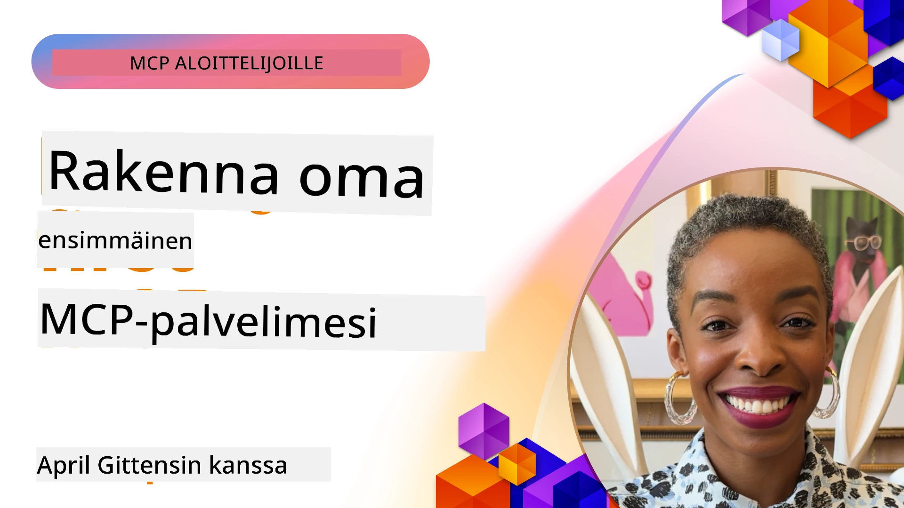

## Aloittaminen  

_(Napsauta yllä olevaa kuvaa nähdäksesi tämän oppitunnin videon)_

Tämä osio koostuu useista oppitunneista:

- **1 Ensimmäinen palvelimesi**, tässä ensimmäisessä oppitunnissa opit luomaan ensimmäisen palvelimesi ja tarkastelemaan sitä tarkastus työkalulla, arvokas tapa testata ja virheenkorjata palvelimesi, [oppituntuun](01-first-server/README.md)

- **2 Asiakas**, tässä oppitunnissa opit kirjoittamaan asiakkaan, joka voi muodostaa yhteyden palvelimeesi, [oppituntuun](02-client/README.md)

- **3 Asiakas LLM:llä**, vielä parempi tapa kirjoittaa asiakas on lisätä siihen LLM, jotta se voi "neuvotella" palvelimesi kanssa siitä, mitä tehdä, [oppituntuun](03-llm-client/README.md)

- **4 Palvelimen käyttäminen GitHub Copilot Agent -tilassa Visual Studio Codessa**. Tässä tarkastelemme MCP-palvelimen suorittamista Visual Studio Code -sovelluksesta käsin, [oppituntuun](04-vscode/README.md)

- **5 stdio-kuljetinpalvelin** stdio-kuljetin on suositeltu standardi paikalliseen MCP-palvelin-asiakas -viestintään, tarjoten turvallisen alipalvelupohjaisen viestinnän sisäänrakennetulla prosessieristyksellä [oppituntuun](05-stdio-server/README.md)

- **6 HTTP-suoratoisto MCP:n kanssa (Streamable HTTP)**. Opi nykyaikaisesta HTTP-suoratoistokuljetuksesta (suositeltu lähestymistapa etä-MCP-palvelimille [MCP-määrityksen 2025-11-25](https://spec.modelcontextprotocol.io/specification/2025-11-25/basic/transports/#streamable-http) mukaan), etenemisilmoituksista ja kuinka toteuttaa skaalautuvia, reaaliaikaisia MCP-palvelimia ja -asiakkaita käyttämällä Streamable HTTP:tä. [oppituntuun](06-http-streaming/README.md)

- **7 AI Toolkitin käyttäminen VSCode:ssa** kuluttaa ja testaa MCP-asiakkaitasi ja -palvelimiasi [oppituntuun](07-aitk/README.md)

- **8 Testaus**. Tässä keskitymme erityisesti siihen, miten voimme testata palvelintamme ja asiakastamme eri tavoin, [oppituntuun](08-testing/README.md)

- **9 Julkaisu**. Tämä luku käsittelee erilaisia tapoja julkaista MCP-ratkaisujasi, [oppituntuun](09-deployment/README.md)

- **10 Edistynyt palvelimen käyttö**. Tämä luku kattaa edistyneen palvelimen käytön, [oppituntuun](./10-advanced/README.md)

- **11 Autentikointi**. Tämä luku kattaa yksinkertaisen autentikoinnin lisäämisen, Basic Authista JWT:n ja RBAC:n käyttöön. Suositellaan aloittamaan tästä ja sitten katsoa Edistyneitä aiheita luvussa 5 sekä tehdä lisäturvallistaminen lukujen 2 suositusten avulla, [oppituntuun](./11-simple-auth/README.md)

- **12 MCP-isäntäsovellukset**. Konfiguroi ja käytä suosittuja MCP-isäntäasiakkaita kuten Claude Desktop, Cursor, Cline ja Windsurf. Opi kuljetustyypeistä ja vianmäärityksestä, [oppituntuun](./12-mcp-hosts/README.md)

- **13 MCP Inspector**. Virheenkorjaa ja testaa MCP-palvelimiasi interaktiivisesti MCP Inspector -työkalulla. Opi ratkaisemaan työkaluja, resursseja ja protokollaviestejä koskevia ongelmia, [oppituntuun](./13-mcp-inspector/README.md)

Model Context Protocol (MCP) on avoin protokolla, joka standardisoi sovellusten tavan tarjota kontekstia LLM-malleille. Ajattele MCP:tä kuin USB-C-porttina tekoälysovelluksille – se tarjoaa standardisoidun tavan yhdistää tekoälymalleja erilaisiin tietolähteisiin ja työkaluihin.

## Oppimistavoitteet

Tämän oppitunnin lopussa osaat:

- Määrittää MCP-kehitysympäristöt C#:lle, Javalle, Pythonille, TypeScriptille ja JavaScriptille
- Rakentaa ja ottaa käyttöön perus MCP-palvelimia mukautetuilla ominaisuuksilla (resurssit, kehotteet ja työkalut)
- Luoda isäntäsovelluksia, jotka muodostavat yhteyden MCP-palvelimiin
- Testata ja virheenkorjata MCP-toteutuksia
- Ymmärtää yleisiä asennushaasteita ja niiden ratkaisuja
- Yhdistää MCP-toteutuksesi suosittuihin LLM-palveluihin

## MCP-ympäristön asennus

Ennen kuin aloitat työskentelyn MCP:n kanssa, on tärkeää valmistella kehitysympäristösi ja ymmärtää perustyönkulku. Tämä osio ohjaa sinut alkuasetusten läpi varmistaaksesi sujuvan aloituksen MCP:n kanssa.

### Esivaatimukset

Ennen kuin sukellat MCP-kehitykseen, varmista että sinulla on:

- **Kehitysympäristö**: Valitsemallesi kielelle (C#, Java, Python, TypeScript tai JavaScript)
- **IDE/Editori**: Visual Studio, Visual Studio Code, IntelliJ, Eclipse, PyCharm tai jokin nykyaikainen koodieditori
- **Paketinhallintaohjelmat**: NuGet, Maven/Gradle, pip tai npm/yarn
- **API-avaimet**: Kaikkiin tekoälypalveluihin, joita aiot käyttää isäntäsovelluksissasi

### Viralliset SDK:t

Tulevissa luvuissa näet ratkaisuja, jotka on rakennettu Pythonilla, TypeScriptillä, Javalla ja .NET:llä. Tässä ovat kaikki virallisesti tuetut SDK:t.

MCP tarjoaa virallisia SDK:ita useille kielille (yhteensopiva [MCP-määrityksen 2025-11-25](https://spec.modelcontextprotocol.io/specification/2025-11-25/) kanssa):
- [C# SDK](https://github.com/modelcontextprotocol/csharp-sdk) - Ylläpidetään yhteistyössä Microsoftin kanssa
- [Java SDK](https://github.com/modelcontextprotocol/java-sdk) - Ylläpidetään yhteistyössä Spring AI:n kanssa
- [TypeScript SDK](https://github.com/modelcontextprotocol/typescript-sdk) - Virallinen TypeScript-toteutus
- [Python SDK](https://github.com/modelcontextprotocol/python-sdk) - Virallinen Python-toteutus (FastMCP)
- [Kotlin SDK](https://github.com/modelcontextprotocol/kotlin-sdk) - Virallinen Kotlin-toteutus
- [Swift SDK](https://github.com/modelcontextprotocol/swift-sdk) - Ylläpidetään yhteistyössä Loopwork AI:n kanssa
- [Rust SDK](https://github.com/modelcontextprotocol/rust-sdk) - Virallinen Rust-toteutus
- [Go SDK](https://github.com/modelcontextprotocol/go-sdk) - Virallinen Go-toteutus

## Tärkeimmät opit

- MCP-kehitysympäristön asentaminen on sujuvaa kielekohtaisilla SDK:illa
- MCP-palvelimien rakentaminen vaatii työkalujen luomista ja rekisteröintiä selkeiden skeemojen kanssa
- MCP-asiakkaat muodostavat yhteyden palvelimiin ja malleihin hyödyntääkseen laajennettuja ominaisuuksia
- Testaaminen ja virheenkorjaus ovat välttämättömiä luotettaville MCP -toteutuksille
- Julkaisuvaihtoehdot kattavat paikallisen kehityksen ja pilvipohjaiset ratkaisut

## Harjoittelu

Meillä on joukko esimerkkejä, jotka täydentävät kaikkien tämän osion lukujen harjoituksia. Lisäksi jokaisella luvulla on omat harjoituksensa ja tehtävänsä

- [Java-laskin](./samples/java/calculator/README.md)
- [.Net-laskin](../../../03-GettingStarted/samples/csharp)
- [JavaScript-laskin](./samples/javascript/README.md)
- [TypeScript-laskin](./samples/typescript/README.md)
- [Python-laskin](../../../03-GettingStarted/samples/python)

## Lisäresurssit

- [Rakenna agenteja käyttämällä Model Context Protocolia Azurella](https://learn.microsoft.com/azure/developer/ai/intro-agents-mcp)
- [Etä MCP Azure Container Appsissa (Node.js/TypeScript/JavaScript)](https://learn.microsoft.com/samples/azure-samples/mcp-container-ts/mcp-container-ts/)
- [.NET OpenAI MCP Agent](https://learn.microsoft.com/samples/azure-samples/openai-mcp-agent-dotnet/openai-mcp-agent-dotnet/)

## Mitä seuraavaksi

Aloita ensimmäisestä oppitunnista: [Ensimmäisen MCP-palvelimesi luominen](01-first-server/README.md)

Kun olet suorittanut tämän moduulin, jatka: [Moduuli 4: Käytännön toteutus](../04-PracticalImplementation/README.md)

---

<!-- CO-OP TRANSLATOR DISCLAIMER START -->
**Vastuuvapauslauseke**:  
Tämä asiakirja on käännetty tekoälylähtöisellä käännöspalvelulla [Co-op Translator](https://github.com/Azure/co-op-translator). Vaikka pyrimme tarkkuuteen, ole hyvä ja huomioi, että automaattikäännöksissä saattaa esiintyä virheitä tai epätarkkuuksia. Alkuperäistä asiakirjaa sen alkuperäiskielellä tulee pitää virallisena lähteenä. Tärkeissä asioissa suositellaan ammattimaista ihmiskäännöstä. Emme ole vastuussa tämän käännöksen käytöstä johtuvista väärinymmärryksistä tai tulkinnoista.
<!-- CO-OP TRANSLATOR DISCLAIMER END -->