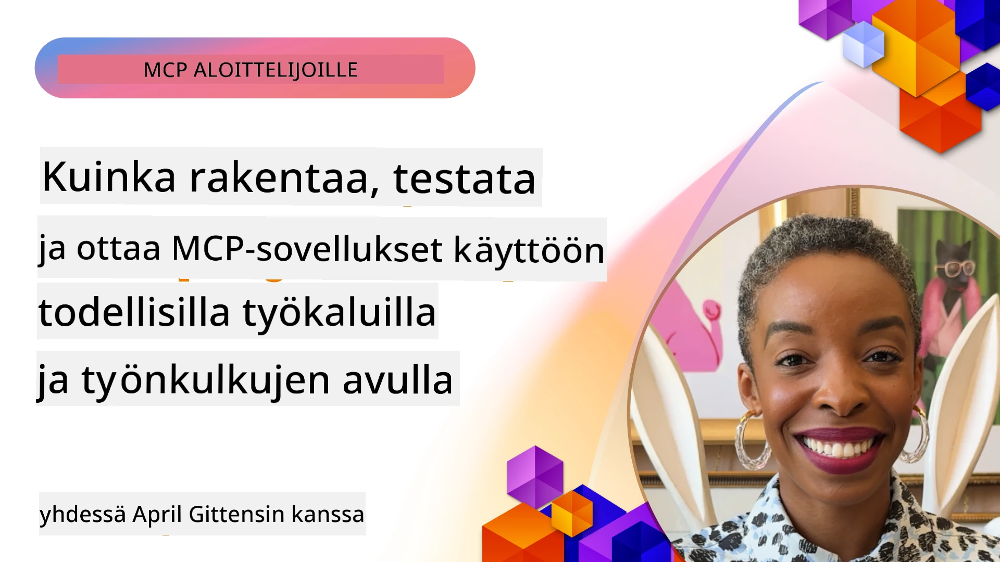
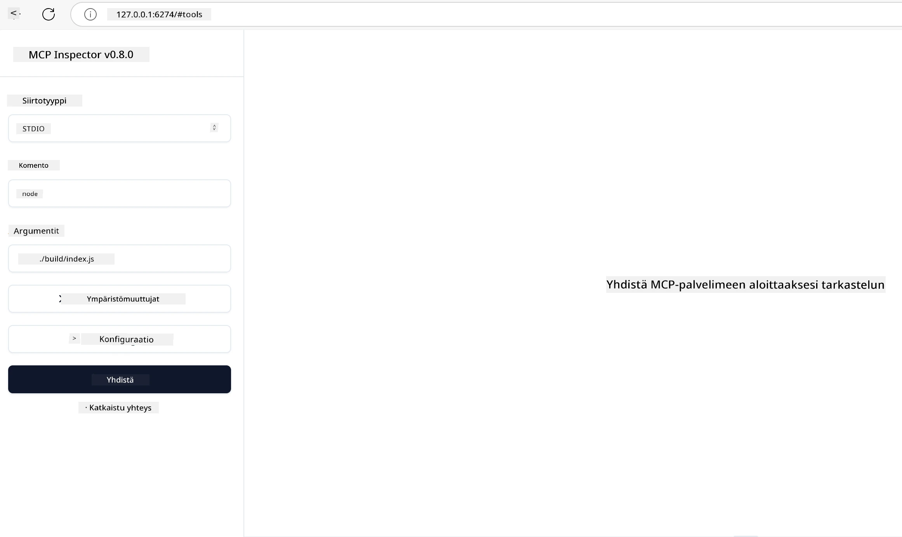

# Käytännön toteutus

[](https://youtu.be/vCN9-mKBDfQ)

_(Klikkaa yllä olevaa kuvaa katsellaksesi tämän oppitunnin videon)_

Käytännön toteutus on se vaihe, jossa Model Context Protocolin (MCP) voima tulee konkreettiseksi. Vaikka MCP:n teoria ja arkkitehtuuri ovat tärkeitä ymmärtää, todellinen arvo syntyy, kun sovellat näitä käsitteitä rakentaaksesi, testataksesi ja käyttöönottaaksesi ratkaisuja, jotka ratkaisevat todellisia ongelmia. Tämä luku yhdistää käsitteellisen tiedon ja käytännön kehityksen opastaen sinua MCP-pohjaisten sovellusten elävöittämisessä.

Olitpa kehittämässä älykkäitä apureita, integroimassa tekoälyä liiketoimintaprosesseihin tai rakentamassa räätälöityjä työkaluja tietojenkäsittelyyn, MCP tarjoaa joustavan pohjan. Sen kieliriippumaton muotoilu ja viralliset SDK:t suosituissa ohjelmointikielissä tekevät siitä helposti lähestyttävän monenlaisille kehittäjille. Hyödyntämällä näitä SDK:ita voit nopeasti prototypoida, kehittää ja skaalata ratkaisuja eri alustoilla ja ympäristöissä.

Seuraavissa osioissa löydät käytännön esimerkkejä, mallikoodeja ja käyttöönotto-strategioita, jotka osoittavat, miten MCP:tä toteutetaan C#:ssa, Javalla Springillä, TypeScriptissä, JavaScriptissä ja Pythonissa. Opit myös, miten MCP-palvelimia virheenkorjataan ja testataan, hallitaan API:ita ja otetaan ratkaisuja käyttöön pilvessä Azurea hyödyntäen. Nämä käytännön resurssit on suunniteltu nopeuttamaan oppimistasi ja auttamaan sinua rakentamaan luottavaisin mielin vankkoja, tuotantovalmiita MCP-sovelluksia.

## Yleiskatsaus

Tämä oppitunti keskittyy MCP:n käytännön toteutusnäkökulmiin useilla ohjelmointikielillä. Tutkimme, miten MCP SDK:ita käytetään C#:ssa, Javalla Springillä, TypeScriptissä, JavaScriptissä ja Pythonissa vahvojen sovellusten rakentamiseen, MCP-palvelimien virheenkorjaukseen ja testaukseen sekä uudelleenkäytettävien resurssien, kehotteiden ja työkalujen luomiseen.

## Oppimistavoitteet

Oppitunnin lopuksi osaat:

- Toteuttaa MCP-ratkaisuja virallisilla SDK:illa eri ohjelmointikielillä
- Virheenkorjata ja testata MCP-palvelimia systemaattisesti
- Luoda ja käyttää palvelimen ominaisuuksia (Resurssit, Kehotteet, Työkalut)
- Suunnitella tehokkaita MCP-työnkulkuja monimutkaisia tehtäviä varten
- Optimoida MCP-toteutuksia suorituskyvyn ja luotettavuuden parantamiseksi

## Viralliset SDK-resurssit

Model Context Protocol tarjoaa viralliset SDK:t useille kielille (linjassa [MCP-spesifikaation 2025-11-25](https://spec.modelcontextprotocol.io/specification/2025-11-25/) kanssa):

- [C# SDK](https://github.com/modelcontextprotocol/csharp-sdk)
- [Java Spring SDK](https://github.com/modelcontextprotocol/java-sdk) **Huom:** vaatii riippuvuuden [Project Reactor](https://projectreactor.io) -kirjastoon. (Katso [keskustelu issue 246](https://github.com/orgs/modelcontextprotocol/discussions/246).)
- [TypeScript SDK](https://github.com/modelcontextprotocol/typescript-sdk)
- [Python SDK](https://github.com/modelcontextprotocol/python-sdk)
- [Kotlin SDK](https://github.com/modelcontextprotocol/kotlin-sdk)
- [Go SDK](https://github.com/modelcontextprotocol/go-sdk)

## Työskentely MCP SDK:iden kanssa

Tässä osassa esitellään käytännön esimerkkejä MCP:n toteuttamisesta useilla ohjelmointikielillä. Mallikoodit löytyvät `samples`-hakemistosta kielikohtaisesti järjestettynä.

### Saatavilla olevat mallit

Reposti sisältää [mallitoteutuksia](../../../04-PracticalImplementation/samples) seuraavilla kielillä:

- [C#](./samples/csharp/README.md)
- [Java Spring](./samples/java/containerapp/README.md)
- [TypeScript](./samples/typescript/README.md)
- [JavaScript](./samples/javascript/README.md)
- [Python](./samples/python/README.md)

Jokainen malli esittelee keskeisiä MCP-käsitteitä ja toteutusmalleja kyseisen kielen ja ekosysteemin mukaiseen käyttöön.

### Käytännön oppaat

Lisäoppaita käytännön MCP-toteutukseen:

- [Paginointi ja suuret tulosjoukot](./pagination/README.md) – Työkalujen, resurssien ja suurten aineistojen kursori-pohjaisen paginoinnin käsittely

## Keskeiset palvelinominaisuudet

MCP-palvelimet voivat toteuttaa minkä tahansa yhdistelmän seuraavista ominaisuuksista:

### Resurssit

Resurssit tarjoavat kontekstin ja datan käyttäjälle tai tekoälymallille:

- Asiakirjakokoelmat
- Tietopohjat
- Rakenteelliset tietolähteet
- Tiedostojärjestelmät

### Kehotteet

Kehotteet ovat mallipohjaisia viestejä ja työnkulkuja käyttäjille:

- Ennalta määritellyt keskustelumallit
- Ohjatut vuorovaikutuskuviot
- Erikoistuneet dialogirakenteet

### Työkalut

Työkalut ovat tekoälymallin suorittamia toimintoja:

- Tietojenkäsittelyapuohjelmat
- Ulkoiset API-integraatiot
- Laskentakyvyt
- Hakutoiminnot

## Mallitoteutukset: C#-toteutus

Virallinen C# SDK -repo sisältää useita malliesimerkkejä, jotka havainnollistavat eri MCP:n osa-alueita:

- **Perus MCP-asiakas:** Yksinkertainen esimerkki siitä, miten luodaan MCP-asiakas ja kutsutaan työkaluja
- **Perus MCP-palvelin:** Minimipalvelimen toteutus jossa on perustyökalujen rekisteröinti
- **Edistynyt MCP-palvelin:** Täysimittainen palvelin, jossa työkalu-rekisteröinti, todennus ja virheenkäsittely
- **ASP.NET -integraatiot:** Esimerkkejä ASP.NET Core -integraatiosta
- **Työkalujen toteutuskuviot:** Vaihtelevia mallitapoja työkalujen toteuttamiseen eri monimutkaisuustasoilla

MCP C# SDK on esikatseluvaiheessa ja API:t voivat muuttua. Päivitämme tätä blogia jatkuvasti SDK:n kehittyessä.

### Keskeiset ominaisuudet

- [C# MCP Nuget ModelContextProtocol](https://www.nuget.org/packages/ModelContextProtocol)
- Rakennetaan [ensimmäinen MCP-palvelimesi](https://devblogs.microsoft.com/dotnet/build-a-model-context-protocol-mcp-server-in-csharp/).

Täydet C#-toteutusmallit löytyvät [virallisesta C# SDK:n mallireposta](https://github.com/modelcontextprotocol/csharp-sdk).

## Mallitoteutus: Java Spring -toteutus

Java Spring SDK tarjoaa vahvan MCP-toteutuskyvyn yritysluokkaisin ominaisuuksin.

### Keskeiset ominaisuudet

- Spring Frameworkin integraatio
- Vahva tyyppiturvallisuus
- Reaktiivinen ohjelmointi
- Kattava virheenkäsittely

Täydellinen Java Spring -toteutus löytyy [Java Spring mallista](samples/java/containerapp/README.md) mallihakemistosta.

## Mallitoteutus: JavaScript-toteutus

JavaScript SDK tarjoaa kevyen ja joustavan tavan toteuttaa MCP.

### Keskeiset ominaisuudet

- Node.js- ja selaintuki
- Lupauspohjainen API
- Helppo integraatio Expressin ja muiden frameworkien kanssa
- WebSocket-tuki suoratoistolle

Täydellinen JavaScript-malli löytyy [JavaScript mallista](samples/javascript/README.md) mallihakemistosta.

## Mallitoteutus: Python-toteutus

Python SDK tarjoaa Python-tyylisen tavan toteuttaa MCP erinomaisella ML-framework -integraatiolla.

### Keskeiset ominaisuudet

- Async/await tuki asyncio-kirjastolla
- FastAPI-integraatio
- Yksinkertainen työkalujen rekisteröinti
- Natiivi integraatio suosittuihin ML-kirjastoihin

Täydellinen Python-malli löytyy [Python mallista](samples/python/README.md) mallihakemistosta.

## API-hallinta

Azure API Management tarjoaa hyvän vastauksen MCP-palvelinten suojaamiseen. Ajatus on asettaa Azure API Management -instanssi MCP-palvelimesi eteen ja antaa sen hoitaa toiminnot, joita tarvitset, kuten:

- Rajoitusnopeudet
- Tokenien hallinta
- Valvonta
- Kuormantasapaino
- Turvallisuus

### Azure-malli

Tässä on Azure-malli, joka tekee juuri tämän, eli [luo MCP-palvelin ja suojaa se Azure API Managementilla](https://github.com/Azure-Samples/remote-mcp-apim-functions-python).

Katso alla olevaa kuvaa, miten valtuutusprosessi tapahtuu:


Edellisessä kuvassa tapahtuu seuraavaa:

- Todennus/valtuutus tapahtuu Microsoft Entran kautta.
- Azure API Management toimii porttina ja käyttää politiikkoja liikenteen ohjaukseen ja hallintaan.
- Azure Monitor kirjaa kaikki pyynnöt jatkoanalyysiä varten.

#### Valtuutusprosessi

Katsotaan valtuutusprosessia tarkemmin:


#### MCP-valtuutusspesifikaatio

Lisätietoja MCP:n valtuutusspesifikaatiosta löydät osoitteesta [MCP Authorization specification](https://spec.modelcontextprotocol.io/specification/2025-11-25/basic/authorization/).

## Etä-MCP-palvelimen käyttöönotto Azuren pilvessä

Katsotaan, onnistummeko ottamaan aikaisemmin mainittu malli käyttöön:

1. Klonaa repositorio

    ```bash
    git clone https://github.com/Azure-Samples/remote-mcp-apim-functions-python.git
    cd remote-mcp-apim-functions-python
    ```

1. Rekisteröi `Microsoft.App` resurssitoimittaja.

   - Jos käytät Azure CLI:ä, suorita `az provider register --namespace Microsoft.App --wait`.
   - Jos käytät Azure PowerShelliä, suorita `Register-AzResourceProvider -ProviderNamespace Microsoft.App`. Tarkista sitten `(Get-AzResourceProvider -ProviderNamespace Microsoft.App).RegistrationState` tarkistaaksesi rekisteröinnin valmistumisen.

1. Suorita tämä [azd](https://aka.ms/azd) -komento API Management -palvelun, funktiosovelluksen (koodilla) ja muiden tarvittavien Azure-resurssien provisioimiseksi

    ```shell
    azd up
    ```

    Tämä komento ottaa käyttöön kaikki pilviresurssit Azureen

### Palvelimen testaaminen MCP Inspectorilla

1. Avaa **uusi komentorivipääte** ja asenna sekä käynnistä MCP Inspector

    ```shell
    npx @modelcontextprotocol/inspector
    ```

    Näet käyttöliittymän, joka näyttää suunnilleen tältä:

    

1. CTRL-klikkaa ladataksesi MCP Inspectorin verkkosovelluksen sovelluksen näyttämästä URL-osoitteesta (esim. [http://127.0.0.1:6274/#resources](http://127.0.0.1:6274/#resources))
1. Aseta tiedonsiirtotyyppi `SSE`
1. Syötä URL käyttämäsi API Managementin SSE-päätepisteeseen, joka näkyy `azd up` -komennon jälkeen, ja **Yhdistä**:

    ```shell
    https://<apim-servicename-from-azd-output>.azure-api.net/mcp/sse
    ```

1. **Listaa työkalut**. Klikkaa työkalua ja **Suorita työkalu**.

Jos kaikki vaiheet ovat onnistuneet, olet yhteydessä MCP-palvelimeen ja olet pystynyt kutsumaan työkalun.

## MCP-palvelimet Azurelle

[Remote-mcp-functions](https://github.com/Azure-Samples/remote-mcp-functions-dotnet): Tämä joukko repositorioita on pika-aloituspohja räätälöityjen etä-MCP-palvelimien rakentamiseen ja käyttöönottoon Azure Functions -ympäristössä Pythonilla, C# .NET:llä tai Node/TypeScriptillä.

Malliesimerkit tarjoavat kokonaisratkaisun, jonka avulla kehittäjät voivat:

- Rakentaa ja ajaa paikallisesti: Kehittää ja virheenkorjata MCP-palvelin paikallisella koneella
- Ottaa käyttöön Azureen: Helppo pilvi-käyttöönotto yksinkertaisella azd up -komennolla
- Yhdistää asiakkailta: Yhdistää MCP-palvelimeen eri asiakasohjelmilla, kuten VS Coden Copilot-tilassa ja MCP Inspector -työkalulla

### Keskeiset ominaisuudet

- Turvallisuus oletuksena: MCP-palvelin on suojattu avaimilla ja HTTPS:llä
- Todennusvaihtoehdot: Tukee OAuth:ta sisäänrakennetulla autentikoinnilla tai API Managementilla
- Verkkoympäristön eristäminen: Mahdollisuus verkkoeristykseen Azure Virtual Networks (VNET) avulla
- Palvelinless-arkkitehtuuri: Käyttää Azure Functions -toimintoja skaalaavaan, tapahtumapohjaiseen suoritusmalliin
- Paikallinen kehitys: Kattava paikallisen kehityksen ja virheenkorjauksen tuki
- Yksinkertainen käyttöönotto: Virtaviivainen käyttöönotto Azureen

Repositorio sisältää kaikki tarvittavat määritystiedostot, lähdekoodin ja infrastruktuurin määritelmät nopeasti tuotantovalmiin MCP-palvelimen toteutukseen.

- [Azure Remote MCP Functions Python](https://github.com/Azure-Samples/remote-mcp-functions-python) - MCP:n malliesimerkki Azure Functionsilla Pythonilla

- [Azure Remote MCP Functions .NET](https://github.com/Azure-Samples/remote-mcp-functions-dotnet) - MCP:n malliesimerkki Azure Functionsilla C# .NET:llä

- [Azure Remote MCP Functions Node/Typescript](https://github.com/Azure-Samples/remote-mcp-functions-typescript) - MCP:n malliesimerkki Azure Functionsilla Node/TypeScriptillä.

## Keskeiset opit

- MCP SDK:t tarjoavat kielikohtaiset työkalut vankkojen MCP-ratkaisujen toteuttamiseen
- Virheenkorjaus ja testaus ovat kriittisiä luotettaville MCP-sovelluksille
- Uudelleenkäytettävät kehottepohjat mahdollistavat yhdenmukaiset tekoälyvuorovaikutukset
- Hyvin suunnitellut työnkulut voivat orkestroida monimutkaisia tehtäviä useilla työkaluilla
- MCP-ratkaisujen toteutuksessa tulee huomioida turvallisuus, suorituskyky ja virheenkäsittely

## Harjoitus

Suunnittele käytännön MCP-työnkulku, joka ratkaisee oman alasi todellisen ongelman:

1. Tunnista 3-4 työkalua, jotka olisivat hyödyllisiä ongelman ratkaisemisessa
2. Luo työnkulku-kaavio, joka näyttää, miten nämä työkalut vuorovaikuttavat
3. Toteuta yksi työkalu perusversio valitsemallasi kielellä
4. Luo kehotemalli, joka auttaa mallia käyttämään työkalua tehokkaasti

## Lisäresurssit

---

## Mitä seuraavaksi

Seuraava: [Edistyneet aiheet](../05-AdvancedTopics/README.md)

---

<!-- CO-OP TRANSLATOR DISCLAIMER START -->
**Vastuuvapauslauseke**:  
Tämä asiakirja on käännetty käyttämällä tekoälypohjaista käännöspalvelua [Co-op Translator](https://github.com/Azure/co-op-translator). Vaikka pyrimme tarkkuuteen, huomioithan, että automaattiset käännökset saattavat sisältää virheitä tai epätarkkuuksia. Alkuperäistä asiakirjaa sen alkuperäisellä kielellä tulee pitää virallisena lähteenä. Tärkeissä asioissa suositellaan ammattimaista ihmiskäännöstä. Emme ole vastuussa tämän käännöksen käytöstä mahdollisesti aiheutuvista väärinkäsityksistä tai tulkinnoista.
<!-- CO-OP TRANSLATOR DISCLAIMER END -->