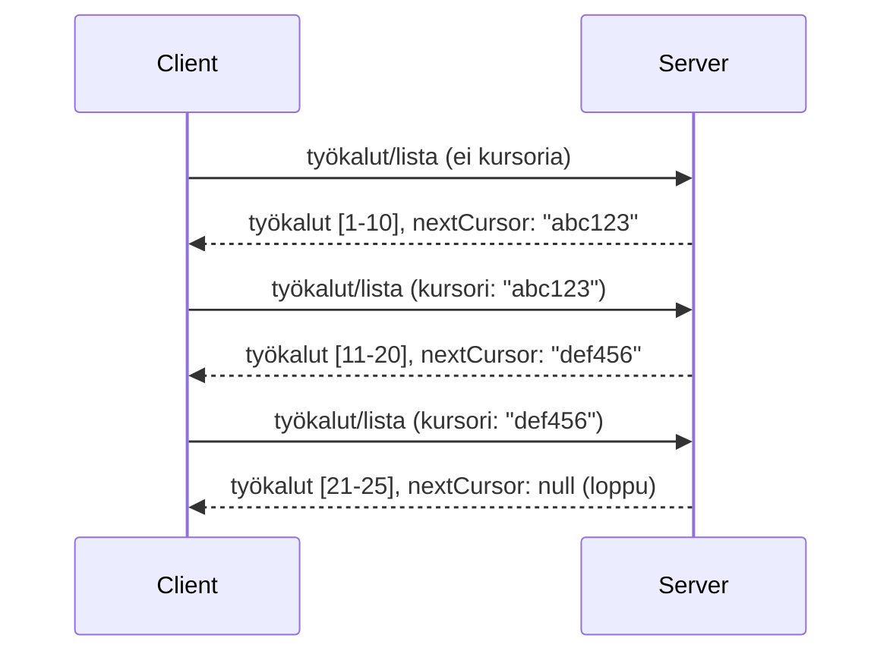

# Sivutus ja suuret tulosjoukot MCP:ssä

Kun MCP-palvelimesi käsittelee suuria tietomääriä – olipa kyse sitten tuhansien tiedostojen, tietokantatietueiden tai hakutulosten listauksesta – tarvitset sivutuksen muistinhallinnan tehostamiseksi ja sujuvan käyttäjäkokemuksen tarjoamiseksi. Tässä oppaassa käsitellään, miten sivutus toteutetaan ja käytetään MCP:ssä.

## Miksi sivutus on tärkeää

Ilman sivutusta suuret vastaukset voivat aiheuttaa:

- **Muistin loppuminen** – Miljoonien tietueiden lataaminen kerralla
- **Hitaat vasteajat** – Käyttäjät odottavat kun kaikki data latautuu
- **Aikatulutvirheet** – Pyynnöt ylittävät aikakatkaisurajat
- **Heikko tekoälyn suorituskyky** – LLM:t kamppailevat valtavan kontekstin kanssa

MCP käyttää **kursori-pohjaista sivutusta** luotettavan ja johdonmukaisen tulosten selaamisen takaamiseksi.

---

## Näin MCP-sivutus toimii

### Kursori-käsite

**Kursori** on läpinäkymätön merkkijono, joka merkitsee sijaintiasi tulosjoukossa. Ajattele sitä kirjanmerkkinä pitkässä kirjassa.


### Sivutus MCP-metodeissa

Nämä MCP-metodit tukevat sivutusta:

| Metodi | Palauttaa | Cursor-tuki |
|--------|-----------|-------------|
| `tools/list` | Työkalumääritykset | ✅ |
| `resources/list` | Resurssimääritykset | ✅ |
| `prompts/list` | Kehotemääritykset | ✅ |
| `resources/templates/list` | Resurssimallit | ✅ |

---

## Palvelimen toteutus

### Python (FastMCP)

```python
from mcp.server import Server
from mcp.types import Tool, ListToolsResult
import math

app = Server("paginated-server")

# Simuloitu suuri tietojoukko
ALL_TOOLS = [
    Tool(name=f"tool_{i}", description=f"Tool number {i}", inputSchema={})
    for i in range(100)
]

PAGE_SIZE = 10

@app.list_tools()
async def list_tools(cursor: str | None = None) -> ListToolsResult:
    """List tools with pagination support."""
    
    # Dekoodaa kursori saadaksesi aloitusindeksi
    start_index = 0
    if cursor:
        try:
            start_index = int(cursor)
        except ValueError:
            start_index = 0
    
    # Hae tulossivu
    end_index = min(start_index + PAGE_SIZE, len(ALL_TOOLS))
    page_tools = ALL_TOOLS[start_index:end_index]
    
    # Laske seuraava kursori
    next_cursor = None
    if end_index < len(ALL_TOOLS):
        next_cursor = str(end_index)
    
    return ListToolsResult(
        tools=page_tools,
        nextCursor=next_cursor
    )
```

### TypeScript

```typescript
import { Server } from "@modelcontextprotocol/sdk/server/index.js";
import { ListToolsResultSchema } from "@modelcontextprotocol/sdk/types.js";

const server = new Server({
  name: "paginated-server",
  version: "1.0.0"
});

// Simuloitu suuri tietojoukko
const ALL_TOOLS = Array.from({ length: 100 }, (_, i) => ({
  name: `tool_${i}`,
  description: `Tool number ${i}`,
  inputSchema: { type: "object", properties: {} }
}));

const PAGE_SIZE = 10;

server.setRequestHandler(ListToolsResultSchema, async (request) => {
  // Purkaa osoitin
  let startIndex = 0;
  if (request.params?.cursor) {
    startIndex = parseInt(request.params.cursor, 10) || 0;
  }
  
  // Hae sivu tuloksia
  const endIndex = Math.min(startIndex + PAGE_SIZE, ALL_TOOLS.length);
  const pageTools = ALL_TOOLS.slice(startIndex, endIndex);
  
  // Laske seuraava osoitin
  const nextCursor = endIndex < ALL_TOOLS.length ? String(endIndex) : undefined;
  
  return {
    tools: pageTools,
    nextCursor
  };
});
```

### Java (Spring MCP)

```java
@Service
public class PaginatedToolService {
    
    private static final int PAGE_SIZE = 10;
    private final List<Tool> allTools;
    
    public PaginatedToolService() {
        // Alusta suuri tietojoukko
        this.allTools = IntStream.range(0, 100)
            .mapToObj(i -> new Tool("tool_" + i, "Tool number " + i, Map.of()))
            .collect(Collectors.toList());
    }
    
    @McpMethod("tools/list")
    public ListToolsResult listTools(@Param("cursor") String cursor) {
        // Pura kohdistin
        int startIndex = 0;
        if (cursor != null && !cursor.isEmpty()) {
            try {
                startIndex = Integer.parseInt(cursor);
            } catch (NumberFormatException e) {
                startIndex = 0;
            }
        }
        
        // Hae tulossivu
        int endIndex = Math.min(startIndex + PAGE_SIZE, allTools.size());
        List<Tool> pageTools = allTools.subList(startIndex, endIndex);
        
        // Laske seuraava kohdistin
        String nextCursor = endIndex < allTools.size() ? String.valueOf(endIndex) : null;
        
        return new ListToolsResult(pageTools, nextCursor);
    }
}
```

---

## Asiakasohjelman toteutus

### Python-asiakas

```python
from mcp import ClientSession

async def get_all_tools(session: ClientSession) -> list:
    """Fetch all tools using pagination."""
    all_tools = []
    cursor = None
    
    while True:
        result = await session.list_tools(cursor=cursor)
        all_tools.extend(result.tools)
        
        if result.nextCursor is None:
            break
        cursor = result.nextCursor
    
    return all_tools

# Käyttö
async with client_session as session:
    tools = await get_all_tools(session)
    print(f"Found {len(tools)} tools")
```

### TypeScript-asiakas

```typescript
import { Client } from "@modelcontextprotocol/sdk/client/index.js";

async function getAllTools(client: Client): Promise<Tool[]> {
  const allTools: Tool[] = [];
  let cursor: string | undefined = undefined;
  
  do {
    const result = await client.listTools({ cursor });
    allTools.push(...result.tools);
    cursor = result.nextCursor;
  } while (cursor);
  
  return allTools;
}

// Käyttö
const tools = await getAllTools(client);
console.log(`Found ${tools.length} tools`);
```

### Laiskan lataamisen malli

Hyvin suurille tietomäärille lataa sivut tarpeen mukaan:

```python
class PaginatedToolIterator:
    """Lazily iterate through paginated tools."""
    
    def __init__(self, session: ClientSession):
        self.session = session
        self.cursor = None
        self.buffer = []
        self.exhausted = False
    
    async def __anext__(self):
        # Palauta puskurista, jos saatavilla
        if self.buffer:
            return self.buffer.pop(0)
        
        # Tarkista, onko kaikki sivut käyty läpi
        if self.exhausted:
            raise StopAsyncIteration
        
        # Hae seuraava sivu
        result = await self.session.list_tools(cursor=self.cursor)
        self.buffer = list(result.tools)
        self.cursor = result.nextCursor
        
        if self.cursor is None:
            self.exhausted = True
        
        if not self.buffer:
            raise StopAsyncIteration
        
        return self.buffer.pop(0)
    
    def __aiter__(self):
        return self

# Käyttö - muistitehokas suurille tietojoukoille
async for tool in PaginatedToolIterator(session):
    process_tool(tool)
```

---

## Sivutus resursseille

Resurssit tarvitsevat usein sivutusta hakemistoille tai suurille tietomäärille:

```python
from mcp.server import Server
from mcp.types import Resource, ListResourcesResult
import os

app = Server("file-server")

@app.list_resources()
async def list_resources(cursor: str | None = None) -> ListResourcesResult:
    """List files in directory with pagination."""
    
    directory = "/data/files"
    all_files = sorted(os.listdir(directory))
    
    # Dekoodaa kohdistin (tiedoston indeksi)
    start_index = int(cursor) if cursor else 0
    page_size = 20
    end_index = min(start_index + page_size, len(all_files))
    
    # Luo resurssien lista tälle sivulle
    resources = []
    for filename in all_files[start_index:end_index]:
        filepath = os.path.join(directory, filename)
        resources.append(Resource(
            uri=f"file://{filepath}",
            name=filename,
            mimeType="application/octet-stream"
        ))
    
    # Laske seuraava kohdistin
    next_cursor = str(end_index) if end_index < len(all_files) else None
    
    return ListResourcesResult(
        resources=resources,
        nextCursor=next_cursor
    )
```

---

## Kursori-suunnittelustrategiat

### Strategia 1: Indeksipohjainen (yksinkertainen)

```python
# Kohdistin on vain indeksi
cursor = "50"  # Aloita kohteesta 50
```

**Plussat:** Yksinkertainen, tilatonta  
**Miinukset:** Tulokset voivat muuttua, jos kohteita lisätään tai poistetaan

### Strategia 2: ID-pohjainen (vakaa)

```python
# Kursori on viimeksi nähty ID
cursor = "item_abc123"  # Aloita tämän kohteen jälkeen
```

**Plussat:** Vakaa, vaikka kohteet muuttuvat  
**Miinukset:** Vaatii järjestetyt tunnisteet

### Strategia 3: Koodattu tila (monimutkainen)

```python
import base64
import json

def encode_cursor(state: dict) -> str:
    return base64.b64encode(json.dumps(state).encode()).decode()

def decode_cursor(cursor: str) -> dict:
    return json.loads(base64.b64decode(cursor).decode())

# Kohdistin sisältää useita tilakenttiä
cursor = encode_cursor({
    "offset": 50,
    "filter": "active",
    "sort": "name"
})
```

**Plussat:** Voi koodata monimutkaisen tilan  
**Miinukset:** Monimutkaisempi, pidemmät kursori-merkkijonot

---

## Parhaita käytäntöjä

### 1. Valitse sopivat sivukoot

```python
# Harkitse datan kokoa
PAGE_SIZE_SMALL_ITEMS = 100   # Yksinkertainen metatieto
PAGE_SIZE_MEDIUM_ITEMS = 20   # Monipuolisemmat objektit
PAGE_SIZE_LARGE_ITEMS = 5     # Monimutkainen sisältö
```

### 2. Käsittele virheelliset kursoriarvot hienovaraisesti

```python
@app.list_tools()
async def list_tools(cursor: str | None = None) -> ListToolsResult:
    try:
        start_index = int(cursor) if cursor else 0
        if start_index < 0 or start_index >= len(ALL_TOOLS):
            start_index = 0  # Nollaa alkuun
    except (ValueError, TypeError):
        start_index = 0  # Virheellinen kohdistin, aloita alusta
    # ...
```

### 3. Sisällytä kokonaistulosmäärä (valinnainen)

```python
return ListToolsResult(
    tools=page_tools,
    nextCursor=next_cursor,
    # Jotkut toteutukset sisältävät kokonaismäärän käyttöliittymän etenemiselle
    _meta={"total": len(ALL_TOOLS)}
)
```

### 4. Testaa ääriarvotapaukset

```python
async def test_pagination():
    # Tyhjä tulosjoukko
    result = await session.list_tools()
    assert result.tools == []
    assert result.nextCursor is None
    
    # Yksi sivu
    result = await session.list_tools()
    assert len(result.tools) <= PAGE_SIZE
    
    # Virheellinen kohdistin
    result = await session.list_tools(cursor="invalid")
    assert result.tools  # Pitäisi palauttaa ensimmäinen sivu
```

---

## Yleisiä sudenkuoppia

### ❌ Palauta kaikki tulokset ja sivuta asiakaspuolella

```python
# HUONO: Lataa kaiken muistiin
@app.list_tools()
async def list_tools() -> ListToolsResult:
    all_tools = load_all_tools()  # 1 miljoona työkalua!
    return ListToolsResult(tools=all_tools)
```

### ✅ Sivuta datalähteellä

```python
# HYVÄ: Lataa vain tarvittavan
@app.list_tools()
async def list_tools(cursor: str | None = None) -> ListToolsResult:
    offset = int(cursor) if cursor else 0
    tools = await db.query_tools(offset=offset, limit=PAGE_SIZE)
    return ListToolsResult(tools=tools, nextCursor=...)
```

---

## Mitä seuraavaksi

- [Moduuli 5.14 - Kontekstisuunnittelu](../../05-AdvancedTopics/mcp-contextengineering/README.md)  
- [Moduuli 8 - Parhaat käytännöt](../../08-BestPractices/README.md)  
- [3.8 - MCP-palvelimesi testaaminen](../../03-GettingStarted/08-testing/README.md)  

---

## Lisäresurssit

- [MCP-spesifikaatio - Sivutus](https://spec.modelcontextprotocol.io/specification/2025-11-25/)  
- [Cursor-pohjainen sivutus selitetty](https://slack.engineering/evolving-api-pagination-at-slack/)  
- [Python SDK sivutustestit](https://github.com/modelcontextprotocol/python-sdk/blob/main/tests/client/test_list_methods_cursor.py)

---

<!-- CO-OP TRANSLATOR DISCLAIMER START -->
**Vastuuvapauslauseke**:  
Tämä asiakirja on käännetty käyttämällä tekoälypohjaista käännöspalvelua [Co-op Translator](https://github.com/Azure/co-op-translator). Vaikka pyrimme tarkkuuteen, otathan huomioon, että automaattiset käännökset saattavat sisältää virheitä tai epätarkkuuksia. Alkuperäinen asiakirja sen alkuperäiskielellä on virallinen lähde. Tärkeissä asioissa suosittelemme ammattimaista, ihmiskääntäjien tekemää käännöstä. Emme ole vastuussa tämän käännöksen käytöstä johtuvista väärinymmärryksistä tai tulkinnoista.
<!-- CO-OP TRANSLATOR DISCLAIMER END -->