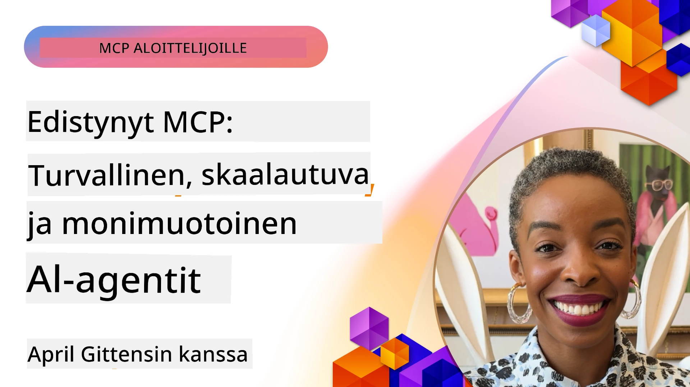

# Edistyneet aiheet MCP:ssä

_(Klikkaa yllä olevaa kuvaa katsoaksesi tämän oppitunnin videon)_

Tässä luvussa käsitellään sarjaa edistyneitä aiheita Model Context Protocolin (MCP) toteutuksessa, mukaan lukien monimuotoisten modaliteettien integrointi, skaalautuvuus, turvallisuuden parhaat käytännöt ja yritysintegraatio. Nämä aiheet ovat ratkaisevan tärkeitä, kun rakennetaan vankkoja ja tuotantovalmiita MCP-sovelluksia, jotka voivat vastata nykyaikaisten tekoälyjärjestelmien vaatimuksiin.

## Yleiskatsaus

Tässä oppitunnissa käsitellään edistyneitä käsitteitä Model Context Protocolin toteutuksessa, keskittyen monimuotoisten modaliteettien integrointiin, skaalautuvuuteen, turvallisuuden parhaisiin käytäntöihin sekä yritysintegraatioon. Nämä aiheet ovat olennaisia tuotantotason MCP-sovellusten rakentamisessa, jotka pystyvät käsittelemään monimutkaisia vaatimuksia yritysympäristöissä.

## Oppimistavoitteet

Tämän oppitunnin jälkeen osaat:

- Toteuttaa monimuotoiset modaliteetit MCP-kehyksissä
- Suunnitella skaalautuvia MCP-arkkitehtuureja suuriin kuormitustilanteisiin
- Soveltaa turvallisuuden parhaita käytäntöjä MCP:n turvallisuusperiaatteiden mukaisesti
- Integroida MCP:n yritysten tekoälyjärjestelmiin ja kehyksiin
- Optimoida suorituskykyä ja luotettavuutta tuotanto-olosuhteissa

## Oppitunnit ja esimerkkiprojektit

| Linkki | Otsikko | Kuvaus |
|------|-------|-------------|
| [5.1 Integration with Azure](./mcp-integration/README.md) | Integrointi Azureen | Opi kuinka integroida MCP-palvelimesi Azure-alustalle |
| [5.2 Multi modal sample](./mcp-multi-modality/README.md) | MCP monimuotokokeilut | Esimerkkejä ääni-, kuva- ja monimuotokokoisista vastauksista |
| [5.3 MCP OAuth2 sample](../../../05-AdvancedTopics/mcp-oauth2-demo) | MCP OAuth2 Demo | Minimipään pystyyn Spring Boot -sovellus, joka näyttää OAuth2:n käytön MCP:n kanssa, sekä Authorization- että Resource-palvelimena. Esittelee turvallisen tunnisteiden myöntämisen, suojatut päätepisteet, Azure Container Apps -käyttöönoton ja API Management -integraation. |
| [5.4 Root Contexts](./mcp-root-contexts/README.md) | Juurikontekstit | Lue lisää juurikontekstista ja kuinka niitä toteutetaan |
| [5.5 Routing](./mcp-routing/README.md) | Reititys | Opettele eri reititystyypit |
| [5.6 Sampling](./mcp-sampling/README.md) | Otanta | Opi työskentelemään otannan kanssa |
| [5.7 Scaling](./mcp-scaling/README.md) | Skaalaus | Opi skaalauksesta |
| [5.8 Security](./mcp-security/README.md) | Turvallisuus | Suojaa MCP-palvelimesi |
| [5.9 Web Search sample](./web-search-mcp/README.md) | Web Search MCP | Python MCP-palvelin ja -asiakas, jotka integroivat SerpAPI:n reaaliaikaiseen web-, uutis-, tuotetietojen hakuun ja Q&A-toimintoihin. Esittelee monityökalukäskyt, ulkoisten API:en integroinnin sekä vankat virheenkäsittelymenetelmät. |
| [5.10 Realtime Streaming](./mcp-realtimestreaming/README.md) | Suoratoisto | Reaaliaikainen tiedonsuoratoisto on nykyajan tiedolla ohjatuissa maailmassa välttämätöntä, jossa yritykset ja sovellukset tarvitsevat välitöntä pääsyä tietoon nopeiden päätösten tekemiseksi. |
| [5.11 Realtime Web Search](./mcp-realtimesearch/README.md) | Web-haku | Reaaliaikainen web-haku ja miten MCP muuttaa reaaliaikaista web-hakua tarjoamalla standardoidun lähestymistavan kontekstinhallintaan tekoälymallien, hakukoneiden ja sovellusten välillä. | 
| [5.12  Entra ID Authentication for Model Context Protocol Servers](./mcp-security-entra/README.md) | Entra ID -todennus | Microsoft Entra ID tarjoaa vahvan pilvipohjaisen identiteetin ja pääsynhallinnan ratkaisun, joka auttaa varmistamaan, että vain valtuutetut käyttäjät ja sovellukset voivat käyttää MCP-palvelintasi. |
| [5.13 Azure AI Foundry Agent Integration](./mcp-foundry-agent-integration/README.md) | Azure AI Foundry -integraatio | Opi, kuinka integroida Model Context Protocol -palvelimet Azure AI Foundry -agenttien kanssa, mahdollistaen tehokkaan työkalujen orkestroinnin ja yritystason tekoälyominaisuudet standardoitujen ulkoisten tietolähdeyhteyksien avulla. |
| [5.14 Context Engineering](./mcp-contextengineering/README.md) | Kontekstitekniikka | Konteksti-insinöörityön tulevaisuuden mahdollisuudet MCP-palvelimille, mukaan lukien kontekstin optimointi, dynaaminen kontekstinhallinta ja tehokkaat kehotteen suunnittelustrategiat MCP-kehyksissä. |
| [5.15 MCP Custom Transport](./mcp-transport/README.md) | Räätälöity tiedonsiirto | Opi toteuttamaan räätälöityjä tiedonsiirtomekanismeja erikoistuneisiin MCP-viestintätilanteisiin. |
| [5.16 Protocol Features Deep Dive](./mcp-protocol-features/README.md) | Protokollan ominaisuudet | Hallitse kehittyneet protokollan ominaisuudet, mukaan lukien edistymisilmoitukset, pyyntöjen peruutukset, resurssipohjat ja virheenkäsittelymallit. |

> **Uutta MCP-spesifikaatiossa 2025-11-25**: Spesifikaatio sisältää nyt kokeellista tukea **Tehtäville** (pitkäkestoiset operaatiot edistymisen seurannalla), **Työkalun annotaatioille** (työkalun käyttäytymistä koskeva metatieto turvallisuuden varmistamiseksi), **URL-tilan kyselyille** (pyynnöt saada tiettyä URL-sisältöä asiakkailta) ja paranneltuja **juuria** (työtilakontekstinhallintaan). Katso [MCP Specification changelog](https://spec.modelcontextprotocol.io/) täydelliset tiedot.

## Lisäviitteet

Ajantasaisimman tiedon saamiseksi edistyneistä MCP-aiheista, katso:
- [MCP-dokumentaatio](https://modelcontextprotocol.io/)
- [MCP-spesifikaatio (2025-11-25)](https://spec.modelcontextprotocol.io/specification/2025-11-25/)
- [GitHub-repositorio](https://github.com/modelcontextprotocol)
- [OWASP MCP Top 10](https://microsoft.github.io/mcp-azure-security-guide/mcp/) - Turvallisuusriskit ja niiden torjunta
- [MCP Security Summit Workshop (Sherpa)](https://azure-samples.github.io/sherpa/) - Käytännön turvallisuuskoulutus

## Keskeiset opit

- Monimuotoiset MCP-toteutukset laajentavat tekoälyn kykyjä tekstinkäsittelyn ulkopuolelle
- Skaalautuvuus on välttämätöntä yritysjakeluissa, ja sen voi toteuttaa vaakasuoran ja pystysuoran skaalaamisen avulla
- Kattavat turvatoimet suojaavat dataa ja varmistavat asianmukaisen pääsynhallinnan
- Yritysintegraatiot kuten Azure OpenAI ja Microsoft AI Foundry parantavat MCP:n ominaisuuksia
- Edistyneet MCP-toteutukset hyötyvät optimoiduista arkkitehtuureista ja huolellisesta resurssien hallinnasta

## Harjoitus

Suunnittele yritystason MCP-toteutus tietylle käyttötapaukselle:

1. Tunnista monimuotoisten modaliteettien vaatimukset käyttötapauksessasi
2. Laadi turvallisuusvalvontatoimet arkaluontoisten tietojen suojaamiseksi
3. Suunnittele skaalautuva arkkitehtuuri, joka kestää vaihtelevan kuormituksen
4. Suunnittele integraatiopisteet yritysten tekoälyjärjestelmien kanssa
5. Dokumentoi mahdolliset suorituskyvyn pullonkaulat ja torjuntastrategiat

## Lisäresurssit

- [Azure OpenAI -dokumentaatio](https://learn.microsoft.com/en-us/azure/ai-services/openai/)
- [Microsoft AI Foundry -dokumentaatio](https://learn.microsoft.com/en-us/ai-services/)

---

## Mitä seuraavaksi

Tutustu tähän moduuliin kuuluvien oppituntien parissa aloittaen: [5.1 MCP Integration](./mcp-integration/README.md)

Kun olet suorittanut tämän moduulin, jatka: [Moduuli 6: Yhteisön kontribuutiot](../06-CommunityContributions/README.md)

---

<!-- CO-OP TRANSLATOR DISCLAIMER START -->
**Vastuuvapauslauseke**:
Tämä asiakirja on käännetty tekoälypohjaisella käännöspalvelulla [Co-op Translator](https://github.com/Azure/co-op-translator). Pyrimme tarkkuuteen, mutta ota huomioon, että automaattikäännöksissä saattaa esiintyä virheitä tai epätarkkuuksia. Alkuperäinen asiakirja sen alkuperäiskielellä on virallinen lähde. Tärkeissä asiakirjoissa suosittelemme ammattimaista ihmiskäännöstä. Emme ole vastuussa tämän käännöksen käytöstä mahdollisesti aiheutuvista väärinymmärryksistä tai virhetulkinnoista.
<!-- CO-OP TRANSLATOR DISCLAIMER END -->