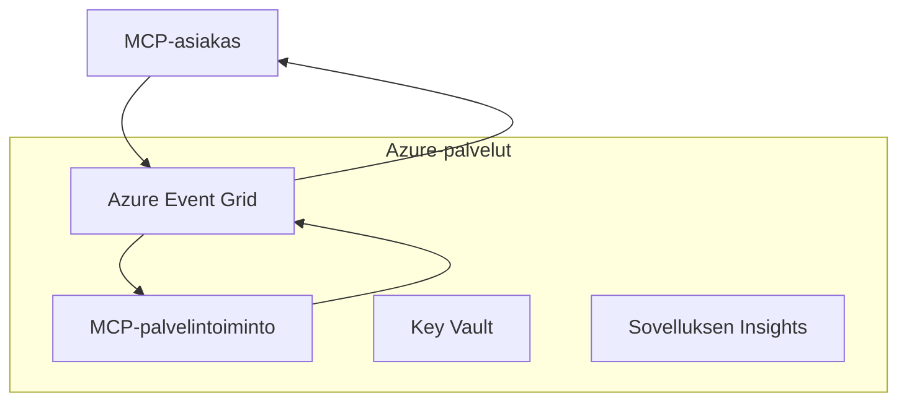
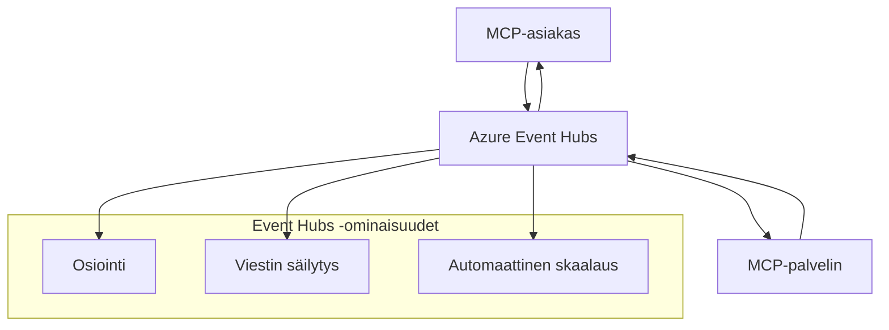

# MCP Custom Transports - Edistynyt toteutusopas

Model Context Protocol (MCP) tarjoaa joustavuutta siirtomekanismeissa, mahdollistaen mukautetut toteutukset erikoistuneisiin yritysympäristöihin. Tämä edistynyt opas tutkii mukautettujen siirtojen toteutuksia käyttäen Azure Event Gridiä ja Azure Event Hubseja käytännön esimerkkeinä skaalautuvien, pilvessä natiivien MCP-ratkaisujen rakentamiseen.

## Johdanto

Vaikka MCP:n standardisiirrot (stdio ja HTTP-streamaus) palvelevat useimpia käyttötapauksia, yritysympäristöt vaativat usein erikoistuneita siirtomekanismeja parannetun skaalautuvuuden, luotettavuuden ja olemassa olevan pilvi-infrastruktuurin integroinnin vuoksi. Mukautetut siirrot mahdollistavat MCP:n hyödyntää pilvessä natiiveja viestintäpalveluita asynkroniseen viestintään, tapahtumapohjaisiin arkkitehtuureihin ja hajautettuun käsittelyyn.

Tässä oppitunnissa käsitellään edistyneitä siirtototeutuksia uusimman MCP-spesifikaation (2025-11-25), Azure-viestintäpalveluiden ja vakiintuneiden yritysintegrointimallien pohjalta.

### **MCP-siirtoarkkitehtuuri**

**MCP-spesifikaatiosta (2025-11-25):**

- **Standardisiirrot**: stdio (suositeltu), HTTP-streamaus (etätilanteisiin)
- **Mukautetut siirrot**: Mikä tahansa siirto, joka toteuttaa MCP-viestinvaihtoprotokollan
- **Viestimuoto**: JSON-RPC 2.0 MCP-spesifisillä laajennuksilla
- **Kaksisuuntainen viestintä**: Täysi duplex-viestintä vaaditaan ilmoituksiin ja vastauksiin

## Oppimistavoitteet

Tämän edistyneen oppitunnin lopussa osaat:

- **Ymmärtää mukautettujen siirtojen vaatimukset**: Toteuttaa MCP-protokollan minkä tahansa siirtokerroksen yli säilyttäen vaatimustenmukaisuuden
- **Rakentaa Azure Event Grid -siirron**: Luoda tapahtumapohjaisia MCP-palvelimia serverless-skaalautuvuudella
- **Toteuttaa Azure Event Hubs -siirron**: Suunnitella suurivirtauksisia MCP-ratkaisuja reaaliaikaiseen streamaukseen Azure Event Hubsin avulla
- **Soveltaa yritysmallipatterneja**: Integroida mukautetut siirrot olemassa olevaan Azure-infrastruktuuriin ja turvallisuusmalleihin
- **Käsitellä siirron luotettavuutta**: Toteuttaa viestien kestävyys, järjestys ja virheenkäsittely yritysskenaarioissa
- **Optimoida suorituskykyä**: Suunnitella siirtoratkaisuja skaalan, latenssin ja läpimenon vaatimuksiin

## **Siirtovaatimukset**

### **Keskeiset vaatimukset MCP-spesifikaatiosta (2025-11-25):**

```yaml
Message Protocol:
  format: "JSON-RPC 2.0 with MCP extensions"
  bidirectional: "Full duplex communication required"
  ordering: "Message ordering must be preserved per session"
  
Transport Layer:
  reliability: "Transport MUST handle connection failures gracefully"
  security: "Transport MUST support secure communication"
  identification: "Each session MUST have unique identifier"
  
Custom Transport:
  compliance: "MUST implement complete MCP message exchange"
  extensibility: "MAY add transport-specific features"
  interoperability: "MUST maintain protocol compatibility"
```

## **Azure Event Grid -siirtototeutus**

Azure Event Grid tarjoaa serverless-tapahtumareitityspalvelun, joka sopii erinomaisesti tapahtumapohjaisiin MCP-arkkitehtuureihin. Tämä toteutus havainnollistaa, miten rakentaa skaalautuvia, löyhästi kytkettyjä MCP-järjestelmiä.

### **Arkkitehtuurin yleiskuva**


### **C#-toteutus - Event Grid -siirto**

```csharp
using Azure.Messaging.EventGrid;
using Microsoft.Extensions.Azure;
using System.Text.Json;

public class EventGridMcpTransport : IMcpTransport
{
    private readonly EventGridPublisherClient _publisher;
    private readonly string _topicEndpoint;
    private readonly string _clientId;
    
    public EventGridMcpTransport(string topicEndpoint, string accessKey, string clientId)
    {
        _publisher = new EventGridPublisherClient(
            new Uri(topicEndpoint), 
            new AzureKeyCredential(accessKey));
        _topicEndpoint = topicEndpoint;
        _clientId = clientId;
    }
    
    public async Task SendMessageAsync(McpMessage message)
    {
        var eventGridEvent = new EventGridEvent(
            subject: $"mcp/{_clientId}",
            eventType: "MCP.MessageReceived",
            dataVersion: "1.0",
            data: JsonSerializer.Serialize(message))
        {
            Id = Guid.NewGuid().ToString(),
            EventTime = DateTimeOffset.UtcNow
        };
        
        await _publisher.SendEventAsync(eventGridEvent);
    }
    
    public async Task<McpMessage> ReceiveMessageAsync(CancellationToken cancellationToken)
    {
        // Event Grid is push-based, so implement webhook receiver
        // This would typically be handled by Azure Functions trigger
        throw new NotImplementedException("Use EventGridTrigger in Azure Functions");
    }
}

// Azure Function for receiving Event Grid events
[FunctionName("McpEventGridReceiver")]
public async Task<IActionResult> HandleEventGridMessage(
    [EventGridTrigger] EventGridEvent eventGridEvent,
    ILogger log)
{
    try
    {
        var mcpMessage = JsonSerializer.Deserialize<McpMessage>(
            eventGridEvent.Data.ToString());
        
        // Process MCP message
        var response = await _mcpServer.ProcessMessageAsync(mcpMessage);
        
        // Send response back via Event Grid
        await _transport.SendMessageAsync(response);
        
        return new OkResult();
    }
    catch (Exception ex)
    {
        log.LogError(ex, "Error processing Event Grid MCP message");
        return new BadRequestResult();
    }
}
```

### **TypeScript-toteutus - Event Grid -siirto**

```typescript
import { EventGridPublisherClient, AzureKeyCredential } from "@azure/eventgrid";
import { McpTransport, McpMessage } from "./mcp-types";

export class EventGridMcpTransport implements McpTransport {
    private publisher: EventGridPublisherClient;
    private clientId: string;
    
    constructor(
        private topicEndpoint: string,
        private accessKey: string,
        clientId: string
    ) {
        this.publisher = new EventGridPublisherClient(
            topicEndpoint,
            new AzureKeyCredential(accessKey)
        );
        this.clientId = clientId;
    }
    
    async sendMessage(message: McpMessage): Promise<void> {
        const event = {
            id: crypto.randomUUID(),
            source: `mcp-client-${this.clientId}`,
            type: "MCP.MessageReceived",
            time: new Date(),
            data: message
        };
        
        await this.publisher.sendEvents([event]);
    }
    
    // Tapahtumapohjainen vastaanotto Azure Functionsin kautta
    onMessage(handler: (message: McpMessage) => Promise<void>): void {
        // Toteutus käyttäisi Azure Functions Event Grid -laukaisinta
        // Tämä on käsitteellinen rajapinta webhook-vastaanottimelle
    }
}

// Azure Functions -toteutus
import { app, InvocationContext, EventGridEvent } from "@azure/functions";

app.eventGrid("mcpEventGridHandler", {
    handler: async (event: EventGridEvent, context: InvocationContext) => {
        try {
            const mcpMessage = event.data as McpMessage;
            
            // Käsittele MCP-viesti
            const response = await mcpServer.processMessage(mcpMessage);
            
            // Lähetä vastaus Event Gridin kautta
            await transport.sendMessage(response);
            
        } catch (error) {
            context.error("Error processing MCP message:", error);
            throw error;
        }
    }
});
```

### **Python-toteutus - Event Grid -siirto**

```python
from azure.eventgrid import EventGridPublisherClient, EventGridEvent
from azure.core.credentials import AzureKeyCredential
import asyncio
import json
from typing import Callable, Optional
import uuid
from datetime import datetime

class EventGridMcpTransport:
    def __init__(self, topic_endpoint: str, access_key: str, client_id: str):
        self.client = EventGridPublisherClient(
            topic_endpoint, 
            AzureKeyCredential(access_key)
        )
        self.client_id = client_id
        self.message_handler: Optional[Callable] = None
    
    async def send_message(self, message: dict) -> None:
        """Send MCP message via Event Grid"""
        event = EventGridEvent(
            data=message,
            subject=f"mcp/{self.client_id}",
            event_type="MCP.MessageReceived",
            data_version="1.0"
        )
        
        await self.client.send(event)
    
    def on_message(self, handler: Callable[[dict], None]) -> None:
        """Register message handler for incoming events"""
        self.message_handler = handler

# Azure Functions -toteutus
import azure.functions as func
import logging

def main(event: func.EventGridEvent) -> None:
    """Azure Functions Event Grid trigger for MCP messages"""
    try:
        # Jäsennä MCP-viesti Event Grid -tapahtumasta
        mcp_message = json.loads(event.get_body().decode('utf-8'))
        
        # Käsittele MCP-viesti
        response = process_mcp_message(mcp_message)
        
        # Lähetä vastaus takaisin Event Gridin kautta
        # (Toteutus loisi uuden Event Grid -asiakkaan)
        
    except Exception as e:
        logging.error(f"Error processing MCP Event Grid message: {e}")
        raise
```

## **Azure Event Hubs -siirtototeutus**

Azure Event Hubs tarjoaa suurivirtauksisen, reaaliaikaisen streamauskapasiteetin MCP-skenaarioihin, jotka vaativat pientä latenssia ja suurta viestimäärää.

### **Arkkitehtuurin yleiskuva**


### **C#-toteutus - Event Hubs -siirto**

```csharp
using Azure.Messaging.EventHubs;
using Azure.Messaging.EventHubs.Producer;
using Azure.Messaging.EventHubs.Consumer;
using System.Text;

public class EventHubsMcpTransport : IMcpTransport, IDisposable
{
    private readonly EventHubProducerClient _producer;
    private readonly EventHubConsumerClient _consumer;
    private readonly string _consumerGroup;
    private readonly CancellationTokenSource _cancellationTokenSource;
    
    public EventHubsMcpTransport(
        string connectionString, 
        string eventHubName,
        string consumerGroup = "$Default")
    {
        _producer = new EventHubProducerClient(connectionString, eventHubName);
        _consumer = new EventHubConsumerClient(
            consumerGroup, 
            connectionString, 
            eventHubName);
        _consumerGroup = consumerGroup;
        _cancellationTokenSource = new CancellationTokenSource();
    }
    
    public async Task SendMessageAsync(McpMessage message)
    {
        var messageBody = JsonSerializer.Serialize(message);
        var eventData = new EventData(Encoding.UTF8.GetBytes(messageBody));
        
        // Add MCP-specific properties
        eventData.Properties.Add("MessageType", message.Method ?? "response");
        eventData.Properties.Add("MessageId", message.Id);
        eventData.Properties.Add("Timestamp", DateTimeOffset.UtcNow);
        
        await _producer.SendAsync(new[] { eventData });
    }
    
    public async Task StartReceivingAsync(
        Func<McpMessage, Task> messageHandler)
    {
        await foreach (PartitionEvent partitionEvent in _consumer.ReadEventsAsync(
            _cancellationTokenSource.Token))
        {
            try
            {
                var messageBody = Encoding.UTF8.GetString(
                    partitionEvent.Data.EventBody.ToArray());
                var mcpMessage = JsonSerializer.Deserialize<McpMessage>(messageBody);
                
                await messageHandler(mcpMessage);
            }
            catch (Exception ex)
            {
                // Handle deserialization or processing errors
                Console.WriteLine($"Error processing message: {ex.Message}");
            }
        }
    }
    
    public void Dispose()
    {
        _cancellationTokenSource?.Cancel();
        _producer?.DisposeAsync().AsTask().Wait();
        _consumer?.DisposeAsync().AsTask().Wait();
        _cancellationTokenSource?.Dispose();
    }
}
```

### **TypeScript-toteutus - Event Hubs -siirto**

```typescript
import { 
    EventHubProducerClient, 
    EventHubConsumerClient, 
    EventData 
} from "@azure/event-hubs";

export class EventHubsMcpTransport implements McpTransport {
    private producer: EventHubProducerClient;
    private consumer: EventHubConsumerClient;
    private isReceiving = false;
    
    constructor(
        private connectionString: string,
        private eventHubName: string,
        private consumerGroup: string = "$Default"
    ) {
        this.producer = new EventHubProducerClient(
            connectionString, 
            eventHubName
        );
        this.consumer = new EventHubConsumerClient(
            consumerGroup,
            connectionString,
            eventHubName
        );
    }
    
    async sendMessage(message: McpMessage): Promise<void> {
        const eventData: EventData = {
            body: JSON.stringify(message),
            properties: {
                messageType: message.method || "response",
                messageId: message.id,
                timestamp: new Date().toISOString()
            }
        };
        
        await this.producer.sendBatch([eventData]);
    }
    
    async startReceiving(
        messageHandler: (message: McpMessage) => Promise<void>
    ): Promise<void> {
        if (this.isReceiving) return;
        
        this.isReceiving = true;
        
        const subscription = this.consumer.subscribe({
            processEvents: async (events, context) => {
                for (const event of events) {
                    try {
                        const messageBody = event.body as string;
                        const mcpMessage: McpMessage = JSON.parse(messageBody);
                        
                        await messageHandler(mcpMessage);
                        
                        // Päivitä tarkistuspiste vähintään-yhden-kerran toimitusta varten
                        await context.updateCheckpoint(event);
                    } catch (error) {
                        console.error("Error processing Event Hubs message:", error);
                    }
                }
            },
            processError: async (err, context) => {
                console.error("Event Hubs error:", err);
            }
        });
    }
    
    async close(): Promise<void> {
        this.isReceiving = false;
        await this.producer.close();
        await this.consumer.close();
    }
}
```

### **Python-toteutus - Event Hubs -siirto**

```python
from azure.eventhub import EventHubProducerClient, EventHubConsumerClient
from azure.eventhub import EventData
import json
import asyncio
from typing import Callable, Dict, Any
import logging

class EventHubsMcpTransport:
    def __init__(
        self, 
        connection_string: str, 
        eventhub_name: str,
        consumer_group: str = "$Default"
    ):
        self.producer = EventHubProducerClient.from_connection_string(
            connection_string, 
            eventhub_name=eventhub_name
        )
        self.consumer = EventHubConsumerClient.from_connection_string(
            connection_string,
            consumer_group=consumer_group,
            eventhub_name=eventhub_name
        )
        self.is_receiving = False
    
    async def send_message(self, message: Dict[str, Any]) -> None:
        """Send MCP message via Event Hubs"""
        event_data = EventData(json.dumps(message))
        
        # Lisää MCP-kohtaiset ominaisuudet
        event_data.properties = {
            "messageType": message.get("method", "response"),
            "messageId": message.get("id"),
            "timestamp": "2025-01-14T10:30:00Z"  # Käytä todellista aikaleimaa
        }
        
        async with self.producer:
            event_data_batch = await self.producer.create_batch()
            event_data_batch.add(event_data)
            await self.producer.send_batch(event_data_batch)
    
    async def start_receiving(
        self, 
        message_handler: Callable[[Dict[str, Any]], None]
    ) -> None:
        """Start receiving MCP messages from Event Hubs"""
        if self.is_receiving:
            return
        
        self.is_receiving = True
        
        async with self.consumer:
            await self.consumer.receive(
                on_event=self._on_event_received(message_handler),
                starting_position="-1"  # Aloita alusta
            )
    
    def _on_event_received(self, handler: Callable):
        """Internal event handler wrapper"""
        async def handle_event(partition_context, event):
            try:
                # Jäsennä MCP-viesti Event Hubs -tapahtumasta
                message_body = event.body_as_str(encoding='UTF-8')
                mcp_message = json.loads(message_body)
                
                # Käsittele MCP-viesti
                await handler(mcp_message)
                
                # Päivitä tarkistuspiste vähintään kerran toimitusta varten
                await partition_context.update_checkpoint(event)
                
            except Exception as e:
                logging.error(f"Error processing Event Hubs message: {e}")
        
        return handle_event
    
    async def close(self) -> None:
        """Clean up transport resources"""
        self.is_receiving = False
        await self.producer.close()
        await self.consumer.close()
```

## **Edistyneet siirtomallit**

### **Viestien kestävyys ja luotettavuus**

```csharp
// Implementing message durability with retry logic
public class ReliableTransportWrapper : IMcpTransport
{
    private readonly IMcpTransport _innerTransport;
    private readonly RetryPolicy _retryPolicy;
    
    public async Task SendMessageAsync(McpMessage message)
    {
        await _retryPolicy.ExecuteAsync(async () =>
        {
            try
            {
                await _innerTransport.SendMessageAsync(message);
            }
            catch (TransportException ex) when (ex.IsRetryable)
            {
                // Log and retry
                throw;
            }
        });
    }
}
```

### **Siirron turvallisuusintegraatio**

```csharp
// Integrating Azure Key Vault for transport security
public class SecureTransportFactory
{
    private readonly SecretClient _keyVaultClient;
    
    public async Task<IMcpTransport> CreateEventGridTransportAsync()
    {
        var accessKey = await _keyVaultClient.GetSecretAsync("EventGridAccessKey");
        var topicEndpoint = await _keyVaultClient.GetSecretAsync("EventGridTopic");
        
        return new EventGridMcpTransport(
            topicEndpoint.Value.Value,
            accessKey.Value.Value,
            Environment.MachineName
        );
    }
}
```

### **Siirron valvonta ja havaittavuus**

```csharp
// Adding telemetry to custom transports
public class ObservableTransport : IMcpTransport
{
    private readonly IMcpTransport _transport;
    private readonly ILogger _logger;
    private readonly TelemetryClient _telemetryClient;
    
    public async Task SendMessageAsync(McpMessage message)
    {
        using var activity = Activity.StartActivity("MCP.Transport.Send");
        activity?.SetTag("transport.type", "EventGrid");
        activity?.SetTag("message.method", message.Method);
        
        var stopwatch = Stopwatch.StartNew();
        
        try
        {
            await _transport.SendMessageAsync(message);
            
            _telemetryClient.TrackDependency(
                "EventGrid",
                "SendMessage",
                DateTime.UtcNow.Subtract(stopwatch.Elapsed),
                stopwatch.Elapsed,
                true
            );
        }
        catch (Exception ex)
        {
            _telemetryClient.TrackException(ex);
            throw;
        }
    }
}
```

## **Yritysintegrointiskenaariot**

### **Skenaario 1: Hajautettu MCP-käsittely**

Azure Event Gridin käyttö MCP-pyyntöjen jakamiseen useiden käsittelysolmujen kesken:

```yaml
Architecture:
  - MCP Client sends requests to Event Grid topic
  - Multiple Azure Functions subscribe to process different tool types
  - Results aggregated and returned via separate response topic
  
Benefits:
  - Horizontal scaling based on message volume
  - Fault tolerance through redundant processors
  - Cost optimization with serverless compute
```

### **Skenaario 2: Reaaliaikainen MCP-streamaus**

Azure Event Hubsin käyttö korkean taajuuden MCP-vuorovaikutuksiin:

```yaml
Architecture:
  - MCP Client streams continuous requests via Event Hubs
  - Stream Analytics processes and routes messages
  - Multiple consumers handle different aspect of processing
  
Benefits:
  - Low latency for real-time scenarios
  - High throughput for batch processing
  - Built-in partitioning for parallel processing
```

### **Skenaario 3: Hybridisiirtoarkkitehtuuri**

Useiden siirtojen yhdistäminen eri käyttötarkoituksiin:

```csharp
public class HybridMcpTransport : IMcpTransport
{
    private readonly IMcpTransport _realtimeTransport; // Event Hubs
    private readonly IMcpTransport _batchTransport;    // Event Grid
    private readonly IMcpTransport _fallbackTransport; // HTTP Streaming
    
    public async Task SendMessageAsync(McpMessage message)
    {
        // Route based on message characteristics
        var transport = message.Method switch
        {
            "tools/call" when IsRealtime(message) => _realtimeTransport,
            "resources/read" when IsBatch(message) => _batchTransport,
            _ => _fallbackTransport
        };
        
        await transport.SendMessageAsync(message);
    }
}
```

## **Suorituskyvyn optimointi**

### **Viestien ryhmittely Event Gridille**

```csharp
public class BatchingEventGridTransport : IMcpTransport
{
    private readonly List<McpMessage> _messageBuffer = new();
    private readonly Timer _flushTimer;
    private const int MaxBatchSize = 100;
    
    public async Task SendMessageAsync(McpMessage message)
    {
        lock (_messageBuffer)
        {
            _messageBuffer.Add(message);
            
            if (_messageBuffer.Count >= MaxBatchSize)
            {
                _ = Task.Run(FlushMessages);
            }
        }
    }
    
    private async Task FlushMessages()
    {
        List<McpMessage> toSend;
        lock (_messageBuffer)
        {
            toSend = new List<McpMessage>(_messageBuffer);
            _messageBuffer.Clear();
        }
        
        if (toSend.Any())
        {
            var events = toSend.Select(CreateEventGridEvent);
            await _publisher.SendEventsAsync(events);
        }
    }
}
```

### **Osiointistrategia Event Hubseille**

```csharp
public class PartitionedEventHubsTransport : IMcpTransport
{
    public async Task SendMessageAsync(McpMessage message)
    {
        // Partition by client ID for session affinity
        var partitionKey = ExtractClientId(message);
        
        var eventData = new EventData(JsonSerializer.SerializeToUtf8Bytes(message))
        {
            PartitionKey = partitionKey
        };
        
        await _producer.SendAsync(new[] { eventData });
    }
}
```

## **Mukautettujen siirtojen testaus**

### **Yksikkötestaus testidublaareilla**

```csharp
[Test]
public async Task EventGridTransport_SendMessage_PublishesCorrectEvent()
{
    // Arrange
    var mockPublisher = new Mock<EventGridPublisherClient>();
    var transport = new EventGridMcpTransport(mockPublisher.Object);
    var message = new McpMessage { Method = "tools/list", Id = "test-123" };
    
    // Act
    await transport.SendMessageAsync(message);
    
    // Assert
    mockPublisher.Verify(
        x => x.SendEventAsync(
            It.Is<EventGridEvent>(e => 
                e.EventType == "MCP.MessageReceived" &&
                e.Subject == "mcp/test-client"
            )
        ),
        Times.Once
    );
}
```

### **Integraatiotestaus Azure Test Containersilla**

```csharp
[Test]
public async Task EventHubsTransport_IntegrationTest()
{
    // Using Testcontainers for integration testing
    var eventHubsContainer = new EventHubsContainer()
        .WithEventHub("test-hub");
    
    await eventHubsContainer.StartAsync();
    
    var transport = new EventHubsMcpTransport(
        eventHubsContainer.GetConnectionString(),
        "test-hub"
    );
    
    // Test message round-trip
    var sentMessage = new McpMessage { Method = "test", Id = "123" };
    McpMessage receivedMessage = null;
    
    await transport.StartReceivingAsync(msg => {
        receivedMessage = msg;
        return Task.CompletedTask;
    });
    
    await transport.SendMessageAsync(sentMessage);
    await Task.Delay(1000); // Allow for message processing
    
    Assert.That(receivedMessage?.Id, Is.EqualTo("123"));
}
```

## **Parhaat käytännöt ja ohjeet**

### **Siirron suunnitteluperiaatteet**

1. **Idempotenssi**: Varmista, että viestien käsittely on idempotenttia kaksoiskappaleiden käsittelemiseksi
2. **Virheenkäsittely**: Toteuta kattava virheenkäsittely ja dead letter -jonot
3. **Valvonta**: Lisää yksityiskohtainen telemetria ja terveystarkastukset
4. **Turvallisuus**: Käytä hallittuja identiteettejä ja vähimmän oikeuden periaatetta
5. **Suorituskyky**: Suunnittele latenssi- ja läpimenovaatimusten mukaan

### **Azure-spesifiset suositukset**

1. **Käytä hallittua identiteettiä**: Vältä yhteysmerkkijonoja tuotannossa
2. **Toteuta piirikytkimet**: Suojaa Azure-palvelukatkoksilta
3. **Seuraa kustannuksia**: Valvo viestimääriä ja käsittelykustannuksia
4. **Suunnittele skaalautuvuus**: Suunnittele osiointi- ja skaalausstrategiat ajoissa
5. **Testaa perusteellisesti**: Käytä Azure DevTest Labsia kattavaan testaukseen

## **Yhteenveto**

Mukautetut MCP-siirrot mahdollistavat tehokkaat yritysskenaariot hyödyntämällä Azuren viestintäpalveluita. Toteuttamalla Event Grid- tai Event Hubs -siirtoja voit rakentaa skaalautuvia, luotettavia MCP-ratkaisuja, jotka integroituvat saumattomasti olemassa olevaan Azure-infrastruktuuriin.

Tarjotut esimerkit demonstroivat tuotantovalmiita malleja mukautettujen siirtojen toteuttamiseen säilyttäen MCP-protokollan vaatimustenmukaisuuden ja Azuren parhaat käytännöt.

## **Lisäresurssit**

- [MCP Specification 2025-06-18](https://spec.modelcontextprotocol.io/specification/2025-06-18/)
- [Azure Event Grid Documentation](https://docs.microsoft.com/azure/event-grid/)
- [Azure Event Hubs Documentation](https://docs.microsoft.com/azure/event-hubs/)
- [Azure Functions Event Grid Trigger](https://docs.microsoft.com/azure/azure-functions/functions-bindings-event-grid)
- [Azure SDK for .NET](https://github.com/Azure/azure-sdk-for-net)
- [Azure SDK for TypeScript](https://github.com/Azure/azure-sdk-for-js)
- [Azure SDK for Python](https://github.com/Azure/azure-sdk-for-python)

---

> *Tämä opas keskittyy käytännön toteutusmalleihin tuotantovalmiissa MCP-järjestelmissä. Varmista aina siirtototeutusten yhteensopivuus omien vaatimustesi ja Azuren palvelurajojen kanssa.*
> **Nykyinen standardi**: Tämä opas heijastaa [MCP Specification 2025-06-18](https://spec.modelcontextprotocol.io/specification/2025-06-18/) siirtovaatimuksia ja edistyneitä siirtomalleja yritysympäristöihin.


## Mitä seuraavaksi
- [6. Yhteisön panokset](../../06-CommunityContributions/README.md)

---

<!-- CO-OP TRANSLATOR DISCLAIMER START -->
**Vastuuvapauslauseke**:  
Tämä asiakirja on käännetty käyttämällä tekoälypohjaista käännöspalvelua [Co-op Translator](https://github.com/Azure/co-op-translator). Vaikka pyrimme tarkkuuteen, huomioithan, että automaattikäännöksissä saattaa esiintyä virheitä tai epätarkkuuksia. Alkuperäinen asiakirja sen alkuperäisellä kielellä on virallinen lähde. Tärkeissä asioissa suositellaan ammattimaista ihmiskäännöstä. Emme ole vastuussa tämän käännöksen käytöstä aiheutuvista väärinymmärryksistä tai tulkinnoista.
<!-- CO-OP TRANSLATOR DISCLAIMER END -->