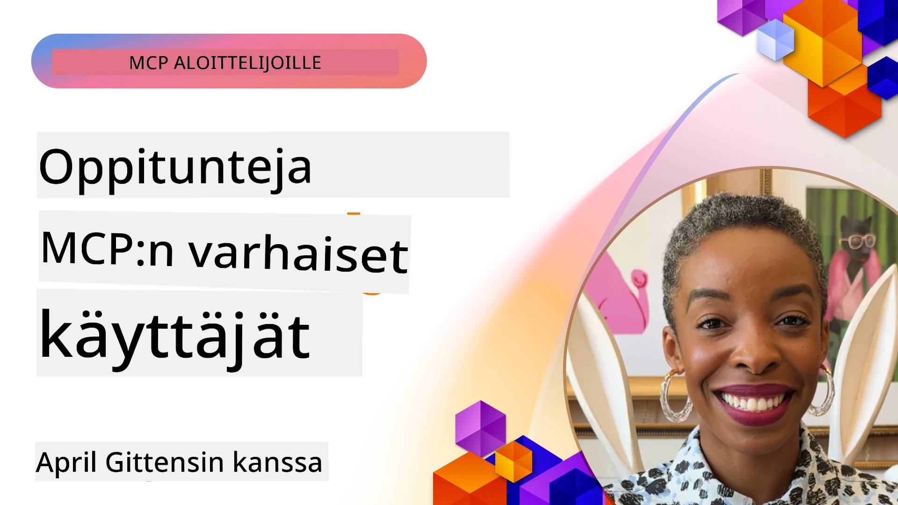

# 🌟 Oppitunnit varhaisilta käyttäjiltä

[](https://youtu.be/jds7dSmNptE)

_(Klikkaa yllä olevaa kuvaa katsoaksesi tämän oppitunnin videon)_

## 🎯 Mitä tämä moduuli kattaa

Tämä moduuli tutkii, miten todelliset organisaatiot ja kehittäjät hyödyntävät Model Context Protocolia (MCP) ratkaistakseen todellisia haasteita ja edistääkseen innovaatiota. Yksityiskohtaisten tapaustutkimusten, käytännön projektien ja esimerkkien kautta opit, miten MCP mahdollistaa turvallisen ja skaalautuvan tekoälyn integraation, joka yhdistää kielimallit, työkalut ja yritystiedot.

### 📚 Katso MCP käytännössä

Haluatko nähdä näiden periaatteiden soveltamisen tuotantovalmiisiin työkaluihin? Tutustu [**10 Microsoftin MCP-palvelimeen, jotka muuttavat kehittäjien tuottavuutta**](microsoft-mcp-servers.md), jossa esitellään aitoja Microsoft MCP -palvelimia, joita voit käyttää jo tänään.

## Yleiskuva

Tässä oppitunnissa käsitellään, miten varhaiset käyttäjät ovat hyödyntäneet Model Context Protocolia (MCP) ratkaistakseen todellisen maailman haasteita ja edistääkseen innovaatiota eri toimialoilla. Yksityiskohtaisten tapaustutkimusten ja käytännön projektien avulla näet, miten MCP mahdollistaa standardoidun, turvallisen ja skaalautuvan tekoälyintegraation—yhdistäen suuria kielimalleja, työkaluja ja yritystietoja yhtenäisessä kehikossa. Saat käytännön kokemusta MCP-pohjaisten ratkaisujen suunnittelusta ja rakentamisesta, opit todistetuista toteutusmalleista ja löydät parhaita käytäntöjä MCP:n käyttöönottoon tuotantoympäristöissä. Oppitunti nostaa esiin myös nousevia trendejä, tulevia suuntauksia ja avoimen lähdekoodin resursseja, joiden avulla pysyt MCP-teknologian ja sen kehittyvän ekosysteemin kärjessä.

## Oppimistavoitteet

- Analysoida todellisen maailman MCP-toteutuksia eri toimialoilla
- Suunnitella ja rakentaa kokonaisia MCP-pohjaisia sovelluksia
- Tutkia MCP-teknologian nousevia trendejä ja tulevia suuntia
- Soveltaa parhaita käytäntöjä todellisissa kehitysskenaarioissa

## Todelliset MCP-toteutukset

### Tapaustutkimus 1: Yrityksen asiakastuen automaatio

Monikansallinen yritys toteutti MCP-pohjaisen ratkaisun standardoidakseen tekoälyvuorovaikutukset asiakastukijärjestelmissään. Tämä mahdollisti heille:

- Yhdenmukaisen käyttöliittymän luomisen useille LLM-palveluntarjoajille
- Johdonmukaisen kehotteiden hallinnan osastojen välillä
- Vahvojen tietoturva- ja noudattamiskontrollien implementoinnin
- Helpon vaihdon eri tekoälymallien välillä tarpeiden mukaisesti

**Tekninen toteutus:**

```python
# Python MCP -palvelimen toteutus asiakastukeen
import logging
import asyncio
from modelcontextprotocol import create_server, ServerConfig
from modelcontextprotocol.server import MCPServer
from modelcontextprotocol.transports import create_http_transport
from modelcontextprotocol.resources import ResourceDefinition
from modelcontextprotocol.prompts import PromptDefinition
from modelcontextprotocol.tool import ToolDefinition

# Määritä lokitus
logging.basicConfig(level=logging.INFO)

async def main():
    # Luo palvelimen kokoonpano
    config = ServerConfig(
        name="Enterprise Customer Support Server",
        version="1.0.0",
        description="MCP server for handling customer support inquiries"
    )
    
    # Alusta MCP-palvelin
    server = create_server(config)
    
    # Rekisteröi tietopohjan resurssit
    server.resources.register(
        ResourceDefinition(
            name="customer_kb",
            description="Customer knowledge base documentation"
        ),
        lambda params: get_customer_documentation(params)
    )
    
    # Rekisteröi kehotemallit
    server.prompts.register(
        PromptDefinition(
            name="support_template",
            description="Templates for customer support responses"
        ),
        lambda params: get_support_templates(params)
    )
    
    # Rekisteröi tukityökalut
    server.tools.register(
        ToolDefinition(
            name="ticketing",
            description="Create and update support tickets"
        ),
        handle_ticketing_operations
    )
    
    # Käynnistä palvelin HTTP-siirrolla
    transport = create_http_transport(port=8080)
    await server.run(transport)

if __name__ == "__main__":
    asyncio.run(main())
```
  
**Tulokset:** Mallikustannukset vähenivät 30 %, vastausten yhdenmukaisuus parani 45 % ja noudattamisprosessit vahvistuivat globaalissa toiminnassa.

### Tapaustutkimus 2: Terveydenhuollon diagnoosiassistentti

Terveydenhuollon palveluntarjoaja kehitti MCP-infrastruktuurin integroidakseen useita erikoistuneita lääketieteellisiä tekoälymalleja varmistaen samalla, että arkaluontoinen potilastieto pysyy suojattuna:

- Saumaton vaihto yleislääketieteen ja erikoismallien välillä
- Tiukat tietosuojakontrollit ja auditointijäljet
- Integraatio olemassa olevaan sähköiseen potilastietojärjestelmään (EHR)
- Johdonmukainen kehotteiden suunnittelu lääketieteelliseen terminologiaan

**Tekninen toteutus:**

```csharp
// C# MCP host application implementation in healthcare application
using Microsoft.Extensions.DependencyInjection;
using ModelContextProtocol.SDK.Client;
using ModelContextProtocol.SDK.Security;
using ModelContextProtocol.SDK.Resources;

public class DiagnosticAssistant
{
    private readonly MCPHostClient _mcpClient;
    private readonly PatientContext _patientContext;
    
    public DiagnosticAssistant(PatientContext patientContext)
    {
        _patientContext = patientContext;
        
        // Configure MCP client with healthcare-specific settings
        var clientOptions = new ClientOptions
        {
            Name = "Healthcare Diagnostic Assistant",
            Version = "1.0.0",
            Security = new SecurityOptions
            {
                Encryption = EncryptionLevel.Medical,
                AuditEnabled = true
            }
        };
        
        _mcpClient = new MCPHostClientBuilder()
            .WithOptions(clientOptions)
            .WithTransport(new HttpTransport("https://healthcare-mcp.example.org"))
            .WithAuthentication(new HIPAACompliantAuthProvider())
            .Build();
    }
    
    public async Task<DiagnosticSuggestion> GetDiagnosticAssistance(
        string symptoms, string patientHistory)
    {
        // Create request with appropriate resources and tool access
        var resourceRequest = new ResourceRequest
        {
            Name = "patient_records",
            Parameters = new Dictionary<string, object>
            {
                ["patientId"] = _patientContext.PatientId,
                ["requestingProvider"] = _patientContext.ProviderId
            }
        };
        
        // Request diagnostic assistance using appropriate prompt
        var response = await _mcpClient.SendPromptRequestAsync(
            promptName: "diagnostic_assistance",
            parameters: new Dictionary<string, object>
            {
                ["symptoms"] = symptoms,
                patientHistory = patientHistory,
                relevantGuidelines = _patientContext.GetRelevantGuidelines()
            });
            
        return DiagnosticSuggestion.FromMCPResponse(response);
    }
}
```
  
**Tulokset:** Parantuneet diagnoosiehdotukset lääkäreille, täysi HIPAA-yhteensopivuus sekä merkittävä kontekstinvaihdon vähentäminen järjestelmien välillä.

### Tapaustutkimus 3: Rahoituspalveluiden riskianalyysi

Rahoituslaitos otti MCP:n käyttöön standardoidakseen riskianalyysiprosessinsa eri osastojen kesken:

- Luotiin yhtenäinen käyttöliittymä luottoriskille, petosten havainnolle ja sijoitusriskimalleille
- Toteutettiin tiukat käyttöoikeuksien hallintamekanismit ja malliversiointi
- Varmistettiin kaikkien tekoälysuositusten auditointi
- Ylläpidettiin johdonmukaista tiedon muotoilua eri järjestelmissä

**Tekninen toteutus:**

```java
// Java MCP -palvelin taloudelliseen riskinarviointiin
import org.mcp.server.*;
import org.mcp.security.*;

public class FinancialRiskMCPServer {
    public static void main(String[] args) {
        // Luo MCP -palvelin taloudellisten vaatimustenmukaisuustoimintojen kanssa
        MCPServer server = new MCPServerBuilder()
            .withModelProviders(
                new ModelProvider("risk-assessment-primary", new AzureOpenAIProvider()),
                new ModelProvider("risk-assessment-audit", new LocalLlamaProvider())
            )
            .withPromptTemplateDirectory("./compliance/templates")
            .withAccessControls(new SOCCompliantAccessControl())
            .withDataEncryption(EncryptionStandard.FINANCIAL_GRADE)
            .withVersionControl(true)
            .withAuditLogging(new DatabaseAuditLogger())
            .build();
            
        server.addRequestValidator(new FinancialDataValidator());
        server.addResponseFilter(new PII_RedactionFilter());
        
        server.start(9000);
        
        System.out.println("Financial Risk MCP Server running on port 9000");
    }
}
```
  
**Tulokset:** Parantunut säädösten noudattaminen, 40 % nopeammat mallin käyttöönottojaksot ja parantunut riskinarvioinnin yhdenmukaisuus osastojen välillä.

### Tapaustutkimus 4: Microsoft Playwright MCP -palvelin selainautomaatiolle

Microsoft kehitti [Playwright MCP -palvelimen](https://github.com/microsoft/playwright-mcp) mahdollistamaan turvallisen, standardoidun selainautomaation Model Context Protocolin avulla. Tämä tuotantovalmiiksi suunniteltu palvelin mahdollistaa tekoälyagenttien ja LLM:ien vuorovaikutuksen verkkoselainten kanssa hallitusti, auditoitavasti ja laajennettavasti—käyttötapauksina muun muassa automatisoitu verkkotestaus, datan poiminta ja päätepisteestä päätepisteeseen -työnkulut.

> **🎯 Tuotantovalmiina Työkalu**
> 
> Tämä tapaustutkimus esittelee aidon MCP-palvelimen, jota voit käyttää jo tänään! Lue lisää Playwright MCP -palvelimesta ja muista 9 tuotantovalmiista Microsoft MCP -palvelimesta oppaassamme [**Microsoft MCP Servers Guide**](microsoft-mcp-servers.md#8--playwright-mcp-server).

**Keskeiset ominaisuudet:**
- Tarjoaa selainautomaatiotoiminnot (navigointi, lomakkeiden täyttö, näytönkaappaus jne.) MCP-työkaluina
- Toteuttaa tiukat käyttöoikeusvalvonnat ja hiekkalaatikkoympäristön estämään luvattomat toimet
- Tarjoaa yksityiskohtaiset auditointilokit kaikista selaimen vuorovaikutuksista
- Tukee integraatiota Azure OpenAI:n ja muiden LLM-palveluntarjoajien kanssa agenttien ohjaamaa automaatiota varten
- Voimaa GitHub Copilotin Koodausagentin verkkoselailutoiminnot

**Tekninen toteutus:**

```typescript
// TypeScript: Rekisteröidään Playwright-selaimen automaatiotyökalut MCP-palvelimeen
import { createServer, ToolDefinition } from 'modelcontextprotocol';
import { launch } from 'playwright';

const server = createServer({
  name: 'Playwright MCP Server',
  version: '1.0.0',
  description: 'MCP server for browser automation using Playwright'
});

// Rekisteröi työkalu URL-osoitteeseen navigointiin ja kuvakaappauksen ottamiseen
server.tools.register(
  new ToolDefinition({
    name: 'navigate_and_screenshot',
    description: 'Navigate to a URL and capture a screenshot',
    parameters: {
      url: { type: 'string', description: 'The URL to visit' }
    }
  }),
  async ({ url }) => {
    const browser = await launch();
    const page = await browser.newPage();
    await page.goto(url);
    const screenshot = await page.screenshot();
    await browser.close();
    return { screenshot };
  }
);

// Käynnistä MCP-palvelin
server.listen(8080);
```
  
**Tulokset:**

- Mahdollisti turvallisen, ohjelmoitavan selainautomaation tekoälyagenteille ja LLM:ille  
- Vähensi manuaalisen testauksen työtä ja paransi web-sovellusten testikattavuutta  
- Tarjosi uudelleenkäytettävän, laajennettavan kehyksen selainpohjaisten työkalujen integrointiin yritysympäristöissä  
- Voimaa GitHub Copilotin verkkoselaustoiminnot

**Viitteet:**

- [Playwright MCP Server GitHub -repositorio](https://github.com/microsoft/playwright-mcp)  
- [Microsoftin tekoäly- ja automaatioratkaisut](https://azure.microsoft.com/en-us/products/ai-services/)

### Tapaustutkimus 5: Azure MCP – Yritystason Model Context Protocol -palveluna

Azure MCP Server ([https://aka.ms/azmcp](https://aka.ms/azmcp)) on Microsoftin hallinnoima, yritystason Model Context Protocol -toteutus, suunniteltu tarjoamaan skaalautuvia, turvallisia ja noudattamiskelpoisia MCP-palvelimen ominaisuuksia pilvipalveluna. Azure MCP mahdollistaa organisaatioiden nopean MCP-palvelimien käyttöönoton, hallinnan ja integroinnin Azure AI:n, datan ja tietoturvapalveluiden kanssa vähentäen operatiivista kuormaa ja kiihdyttäen tekoälyn käyttöönottoa.

> **🎯 Tuotantovalmiina Työkalu**
> 
> Tämä on aito MCP-palvelin, jota voit käyttää jo tänään! Lue lisää Azure AI Foundryn MCP-palvelimesta oppaassamme [**Microsoft MCP Servers Guide**](microsoft-mcp-servers.md).

- Täysin hallinnoitu MCP-palvelininfrastruktuuri sisäänrakennetulla skaalaamisella, valvonnalla ja tietoturvalla
- Luontainen integraatio Azure OpenAI:n, Azure AI Searchin ja muiden Azuren palveluiden kanssa
- Yritystason tunnistus ja valtuutus Microsoft Entra ID:n kautta
- Tuki räätälöidyille työkaluille, kehottemalleille ja resurssien liittimille
- Tietoturvan ja säädösten vaatimustenmukaisuus yrityksissä

**Tekninen toteutus:**

```yaml
# Example: Azure MCP server deployment configuration (YAML)
apiVersion: mcp.microsoft.com/v1
kind: McpServer
metadata:
  name: enterprise-mcp-server
spec:
  modelProviders:
    - name: azure-openai
      type: AzureOpenAI
      endpoint: https://<your-openai-resource>.openai.azure.com/
      apiKeySecret: <your-azure-keyvault-secret>
  tools:
    - name: document_search
      type: AzureAISearch
      endpoint: https://<your-search-resource>.search.windows.net/
      apiKeySecret: <your-azure-keyvault-secret>
  authentication:
    type: EntraID
    tenantId: <your-tenant-id>
  monitoring:
    enabled: true
    logAnalyticsWorkspace: <your-log-analytics-id>
```
  
**Tulokset:**  
- Lyhensi yrityksen tekoälyprojektien arvoon pääsyn aikaa tarjoamalla käyttövalmiin, vaatimustenmukaisen MCP-palvelin-alustan  
- Yksinkertaisti LLM:ien, työkalujen ja yritystietolähteiden integrointia  
- Paransi turvallisuutta, havainnoitavuutta ja operatiivista tehokkuutta MCP-kuormituksille  
- Paransi koodin laatua Azure SDK:n parhaiden käytäntöjen ja nykyisten tunnistusmallien avulla

**Viitteet:**  
- [Azure MCP Dokumentaatio](https://aka.ms/azmcp)  
- [Azure MCP Server GitHub -repositorio](https://github.com/Azure/azure-mcp)  
- [Azure AI -palvelut](https://azure.microsoft.com/en-us/products/ai-services/)  
- [Microsoft MCP Center](https://mcp.azure.com)

## Tapaustutkimus 6: NLWeb  
MCP (Model Context Protocol) on nouseva protokolla, jonka avulla chatboteilla ja tekoälyavustajilla on mahdollista kommunikoida työkalujen kanssa. Jokainen NLWeb-instanssi on myös MCP-palvelin, joka tukee yhtä ydintoimintoa, ask-metodia, jolla voi esittää sivustolle luonnolliskielisiä kysymyksiä. Vastauksessa hyödynnetään schema.org:ia, laajasti käytettyä sanastoa verkkotietojen kuvaamiseen. Vapaasti sanottuna MCP on NLWeb yhtä kuin Http on HTML:lle. NLWeb yhdistää protokollat, Schema.org-muodot ja esimerkkikoodin auttaakseen sivustoja luomaan nämä päätepisteet nopeasti hyödyttäen sekä ihmisiä keskustelupohjaisten käyttöliittymien kautta että koneita luonnollisissa agenttien välisissä vuorovaikutuksissa.

NLWeb koostuu kahdesta erillisestä osasta.  
- Protokolla, joka on hyvin yksinkertainen aluksi, sivuston kanssa luonnollisella kielellä kommunikointiin ja formaatti, joka hyödyntää jsonia ja schema.orgia vastauksen muotoilussa. Katso REST API:n dokumentaatio saadaksesi lisätietoja.  
- Yksinkertainen toteutus kohdasta (1), joka hyödyntää olemassa olevaa merkintää, sivustoille, jotka voidaan abstrahoida esineiden listaksi (tuotteet, reseptit, nähtävyydet, arvostelut jne.). Yhdessä käyttöliittymäkomponenttien kanssa sivustot voivat helposti tarjota keskustelupohjaisia käyttöliittymiä sisältöönsä. Katso dokumentaatio "Life of a chat query" saadaksesi lisätietoja tämän toiminnasta.

**Viitteet:**  
- [Azure MCP Dokumentaatio](https://aka.ms/azmcp)  
- [NLWeb](https://github.com/microsoft/NlWeb)

### Tapaustutkimus 7: Azure AI Foundry MCP Server – Yritysten tekoälyagenttien integrointi

Azure AI Foundry MCP -palvelimet osoittavat, miten MCP:tä voidaan käyttää tekoälyagenttien ja työnkulkujen orkestrointiin ja hallintaan yritysympäristöissä. Integroimalla MCP Azure AI Foundryn kanssa organisaatiot voivat standardoida agenttien vuorovaikutuksia, hyödyntää Foundryn työnkulun hallintaa ja varmistaa turvalliset, skaalautuvat käyttöönotot.

> **🎯 Tuotantovalmiina Työkalu**
> 
> Tämä on aito MCP-palvelin, jota voit käyttää jo tänään! Lue lisää Azure AI Foundry MCP -palvelimesta oppaassamme [**Microsoft MCP Servers Guide**](microsoft-mcp-servers.md#9--azure-ai-foundry-mcp-server).

**Keskeiset ominaisuudet:**
- Laaja pääsy Azuren tekoälyekosysteemiin, mukaan lukien mallikatalogit ja käyttöönoton hallinta
- Tiedon indeksointi Azure AI Searchin avulla RAG-sovelluksiin
- Arviointityökalut tekoälymallien suorituskyvyn ja laadun varmistamiseen
- Integraatio Azure AI Foundryn katalogin ja labratorioiden uusimpiin tutkimusmalleihin
- Agenttien hallinta- ja arviointiominaisuudet tuotantokäyttöön

**Tulokset:**
- Nopea prototypointi ja kestävä seuranta tekoälyagenttien työnkuluissa
- Saumaton integraatio Azure AI -palvelujen kanssa edistyneissä skenaarioissa
- Yhtenäinen käyttöliittymä agenttiputkien rakentamiseen, käyttöönottoon ja valvontaan
- Parantunut turvallisuus, säädösten noudattaminen ja operatiivinen tehokkuus yrityksissä
- Kiihdytetty tekoälyn käyttöönotto hallitusti monimutkaisten agenttikäyttöisten prosessien ohessa

**Viitteet:**
- [Azure AI Foundry MCP Server GitHub -repositorio](https://github.com/azure-ai-foundry/mcp-foundry)  
- [Azure AI Agenttien integrointi MCP:n kanssa (Microsoft Foundry Blog)](https://devblogs.microsoft.com/foundry/integrating-azure-ai-agents-mcp/)

### Tapaustutkimus 8: Foundry MCP Playground – Kokeilu ja prototypointi

Foundry MCP Playground tarjoaa käyttövalmiin ympäristön MCP-palvelinten ja Azure AI Foundryn integraatioiden kokeiluun. Kehittäjät voivat nopeasti luoda prototyyppejä, testata ja arvioida tekoälymallien ja agenttityönkulkujen toimintoja hyödyntämällä resursseja Azure AI Foundryn katalogista ja laboratorioista. Leikkikenttä helpottaa käyttöönottoa, tarjoaa esimerkkiprojekteja ja tukee yhteisöllistä kehitystä, tehden parhaiden käytäntöjen ja uusien skenaarioiden tutkimisesta vaivattomampaa vähäisellä hallinnollisella vaivalla. Se on erityisen hyödyllinen tiimeille, jotka haluavat validoida ideoita, jakaa kokeiluja ja nopeuttaa oppimista ilman monimutkaista infrastruktuuria. Alhaisemman kynnyksen ansiosta leikkikenttä edistää innovaatioita ja yhteisön panoksia MCP- ja Azure AI Foundry -ekosysteemissä.

**Viitteet:**

- [Foundry MCP Playground GitHub -repositorio](https://github.com/azure-ai-foundry/foundry-mcp-playground)

### Tapaustutkimus 9: Microsoft Learn Docs MCP Server – Tekoälypohjainen dokumentaatiojärjestelmä

Microsoft Learn Docs MCP Server on pilvipalveluna toimiva palvelin, joka tarjoaa tekoälyavustajille reaaliaikaisen pääsyn viralliseen Microsoft-dokumentaatioon Model Context Protocolin kautta. Tämä tuotantovalmiiksi suunniteltu palvelin yhdistää laajan Microsoft Learn -ekosysteemin ja mahdollistaa semanttisen haun kaikissa virallisissa Microsoft-lähteissä.

> **🎯 Tuotantovalmiina Työkalu**
> 
> Tämä on aito MCP-palvelin, jota voit käyttää jo tänään! Lue lisää Microsoft Learn Docs MCP Serveristä oppaassamme [**Microsoft MCP Servers Guide**](microsoft-mcp-servers.md#1--microsoft-learn-docs-mcp-server).

**Keskeiset ominaisuudet:**
- Reaaliaikainen pääsy viralliseen Microsoftin dokumentaatioon, Azure-dokumentaatioon ja Microsoft 365 -dokumentaatioon
- Edistyneet semanttisen haun ominaisuudet, jotka ymmärtävät kontekstin ja tarkoituksen
- Aina ajan tasalla oleva tieto Microsoft Learnin sisällön julkaisemisen myötä
- Laaja kattavuus Microsoft Learnista, Azure-dokumentaatiosta ja Microsoft 365 -lähteistä
- Palauttaa jopa 10 korkealaatuista sisältöosaa artikkelien otsikoiden ja URL-osoitteiden kera

**Miksi tämä on tärkeää:**
- Ratkaisee "vanhentunut tekoälytieto" -ongelman Microsoft-teknologioissa
- Varmistaa, että tekoälyavustajilla on pääsy uusimpiin .NET-, C#-, Azure- ja Microsoft 365 -ominaisuuksiin
- Tarjoaa auktoritatiivisen, ensikäden tiedon tarkkaan koodin generointiin
- Oleellinen kehittäjille, jotka työskentelevät nopeasti kehittyvien Microsoft-teknologioiden kanssa

**Tulokset:**
- Merkittävästi parantunut tekoälyn generoiman koodin tarkkuus Microsoft-teknologioissa
- Vähemmän aikaa käytetty ajantasaisen dokumentaation ja parhaiden käytäntöjen etsimiseen
- Parantunut kehittäjien tuottavuus kontekstia ymmärtävän dokumentaation haun ansiosta
- Saumaton integraatio kehitystyönkulkuun ilman, että tarvitsee poistua IDE:stä

**Viitteet:**
- [Microsoft Learn Docs MCP Server GitHub -repositorio](https://github.com/MicrosoftDocs/mcp)  
- [Microsoft Learn Dokumentaatio](https://learn.microsoft.com/)

## Käytännön projektit

### Projekti 1: Rakenna monitoimittajainen MCP-palvelin

**Tavoite:** Luo MCP-palvelin, joka osaa ohjata pyynnöt useille tekoälymallin tarjoajille määriteltyjen kriteerien perusteella.

**Vaatimukset:**

- Tue vähintään kolmea eri mallin tarjoajaa (esim. OpenAI, Anthropic, paikalliset mallit)  
- Toteuta reititysmekanismi pyynnön metatietojen perusteella  
- Luo konfigurointijärjestelmä palveluntarjoajien tunnistetietojen hallintaan  
- Lisää välimuisti suorituskyvyn ja kustannusten optimointiin  
- Rakenna yksinkertainen hallintapaneeli käytön seurantaan

**Toteutusvaiheet:**

1. Perusta MCP-palvelininfrastruktuuri  
2. Toteuta sovittimet jokaiselle tekoälymallipalvelulle  
3. Luo reitityslogiikka pyynnön attribuuttien perusteella  
4. Lisää välimuistimekanismit useille pyynnöille  
5. Kehitä seurantapaneeli  
6. Testaa erilaisilla pyyntökuvioilla

**Teknologiat:** Valitse Python (.NET/Java/Python mieltymyksesi mukaan), Redis välimuistia varten ja yksinkertainen web-kehys hallintapaneelille.

### Projekti 2: Yrityksen kehotteiden hallintajärjestelmä
**Tavoite:** Kehittää MCP-pohjainen järjestelmä prompt-mallien hallintaan, versiointiin ja käyttöönottoon organisaation laajuisesti.

**Vaatimukset:**

- Luo keskitetty arkisto prompt-malleille
- Toteuta versiointi- ja hyväksyntätyönkulut
- Rakenna mallien testausominaisuudet näytesyötteillä
- Kehitä roolipohjainen käyttöoikeuksien hallinta
- Luo API mallien hakemiseen ja käyttöönottoon

**Toteutusvaiheet:**

1. Suunnittele tietokantakaavio mallien tallennusta varten
2. Luo ydintoiminnot mallien CRUD-toimintoja varten
3. Toteuta versiointijärjestelmä
4. Rakenna hyväksyntätyönkulku
5. Kehitä testauskehys
6. Luo yksinkertainen verkkokäyttöliittymä hallintaa varten
7. Integroi MCP-palvelimen kanssa

**Teknologiat:** Valitsemasi backend-framework, SQL- tai NoSQL-tietokanta ja frontend-framework hallintaliittymälle.

### Projekti 3: MCP-pohjainen sisällöntuotantoalusta

**Tavoite:** Rakentaa sisällöntuotantoalusta, joka hyödyntää MCP:tä tarjoten yhdenmukaisia tuloksia eri sisältötyypeille.

**Vaatimukset:**

- Tuki useille sisältöformaatioille (blogikirjoitukset, sosiaalinen media, markkinointisisältö)
- Toteuta mallipohjainen tuotanto mukautusmahdollisuuksilla
- Luo sisällön arviointi- ja palautteenantojärjestelmä
- Seuraa sisällön suorituskykymittareita
- Tue sisällön versiointia ja iterointia

**Toteutusvaiheet:**

1. Perusta MCP-asiakasinfrastruktuuri
2. Luo malleja eri sisältötyypeille
3. Rakenna sisällöntuotantoputki
4. Toteuta arviointijärjestelmä
5. Kehitä mittareiden seuranta
6. Luo käyttöliittymä mallien hallintaan ja sisällöntuotantoon

**Teknologiat:** Valitsemasi ohjelmointikieli, web-framework ja tietokantajärjestelmä.

## MCP-teknologian tulevaisuuden suuntaukset

### Nousevat trendit

1. **Monimodaalinen MCP**
   - MCP:n laajentaminen yhteisten rajapintojen tarjoamiseksi kuviin, ääniin ja videoihin perustuville malleille
   - Poikkimodaalisen päättelyn kykyjen kehittäminen
   - Standardoidut prompt-muodot eri modaliteeteille

2. **Federatiivinen MCP-infrastruktuuri**
   - Hajautetut MCP-verkostot resurssien jakamiseksi organisaatioiden välillä
   - Standardoidut protokollat mallien turvalliseen jakamiseen
   - Yksityisyyttä suojaavat laskentatekniikat

3. **MCP-markkinapaikat**
   - Ekosysteemit MCP-mallipohjien ja laajennusten jakamiseen ja kaupallistamiseen
   - Laadunvarmistus- ja sertifiointiprosessit
   - Integraatiot mallimarkkinapaikkoihin

4. **MCP osa- ja reunalaskennassa**
   - MCP-standardien mukauttaminen resurssirajoitettuihin reunalaitteisiin
   - Optimoidut protokollat pienikaistaisiin ympäristöihin
   - Erikoistuneet MCP-toteutukset IoT-ekosysteemeihin

5. **Sääntelykehykset**
   - MCP-laajennusten kehittäminen sääntelyn noudattamiseen
   - Standardoidut auditointiketjut ja selitettävyyden rajapinnat
   - Integraatiot kasvaviin tekoälyn hallintakehyksiin

### Microsoftin MCP-ratkaisut

Microsoft ja Azure ovat kehittäneet useita avoimen lähdekoodin arkistoja MCP:n eri käyttötapojen tukemiseksi:

#### Microsoft Organization

1. [playwright-mcp](https://github.com/microsoft/playwright-mcp) - Playwright MCP -palvelin selaimen automaatioon ja testaukseen
2. [files-mcp-server](https://github.com/microsoft/files-mcp-server) - OneDrive MCP -palvelintoteutus paikallista testausta ja yhteisön panosta varten
3. [NLWeb](https://github.com/microsoft/NlWeb) - NLWeb on avoimien protokollien ja työkaluvalikoiman kokoelma, jonka päätavoitteena on luoda perusta AI-verkolle

#### Azure-Samples Organization

1. [mcp](https://github.com/Azure-Samples/mcp) - Linkkejä esimerkkeihin, työkaluihin ja resursseihin MCP-palvelimien rakentamiseen ja integrointiin Azurella monilla kielillä
2. [mcp-auth-servers](https://github.com/Azure-Samples/mcp-auth-servers) - Esimerkkipalvelimia, jotka demonstroivat autentikointia nykyisen Model Context Protocol -määritelmän mukaisesti
3. [remote-mcp-functions](https://github.com/Azure-Samples/remote-mcp-functions) - Etä-MCP-palvelintoteutusten aloitussivu Azure Functionsissa kielikohtaisilla repositorioilla
4. [remote-mcp-functions-python](https://github.com/Azure-Samples/remote-mcp-functions-python) - Pikakäynnistysmalli räätälöityjen etä-MCP-palvelimien rakentamiseen ja käyttöönottoon Pythonilla Azure Functionsissa
5. [remote-mcp-functions-dotnet](https://github.com/Azure-Samples/remote-mcp-functions-dotnet) - Pikakäynnistysmalli räätälöityjen etä-MCP-palvelimien rakentamiseen ja käyttöönottoon .NET/C#-tekniikalla Azure Functionsissa
6. [remote-mcp-functions-typescript](https://github.com/Azure-Samples/remote-mcp-functions-typescript) - Pikakäynnistysmalli räätälöityjen etä-MCP-palvelimien rakentamiseen ja käyttöönottoon TypeScriptilla Azure Functionsissa
7. [remote-mcp-apim-functions-python](https://github.com/Azure-Samples/remote-mcp-apim-functions-python) - Azure API Management tekoälyporttina etä-MCP-palvelimiin Pythonilla
8. [AI-Gateway](https://github.com/Azure-Samples/AI-Gateway) - APIM ❤️ AI-kokeiluja, mukaan lukien MCP-ominaisuudet, integraatio Azure OpenAI:hin ja AI Foundryyn

Nämä arkistot tarjoavat erilaisia toteutuksia, malleja ja resursseja Model Context Protocolin eri ohjelmointikielille ja Azuren palveluille. Ne kattavat perustason palvelintoteutuksista autentikointiin, pilvikäyttöönottoon ja yritysintegrointiin.

#### MCP-resurssihakemisto

Virallisessa Microsoft MCP -arkistossa sijaitseva [MCP Resources directory](https://github.com/microsoft/mcp/tree/main/Resources) tarjoaa kuratoidun kokoelman esimerkkiresursseja, prompt-malleja ja työkalumääritelmiä MCP-palvelimien käyttöön. Tämä hakemisto auttaa kehittäjiä alkuun MCP:n kanssa tarjoamalla uudelleenkäytettäviä rakennuspalikoita ja parhaiden käytäntöjen esimerkkejä:

- **Prompt-mallit:** Valmiita prompt-malleja yleisiin tekoälytehtäviin ja tilanteisiin, jotka voi sopeuttaa omiin MCP-palvelintoteutuksiin.
- **Työkalumääritelmät:** Esimerkkityökaluskeemat ja metatiedot työkalujen yhdenmukaistamiseksi ja kutsumiseksi eri MCP-palvelimilla.
- **Resurssinäytteet:** Esimerkkimääritelmiä tietolähteiden, rajapintojen ja ulkoisten palveluiden yhdistämiseen MCP-kehyksessä.
- **Referenssitoteutukset:** Käytännön esimerkkejä siitä, miten jäsentää ja järjestää resursseja, promptteja ja työkaluja aidon maailman MCP-projekteissa.

Nämä resurssit nopeuttavat kehitystä, edistävät standardisointia ja tukevat parhaiden käytäntöjen noudattamista MCP-pohjaisten ratkaisujen rakentamisessa ja käyttöönotossa.

#### MCP Resources Directory

- [MCP Resources (Sample Prompts, Tools, and Resource Definitions)](https://github.com/microsoft/mcp/tree/main/Resources)

### Tutkimusmahdollisuudet

- Tehokkaat promptin optimointimenetelmät MCP-kehyksissä
- Turvallisuusmallit monivuokraajaympäristöihin MCP:ssa
- Suorituskyvyn vertailu eri MCP-toteutusten kesken
- Formaalien varmennusmenetelmien tutkimus MCP-palvelimille

## Yhteenveto

Model Context Protocol (MCP) muovaa nopeasti tulevaisuutta kohti standardoitua, turvallista ja yhteentoimivaa tekoälyintegraatiota eri toimialoilla. Tämän oppitunnin tapaustutkimusten ja käytännön projektien avulla olet nähnyt, kuinka varhaiset omaksujat, kuten Microsoft ja Azure, hyödyntävät MCP:tä ratkaistakseen todellisia haasteita, kiihdyttääkseen tekoälyn käyttöönottoa sekä varmistaakseen vaatimustenmukaisuuden, turvallisuuden ja skaalautuvuuden. MCP:n modulaarinen lähestymistapa mahdollistaa organisaatioiden yhdistää laajat kielimallit, työkalut ja yritystiedot yhtenäiseksi ja auditointikelpoiseksi kehykseksi. MCP:n kehittyessä aktiivinen mukanaolo yhteisössä, avoimen lähdekoodin resurssien tutkiminen ja parhaiden käytäntöjen soveltaminen ovat avainasemassa vahvojen ja tulevaisuuden tekoälyratkaisujen rakentamisessa.

## Lisäresurssit

- [MCP Foundry GitHub -arkisto](https://github.com/azure-ai-foundry/mcp-foundry)
- [Foundry MCP Playground](https://github.com/azure-ai-foundry/foundry-mcp-playground)
- [Azure AI Agenttien integrointi MCP:n kanssa (Microsoft Foundry Blog)](https://devblogs.microsoft.com/foundry/integrating-azure-ai-agents-mcp/)
- [MCP GitHub -arkisto (Microsoft)](https://github.com/microsoft/mcp)
- [MCP-resurssihakemisto (Esimerkkipromptit, työkalut ja resurssimääritelmät)](https://github.com/microsoft/mcp/tree/main/Resources)
- [MCP-yhteisö ja dokumentaatio](https://modelcontextprotocol.io/introduction)
- [MCP-spesifikaatio (2025-11-25)](https://spec.modelcontextprotocol.io/specification/2025-11-25/)
- [Azure MCP -dokumentaatio](https://aka.ms/azmcp)
- [OWASP MCP Top 10](https://microsoft.github.io/mcp-azure-security-guide/mcp/) - Turvallisuuden parhaat käytännöt
- [Playwright MCP Server - GitHub](https://github.com/microsoft/playwright-mcp)
- [Files MCP Server (OneDrive)](https://github.com/microsoft/files-mcp-server)
- [Azure-Samples MCP](https://github.com/Azure-Samples/mcp)
- [MCP Auth Servers (Azure-Samples)](https://github.com/Azure-Samples/mcp-auth-servers)
- [Remote MCP Functions (Azure-Samples)](https://github.com/Azure-Samples/remote-mcp-functions)
- [Remote MCP Functions Python (Azure-Samples)](https://github.com/Azure-Samples/remote-mcp-functions-python)
- [Remote MCP Functions .NET (Azure-Samples)](https://github.com/Azure-Samples/remote-mcp-functions-dotnet)
- [Remote MCP Functions TypeScript (Azure-Samples)](https://github.com/Azure-Samples/remote-mcp-functions-typescript)
- [Remote MCP APIM Functions Python (Azure-Samples)](https://github.com/Azure-Samples/remote-mcp-apim-functions-python)
- [AI-Gateway (Azure-Samples)](https://github.com/Azure-Samples/AI-Gateway)
- [Microsoft AI- ja automaatioratkaisut](https://azure.microsoft.com/en-us/products/ai-services/)

## Harjoitukset

1. Analysoi jokin tapauksista ja ehdota vaihtoehtoinen toteutustapa.
2. Valitse yksi projekti-ideoista ja laadi yksityiskohtainen tekninen määrittely.
3. Tutki toimiala, jota ei ole käsitelty tapaustutkimuksissa, ja hahmottele, miten MCP voisi ratkaista sen erityishaasteet.
4. Tutki yhtä tulevaisuudensuuntaa ja luo konsepti uudelle MCP-laajennukselle sen tukemiseksi.

## Mitä seuraavaksi

Tutustu lisää: [Microsoft MCP Servers](./microsoft-mcp-servers.md)

Jatka: [Module 8: Best Practices](../08-BestPractices/README.md)

---

<!-- CO-OP TRANSLATOR DISCLAIMER START -->
**Vastuuvapauslauseke**:
Tämä asiakirja on käännetty käyttämällä tekoälypohjaista käännöspalvelua [Co-op Translator](https://github.com/Azure/co-op-translator). Pyrimme tarkkuuteen, mutta otathan huomioon, että automaattiset käännökset voivat sisältää virheitä tai epätarkkuuksia. Alkuperäinen asiakirja sen alkuperäiskielellä on virallinen ja sitova lähde. Tärkeissä tiedoissa suosittelemme ammattilaisen tekemää ihmiskäännöstä. Emme ole vastuussa mahdollisista väärinymmärryksistä tai tulkinnoista, jotka johtuvat tämän käännöksen käytöstä.
<!-- CO-OP TRANSLATOR DISCLAIMER END -->