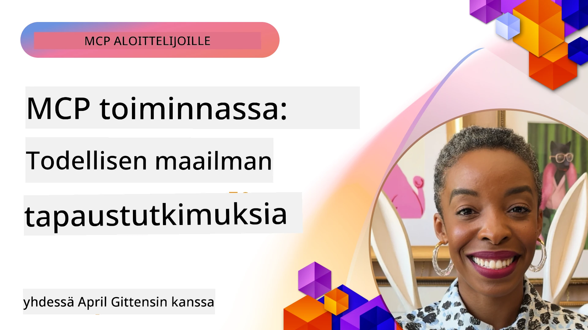

# MCP käytännössä: todellisia tapaustutkimuksia

_(Napsauta yllä olevaa kuvaa katsellaksesi tämän oppitunnin videota)_

Model Context Protocol (MCP) muuttaa tapaa, jolla tekoälysovellukset ovat vuorovaikutuksessa datan, työkalujen ja palveluiden kanssa. Tässä osiossa esitellään todellisia tapaustutkimuksia, jotka demonstroivat MCP:n käytännön sovelluksia erilaisissa yritysympäristöissä.

## Yleiskatsaus

Tässä osiossa esitellään konkreettisia MCP:n toteutusesimerkkejä, korostaen sitä, miten organisaatiot hyödyntävät tätä protokollaa monimutkaisten liiketoimintaongelmien ratkaisemiseksi. Tarkastelemalla näitä tapaustutkimuksia saat näkemyksiä MCP:n monipuolisuudesta, skaalautuvuudesta ja käytännön hyödyistä todellisissa tilanteissa.

## Keskeiset oppimistavoitteet

Näitä tapaustutkimuksia tutkimalla opit:

- Ymmärtämään, miten MCP:tä voidaan soveltaa tiettyjen liiketoimintaongelmien ratkaisuun
- Tutustumaan erilaisiin integraatiokuvioihin ja arkkitehtonisiin lähestymistapoihin
- Tunnistamaan best practise -käytännöt MCP:n käyttöönotossa yritysympäristöissä
- Saamaan näkemyksiä todellisten toteutusten haasteista ja ratkaisuista
- Havaitsemaan mahdollisuuksia soveltaa samankaltaisia kuvioita omissa projekteissasi

## Esitellyt tapaustutkimukset

### 1. [Azure AI Travel Agents – referenssitoteutus](./travelagentsample.md)

Tässä tapaustutkimuksessa tarkastellaan Microsoftin kattavaa referenssiratkaisua, joka havainnollistaa, miten rakentaa moniedustajainen, tekoälyllä toimiva matkasuunnitteluapplikaatio MCP:n, Azure OpenAI:n ja Azure AI Searchin avulla. Projekti esittelee:

- Moniedustajaorkestraation MCP:n kautta
- Yritysdatan integroinnin Azure AI Searchin avulla
- Turvallisen, skaalautuvan arkkitehtuurin Azure-palveluiden avulla
- Laajennettavat työkalut uudelleenkäytettävillä MCP-komponenteilla
- Keskustelupohjaisen käyttäjäkokemuksen Azure OpenAI:n voimin

Arkkitehtuuri ja toteutuksen yksityiskohdat tarjoavat arvokkaita näkemyksiä monimutkaisten moniedustajajärjestelmien rakentamiseen MCP:n orkestrointikerroksena.

### 2. [Azure DevOps -työkohtien päivittäminen YouTube-datasta](./UpdateADOItemsFromYT.md)

Tämä tapaustutkimus demonstroi MCP:n käytännön sovellusta työnkulkujen automaatiossa. Se näyttää, miten MCP-työkaluja voidaan käyttää:

- Datan poimimiseen verkkopalveluista (YouTube)
- Työkohteiden päivittämiseen Azure DevOps -järjestelmissä
- Toistettavien automaatiotyönkulkujen luomiseen
- Datan integrointiin hajanaisista järjestelmistä

Esimerkki osoittaa, miten jopa suhteellisen yksinkertaiset MCP-toteutukset voivat tuottaa merkittäviä tehokkuusetuja automatisoimalla rutiinitehtäviä ja parantamalla datan yhdenmukaisuutta järjestelmien välillä.

### 3. [Reaaliaikainen dokumentaation hakeminen MCP:llä](./docs-mcp/README.md)

Tämä tapaustutkimus opastaa yhdistämään Python-konsoliasiakkaan Model Context Protocol (MCP) -palvelimeen reaaliaikaisen, kontekstin tuntevan Microsoft-dokumentaation hakemiseksi ja lokittamiseksi. Opit:

- Yhdistämään MCP-palvelimeen Python-asiakkaalla ja virallisella MCP SDK:lla
- Käyttämään suoratoistavia HTTP-asiakkaita tehokkaaseen, reaaliaikaiseen datan hakemiseen
- Kutsumaan dokumentaatiotyökaluja palvelimella ja lokittamaan vastaukset suoraan konsoliin
- Integroimaan ajantasaisen Microsoft-dokumentaation työnkulkuusi ilman terminaalin ulkopuolelle poistumista

Luku sisältää käytännön harjoituksen, minimalistisen toimivan koodiesimerkin ja linkit lisäresursseihin syvempää oppimista varten. Katso koko läpikäynti ja koodi linkitetyssä luvussa, jotta ymmärrät, miten MCP voi mullistaa dokumentaatioiden saatavuuden ja kehittäjien tuottavuuden konsolipohjaisissa ympäristöissä.

### 4. [Interaktiivinen opintosuunnitelman generaattorisovellus MCP:llä](./docs-mcp/README.md)

Tämä tapaustutkimus osoittaa, miten rakentaa interaktiivinen web-sovellus Chainlitin ja Model Context Protocolin (MCP) avulla henkilökohtaisten opintosuunnitelmien luomiseksi mille tahansa aiheelle. Käyttäjät voivat määrittää aiheen (esim. "AI-900 -sertifiointi") ja opiskeluajan (esim. 8 viikkoa), ja sovellus antaa viikottaisen suositussisällön erittelyn. Chainlit mahdollistaa keskustelupohjaisen chat-käyttöliittymän, tehden käyttökokemuksesta mukaansatempaavan ja adaptiivisen.

- Keskustelupohjainen web-sovellus Chainlitin voimalla
- Käyttäjävetoiset kehotteet aiheelle ja kestolle
- Viikko-viikolta etenevät sisältösuositukset MCP:n avulla
- Reaaliaikaiset, adaptiiviset vastaukset chat-käyttöliittymässä

Projekti havainnollistaa, miten keskusteleva tekoäly ja MCP voidaan yhdistää dynaamisten, käyttäjälähtöisten opetustyökalujen luomiseksi nykyaikaisessa web-ympäristössä.

### 5. [Editorissa toimiva dokumentaatio MCP-palvelimen avulla VS Codessa](./docs-mcp/README.md)

Tämä tapaustutkimus näyttää, miten voit tuoda Microsoft Learn Docs -dokumentaation suoraan VS Code -ympäristöön käyttäen MCP-palvelinta—ei enää selainvälilehtien välillä hyppimistä! Näet, miten:

- Dokumentaatio voidaan hakea ja lukea välittömästi VS Codessa MCP-paneelin tai komentopalettien avulla
- Dokumentaatiota voidaan viitata ja linkkejä lisätä suoraan README- tai kurssimarkdown-tiedostoihin
- GitHub Copilot ja MCP toimivat saumattomasti yhdessä AI-avusteisessa dokumentaatio- ja koodityönkulussa
- Dokumentaatiota validoidaan ja parannetaan reaaliaikaisin palauttein Microsoftin lähteiden tarkkuudella
- MCP integroidaan GitHub-työnkulkuihin jatkuvaa dokumentaation validointia varten

Toteutus sisältää:

- Esimerkkikonfiguraation `.vscode/mcp.json` helppoon käyttöönottoon
- Kuvakaappauskävelyt editorissa toimivasta käyttökokemuksesta
- Vinkkejä Copilotin ja MCP:n yhdistämiseen maksimaalisen tuottavuuden saavuttamiseksi

Tämä skenaario on ihanteellinen kurssien tekijöille, dokumentaatiokirjoittajille ja kehittäjille, jotka haluavat pysyä keskittyneenä editorissa työskennellessään dokumentaatioiden, Copilotin ja validointityökalujen kanssa—kaikki MCP:n voimalla.

### 6. [APIM MCP -palvelimen luominen](./apimsample.md)

Tämä tapaustutkimus tarjoaa vaiheittaiset ohjeet MCP-palvelimen luomiseen käyttämällä Azure API Managementia (APIM). Se kattaa:

- MCP-palvelimen perustamisen Azure API Managementiin
- API-operaatioiden julkaisun MCP-työkaluina
- Politiikkojen konfiguroinnin nopeusrajoituksia ja turvaa varten
- MCP-palvelimen testaamisen Visual Studio Codella ja GitHub Copilotilla

Esimerkki havainnollistaa, miten hyödyntää Azuren kyvykkyyksiä luodaksesi vankan MCP-palvelimen, jota voidaan käyttää erilaisissa sovelluksissa ja joka tehostaa tekoälyjärjestelmien integraatiota yritysten API-rajapintoihin.

### 7. [GitHub MCP Registry — agenteille tarkoitetun integraation kiihdyttäjä](https://github.com/mcp)

Tämä tapaustutkimus tarkastelee, miten GitHubin MCP Registry, joka lanseerattiin syyskuussa 2025, ratkaisee keskeisen haasteen tekoälyekosysteemissä: Model Context Protocol (MCP) -palvelimien sirpaleisen löydettävyyden ja käyttöönoton.

#### Yleiskatsaus
**MCP Registry** ratkaisee kasvavan ongelman MCP-palvelimien hajanaisuudesta eri repositorioissa ja rekistereissä, mikä aiemmin teki integraatiosta hidasta ja virhealtista. Nämä palvelimet mahdollistavat tekoälyagenttien vuorovaikutuksen ulkoisten järjestelmien, kuten API:iden, tietokantojen ja dokumentaatiolähteiden kanssa.

#### Ongelmanasettelu
Agenttipohjaisia työnkulkuja rakentavat kehittäjät kohtasivat useita haasteita:
- **Huono löydettävyys** MCP-palvelimille eri alustoilla
- **Monistuvat asetuskysymykset** eri foorumeilla ja dokumentaatiossa
- **Turvariskit** vahvistamattomista ja epäluotettavista lähteistä
- **Standardoinnin puute** palvelinten laadussa ja yhteensopivuudessa

#### Ratkaisun arkkitehtuuri
GitHubin MCP Registry keskittää luotetut MCP-palvelimet keskeisillä ominaisuuksilla:
- **Yhdellä klikkauksella asennus** VS Code -integraation kautta helppoa käyttöönottoa varten
- **Signaali-melusuhde** tähtien, aktiivisuuden ja yhteisön validoinnin mukainen lajittelu
- **Suora integraatio** GitHub Copilotin ja muiden MCP-yhteensopivien työkalujen kanssa
- **Avoin kontribuutio-malli** mahdollistaa sekä yhteisön että yrityskumppaneiden osallistumisen

#### Liiketoiminnallinen vaikutus
Rekisteri on tuonut mitattavia parannuksia:
- **Nopeampi käyttöönotto** kehittäjille, jotka käyttävät esimerkiksi Microsoft Learn MCP -palvelinta, joka suoratoistaa virallista dokumentaatiota suoraan agenteille
- **Parantunut tuottavuus** erikoistuneiden palvelinten, kuten `github-mcp-server`, avulla, mahdollistaen luonnollisen kielen GitHub-automaatioita (PR:n luonti, CI:n uudelleenajot, koodin skannaus)
- **Vahvempi ekosysteemin luottamus** kuratoitujen listojen ja läpinäkyvien konfiguraatiostandardien kautta

#### Strateginen arvo
Agenttielinkaaren hallintaan ja toistettaviin työnkulkuihin erikoistuneille MCP Registry tarjoaa:
- **Modulaarisen agenttien käyttöönoton** standardoitujen komponenttien avulla
- **Rekisteripohjaiset arviointiputket** johdonmukaiseen testaukseen ja validointiin
- **Työkalujen välinen yhteensopivuus** erilaisissa tekoälyalustoissa saumattomaan integraatioon

Tämä tapaustutkimus osoittaa, että MCP Registry on enemmän kuin pelkkä hakemisto—se on perustava alusta skaalautuville, todellisen maailman malli-intgraatioille ja agenttipohjaisten järjestelmien käyttöönotolle.

## Yhteenveto

Nämä seitsemän kattavaa tapaustutkimusta havainnollistavat Model Context Protocolin merkittävää monipuolisuutta ja käytännön sovelluksia monenlaisissa todellisissa tilanteissa. Monimutkaisista moniedustajaiset matkasuunnittelujärjestelmistä ja yrityksen API-hallinnasta sujuviin dokumentaatiotyönkulkuihin ja mullistavaan GitHub MCP Registryyn – nämä esimerkit osoittavat, miten MCP tarjoaa standardoidun, skaalautuvan tavan yhdistää tekoälyjärjestelmät niihin työkaluihin, datoihin ja palveluihin, joita ne tarvitsevat poikkeuksellisen arvon tuottamiseen.

Tapaustutkimukset kattavat MCP:n toteutuksen eri ulottuvuuksia:
- **Yritysintegrointi**: Azure API Management ja Azure DevOps -automaatio
- **Moniedustajaorchestration**: Matkasuunnittelu koordinoiduilla tekoälyedustajilla
- **Kehittäjien tuottavuus**: VS Code -integraatio ja reaaliaikainen dokumentaation saatavuus
- **Ekosysteemin kehitys**: GitHub MCP Registry perustavana alustana
- **Koulutussovellukset**: Interaktiiviset opintosuunnitelman generaattorit ja keskustelupohjaiset käyttöliittymät

Näitä toteutuksia tutkiessa saat ratkaisevia näkemyksiä:
- **Arkkitehtuurikuviot** eri mittakaavoissa ja käyttötapauksissa
- **Toteutusstrategiat**, jotka yhdistävät toiminnallisuuden ylläpidettävyyteen
- **Turva- ja skaalautuvuusnäkökohdat** tuotantokäyttöönotossa
- **Best practise** -käytännöt MCP-palvelimen kehityksessä ja asiakasintegraatiossa
- **Ekosysteemiajattelu** yhdistettyjen tekoälyratkaisujen rakentamiseen

Nämä esimerkit ilmentävät yhdessä, että MCP ei ole pelkästään teoreettinen kehys, vaan kypsä, tuotantovalmiiksi kehitetty protokolla, joka mahdollistaa käytännölliset ratkaisut monimutkaisiin liiketoimintahaasteisiin. Olipa kyse yksinkertaisista automaatiotyökaluista tai kehittyneistä moniedustajajärjestelmistä, tässä kuvattujen kuvioiden ja lähestymistapojen avulla sinulla on vankka perusta omille MCP-projekteillesi.

## Lisäresurssit

- [Azure AI Travel Agents GitHub Repository](https://github.com/Azure-Samples/azure-ai-travel-agents)
- [Azure DevOps MCP Tool](https://github.com/microsoft/azure-devops-mcp)
- [Playwright MCP Tool](https://github.com/microsoft/playwright-mcp)
- [Microsoft Docs MCP Server](https://github.com/MicrosoftDocs/mcp)
- [GitHub MCP Registry — Accelerating Agentic Integration](https://github.com/mcp)
- [MCP Community Examples](https://github.com/microsoft/mcp)

## Seuraavaksi

- Edellinen: [Moduuli 8: Best Practices](../08-BestPractices/README.md)
- Seuraava: [Moduuli 10: AI-työnkulkujen virtaviivaistaminen: MCP-palvelimen rakentaminen AI-työkalupakilla](../10-StreamliningAIWorkflowsBuildingAnMCPServerWithAIToolkit/README.md)

---

<!-- CO-OP TRANSLATOR DISCLAIMER START -->
**Vastuuvapauslauseke**:
Tämä asiakirja on käännetty käyttämällä tekoälypohjaista käännöspalvelua [Co-op Translator](https://github.com/Azure/co-op-translator). Vaikka pyrimme täsmällisyyteen, on hyvä ottaa huomioon, että automaattikäännöksissä saattaa esiintyä virheitä tai epätarkkuuksia. Alkuperäistä asiakirjaa sen alkuperäiskielellä tulee pitää virallisena lähteenä. Tärkeissä asioissa suositellaan ammattimaista ihmiskäännöstä. Emme ole vastuussa tämän käännöksen käytöstä johtuvista väärinymmärryksistä tai virhetulkinoista.
<!-- CO-OP TRANSLATOR DISCLAIMER END -->