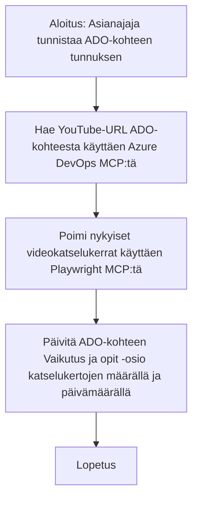

# Tapaustutkimus: Azure DevOps -kohteiden päivittäminen YouTube-datan avulla MCP:llä

> **Vastuuvapauslauseke:** On olemassa erilaisia verkkotyökaluja ja raportteja, jotka voivat automatisoida Azure DevOps -kohteiden päivittämisen dataa hyödyntäen esimerkiksi YouTubesta. Seuraava skenaario on esitetty puhtaasti esimerkkinä siitä, miten MCP-työkaluja voidaan soveltaa automaatio- ja integraatiotehtävissä.

## Yleiskatsaus

Tämä tapaustutkimus havainnollistaa yhtä esimerkkiä siitä, miten Model Context Protocol (MCP) ja sen työkalut voivat automatisoida Azure DevOps (ADO) -työkohteiden päivittämisen tiedoilla, jotka on haettu verkkoalustoilta, kuten YouTubesta. Kuvailluilla työkaluilla on laajempi sovellusalue, ja ne voidaan mukauttaa moniin samanlaisiin automaatiotarpeisiin.

Tässä esimerkissä Advocatet seuraavat verkkosessioita käyttämällä ADO-kohteita, joissa jokaiseen on liitetty YouTube-videon URL-osoite. MCP-työkaluja hyödyntämällä Advocate voi pitää ADO-kohteet ajan tasalla videoiden ajantasaisilla mittareilla, kuten katselumäärillä, toistuvasti ja automaattisesti. Tätä lähestymistapaa voidaan yleistäen soveltaa muihin käyttötapauksiin, joissa verkkolähteistä saatavat tiedot on integroitava ADO:hon tai muihin järjestelmiin.

## Skenaario

Advocate vastaa verkkosessioiden ja yhteisön osallistumisen vaikutusten seurannasta. Jokainen sessio kirjataan ADO-työkohteeksi 'DevRel'-projektiin, ja kohteessa on kenttä YouTube-videon URL-osoitteelle. Tarkkojen raporttien laatimiseksi Advocate päivittää ADO-kohteen nykyisellä videon katselumäärällä ja tiedon haun päivämäärällä.

## Käytetyt työkalut

- [Azure DevOps MCP](https://github.com/microsoft/azure-devops-mcp): Mahdollistaa ADO-työkohteiden ohjelmallisen haun ja päivityksen MCP:n kautta.
- [Playwright MCP](https://github.com/microsoft/playwright-mcp): Automatana selaimen toimintoja live-datan hakemiseen verkkosivuilta, kuten YouTube-videon tilastoja.

## Vaiheittainen työnkulku

1. **ADO-kohteen tunnistus**: Aloita ADO-työkohteen ID:llä (esim. 1234) projektissa 'DevRel'.
2. **YouTube-URL:n haku**: Käytä Azure DevOps MCP -työkalua saadaksesi YouTube-videon URL-osoitteen työkohteesta.
3. **Videon katselukertojen poiminta**: Käytä Playwright MCP -työkalua navigoidaksesi YouTube-osoitteeseen ja poimi nykyinen katselumäärä.
4. **ADO-kohteen päivitys**: Kirjoita viimeisin katselumäärä ja tiedon hakupäivä 'Impact and Learnings' -osioon ADO-työkohteessa käyttäen Azure DevOps MCP -työkalua.

## Esimerkkipyyntö

```bash
- Work with the ADO Item ID: 1234
- The project is '2025-Awesome'
- Get the YouTube URL for the ADO item
- Use Playwright to get the current views from the YouTube video
- Update the ADO item with the current video views and the updated date of the information
```

## Mermaid-kaavio


## Tekninen toteutus

- **MCP:n orkestrointi**: Työnkulun koordinoinnista vastaa MCP-palvelin, joka hallinnoi sekä Azure DevOps MCP:n että Playwright MCP:n käyttöä.
- **Automaatio**: Prosessi voidaan käynnistää manuaalisesti tai ajoittaa suoritettavaksi säännöllisin väliajoin ADO-kohteiden ajantasaisuuden varmistamiseksi.
- **Laajennettavuus**: Sama kaava voidaan laajentaa päivittämään ADO-kohteita muilla verkkometristä saaduilla tiedoilla (esim. tykkäykset, kommentit) tai muilta alustoilta.

## Tulokset ja vaikutus

- **Tehokkuus**: Vähentää Advocaten manuaalista työtä videoiden mittaritiedon hakemisessa ja päivittämisessä.
- **Tarkkuus**: Varmistaa, että ADO-kohteet sisältävät aina viimeisimmät verkosta saatavat tiedot.
- **Toistettavuus**: Tarjoaa uudelleenkäytettävän työnkulun vastaaviin skenaarioihin, jotka sisältävät muita datalähteitä tai mittareita.

## Viitteet

- [Azure DevOps MCP](https://github.com/microsoft/azure-devops-mcp)
- [Playwright MCP](https://github.com/microsoft/playwright-mcp)
- [Model Context Protocol (MCP)](https://modelcontextprotocol.io/)

## Seuraavaksi

- Takaisin: [Tapaustutkimusten yleiskatsaus](./README.md)
- Seuraava: [Reaaliaikainen dokumenttien haku MCP:llä](./docs-mcp/README.md)

---

<!-- CO-OP TRANSLATOR DISCLAIMER START -->
**Vastuuvapauslauseke**:  
Tämä asiakirja on käännetty tekoälypohjaisella käännöspalvelulla [Co-op Translator](https://github.com/Azure/co-op-translator). Vaikka pyrimme tarkkuuteen, automaattiset käännökset saattavat sisältää virheitä tai epätarkkuuksia. Alkuperäinen asiakirja sen alkuperäiskielellä tulisi pitää auktoritatiivisena lähteenä. Tärkeiden tietojen osalta suositellaan ammattimaista ihmiskäännöstä. Emme ole vastuussa tämän käännöksen käytöstä aiheutuvista väärinymmärryksistä tai tulkinnoista.
<!-- CO-OP TRANSLATOR DISCLAIMER END -->