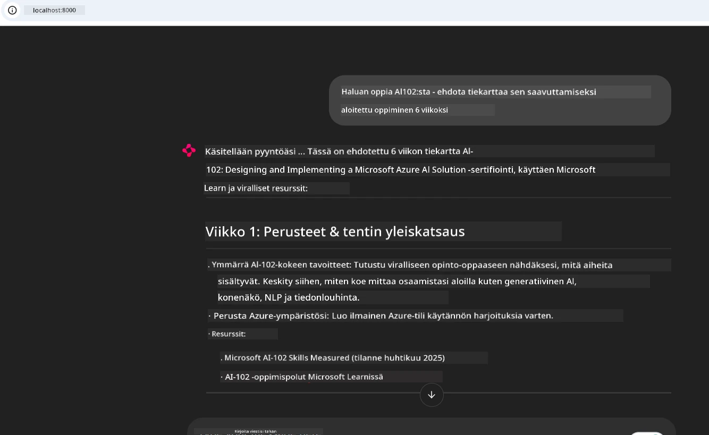
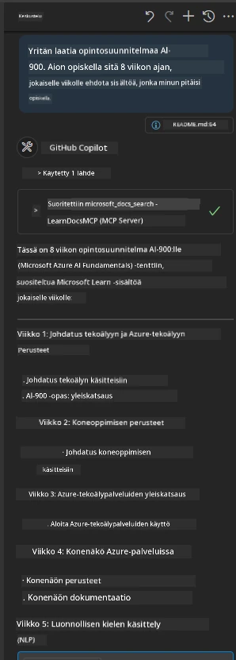

# Case Study: Yhteys Microsoft Learn Docs MCP -palvelimelle asiakkaalta

Oletko joskus huomannut itsesi hyppivän dokumentaatiosivustojen, Stack Overflow’n ja loputtomien hakukonesivujen välillä yrittäessäsi ratkaista ongelmaa koodissasi? Ehkä pidät toista näyttöä vain dokumentaatiota varten tai vaihdat jatkuvasti Alt+Tabilla IDE:si ja selaimen välillä. Eikö olisi parempi, jos voisit tuoda dokumentaation suoraan työvirtaasi—integroituna sovelluksiisi, IDE:si tai jopa omiin räätälöityihin työkaluihisi? Tässä tapaustutkimuksessa tutkimme, kuinka tehdä juuri näin muodostamalla suora yhteys Microsoft Learn Docs MCP -palvelimelle omasta asiakasohjelmastasi.

## Yleiskuva

Nykykehitys on enemmän kuin pelkkää koodin kirjoittamista—kyse on oikean tiedon löytämisestä oikeaan aikaan. Dokumentaatio on kaikkialla, mutta harvoin siellä, missä sitä eniten tarvitset: työkaluissasi ja työprosesseissasi. Integroimalla dokumentaation hakemisen suoraan sovelluksiisi voit säästää aikaa, vähentää kontekstin vaihtamista ja lisätä tuottavuutta. Tässä osiossa näytämme, kuinka yhdistää asiakas Microsoft Learn Docs MCP -palvelimeen, jotta voit päästä käsiksi reaaliaikaiseen, kontekstista tietävään dokumentaatioon ilman, että poistut sovelluksestasi.

Käymme läpi yhteyden muodostamisen, pyynnön lähettämisen ja suoravirtojen vastausten käsittelyn tehokkaasti. Tämä lähestymistapa virtaviivaistaa työvirtaasi ja avaa oven älykkäämpien, avuliaiden kehittäjätyökalujen rakentamiseen.

## Oppimistavoitteet

Miksi teemme tämän? Koska parhaat kehittäjäkokemukset ovat niitä, jotka poistavat kitkaa. Kuvittele maailma, jossa koodieditorisi, chatbotisi tai verkkosovelluksesi voi vastata dokumentaatiokysymyksiisi välittömästi käyttäen Microsoft Learnin uusimpia sisältöjä. Tämän luvun lopussa osaat:

- Ymmärtää MCP-palvelin-asiakaskommunikaation perusteet dokumentaatiolle
- Toteuttaa konsoli- tai web-sovelluksen, joka yhdistää Microsoft Learn Docs MCP -palvelimeen
- Käyttää suoratoistavia HTTP-asiakkaita reaaliaikaiseen dokumentaation hakemiseen
- Lokittaa ja tulkita dokumentaatiovastauksia sovelluksessasi

Näet, kuinka nämä taidot auttavat sinua rakentamaan työkaluja, jotka eivät ole vain reaktiivisia, vaan aidosti interaktiivisia ja kontekstitietoisia.

## Tilanne 1 – Reaaliaikainen dokumentaation haku MCP:n avulla

Tässä tilanteessa näytämme, kuinka yhdistää asiakas Microsoft Learn Docs MCP -palvelimeen, jotta pääset käsiksi reaaliaikaiseen, kontekstiin perustuvaan dokumentaatioon poistumatta sovelluksestasi.

Sovelletaan tätä käytäntöön. Tehtäväsi on kirjoittaa sovellus, joka yhdistää Microsoft Learn Docs MCP -palvelimeen, kutsuu `microsoft_docs_search` -työkalua ja kirjaa suoratoistovastauksen konsoliin.

### Miksi tämä lähestymistapa?
Koska se on perusta kehittyneempien integraatioiden rakentamiselle—olipa tarkoituksenasi tehostaa chatbotia, IDE-laajennusta tai web-hallintapaneelia.

Löydät tämän tilanteen koodin ja ohjeet [`solution`](./solution/README.md) -kansiosta tässä tapaustutkimuksessa. Vaiheet opastavat sinut yhteyden muodostamisessa:
- Käytä virallista MCP SDK:ta ja suoratoistettavaa HTTP-asiakasta yhteyteen
- Kutsu `microsoft_docs_search` -työkalu hakuehdolla dokumentaation hakemiseksi
- Toteuta asianmukainen lokitus ja virheenkäsittely
- Luo interaktiivinen konsolirajapinta, joka antaa käyttäjien syöttää useita hakukyselyjä

Tämä skenaario osoittaa kuinka:
- Yhdistää Docs MCP -palvelimeen
- Lähettää hakukysely
- Jäsentää ja tulostaa tulokset

Näin ratkaisun ajo saattaa näyttää:

```
Prompt> What is Azure Key Vault?
Answer> Azure Key Vault is a cloud service for securely storing and accessing secrets. ...
```
  
Alla on minimaalinen esimerkkiratkaisu. Kokonaiskoodi ja yksityiskohdat löytyvät solution-kansiosta.

<details>
<summary>Python</summary>

```python
import asyncio
from mcp.client.streamable_http import streamablehttp_client
from mcp import ClientSession

async def main():
    async with streamablehttp_client("https://learn.microsoft.com/api/mcp") as (read_stream, write_stream, _):
        async with ClientSession(read_stream, write_stream) as session:
            await session.initialize()
            result = await session.call_tool("microsoft_docs_search", {"query": "Azure Functions best practices"})
            print(result.content)

if __name__ == "__main__":
    asyncio.run(main())
```
  
- Täyden toteutuksen ja lokituksen löydät tiedostosta [`scenario1.py`](../../../../09-CaseStudy/docs-mcp/solution/python/scenario1.py).  
- Asennus- ja käyttöohjeet löytyvät samasta kansiosta olevasta [`README.md`](./solution/python/README.md) tiedostosta.  
</details>

## Tilanne 2 – Interaktiivinen opintosuunnitelman generaattori verkkosovelluksella MCP:n avulla

Tässä skenaariossa opit, kuinka Docs MCP integroidaan web-kehitysprojektiin. Tavoitteena on antaa käyttäjien hakea Microsoft Learn -dokumentaatiota suoraan verkkokäyttöliittymästä, jolloin dokumentaatio on heti saatavilla sovelluksessasi tai sivustollasi.

Näet kuinka:
- Rakentaa web-sovellus
- Yhdistää Docs MCP -palvelimeen
- Käsitellä käyttäjän syötettä ja näyttää tulokset

Näin ratkaisun ajo saattaa näyttää:

```
User> I want to learn about AI102 - so suggest the roadmap to get it started from learn for 6 weeks

Assistant> Here’s a detailed 6-week roadmap to start your preparation for the AI-102: Designing and Implementing a Microsoft Azure AI Solution certification, using official Microsoft resources and focusing on exam skills areas:

---
## Week 1: Introduction & Fundamentals
- **Understand the Exam**: Review the [AI-102 exam skills outline](https://learn.microsoft.com/en-us/credentials/certifications/exams/ai-102/).
- **Set up Azure**: Sign up for a free Azure account if you don't have one.
- **Learning Path**: [Introduction to Azure AI services](https://learn.microsoft.com/en-us/training/modules/intro-to-azure-ai/)
- **Focus**: Get familiar with Azure portal, AI capabilities, and necessary tools.

....more weeks of the roadmap...

Let me know if you want module-specific recommendations or need more customized weekly tasks!
```
  
Alla on minimaalinen esimerkkiratkaisu. Kokonaiskoodi ja yksityiskohdat löytyvät solution-kansiosta.



<details>
<summary>Python (Chainlit)</summary>

Chainlit on kehys keskustelupohjaisten tekoälyweb-sovellusten rakentamiseen. Sen avulla on helppo luoda interaktiivisia chatteja ja avustajia, jotka voivat kutsua MCP-työkaluja ja näyttää tuloksia reaaliajassa. Se on ihanteellinen nopeaan prototyyppien luomiseen ja käyttäjäystävällisiin käyttöliittymiin.

```python
import chainlit as cl
import requests

MCP_URL = "https://learn.microsoft.com/api/mcp"

@cl.on_message
def handle_message(message):
    query = {"question": message}
    response = requests.post(MCP_URL, json=query)
    if response.ok:
        result = response.json()
        cl.Message(content=result.get("answer", "No answer found.")).send()
    else:
        cl.Message(content="Error: " + response.text).send()
```
  
- Täyden toteutuksen löydät tiedostosta [`scenario2.py`](../../../../09-CaseStudy/docs-mcp/solution/python/scenario2.py).  
- Asennus- ja ajo-ohjeet löytyvät samasta kansiosta olevasta [`README.md`](./solution/python/README.md) tiedostosta.  
</details>

## Tilanne 3: Sisällön tarkasteleminen suoraan editorissa MCP-palvelimella VS Codessa

Jos haluat saada Microsoft Learn Docs -sisältöä suoraan VS Codeen (sen sijaan että vaihdat selaimen välilehtiä), voit käyttää MCP-palvelinta editorissasi. Tämä mahdollistaa:
- Dokumentaation hakemisen ja lukemisen VS Codessa poistumatta koodausympäristöstäsi.
- Dokumentaation viittaamisen ja linkkien lisäämisen suoraan README- tai kurssitiedostoihin.
- GitHub Copilotin ja MCP:n käytön yhdessä saumattomaan, tekoälyavusteiseen dokumentaatiotyöskentelyyn.

**Näet kuinka:**
- Lisää kelvollinen `.vscode/mcp.json` -tiedosto työtilasi juureen (katso esimerkki alla).
- Avaa MCP-paneeli tai käytä komentovalikkoa VS Codessa dokumentaation hakemiseen ja lisäämiseen.
- Viittaa dokumentaatioon suoraan markdown-tiedostoissasi työskennellessäsi.
- Yhdistä tämä työnkulku GitHub Copilotiin entistä parempaa tuottavuutta varten.

Näin voit määrittää MCP-palvelimen VS Codessa:

```json
{
  "servers": {
    "LearnDocsMCP": {
      "url": "https://learn.microsoft.com/api/mcp"
    }
  }
}
```


> Yksityiskohtaiset läpikäynnit kuvakaappauksineen ja vaiheittaisine ohjeineen löydät tiedostosta [`README.md`](./solution/scenario3/README.md).



Tämä lähestymistapa on erinomainen kaikille, jotka rakentavat teknisiä kursseja, kirjoittavat dokumentaatiota tai kehittävät koodia, jossa tarvitaan usein viitteitä.

## Keskeiset opit

Dokumentaation integroiminen suoraan työkaluihisi ei ole pelkkä mukavuus—se on tuottavuuden mullistaja. Yhdistämällä Microsoft Learn Docs MCP -palvelimeen asiakkaaltasi voit:

- Poistaa kontekstin vaihtamisen koodin ja dokumentaation välillä
- Hakea ajan tasalla olevaa, kontekstiin perustuvaa dokumentaatiota reaaliajassa
- Rakentaa älykkäämpiä ja vuorovaikutteisempia kehittäjätyökaluja

Nämä taidot auttavat sinua luomaan ratkaisuja, jotka eivät ole vain tehokkaita, vaan myös miellyttäviä käyttää.

## Lisäresurssit

Syventääksesi ymmärrystäsi, tutustu näihin virallisiin resursseihin:

- [Microsoft Learn Docs MCP Server (GitHub)](https://github.com/MicrosoftDocs/mcp)
- [Aloita Azure MCP Serverin kanssa (mcp-python)](https://learn.microsoft.com/en-us/azure/developer/azure-mcp-server/get-started#create-the-python-app)
- [Mikä on Azure MCP Server?](https://learn.microsoft.com/en-us/azure/developer/azure-mcp-server/)
- [Model Context Protocol (MCP) Johdanto](https://modelcontextprotocol.io/introduction)
- [Lisää MCP Serveristä saatavia plugineja (Python)](https://learn.microsoft.com/en-us/semantic-kernel/concepts/plugins/adding-mcp-plugins)

## Mitä seuraavaksi

- Takaisin: [Tapaustutkimusten yleiskatsaus](../README.md)
- Jatka: [Moduuli 10: AI-työvirtojen tehostaminen AI Toolkitin avulla](../../10-StreamliningAIWorkflowsBuildingAnMCPServerWithAIToolkit/README.md)

---

<!-- CO-OP TRANSLATOR DISCLAIMER START -->
**Vastuuvapauslauseke**:
Tämä asiakirja on käännetty käyttämällä tekoälypohjaista käännöspalvelua [Co-op Translator](https://github.com/Azure/co-op-translator). Vaikka pyrimme tarkkuuteen, muistathan, että automaattikäännöksissä saattaa esiintyä virheitä tai epätarkkuuksia. Alkuperäinen asiakirja sen omalla kielellä on katsottava viralliseksi lähteeksi. Tärkeitä tietoja varten suositellaan ammattilaisten tekemää ihmiskäännöstä. Emme ole vastuussa mahdollisista väärinymmärryksistä tai tulkinnoista, jotka johtuvat tämän käännöksen käytöstä.
<!-- CO-OP TRANSLATOR DISCLAIMER END -->