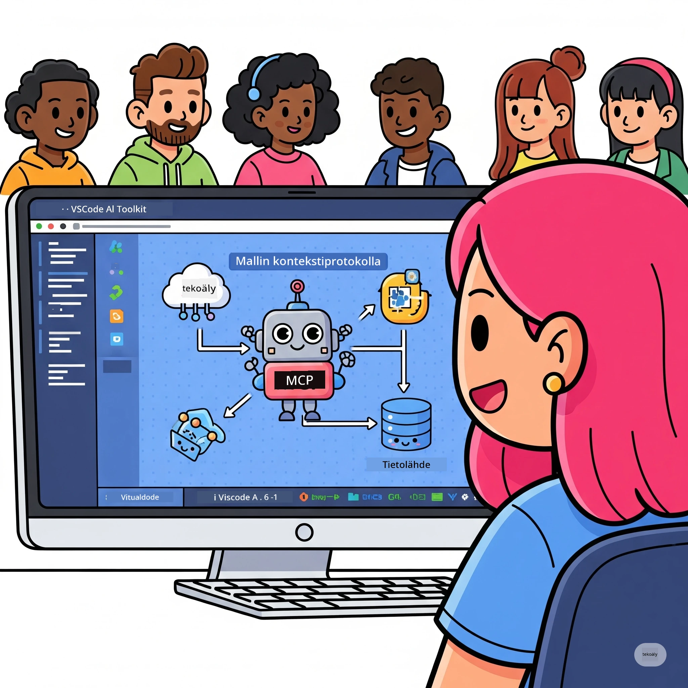
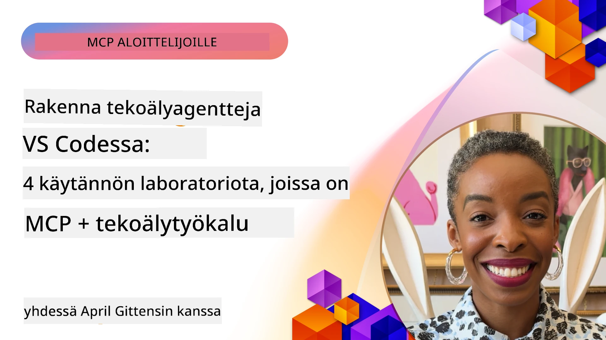

# Sujuvoita tekoälytyönkulkuja: Rakennetaan MCP-palvelin AI Toolkitilla

## 🎯 Yleiskatsaus

_(Klikkaa yllä olevaa kuvaa nähdäksesi tämän oppitunnin videon)_

Tervetuloa **Model Context Protocol (MCP) -työpajaan**! Tämä kattava käytännön työpaja yhdistää kaksi huipputeknologiaa mullistaakseen tekoälysovelluskehityksen:

- **🔗 Model Context Protocol (MCP)**: Avoin standardi saumattomaan tekoälytyökalujen integraatioon
- **🛠️ AI Toolkit for Visual Studio Code (AITK)**: Microsoftin tehokas tekoälykehityslaajennus

### 🎓 Mitä opit

Työpajan päätteeksi hallitset älykkäiden sovellusten rakentamisen, jotka yhdistävät tekoälymallit todellisen maailman työkaluihin ja palveluihin. Automaattisesta testauksesta räätälöityihin API-integraatioihin saat käytännön taitoja monimutkaisten liiketoiminnan haasteiden ratkaisuun.

## 🏗️ Teknologiapino

### 🔌 Model Context Protocol (MCP)

MCP on **"USB-C tekoälylle"** – yleinen standardi, joka yhdistää tekoälymallit ulkoisiin työkaluihin ja tietolähteisiin.

**✨ Keskeiset ominaisuudet:**

- 🔄 **Standardoitu integraatio**: Yleinen rajapinta tekoälytyökaluyhteyksiin
- 🏛️ **Joustava arkkitehtuuri**: Paikalliset ja etäpalvelimet stdio/SSE-siirrolla
- 🧰 **Rikas ekosysteemi**: Työkaluja, kehotteita ja resursseja yhdessä protokollassa
- 🔒 **Yritystason valmius**: Sisäänrakennettu turvallisuus ja luotettavuus

**🎯 Miksi MCP on tärkeä:**
Aivan kuten USB-C poisti johtosekoilun, MCP poistaa tekoälyn integraatioiden monimutkaisuuden. Yksi protokolla, rajattomat mahdollisuudet.

### 🤖 AI Toolkit for Visual Studio Code (AITK)

Microsoftin lippulaiva tekoälykehityslaajennus, joka muuttaa VS Coden tehokkaaksi tekoälyalustaksi.

**🚀 Keskeiset kyvykkyydet:**

- 📦 **Malliluettelo**: Pääsy malleihin Azure AI:sta, GitHubista, Hugging Facesta, Ollamasta
- ⚡ **Paikallinen päättely**: ONNX-optimoitu CPU/GPU/NPU-suoritus
- 🏗️ **Agenttirakentaja**: Visuaalinen tekoälyagenttien kehitys MCP-integraatiolla
- 🎭 **Monimuotoinen**: Teksti-, näkö- ja rakenteellisen tulosteen tuki

**💡 Kehitysetuja:**

- Nollakonfiguraatiolla käyttöön otettavat mallit
- Visuaalinen kehotteiden suunnittelu
- Reaaliaikainen testausympäristö
- Saumaton MCP-palvelinintegraatio

## 📚 Oppimismatka

### [🚀 Moduuli 1: AI Toolkitin perusteet](./lab1/README.md)

**Kesto**: 15 minuuttia

- 🛠️ Asenna ja konfiguroi AI Toolkit VS Codeen
- 🗂️ Tutustu malliluetteloon (yli 100 mallia GitHubista, ONNX:stä, OpenAI:sta, Anthropista, Googlelta)
- 🎮 Hallitse interaktiivinen testausympäristö reaaliaikaista mallin testausta varten
- 🤖 Rakenna ensimmäinen tekoälyagenttisi Agent Builderilla
- 📊 Arvioi mallin suorituskykyä sisäänrakennetuilla mittareilla (F1, relevanssi, samankaltaisuus, johdonmukaisuus)
- ⚡ Opi eräprosessoinnista ja monimuotoisen tuen ominaisuuksista

**🎯 Oppimistulos**: Luo toimiva tekoälyagentti, jolla on laaja ymmärrys AITK:n kyvykkyyksistä

### [🌐 Moduuli 2: MCP ja AI Toolkitin perusteet](./lab2/README.md)

**Kesto**: 20 minuuttia

- 🧠 Hallitse Model Context Protocolin (MCP) arkkitehtuuri ja käsitteet
- 🌐 Tutustu Microsoftin MCP-palvelinekosysteemiin
- 🤖 Rakenna selaimen automatisointiantti Playwright MCP -palvelimella
- 🔧 Integroi MCP-palvelimet AI Toolkit Agent Builderiin
- 📊 Konfiguroi ja testaa MCP-työkaluja agenteissasi
- 🚀 Vie tuotantoon MCP-voimalla toimivat agentit

**🎯 Oppimistulos**: Ota käyttöön tekoälyagentti, joka saa lisätehoa ulkoisista työkaluista MCP:n kautta

### [🔧 Moduuli 3: Edistynyt MCP-kehitys AI Toolkitilla](./lab3/README.md)

**Kesto**: 20 minuuttia

- 💻 Luo omia MCP-palvelimia AI Toolkitilla
- 🐍 Asenna ja käytä uusinta MCP Python SDK:ta (v1.9.3)
- 🔍 Ota käyttöön MCP Inspector virheiden selvitykseen
- 🛠️ Rakenna Sää MCP -palvelin ammattimaisella debug-käsikirjoituksella
- 🧪 Debuggaa MCP-palvelimia sekä Agent Builderissa että Inspector-ympäristössä

**🎯 Oppimistulos**: Kehitä ja debuggaa räätälöityjä MCP-palvelimia nykyaikaisilla työkaluilla

### [🐙 Moduuli 4: Käytännön MCP-kehitys - Räätälöity GitHub Clone -palvelin](./lab4/README.md)

**Kesto**: 30 minuuttia

- 🏗️ Rakenna todellisen maailman GitHub Clone MCP -palvelin kehitysprosesseihin
- 🔄 Toteuta älykäs repositorion kloonaus validoinnilla ja virheiden käsittelyllä
- 📁 Luo älykäs hakemistojen hallinta ja VS Code -integraatio
- 🤖 Käytä GitHub Copilot Agent -tilaa räätälöidyillä MCP-työkaluilla
- 🛡️ Hyödynnä tuotantovalmiudet luotettavuudessa ja monialustaisuudessa

**🎯 Oppimistulos**: Julkaise tuotantovalmis MCP-palvelin, joka sujuvoittaa todellisia kehitystyönkulkuja

## 💡 Todelliset käyttötapaukset ja vaikutus

### 🏢 Yrityssovellukset

#### 🔄 DevOpsin automaatio

Muuta kehitystyönkulku älykkäällä automaatiolla:

- **Älykäs repositorionhallinta**: Tekoälypohjainen koodin tarkistus ja yhdistämispäätökset
- **Älykäs CI/CD**: Automaattinen putkistojen optimointi koodimuutosten perusteella
- **Ongelma triage**: Automaattinen virheiden luokittelu ja tehtävien jako

#### 🧪 Laadunvarmistuksen vallankumous

Nosta testaus uudelle tasolle tekoälyllä:

- **Älykäs testien generointi**: Laajat testikattavuudet automaattisesti
- **Visuaalinen regressiotestaus**: AI-pohjainen käyttöliittymän muutosten tunnistus
- **Suorituskyvyn seuranta**: Ennakoiva ongelmien tunnistus ja korjaus

#### 📊 Tietoputkien älykkyys

Rakenna fiksumpia tietoputkia:

- **Mukautuvat ETL-prosessit**: Itseoptimoituvat datamuunnokset
- **Poikkeavuuksien havaitseminen**: Reaaliaikainen datan laadun valvonta
- **Älykäs reititys**: Fiksu datavirran hallinta

#### 🎧 Asiakaskokemuksen parantaminen

Luo poikkeuksellisia asiakaskohtaamisia:

- **Kontekstintietoinen tuki**: Tekoälyagentit, joilla pääsy asiakashistoriaan
- **Ennakoiva ongelmanratkaisu**: Ennustava asiakaspalvelu
- **Monikanavainen integraatio**: Yhtenäinen tekoälykokemus eri alustoilla

## 🛠️ Ennen aloitusta ja asennus

### 💻 Järjestelmävaatimukset

| Komponentti             | Vaatimus           | Huomautuksia            |
|------------------------|--------------------|------------------------|
| **Käyttöjärjestelmä**     | Windows 10+, macOS 10.15+, Linux | Mikä tahansa nykyaikainen OS |
| **Visual Studio Code**   | Uusin vakaa versio | Tarvitaan AITK:lle      |
| **Node.js**             | v18.0+ ja npm      | MCP-palvelin kehitykseen |
| **Python**              | 3.10+              | Valinnainen Python MCP -palvelimille |
| **Muisti**              | Vähintään 8GB RAM  | 16GB suositeltu paikallisille malleille |

### 🔧 Kehitysympäristö

#### Suositellut VS Code -laajennukset

- **AI Toolkit** (ms-windows-ai-studio.windows-ai-studio)
- **Python** (ms-python.python)
- **Python Debugger** (ms-python.debugpy)
- **GitHub Copilot** (GitHub.copilot) – valinnainen, mutta hyödyllinen

#### Valinnaiset työkalut

- **uv**: Nykyajan Python-pakettien hallinta
- **MCP Inspector**: Visualisointityökalu MCP-palvelimien debuggaamiseen
- **Playwright**: Web-automaatioesimerkeille

## 🎖️ Oppimistulokset ja sertifiointipolku

### 🏆 Taitojen hallinnan tarkistuslista

Tämän työpajan suorittamalla saavutat seuraavat taidot:

#### 🎯 Keskeiset kompetenssit

- [ ] **MCP-protokollan hallinta**: Syvällinen arkkitehtuurin ja toteutusmallien ymmärrys
- [ ] **AITK-osaaminen**: Asiantuntijan tasoinen AI Toolkitin käyttö nopeaan kehitykseen
- [ ] **Räätälöity palvelin-kehitys**: Rakennus, käyttöönotto ja ylläpito tuotannon MCP-palvelimille
- [ ] **Työkalujen integraation huippuosaaminen**: Saumaton yhdistäminen tekoälyn ja kehitystyönkulkujen välillä
- [ ] **Ongelmanratkaisun soveltaminen**: Opittujen taitojen käyttö todellisten liiketoimintaongelmien ratkaisuun

#### 🔧 Teknisiä taitoja

- [ ] AI Toolkitin asennus ja konfigurointi VS Codessa
- [ ] Räätälöityjen MCP-palvelimien suunnittelu ja toteutus
- [ ] GitHub-mallien integrointi MCP-arkkitehtuuriin
- [ ] Automaattisten testausprosessien rakentaminen Playwrightilla
- [ ] Tekoälyagenttien käyttöönotto tuotannossa
- [ ] MCP-palvelimen suorituskyvyn debuggaus ja optimointi

#### 🚀 Edistyneet kyvyt

- [ ] Suunnittele yritystason tekoälyintegraatioita
- [ ] Toteuta tekoälysovellusten turvallisuuskäytännöt
- [ ] Suunnittele skaalautuvat MCP-palvelinarkkitehtuurit
- [ ] Rakenna räätälöityjä työkaluketjuja erityisaloille
- [ ] Mentoroi muita tekoälyn kehitystyössä

## 📖 Lisäresurssit

- [MCP Specification (2025-11-25)](https://spec.modelcontextprotocol.io/specification/2025-11-25/)
- [AI Toolkit GitHub -varasto](https://github.com/microsoft/vscode-ai-toolkit)
- [Esimerkkipalvelinten kokoelma MCP](https://github.com/modelcontextprotocol/servers)
- [Parhaat käytännöt -opas](https://modelcontextprotocol.io/docs/best-practices)
- [OWASP MCP Top 10](https://microsoft.github.io/mcp-azure-security-guide/mcp/) – Turvallisuuden parhaat käytännöt

---

**🚀 Valmiina mullistamaan tekoälykehitystyösi?**

Rakennetaan yhdessä älykkäiden sovellusten tulevaisuus MCP:n ja AI Toolkitin avulla!

## Mitä seuraavaksi

Jatka: [Moduuli 11: MCP-palvelimen käytännön työpajat](../11-MCPServerHandsOnLabs/README.md)

---

<!-- CO-OP TRANSLATOR DISCLAIMER START -->
**Vastuuvapauslauseke**:  
Tämä asiakirja on käännetty tekoälypohjaisella käännöspalvelulla [Co-op Translator](https://github.com/Azure/co-op-translator). Pyrimme tarkkuuteen, mutta huomioithan, että automaattikäännökset saattavat sisältää virheitä tai epätarkkuuksia. Alkuperäinen asiakirja sen alkuperäiskielellä on virallinen lähde. Tärkeiden tietojen osalta suositellaan ammattimaista ihmiskäännöstä. Emme ota vastuuta mahdollisista väärinymmärryksistä tai tulkinnoista, jotka johtuvat tämän käännöksen käytöstä.
<!-- CO-OP TRANSLATOR DISCLAIMER END -->