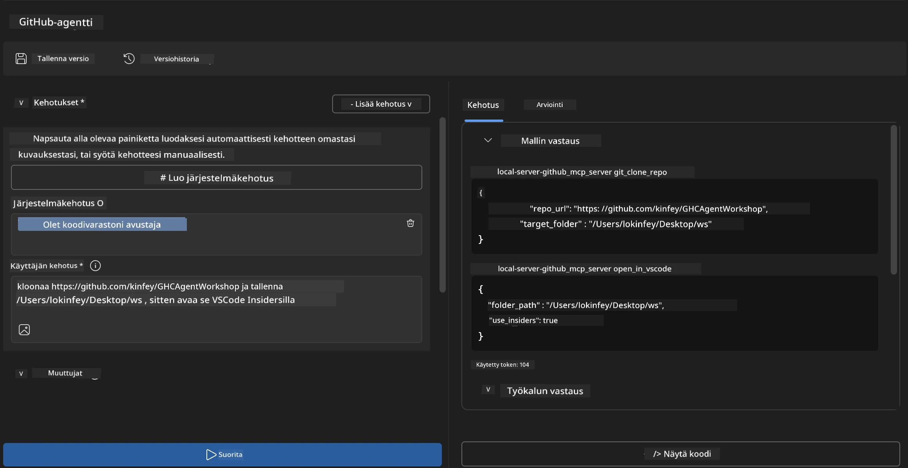
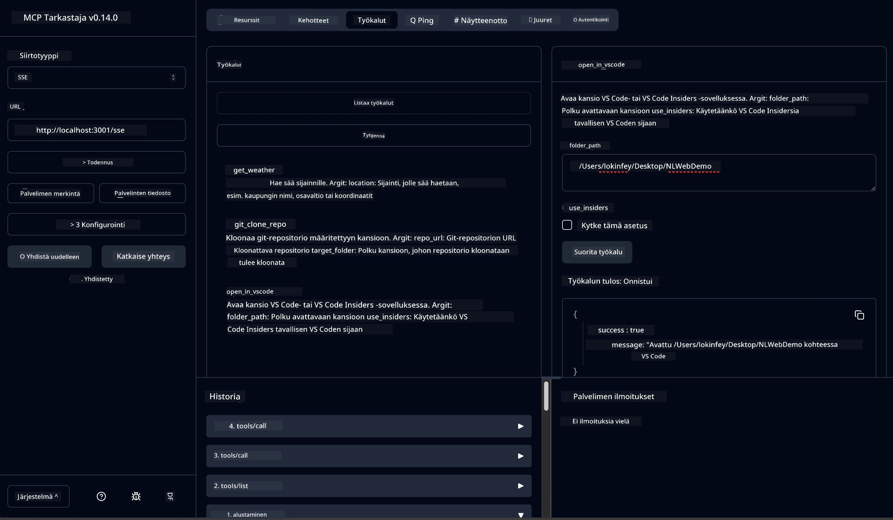

# 🐙 Moduuli 4: Käytännön MCP-kehitys - Räätälöity GitHub-kloonauspalvelin


> **⚡ Pikakäynnistys:** Rakenna tuotantovalmiiksi MCP-palvelin, joka automatisoi GitHub-repositorioiden kloonauksen ja VS Code -integraation vain 30 minuutissa!

## 🎯 Oppimistavoitteet

Tämän laboratorion lopussa osaat:

- ✅ Luoda räätälöidyn MCP-palvelimen todellisiin kehitysprosessien tarpeisiin
- ✅ Toteuttaa GitHub-repositorion kloonausominaisuuden MCP:n kautta
- ✅ Integrointia räätälöityjen MCP-palvelinten ja VS Coden sekä Agent Builderin kanssa
- ✅ Käyttää GitHub Copilot Agent Modea räätälöityjen MCP-työkalujen kanssa
- ✅ Testata ja ottaa käyttöön räätälöityjä MCP-palvelimia tuotantoympäristöissä

## 📋 Esivaatimukset

- Labs 1-3 suoritettuna (MCP-perusteet ja edistynyt kehitys)
- GitHub Copilot -tilaus ([ilmainen rekisteröityminen saatavilla](https://github.com/github-copilot/signup))
- VS Code AI Toolkit- ja GitHub Copilot -laajennuksilla
- Git komentoriviohjelma asennettuna ja konfiguroituna

## 🏗️ Projektin yleiskatsaus

### **Todellisen maailman kehityshaaste**
Kehittäjinä käytämme usein GitHubia kloonataksemme repositorioita ja avataksemme ne VS Codessa tai VS Code Insidersissa. Tämä manuaalinen prosessi sisältää:
1. Pääteikkunan tai komentokehotteen avaamisen
2. Navigoinnin haluttuun hakemistoon
3. Komennon `git clone` suorittamisen
4. VS Coden avaamisen kloonatussa hakemistossa

**MCP-ratkaisumme virtaviivaistaa tämän yhdeksi älykkääksi komennoksi!**

### **Mitä rakennat**
**GitHub Clone MCP Serverin** (`git_mcp_server`), joka tarjoaa:

| Ominaisuus | Kuvaus | Hyöty |
|------------|--------|-------|
| 🔄 **Älykäs repokloonaus** | Kloonaa GitHub-repositoriot validoinnilla | Automaattinen virheiden tarkistus |
| 📁 **Älykäs hakemistonhallinta** | Tarkistaa ja luo hakemistot turvallisesti | Estää ylikirjoittamisen |
| 🚀 **Monialustainen VS Code -integraatio** | Avaa projektit VS Codessa/Insidersissa | Saumaton työprosessin siirtymä |
| 🛡️ **Vankka virheenkäsittely** | Käsittelee verkko-, käyttöoikeus- ja polkuongelmat | Tuotantovalmius ja luotettavuus |

---

## 📖 Vaiheittainen toteutus

### Vaihe 1: Luo GitHub-agentti Agent Builderissa

1. **Käynnistä Agent Builder** AI Toolkit -laajennuksen kautta
2. **Luo uusi agentti** seuraavalla konfiguraatiolla:
   ```
   Agent Name: GitHubAgent
   ```

3. **Alusta räätälöity MCP-palvelin:**
   - Siirry valikkoon **Tools** → **Add Tool** → **MCP Server**
   - Valitse **"Create A new MCP Server"**
   - Valitse **Python-malli** joustavimman toteutuksen vuoksi
   - **Palvelimen nimi:** `git_mcp_server`

### Vaihe 2: Konfiguroi GitHub Copilot Agent Mode

1. **Avaa GitHub Copilot** VS Codessa (Ctrl/Cmd + Shift + P → "GitHub Copilot: Open")
2. **Valitse Agent-malli** Copilotin käyttöliittymästä
3. **Valitse Claude 3.7 -malli** parempaan päättelykykyyn
4. **Ota MCP-integraatio käyttöön** työkalujen saatavuutta varten

> **💡 Vinkki:** Claude 3.7 tarjoaa ylivoimaisen ymmärryksen kehitysprosesseista ja virheenkäsittelymalleista.

### Vaihe 3: Toteuta MCP-palvelimen ydintoiminnot

**Käytä seuraavaa yksityiskohtaista kehotetta GitHub Copilot Agent Modessa:**

```
Create two MCP tools with the following comprehensive requirements:

🔧 TOOL A: clone_repository
Requirements:
- Clone any GitHub repository to a specified local folder
- Return the absolute path of the successfully cloned project
- Implement comprehensive validation:
  ✓ Check if target directory already exists (return error if exists)
  ✓ Validate GitHub URL format (https://github.com/user/repo)
  ✓ Verify git command availability (prompt installation if missing)
  ✓ Handle network connectivity issues
  ✓ Provide clear error messages for all failure scenarios

🚀 TOOL B: open_in_vscode
Requirements:
- Open specified folder in VS Code or VS Code Insiders
- Cross-platform compatibility (Windows/Linux/macOS)
- Use direct application launch (not terminal commands)
- Auto-detect available VS Code installations
- Handle cases where VS Code is not installed
- Provide user-friendly error messages

Additional Requirements:
- Follow MCP 1.9.3 best practices
- Include proper type hints and documentation
- Implement logging for debugging purposes
- Add input validation for all parameters
- Include comprehensive error handling
```

### Vaihe 4: Testaa MCP-palvelimesi

#### 4a. Testaa Agent Builderissa

1. **Käynnistä debug-konfiguraatio** Agent Builderissa
2. **Aseta agentille seuraava järjestelmäpohjainen kehotepohja:**

```
SYSTEM_PROMPT:
You are my intelligent coding repository assistant. You help developers efficiently clone GitHub repositories and set up their development environment. Always provide clear feedback about operations and handle errors gracefully.
```

3. **Testaa realistisilla käyttäjäskenaarioilla:**

```
USER_PROMPT EXAMPLES:

Scenario : Basic Clone and Open
"Clone {Your GitHub Repo link such as https://github.com/kinfey/GHCAgentWorkshop
 } and save to {The global path you specify}, then open it with VS Code Insiders"
```



**Odotetut tulokset:**
- ✅ Kloonaus onnistuu polkun vahvistuksella
- ✅ VS Code käynnistyy automaattisesti
- ✅ Selkeät virheilmoitukset virheellisissä tilanteissa
- ✅ Reunakäsittely toimii oikein

#### 4b. Testaa MCP Inspectorissa




---


**🎉 Onnittelut!** Olet onnistuneesti luonut käytännöllisen, tuotantovalmiin MCP-palvelimen, joka ratkaisee todellisia kehitysprosessien haasteita. Räätälöity GitHub-kloonauspalvelimesi osoittaa MCP:n tehon kehittäjien tuottavuuden automatisoinnissa ja parantamisessa.

### 🏆 Saavutukset avattu:
- ✅ **MCP-kehittäjä** - Luonut räätälöidyn MCP-palvelimen
- ✅ **Työnkulkujen automatisoija** - Sujuvoittanut kehitysprosesseja  
- ✅ **Integraatioasiantuntija** - Kytkenyt useita kehitystyökaluja
- ✅ **Tuotantovalmiina** - Rakentanut käyttöönotettavia ratkaisuja

---

## 🎓 Työpajan suoritus: Matkasi Model Context Protocolin parissa

**Arvoisa työpajan osallistuja,**

Onnittelut neljän Model Context Protocol -työpajamoduulin suorittamisesta! Olet edennyt pitkän matkan AI Toolkit -konseptien perusymmärryksestä aina tuotantovalmiiden MCP-palvelinten rakentamiseen, jotka ratkaisevat todellisia kehitysprosessien haasteita.

### 🚀 Oppimispolkusi yhteenveto:

**[Moduuli 1](../lab1/README.md)**: Aloitit tutustumalla AI Toolkit -perusteisiin, mallien testaukseen ja oman AI-agentin luomiseen.

**[Moduuli 2](../lab2/README.md)**: Opit MCP-arkkitehtuurin, integroinnit Playwright MCP:hen ja rakensit ensimmäisen selainautomaattiorgentin.

**[Moduuli 3](../lab3/README.md)**: Kehityit räätälöityjen MCP-palvelinten rakentajaksi Weather MCP -palvelimella ja hallitsit debuggaustyökalut.

**[Moduuli 4](../lab4/README.md)**: Sovellat kaikkea käytännön GitHub-repositorioiden työnkulun automatisointiin.

### 🌟 Mitä olet hallinnut:

- ✅ **AI Toolkit -ekosysteemi**: Mallit, agentit ja integraatiomallit
- ✅ **MCP-arkkitehtuuri**: Asiakas-palvelin -malli, siirtoprotokollat ja turvallisuus
- ✅ **Kehittäjätyökalut**: Playgroundista Inspectorin kautta tuotantoon
- ✅ **Räätälöity kehitys**: Omien MCP-palvelinten rakentaminen, testaaminen ja käyttöönotto
- ✅ **Käytännön sovellukset**: Todellisten työnkulkuhaasteiden ratkaiseminen AI:n avulla

### 🔮 Seuraavat askeleesi:

1. **Rakenna oma MCP-palvelimesi**: Hyödynnä näitä taitoja automatisoidaksesi omat työnkulusi
2. **Liity MCP-yhteisöön**: Jaa luomuksesi ja opi muilta
3. **Tutustu edistyneisiin integraatioihin**: Yhdistä MCP-palvelimet yritysjärjestelmiin
4. **Osallistu avoimen lähdekoodin kehitykseen**: Paranna MCP-työkaluja ja dokumentaatiota

Muista, että tämä työpaja on vasta alku. Model Context Protocol -ekosysteemi kehittyy nopeasti, ja sinulla on nyt valmiudet olla AI-tehostettujen kehitystyökalujen eturintamassa.

**Kiitos osallistumisestasi ja oppimisen omistautumisesta!**

Toivomme, että tämä työpaja on herättänyt ideoita, jotka muuttavat tapaa, jolla rakennat ja käytät AI-työkaluja kehitysprojektissasi.

**Hyvää koodausta!**

---

## Mitä seuraavaksi

Onnittelut kaikkien Moduuli 10:n laboratorioiden suorittamisesta!

- Takaisin: [Moduuli 10 Yleiskatsaus](../README.md)
- Jatka: [Moduuli 11: MCP Server Hands-On Labs](../../11-MCPServerHandsOnLabs/README.md)

---

<!-- CO-OP TRANSLATOR DISCLAIMER START -->
**Vastuuvapauslauseke**:
Tämä asiakirja on käännetty käyttäen tekoälypohjaista käännöspalvelua [Co-op Translator](https://github.com/Azure/co-op-translator). Vaikka pyrimme tarkkuuteen, huomioithan, että automaattiset käännökset voivat sisältää virheitä tai epätarkkuuksia. Alkuperäinen asiakirja omalla kielellään on virallinen ja ensisijainen lähde. Tärkeiden tietojen osalta suositellaan ammattimaista ihmiskäännöstä. Emme ole vastuussa mahdollisista väärinkäsityksistä tai tulkinnoista, jotka johtuvat tästä käännöksestä.
<!-- CO-OP TRANSLATOR DISCLAIMER END -->