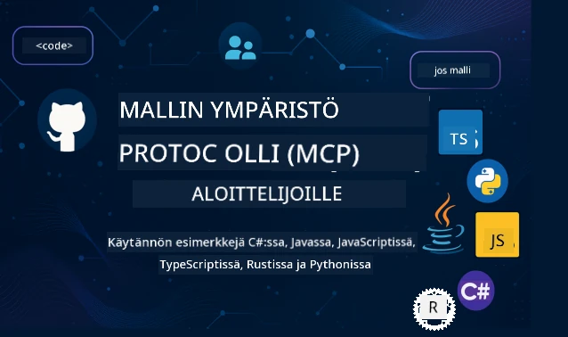

 

[](https://GitHub.com/microsoft/mcp-for-beginners/graphs/contributors)
[](https://GitHub.com/microsoft/mcp-for-beginners/issues)
[](https://GitHub.com/microsoft/mcp-for-beginners/pulls)
[](http://makeapullrequest.com)

[](https://GitHub.com/microsoft/mcp-for-beginners/watchers)
[](https://GitHub.com/microsoft/mcp-for-beginners/fork)
[](https://GitHub.com/microsoft/mcp-for-beginners/stargazers)


[](https://discord.gg/nTYy5BXMWG)

Seuraa näitä vaiheita aloittaaksesi näiden resurssien käytön:
1. **Forkkaa repositorio**: Klikkaa [](https://GitHub.com/microsoft/mcp-for-beginners/fork)
2. **Kloonaa repositorio**:   `git clone https://github.com/microsoft/mcp-for-beginners.git`
3. **Liity** [](https://discord.gg/nTYy5BXMWG)


### 🌐 Monikielinen tuki

#### Tuettu GitHub Actionin kautta (Automaattinen ja aina ajan tasalla)

<!-- CO-OP TRANSLATOR LANGUAGES TABLE START -->
[Arabic](../ar/README.md) | [Bengali](../bn/README.md) | [Bulgarian](../bg/README.md) | [Burmese (Myanmar)](../my/README.md) | [Chinese (Simplified)](../zh-CN/README.md) | [Chinese (Traditional, Hong Kong)](../zh-HK/README.md) | [Chinese (Traditional, Macau)](../zh-MO/README.md) | [Chinese (Traditional, Taiwan)](../zh-TW/README.md) | [Croatian](../hr/README.md) | [Czech](../cs/README.md) | [Danish](../da/README.md) | [Dutch](../nl/README.md) | [Estonian](../et/README.md) | [Finnish](./README.md) | [French](../fr/README.md) | [German](../de/README.md) | [Greek](../el/README.md) | [Hebrew](../he/README.md) | [Hindi](../hi/README.md) | [Hungarian](../hu/README.md) | [Indonesian](../id/README.md) | [Italian](../it/README.md) | [Japanese](../ja/README.md) | [Kannada](../kn/README.md) | [Korean](../ko/README.md) | [Lithuanian](../lt/README.md) | [Malay](../ms/README.md) | [Malayalam](../ml/README.md) | [Marathi](../mr/README.md) | [Nepali](../ne/README.md) | [Nigerian Pidgin](../pcm/README.md) | [Norwegian](../no/README.md) | [Persian (Farsi)](../fa/README.md) | [Polish](../pl/README.md) | [Portuguese (Brazil)](../pt-BR/README.md) | [Portuguese (Portugal)](../pt-PT/README.md) | [Punjabi (Gurmukhi)](../pa/README.md) | [Romanian](../ro/README.md) | [Russian](../ru/README.md) | [Serbian (Cyrillic)](../sr/README.md) | [Slovak](../sk/README.md) | [Slovenian](../sl/README.md) | [Spanish](../es/README.md) | [Swahili](../sw/README.md) | [Swedish](../sv/README.md) | [Tagalog (Filipino)](../tl/README.md) | [Tamil](../ta/README.md) | [Telugu](../te/README.md) | [Thai](../th/README.md) | [Turkish](../tr/README.md) | [Ukrainian](../uk/README.md) | [Urdu](../ur/README.md) | [Vietnamese](../vi/README.md)

> **Haluatko mieluummin kloonata paikallisesti?**
>
> Tässä repositoriossa on yli 50 kielen käännökset, mikä kasvattaa latauskokoa merkittävästi. Jos haluat kloonata ilman käännöksiä, käytä sparse checkout -toimintoa:
>
> **Bash / macOS / Linux:**
> ```bash
> git clone --filter=blob:none --sparse https://github.com/microsoft/mcp-for-beginners.git
> cd mcp-for-beginners
> git sparse-checkout set --no-cone '/*' '!translations' '!translated_images'
> ```
>
> **CMD (Windows):**
> ```cmd
> git clone --filter=blob:none --sparse https://github.com/microsoft/mcp-for-beginners.git
> cd mcp-for-beginners
> git sparse-checkout set --no-cone "/*" "!translations" "!translated_images"
> ```
>
> Näin saat kaiken tarvitsemasi kursin suorittamiseen paljon nopeammalla latauksella.
<!-- CO-OP TRANSLATOR LANGUAGES TABLE END -->

# 🚀 Model Context Protocol (MCP) -opintokokonaisuus aloittelijoille

## **Opettele MCP käytännön koodiesimerkkien avulla kielillä C#, Java, JavaScript, Rust, Python ja TypeScript**

## 🧠 Yleiskatsaus Model Context Protocol -opintokokonaisuuteen
Tervetuloa matkallesi Model Context Protocolin pariin! Jos olet joskus miettinyt, miten tekoälysovellukset kommunikoivat eri työkalujen ja palveluiden kanssa, olet nyt löytämässä elegantin ratkaisun, joka muuttaa tapaa, jolla kehittäjät rakentavat älykkäitä järjestelmiä.

Ajattele MCP:tä universaalina kääntäjänä tekoälysovelluksille – aivan kuten USB-portit antavat sinun liittää minkä tahansa laitteen tietokoneeseesi, MCP mahdollistaa tekoälymalleille yhteyden minkä tahansa työkalun tai palvelun kanssa standardoidulla tavalla. Olitpa rakentamassa ensimmäistä chatbotiasi tai työskentelemässä monimutkaisten tekoälytyönkulkujen parissa, MCP:n ymmärtäminen antaa sinulle voiman luoda kykenevämpiä ja joustavampia sovelluksia.

Tämä opintokokonaisuus on suunniteltu kärsivällisesti ja huolella sinun oppimismatkaasi varten. Aloitamme yksinkertaisista käsitteistä, jotka tunnet jo, ja rakennamme osaamistasi vähitellen käytännön harjoitusten avulla suosikkiohjelmointikielessäsi. Jokaisessa vaiheessa annetaan selkeitä selityksiä, käytännön esimerkkejä ja runsaasti kannustusta matkan varrella.

Kun olet suorittanut tämän matkan, sinulla on itsevarmuutta rakentaa omia MCP-palvelimia, integroida ne suosittuihin tekoälyalustoihin ja ymmärtää, miten tämä teknologia muovaa tekoälyn kehityksen tulevaisuutta. Aloitetaan tämä jännittävä seikkailu yhdessä!

### Viralliset dokumentaatiot ja spesifikaatiot

Tämä opintokokonaisuus noudattaa **MCP Specification 2025-11-25** (uusin vakaa julkaisu). MCP-spesifikaatio käyttää päivämääräpohjaista versionhallintaa (VVVV-KK-PP-muoto) varmistaakseen selkeän protokollan version seurannan.

Nämä resurssit muuttuvat arvokkaammiksi ymmärtäessäsi enemmän, mutta älä tunne painetta lukea kaikkea heti. Aloita niistä aiheista, jotka kiinnostavat sinua eniten!
- 📘 [MCP-dokumentaatio](https://modelcontextprotocol.io/) – Tämä on ensisijainen resurssisi askel askeleelta -opetusohjelmiin ja käyttäjän oppaisiin. Dokumentaatio on kirjoitettu aloittelijat mielessä, tarjoten selkeitä esimerkkejä, joita voit seurata omaan tahtiisi.
- 📜 [MCP-spesifikaatio](https://modelcontextprotocol.io/specification/2025-11-25) – Tämä on kattava viiteoppaasi. Kun etenet opintokokonaisuudessa, palaat tänne tarkistamaan yksityiskohtia ja tutustumaan edistyneempiin ominaisuuksiin.
- 📜 [MCP-spesifikaation versiointi](https://modelcontextprotocol.io/specification/versioning) – Sisältää tietoa protokollan versiohistoriasi ja siitä, miten MCP käyttää päivämääräpohjaista versiointia (VVVV-KK-PP-muoto).
- 🧑‍💻 [MCP GitHub-repositorio](https://github.com/modelcontextprotocol) – Täältä löydät SDK:t, työkalut ja koodiesimerkit useilla ohjelmointikielillä. Se on käytännön esimerkkien ja valmiiden komponenttien aarreaitta.
- 🌐 [MCP-yhteisö](https://github.com/orgs/modelcontextprotocol/discussions) – Liity oppijoiden ja kokeneiden kehittäjien keskusteluihin MCP:stä. Se on kannustava yhteisö, jossa kysymyksiä saa esittää ja tietoa jaetaan vapaasti.
  
## Oppimistavoitteet

Tämän opintokokonaisuuden lopussa tunnet olosi varmaksi ja innostuneeksi uusista taidoistasi. Tässä, mitä saavut:

• **Ymmärrä MCP:n perusteet**: Oivallat, mitä Model Context Protocol on ja miksi se mullistaa tapaa, jolla tekoälysovellukset toimivat yhdessä, analyyseillä ja esimerkeillä, jotka auttavat ymmärtämään.

• **Rakenna ensimmäinen MCP-palvelimesi**: Luo toimiva MCP-palvelin suosikkiohjelmointikielelläsi, aloittaen yksinkertaisista esimerkeistä ja kehittäen taitojasi askel askeleelta.

• **Yhdistä tekoälymallit oikeisiin työkaluihin**: Opit rakentamaan sillan tekoälymallien ja todellisten palveluiden välille, antaen sovelluksillesi tehokkaita uusia ominaisuuksia.

• **Toteuta turvallisuuden parhaat käytännöt**: Ymmärrät, miten pitää MCP-toteutuksesi turvallisina ja suojattuna, suojaamalla sekä sovelluksesi että käyttäjäsi.

• **Ota käyttöön luottavaisin mielin**: Tiedät, miten viedä MCP-projektisi kehityksestä tuotantoon, käyttäen toimivia käyttöönoton strategioita, jotka toimivat todellisessa maailmassa.

• **Liity MCP-yhteisöön**: Tulet osaksi kasvavaa kehittäjäyhteisöä, joka muovaa tekoälysovellusten kehityksen tulevaisuutta. 

## Välttämätön tausta

Ennen kuin sukelletaan MCP:n yksityiskohtiin, varmistetaan, että tunnet olosi mukavaksi joidenkin perustavanlaatuisten käsitteiden kanssa. Älä huoli, vaikka et olisikaan asiantuntija näissä asioissa – selitämme kaiken tarpeellisen matkan varrella!

### Protokollien ymmärtäminen (Perusta)

Ajattele protokollaa keskustelun sääntönä. Kun soitat ystävällesi, tiedätte molemmat sanoa "hei" vastatessanne, puhua vuorotellen ja sanoa "hei hei" lopuksi. Tietokoneohjelmat tarvitsevat samanlaisia sääntöjä kommunikoidakseen tehokkaasti.

MCP on protokolla – joukko sovittuja sääntöjä, jotka auttavat tekoälymalleja ja sovelluksia käymään tuottavia "keskusteluja" työkalujen ja palveluiden kanssa. Aivan kuten keskustelusäännöt tekevät ihmisten viestinnästä sujuvampaa, MCP tekee tekoälysovellusten viestinnästä paljon luotettavampaa ja tehokkaampaa.

### Asiakas-palvelin-suhteet (Miten ohjelmat toimivat yhdessä)

Käytät asiakas-palvelin-suhteita jo päivittäin! Kun käytät verkkoselainta (asiakas) vieraillaksesi verkkosivulla, yhdistyt verkkopalvelimeen, joka lähettää sinulle sivun sisällön. Selain tietää, miten pyytää tietoja, ja palvelin tietää, miten vastata.

MCP:ssä meillä on samanlainen suhde: tekoälymallit toimivat asiakkaina pyytäen tietoja tai toimintoja, kun MCP-palvelimet tarjoavat nämä mahdollisuudet. Se on kuin avulias avustaja (palvelin), jolta tekoäly voi pyytää suorittamaan tiettyjä tehtäviä.

### Miksi standardisointi on tärkeää (Miten asiat toimivat yhdessä)

Kuvittele, että jokainen autonvalmistaja käyttäisi eri muotoisia polttoainepumppuja – tarvitsisit erilaisen sovittimen jokaiselle autolle! Standardisointi tarkoittaa yhteisten lähestymistapojen sopimista, jotta asiat toimivat saumattomasti yhdessä.

MCP tarjoaa tämän standardisoinnin tekoälysovelluksille. Sen sijaan, että jokainen tekoälymalli tarvitsee erikoiskoodin työskennelläkseen jokaisen työkalun kanssa, MCP luo universaalin tavan niille kommunikoida. Tämä tarkoittaa, että kehittäjät voivat rakentaa työkalut kerran ja saada ne toimimaan monien erilaisten tekoälyjärjestelmien kanssa.

## 🧭 Oppimispolkusi yleiskatsaus

MCP-matkasi on huolellisesti rakenteellinen, jotta rakennat itseluottamustasi ja taitojasi asteittain. Jokainen vaihe esittelee uusia käsitteitä samalla kun vahvistaa jo opittua.

### 🌱 Perusvaihe: Perusteiden ymmärtäminen (Moduulit 0-2)

Täältä seikkailusi alkaa! Esittelemme sinulle MCP-käsitteet tutuin analyysein ja yksinkertaisin esimerkein. Ymmärrät, mitä MCP on, miksi se on olemassa ja miten se sopii tekoälyn kehityksen laajempaan maailmaan.

• **Moduuli 0 - Johdanto MCP:hen**: Aloitamme tutkimalla, mitä MCP on ja miksi se on niin tärkeä nykyaikaisille tekoälysovelluksille. Näet todellisia esimerkkejä MCP:n toiminnasta ja ymmärrät, miten se ratkaisee kehittäjien kohtaamia yleisiä ongelmia.

• **Moduuli 1 - Keskeiset käsitteet selitettynä**: Tässä opit MCP:n olennaiset rakennuspalikat. Käytämme runsaasti vertauksia ja visuaalisia esimerkkejä varmistaaksemme, että nämä käsitteet tuntuvat luonnollisilta ja ymmärrettäviltä.

• **Moduuli 2 - Turvallisuus MCP:ssä**: Turvallisuus saattaa kuulostaa pelottavalta, mutta näytämme, miten MCP sisältää sisäänrakennettuja turvaominaisuuksia ja opetamme parhaat käytännöt, jotka suojaavat sovelluksiasi alusta lähtien.

### 🔨 Rakentamisvaihe: Ensimmäisten toteutusten luominen (Moduuli 3)

Nyt alkaa oikea hauskuus! Saat käytännön kokemusta oikeiden MCP-palvelimien ja -asiakkaiden rakentamisesta. Älä huoli – aloitetaan yksinkertaisesti ja opastamme sinut jokaisen vaiheen läpi.
Tämä moduuli sisältää useita käytännön oppaita, joiden avulla voit harjoitella suosimallasi ohjelmointikielellä. Luot ensimmäisen palvelimesi, rakennat asiakkaan yhdistämään siihen, ja integroitu jopa suosittuihin kehitystyökaluihin kuten VS Codeen.

Jokainen opas sisältää täydelliset koodiesimerkit, vianetsintävinkkejä sekä selityksiä sille, miksi teemme tietyt suunnitteluratkaisut. Tämän vaiheen lopussa sinulla on toimivat MCP-toteutukset, joista voit olla ylpeä!

### 🚀 Kasvuvaihe: Edistyneet käsitteet ja käytännön sovellus (Moduulit 4–5)

Perusteiden hallitsemisen jälkeen olet valmis tutkimaan monimutkaisempia MCP-ominaisuuksia. Käymme läpi käytännön toteutusstrategioita, virheenkorjaustekniikoita ja edistyneitä aiheita kuten multimodaalisen tekoälyn integrointia.

Opit myös skaalamaan MCP-toteutuksiasi tuotantokäyttöön ja integroimaan pilvialustoihin kuten Azureen. Nämä moduulit valmistavat sinut rakentamaan MCP-ratkaisuja, jotka pystyvät vastaamaan todellisiin vaatimuksiin.

### 🌟 Hallintavaihe: Yhteisö ja erikoistuminen (Moduulit 6–11)

Viimeinen vaihe keskittyy liittymään MCP-yhteisöön ja erikoistumaan sinua eniten kiinnostaviin alueisiin. Opit osallistumaan avoimen lähdekoodin MCP-projekteihin, toteuttamaan edistyneitä todennusmalleja ja rakentamaan kattavia tietokantaintegroituja ratkaisuja.

Moduuli 11 ansaitsee erityisen maininnan – se on kokonainen 13-labin käytännön oppimispolku, joka opettaa rakentamaan tuotantovalmiita MCP-palvelimia PostgreSQL-integraatiolla. Se on kuin lopputyöprojekti, joka kokoaa kaiken oppimasi yhteen!

### 📚 Kokonainen opetussuunnitelma

| Moduuli | Aihe | Kuvaus | Linkki |
|--------|-------|-------------|------|
| **Moduulit 0–3: Perusteet** | | | |
| 00 | Johdanto MCP:hen | Mallikontekstiprotokollan yleiskatsaus ja sen merkitys tekoälyputkissa | [Lue lisää](./00-Introduction/README.md) |
| 01 | Ydinkäsitteiden selitys | Yksityiskohtainen selvitys MCP:n ydinkäsitteistä | [Lue lisää](./01-CoreConcepts/README.md) |
| 02 | Tietoturva MCP:ssä | Turvauhat ja parhaat käytännöt | [Lue lisää](./02-Security/README.md) |
| 03 | MCP:n aloittaminen | Ympäristön asennus, peruspalvelimet/asiakkaat, integraatiot | [Lue lisää](./03-GettingStarted/README.md) |
| **Moduuli 3: Ensimmäisen palvelimen ja asiakkaan rakentaminen** | | | |
| 3.1 | Ensimmäinen palvelin | Luo ensimmäinen MCP-palvelimesi | [Opas](./03-GettingStarted/01-first-server/README.md) |
| 3.2 | Ensimmäinen asiakas | Kehitä perus MCP-asiakas | [Opas](./03-GettingStarted/02-client/README.md) |
| 3.3 | Asiakas LLM:n kanssa | Integroi suuret kielimallit | [Opas](./03-GettingStarted/03-llm-client/README.md) |
| 3.4 | VS Code -integraatio | Käytä MCP-palvelimia VS Codessa | [Opas](./03-GettingStarted/04-vscode/README.md) |
| 3.5 | stdio-palvelin | Luo palvelimia stdio-siirrolla | [Opas](./03-GettingStarted/05-stdio-server/README.md) |
| 3.6 | HTTP-suoratoisto | Toteuta HTTP-suoratoisto MCP:ssä | [Opas](./03-GettingStarted/06-http-streaming/README.md) |
| 3.7 | AI-työkalupakki | Käytä AI-työkalupakkia MCP:n kanssa | [Opas](./03-GettingStarted/07-aitk/README.md) |
| 3.8 | Testaus | Testaa MCP-palvelintoteutustasi | [Opas](./03-GettingStarted/08-testing/README.md) |
| 3.9 | Julkaisu | Julkaise MCP-palvelimet tuotantoon | [Opas](./03-GettingStarted/09-deployment/README.md) |
| 3.10 | Edistynyt palvelimen käyttö | Käytä edistyneitä palvelimia edistyneiden ominaisuuksien hyödyntämiseen ja parannettuun arkkitehtuuriin | [Opas](./03-GettingStarted/10-advanced/README.md) |
| 3.11 | Yksinkertainen todennus | Luku, joka näyttää todennuksen alusta alkaen ja RBAC:n | [Opas](./03-GettingStarted/11-simple-auth/README.md) |
| 3.12 | MCP-isännät | Konfiguroi Claude Desktop, Cursor, Cline ja muut MCP-isännät | [Opas](./03-GettingStarted/12-mcp-hosts/README.md) |
| 3.13 | MCP-tarkastaja | Vianetsintä ja testaus MCP-palvelimille Inspector-työkalulla | [Opas](./03-GettingStarted/13-mcp-inspector/README.md) |
| **Moduulit 4–5: Käytännön ja edistynyt** | | | |
| 04 | Käytännön toteutus | SDK:t, virheenkorjaus, testaus, uudelleenkäytettävät prompt-templatet | [Lue lisää](./04-PracticalImplementation/README.md) |
| 4.1 | Sivutus | Käsittele suuria tulosjoukkoja kursoripohjaisella sivutuksella | [Opas](./04-PracticalImplementation/pagination/README.md) |
| 05 | Edistyneet MCP-aiheet | Multimodaalinen tekoäly, skaalaus, yrityskäyttö | [Lue lisää](./05-AdvancedTopics/README.md) |
| 5.1 | Azure-integraatio | MCP:n integraatio Azureen | [Opas](./05-AdvancedTopics/mcp-integration/README.md) |
| 5.2 | Multimodaalisuus | Työskentely useiden modaliteettien kanssa | [Opas](./05-AdvancedTopics/mcp-multi-modality/README.md) |
| 5.3 | OAuth2 Demo | Toteuta OAuth2-todennus | [Opas](./05-AdvancedTopics/mcp-oauth2-demo/README.md) |
| 5.4 | Juurikontekstit | Ymmärrä ja toteuta juurikontekstit | [Opas](./05-AdvancedTopics/mcp-root-contexts/README.md) |
| 5.5 | Reititys | MCP-reititystrategiat | [Opas](./05-AdvancedTopics/mcp-routing/README.md) |
| 5.6 | Otanta | Otantatekniikat MCP:ssä | [Opas](./05-AdvancedTopics/mcp-sampling/README.md) |
| 5.7 | Skaalaus | Skaalaa MCP-toteutuksia | [Opas](./05-AdvancedTopics/mcp-scaling/README.md) |
| 5.8 | Tietoturva | Edistyneet tietoturva-asiat | [Opas](./05-AdvancedTopics/mcp-security/README.md) |
| 5.9 | Verkkohaku | Toteuta verkkohakutoiminnot | [Opas](./05-AdvancedTopics/web-search-mcp/README.md) |
| 5.10 | Reaaliaikainen suoratoisto | Rakenna reaaliaikaisen suoratoiston toiminnallisuus | [Opas](./05-AdvancedTopics/mcp-realtimestreaming/README.md) |
| 5.11 | Reaaliaikahaku | Toteuta reaaliaikahaku | [Opas](./05-AdvancedTopics/mcp-realtimesearch/README.md) |
| 5.12 | Entra ID -todennus | Todennus Microsoft Entra ID:llä | [Opas](./05-AdvancedTopics/mcp-security-entra/README.md) |
| 5.13 | Foundry-integraatio | Integroi Azure AI Foundryyn | [Opas](./05-AdvancedTopics/mcp-foundry-agent-integration/README.md) |
| 5.14 | Kontekstisuunnittelu | Tekniikat tehokkaaseen kontekstisuunnitteluun | [Opas](./05-AdvancedTopics/mcp-contextengineering/README.md) |
| 5.15 | MCP-kustomoitu siirto | Räätälöidyt siirtototeutukset | [Opas](./05-AdvancedTopics/mcp-transport/README.md) |
| 5.16 | Protokollan ominaisuudet | Edistymisilmoitukset, peruutus, resurssimallit | [Opas](./05-AdvancedTopics/mcp-protocol-features/README.md) |
| **Moduulit 6–10: Yhteisö ja parhaat käytännöt** | | | |
| 06 | Yhteisön panokset | Kuinka osallistua MCP-ekosysteemiin | [Opas](./06-CommunityContributions/README.md) |
| 07 | Oivallukset varhaisesta käyttöönotosta | Todelliset toteutustarinat | [Opas](./07-LessonsfromEarlyAdoption/README.md) |
| 08 | Parhaat käytännöt MCP:lle | Suorituskyky, vikankestävyys, resilienssi | [Opas](./08-BestPractices/README.md) |
| 09 | MCP-tapaustutkimukset | Käytännön toteutusesimerkit | [Opas](./09-CaseStudy/README.md) |
| 10 | Käytännön työpaja | MCP-palvelimen rakentaminen AI-työkalupakilla | [Lab](./10-StreamliningAIWorkflowsBuildingAnMCPServerWithAIToolkit/README.md) |
| **Moduuli 11: MCP-palvelimen käytännön laboratoriot** | | | |
| 11 | MCP-palvelimen tietokantaintegraatio | Kattava 13-labin käytännön oppimispolku PostgreSQL-integraatiolle | [Labit](./11-MCPServerHandsOnLabs/README.md) |
| 11.1 | Johdanto | MCP:n yleiskatsaus tietokantaintegraatiolla ja vähittäiskaupan analytiikkatapaus | [Lab 00](./11-MCPServerHandsOnLabs/00-Introduction/README.md) |
| 11.2 | Ydinarkkitehtuuri | MCP-palvelimen arkkitehtuurin, tietokantakerrosten ja tietoturvamallien ymmärtäminen | [Lab 01](./11-MCPServerHandsOnLabs/01-Architecture/README.md) |
| 11.3 | Tietoturva & monivuokraus | Rivitason tietoturva, todennus ja monivuokraustietojen käyttöoikeudet | [Lab 02](./11-MCPServerHandsOnLabs/02-Security/README.md) |
| 11.4 | Ympäristön asennus | Kehitysympäristön, Dockerin, Azure-resurssien asennus | [Lab 03](./11-MCPServerHandsOnLabs/03-Setup/README.md) |
| 11.5 | Tietokantasuunnittelu | PostgreSQL:n asennus, vähittäiskaupan skeema ja esimerkkidata | [Lab 04](./11-MCPServerHandsOnLabs/04-Database/README.md) |
| 11.6 | MCP-palvelintoteutus | FastMCP-palvelimen rakentaminen tietokantaintegraatiolla | [Lab 05](./11-MCPServerHandsOnLabs/05-MCP-Server/README.md) |
| 11.7 | Työkalujen kehitys | Tietokantakyselytyökalujen ja skeeman tutkimisen luonti | [Lab 06](./11-MCPServerHandsOnLabs/06-Tools/README.md) |
| 11.8 | Semanttinen haku | Vektorien upotusten toteutus Azure OpenAI:lla ja pgvectorilla | [Lab 07](./11-MCPServerHandsOnLabs/07-Semantic-Search/README.md) |
| 11.9 | Testaus & virheenkorjaus | Testausstrategiat, virheenkorjaustyökalut ja varmistusmenetelmät | [Lab 08](./11-MCPServerHandsOnLabs/08-Testing/README.md) |
| 11.10 | VS Code -integraatio | VS Code MCP -integraation ja AI Chat -käytön määrittäminen | [Lab 09](./11-MCPServerHandsOnLabs/09-VS-Code/README.md) |
| 11.11 | Julkaisustrategiat | Docker-julkaisu, Azure Container Apps ja skaalausnäkökohdat | [Lab 10](./11-MCPServerHandsOnLabs/10-Deployment/README.md) |
| 11.12 | Seuranta | Application Insights, lokitus ja suorituskyvyn seuranta | [Lab 11](./11-MCPServerHandsOnLabs/11-Monitoring/README.md) |
| 11.13 | Parhaat käytännöt | Suorituskyvyn optimointi, tietoturvan vahvistus ja tuotantovinkit | [Lab 12](./11-MCPServerHandsOnLabs/12-Best-Practices/README.md) |

### 💻 Esimerkkikoodiprojektit

Yksi mielenkiintoisimmista MCP:n oppimisen osista on nähdä kooditaitojesi kehittyminen asteittain. Olemme suunnitelleet koodiesimerkkimme aluksi yksinkertaisiksi, ja ne kehittyvät monimutkaisemmiksi ymmärryksesi syventyessä. Näin esittelemme käsitteet – koodi on helppotajuista mutta havainnollistaa aidosti MCP-periaatteita; ymmärrät paitsi mitä koodi tekee, myös miksi se on rakennettu näin ja miten se sopii laajempiin MCP-sovelluksiin.

#### Perus MCP-laskin-esimerkit

| Kieli | Kuvaus | Linkki |
|----------|-------------|------|
| C# | MCP-palvelin-esimerkki | [Katso koodi](./03-GettingStarted/samples/csharp/README.md) |
| Java | MCP-laskin | [Katso koodi](./03-GettingStarted/samples/java/calculator/README.md) |
| JavaScript | MCP-demo | [Katso koodi](./03-GettingStarted/samples/javascript/README.md) |
| Python | MCP-palvelin | [Katso koodi](../../03-GettingStarted/samples/python/mcp_calculator_server.py) |
| TypeScript | MCP-esimerkki | [Katso koodi](./03-GettingStarted/samples/typescript/README.md) |
| Rust | MCP-esimerkki | [Katso koodi](./03-GettingStarted/samples/rust/README.md) |

#### Edistyneet MCP-toteutukset

| Kieli | Kuvaus | Linkki |
|----------|-------------|------|
| C# | Edistynyt esimerkki | [Katso koodi](./04-PracticalImplementation/samples/csharp/README.md) |
| Java Springillä | Container App -esimerkki | [Katso koodi](./04-PracticalImplementation/samples/java/containerapp/README.md) |
| JavaScript | Edistynyt esimerkki | [Katso koodi](./04-PracticalImplementation/samples/javascript/README.md) |
| Python | Monimutkainen toteutus | [Katso koodi](./04-PracticalImplementation/samples/python/README.md) |
| TypeScript | Container-esimerkki | [Katso koodi](./04-PracticalImplementation/samples/typescript/README.md) |


## 🎯 MCP:n opettelun edellytykset

Jotta saat tästä opetussuunnitelmasta parhaan hyödyn, sinun tulisi hallita:

- Perustiedot ohjelmoinnista vähintään yhdellä seuraavista kielistä: C#, Java, JavaScript, Python tai TypeScript
- Asiakas-palvelin-mallin ja API:en ymmärrys
- Tuntemusta REST:stä ja HTTP-konsepteista
- (Valinnainen) Tausta tekoäly-/koneoppimis-käsitteissä

- Osallistuminen yhteisöjemme keskusteluihin tukea varten

## 📚 Opas ja resurssit

Tämä repositorio sisältää useita resursseja, jotka auttavat sinua navigoimaan ja oppimaan tehokkaasti:

### Opas
Laaja [Opas](./study_guide.md) on saatavilla auttamaan sinua navigoimaan tässä repossa tehokkaasti. Tämä visuaalinen opetussuunnitelmakartta näyttää, miten kaikki aiheet liittyvät toisiinsa, ja antaa ohjeita siitä, miten esimerkkiprojekteja käytetään tehokkaasti. Se on erityisen hyödyllinen, jos olet visuaalinen oppija, joka haluaa nähdä kokonaisuuden.

Opas sisältää:
- Visuaalisen opetussuunnitelmakartan, joka näyttää kaikki käsitellyt aiheet
- Yksityiskohtaisen jaon jokaisesta repositorion osiosta
- Ohjeita esimerkkiprojektien käyttämiseen
- Suositellut oppimispolut eri taitotasoille
- Lisäresursseja oppimismatkasi tukemiseksi

### Muutokset

Pidämme yllä yksityiskohtaista [Muutoksenhallintaa](./changelog.md), joka seuraa kaikkia merkittäviä päivityksiä opetussuunnitelmamateriaaleihin, jotta pysyt ajan tasalla uusimmista parannuksista ja lisäyksistä.
- Uudet sisältölisäykset
- Rakenteelliset muutokset
- Ominaisuuksien parannukset
- Dokumentaation päivitykset

## 🛠️ Kuinka käyttää tätä opetussuunnitelmaa tehokkaasti

Jokainen tämän oppaan oppitunti sisältää:

1. Selkeät selitykset MCP-konsepteista  
2. Live-koodiesimerkkejä useilla kielillä  
3. Harjoituksia todellisten MCP-sovellusten rakentamiseen  
4. Lisäresursseja edistyneemmille oppijoille

### Opitaan MCP:tä C#:lla - Opetusohjelmasarja
Opitaan Model Context Protocol (MCP), huipputeknologiaan perustuva kehys, joka standardisoi vuorovaikutukset tekoälymallien ja asiakasohjelmien välillä. Tämän aloittelijaystävällisen sessioon aikana esittelemme sinut MCP:hen ja ohjaamme sinut ensimmäisen MCP-palvelimesi luomisessa.
#### C#: [https://aka.ms/letslearnmcp-csharp](https://aka.ms/letslearnmcp-csharp)
#### Java: [https://aka.ms/letslearnmcp-java](https://aka.ms/letslearnmcp-java)
#### JavaScript: [https://aka.ms/letslearnmcp-javascript](https://aka.ms/letslearnmcp-javascript)
#### Python: [https://aka.ms/letslearnmcp-python](https://aka.ms/letslearnmcp-python)

## 🎓 MCP-matka alkaa

Onneksi olkoon! Olet juuri ottanut ensimmäisen askeleen jännittävässä matkassa, joka laajentaa ohjelmointitaitojasi ja yhdistää sinut tekoälyn kehityksen huippuun.

### Mitä olet jo saavuttanut

Lukemalla tämän johdannon olet jo alkanut rakentaa MCP-tietopohjaasi. Ymmärrät, mitä MCP on, miksi se on tärkeä, ja miten tämä opetussuunnitelma tukee oppimismatkaasi. Se on merkittävä saavutus ja alku asiantuntemuksellesi tässä tärkeässä teknologiassa.

### Seikkailu edessä

Kun etenet moduuleissa, muista että jokainen asiantuntija on ollut joskus aloittelija. Nyt vaikeilta vaikuttavat käsitteet tulevat toiseksi luonnoksesi kautta harjoittelun ja soveltamisen myötä. Jokainen pieni askel rakentaa kohti voimakkaita kykyjä, jotka palvelevat sinua koko kehitysuran ajan.

### Tukiverkostosi

Liityt oppijoiden ja asiantuntijoiden yhteisöön, joka on intohimoisesti MCP:tä kohtaan ja haluaa auttaa muita menestymään. Olipa sinulla jokin ongelma koodaushaasteessa tai haluat jakaa läpimurron, yhteisö tukee sinua matkallasi.

Jos jumitut tai sinulla on kysymyksiä tekoälysovellusten rakentamisesta, liity muiden oppijoiden ja kokeneiden kehittäjien keskusteluihin MCP:hen liittyen. Se on tukevainen yhteisö, jossa kysymykset ovat tervetulleita ja tieto jaetaan vapaasti.

[](https://discord.gg/nTYy5BXMWG)

Jos sinulla on palautetta tuotteesta tai kohtaat virheitä rakentaessasi, vieraile:

[](https://aka.ms/foundry/forum)

### Valmis aloittamaan?

MCP-seikkailusi alkaa nyt! Aloita Moduulista 0 päästäksesi käsiksi ensimmäisiin käytännön MCP-kokemuksiisi, tai tutustu esimerkkiprojekteihin nähdäksesi, mitä tulet rakentamaan. Muista - jokainen asiantuntija aloitti tasan tästä, ja kärsivällisyydellä ja harjoittelulla sinua hämmästyttää, mitä voit saavuttaa.

Tervetuloa Model Context Protocol -kehityksen maailmaan. Rakennetaan jotain upeaa yhdessä!

## 🤝 Osallistuminen oppimisyhteisöön

Tämä opetussuunnitelma vahvistuu sinun kaltaisten oppijoiden panosten kautta! Korjaatpa sitten kirjoitusvirheen, ehdotat selkeämpää selitystä tai lisäät uuden esimerkin, panoksesi auttavat muita aloittelijoita menestymään.

Kiitos Microsoftin arvostetulle ammattilaiselle [Shivam Goyal](https://www.linkedin.com/in/shivam2003/) koodiesimerkkien tarjoamisesta.

Panostusprosessi on suunniteltu tervetulleeksi ja kannustavaksi. Useimmat panokset vaativat Osallistumis­lupa­sopimuksen (CLA), mutta automatisoidut työkalut opastavat sinut prosessin läpi sujuvasti.

## 📜 Avoimen lähdekoodin oppiminen

Koko opetussuunnitelma on saatavilla MIT-lisenssillä [LICENSE](../../LICENSE), mikä tarkoittaa, että voit käyttää, muokata ja jakaa sitä vapaasti. Tämä tukee tehtäväämme tehdä MCP-tietämys saatavaksi kehittäjille kaikkialla.
## 🤝 Panostusohjeet

Tämä projekti toivottaa tervetulleiksi panokset ja ehdotukset. Useimmat panokset edellyttävät, että hyväksyt Osallistumislupasopimuksen (CLA), jossa vahvistat, että sinulla on oikeus ja todellisuudessa myönnät meille oikeudet käyttää panostasi. Lisätietoja saat osoitteesta <https://cla.opensource.microsoft.com>.

Kun lähetät vetopyynnön, CLA-botti määrittää automaattisesti, tarvitseeko sinun toimittaa CLA ja merkitsee PR:n asianmukaisesti (esim. tilantarkistus, kommentti). Noudata vain botin antamia ohjeita. Tätä tarvitsee tehdä vain kerran kaikissa CLA:ta käyttäviä koodeja.

Tämä projekti on ottanut käyttöön [Microsoftin avoimen lähdekoodin käytösohjeet](https://opensource.microsoft.com/codeofconduct/).
Lisätietoja löytyy [Käyttäytymisohjeiden UKK:sta](https://opensource.microsoft.com/codeofconduct/faq/) tai ota yhteyttä osoitteeseen [opencode@microsoft.com](mailto:opencode@microsoft.com) lisäkysymyksissä tai kommenteissa.

---

*Valmiina aloittamaan MCP-matkasi? Aloita [Module 00 - Johdatus MCP:hen](./00-Introduction/README.md) ja ota ensimmäiset askeleesi Model Context Protocol -kehityksen maailmaan!*


## 🎒 Muita kursseja
Tiimimme tuottaa muitakin kursseja! Tutustu:

<!-- CO-OP TRANSLATOR OTHER COURSES START -->
### LangChain
[](https://aka.ms/langchain4j-for-beginners)
[](https://aka.ms/langchainjs-for-beginners?WT.mc_id=m365-94501-dwahlin)
[](https://github.com/microsoft/langchain-for-beginners?WT.mc_id=m365-94501-dwahlin)
---

### Azure / Edge / MCP / Agentit
[](https://github.com/microsoft/AZD-for-beginners?WT.mc_id=academic-105485-koreyst)
[](https://github.com/microsoft/edgeai-for-beginners?WT.mc_id=academic-105485-koreyst)
[](https://github.com/microsoft/mcp-for-beginners?WT.mc_id=academic-105485-koreyst)
[](https://github.com/microsoft/ai-agents-for-beginners?WT.mc_id=academic-105485-koreyst)

---
 
### Generatiivisen tekoälyn sarja
[](https://github.com/microsoft/generative-ai-for-beginners?WT.mc_id=academic-105485-koreyst)
[-9333EA?style=for-the-badge&labelColor=E5E7EB&color=9333EA)](https://github.com/microsoft/Generative-AI-for-beginners-dotnet?WT.mc_id=academic-105485-koreyst)
[-C084FC?style=for-the-badge&labelColor=E5E7EB&color=C084FC)](https://github.com/microsoft/generative-ai-for-beginners-java?WT.mc_id=academic-105485-koreyst)
[-E879F9?style=for-the-badge&labelColor=E5E7EB&color=E879F9)](https://github.com/microsoft/generative-ai-with-javascript?WT.mc_id=academic-105485-koreyst)

---
 
### Perusoppiminen
[](https://aka.ms/ml-beginners?WT.mc_id=academic-105485-koreyst)
[](https://aka.ms/datascience-beginners?WT.mc_id=academic-105485-koreyst)
[](https://aka.ms/ai-beginners?WT.mc_id=academic-105485-koreyst)
[](https://github.com/microsoft/Security-101?WT.mc_id=academic-96948-sayoung)
[](https://aka.ms/webdev-beginners?WT.mc_id=academic-105485-koreyst)
[](https://aka.ms/iot-beginners?WT.mc_id=academic-105485-koreyst)
[](https://github.com/microsoft/xr-development-for-beginners?WT.mc_id=academic-105485-koreyst)

---
 
### Copilot-sarja
[](https://aka.ms/GitHubCopilotAI?WT.mc_id=academic-105485-koreyst)
[](https://github.com/microsoft/mastering-github-copilot-for-dotnet-csharp-developers?WT.mc_id=academic-105485-koreyst)
[](https://github.com/microsoft/CopilotAdventures?WT.mc_id=academic-105485-koreyst)
<!-- CO-OP KÄÄNTÄJÄ MUUT KURSSIT LOPPU -->

---

<!-- CO-OP TRANSLATOR DISCLAIMER START -->
**Vastuuvapauslauseke**:  
Tämä asiakirja on käännetty käyttämällä tekoälypohjaista käännöspalvelua [Co-op Translator](https://github.com/Azure/co-op-translator). Vaikka pyrimme tarkkuuteen, otathan huomioon, että konekäännökset saattavat sisältää virheitä tai epätarkkuuksia. Alkuperäinen asiakirja sen alkuperäiskielellä on pätevä ja virallinen lähde. Tärkeiden tietojen osalta suosittelemme ammattimaista ihmiskäännöstä. Emme ole vastuussa tämän käännöksen käytöstä aiheutuvista väärinymmärryksistä tai tulkinnoista.
<!-- CO-OP TRANSLATOR DISCLAIMER END -->