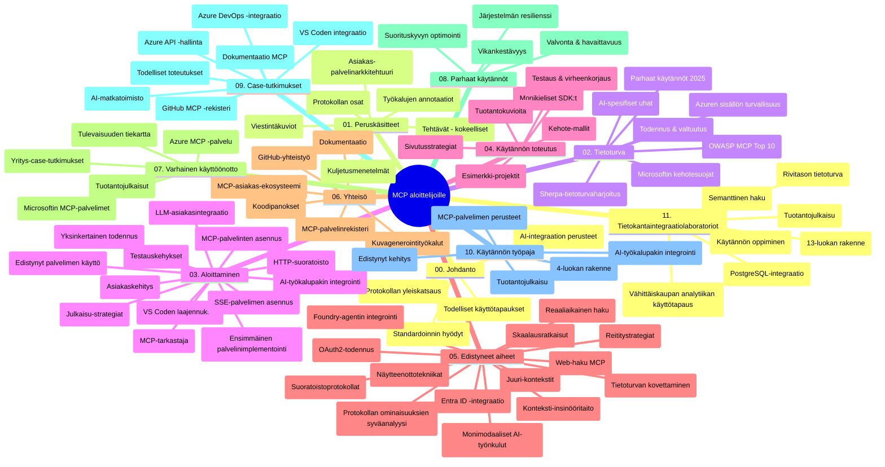

# Model Context Protocol (MCP) aloittelijoille - Opas

Tämä opas tarjoaa yleiskatsauksen "Model Context Protocol (MCP) aloittelijoille" -oppimateriaalin hakemiston rakenteesta ja sisällöstä. Käytä tätä opasta navigoidaksesi hakemistossa tehokkaasti ja hyödyntääksesi saatavilla olevia resursseja parhaalla mahdollisella tavalla.

## Hakemiston yleiskatsaus

Model Context Protocol (MCP) on standardoitu kehys tekoälymallien ja asiakasohjelmien välisille vuorovaikutuksille. Alun perin Anthropicin luoma MCP on nyt laajemman MCP-yhteisön ylläpitämä virallisen GitHub-organisaation kautta. Tämä hakemisto tarjoaa kattavan opetussuunnitelman, jossa on käytännön koodiesimerkkejä C#:lla, Javalla, JavaScripillä, Pythonilla ja TypeScriptillä. Se on suunnattu tekoälykehittäjille, järjestelmäarkkitehdeille ja ohjelmistosuunnittelijoille.

## Visuaalinen opetussuunnitelmakartta

## Hakemiston rakenne

Hakemisto on järjestetty yksitoistaen pääosaan, jotka keskittyvät eri MCP:n osa-alueisiin:

1. **Johdanto (00-Introduction/)**
   - Model Context Protocolin yleiskatsaus
   - Miksi standardointi on tärkeää tekoälyputkissa
   - Käytännön käyttötapaukset ja hyödyt

2. **Keskeiset käsitteet (01-CoreConcepts/)**
   - Asiakas-palvelinarkkitehtuuri
   - Protokollan keskeiset komponentit
   - Viestintämallit MCP:ssä

3. **Tietoturva (02-Security/)**
   - Tietoturvauhat MCP-pohjaisissa järjestelmissä
   - Parhaat käytännöt toteutusten suojaamiseen
   - Autentikointi- ja valtuutusstrategiat
   - **Kattava tietoturvadokumentaatio**:
     - MCP Tietoturvan parhaat käytännöt 2025
     - Azure Content Safety -toteutusopas
     - MCP:n tietoturvakontrollit ja -tekniikat
     - MCP:n parhaat käytännöt pikaopas
   - **Tärkeimmät tietoturva-aiheet**:
     - Kehotteen injektointi ja työkalujen myrkytys
     - Istunnon kaappaus ja hämmentynyt apulainen -ongelmat
     - Tunnusten läpivientikohdat
     - Liialliset oikeudet ja pääsynhallinta
     - Toimitusketjun tietoturva tekoälykomponenteille
     - Microsoft Prompt Shields -integraatio

4. **Aloittaminen (03-GettingStarted/)**
   - Ympäristön määritys ja konfigurointi
   - Perus MCP-palvelimien ja asiakasohjelmien luominen
   - Integraatio olemassa oleviin sovelluksiin
   - Sisältää osiot:
     - Ensimmäisen palvelimen toteutus
     - Asiakasohjelman kehitys
     - LLM-asiakasintegraatio
     - VS Code -integraatio
     - Server-Sent Events (SSE) palvelin
     - Edistynyt palvelimen käyttö
     - HTTP-suoratoisto
     - AI Toolkit -integraatio
     - Testausstrategiat
     - Julkaisusuositukset

5. **Käytännön toteutus (04-PracticalImplementation/)**
   - SDK:iden käyttö eri ohjelmointikielillä
   - Virheenkorjaus, testaus ja validointitekniikat
   - Uudelleenkäytettävien kehotepohjien ja työnkulkujen luominen
   - Esimerkkiprojekteja toteutuksineen

6. **Edistyneet aiheet (05-AdvancedTopics/)**
   - Kontekstisuunnittelu- ja tekniikat
   - Foundry-agenttien integraatio
   - Monimodaaliset tekoälytyönkulut
   - OAuth2-autentikointidemonstraatiot
   - Reaaliaikaiset hakutoiminnot
   - Reaaliaikainen suoratoisto
   - Juurikontekstien toteutus
   - Reititysstrategiat
   - Otannan tekniikat
   - Skaalausmenetelmät
   - Tietoturvaan liittyvät näkökohdat
   - Entra ID -tietoturvaintegraatio
   - Verkkohaku-integraatio

7. **Yhteisön panokset (06-CommunityContributions/)**
   - Kuinka osallistua koodilla ja dokumentaatiolla
   - Yhteistyö GitHubin kautta
   - Yhteisölähtöiset parannukset ja palaute
   - Erilaisten MCP-asiakkaiden käyttö (Claude Desktop, Cline, VSCode)
   - Työskentely suosittujen MCP-palvelimien kanssa, mukaan lukien kuvanluonti

8. **Opit varhaisesta käyttöönotosta (07-LessonsfromEarlyAdoption/)**
   - Käytännön toteutukset ja menestystarinat
   - MCP-pohjaisten ratkaisujen rakentaminen ja käyttöönotto
   - Suuntaukset ja tulevaisuuden tiekartta
   - **Microsoft MCP -palvelimet -opas**: Kattava opas 10 tuotantovalmiille Microsoft MCP -palvelimelle, mukaan lukien:
     - Microsoft Learn Docs MCP -palvelin
     - Azure MCP -palvelin (yli 15 erikoistunutta liitintä)
     - GitHub MCP -palvelin
     - Azure DevOps MCP -palvelin
     - MarkItDown MCP -palvelin
     - SQL Server MCP -palvelin
     - Playwright MCP -palvelin
     - Dev Box MCP -palvelin
     - Azure AI Foundry MCP -palvelin
     - Microsoft 365 Agents Toolkit MCP -palvelin

9. **Parhaat käytännöt (08-BestPractices/)**
   - Suorituskyvyn hienosäätö ja optimointi
   - Vikasietoisten MCP-järjestelmien suunnittelu
   - Testaus- ja resilienssistrategiat

10. **Tapaustutkimukset (09-CaseStudy/)**
    - **Seitsemän kattavaa tapaustutkimusta**, jotka osoittavat MCP:n monipuolisuuden erilaisissa skenaarioissa:
    - **Azure AI Travel Agents**: Moniagenttiorganisointi Azure OpenAI:n ja AI Searchin avulla
    - **Azure DevOps -integraatio**: Työnkulkujen automatisointi YouTube-datan päivityksillä
    - **Reaaliaikainen dokumenttien haku**: Python-konsoliasiakas, jossa HTTP-suoratoisto
    - **Interaktiivinen opintosuunnitelman generointi**: Chainlit-verkkosovellus keskustelevaa tekoälyä hyödyntäen
    - **Keskitin dokumentaatiossa**: VS Code -integraatio GitHub Copilotin työnkulkuihin
    - **Azure API -hallinta**: Yritysrajapinnan integrointi MCP-palvelimen luomisen avulla
    - **GitHub MCP -rekisteri**: Ekosysteemin kehitys ja agenttipohjainen integraatioalusta
    - Toteutusesimerkkejä, jotka kattavat yritysin­tegraation, kehittäjien tuottavuuden ja ekosysteemin kehityksen

11. **Käytännön työpaja (10-StreamliningAIWorkflowsBuildingAnMCPServerWithAIToolkit/)**
    - Kattava käytännön työpaja, joka yhdistää MCP:n AI Toolkitin kanssa
    - Älykkäiden sovellusten rakentaminen, jotka yhdistävät tekoälymallit todellisiin työkaluihin
    - Käytännön moduulit, joissa käydään läpi perusteet, räätälöity palvelin­kehitys ja tuotanto­käyttöönotto
    - **Työpajarakenteet**:
      - Lab 1: MCP-palvelimen perusteet
      - Lab 2: Edistynyt MCP-palvelimen kehitys
      - Lab 3: AI Toolkit -integraatio
      - Lab 4: Tuotantokäyttöönotto ja skaalaus
    - Lab-pohjainen oppimistapa vaiheittaisine ohjeineen

12. **MCP-palvelimen tietokanta-integraatiolaboratoriot (11-MCPServerHandsOnLabs/)**
    - **Kattava 13-labran oppimispolku** tuotantovalmiiden MCP-palvelimien rakentamiseen PostgreSQL-integraatiolla
    - **Käytännön vähittäiskaupan analytiikan toteutus** Zava Retail -käyttötapausta hyödyntäen
    - **Yritystason mallit**, kuten rivitasoinen tietoturva (RLS), semanttinen haku ja moni­asiakas­tietojen pääsy
    - **Täydellinen lab-rakenne**:
      - **Labit 00-03: Perusteet** - Johdanto, arkkitehtuuri, tietoturva, ympäristön määrittely
      - **Labit 04-06: MCP-palvelimen rakentaminen** - Tietokannan suunnittelu, MCP-palvelimen toteutus, työkalujen kehitys
      - **Labit 07-09: Edistyneet ominaisuudet** - Semanttinen haku, testaus & virheenkorjaus, VS Code -integraatio
      - **Labit 10-12: Tuotanto & parhaat käytännöt** - Julkaisu, valvonta, optimointi
    - **Käytetyt teknologiat**: FastMCP-kehys, PostgreSQL, Azure OpenAI, Azure Container Apps, Application Insights
    - **Oppimistavoitteet**: Tuotantovalmiit MCP-palvelimet, tietokantaintegraatiomallit, tekoälyllä tehostettu analytiikka, yritystason tietoturva

## Lisäresurssit

Hakemistossa on tukiresursseja:

- **Kuvakansio**: Sisältää kaavioita ja kuvituksia, joita käytetään opetussuunnitelmassa
- **Käännökset**: Monikielinen tuki automatisoiduilla dokumentaatiokäännöksillä
- **Viralliset MCP-resurssit**:
  - [MCP-dokumentaatio](https://modelcontextprotocol.io/)
  - [MCP-määritys](https://spec.modelcontextprotocol.io/)
  - [MCP GitHub -repositorio](https://github.com/modelcontextprotocol)

## Kuinka käyttää tätä hakemistoa

1. **Järjestelmällinen opiskelu**: Seuraa lukuja järjestyksessä (00–11) rakenteellisen oppimiskokemuksen saamiseksi.
2. **Kielikohtainen painotus**: Jos olet kiinnostunut tietystä ohjelmointikielestä, tutustu näytekansioihin kyseisen kielen toteutusten löytämiseksi.
3. **Käytännön toteutus**: Aloita "Aloittaminen" -osiosta asettaaksesi ympäristön ja luodaksesi ensimmäisen MCP-palvelimesi ja -asiakkaasi.
4. **Edistynyt tutkiminen**: Kun perusteet ovat hallussa, sukeltaudu edistyneisiin aiheisiin laajentaaksesi tietämystäsi.
5. **Yhteisön osallistuminen**: Liity MCP-yhteisöön GitHub-keskustelujen ja Discord-kanavien kautta yhdistääksesi asiantuntijoiden ja muiden kehittäjien kanssa.

## MCP-asiakkaat ja työkalut

Opetussuunnitelma kattaa erilaisia MCP-asiakkaita ja työkaluja:

1. **Viralliset asiakkaat**:
   - Visual Studio Code
   - MCP Visual Studio Codessa
   - Claude Desktop
   - Claude VSCodessa
   - Claude API

2. **Yhteisön asiakkaat**:
   - Cline (päätteeseen perustuva)
   - Cursor (koodieditori)
   - ChatMCP
   - Windsurf

3. **MCP:n hallintatyökalut**:
   - MCP CLI
   - MCP Manager
   - MCP Linker
   - MCP Router

## Suosittuja MCP-palvelimia

Hakemisto esittelee useita MCP-palvelimia, mukaan lukien:

1. **Viralliset Microsoft MCP -palvelimet**:
   - Microsoft Learn Docs MCP -palvelin
   - Azure MCP -palvelin (yli 15 erikoistunutta liitintä)
   - GitHub MCP -palvelin
   - Azure DevOps MCP -palvelin
   - MarkItDown MCP -palvelin
   - SQL Server MCP -palvelin
   - Playwright MCP -palvelin
   - Dev Box MCP -palvelin
   - Azure AI Foundry MCP -palvelin
   - Microsoft 365 Agents Toolkit MCP -palvelin

2. **Viralliset referenssipalvelimet**:
   - Filesystem
   - Fetch
   - Memory
   - Sequential Thinking

3. **Kuvantamisen generointi**:
   - Azure OpenAI DALL-E 3
   - Stable Diffusion WebUI
   - Replicate

4. **Kehitystyökalut**:
   - Git MCP
   - Terminal Control
   - Code Assistant

5. **Erikoistuneet palvelimet**:
   - Salesforce
   - Microsoft Teams
   - Jira & Confluence

## Osallistuminen

Tämä hakemisto toivottaa yhteisön panokset tervetulleiksi. Katso Yhteisön panokset -osio ohjeista, miten voit tehokkaasti osallistua MCP-ekosysteemiin.

----

*Tämä opas päivitettiin viimeksi 5. helmikuuta 2026, heijastaen uusinta MCP-määritystä 2025-11-25 ja tarjoaa yleiskatsauksen hakemistosta kyseisenä päivänä. Hakemiston sisältöä voidaan päivittää tämän päivämäärän jälkeen.*

---

<!-- CO-OP TRANSLATOR DISCLAIMER START -->
**Vastuuvapauslauseke**:
Tämä asiakirja on käännetty käyttämällä tekoälypohjaista käännöspalvelua [Co-op Translator](https://github.com/Azure/co-op-translator). Pyrimme tarkkuuteen, mutta otathan huomioon, että automaattikäännöksissä saattaa esiintyä virheitä tai epätarkkuuksia. Alkuperäistä asiakirjaa sen alkuperäiskielellä tulee pitää määräyksenä. Tärkeissä asioissa suositellaan ammattilaisen tekemää ihmiskäännöstä. Emme ole vastuussa tämän käännöksen käytöstä aiheutuvista väärinymmärryksistä tai virhetulkinnoista.
<!-- CO-OP TRANSLATOR DISCLAIMER END -->