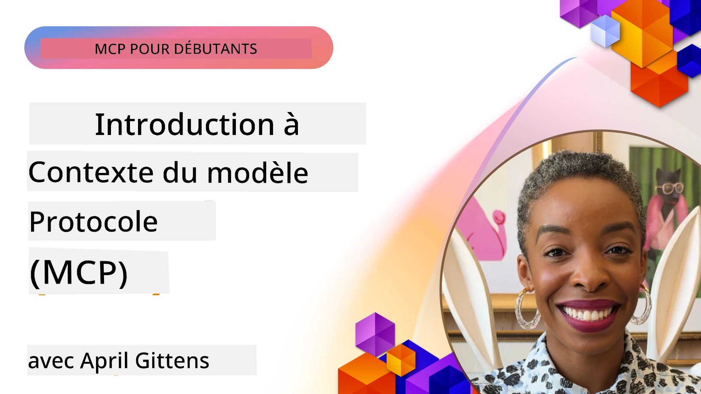
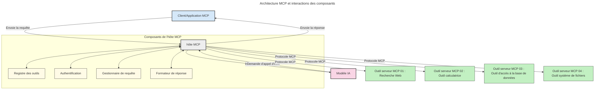

# Introduction au Model Context Protocol (MCP) : Pourquoi c’est important pour les applications d’IA évolutives

[](https://youtu.be/agBbdiOPLQA)

_(Cliquez sur l’image ci-dessus pour visionner la vidéo de cette leçon)_

Les applications d’IA générative représentent un grand pas en avant car elles permettent souvent à l’utilisateur d’interagir avec l’application en utilisant des invites en langage naturel. Cependant, à mesure que l’on investit plus de temps et de ressources dans ce type d’applications, il est important de s’assurer que l’on peut facilement intégrer des fonctionnalités et des ressources de manière à ce qu’il soit simple d’étendre l’application, qu’elle puisse prendre en charge plusieurs modèles utilisés simultanément, et gérer diverses subtilités des modèles. En résumé, construire des applications d’IA générative est facile au départ, mais à mesure qu’elles grandissent et deviennent plus complexes, il faut commencer à définir une architecture et il y aura probablement besoin de s’appuyer sur une norme pour garantir que vos applications soient construites de manière cohérente. C’est là que MCP intervient pour organiser les choses et fournir une norme.

---

## **🔍 Qu’est-ce que le Model Context Protocol (MCP) ?**

Le **Model Context Protocol (MCP)** est une **interface ouverte et standardisée** qui permet aux grands modèles de langage (LLM) d’interagir de manière transparente avec des outils externes, des API et des sources de données. Il fournit une architecture cohérente pour améliorer les fonctionnalités des modèles d’IA au-delà de leurs données d’entraînement, permettant des systèmes d’IA plus intelligents, évolutifs et réactifs.

---

## **🎯 Pourquoi la standardisation en IA est-elle importante ?**

À mesure que les applications d’IA générative deviennent plus complexes, il est essentiel d’adopter des standards garantissant **l’évolutivité, la extensibilité, la maintenabilité**, et **l’évitement du verrouillage propriétaire**. MCP répond à ces besoins en :

- Unifiant les intégrations modèle-outil
- Réduisant les solutions personnalisées fragiles et ponctuelles
- Permettant à plusieurs modèles de différents fournisseurs de coexister au sein d’un même écosystème

**Note :** Bien que MCP se présente comme une norme ouverte, il n’y a pas de projet de normalisation de MCP via des organismes de normalisation existants comme IEEE, IETF, W3C, ISO, ou tout autre organisme normatif.

---

## **📚 Objectifs d’apprentissage**

À la fin de cet article, vous serez capable de :

- Définir le **Model Context Protocol (MCP)** et ses cas d’utilisation
- Comprendre comment MCP standardise la communication entre modèles et outils
- Identifier les composants principaux de l’architecture MCP
- Explorer les applications réelles du MCP dans les contextes d’entreprise et de développement

---

## **💡 Pourquoi le Model Context Protocol (MCP) est un véritable changement**

### **🔗 MCP résout la fragmentation des interactions en IA**

Avant MCP, l’intégration des modèles avec les outils nécessitait :

- Du code personnalisé pour chaque paire outil-modèle
- Des API non standard pour chaque fournisseur
- Des interruptions fréquentes dues aux mises à jour
- Une faible évolutivité avec l’augmentation du nombre d’outils

### **✅ Avantages de la standardisation MCP**

| **Avantage**              | **Description**                                                                |
|--------------------------|--------------------------------------------------------------------------------|
| Interopérabilité         | Les LLM fonctionnent de manière transparente avec des outils de différents fournisseurs |
| Cohérence                | Comportement uniforme à travers plateformes et outils                         |
| Réutilisabilité          | Les outils construits une fois peuvent être utilisés dans plusieurs projets et systèmes |
| Accélération du développement | Réduction du temps de développement grâce à des interfaces standardisées et plug-and-play |

---

## **🧱 Vue d’ensemble de l’architecture MCP**

MCP suit un **modèle client-serveur**, où :

- Les **MCP Hosts** exécutent les modèles d’IA
- Les **MCP Clients** initient les requêtes
- Les **MCP Servers** fournissent le contexte, les outils et les fonctionnalités

### **Composants clés :**

- **Ressources** – Données statiques ou dynamiques pour les modèles  
- **Prompts** – Flux de travail prédéfinis pour la génération guidée  
- **Outils** – Fonctions exécutables comme recherche, calculs  
- **Échantillonnage** – Comportement agentique via interactions récursives  
- **Élicitation** – Requêtes initiées par le serveur pour obtenir des saisies utilisateur  
- **Racines** – Limites du système de fichiers pour le contrôle d’accès serveur

### **Architecture du protocole :**

MCP utilise une architecture à deux couches :  
- **Couche Données** : Communication basée sur JSON-RPC 2.0 avec gestion du cycle de vie et primitives  
- **Couche Transport** : Canaux de communication STDIO (local) et HTTP Streamable avec SSE (remote)

---

## Fonctionnement des MCP Servers

Les serveurs MCP fonctionnent de la manière suivante :

- **Flux de requêtes** :
    1. Une requête est initiée par un utilisateur final ou un logiciel agissant en son nom.
    2. Le **Client MCP** envoie la requête à un **Hôte MCP**, qui gère l’exécution du modèle IA.
    3. Le **Modèle IA** reçoit l’invite utilisateur et peut demander l’accès à des outils externes ou des données via un ou plusieurs appels d’outil.
    4. L’**Hôte MCP**, et non le modèle directement, communique avec le(s) **Serveur(s) MCP** approprié(s) en utilisant le protocole standardisé.
- **Fonctionnalités de l’Hôte MCP** :
    - **Registre des outils** : Maintient un catalogue des outils disponibles et de leurs capacités.
    - **Authentification** : Vérifie les autorisations d’accès aux outils.
    - **Gestionnaire de requêtes** : Traite les requêtes entrantes d’outil du modèle.
    - **Formatteur de réponses** : Structure les sorties des outils dans un format compréhensible pour le modèle.
- **Exécution serveur MCP** :
    - L’**Hôte MCP** dirige les appels aux outils vers un ou plusieurs **Serveurs MCP**, chacun exposant des fonctions spécialisées (ex. recherche, calculs, requêtes en base de données).
    - Les **Serveurs MCP** effectuent leurs opérations respectives et retournent les résultats à l’**Hôte MCP** dans un format cohérent.
    - L’**Hôte MCP** formate et relaie ces résultats au **Modèle IA**.
- **Finalisation de la réponse** :
    - Le **Modèle IA** intègre les résultats des outils dans une réponse finale.
    - L’**Hôte MCP** envoie cette réponse au **Client MCP**, qui la remet à l’utilisateur final ou au logiciel appelant.
    


## 👨‍💻 Comment construire un serveur MCP (avec exemples)

Les serveurs MCP vous permettent d’étendre les capacités des LLM en fournissant données et fonctionnalités.

Prêt à essayer ? Voici des SDK spécifiques à certains langages et stacks avec des exemples de création de serveurs MCP simples dans différents langages/stacks :

- **SDK Python** : https://github.com/modelcontextprotocol/python-sdk

- **SDK TypeScript** : https://github.com/modelcontextprotocol/typescript-sdk

- **SDK Java** : https://github.com/modelcontextprotocol/java-sdk

- **SDK C#/.NET** : https://github.com/modelcontextprotocol/csharp-sdk


## 🌍 Cas d’utilisation réels pour MCP

MCP permet une large gamme d’applications en étendant les capacités de l’IA :

| **Application**               | **Description**                                                                |
|------------------------------|--------------------------------------------------------------------------------|
| Intégration de données en entreprise | Connecter les LLM à des bases de données, CRM ou outils internes              |
| Systèmes d’IA agentiques      | Permettre aux agents autonomes d’avoir accès aux outils et aux flux décisionnels |
| Applications multimodales      | Combiner outils textes, images et audio dans une application IA unifiée       |
| Intégration de données en temps réel | Apporter des données en direct dans les interactions IA pour des résultats plus précis et actuels |


### 🧠 MCP = norme universelle pour les interactions IA

Le Model Context Protocol (MCP) agit comme une norme universelle pour les interactions IA, à l’instar de la normalisation USB-C pour les connexions physiques des appareils. Dans le monde de l’IA, MCP offre une interface cohérente, permettant aux modèles (clients) de s’intégrer facilement avec des outils externes et fournisseurs de données (serveurs). Cela élimine le besoin de protocoles diversifiés et personnalisés pour chaque API ou source de données.

Sous MCP, un outil compatible MCP (appelé serveur MCP) suit une norme unifiée. Ces serveurs peuvent lister les outils ou actions qu’ils offrent et exécuter ces actions lorsqu’un agent IA les sollicite. Les plateformes d’agents IA prenant en charge MCP sont capables de découvrir les outils disponibles sur les serveurs et de les invoquer via ce protocole standard.

### 💡 Facilite l’accès au savoir

Au-delà d’offrir des outils, MCP facilite également l’accès au savoir. Il permet aux applications de fournir du contexte aux grands modèles de langage (LLM) en les reliant à diverses sources de données. Par exemple, un serveur MCP peut représenter le dépôt documentaire d’une entreprise, permettant aux agents de récupérer des informations pertinentes à la demande. Un autre serveur pourrait gérer des actions spécifiques comme l’envoi d’emails ou la mise à jour d’enregistrements. Du point de vue de l’agent, ce sont simplement des outils qu’il peut utiliser—certains outils retournent des données (contexte de connaissances), tandis que d’autres réalisent des actions. MCP gère efficacement les deux.

Un agent se connectant à un serveur MCP apprend automatiquement les capacités disponibles de celui-ci et les données accessibles via un format standard. Cette standardisation permet une disponibilité dynamique des outils. Par exemple, ajouter un nouveau serveur MCP au système d’un agent rend ses fonctions immédiatement utilisables sans nécessiter de personnalisation supplémentaire des instructions de l’agent.

Cette intégration simplifiée s’aligne avec le flux illustré dans le diagramme suivant, où les serveurs fournissent à la fois outils et connaissances, assurant une collaboration fluide entre systèmes.

### 👉 Exemple : solution agent évolutive

```mermaid
---
title: Solution d'Agent évolutive avec MCP
description: Un diagramme illustrant comment un utilisateur interagit avec un LLM qui se connecte à plusieurs serveurs MCP, chaque serveur fournissant à la fois des connaissances et des outils, créant une architecture de système d'IA évolutive
---
graph TD
    User -->|Invite| LLM
    LLM -->|Réponse| User
    LLM -->|MCP| ServerA
    LLM -->|MCP| ServerB
    ServerA -->|Connecteur universel| ServerB
    ServerA --> KnowledgeA
    ServerA --> ToolsA
    ServerB --> KnowledgeB
    ServerB --> ToolsB

    subgraph Server A
        KnowledgeA[Connaissances]
        ToolsA[Outils]
    end

    subgraph Server B
        KnowledgeB[Connaissances]
        ToolsB[Outils]
    end
```Le Connecteur Universel permet aux serveurs MCP de communiquer et partager leurs capacités entre eux, permettant au ServerA de déléguer des tâches au ServerB ou d’accéder à ses outils et connaissances. Cela fédère les outils et les données à travers les serveurs, supportant des architectures d’agents évolutives et modulaires. Parce que MCP standardise l’exposition des outils, les agents peuvent découvrir dynamiquement et router les requêtes entre serveurs sans intégrations codées en dur.


Fédération des outils et connaissances : les outils et les données peuvent être accessibles à travers les serveurs, permettant des architectures agentiques plus évolutives et modulaires.

### 🔄 Scénarios avancés MCP avec intégration LLM côté client

Au-delà de l’architecture MCP de base, il existe des scénarios avancés où client et serveur contiennent des LLM, permettant des interactions plus sophistiquées. Dans le diagramme suivant, **Client App** pourrait être un IDE avec un certain nombre d’outils MCP disponibles pour utilisation par le LLM :

```mermaid
---
title: Scénarios MCP avancés avec intégration Client-Serveur LLM
description: Un diagramme de séquence montrant le flux d'interaction détaillé entre l'utilisateur, l'application cliente, le LLM client, plusieurs serveurs MCP et le LLM serveur, illustrant la découverte d'outils, l'interaction utilisateur, l'appel direct d'outils et les phases de négociation des fonctionnalités
---
sequenceDiagram
    autonumber
    actor User as 👤 Utilisateur
    participant ClientApp as 🖥️ Application Client
    participant ClientLLM as 🧠 LLM Client
    participant Server1 as 🔧 Serveur MCP 1
    participant Server2 as 📚 Serveur MCP 2
    participant ServerLLM as 🤖 LLM Serveur
    
    %% Phase de découverte
    rect rgb(220, 240, 255)
        Note over ClientApp, Server2: PHASE DE DÉCOUVERTE DES OUTILS
        ClientApp->>+Server1: Demander les outils/ressources disponibles
        Server1-->>-ClientApp: Retourner la liste des outils (JSON)
        ClientApp->>+Server2: Demander les outils/ressources disponibles
        Server2-->>-ClientApp: Retourner la liste des outils (JSON)
        Note right of ClientApp: Stocker localement le<br/>catalogue d'outils combiné
    end
    
    %% Interaction utilisateur
    rect rgb(255, 240, 220)
        Note over User, ClientLLM: PHASE D'INTERACTION UTILISATEUR
        User->>+ClientApp: Entrer une demande en langage naturel
        ClientApp->>+ClientLLM: Transmettre la demande + catalogue d'outils
        ClientLLM->>-ClientLLM: Analyser la demande & sélectionner les outils
    end
    
    %% Scénario A : Appel direct d'outil
    alt Appel direct d'outil
        rect rgb(220, 255, 220)
            Note over ClientApp, Server1: SCÉNARIO A : APPEL DIRECT D'OUTIL
            ClientLLM->>+ClientApp: Demander l'exécution de l'outil
            ClientApp->>+Server1: Exécuter l'outil spécifique
            Server1-->>-ClientApp: Retourner les résultats
            ClientApp->>+ClientLLM: Traiter les résultats
            ClientLLM-->>-ClientApp: Générer la réponse
            ClientApp-->>-User: Afficher la réponse finale
        end
    
    %% Scénario B : Négociation des fonctionnalités (style VS Code)
    else Négociation des fonctionnalités (style VS Code)
        rect rgb(255, 220, 220)
            Note over ClientApp, ServerLLM: SCÉNARIO B : NÉGOCIATION DES FONCTIONNALITÉS
            ClientLLM->>+ClientApp: Identifier les capacités nécessaires
            ClientApp->>+Server2: Négocier les fonctionnalités/capacités
            Server2->>+ServerLLM: Demander un contexte supplémentaire
            ServerLLM-->>-Server2: Fournir le contexte
            Server2-->>-ClientApp: Retourner les fonctionnalités disponibles
            ClientApp->>+Server2: Appeler les outils négociés
            Server2-->>-ClientApp: Retourner les résultats
            ClientApp->>+ClientLLM: Traiter les résultats
            ClientLLM-->>-ClientApp: Générer la réponse
            ClientApp-->>-User: Afficher la réponse finale
        end
    end
```
## 🔐 Avantages pratiques de MCP

Voici les avantages pratiques de l’utilisation de MCP :

- **Actualité** : Les modèles peuvent accéder à des informations à jour au-delà de leurs données d’entraînement
- **Extension des capacités** : Les modèles peuvent exploiter des outils spécialisés pour des tâches pour lesquelles ils n’ont pas été entraînés
- **Réduction des hallucinations** : Les sources de données externes fournissent une base factuelle
- **Confidentialité** : Les données sensibles peuvent rester dans des environnements sécurisés au lieu d’être intégrées dans les invites

## 📌 Points clés à retenir

Voici les points clés pour l’utilisation de MCP :

- **MCP** standardise comment les modèles IA interagissent avec les outils et données
- Favorise **l’extensibilité, la cohérence, et l’interopérabilité**
- MCP aide à **réduire le temps de développement, améliorer la fiabilité et augmenter les capacités des modèles**
- L’architecture client-serveur **autorise des applications IA flexibles et extensibles**

## 🧠 Exercice

Réfléchissez à une application IA que vous souhaitez construire.

- Quels **outils externes ou données** pourraient améliorer ses capacités ?
- Comment MCP pourrait-il rendre l’intégration **plus simple et plus fiable** ?

## Ressources additionnelles

- [Dépôt GitHub MCP](https://github.com/modelcontextprotocol)


## Quelles sont les prochaines étapes

Suivant : [Chapitre 1 : Concepts fondamentaux](../01-CoreConcepts/README.md)

---

<!-- CO-OP TRANSLATOR DISCLAIMER START -->
**Avis de non-responsabilité** :  
Ce document a été traduit à l’aide du service de traduction automatique [Co-op Translator](https://github.com/Azure/co-op-translator). Bien que nous nous efforcions d’assurer l’exactitude, veuillez noter que les traductions automatiques peuvent contenir des erreurs ou des inexactitudes. Le document original dans sa langue d’origine doit être considéré comme la source faisant foi. Pour des informations critiques, une traduction professionnelle réalisée par un humain est recommandée. Nous ne saurions être tenus responsables de toute mauvaise interprétation ou méprise résultant de l’utilisation de cette traduction.
<!-- CO-OP TRANSLATOR DISCLAIMER END -->