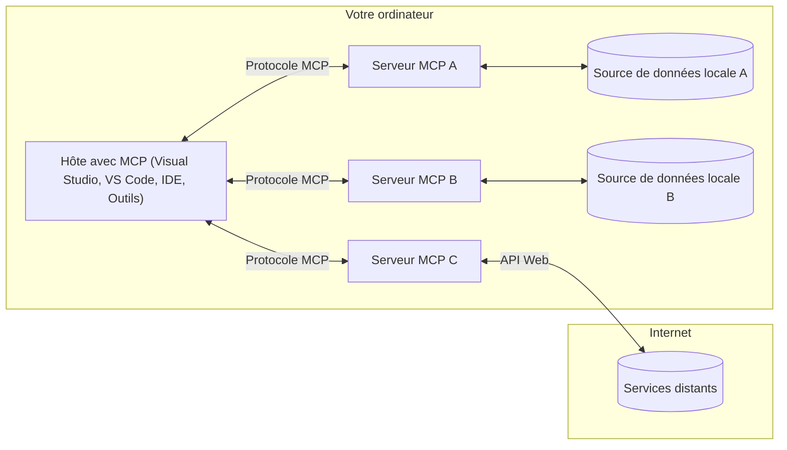

# Concepts fondamentaux de MCP : Maîtriser le protocole Model Context pour l'intégration IA

[](https://youtu.be/earDzWGtE84)

_(Cliquez sur l'image ci-dessus pour visionner la vidéo de cette leçon)_

Le [Model Context Protocol (MCP)](https://github.com/modelcontextprotocol) est un cadre puissant et standardisé qui optimise la communication entre les grands modèles de langage (LLM) et les outils, applications et sources de données externes.  
Ce guide vous fera découvrir les concepts fondamentaux du MCP. Vous apprendrez son architecture client-serveur, ses composants essentiels, le fonctionnement de la communication, et les bonnes pratiques d’implémentation.

- **Consentement explicite de l'utilisateur** : Tout accès aux données et toutes opérations nécessitent une approbation explicite de l'utilisateur avant exécution. Les utilisateurs doivent comprendre clairement quelles données seront accessibles et quelles actions seront effectuées, avec un contrôle granulaire des autorisations.

- **Protection de la vie privée** : Les données utilisateur ne sont exposées qu’avec consentement explicite et doivent être protégées par des contrôles d’accès solides tout au long du cycle d'interaction. Les implémentations doivent éviter les transmissions de données non autorisées et maintenir des frontières strictes de confidentialité.

- **Sécurité d'exécution des outils** : Chaque invocation d’outil nécessite un consentement explicite avec une compréhension claire de la fonctionnalité, des paramètres et de l’impact potentiel de l’outil. Des barrières de sécurité robustes doivent empêcher toute exécution non souhaitée, non sûre ou malveillante.

- **Sécurité de la couche transport** : Tous les canaux de communication doivent utiliser un chiffrement et des mécanismes d’authentification appropriés. Les connexions à distance doivent implémenter des protocoles de transport sécurisés et une gestion correcte des identifiants.

#### Directives d’implémentation :

- **Gestion des permissions** : Implémentez des systèmes de permissions fines permettant aux utilisateurs de contrôler quels serveurs, outils et ressources sont accessibles  
- **Authentification & autorisation** : Utilisez des méthodes d’authentification sécurisées (OAuth, clés API) avec une gestion correcte des jetons et de leur expiration  
- **Validation des entrées** : Validez tous les paramètres et données d’entrée selon des schémas définis pour prévenir les attaques par injection  
- **Journalisation (audit logging)** : Maintenez des journaux complets de toutes les opérations pour la surveillance de sécurité et la conformité

## Vue d’ensemble

Cette leçon explore l'architecture fondamentale et les composants qui constituent l’écosystème du Model Context Protocol (MCP). Vous découvrirez l’architecture client-serveur, les composants clés et les mécanismes de communication qui animent les interactions MCP.

## Objectifs pédagogiques clés

À la fin de cette leçon, vous serez capable de :

- Comprendre l’architecture client-serveur du MCP.  
- Identifier les rôles et responsabilités des Hôtes, Clients et Serveurs.  
- Analyser les fonctionnalités clés qui font du MCP une couche d’intégration flexible.  
- Apprendre comment l’information circule dans l’écosystème MCP.  
- Obtenir des insights pratiques à travers des exemples de code en .NET, Java, Python et JavaScript.

## Architecture MCP : un examen approfondi

L’écosystème MCP repose sur un modèle client-serveur. Cette structure modulaire permet aux applications IA d’interagir efficacement avec des outils, bases de données, API, et ressources contextuelles. Décomposons cette architecture en ses composants principaux.

Au cœur, MCP suit une architecture client-serveur dans laquelle une application hôte peut se connecter à plusieurs serveurs :


- **Hôtes MCP** : Programmes tels que VSCode, Claude Desktop, IDE, ou outils IA souhaitant accéder à des données via MCP  
- **Clients MCP** : Clients du protocole qui maintiennent des connexions 1:1 avec les serveurs  
- **Serveurs MCP** : Programmes légers exposant des capacités spécifiques via le protocole standardisé Model Context Protocol  
- **Sources de données locales** : Fichiers, bases de données, et services de votre ordinateur auxquels les serveurs MCP peuvent accéder de façon sécurisée  
- **Services distants** : Systèmes externes disponibles sur internet auxquels les serveurs MCP peuvent se connecter via des API.

Le protocole MCP est une norme évolutive avec une version basée sur la date (format AAAA-MM-JJ). La version actuelle du protocole est **2025-11-25**. Vous pouvez consulter les dernières mises à jour de la [spécification du protocole](https://modelcontextprotocol.io/specification/2025-11-25/).

### 1. Hôtes

Dans le Model Context Protocol (MCP), les **Hôtes** sont des applications IA qui servent d’interface principale par laquelle les utilisateurs interagissent avec le protocole. Les hôtes coordonnent et gèrent les connexions à plusieurs serveurs MCP en créant un client MCP dédié pour chaque serveur connecté. Exemples d’hôtes :

- **Applications IA** : Claude Desktop, Visual Studio Code, Claude Code  
- **Environnements de développement** : IDE et éditeurs de code avec intégration MCP  
- **Applications personnalisées** : Agents IA dédiés et outils sur mesure

Les **Hôtes** sont des applications qui coordonnent les interactions avec les modèles IA. Ils :

- **Orchestrent les modèles IA** : Exécutent ou interagissent avec des LLM pour générer des réponses et coordonner les workflows IA  
- **Gèrent les connexions clients** : Créent et maintiennent un client MCP par connexion serveur MCP  
- **Contrôlent l’interface utilisateur** : Gèrent le flux des conversations, les interactions utilisateurs, et la présentation des réponses  
- **Appliquent la sécurité** : Contrôlent les permissions, contraintes de sécurité et authentification  
- **Gèrent le consentement utilisateur** : Supervisent l’approbation utilisateur pour le partage de données et l’exécution d’outils

### 2. Clients

Les **Clients** sont des composants essentiels qui maintiennent une connexion dédiée en tête-à-tête entre Hôtes et serveurs MCP. Chaque client MCP est instancié par l’hôte pour se connecter à un serveur MCP spécifique, garantissant des canaux de communication organisés et sécurisés. Plusieurs clients permettent à un hôte de se connecter simultanément à plusieurs serveurs.

Les **Clients** sont des connecteurs intégrés à l'application hôte. Ils :

- **Communiquent via le protocole** : Envoient des requêtes JSON-RPC 2.0 aux serveurs avec les invites et instructions  
- **Négocient les capacités** : Négocient les fonctionnalités prises en charge et versions du protocole avec les serveurs lors de l’initialisation  
- **Exécutent les outils** : Gèrent les requêtes d’exécution d’outils provenant des modèles et traitent les réponses  
- **Mettent à jour en temps réel** : Gèrent notifications et mises à jour en temps réel des serveurs  
- **Traitement des réponses** : Traitent et formatent les réponses serveur pour affichage à l’utilisateur

### 3. Serveurs

Les **Serveurs** sont des programmes fournissant contexte, outils et capacités aux clients MCP. Ils peuvent s’exécuter localement (même machine que l’hôte) ou à distance (sur plateformes externes), et sont responsables de traiter les requêtes des clients et de fournir des réponses structurées. Les serveurs exposent des fonctionnalités spécifiques via le protocole standardisé Model Context Protocol.

Les **Serveurs** sont des services qui fournissent contexte et capacités. Ils :

- **Enregistrent les fonctionnalités** : Enregistrent et exposent des primitives disponibles (ressources, invites, outils) aux clients  
- **Traitent les requêtes** : Reçoivent et exécutent appels d’outils, requêtes de ressources et d’invites des clients  
- **Fournissent du contexte** : Apportent des informations contextuelles et des données pour enrichir les réponses des modèles  
- **Gèrent l’état** : Maintiennent l’état de session et gèrent les interactions avec état si nécessaire  
- **Envoient des notifications en temps réel** : Informer les clients connectés des changements de capacités et mises à jour

Les serveurs peuvent être développés par quiconque pour étendre les capacités des modèles avec des fonctionnalités spécialisées, et supportent à la fois déploiement local et distant.

### 4. Primitives Serveur

Les serveurs dans le Model Context Protocol (MCP) fournissent trois **primitives** principales qui définissent les briques élémentaires pour des interactions riches entre clients, hôtes et modèles de langage. Ces primitives spécifient les types d’informations contextuelles et d’actions disponibles via le protocole.

Les serveurs MCP peuvent exposer une combinaison des trois primitives principales suivantes :

#### Ressources

Les **Ressources** sont des sources de données fournissant des informations contextuelles aux applications IA. Elles représentent du contenu statique ou dynamique pouvant améliorer la compréhension et la prise de décision du modèle :

- **Données contextuelles** : Informations structurées et contexte pour consommation par les modèles IA  
- **Bases de connaissances** : Répertoires de documents, articles, manuels, et papiers de recherche  
- **Sources de données locales** : Fichiers, bases de données et informations système locales  
- **Données externes** : Réponses API, services web et données systèmes distantes  
- **Contenu dynamique** : Données en temps réel se mettant à jour selon les conditions externes

Les ressources sont identifiées par des URI et supportent la découverte via les méthodes `resources/list` et la récupération via `resources/read` :

```text
file://documents/project-spec.md
database://production/users/schema
api://weather/current
```

#### Invites (Prompts)

Les **Invites** sont des modèles réutilisables qui aident à structurer les interactions avec les modèles de langage. Elles proposent des schémas d’interaction standardisés et des workflows templatisés :

- **Interactions basées sur des modèles** : Messages pré-structurés et amorces de conversation  
- **Modèles de workflows** : Séquences standardisées pour tâches et interactions communes  
- **Exemples few-shot** : Modèles basés sur des exemples pour instructions modèles  
- **Invites système** : Invites fondamentales définissant le comportement et le contexte du modèle  
- **Modèles dynamiques** : Invites paramétrées s’adaptant à des contextes spécifiques

Les invites supportent la substitution de variables et peuvent être découvertes via `prompts/list` puis récupérées avec `prompts/get` :

```markdown
Generate a {{task_type}} for {{product}} targeting {{audience}} with the following requirements: {{requirements}}
```

#### Outils

Les **Outils** sont des fonctions exécutables que les modèles IA peuvent invoquer pour effectuer des actions spécifiques. Ils représentent les « verbes » de l’écosystème MCP, permettant aux modèles d’interagir avec des systèmes externes :

- **Fonctions exécutables** : Opérations discrètes que les modèles peuvent invoquer avec paramètres spécifiques  
- **Intégration de systèmes externes** : Appels API, requêtes bases de données, opérations sur fichiers, calculs  
- **Identité unique** : Chaque outil possède un nom distinct, une description, et un schéma de paramètres  
- **Entrées/Sorties structurées** : Outils acceptant des paramètres validés et renvoyant des réponses typées et structurées  
- **Capacités d’action** : Permettent aux modèles d’effectuer des actions réelles et de récupérer des données en direct

Les outils sont définis avec JSON Schema pour validation des paramètres, découverts via `tools/list` et exécutés via `tools/call`. Ils peuvent également inclure des **icônes** comme métadonnées supplémentaires pour une meilleure présentation UI.

**Annotations d’outils** : Les outils supportent des annotations comportementales (ex. `readOnlyHint`, `destructiveHint`) indiquant si un outil est en lecture seule ou destructeur, aidant les clients à prendre des décisions éclairées sur l’exécution des outils.

Exemple de définition d’outil :

```typescript
server.tool(
  "search_products", 
  {
    query: z.string().describe("Search query for products"),
    category: z.string().optional().describe("Product category filter"),
    max_results: z.number().default(10).describe("Maximum results to return")
  }, 
  async (params) => {
    // Exécuter la recherche et retourner des résultats structurés
    return await productService.search(params);
  }
);
```

## Primitives Clients

Dans le Model Context Protocol (MCP), les **clients** peuvent exposer des primitives permettant aux serveurs de demander des capacités supplémentaires à l’application hôte. Ces primitives côté client favorisent des implémentations serveur plus riches et interactives, pouvant accéder aux capacités du modèle IA et aux interactions utilisateur.

### Échantillonnage (Sampling)

L’**Échantillonnage** permet aux serveurs de demander des complétions de modèles linguistiques à l’application IA du client. Cette primitive permet d’accéder aux capacités du LLM sans intégrer ses propres dépendances modèles :

- **Accès indépendant du modèle** : Les serveurs peuvent demander des complétions sans inclure de SDK LLM ni gérer l’accès au modèle  
- **IA initiée par le serveur** : Permet aux serveurs de générer de façon autonome du contenu en utilisant le modèle IA du client  
- **Interactions LLM récursives** : Supporte les scénarios complexes où les serveurs ont besoin d’assistance IA pour le traitement  
- **Génération de contenu dynamique** : Permet aux serveurs de créer des réponses contextuelles avec le modèle de l’hôte  
- **Support d’appel d’outils** : Les serveurs peuvent inclure les paramètres `tools` et `toolChoice` pour permettre au modèle du client d’invoquer des outils pendant l’échantillonnage

L’échantillonnage est initié via la méthode `sampling/complete`, où les serveurs envoient des requêtes de complétion aux clients.

### Racines (Roots)

Les **Racines** fournissent un moyen standardisé pour les clients d’exposer les limites du système de fichiers aux serveurs, aidant ces derniers à comprendre quels répertoires et fichiers ils peuvent accéder :

- **Limites du système de fichiers** : Définissent les bornes d’opération des serveurs dans le système de fichiers  
- **Contrôle d’accès** : Aident les serveurs à comprendre quels répertoires et fichiers ils ont la permission d’utiliser  
- **Mises à jour dynamiques** : Les clients peuvent notifier les serveurs lorsque la liste des racines évolue  
- **Identification basée sur URI** : Les racines utilisent des URI `file://` pour identifier répertoires et fichiers accessibles

Les racines sont découvertes via la méthode `roots/list`, avec notification par les clients via `notifications/roots/list_changed` lors de modifications.

### Sollicitation (Elicitation)

La **Sollicitation** permet aux serveurs de demander des informations supplémentaires ou une confirmation des utilisateurs via l’interface client :

- **Demandes d’entrée utilisateur** : Les serveurs peuvent requérir des informations supplémentaires nécessaires à l’exécution d’un outil  
- **Dialogues de confirmation** : Solliciter l’approbation utilisateur pour les opérations sensibles ou impactantes  
- **Workflows interactifs** : Permettre aux serveurs de créer des interactions utilisateur étape par étape  
- **Collecte dynamique de paramètres** : Récupérer des paramètres manquants ou optionnels durant l’exécution d’un outil

Les requêtes de sollicitation sont effectuées via la méthode `elicitation/request` pour collecter des entrées utilisateur via l’interface client.

**Mode URL pour la sollicitation** : Les serveurs peuvent aussi demander des interactions utilisateur basées sur URL, permettant aux serveurs de rediriger les utilisateurs vers des pages web externes pour authentification, confirmation, ou saisie de données.

### Journalisation (Logging)

La **Journalisation** permet aux serveurs d’envoyer des messages de log structurés aux clients pour débogage, surveillance et visibilité opérationnelle :

- **Support au débogage** : Permet aux serveurs de fournir des logs d’exécution détaillés pour le dépannage  
- **Suivi opérationnel** : Envoyer mises à jour de statut et métriques de performance aux clients  
- **Rapports d'erreur** : Fournir un contexte d’erreur détaillé et des informations de diagnostic  
- **Pistes d’audit** : Créer des journaux complets des opérations et décisions serveur

Les messages de log sont envoyés aux clients pour assurer la transparence des opérations serveur et faciliter le débogage.

## Flux d’information dans MCP

Le Model Context Protocol (MCP) définit un flux structuré d’informations entre hôtes, clients, serveurs et modèles. Comprendre ce flux aide à clarifier comment les requêtes utilisateur sont traitées et comment les outils externes et données sont intégrés dans les réponses des modèles.

- **Connexion initiée par l’hôte**  
  L’application hôte (ex. un IDE ou interface de chat) établit une connexion à un serveur MCP, typiquement via STDIO, WebSocket, ou un autre transport supporté.

- **Négociation des capacités**  
  Le client (intégré à l’hôte) et le serveur échangent des informations sur leurs fonctionnalités, outils, ressources et versions du protocole prises en charge. Cela garantit que les deux parties comprennent les capacités disponibles pour la session.

- **Requête utilisateur**  
  L’utilisateur interagit avec l’hôte (ex. saisit une invite ou une commande). L’hôte collecte cette saisie et la transmet au client pour traitement.

- **Utilisation de ressources ou outils**  
  - Le client peut demander un contexte ou des ressources supplémentaires au serveur (fichiers, entrées de base de données, articles de base de connaissances) pour enrichir la compréhension du modèle.  
  - Si le modèle détermine qu’un outil est nécessaire (ex. pour récupérer des données, effectuer un calcul, ou appeler une API), le client envoie une requête d’invocation d’outil au serveur, précisant le nom de l’outil et les paramètres.

- **Exécution par le serveur**  

  Le serveur reçoit la requête de ressource ou d’outil, exécute les opérations nécessaires (telles que l'exécution d'une fonction, une requête à une base de données ou la récupération d’un fichier), et renvoie les résultats au client dans un format structuré.

- **Génération de la réponse**  
  Le client intègre les réponses du serveur (données de ressource, sorties d’outils, etc.) dans l’interaction en cours avec le modèle. Le modèle utilise ces informations pour générer une réponse complète et contextuellement pertinente.

- **Présentation du résultat**  
  L’hôte reçoit la sortie finale du client et la présente à l’utilisateur, incluant souvent à la fois le texte généré par le modèle et les résultats des exécutions d’outils ou des recherches de ressources.

Ce flux permet à MCP de prendre en charge des applications d’IA avancées, interactives et contextuelles en connectant de manière transparente les modèles avec des outils externes et des sources de données.

## Architecture et couches du protocole

MCP se compose de deux couches architecturales distinctes qui travaillent ensemble pour fournir un cadre de communication complet :

### Couche de données

La **couche de données** implémente le protocole central MCP en utilisant **JSON-RPC 2.0** comme base. Cette couche définit la structure des messages, les sémantiques, et les schémas d’interaction :

#### Composants principaux :

- **Protocole JSON-RPC 2.0** : Toute la communication utilise le format de message standardisé JSON-RPC 2.0 pour les appels de méthodes, réponses et notifications
- **Gestion du cycle de vie** : Gère l’initialisation de la connexion, la négociation des capacités, et la terminaison des sessions entre clients et serveurs
- **Primitives serveur** : Permet aux serveurs de fournir des fonctionnalités de base via des outils, ressources et invites
- **Primitives client** : Permet aux serveurs de demander des échantillonnages de LLM, de susciter des entrées utilisateur, et d’envoyer des messages de journalisation
- **Notifications en temps réel** : Prend en charge les notifications asynchrones pour des mises à jour dynamiques sans sondage

#### Principales fonctionnalités :

- **Négociation de version du protocole** : Utilise un versionnage basé sur la date (AAAA-MM-JJ) pour garantir la compatibilité
- **Découverte des capacités** : Clients et serveurs échangent les informations sur les fonctionnalités supportées lors de l’initialisation
- **Sessions avec état** : Maintient l’état de la connexion à travers plusieurs interactions pour une continuité contextuelle

### Couche de transport

La **couche de transport** gère les canaux de communication, le découpage des messages, et l’authentification entre les participants MCP :

#### Mécanismes de transport pris en charge :

1. **Transport STDIO** :
   - Utilise les flux d’entrée/sortie standards pour la communication directe entre processus
   - Optimal pour les processus locaux sur la même machine sans surcoût réseau
   - Couramment utilisé pour les implémentations locales de serveurs MCP

2. **Transport HTTP Streamable** :
   - Utilise HTTP POST pour les messages client vers serveur  
   - Événements envoyés par serveur (SSE) optionnels pour la diffusion côté serveur vers client
   - Permet la communication avec des serveurs distants via réseaux
   - Prend en charge l’authentification HTTP standard (jetons bearer, clés API, en-têtes personnalisés)
   - MCP recommande OAuth pour une authentification sécurisée par jetons

#### Abstraction du transport :

La couche de transport abstrait les détails de communication de la couche de données, permettant d’utiliser le même format de message JSON-RPC 2.0 sur tous les mécanismes de transport. Cette abstraction permet aux applications de passer facilement de serveurs locaux à distants.

### Considérations de sécurité

Les implémentations MCP doivent respecter plusieurs principes critiques de sécurité pour garantir des interactions sûres, fiables et sécurisées dans toutes les opérations du protocole :

- **Consentement et contrôle utilisateur** : Les utilisateurs doivent fournir un consentement explicite avant tout accès aux données ou toute opération effectuée. Ils doivent avoir un contrôle clair sur les données partagées et les actions autorisées, soutenus par des interfaces utilisateur intuitives pour revoir et approuver les activités.

- **Confidentialité des données** : Les données utilisateur ne doivent être exposées qu’avec un consentement explicite et doivent être protégées par des contrôles d’accès appropriés. Les implémentations MCP doivent prévenir toute transmission non autorisée et garantir le respect de la vie privée dans toutes les interactions.

- **Sécurité des outils** : Avant d’invoquer un outil, le consentement explicite de l’utilisateur est requis. Les utilisateurs doivent comprendre clairement la fonctionnalité de chaque outil, et des limites de sécurité robustes doivent être appliquées pour prévenir toute exécution imprévue ou non sécurisée.

En suivant ces principes de sécurité, MCP assure la confiance, la confidentialité et la sécurité des utilisateurs sur toutes les interactions du protocole tout en permettant de puissantes intégrations IA.

## Exemples de code : composants clés

Voici des exemples de code dans plusieurs langages populaires illustrant comment implémenter des composants serveur MCP clés et des outils.

### Exemple .NET : Création d’un serveur MCP simple avec outils

Voici un exemple pratique en .NET démontrant comment implémenter un serveur MCP simple avec des outils personnalisés. Cet exemple montre comment définir et enregistrer des outils, gérer les requêtes, et connecter le serveur en utilisant le Model Context Protocol.

```csharp
using System;
using System.Threading.Tasks;
using ModelContextProtocol.Server;
using ModelContextProtocol.Server.Transport;
using ModelContextProtocol.Server.Tools;

public class WeatherServer
{
    public static async Task Main(string[] args)
    {
        // Create an MCP server
        var server = new McpServer(
            name: "Weather MCP Server",
            version: "1.0.0"
        );
        
        // Register our custom weather tool
        server.AddTool<string, WeatherData>("weatherTool", 
            description: "Gets current weather for a location",
            execute: async (location) => {
                // Call weather API (simplified)
                var weatherData = await GetWeatherDataAsync(location);
                return weatherData;
            });
        
        // Connect the server using stdio transport
        var transport = new StdioServerTransport();
        await server.ConnectAsync(transport);
        
        Console.WriteLine("Weather MCP Server started");
        
        // Keep the server running until process is terminated
        await Task.Delay(-1);
    }
    
    private static async Task<WeatherData> GetWeatherDataAsync(string location)
    {
        // This would normally call a weather API
        // Simplified for demonstration
        await Task.Delay(100); // Simulate API call
        return new WeatherData { 
            Temperature = 72.5,
            Conditions = "Sunny",
            Location = location
        };
    }
}

public class WeatherData
{
    public double Temperature { get; set; }
    public string Conditions { get; set; }
    public string Location { get; set; }
}
```

### Exemple Java : Composants serveur MCP

Cet exemple montre le même serveur MCP et l’enregistrement d’outils que l'exemple .NET ci-dessus, mais implémenté en Java.

```java
import io.modelcontextprotocol.server.McpServer;
import io.modelcontextprotocol.server.McpToolDefinition;
import io.modelcontextprotocol.server.transport.StdioServerTransport;
import io.modelcontextprotocol.server.tool.ToolExecutionContext;
import io.modelcontextprotocol.server.tool.ToolResponse;

public class WeatherMcpServer {
    public static void main(String[] args) throws Exception {
        // Créer un serveur MCP
        McpServer server = McpServer.builder()
            .name("Weather MCP Server")
            .version("1.0.0")
            .build();
            
        // Enregistrer un outil météo
        server.registerTool(McpToolDefinition.builder("weatherTool")
            .description("Gets current weather for a location")
            .parameter("location", String.class)
            .execute((ToolExecutionContext ctx) -> {
                String location = ctx.getParameter("location", String.class);
                
                // Obtenir les données météorologiques (simplifié)
                WeatherData data = getWeatherData(location);
                
                // Retourner une réponse formatée
                return ToolResponse.content(
                    String.format("Temperature: %.1f°F, Conditions: %s, Location: %s", 
                    data.getTemperature(), 
                    data.getConditions(), 
                    data.getLocation())
                );
            })
            .build());
        
        // Connecter le serveur en utilisant le transport stdio
        try (StdioServerTransport transport = new StdioServerTransport()) {
            server.connect(transport);
            System.out.println("Weather MCP Server started");
            // Garder le serveur en fonctionnement jusqu'à la fin du processus
            Thread.currentThread().join();
        }
    }
    
    private static WeatherData getWeatherData(String location) {
        // L'implémentation appellerait une API météo
        // Simplifié à des fins d'exemple
        return new WeatherData(72.5, "Sunny", location);
    }
}

class WeatherData {
    private double temperature;
    private String conditions;
    private String location;
    
    public WeatherData(double temperature, String conditions, String location) {
        this.temperature = temperature;
        this.conditions = conditions;
        this.location = location;
    }
    
    public double getTemperature() {
        return temperature;
    }
    
    public String getConditions() {
        return conditions;
    }
    
    public String getLocation() {
        return location;
    }
}
```

### Exemple Python : Création d’un serveur MCP

Cet exemple utilise fastmcp, veuillez vous assurer de l’installer avant :

```python
pip install fastmcp
```
Exemple de code :

```python
#!/usr/bin/env python3
import asyncio
from fastmcp import FastMCP
from fastmcp.transports.stdio import serve_stdio

# Créer un serveur FastMCP
mcp = FastMCP(
    name="Weather MCP Server",
    version="1.0.0"
)

@mcp.tool()
def get_weather(location: str) -> dict:
    """Gets current weather for a location."""
    return {
        "temperature": 72.5,
        "conditions": "Sunny",
        "location": location
    }

# Approche alternative utilisant une classe
class WeatherTools:
    @mcp.tool()
    def forecast(self, location: str, days: int = 1) -> dict:
        """Gets weather forecast for a location for the specified number of days."""
        return {
            "location": location,
            "forecast": [
                {"day": i+1, "temperature": 70 + i, "conditions": "Partly Cloudy"}
                for i in range(days)
            ]
        }

# Enregistrer les outils de la classe
weather_tools = WeatherTools()

# Démarrer le serveur
if __name__ == "__main__":
    asyncio.run(serve_stdio(mcp))
```

### Exemple JavaScript : Création d’un serveur MCP

Cet exemple montre la création d’un serveur MCP en JavaScript et comment enregistrer deux outils liés à la météo.

```javascript
// Utilisation du SDK officiel Model Context Protocol
import { McpServer } from "@modelcontextprotocol/sdk/server/mcp.js";
import { StdioServerTransport } from "@modelcontextprotocol/sdk/server/stdio.js";
import { z } from "zod"; // Pour la validation des paramètres

// Créer un serveur MCP
const server = new McpServer({
  name: "Weather MCP Server",
  version: "1.0.0"
});

// Définir un outil météo
server.tool(
  "weatherTool",
  {
    location: z.string().describe("The location to get weather for")
  },
  async ({ location }) => {
    // Cela appellerait normalement une API météo
    // Simplifié pour la démonstration
    const weatherData = await getWeatherData(location);
    
    return {
      content: [
        { 
          type: "text", 
          text: `Temperature: ${weatherData.temperature}°F, Conditions: ${weatherData.conditions}, Location: ${weatherData.location}` 
        }
      ]
    };
  }
);

// Définir un outil de prévisions
server.tool(
  "forecastTool",
  {
    location: z.string(),
    days: z.number().default(3).describe("Number of days for forecast")
  },
  async ({ location, days }) => {
    // Cela appellerait normalement une API météo
    // Simplifié pour la démonstration
    const forecast = await getForecastData(location, days);
    
    return {
      content: [
        { 
          type: "text", 
          text: `${days}-day forecast for ${location}: ${JSON.stringify(forecast)}` 
        }
      ]
    };
  }
);

// Fonctions auxiliaires
async function getWeatherData(location) {
  // Simuler un appel API
  return {
    temperature: 72.5,
    conditions: "Sunny",
    location: location
  };
}

async function getForecastData(location, days) {
  // Simuler un appel API
  return Array.from({ length: days }, (_, i) => ({
    day: i + 1,
    temperature: 70 + Math.floor(Math.random() * 10),
    conditions: i % 2 === 0 ? "Sunny" : "Partly Cloudy"
  }));
}

// Connecter le serveur en utilisant le transport stdio
const transport = new StdioServerTransport();
server.connect(transport).catch(console.error);

console.log("Weather MCP Server started");
```

Cet exemple JavaScript montre comment créer un client MCP qui se connecte à un serveur, envoie une invite, et traite la réponse incluant tous appels d’outils réalisés.

## Sécurité et autorisation

MCP inclut plusieurs concepts et mécanismes intégrés pour gérer la sécurité et l’autorisation tout au long du protocole :

1. **Contrôle des permissions des outils** :  
  Les clients peuvent spécifier quels outils un modèle est autorisé à utiliser durant une session. Cela garantit que seuls les outils explicitement autorisés sont accessibles, réduisant les risques d’opérations non prévues ou non sécurisées. Les permissions peuvent être configurées dynamiquement selon les préférences utilisateur, les politiques organisationnelles ou le contexte de l’interaction.

2. **Authentification** :  
  Les serveurs peuvent exiger une authentification avant de permettre l’accès aux outils, ressources ou opérations sensibles. Cela peut inclure des clés API, des jetons OAuth ou d’autres schémas d’authentification. Une authentification adéquate garantit que seuls les clients et utilisateurs de confiance peuvent invoquer les capacités côté serveur.

3. **Validation** :  
  La validation des paramètres est appliquée pour toutes les invocations d’outils. Chaque outil définit les types, formats et contraintes attendus pour ses paramètres, et le serveur valide les requêtes reçues en conséquence. Ceci empêche les entrées mal formées ou malveillantes d’atteindre les implémentations d’outils et maintient l’intégrité des opérations.

4. **Limitation du débit (rate limiting)** :  
  Pour prévenir les abus et garantir une utilisation équitable des ressources serveur, les serveurs MCP peuvent implémenter des limites sur les appels d’outils et l’accès aux ressources. Ces limites peuvent être appliquées par utilisateur, par session, ou globalement, protégeant contre les attaques par déni de service ou les consommations excessives.

En combinant ces mécanismes, MCP fournit une base sécurisée pour intégrer les modèles de langage avec des outils et sources de données externes, tout en offrant aux utilisateurs et développeurs un contrôle fin sur l’accès et l’usage.

## Messages du protocole et flux de communication

La communication MCP utilise des messages structurés **JSON-RPC 2.0** pour faciliter des interactions claires et fiables entre hôtes, clients et serveurs. Le protocole définit des schémas de messages spécifiques selon les types d’opérations :

### Types de messages principaux :

#### **Messages d’initialisation**
- Requête **`initialize`** : Établit la connexion et négocie la version du protocole et les capacités
- Réponse **`initialize`** : Confirme les fonctionnalités supportées et informations serveur  
- **`notifications/initialized`** : Indique que l’initialisation est terminée et que la session est prête

#### **Messages de découverte**
- Requête **`tools/list`** : Découvre les outils disponibles sur le serveur
- Requête **`resources/list`** : Liste les ressources disponibles (sources de données)
- Requête **`prompts/list`** : Récupère les modèles d'invites disponibles

#### **Messages d’exécution**  
- Requête **`tools/call`** : Exécute un outil spécifique avec les paramètres fournis
- Requête **`resources/read`** : Récupère le contenu d’une ressource spécifique
- Requête **`prompts/get`** : Obtient un modèle d’invite avec paramètres optionnels

#### **Messages côté client**
- Requête **`sampling/complete`** : Le serveur demande un achèvement LLM au client
- **`elicitation/request`** : Le serveur demande une entrée utilisateur via l’interface client
- Messages de journalisation : Le serveur envoie des messages structurés de journalisation au client

#### **Messages de notification**
- **`notifications/tools/list_changed`** : Le serveur informe le client d’un changement dans les outils
- **`notifications/resources/list_changed`** : Le serveur informe le client d’un changement dans les ressources  
- **`notifications/prompts/list_changed`** : Le serveur informe le client d’un changement dans les invites

### Structure des messages :

Tous les messages MCP suivent le format JSON-RPC 2.0 avec :
- **Messages de requête** : Incluent `id`, `method`, et `params` optionnels
- **Messages de réponse** : Incluent `id` et soit `result` soit `error`  
- **Messages de notification** : Incluent `method` et `params` optionnels (pas d’`id` ni de réponse attendue)

Cette communication structurée garantit des interactions fiables, traçables et extensibles supportant des scénarios avancés tels que les mises à jour en temps réel, le chaînage d’outils, et une gestion robuste des erreurs.

### Tâches (Expérimental)

Les **Tâches** sont une fonctionnalité expérimentale fournissant des wrappers d’exécution durables permettant la récupération différée des résultats et le suivi du statut des requêtes MCP :

- **Opérations longues** : Suivi des calculs coûteux, automatisation de workflows, et traitement par lots
- **Résultats différés** : Consultation du statut des tâches et récupération des résultats une fois l’opération terminée
- **Suivi du statut** : Surveillance de la progression des tâches à travers des états définis du cycle de vie
- **Opérations multi-étapes** : Support de workflows complexes s’étendant sur plusieurs interactions

Les tâches encapsulent les requêtes MCP standards pour permettre des patterns d’exécution asynchrones pour opérations ne pouvant pas être complétées immédiatement.

## Points clés

- **Architecture** : MCP utilise une architecture client-serveur où les hôtes gèrent plusieurs connexions clients vers des serveurs
- **Participants** : L’écosystème inclut les hôtes (applications IA), clients (connecteurs de protocole) et serveurs (fournisseurs de capacités)
- **Mécanismes de transport** : Communication supporte STDIO (local) et HTTP Streamable avec SSE optionnel (à distance)
- **Primitives centrales** : Les serveurs exposent des outils (fonctions exécutables), ressources (sources de données) et invites (modèles)
- **Primitives client** : Les serveurs peuvent demander échantillonnage (achèvements LLM avec support des appels outils), sollicitation (entrée utilisateur incluant mode URL), racines (limites système de fichiers), et journalisation depuis les clients
- **Fonctionnalités expérimentales** : Les tâches fournissent des wrappers d’exécution durables pour opérations longues
- **Fondation du protocole** : Basé sur JSON-RPC 2.0 avec versionnage par date (actuel : 2025-11-25)
- **Capacités temps réel** : Supporte les notifications pour mises à jour dynamiques et synchronisation en temps réel
- **Sécurité en priorité** : Consentement explicite utilisateur, protection des données personnelles, et transport sécurisé sont des exigences fondamentales

## Exercice

Concevez un outil MCP simple qui serait utile dans votre domaine. Définissez :
1. Quel serait le nom de l’outil
2. Quels paramètres il accepterait
3. Quelle sortie il retournerait
4. Comment un modèle pourrait utiliser cet outil pour résoudre les problèmes utilisateurs


---

## Et ensuite

Suivant : [Chapitre 2 : Sécurité](../02-Security/README.md)

---

<!-- CO-OP TRANSLATOR DISCLAIMER START -->
**Avertissement** :  
Ce document a été traduit à l’aide du service de traduction automatique [Co-op Translator](https://github.com/Azure/co-op-translator). Bien que nous nous efforcions d’assurer l’exactitude, veuillez noter que les traductions automatiques peuvent contenir des erreurs ou des imprécisions. Le document original dans sa langue d’origine doit être considéré comme la source faisant foi. Pour les informations critiques, une traduction humaine professionnelle est recommandée. Nous déclinons toute responsabilité en cas de malentendus ou de mésinterprétations résultant de l’utilisation de cette traduction.
<!-- CO-OP TRANSLATOR DISCLAIMER END -->