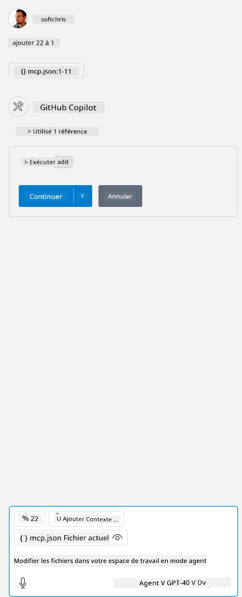

Cela correspond à l'exécution d'une commande comme celle-ci : `node build/index.js`.

- Modifiez cette entrée serveur pour indiquer l'emplacement de votre fichier serveur ou ce qui est nécessaire pour démarrer votre serveur en fonction de votre environnement d'exécution et de l'emplacement du serveur choisis.

## Utiliser les fonctionnalités dans le serveur

- Cliquez sur l'icône `play`, une fois que vous avez ajouté *mcp.json* dans le dossier *./vscode*,

    Observez le changement de l'icône des outils qui augmente le nombre d'outils disponibles. L'icône des outils se trouve juste au-dessus du champ de chat dans GitHub Copilot.

## Exécuter un outil

- Tapez une invite dans votre fenêtre de chat qui correspond à la description de votre outil. Par exemple, pour déclencher l'outil `add`, tapez quelque chose comme "add 3 to 20".

    Vous devriez voir un outil s'afficher au-dessus de la zone de texte du chat vous invitant à sélectionner l'outil pour l'exécuter, comme dans cette illustration :

    

    La sélection de l'outil devrait produire un résultat numérique indiquant "23" si votre invite était comme celle mentionnée précédemment.

**Avertissement** :  
Ce document a été traduit à l’aide du service de traduction automatique [Co-op Translator](https://github.com/Azure/co-op-translator). Bien que nous nous efforcions d’assurer l’exactitude, veuillez noter que les traductions automatiques peuvent contenir des erreurs ou des inexactitudes. Le document original dans sa langue d’origine doit être considéré comme la source faisant foi. Pour les informations critiques, une traduction professionnelle réalisée par un humain est recommandée. Nous déclinons toute responsabilité en cas de malentendus ou de mauvaises interprétations résultant de l’utilisation de cette traduction.