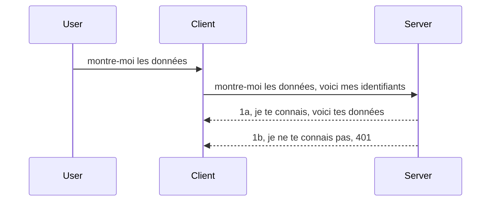

# Auth simple

Les SDK MCP prennent en charge l'utilisation d'OAuth 2.1, qui, pour être honnête, est un processus assez complexe impliquant des concepts tels que serveur d'authentification, serveur de ressources, envoi des identifiants, obtention d'un code, échange du code contre un jeton d'accès jusqu'à ce que vous puissiez enfin obtenir vos données de ressource. Si vous n'êtes pas habitué à OAuth, ce qui est une excellente chose à mettre en œuvre, il est judicieux de commencer par un niveau d'authentification basique et de progresser vers une sécurité de plus en plus renforcée. C'est pourquoi ce chapitre existe, pour vous faire progresser vers une authentification plus avancée.

## Auth, que voulons-nous dire ?

Auth est l'abréviation d'authentification et d'autorisation. L'idée est que nous devons faire deux choses :

- **Authentification**, qui est le processus permettant de déterminer si nous laissons une personne entrer dans notre maison, c'est-à-dire qu'elle a le droit d'être "ici", c'est-à-dire d'accéder à notre serveur de ressources où vivent les fonctionnalités de notre serveur MCP.
- **Autorisation**, est le processus permettant de savoir si un utilisateur doit avoir accès à ces ressources spécifiques qu'il demande, par exemple ces commandes ou ces produits, ou s'il est autorisé à lire le contenu mais pas à supprimer, par exemple.

## Identifiants : comment nous disons au système qui nous sommes

Eh bien, la plupart des développeurs web pensent en termes de fournir un identifiant au serveur, généralement un secret qui dit s'ils sont autorisés à être ici, c'est-à-dire l'authentification. Cet identifiant est généralement une version encodée en base64 du nom d'utilisateur et du mot de passe ou une clé API qui identifie de manière unique un utilisateur spécifique.

Cela implique de l'envoyer via un en-tête appelé "Authorization" comme ceci :

```json
{ "Authorization": "secret123" }
```

Cela est généralement appelé authentification basique. Le flux global fonctionne alors de la manière suivante :


Maintenant que nous comprenons comment cela fonctionne du point de vue du flux, comment l'implémenter ? Eh bien, la plupart des serveurs web ont un concept appelé middleware, un morceau de code qui s'exécute dans le cadre de la requête et peut vérifier les identifiants, et si les identifiants sont valides, peut laisser passer la requête. Si la requête ne contient pas d'identifiants valides, alors vous obtenez une erreur d'authentification. Voyons comment cela peut être implémenté :

**Python**

```python
class AuthMiddleware(BaseHTTPMiddleware):
    async def dispatch(self, request, call_next):

        has_header = request.headers.get("Authorization")
        if not has_header:
            print("-> Missing Authorization header!")
            return Response(status_code=401, content="Unauthorized")

        if not valid_token(has_header):
            print("-> Invalid token!")
            return Response(status_code=403, content="Forbidden")

        print("Valid token, proceeding...")
       
        response = await call_next(request)
        # ajouter des en-têtes client ou modifier la réponse d'une manière quelconque
        return response


starlette_app.add_middleware(CustomHeaderMiddleware)
```

Ici nous avons : 

- Créé un middleware appelé `AuthMiddleware` dont la méthode `dispatch` est invoquée par le serveur web.
- Ajouté le middleware au serveur web :

    ```python
    starlette_app.add_middleware(AuthMiddleware)
    ```

- Écrit une logique de validation qui vérifie si l’en-tête Authorization est présent et si le secret envoyé est valide :

    ```python
    has_header = request.headers.get("Authorization")
    if not has_header:
        print("-> Missing Authorization header!")
        return Response(status_code=401, content="Unauthorized")

    if not valid_token(has_header):
        print("-> Invalid token!")
        return Response(status_code=403, content="Forbidden")
    ```

    si le secret est présent et valide, alors nous laissons passer la requête en appelant `call_next` et retournons la réponse.

    ```python
    response = await call_next(request)
    # ajouter des en-têtes clients ou modifier la réponse d'une certaine manière
    return response
    ```

Le fonctionnement est que si une requête web est faite vers le serveur, le middleware sera invoqué et selon son implémentation, il laissera passer la requête ou finira par retourner une erreur indiquant que le client n’est pas autorisé à continuer.

**TypeScript**

Ici, nous créons un middleware avec le populaire framework Express et interceptons la requête avant qu'elle n'atteigne le serveur MCP. Voici le code pour cela :

```typescript
function isValid(secret) {
    return secret === "secret123";
}

app.use((req, res, next) => {
    // 1. En-tête d'autorisation présent ?
    if(!req.headers["Authorization"]) {
        res.status(401).send('Unauthorized');
    }
    
    let token = req.headers["Authorization"];

    // 2. Vérifier la validité.
    if(!isValid(token)) {
        res.status(403).send('Forbidden');
    }

   
    console.log('Middleware executed');
    // 3. Transmet la requête à l'étape suivante dans le pipeline de requêtes.
    next();
});
```

Dans ce code, nous :

1. Vérifions si l’en-tête Authorization est présent en premier lieu, sinon nous envoyons une erreur 401.
2. Vérifions si l’identifiant / jeton est valide, sinon nous envoyons une erreur 403.
3. Finalement, transmettons la requête dans le pipeline et retournons la ressource demandée.

## Exercice : Implémenter l'authentification

Prenons nos connaissances et essayons de l'implémenter. Voici le plan :

Serveur

- Créer un serveur web et une instance MCP.
- Implémenter un middleware pour le serveur.

Client

- Envoyer une requête web, avec identifiant, via un en-tête.

### -1- Créer un serveur web et une instance MCP

Dans notre première étape, nous devons créer l'instance serveur web et le serveur MCP.

**Python**

Ici, nous créons une instance serveur MCP, créons une application web starlette et la diffusons avec uvicorn.

```python
# création du serveur MCP

app = FastMCP(
    name="MCP Resource Server",
    instructions="Resource Server that validates tokens via Authorization Server introspection",
    host=settings["host"],
    port=settings["port"],
    debug=True
)

# création de l'application web starlette
starlette_app = app.streamable_http_app()

# service de l'application via uvicorn
async def run(starlette_app):
    import uvicorn
    config = uvicorn.Config(
            starlette_app,
            host=app.settings.host,
            port=app.settings.port,
            log_level=app.settings.log_level.lower(),
        )
    server = uvicorn.Server(config)
    await server.serve()

run(starlette_app)
```

Dans ce code, nous :

- Créons le serveur MCP.
- Construisons l'application web starlette à partir du serveur MCP, `app.streamable_http_app()`.
- Hébergeons et servons l'app web en utilisant uvicorn `server.serve()`.

**TypeScript**

Ici, nous créons une instance serveur MCP.

```typescript
const server = new McpServer({
      name: "example-server",
      version: "1.0.0"
    });

    // ... configurer les ressources serveur, les outils et les invites ...
```

Cette création du serveur MCP devra avoir lieu dans notre définition de route POST /mcp, alors prenons le code ci-dessus et déplaçons-le comme ceci :

```typescript
import express from "express";
import { randomUUID } from "node:crypto";
import { McpServer } from "@modelcontextprotocol/sdk/server/mcp.js";
import { StreamableHTTPServerTransport } from "@modelcontextprotocol/sdk/server/streamableHttp.js";
import { isInitializeRequest } from "@modelcontextprotocol/sdk/types.js"

const app = express();
app.use(express.json());

// Carte pour stocker les transports par ID de session
const transports: { [sessionId: string]: StreamableHTTPServerTransport } = {};

// Gérer les requêtes POST pour la communication client-serveur
app.post('/mcp', async (req, res) => {
  // Vérifier l'existence de l'ID de session
  const sessionId = req.headers['mcp-session-id'] as string | undefined;
  let transport: StreamableHTTPServerTransport;

  if (sessionId && transports[sessionId]) {
    // Réutiliser le transport existant
    transport = transports[sessionId];
  } else if (!sessionId && isInitializeRequest(req.body)) {
    // Nouvelle requête d'initialisation
    transport = new StreamableHTTPServerTransport({
      sessionIdGenerator: () => randomUUID(),
      onsessioninitialized: (sessionId) => {
        // Stocker le transport par ID de session
        transports[sessionId] = transport;
      },
      // La protection contre le rebinding DNS est désactivée par défaut pour la compatibilité ascendante. Si vous exécutez ce serveur
      // localement, assurez-vous de définir :
      // enableDnsRebindingProtection : true,
      // allowedHosts : ['127.0.0.1'],
    });

    // Nettoyer le transport lorsqu'il est fermé
    transport.onclose = () => {
      if (transport.sessionId) {
        delete transports[transport.sessionId];
      }
    };
    const server = new McpServer({
      name: "example-server",
      version: "1.0.0"
    });

    // ... configurer les ressources, outils et invites du serveur ...

    // Se connecter au serveur MCP
    await server.connect(transport);
  } else {
    // Requête invalide
    res.status(400).json({
      jsonrpc: '2.0',
      error: {
        code: -32000,
        message: 'Bad Request: No valid session ID provided',
      },
      id: null,
    });
    return;
  }

  // Gérer la requête
  await transport.handleRequest(req, res, req.body);
});

// Gestionnaire réutilisable pour les requêtes GET et DELETE
const handleSessionRequest = async (req: express.Request, res: express.Response) => {
  const sessionId = req.headers['mcp-session-id'] as string | undefined;
  if (!sessionId || !transports[sessionId]) {
    res.status(400).send('Invalid or missing session ID');
    return;
  }
  
  const transport = transports[sessionId];
  await transport.handleRequest(req, res);
};

// Gérer les requêtes GET pour les notifications serveur-client via SSE
app.get('/mcp', handleSessionRequest);

// Gérer les requêtes DELETE pour la terminaison de session
app.delete('/mcp', handleSessionRequest);

app.listen(3000);
```

Vous voyez maintenant comment la création du serveur MCP a été déplacée dans `app.post("/mcp")`.

Passons à l'étape suivante qui est de créer le middleware pour pouvoir valider les identifiants entrants.

### -2- Implémenter un middleware pour le serveur

Passons maintenant à la partie middleware. Ici, nous allons créer un middleware qui recherche un identifiant dans l’en-tête `Authorization` et le valide. S’il est acceptable, la requête pourra continuer pour faire ce qu’elle doit faire (par ex. lister des outils, lire une ressource ou toute fonctionnalité MCP demandée par le client).

**Python**

Pour créer le middleware, nous devons créer une classe qui hérite de `BaseHTTPMiddleware`. Il y a deux éléments intéressants :

- La requête `request`, dont nous lisons les informations d’en-tête.
- `call_next`, le callback que nous devons appeler si le client a apporté un identifiant que nous acceptons.

D'abord, nous devons gérer le cas où l’en-tête `Authorization` est manquant :

```python
has_header = request.headers.get("Authorization")

# pas d'en-tête présent, échouer avec 401, sinon continuer.
if not has_header:
    print("-> Missing Authorization header!")
    return Response(status_code=401, content="Unauthorized")
```

Ici, nous envoyons un message 401 non autorisé car le client échoue à l’authentification.

Ensuite, si un identifiant a été soumis, nous devons vérifier sa validité comme ceci :

```python
 if not valid_token(has_header):
    print("-> Invalid token!")
    return Response(status_code=403, content="Forbidden")
```

Remarquez que nous envoyons un message 403 interdit ci-dessus. Voyons le middleware complet ci-dessous intégrant tout ce que nous avons mentionné :

```python
class AuthMiddleware(BaseHTTPMiddleware):
    async def dispatch(self, request, call_next):

        has_header = request.headers.get("Authorization")
        if not has_header:
            print("-> Missing Authorization header!")
            return Response(status_code=401, content="Unauthorized")

        if not valid_token(has_header):
            print("-> Invalid token!")
            return Response(status_code=403, content="Forbidden")

        print("Valid token, proceeding...")
        print(f"-> Received {request.method} {request.url}")
        response = await call_next(request)
        response.headers['Custom'] = 'Example'
        return response

```

Super, mais qu’en est-il de la fonction `valid_token` ? La voici ci-dessous :

```python
# NE PAS utiliser en production - améliorez-le !!
def valid_token(token: str) -> bool:
    # supprimez le préfixe "Bearer "
    if token.startswith("Bearer "):
        token = token[7:]
        return token == "secret-token"
    return False
```

Cela devrait évidemment être amélioré.

IMPORTANT : Vous ne devez JAMAIS avoir de secrets comme celui-ci dans le code. Idéalement, vous devriez récupérer la valeur de comparaison à partir d'une source de données ou d'un IDP (fournisseur de services d'identité) ou mieux encore, laisser l'IDP effectuer la validation.

**TypeScript**

Pour implémenter cela avec Express, nous devons appeler la méthode `use` qui prend des fonctions middleware.

Nous devons :

- Interagir avec la variable requête pour vérifier l’identifiant passé dans la propriété `Authorization`.
- Valider l’identifiant, et si oui, laisser la requête continuer et permettre à la requête MCP du client de faire ce qu’elle doit faire (par ex. lister des outils, lire une ressource ou tout autre aspect MCP).

Ici, nous vérifions si l’en-tête `Authorization` est présent, sinon, nous bloquons la requête :

```typescript
if(!req.headers["authorization"]) {
    res.status(401).send('Unauthorized');
    return;
}
```

Si l’en-tête n’est pas envoyé en premier lieu, vous recevez un 401.

Ensuite, nous vérifions si l’identifiant est valide, sinon nous bloquons à nouveau la requête avec un message légèrement différent :

```typescript
if(!isValid(token)) {
    res.status(403).send('Forbidden');
    return;
} 
```

Notez que vous recevez maintenant une erreur 403.

Voici le code complet :

```typescript
app.use((req, res, next) => {
    console.log('Request received:', req.method, req.url, req.headers);
    console.log('Headers:', req.headers["authorization"]);
    if(!req.headers["authorization"]) {
        res.status(401).send('Unauthorized');
        return;
    }
    
    let token = req.headers["authorization"];

    if(!isValid(token)) {
        res.status(403).send('Forbidden');
        return;
    }  

    console.log('Middleware executed');
    next();
});
```

Nous avons configuré le serveur web pour accepter un middleware afin de vérifier l’identifiant que le client nous envoie, espérons-le. Qu’en est-il du client lui-même ?

### -3- Envoyer une requête web avec identifiant via l’en-tête

Nous devons nous assurer que le client passe l’identifiant à travers l’en-tête. Comme nous allons utiliser un client MCP, nous devons comprendre comment cela se fait.

**Python**

Pour le client, nous devons passer un en-tête avec notre identifiant comme ceci :

```python
# NE pas coder en dur la valeur, la stocker au minimum dans une variable d'environnement ou un stockage plus sécurisé
token = "secret-token"

async with streamablehttp_client(
        url = f"http://localhost:{port}/mcp",
        headers = {"Authorization": f"Bearer {token}"}
    ) as (
        read_stream,
        write_stream,
        session_callback,
    ):
        async with ClientSession(
            read_stream,
            write_stream
        ) as session:
            await session.initialize()
      
            # TODO, ce que vous voulez faire dans le client, par ex. lister les outils, appeler les outils, etc.
```

Notez comment nous remplissons la propriété `headers` ainsi : `headers = {"Authorization": f"Bearer {token}"}`.

**TypeScript**

Nous pouvons résoudre cela en deux étapes :

1. Remplir un objet de configuration avec notre identifiant.
2. Passer cet objet de configuration au transport.

```typescript

// NE pas coder en dur la valeur comme montré ici. Au minimum, utilisez une variable d’environnement et quelque chose comme dotenv (en mode dev).
let token = "secret123"

// définir un objet d’option de transport client
let options: StreamableHTTPClientTransportOptions = {
  sessionId: sessionId,
  requestInit: {
    headers: {
      "Authorization": "secret123"
    }
  }
};

// passer l’objet options au transport
async function main() {
   const transport = new StreamableHTTPClientTransport(
      new URL(serverUrl),
      options
   );
```

Vous voyez ci-dessus comment nous avons dû créer un objet `options` et placer nos en-têtes sous la propriété `requestInit`.

IMPORTANT : Comment améliorer cela ? La mise en œuvre actuelle a quelques problèmes. Tout d'abord, passer un identifiant de cette manière est assez risqué sauf si vous avez au minimum HTTPS. Même dans ce cas, l’identifiant peut être volé, vous avez donc besoin d’un système où vous pouvez facilement révoquer le jeton et ajouter des contrôles supplémentaires tels que l’endroit d’où il vient, la fréquence des requêtes (comportement de type bot), en bref, il y a toute une série de préoccupations.

Cela étant dit, pour des API très simples où vous ne voulez pas que n’importe qui appelle votre API sans être authentifié, ce que nous avons ici est un bon début.

Cela dit, essayons de renforcer la sécurité un peu en utilisant un format standardisé comme JSON Web Token, également appelé JWT ou jetons "JOT".

## JSON Web Tokens, JWT

Donc, nous essayons d’améliorer les choses plutôt que d’envoyer des identifiants très simples. Quelles améliorations immédiates obtenons-nous en adoptant JWT ?

- **Améliorations de la sécurité**. Dans l’authentification basique, vous envoyez le nom d’utilisateur et le mot de passe sous forme de token encodé en base64 (ou une clé API) encore et encore, ce qui augmente le risque. Avec JWT, vous envoyez votre nom d’utilisateur et mot de passe et recevez un jeton en retour, de plus ce jeton est lié dans le temps, il expire. JWT vous permet d’utiliser facilement un contrôle d’accès fin avec rôles, scopes et permissions.
- **Statelessness et scalabilité**. Les JWT sont autonomes, ils contiennent toutes les infos utilisateur et éliminent la nécessité de stocker les sessions côté serveur. Le jeton peut aussi être validé localement.
- **Interopérabilité et fédération**. Les JWT sont au cœur de Open ID Connect et sont utilisés avec des fournisseurs d'identité connus comme Entra ID, Google Identity et Auth0. Ils rendent possible la connexion unique (SSO) et bien plus, en faisant une solution adaptée aux entreprises.
- **Modularité et flexibilité**. Les JWT peuvent aussi être utilisés avec des API Gateways comme Azure API Management, NGINX, et autres. Ils supportent aussi des scénarios d’authentification utilisateur et de communication serveur-à-serveur y compris l’usurpation d’identité et la délégation.
- **Performances et mise en cache**. Les JWT peuvent être mis en cache après décodage, ce qui réduit le besoin de parsing. Cela aide particulièrement les applications à fort trafic en améliorant le débit et en réduisant la charge sur votre infrastructure choisie.
- **Fonctionnalités avancées**. Ils supportent aussi l’introspection (vérification de validité côté serveur) et la révocation (rendre un jeton invalide).

Avec tous ces avantages, voyons comment passer notre implémentation au niveau supérieur.

## Transformer l'authentification basique en JWT

Donc, les changements à faire à haut niveau sont :

- **Apprendre à construire un jeton JWT** et le préparer pour être envoyé du client vers le serveur.
- **Valider un jeton JWT**, et si c’est valide, permettre au client d’accéder à nos ressources.
- **Stockage sécurisé des jetons**. Comment nous stockons ce jeton.
- **Protéger les routes**. Nous devons protéger les routes, dans notre cas, protéger les routes et fonctionnalités MCP spécifiques.
- **Ajouter des jetons de rafraîchissement**. S’assurer que nous créons des jetons à courte durée de vie mais aussi des jetons de rafraîchissement à longue durée de vie pouvant être utilisés pour obtenir de nouveaux jetons s’ils expirent. Également s’assurer qu’il existe un point de rafraîchissement ainsi qu’une stratégie de rotation.

### -1- Construire un jeton JWT

Tout d’abord, un jeton JWT comporte les parties suivantes :

- **header**, l’algorithme utilisé et le type de jeton.
- **payload**, les revendications, comme sub (l’utilisateur ou entité que le jeton représente. Dans un scénario d’authentification, c’est généralement l’ID utilisateur), exp (date d’expiration), role (le rôle).
- **signature**, signée avec un secret ou une clé privée.

Pour cela, nous devons construire l’en-tête, le payload et le jeton encodé.

**Python**

```python

import jwt
import jwt
from jwt.exceptions import ExpiredSignatureError, InvalidTokenError
import datetime

# Clé secrète utilisée pour signer le JWT
secret_key = 'your-secret-key'

header = {
    "alg": "HS256",
    "typ": "JWT"
}

# les informations utilisateur, ses revendications et le temps d'expiration
payload = {
    "sub": "1234567890",               # Sujet (ID utilisateur)
    "name": "User Userson",                # Réclamation personnalisée
    "admin": True,                     # Réclamation personnalisée
    "iat": datetime.datetime.utcnow(),# Émis à
    "exp": datetime.datetime.utcnow() + datetime.timedelta(hours=1)  # Expiration
}

# l'encoder
encoded_jwt = jwt.encode(payload, secret_key, algorithm="HS256", headers=header)
```

Dans le code ci-dessus nous avons :

- Défini un header utilisant HS256 comme algorithme et type JWT.
- Construit un payload contenant un sujet ou ID utilisateur, un nom d’utilisateur, un rôle, la date d’émission et la date d’expiration, implémentant ainsi l’aspect temporel mentionné plus tôt.

**TypeScript**

Ici nous aurons besoin de dépendances qui nous aideront à construire le jeton JWT.

Dépendances

```sh

npm install jsonwebtoken
npm install --save-dev @types/jsonwebtoken
```

Maintenant que nous avons cela, créons l’en-tête, le payload et à travers cela, le jeton encodé.

```typescript
import jwt from 'jsonwebtoken';

const secretKey = 'your-secret-key'; // Utilisez des variables d'environnement en production

// Définir la charge utile
const payload = {
  sub: '1234567890',
  name: 'User usersson',
  admin: true,
  iat: Math.floor(Date.now() / 1000), // Émis à
  exp: Math.floor(Date.now() / 1000) + 60 * 60 // Expire dans 1 heure
};

// Définir l'en-tête (optionnel, jsonwebtoken définit des valeurs par défaut)
const header = {
  alg: 'HS256',
  typ: 'JWT'
};

// Créer le token
const token = jwt.sign(payload, secretKey, {
  algorithm: 'HS256',
  header: header
});

console.log('JWT:', token);
```

Ce jeton est :

Signé avec HS256
Valide pour 1 heure
Comprend des revendications comme sub, name, admin, iat, et exp.

### -2- Valider un jeton

Nous devons également valider un jeton, c’est quelque chose que nous devons faire côté serveur pour nous assurer que ce que le client nous envoie est en fait valide. Il y a beaucoup de vérifications à faire ici, de la validation de sa structure à sa validité. Il est aussi conseillé d’ajouter d’autres vérifications pour s’assurer que l’utilisateur existe dans votre système et plus encore.

Pour valider un jeton, nous devons le décoder pour le lire et commencer à vérifier sa validité :

**Python**

```python

# Décoder et vérifier le JWT
try:
    decoded = jwt.decode(token, secret_key, algorithms=["HS256"])
    print("✅ Token is valid.")
    print("Decoded claims:")
    for key, value in decoded.items():
        print(f"  {key}: {value}")
except ExpiredSignatureError:
    print("❌ Token has expired.")
except InvalidTokenError as e:
    print(f"❌ Invalid token: {e}")

```

Dans ce code, nous appelons `jwt.decode` en utilisant le jeton, la clé secrète et l’algorithme choisi en entrée. Notez que nous utilisons un bloc try-catch car une validation ratée entraîne une erreur.

**TypeScript**

Ici, nous devons appeler `jwt.verify` pour obtenir une version décodée du jeton que nous pouvons analyser davantage. Si cet appel échoue, cela signifie que la structure du jeton est incorrecte ou qu’il n’est plus valide.

```typescript

try {
  const decoded = jwt.verify(token, secretKey);
  console.log('Decoded Payload:', decoded);
} catch (err) {
  console.error('Token verification failed:', err);
}
```

NOTE : comme mentionné précédemment, nous devrions effectuer des vérifications supplémentaires pour s’assurer que ce jeton désigne un utilisateur dans notre système et que cet utilisateur dispose bien des droits qu’il revendique.
Ensuite, examinons le contrôle d'accès basé sur les rôles, également connu sous le nom de RBAC.

## Ajout du contrôle d'accès basé sur les rôles

L'idée est que nous voulons exprimer que différents rôles ont des permissions différentes. Par exemple, nous supposons qu'un administrateur peut tout faire, qu'un utilisateur normal peut lire/écrire et qu'un invité peut seulement lire. Par conséquent, voici quelques niveaux de permission possibles :

- Admin.Write 
- User.Read
- Guest.Read

Voyons comment nous pouvons implémenter un tel contrôle avec un middleware. Les middlewares peuvent être ajoutés par route ainsi que pour toutes les routes.

**Python**

```python
from starlette.middleware.base import BaseHTTPMiddleware
from starlette.responses import JSONResponse
import jwt

# NE PAS avoir le secret dans le code comme ça, ceci est uniquement à des fins de démonstration. Lisez-le depuis un endroit sûr.
SECRET_KEY = "your-secret-key" # mettre ceci dans une variable d'environnement
REQUIRED_PERMISSION = "User.Read"

class JWTPermissionMiddleware(BaseHTTPMiddleware):
    async def dispatch(self, request, call_next):
        auth_header = request.headers.get("Authorization")
        if not auth_header or not auth_header.startswith("Bearer "):
            return JSONResponse({"error": "Missing or invalid Authorization header"}, status_code=401)

        token = auth_header.split(" ")[1]
        try:
            decoded = jwt.decode(token, SECRET_KEY, algorithms=["HS256"])
        except jwt.ExpiredSignatureError:
            return JSONResponse({"error": "Token expired"}, status_code=401)
        except jwt.InvalidTokenError:
            return JSONResponse({"error": "Invalid token"}, status_code=401)

        permissions = decoded.get("permissions", [])
        if REQUIRED_PERMISSION not in permissions:
            return JSONResponse({"error": "Permission denied"}, status_code=403)

        request.state.user = decoded
        return await call_next(request)


```

Il y a plusieurs façons d'ajouter le middleware comme ci-dessous :

```python

# Alt 1 : ajouter un middleware lors de la construction de l'application starlette
middleware = [
    Middleware(JWTPermissionMiddleware)
]

app = Starlette(routes=routes, middleware=middleware)

# Alt 2 : ajouter un middleware après que l'application starlette est déjà construite
starlette_app.add_middleware(JWTPermissionMiddleware)

# Alt 3 : ajouter un middleware par route
routes = [
    Route(
        "/mcp",
        endpoint=..., # gestionnaire
        middleware=[Middleware(JWTPermissionMiddleware)]
    )
]
```

**TypeScript**

Nous pouvons utiliser `app.use` et un middleware qui s'exécutera pour toutes les requêtes. 

```typescript
app.use((req, res, next) => {
    console.log('Request received:', req.method, req.url, req.headers);
    console.log('Headers:', req.headers["authorization"]);

    // 1. Vérifiez si l'en-tête d'autorisation a été envoyé

    if(!req.headers["authorization"]) {
        res.status(401).send('Unauthorized');
        return;
    }
    
    let token = req.headers["authorization"];

    // 2. Vérifiez si le jeton est valide
    if(!isValid(token)) {
        res.status(403).send('Forbidden');
        return;
    }  

    // 3. Vérifiez si l'utilisateur du jeton existe dans notre système
    if(!isExistingUser(token)) {
        res.status(403).send('Forbidden');
        console.log("User does not exist");
        return;
    }
    console.log("User exists");

    // 4. Vérifiez que le jeton possède les bonnes autorisations
    if(!hasScopes(token, ["User.Read"])){
        res.status(403).send('Forbidden - insufficient scopes');
    }

    console.log("User has required scopes");

    console.log('Middleware executed');
    next();
});

```

Il y a plusieurs choses que nous pouvons laisser faire à notre middleware et que notre middleware DOIT faire, notamment :

1. Vérifier si l'en-tête d'autorisation est présent
2. Vérifier si le token est valide, nous appelons `isValid` qui est une méthode que nous avons écrite pour vérifier l'intégrité et la validité du token JWT.
3. Vérifier que l'utilisateur existe dans notre système, nous devons vérifier cela.

   ```typescript
    // utilisateurs dans la base de données
   const users = [
     "user1",
     "User usersson",
   ]

   function isExistingUser(token) {
     let decodedToken = verifyToken(token);

     // À FAIRE, vérifier si l'utilisateur existe dans la base de données
     return users.includes(decodedToken?.name || "");
   }
   ```

   Ci-dessus, nous avons créé une liste très simple `users`, qui devrait évidemment se trouver dans une base de données.

4. De plus, nous devons aussi vérifier que le token a les bonnes permissions.

   ```typescript
   if(!hasScopes(token, ["User.Read"])){
        res.status(403).send('Forbidden - insufficient scopes');
   }
   ```

   Dans ce code ci-dessus du middleware, nous vérifions que le token contient la permission User.Read, sinon nous envoyons une erreur 403. Voici la méthode d'aide `hasScopes`.

   ```typescript
   function hasScopes(scope: string, requiredScopes: string[]) {
     let decodedToken = verifyToken(scope);
    return requiredScopes.every(scope => decodedToken?.scopes.includes(scope));
  }
   ```

Have a think which additional checks you should be doing, but these are the absolute minimum of checks you should be doing.

Using Express as a web framework is a common choice. There are helpers library when you use JWT so you can write less code.

- `express-jwt`, helper library that provides a middleware that helps decode your token.
- `express-jwt-permissions`, this provides a middleware `guard` that helps check if a certain permission is on the token.

Here's what these libraries can look like when used:

```typescript
const express = require('express');
const jwt = require('express-jwt');
const guard = require('express-jwt-permissions')();

const app = express();
const secretKey = 'your-secret-key'; // put this in env variable

// Decode JWT and attach to req.user
app.use(jwt({ secret: secretKey, algorithms: ['HS256'] }));

// Check for User.Read permission
app.use(guard.check('User.Read'));

// multiple permissions
// app.use(guard.check(['User.Read', 'Admin.Access']));

app.get('/protected', (req, res) => {
  res.json({ message: `Welcome ${req.user.name}` });
});

// Error handler
app.use((err, req, res, next) => {
  if (err.code === 'permission_denied') {
    return res.status(403).send('Forbidden');
  }
  next(err);
});

```

Vous avez maintenant vu comment le middleware peut être utilisé à la fois pour l'authentification et l'autorisation, mais qu'en est-il de MCP ? Cela change-t-il notre façon de faire l'authentification ? Découvrons-le dans la section suivante.

### -3- Ajouter RBAC à MCP

Vous avez vu jusqu'à présent comment ajouter RBAC via un middleware, cependant, pour MCP il n'y a pas de méthode facile pour ajouter un RBAC par fonctionnalité MCP, alors que faisons-nous ? Eh bien, nous devons simplement ajouter un code comme celui-ci qui vérifie dans ce cas si le client a les droits d'appeler un outil spécifique :

Vous avez plusieurs choix différents pour réaliser un RBAC par fonctionnalité, en voici quelques-uns :

- Ajouter une vérification pour chaque outil, ressource, prompt où vous devez vérifier le niveau de permission.

   **python**

   ```python
   @tool()
   def delete_product(id: int):
      try:
          check_permissions(role="Admin.Write", request)
      catch:
        pass # échec de l'autorisation du client, déclencher une erreur d'autorisation
   ```

   **typescript**

   ```typescript
   server.registerTool(
    "delete-product",
    {
      title: Delete a product",
      description: "Deletes a product",
      inputSchema: { id: z.number() }
    },
    async ({ id }) => {
      
      try {
        checkPermissions("Admin.Write", request);
        // à faire, envoyer l'id au productService et à l'entrée distante
      } catch(Exception e) {
        console.log("Authorization error, you're not allowed");  
      }

      return {
        content: [{ type: "text", text: `Deletected product with id ${id}` }]
      };
    }
   );
   ```


- Utiliser une approche serveur avancée et les gestionnaires de requêtes afin de minimiser le nombre d'endroits où vous devez faire la vérification.

   **Python**

   ```python
   
   tool_permission = {
      "create_product": ["User.Write", "Admin.Write"],
      "delete_product": ["Admin.Write"]
   }

   def has_permission(user_permissions, required_permissions) -> bool:
      # user_permissions : liste des permissions dont dispose l'utilisateur
      # required_permissions : liste des permissions requises pour l'outil
      return any(perm in user_permissions for perm in required_permissions)

   @server.call_tool()
   async def handle_call_tool(
     name: str, arguments: dict[str, str] | None
   ) -> list[types.TextContent]:
    # Supposer que request.user.permissions est une liste de permissions pour l'utilisateur
     user_permissions = request.user.permissions
     required_permissions = tool_permission.get(name, [])
     if not has_permission(user_permissions, required_permissions):
        # Lever une erreur "Vous n'avez pas la permission d'appeler l'outil {name}"
        raise Exception(f"You don't have permission to call tool {name}")
     # continuer et appeler l'outil
     # ...
   ```   
   

   **TypeScript**

   ```typescript
   function hasPermission(userPermissions: string[], requiredPermissions: string[]): boolean {
       if (!Array.isArray(userPermissions) || !Array.isArray(requiredPermissions)) return false;
       // Retourner vrai si l'utilisateur a au moins une autorisation requise
       
       return requiredPermissions.some(perm => userPermissions.includes(perm));
   }
  
   server.setRequestHandler(CallToolRequestSchema, async (request) => {
      const { params: { name } } = request;
  
      let permissions = request.user.permissions;
  
      if (!hasPermission(permissions, toolPermissions[name])) {
         return new Error(`You don't have permission to call ${name}`);
      }
  
      // continuez..
   });
   ```

   Notez que vous devrez vous assurer que votre middleware assigne un token décodé à la propriété user de la requête afin que le code ci-dessus soit simple.

### Résumé

Maintenant que nous avons discuté comment ajouter le support pour RBAC en général et pour MCP en particulier, il est temps d'essayer d'implémenter la sécurité par vous-même afin de vous assurer que vous avez bien compris les concepts qui vous ont été présentés.

## Exercice 1 : Construire un serveur MCP et un client MCP utilisant l'authentification basique

Ici vous allez reprendre ce que vous avez appris en termes d'envoi d'identifiants via les headers.

## Solution 1

[Solution 1](./code/basic/README.md)

## Exercice 2 : Améliorer la solution de l'Exercice 1 pour utiliser JWT

Prenez la première solution mais cette fois, améliorons-la. 

Au lieu d'utiliser l'authentification basique, utilisons JWT. 

## Solution 2

[Solution 2](./solution/jwt-solution/README.md)

## Défi

Ajoutez le RBAC par outil comme nous le décrivons dans la section "Ajouter RBAC à MCP".

## Résumé

Vous avez, espérons-le, beaucoup appris dans ce chapitre, de l'absence totale de sécurité à la sécurité basique, puis à JWT et comment il peut être ajouté à MCP.

Nous avons construit une base solide avec des JWT personnalisés, mais à mesure que nous évoluons, nous nous orientons vers un modèle d'identité basé sur des standards. Adopter un fournisseur d'identité comme Entra ou Keycloak nous permet de déléguer l'émission, la validation et la gestion du cycle de vie des tokens à une plateforme de confiance — nous libérant pour nous concentrer sur la logique d'application et l'expérience utilisateur.

Pour cela, nous avons un [chapitre plus avancé sur Entra](../../05-AdvancedTopics/mcp-security-entra/README.md).

## La suite

- Suivant : [Mise en place des hôtes MCP](../12-mcp-hosts/README.md)

---

<!-- CO-OP TRANSLATOR DISCLAIMER START -->
**Avertissement** :  
Ce document a été traduit à l'aide du service de traduction automatique [Co-op Translator](https://github.com/Azure/co-op-translator). Bien que nous nous efforcions d'assurer l'exactitude, veuillez noter que les traductions automatisées peuvent comporter des erreurs ou des inexactitudes. Le document original dans sa langue d'origine doit être considéré comme la source faisant foi. Pour les informations critiques, une traduction professionnelle réalisée par un humain est recommandée. Nous déclinons toute responsabilité en cas de malentendus ou d’interprétations erronées résultant de l'utilisation de cette traduction.
<!-- CO-OP TRANSLATOR DISCLAIMER END -->