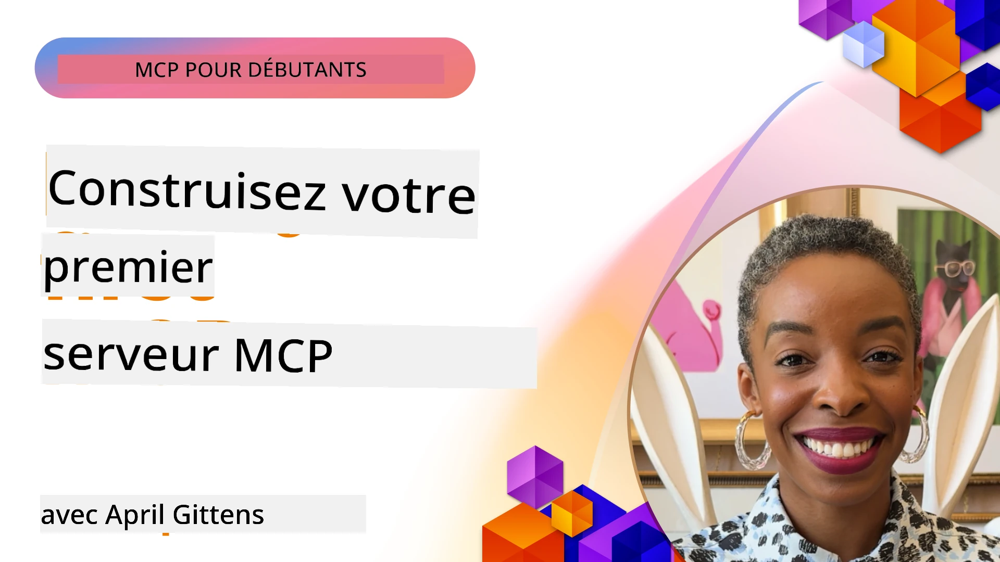

## Démarrage  

_(Cliquez sur l'image ci-dessus pour voir la vidéo de cette leçon)_

Cette section se compose de plusieurs leçons :

- **1 Votre premier serveur**, dans cette première leçon, vous apprendrez à créer votre premier serveur et à l’inspecter avec l’outil d’inspection, un moyen précieux pour tester et déboguer votre serveur, [vers la leçon](01-first-server/README.md)

- **2 Client**, dans cette leçon, vous apprendrez à écrire un client capable de se connecter à votre serveur, [vers la leçon](02-client/README.md)

- **3 Client avec LLM**, une façon encore meilleure d’écrire un client est d’y ajouter un LLM afin qu’il puisse "négocier" avec votre serveur ce qu’il doit faire, [vers la leçon](03-llm-client/README.md)

- **4 Consommation d’un serveur en mode Agent GitHub Copilot dans Visual Studio Code**. Ici, nous étudions comment exécuter notre serveur MCP depuis Visual Studio Code, [vers la leçon](04-vscode/README.md)

- **5 Serveur de transport stdio** stdio transport est la norme recommandée pour la communication locale serveur-client MCP, offrant une communication sécurisée basée sur un sous-processus avec isolement de processus intégré [vers la leçon](05-stdio-server/README.md)

- **6 Streaming HTTP avec MCP (HTTP Fluxable)**. Apprenez le transport moderne de streaming HTTP (l’approche recommandée pour les serveurs MCP distants selon la [Spécification MCP 2025-11-25](https://spec.modelcontextprotocol.io/specification/2025-11-25/basic/transports/#streamable-http)), les notifications de progression, et comment implémenter des serveurs et clients MCP évolutifs en temps réel utilisant le HTTP Fluxable. [vers la leçon](06-http-streaming/README.md)

- **7 Utilisation de AI Toolkit pour VSCode** pour consommer et tester vos clients et serveurs MCP [vers la leçon](07-aitk/README.md)

- **8 Tests**. Ici, nous nous concentrerons particulièrement sur les différentes façons de tester notre serveur et client, [vers la leçon](08-testing/README.md)

- **9 Déploiement**. Ce chapitre abordera différentes méthodes pour déployer vos solutions MCP, [vers la leçon](09-deployment/README.md)

- **10 Usage avancé du serveur**. Ce chapitre couvre l’utilisation avancée des serveurs, [vers la leçon](./10-advanced/README.md)

- **11 Authentification**. Ce chapitre explique comment ajouter une authentification simple, de l’authentification basique à l’utilisation de JWT et RBAC. Il est conseillé de commencer ici puis de consulter les sujets avancés au Chapitre 5 et d’appliquer d’autres durcissements de sécurité selon les recommandations du Chapitre 2, [vers la leçon](./11-simple-auth/README.md)

- **12 Hôtes MCP**. Configurez et utilisez les clients hôtes MCP populaires incluant Claude Desktop, Cursor, Cline, et Windsurf. Apprenez les types de transport et le dépannage, [vers la leçon](./12-mcp-hosts/README.md)

- **13 Inspecteur MCP**. Déboguez et testez vos serveurs MCP de manière interactive avec l’outil Inspecteur MCP. Apprenez à dépanner les outils, ressources, et messages de protocole, [vers la leçon](./13-mcp-inspector/README.md)

Le Model Context Protocol (MCP) est un protocole ouvert qui standardise la manière dont les applications fournissent du contexte aux LLM. Pensez à MCP comme un port USB-C pour les applications d’IA - il offre une méthode standardisée pour connecter les modèles d’IA à différentes sources de données et outils.

## Objectifs d’apprentissage

À la fin de cette leçon, vous serez capable de :

- Configurer des environnements de développement MCP en C#, Java, Python, TypeScript, et JavaScript
- Construire et déployer des serveurs MCP basiques avec des fonctionnalités personnalisées (ressources, invites, et outils)
- Créer des applications hôtes qui se connectent aux serveurs MCP
- Tester et déboguer les implémentations MCP
- Comprendre les défis courants d’installation et leurs solutions
- Connecter vos implémentations MCP aux services LLM populaires

## Configuration de votre environnement MCP

Avant de commencer à travailler avec MCP, il est important de préparer votre environnement de développement et de comprendre le flux de travail de base. Cette section vous guidera à travers les étapes initiales de configuration pour garantir un démarrage fluide avec MCP.

### Prérequis

Avant de plonger dans le développement MCP, assurez-vous de disposer de :

- **Environnement de développement** : pour votre langage choisi (C#, Java, Python, TypeScript ou JavaScript)
- **IDE/Éditeur** : Visual Studio, Visual Studio Code, IntelliJ, Eclipse, PyCharm, ou tout éditeur de code moderne
- **Gestionnaires de paquets** : NuGet, Maven/Gradle, pip, ou npm/yarn
- **Clés API** : pour tous les services IA que vous envisagez d’utiliser dans vos applications hôtes

### SDK officiels

Dans les prochains chapitres, vous verrez des solutions construites en Python, TypeScript, Java et .NET. Voici tous les SDK officiellement pris en charge.

MCP fournit des SDK officiels pour plusieurs langages (en accord avec la [Spécification MCP 2025-11-25](https://spec.modelcontextprotocol.io/specification/2025-11-25/)):
- [SDK C#](https://github.com/modelcontextprotocol/csharp-sdk) - Maintenu en collaboration avec Microsoft
- [SDK Java](https://github.com/modelcontextprotocol/java-sdk) - Maintenu en collaboration avec Spring AI
- [SDK TypeScript](https://github.com/modelcontextprotocol/typescript-sdk) - L’implémentation officielle TypeScript
- [SDK Python](https://github.com/modelcontextprotocol/python-sdk) - L’implémentation officielle Python (FastMCP)
- [SDK Kotlin](https://github.com/modelcontextprotocol/kotlin-sdk) - L’implémentation officielle Kotlin
- [SDK Swift](https://github.com/modelcontextprotocol/swift-sdk) - Maintenu en collaboration avec Loopwork AI
- [SDK Rust](https://github.com/modelcontextprotocol/rust-sdk) - L’implémentation officielle Rust
- [SDK Go](https://github.com/modelcontextprotocol/go-sdk) - L’implémentation officielle Go

## Points clés

- Configurer un environnement de développement MCP est simple avec des SDK spécifiques aux langages
- Construire des serveurs MCP implique de créer et d’enregistrer des outils avec des schémas clairs
- Les clients MCP se connectent aux serveurs et modèles pour tirer parti des capacités étendues
- Les tests et débogages sont essentiels pour des implémentations MCP fiables
- Les options de déploiement vont du développement local aux solutions basées sur le cloud

## Pratique

Nous disposons d’un ensemble d’exemples qui complètent les exercices que vous verrez dans tous les chapitres de cette section. De plus, chaque chapitre possède aussi ses propres exercices et devoirs

- [Calculatrice Java](./samples/java/calculator/README.md)
- [Calculatrice .Net](../../../03-GettingStarted/samples/csharp)
- [Calculatrice JavaScript](./samples/javascript/README.md)
- [Calculatrice TypeScript](./samples/typescript/README.md)
- [Calculatrice Python](../../../03-GettingStarted/samples/python)

## Ressources supplémentaires

- [Construire des agents avec Model Context Protocol sur Azure](https://learn.microsoft.com/azure/developer/ai/intro-agents-mcp)
- [MCP distant avec Azure Container Apps (Node.js/TypeScript/JavaScript)](https://learn.microsoft.com/samples/azure-samples/mcp-container-ts/mcp-container-ts/)
- [Agent MCP OpenAI .NET](https://learn.microsoft.com/samples/azure-samples/openai-mcp-agent-dotnet/openai-mcp-agent-dotnet/)

## Et après ?

Commencez par la première leçon : [Créer votre premier serveur MCP](01-first-server/README.md)

Une fois ce module terminé, continuez avec : [Module 4 : Implémentation pratique](../04-PracticalImplementation/README.md)

---

<!-- CO-OP TRANSLATOR DISCLAIMER START -->
**Avertissement** :  
Ce document a été traduit à l’aide du service de traduction automatique [Co-op Translator](https://github.com/Azure/co-op-translator). Bien que nous nous efforcions d’assurer la précision, veuillez noter que les traductions automatiques peuvent contenir des erreurs ou des inexactitudes. Le document original dans sa langue d’origine doit être considéré comme la source faisant foi. Pour les informations critiques, une traduction professionnelle réalisée par un humain est recommandée. Nous ne sommes pas responsables des malentendus ou des mauvaises interprétations résultant de l’utilisation de cette traduction.
<!-- CO-OP TRANSLATOR DISCLAIMER END -->