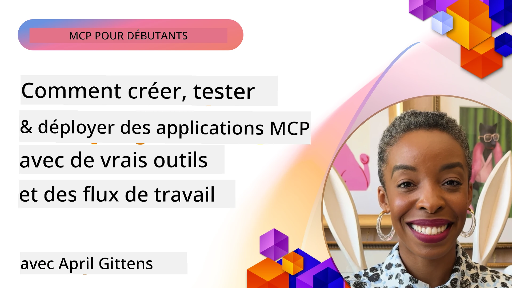
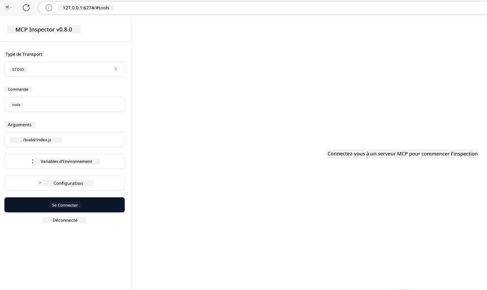

# Mise en œuvre pratique

[](https://youtu.be/vCN9-mKBDfQ)

_(Cliquez sur l'image ci-dessus pour voir la vidéo de cette leçon)_

La mise en œuvre pratique est là où la puissance du Model Context Protocol (MCP) devient tangible. Bien que comprendre la théorie et l'architecture derrière MCP soit important, la véritable valeur émerge lorsque vous appliquez ces concepts pour construire, tester et déployer des solutions qui résolvent des problèmes du monde réel. Ce chapitre comble le fossé entre les connaissances conceptuelles et le développement pratique, en vous guidant à travers le processus de mise en œuvre d'applications basées sur MCP.

Que vous développiez des assistants intelligents, intégriez l'IA dans des flux de travail d'entreprise, ou construisiez des outils personnalisés pour le traitement des données, MCP offre une base flexible. Sa conception indépendante du langage et ses SDK officiels pour les langages de programmation populaires le rendent accessible à un large éventail de développeurs. En tirant parti de ces SDK, vous pouvez rapidement prototyper, itérer et faire évoluer vos solutions sur différentes plateformes et environnements.

Dans les sections suivantes, vous trouverez des exemples pratiques, des codes d'exemple et des stratégies de déploiement qui démontrent comment implémenter MCP en C#, Java avec Spring, TypeScript, JavaScript et Python. Vous apprendrez également comment déboguer et tester vos serveurs MCP, gérer les API et déployer des solutions dans le cloud avec Azure. Ces ressources pratiques sont conçues pour accélérer votre apprentissage et vous aider à construire en toute confiance des applications MCP robustes, prêtes pour la production.

## Vue d'ensemble

Cette leçon se concentre sur les aspects pratiques de la mise en œuvre de MCP dans plusieurs langages de programmation. Nous explorerons comment utiliser les SDK MCP en C#, Java avec Spring, TypeScript, JavaScript et Python pour construire des applications robustes, déboguer et tester les serveurs MCP, et créer des ressources, prompts et outils réutilisables.

## Objectifs d'apprentissage

À la fin de cette leçon, vous serez capable de :

- Implémenter des solutions MCP en utilisant des SDK officiels dans divers langages de programmation
- Déboguer et tester systématiquement les serveurs MCP
- Créer et utiliser des fonctionnalités serveur (Ressources, Prompts et Outils)
- Concevoir des flux de travail MCP efficaces pour des tâches complexes
- Optimiser les implémentations MCP pour la performance et la fiabilité

## Ressources des SDK officiels

Le Model Context Protocol offre des SDK officiels pour plusieurs langages (alignés avec la [spécification MCP 2025-11-25](https://spec.modelcontextprotocol.io/specification/2025-11-25/)) :

- [SDK C#](https://github.com/modelcontextprotocol/csharp-sdk)
- [SDK Java avec Spring](https://github.com/modelcontextprotocol/java-sdk) **Note :** nécessite une dépendance à [Project Reactor](https://projectreactor.io). (Voir [discussion issue 246](https://github.com/orgs/modelcontextprotocol/discussions/246).)
- [SDK TypeScript](https://github.com/modelcontextprotocol/typescript-sdk)
- [SDK Python](https://github.com/modelcontextprotocol/python-sdk)
- [SDK Kotlin](https://github.com/modelcontextprotocol/kotlin-sdk)
- [SDK Go](https://github.com/modelcontextprotocol/go-sdk)

## Travailler avec les SDK MCP

Cette section fournit des exemples pratiques d'implémentation MCP dans plusieurs langages de programmation. Vous pouvez trouver du code d'exemple dans le répertoire `samples` organisé par langage.

### Échantillons disponibles

Le dépôt inclut des [implémentations d'exemple](../../../04-PracticalImplementation/samples) dans les langages suivants :

- [C#](./samples/csharp/README.md)
- [Java avec Spring](./samples/java/containerapp/README.md)
- [TypeScript](./samples/typescript/README.md)
- [JavaScript](./samples/javascript/README.md)
- [Python](./samples/python/README.md)

Chaque exemple illustre les concepts clés MCP et les modèles d'implémentation pour le langage et l'écosystème spécifiques.

### Guides pratiques

Guides supplémentaires pour une mise en œuvre pratique de MCP :

- [Pagination et grands ensembles de résultats](./pagination/README.md) - Gérer une pagination basée sur le curseur pour les outils, ressources et grands ensembles de données

## Fonctionnalités principales du serveur

Les serveurs MCP peuvent implémenter n'importe quelle combinaison des fonctionnalités suivantes :

### Ressources

Les ressources fournissent un contexte et des données pour l'utilisateur ou le modèle IA :

- Dépôts de documents
- Bases de connaissances
- Sources de données structurées
- Systèmes de fichiers

### Prompts

Les prompts sont des messages et des flux de travail modélisés pour les utilisateurs :

- Modèles de conversation prédéfinis
- Schémas d'interaction guidés
- Structures de dialogue spécialisées

### Outils

Les outils sont des fonctions que le modèle IA peut exécuter :

- Utilitaires de traitement de données
- Intégrations d'API externes
- Capacités de calcul
- Fonctionnalités de recherche

## Implémentations exemples : Implémentation C#

Le dépôt officiel du SDK C# contient plusieurs exemples d'implémentations démontrant différents aspects de MCP :

- **Client MCP basique** : Exemple simple montrant comment créer un client MCP et appeler des outils
- **Serveur MCP basique** : Implémentation minimale de serveur avec enregistrement basique d'outils
- **Serveur MCP avancé** : Serveur complet avec enregistrement d'outils, authentification et gestion des erreurs
- **Intégration ASP.NET** : Exemples démontrant l'intégration avec ASP.NET Core
- **Modèles d'implémentation d'outils** : Divers modèles pour implémenter des outils avec différents niveaux de complexité

Le SDK C# MCP est en version preview et ses API peuvent évoluer. Nous mettrons continuellement à jour ce blog au fur et à mesure de l'évolution du SDK.

### Fonctionnalités clés

- [Nuget C# MCP ModelContextProtocol](https://www.nuget.org/packages/ModelContextProtocol)
- Construire votre [premier serveur MCP](https://devblogs.microsoft.com/dotnet/build-a-model-context-protocol-mcp-server-in-csharp/).

Pour des exemples complets d'implémentations C#, visitez le [dépôt officiel des exemples SDK C#](https://github.com/modelcontextprotocol/csharp-sdk)

## Exemple d'implémentation : Implémentation Java avec Spring

Le SDK Java avec Spring offre des options robustes d'implémentation MCP avec des fonctionnalités de niveau entreprise.

### Fonctionnalités clés

- Intégration avec le framework Spring
- Forte sécurité de type
- Support de la programmation réactive
- Gestion complète des erreurs

Pour un exemple complet d'implémentation Java avec Spring, consultez [exemple Java avec Spring](samples/java/containerapp/README.md) dans le répertoire des exemples.

## Exemple d'implémentation : Implémentation JavaScript

Le SDK JavaScript offre une approche légère et flexible pour l'implémentation MCP.

### Fonctionnalités clés

- Support Node.js et navigateur
- API basée sur les Promises
- Intégration facile avec Express et autres frameworks
- Support WebSocket pour le streaming

Pour un exemple complet d'implémentation JavaScript, consultez [exemple JavaScript](samples/javascript/README.md) dans le répertoire des exemples.

## Exemple d'implémentation : Implémentation Python

Le SDK Python propose une approche pythonique de l'implémentation MCP avec d'excellentes intégrations aux frameworks ML.

### Fonctionnalités clés

- Support async/await avec asyncio
- Intégration FastAPI``
- Enregistrement simple d'outils
- Intégration native avec les bibliothèques ML populaires

Pour un exemple complet d'implémentation Python, consultez [exemple Python](samples/python/README.md) dans le répertoire des exemples.

## Gestion des API

Azure API Management est une excellente solution pour sécuriser les serveurs MCP. L'idée est de placer une instance Azure API Management devant votre serveur MCP et de lui laisser gérer des fonctionnalités que vous souhaitez comme :

- limitation de débit
- gestion des tokens
- surveillance
- équilibrage de charge
- sécurité

### Exemple Azure

Voici un exemple Azure faisant exactement cela, c’est-à-dire [créer un serveur MCP et le sécuriser avec Azure API Management](https://github.com/Azure-Samples/remote-mcp-apim-functions-python).

Voyez comment le flux d’autorisation se déroule dans l’image ci-dessous :


Dans l’image ci-dessus, les événements suivants ont lieu :

- L’authentification/autorisation se fait via Microsoft Entra.
- Azure API Management agit comme une passerelle et utilise des politiques pour diriger et gérer le trafic.
- Azure Monitor enregistre toutes les requêtes pour une analyse ultérieure.

#### Flux d’autorisation

Examinons plus en détail le flux d’autorisation :


#### Spécification d’autorisation MCP

En savoir plus sur la [spécification d’autorisation MCP](https://spec.modelcontextprotocol.io/specification/2025-11-25/basic/authorization/)

## Déployer un serveur MCP distant sur Azure

Voyons si nous pouvons déployer l’exemple mentionné plus haut :

1. Cloner le dépôt

    ```bash
    git clone https://github.com/Azure-Samples/remote-mcp-apim-functions-python.git
    cd remote-mcp-apim-functions-python
    ```

1. Enregistrez le fournisseur de ressources `Microsoft.App`.

   - Si vous utilisez Azure CLI, exécutez `az provider register --namespace Microsoft.App --wait`.
   - Si vous utilisez Azure PowerShell, exécutez `Register-AzResourceProvider -ProviderNamespace Microsoft.App`. Puis exécutez `(Get-AzResourceProvider -ProviderNamespace Microsoft.App).RegistrationState` après un moment pour vérifier si l’enregistrement est complet.

1. Exécutez cette commande [azd](https://aka.ms/azd) pour provisionner le service de gestion d’API, l’app fonction (avec le code) et toutes les autres ressources Azure requises.

    ```shell
    azd up
    ```

    Cette commande devrait déployer toutes les ressources cloud sur Azure.

### Tester votre serveur avec MCP Inspector

1. Dans une **nouvelle fenêtre de terminal**, installez et lancez MCP Inspector

    ```shell
    npx @modelcontextprotocol/inspector
    ```

    Vous devriez voir une interface similaire à :

    

1. Cliquez en maintenant CTRL pour charger l’application web MCP Inspector depuis l’URL affichée par l’application (par exemple [http://127.0.0.1:6274/#resources](http://127.0.0.1:6274/#resources))
1. Réglez le type de transport sur `SSE`
1. Réglez l’URL sur le point de terminaison SSE de gestion d’API en cours d’exécution affiché après `azd up` et **Connectez-vous** :

    ```shell
    https://<apim-servicename-from-azd-output>.azure-api.net/mcp/sse
    ```

1. **Lister les outils**. Cliquez sur un outil et **Exécuter l’outil**.  

Si toutes les étapes ont fonctionné, vous devriez être maintenant connecté au serveur MCP et avoir pu appeler un outil.

## Serveurs MCP pour Azure

[Remote-mcp-functions](https://github.com/Azure-Samples/remote-mcp-functions-dotnet) : Ce jeu de dépôts est un modèle de démarrage rapide pour construire et déployer des serveurs MCP (Model Context Protocol) distants personnalisés utilisant Azure Functions avec Python, C# .NET ou Node/TypeScript.

Les exemples fournissent une solution complète qui permet aux développeurs de :

- Construire et exécuter localement : développer et déboguer un serveur MCP sur une machine locale
- Déployer sur Azure : déployer facilement sur le cloud avec une simple commande azd up
- Se connecter depuis des clients : connecter le serveur MCP à partir de divers clients, dont le mode agent Copilot de VS Code et l’outil MCP Inspector

### Fonctionnalités clés

- Sécurité par conception : le serveur MCP est sécurisé avec des clés et HTTPS
- Options d’authentification : prise en charge OAuth utilisant l’authentification intégrée et/ou API Management
- Isolation réseau : permet l’isolation réseau via les réseaux virtuels Azure (VNET)
- Architecture serverless : utilise Azure Functions pour une exécution scalable et pilotée par les événements
- Développement local : support complet pour le développement et le débogage locaux
- Déploiement simple : processus de déploiement simplifié vers Azure

Le dépôt contient tous les fichiers de configuration nécessaires, le code source, et les définitions d’infrastructure pour démarrer rapidement avec une implémentation de serveur MCP prête pour la production.

- [Azure Remote MCP Functions Python](https://github.com/Azure-Samples/remote-mcp-functions-python) - Implémentation exemple MCP utilisant Azure Functions avec Python

- [Azure Remote MCP Functions .NET](https://github.com/Azure-Samples/remote-mcp-functions-dotnet) - Implémentation exemple MCP utilisant Azure Functions avec C# .NET

- [Azure Remote MCP Functions Node/Typescript](https://github.com/Azure-Samples/remote-mcp-functions-typescript) - Implémentation exemple MCP utilisant Azure Functions avec Node/TypeScript.

## Points clés à retenir

- Les SDK MCP fournissent des outils spécifiques au langage pour implémenter des solutions MCP robustes
- Le processus de débogage et de test est crucial pour des applications MCP fiables
- Les modèles de prompts réutilisables permettent des interactions IA cohérentes
- Des workflows bien conçus peuvent orchestrer des tâches complexes utilisant plusieurs outils
- La mise en œuvre de solutions MCP nécessite de prendre en compte la sécurité, la performance et la gestion des erreurs

## Exercice

Concevez un workflow MCP pratique qui traite un problème réel dans votre domaine :

1. Identifiez 3 ou 4 outils qui pourraient être utiles pour résoudre ce problème
2. Créez un diagramme de workflow montrant comment ces outils interagissent
3. Implémentez une version basique de l’un des outils dans votre langage préféré
4. Créez un modèle de prompt qui aiderait le modèle à utiliser efficacement votre outil

## Ressources supplémentaires

---

## Et après ?

Suite : [Sujets avancés](../05-AdvancedTopics/README.md)

---

<!-- CO-OP TRANSLATOR DISCLAIMER START -->
**Avertissement** :  
Ce document a été traduit à l’aide du service de traduction automatique [Co-op Translator](https://github.com/Azure/co-op-translator). Bien que nous nous efforçons d’assurer l’exactitude, veuillez noter que les traductions automatiques peuvent contenir des erreurs ou des inexactitudes. Le document original dans sa langue d’origine doit être considéré comme la source faisant autorité. Pour des informations critiques, il est recommandé de recourir à une traduction professionnelle réalisée par un humain. Nous déclinons toute responsabilité en cas de malentendus ou de mauvaises interprétations résultant de l’utilisation de cette traduction.
<!-- CO-OP TRANSLATOR DISCLAIMER END -->