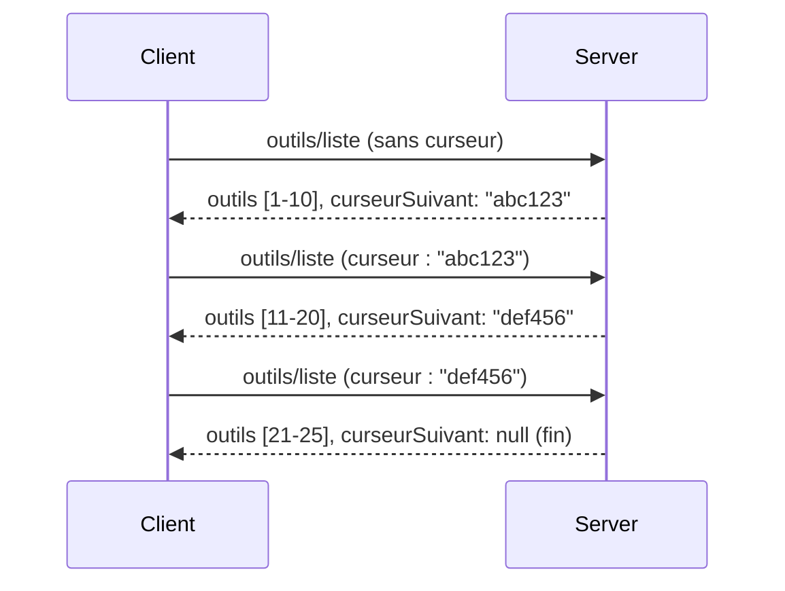

# Pagination et grands ensembles de résultats dans MCP

Lorsque votre serveur MCP traite de grands ensembles de données - qu’il s’agisse de lister des milliers de fichiers, des enregistrements de base de données ou des résultats de recherche - vous avez besoin de la pagination pour gérer la mémoire efficacement et offrir une expérience utilisateur réactive. Ce guide couvre comment implémenter et utiliser la pagination dans MCP.

## Pourquoi la pagination est importante

Sans pagination, les grandes réponses peuvent causer :

- **Épuisement de la mémoire** - Chargement de millions d’enregistrements à la fois
- **Temps de réponse lents** - Les utilisateurs attendent que toutes les données soient chargées
- **Erreurs de dépassement de délai** - Les requêtes dépassent les limites de timeout
- **Mauvaise performance de l’IA** - Les LLM ont du mal avec un contexte massif

MCP utilise la **pagination basée sur curseur** pour une pagination fiable et cohérente à travers les ensembles de résultats.

---

## Comment fonctionne la pagination dans MCP

### Le concept de curseur

Un **curseur** est une chaîne opaque qui marque votre position dans un ensemble de résultats. Pensez-y comme un marque-page dans un long livre.


### Pagination dans les méthodes MCP

Ces méthodes MCP supportent la pagination :

| Méthode | Retourne | Support du curseur |
|--------|---------|----------------|
| `tools/list` | Définitions d’outils | ✅ |
| `resources/list` | Définitions de ressources | ✅ |
| `prompts/list` | Définitions de prompts | ✅ |
| `resources/templates/list` | Modèles de ressources | ✅ |

---

## Implémentation côté serveur

### Python (FastMCP)

```python
from mcp.server import Server
from mcp.types import Tool, ListToolsResult
import math

app = Server("paginated-server")

# Jeu de données volumineux simulé
ALL_TOOLS = [
    Tool(name=f"tool_{i}", description=f"Tool number {i}", inputSchema={})
    for i in range(100)
]

PAGE_SIZE = 10

@app.list_tools()
async def list_tools(cursor: str | None = None) -> ListToolsResult:
    """List tools with pagination support."""
    
    # Décoder le curseur pour obtenir l'indice de départ
    start_index = 0
    if cursor:
        try:
            start_index = int(cursor)
        except ValueError:
            start_index = 0
    
    # Obtenir la page de résultats
    end_index = min(start_index + PAGE_SIZE, len(ALL_TOOLS))
    page_tools = ALL_TOOLS[start_index:end_index]
    
    # Calculer le curseur suivant
    next_cursor = None
    if end_index < len(ALL_TOOLS):
        next_cursor = str(end_index)
    
    return ListToolsResult(
        tools=page_tools,
        nextCursor=next_cursor
    )
```

### TypeScript

```typescript
import { Server } from "@modelcontextprotocol/sdk/server/index.js";
import { ListToolsResultSchema } from "@modelcontextprotocol/sdk/types.js";

const server = new Server({
  name: "paginated-server",
  version: "1.0.0"
});

// Grand ensemble de données simulé
const ALL_TOOLS = Array.from({ length: 100 }, (_, i) => ({
  name: `tool_${i}`,
  description: `Tool number ${i}`,
  inputSchema: { type: "object", properties: {} }
}));

const PAGE_SIZE = 10;

server.setRequestHandler(ListToolsResultSchema, async (request) => {
  // Décode le curseur
  let startIndex = 0;
  if (request.params?.cursor) {
    startIndex = parseInt(request.params.cursor, 10) || 0;
  }
  
  // Obtenir la page de résultats
  const endIndex = Math.min(startIndex + PAGE_SIZE, ALL_TOOLS.length);
  const pageTools = ALL_TOOLS.slice(startIndex, endIndex);
  
  // Calculer le curseur suivant
  const nextCursor = endIndex < ALL_TOOLS.length ? String(endIndex) : undefined;
  
  return {
    tools: pageTools,
    nextCursor
  };
});
```

### Java (Spring MCP)

```java
@Service
public class PaginatedToolService {
    
    private static final int PAGE_SIZE = 10;
    private final List<Tool> allTools;
    
    public PaginatedToolService() {
        // Initialiser un grand ensemble de données
        this.allTools = IntStream.range(0, 100)
            .mapToObj(i -> new Tool("tool_" + i, "Tool number " + i, Map.of()))
            .collect(Collectors.toList());
    }
    
    @McpMethod("tools/list")
    public ListToolsResult listTools(@Param("cursor") String cursor) {
        // Décoder le curseur
        int startIndex = 0;
        if (cursor != null && !cursor.isEmpty()) {
            try {
                startIndex = Integer.parseInt(cursor);
            } catch (NumberFormatException e) {
                startIndex = 0;
            }
        }
        
        // Obtenir une page de résultats
        int endIndex = Math.min(startIndex + PAGE_SIZE, allTools.size());
        List<Tool> pageTools = allTools.subList(startIndex, endIndex);
        
        // Calculer le curseur suivant
        String nextCursor = endIndex < allTools.size() ? String.valueOf(endIndex) : null;
        
        return new ListToolsResult(pageTools, nextCursor);
    }
}
```

---

## Implémentation côté client

### Client Python

```python
from mcp import ClientSession

async def get_all_tools(session: ClientSession) -> list:
    """Fetch all tools using pagination."""
    all_tools = []
    cursor = None
    
    while True:
        result = await session.list_tools(cursor=cursor)
        all_tools.extend(result.tools)
        
        if result.nextCursor is None:
            break
        cursor = result.nextCursor
    
    return all_tools

# Utilisation
async with client_session as session:
    tools = await get_all_tools(session)
    print(f"Found {len(tools)} tools")
```

### Client TypeScript

```typescript
import { Client } from "@modelcontextprotocol/sdk/client/index.js";

async function getAllTools(client: Client): Promise<Tool[]> {
  const allTools: Tool[] = [];
  let cursor: string | undefined = undefined;
  
  do {
    const result = await client.listTools({ cursor });
    allTools.push(...result.tools);
    cursor = result.nextCursor;
  } while (cursor);
  
  return allTools;
}

// Utilisation
const tools = await getAllTools(client);
console.log(`Found ${tools.length} tools`);
```

### Modèle de chargement paresseux

Pour de très grands ensembles de données, chargez les pages à la demande :

```python
class PaginatedToolIterator:
    """Lazily iterate through paginated tools."""
    
    def __init__(self, session: ClientSession):
        self.session = session
        self.cursor = None
        self.buffer = []
        self.exhausted = False
    
    async def __anext__(self):
        # Retourner du tampon si disponible
        if self.buffer:
            return self.buffer.pop(0)
        
        # Vérifier si nous avons épuisé toutes les pages
        if self.exhausted:
            raise StopAsyncIteration
        
        # Récupérer la page suivante
        result = await self.session.list_tools(cursor=self.cursor)
        self.buffer = list(result.tools)
        self.cursor = result.nextCursor
        
        if self.cursor is None:
            self.exhausted = True
        
        if not self.buffer:
            raise StopAsyncIteration
        
        return self.buffer.pop(0)
    
    def __aiter__(self):
        return self

# Utilisation - efficace en mémoire pour de grands ensembles de données
async for tool in PaginatedToolIterator(session):
    process_tool(tool)
```

---

## Pagination pour les ressources

Les ressources nécessitent souvent une pagination pour les dossiers ou grands ensembles de données :

```python
from mcp.server import Server
from mcp.types import Resource, ListResourcesResult
import os

app = Server("file-server")

@app.list_resources()
async def list_resources(cursor: str | None = None) -> ListResourcesResult:
    """List files in directory with pagination."""
    
    directory = "/data/files"
    all_files = sorted(os.listdir(directory))
    
    # Décoder le curseur (index de fichier)
    start_index = int(cursor) if cursor else 0
    page_size = 20
    end_index = min(start_index + page_size, len(all_files))
    
    # Créer la liste de ressources pour cette page
    resources = []
    for filename in all_files[start_index:end_index]:
        filepath = os.path.join(directory, filename)
        resources.append(Resource(
            uri=f"file://{filepath}",
            name=filename,
            mimeType="application/octet-stream"
        ))
    
    # Calculer le curseur suivant
    next_cursor = str(end_index) if end_index < len(all_files) else None
    
    return ListResourcesResult(
        resources=resources,
        nextCursor=next_cursor
    )
```

---

## Stratégies de conception de curseurs

### Stratégie 1 : Basé sur l’indice (Simple)

```python
# Le curseur est juste l'indice
cursor = "50"  # Commencer à l'élément 50
```

**Avantages :** Simple, sans état  
**Inconvénients :** Les résultats peuvent changer si des éléments sont ajoutés/supprimés

### Stratégie 2 : Basé sur l’ID (Stable)

```python
# Le curseur est le dernier ID vu
cursor = "item_abc123"  # Commencez après cet élément
```

**Avantages :** Stable même si les éléments changent  
**Inconvénients :** Nécessite des IDs ordonnés

### Stratégie 3 : État encodé (Complexe)

```python
import base64
import json

def encode_cursor(state: dict) -> str:
    return base64.b64encode(json.dumps(state).encode()).decode()

def decode_cursor(cursor: str) -> dict:
    return json.loads(base64.b64decode(cursor).decode())

# Le curseur contient plusieurs champs d'état
cursor = encode_cursor({
    "offset": 50,
    "filter": "active",
    "sort": "name"
})
```

**Avantages :** Peut encoder un état complexe  
**Inconvénients :** Plus complexe, chaînes de curseur plus volumineuses

---

## Bonnes pratiques

### 1. Choisissez des tailles de page appropriées

```python
# Considérez la taille des données
PAGE_SIZE_SMALL_ITEMS = 100   # Métadonnées simples
PAGE_SIZE_MEDIUM_ITEMS = 20   # Objets plus riches
PAGE_SIZE_LARGE_ITEMS = 5     # Contenu complexe
```

### 2. Gérez gracieusement les curseurs invalides

```python
@app.list_tools()
async def list_tools(cursor: str | None = None) -> ListToolsResult:
    try:
        start_index = int(cursor) if cursor else 0
        if start_index < 0 or start_index >= len(ALL_TOOLS):
            start_index = 0  # Réinitialiser au début
    except (ValueError, TypeError):
        start_index = 0  # Curseur invalide, recommencer
    # ...
```

### 3. Incluez le nombre total (optionnel)

```python
return ListToolsResult(
    tools=page_tools,
    nextCursor=next_cursor,
    # Certaines implémentations incluent un total pour la progression de l'interface utilisateur
    _meta={"total": len(ALL_TOOLS)}
)
```

### 4. Testez les cas limites

```python
async def test_pagination():
    # Ensemble de résultats vide
    result = await session.list_tools()
    assert result.tools == []
    assert result.nextCursor is None
    
    # Page unique
    result = await session.list_tools()
    assert len(result.tools) <= PAGE_SIZE
    
    # Curseur invalide
    result = await session.list_tools(cursor="invalid")
    assert result.tools  # Devrait retourner la première page
```

---

## Pièges courants

### ❌ Retourner tous les résultats puis paginer côté client

```python
# MAUVAIS : Charge tout en mémoire
@app.list_tools()
async def list_tools() -> ListToolsResult:
    all_tools = load_all_tools()  # 1 million d'outils !
    return ListToolsResult(tools=all_tools)
```

### ✅ Paginer à la source des données

```python
# BON : Charge uniquement ce qui est nécessaire
@app.list_tools()
async def list_tools(cursor: str | None = None) -> ListToolsResult:
    offset = int(cursor) if cursor else 0
    tools = await db.query_tools(offset=offset, limit=PAGE_SIZE)
    return ListToolsResult(tools=tools, nextCursor=...)
```

---

## Quoi de neuf

- [Module 5.14 - Ingénierie du contexte](../../05-AdvancedTopics/mcp-contextengineering/README.md)
- [Module 8 - Bonnes pratiques](../../08-BestPractices/README.md)
- [3.8 - Tester votre serveur MCP](../../03-GettingStarted/08-testing/README.md)

---

## Ressources supplémentaires

- [Spécification MCP - Pagination](https://spec.modelcontextprotocol.io/specification/2025-11-25/)
- [Pagination basée sur curseur expliquée](https://slack.engineering/evolving-api-pagination-at-slack/)
- [Tests de pagination du SDK Python](https://github.com/modelcontextprotocol/python-sdk/blob/main/tests/client/test_list_methods_cursor.py)

---

<!-- CO-OP TRANSLATOR DISCLAIMER START -->
**Avertissement** :  
Ce document a été traduit à l’aide du service de traduction automatique [Co-op Translator](https://github.com/Azure/co-op-translator). Bien que nous nous efforcions d’assurer l’exactitude, veuillez noter que les traductions automatisées peuvent contenir des erreurs ou des inexactitudes. Le document original dans sa langue d’origine doit être considéré comme la source faisant autorité. Pour les informations critiques, une traduction professionnelle réalisée par un humain est recommandée. Nous déclinons toute responsabilité en cas de malentendus ou d’interprétations erronées résultant de l’utilisation de cette traduction.
<!-- CO-OP TRANSLATOR DISCLAIMER END -->