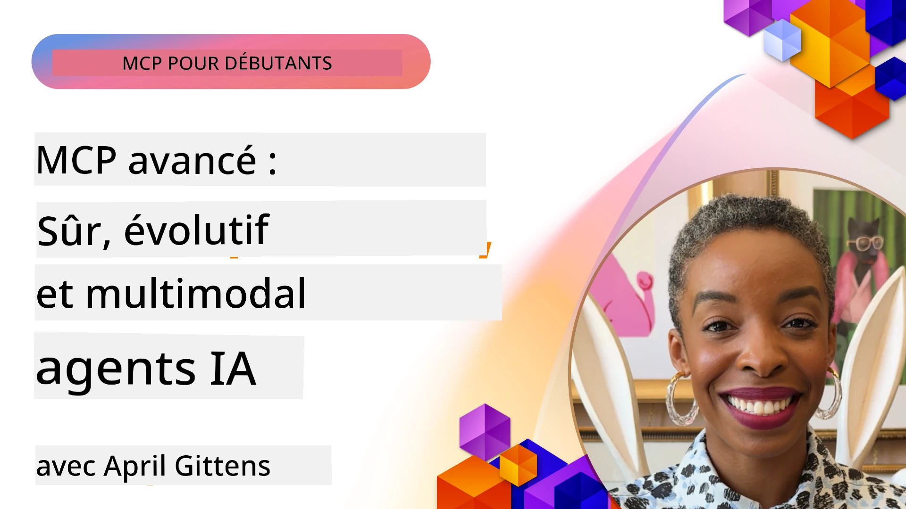

# Sujets avancés en MCP

_(Cliquez sur l'image ci-dessus pour visionner la vidéo de cette leçon)_

Ce chapitre couvre une série de sujets avancés dans l’implémentation du Model Context Protocol (MCP), incluant l’intégration multi-modale, la scalabilité, les bonnes pratiques de sécurité et l’intégration en entreprise. Ces sujets sont cruciaux pour construire des applications MCP robustes et prêtes pour la production capables de répondre aux exigences des systèmes d’IA modernes.

## Vue d’ensemble

Cette leçon explore des concepts avancés dans l’implémentation du Model Context Protocol, en mettant l’accent sur l’intégration multi-modale, la scalabilité, les bonnes pratiques de sécurité et l’intégration en entreprise. Ces sujets sont essentiels pour développer des applications MCP de qualité production capables de gérer des exigences complexes dans des environnements d’entreprise.

## Objectifs d’apprentissage

À la fin de cette leçon, vous serez capable de :

- Implémenter des capacités multi-modales au sein des frameworks MCP
- Concevoir des architectures MCP scalables pour des scénarios à forte demande
- Appliquer les meilleures pratiques de sécurité alignées avec les principes de sécurité de MCP
- Intégrer MCP avec des systèmes et frameworks d’IA en entreprise
- Optimiser la performance et la fiabilité en environnement de production

## Leçons et projets d’exemple

| Lien | Titre | Description |
|------|-------|-------------|
| [5.1 Integration with Azure](./mcp-integration/README.md) | Intégration avec Azure | Apprenez à intégrer votre serveur MCP sur Azure |
| [5.2 Multi modal sample](./mcp-multi-modality/README.md) | Exemples MCP multi-modaux | Exemples pour audio, image et réponse multi-modale |
| [5.3 MCP OAuth2 sample](../../../05-AdvancedTopics/mcp-oauth2-demo) | Démo MCP OAuth2 | Application Spring Boot minimale montrant OAuth2 avec MCP, à la fois en tant que serveur d'autorisation et de ressources. Démontre l’émission sécurisée de tokens, des points de terminaison protégés, le déploiement sur Azure Container Apps, et l’intégration avec API Management. |
| [5.4 Root Contexts](./mcp-root-contexts/README.md) | Contextes racines | En savoir plus sur le contexte racine et comment les implémenter |
| [5.5 Routing](./mcp-routing/README.md) | Routage | Apprenez différents types de routage |
| [5.6 Sampling](./mcp-sampling/README.md) | Échantillonnage | Apprenez à travailler avec l’échantillonnage |
| [5.7 Scaling](./mcp-scaling/README.md) | Mise à l’échelle | Apprenez la mise à l’échelle |
| [5.8 Security](./mcp-security/README.md) | Sécurité | Sécurisez votre serveur MCP |
| [5.9 Web Search sample](./web-search-mcp/README.md) | Recherche web MCP | Serveur et client MCP Python intégrant SerpAPI pour la recherche web, actualités, produits et Q&A en temps réel. Démontre l’orchestration multi-outils, l’intégration d’API externes, et une gestion robuste des erreurs. |
| [5.10 Realtime Streaming](./mcp-realtimestreaming/README.md) | Streaming | Le streaming de données en temps réel est devenu essentiel dans le monde actuel axé sur les données, où entreprises et applications nécessitent un accès immédiat à l’information pour prendre des décisions rapides. |
| [5.11 Realtime Web Search](./mcp-realtimesearch/README.md) | Recherche web | Comment MCP transforme la recherche web en temps réel en fournissant une approche standardisée de gestion du contexte entre modèles IA, moteurs de recherche et applications. | 
| [5.12  Entra ID Authentication for Model Context Protocol Servers](./mcp-security-entra/README.md) | Authentification Entra ID | Microsoft Entra ID offre une solution robuste de gestion des identités et des accès basée sur le cloud, garantissant que seuls les utilisateurs et applications autorisés peuvent interagir avec votre serveur MCP. |
| [5.13 Azure AI Foundry Agent Integration](./mcp-foundry-agent-integration/README.md) | Intégration Azure AI Foundry | Apprenez à intégrer les serveurs MCP avec les agents Azure AI Foundry, permettant une orchestration puissante des outils et des capacités IA d’entreprise avec des connexions standardisées aux sources de données externes. |
| [5.14 Context Engineering](./mcp-contextengineering/README.md) | Ingénierie du contexte | Opportunités futures des techniques d’ingénierie du contexte pour les serveurs MCP, incluant l’optimisation du contexte, la gestion dynamique du contexte, et des stratégies pour un prompt engineering efficace dans les frameworks MCP. |
| [5.15 MCP Custom Transport](./mcp-transport/README.md) | Transport personnalisé | Apprenez à implémenter des mécanismes de transport personnalisés pour des scénarios de communication MCP spécialisés. |
| [5.16 Protocol Features Deep Dive](./mcp-protocol-features/README.md) | Fonctionnalités du protocole | Maîtrisez les fonctionnalités avancées du protocole dont les notifications de progression, l’annulation de requêtes, les modèles de ressources, et les patterns de gestion des erreurs. |

> **Nouveauté dans la spécification MCP 2025-11-25** : La spécification inclut désormais un support expérimental pour les **tâches** (opérations longues avec suivi de progression), les **annotations d’outils** (métadonnées sur le comportement d’outils pour la sécurité), l’**élucidation du mode URL** (demande de contenu spécifique depuis les clients via URL), et des **racines** améliorées (pour gestion du contexte de l’espace de travail). Consultez le [changelog de la spécification MCP](https://spec.modelcontextprotocol.io/) pour tous les détails.

## Références supplémentaires

Pour les informations les plus à jour sur les sujets avancés MCP, consultez :
- [Documentation MCP](https://modelcontextprotocol.io/)
- [Spécification MCP (2025-11-25)](https://spec.modelcontextprotocol.io/specification/2025-11-25/)
- [Dépôt GitHub](https://github.com/modelcontextprotocol)
- [OWASP MCP Top 10](https://microsoft.github.io/mcp-azure-security-guide/mcp/) - Risques de sécurité et mitigations
- [Atelier MCP Security Summit (Sherpa)](https://azure-samples.github.io/sherpa/) - Formation pratique en sécurité

## Points clés à retenir

- Les implémentations MCP multi-modales étendent les capacités IA au-delà du traitement du texte
- La scalabilité est essentielle pour les déploiements en entreprise et peut être adressée par une mise à l’échelle horizontale et verticale
- Des mesures de sécurité complètes protègent les données et assurent un contrôle d’accès adéquat
- L’intégration en entreprise avec des plateformes comme Azure OpenAI et Microsoft AI Foundry renforce les capacités MCP
- Les implémentations avancées MCP bénéficient d’architectures optimisées et d’une gestion rigoureuse des ressources

## Exercice

Concevez une implémentation MCP de niveau entreprise pour un cas d’usage spécifique :

1. Identifiez les exigences multi-modales pour votre cas d’usage
2. Définissez les contrôles de sécurité nécessaires pour protéger les données sensibles
3. Concevez une architecture scalable capable de gérer des charges variables
4. Planifiez les points d’intégration avec les systèmes IA d’entreprise
5. Documentez les goulets d’étranglement potentiels en performance et les stratégies d’atténuation

## Ressources supplémentaires

- [Documentation Azure OpenAI](https://learn.microsoft.com/en-us/azure/ai-services/openai/)
- [Documentation Microsoft AI Foundry](https://learn.microsoft.com/en-us/ai-services/)

---

## Quelle est la suite

Explorez les leçons de ce module en commençant par : [5.1 MCP Integration](./mcp-integration/README.md)

Une fois ce module terminé, poursuivez avec : [Module 6 : Contributions de la communauté](../06-CommunityContributions/README.md)

---

<!-- CO-OP TRANSLATOR DISCLAIMER START -->
**Clause de non-responsabilité** :  
Ce document a été traduit à l’aide du service de traduction automatique [Co-op Translator](https://github.com/Azure/co-op-translator). Bien que nous nous efforcions d’assurer l’exactitude, veuillez noter que les traductions automatiques peuvent contenir des erreurs ou des inexactitudes. Le document original dans sa langue d’origine doit être considéré comme la source faisant foi. Pour les informations critiques, il est recommandé de faire appel à une traduction professionnelle effectuée par un humain. Nous ne saurions être tenus responsables de tout malentendu ou mauvaise interprétation résultant de l’utilisation de cette traduction.
<!-- CO-OP TRANSLATOR DISCLAIMER END -->