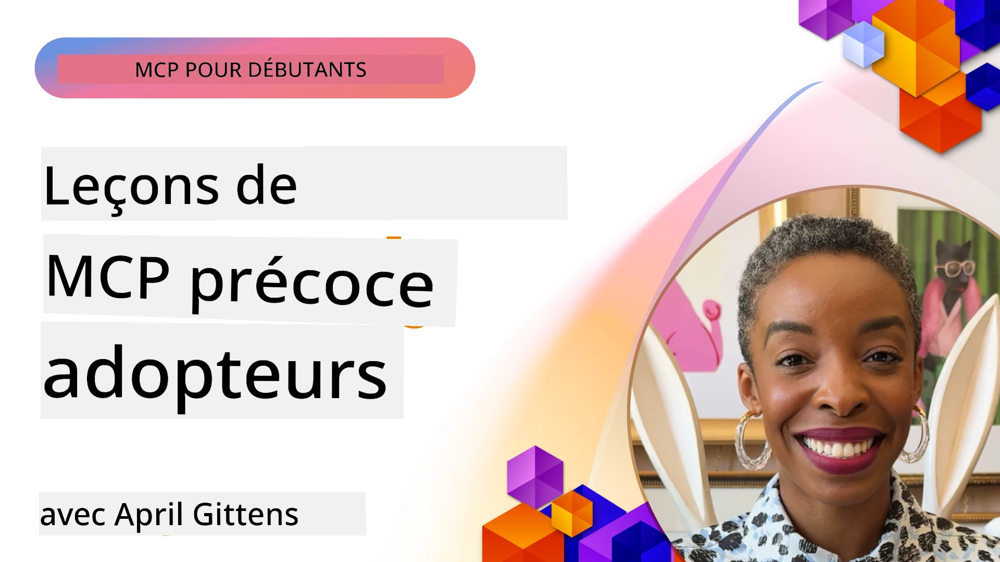

# 🌟 Leçons des premiers utilisateurs

[](https://youtu.be/jds7dSmNptE)

_(Cliquez sur l'image ci-dessus pour voir la vidéo de cette leçon)_

## 🎯 Ce que ce module couvre

Ce module explore comment de vraies organisations et développeurs utilisent le Model Context Protocol (MCP) pour résoudre des défis concrets et stimuler l'innovation. À travers des études de cas détaillées, des projets pratiques et des exemples concrets, vous découvrirez comment MCP permet une intégration IA sécurisée, évolutive, qui connecte les modèles de langage, les outils et les données d’entreprise.

### 📚 Voir MCP en action

Vous voulez voir ces principes appliqués à des outils prêts pour la production ? Découvrez nos [**10 serveurs MCP Microsoft qui transforment la productivité des développeurs**](microsoft-mcp-servers.md), qui présentent de vrais serveurs MCP Microsoft que vous pouvez utiliser dès aujourd’hui.

## Présentation

Cette leçon explore comment les premiers utilisateurs ont exploité le Model Context Protocol (MCP) pour résoudre des problèmes réels et favoriser l’innovation dans divers secteurs. Grâce à des études de cas détaillées et des projets pratiques, vous verrez comment MCP permet une intégration IA standardisée, sécurisée et évolutive — connectant les grands modèles de langage, les outils et les données d’entreprise dans un cadre unifié. Vous acquerrez une expérience pratique dans la conception et la construction de solutions basées sur MCP, apprendrez à partir de modèles d’implémentation éprouvés et découvrirez des bonnes pratiques pour déployer MCP en environnement de production. La leçon met aussi en avant les tendances émergentes, les orientations futures et les ressources open source pour vous aider à rester à la pointe de la technologie MCP et de son écosystème en évolution.

## Objectifs d'apprentissage

- Analyser des implémentations MCP réelles dans différents secteurs
- Concevoir et construire des applications complètes basées sur MCP
- Explorer les tendances émergentes et les futures orientations de la technologie MCP
- Appliquer les bonnes pratiques dans des scénarios de développement concrets

## Implémentations MCP dans le monde réel

### Étude de cas 1 : Automatisation du support client en entreprise

Une multinationale a mis en œuvre une solution basée sur MCP pour standardiser les interactions IA dans leurs systèmes de support client. Cela leur a permis de :

- Créer une interface unifiée pour plusieurs fournisseurs de LLM
- Maintenir une gestion cohérente des prompts entre les départements
- Mettre en place des contrôles robustes de sécurité et de conformité
- Passer facilement d’un modèle IA à un autre selon les besoins spécifiques

**Implémentation technique :**

```python
# Implémentation du serveur MCP Python pour le support client
import logging
import asyncio
from modelcontextprotocol import create_server, ServerConfig
from modelcontextprotocol.server import MCPServer
from modelcontextprotocol.transports import create_http_transport
from modelcontextprotocol.resources import ResourceDefinition
from modelcontextprotocol.prompts import PromptDefinition
from modelcontextprotocol.tool import ToolDefinition

# Configurer la journalisation
logging.basicConfig(level=logging.INFO)

async def main():
    # Créer la configuration du serveur
    config = ServerConfig(
        name="Enterprise Customer Support Server",
        version="1.0.0",
        description="MCP server for handling customer support inquiries"
    )
    
    # Initialiser le serveur MCP
    server = create_server(config)
    
    # Enregistrer les ressources de la base de connaissances
    server.resources.register(
        ResourceDefinition(
            name="customer_kb",
            description="Customer knowledge base documentation"
        ),
        lambda params: get_customer_documentation(params)
    )
    
    # Enregistrer les modèles d'invite
    server.prompts.register(
        PromptDefinition(
            name="support_template",
            description="Templates for customer support responses"
        ),
        lambda params: get_support_templates(params)
    )
    
    # Enregistrer les outils de support
    server.tools.register(
        ToolDefinition(
            name="ticketing",
            description="Create and update support tickets"
        ),
        handle_ticketing_operations
    )
    
    # Démarrer le serveur avec le transport HTTP
    transport = create_http_transport(port=8080)
    await server.run(transport)

if __name__ == "__main__":
    asyncio.run(main())
```
  
**Résultats :** Réduction des coûts des modèles de 30 %, amélioration de la cohérence des réponses de 45 %, et conformité renforcée à l’échelle mondiale.

### Étude de cas 2 : Assistant de diagnostic en santé

Un fournisseur de soins de santé a développé une infrastructure MCP pour intégrer plusieurs modèles IA médicaux spécialisés tout en garantissant la protection des données sensibles des patients :

- Passage fluide entre modèles médicaux généralistes et spécialistes  
- Contrôles stricts de confidentialité et pistes d’audit  
- Intégration avec les systèmes existants de dossiers médicaux électroniques (DME)  
- Ingénierie cohérente des prompts pour la terminologie médicale

**Implémentation technique :**

```csharp
// C# MCP host application implementation in healthcare application
using Microsoft.Extensions.DependencyInjection;
using ModelContextProtocol.SDK.Client;
using ModelContextProtocol.SDK.Security;
using ModelContextProtocol.SDK.Resources;

public class DiagnosticAssistant
{
    private readonly MCPHostClient _mcpClient;
    private readonly PatientContext _patientContext;
    
    public DiagnosticAssistant(PatientContext patientContext)
    {
        _patientContext = patientContext;
        
        // Configure MCP client with healthcare-specific settings
        var clientOptions = new ClientOptions
        {
            Name = "Healthcare Diagnostic Assistant",
            Version = "1.0.0",
            Security = new SecurityOptions
            {
                Encryption = EncryptionLevel.Medical,
                AuditEnabled = true
            }
        };
        
        _mcpClient = new MCPHostClientBuilder()
            .WithOptions(clientOptions)
            .WithTransport(new HttpTransport("https://healthcare-mcp.example.org"))
            .WithAuthentication(new HIPAACompliantAuthProvider())
            .Build();
    }
    
    public async Task<DiagnosticSuggestion> GetDiagnosticAssistance(
        string symptoms, string patientHistory)
    {
        // Create request with appropriate resources and tool access
        var resourceRequest = new ResourceRequest
        {
            Name = "patient_records",
            Parameters = new Dictionary<string, object>
            {
                ["patientId"] = _patientContext.PatientId,
                ["requestingProvider"] = _patientContext.ProviderId
            }
        };
        
        // Request diagnostic assistance using appropriate prompt
        var response = await _mcpClient.SendPromptRequestAsync(
            promptName: "diagnostic_assistance",
            parameters: new Dictionary<string, object>
            {
                ["symptoms"] = symptoms,
                patientHistory = patientHistory,
                relevantGuidelines = _patientContext.GetRelevantGuidelines()
            });
            
        return DiagnosticSuggestion.FromMCPResponse(response);
    }
}
```
  
**Résultats :** Suggestions de diagnostic améliorées pour les médecins tout en maintenant une conformité complète HIPAA et une réduction significative des changements de contexte entre systèmes.

### Étude de cas 3 : Analyse des risques en services financiers

Une institution financière a utilisé MCP pour standardiser ses processus d’analyse des risques dans différents départements :

- Création d’une interface unifiée pour les modèles de risque de crédit, détection de fraude et risque d’investissement  
- Mise en place de contrôles d’accès stricts et versionnage des modèles  
- Garantie de l’auditabilité de toutes les recommandations IA  
- Maintien d’un format de données cohérent entre systèmes divers

**Implémentation technique :**

```java
// Serveur MCP Java pour l'évaluation des risques financiers
import org.mcp.server.*;
import org.mcp.security.*;

public class FinancialRiskMCPServer {
    public static void main(String[] args) {
        // Créer un serveur MCP avec des fonctionnalités de conformité financière
        MCPServer server = new MCPServerBuilder()
            .withModelProviders(
                new ModelProvider("risk-assessment-primary", new AzureOpenAIProvider()),
                new ModelProvider("risk-assessment-audit", new LocalLlamaProvider())
            )
            .withPromptTemplateDirectory("./compliance/templates")
            .withAccessControls(new SOCCompliantAccessControl())
            .withDataEncryption(EncryptionStandard.FINANCIAL_GRADE)
            .withVersionControl(true)
            .withAuditLogging(new DatabaseAuditLogger())
            .build();
            
        server.addRequestValidator(new FinancialDataValidator());
        server.addResponseFilter(new PII_RedactionFilter());
        
        server.start(9000);
        
        System.out.println("Financial Risk MCP Server running on port 9000");
    }
}
```
  
**Résultats :** Meilleure conformité réglementaire, accélération de 40 % des cycles de déploiement des modèles, cohérence accrue des évaluations des risques entre départements.

### Étude de cas 4 : Serveur MCP Microsoft Playwright pour l’automatisation des navigateurs

Microsoft a développé le [serveur MCP Playwright](https://github.com/microsoft/playwright-mcp) pour permettre une automatisation des navigateurs sécurisée et standardisée via le Model Context Protocol. Ce serveur prêt pour la production permet aux agents IA et LLM d’interagir avec les navigateurs web de manière contrôlée, traçable et extensible — permettant des cas d’utilisation tels que les tests web automatisés, l’extraction de données, et les workflows complets.

> **🎯 Outil prêt pour la production**  
>  
> Cette étude de cas présente un vrai serveur MCP que vous pouvez utiliser dès aujourd’hui ! En savoir plus sur le serveur MCP Playwright et 9 autres serveurs MCP Microsoft en production dans notre [**Guide des serveurs MCP Microsoft**](microsoft-mcp-servers.md#8--playwright-mcp-server).

**Fonctionnalités clés :**
- Expose les capacités d’automatisation du navigateur (navigation, remplissage de formulaires, capture d’écran, etc.) comme outils MCP  
- Implémente des contrôles d’accès stricts et un sandboxing pour prévenir les actions non autorisées  
- Fournit des journaux d’audit détaillés pour toutes les interactions avec le navigateur  
- Supporte l’intégration avec Azure OpenAI et autres fournisseurs LLM pour une automatisation pilotée par agents  
- Alimente l’agent de codage de GitHub Copilot avec des capacités de navigation web

**Implémentation technique :**

```typescript
// TypeScript : Enregistrement des outils d'automatisation du navigateur Playwright dans un serveur MCP
import { createServer, ToolDefinition } from 'modelcontextprotocol';
import { launch } from 'playwright';

const server = createServer({
  name: 'Playwright MCP Server',
  version: '1.0.0',
  description: 'MCP server for browser automation using Playwright'
});

// Enregistrer un outil pour naviguer vers une URL et capturer une capture d'écran
server.tools.register(
  new ToolDefinition({
    name: 'navigate_and_screenshot',
    description: 'Navigate to a URL and capture a screenshot',
    parameters: {
      url: { type: 'string', description: 'The URL to visit' }
    }
  }),
  async ({ url }) => {
    const browser = await launch();
    const page = await browser.newPage();
    await page.goto(url);
    const screenshot = await page.screenshot();
    await browser.close();
    return { screenshot };
  }
);

// Démarrer le serveur MCP
server.listen(8080);
```
  
**Résultats :**

- Automatisation programmée sécurisée du navigateur pour agents IA et LLM  
- Réduction des efforts de test manuel et amélioration de la couverture des tests pour les applications web  
- Cadre réutilisable et extensible pour l’intégration d’outils basés sur le navigateur en environnement d’entreprise  
- Alimente les capacités de navigation web de GitHub Copilot

**Références :**

- [Dépôt GitHub du serveur MCP Playwright](https://github.com/microsoft/playwright-mcp)  
- [Solutions AI et automatisation Microsoft](https://azure.microsoft.com/en-us/products/ai-services/)

### Étude de cas 5 : Azure MCP – Model Context Protocol d’entreprise en tant que service

Azure MCP Server ([https://aka.ms/azmcp](https://aka.ms/azmcp)) est l’implémentation gérée et d’entreprise du Model Context Protocol par Microsoft, conçue pour fournir des capacités de serveur MCP évolutives, sécurisées et conformes en tant que service cloud. Azure MCP permet aux organisations de déployer, gérer et intégrer rapidement des serveurs MCP avec les services Azure AI, données et sécurité, réduisant les charges opérationnelles et accélérant l’adoption de l’IA.

> **🎯 Outil prêt pour la production**  
>  
> Il s’agit d’un vrai serveur MCP que vous pouvez utiliser aujourd’hui ! En savoir plus sur le serveur MCP Azure AI Foundry dans notre [**Guide des serveurs MCP Microsoft**](microsoft-mcp-servers.md).

- Hébergement entièrement géré de serveurs MCP avec montée en charge, surveillance et sécurité intégrées  
- Intégration native avec Azure OpenAI, Azure AI Search et autres services Azure  
- Authentification et autorisation d’entreprise via Microsoft Entra ID  
- Support pour les outils personnalisés, modèles de prompts et connecteurs de ressources  
- Conformité aux exigences de sécurité et réglementaires en entreprise

**Implémentation technique :**

```yaml
# Example: Azure MCP server deployment configuration (YAML)
apiVersion: mcp.microsoft.com/v1
kind: McpServer
metadata:
  name: enterprise-mcp-server
spec:
  modelProviders:
    - name: azure-openai
      type: AzureOpenAI
      endpoint: https://<your-openai-resource>.openai.azure.com/
      apiKeySecret: <your-azure-keyvault-secret>
  tools:
    - name: document_search
      type: AzureAISearch
      endpoint: https://<your-search-resource>.search.windows.net/
      apiKeySecret: <your-azure-keyvault-secret>
  authentication:
    type: EntraID
    tenantId: <your-tenant-id>
  monitoring:
    enabled: true
    logAnalyticsWorkspace: <your-log-analytics-id>
```
  
**Résultats :**  
- Réduction du délai de mise en valeur pour les projets IA d’entreprise grâce à une plateforme serveur MCP prête à l’emploi et conforme  
- Intégration simplifiée des LLM, outils et sources de données d’entreprise  
- Sécurité, observabilité et efficacité opérationnelle accrues pour les charges MCP  
- Qualité du code améliorée avec les meilleures pratiques Azure SDK et les modèles d’authentification actuels

**Références :**  
- [Documentation Azure MCP](https://aka.ms/azmcp)  
- [Dépôt GitHub Azure MCP Server](https://github.com/Azure/azure-mcp)  
- [Services Azure AI](https://azure.microsoft.com/en-us/products/ai-services/)  
- [Microsoft MCP Center](https://mcp.azure.com)

## Étude de cas 6 : NLWeb  
MCP (Model Context Protocol) est un protocole émergent pour permettre aux chatbots et assistants IA d’interagir avec des outils. Chaque instance NLWeb est aussi un serveur MCP, qui supporte une méthode principale, ask, utilisée pour poser une question à un site web en langage naturel. La réponse retournée exploite schema.org, un vocabulaire largement utilisé pour décrire les données web. Pour faire simple, MCP est à NLWeb ce que HTTP est à HTML. NLWeb combine protocoles, formats Schema.org et code d’exemple pour aider les sites à créer rapidement ces points d’accès, bénéficiant autant aux humains via des interfaces conversationnelles qu’aux machines via une interaction naturelle agent-à-agent.

NLWeb comprend deux composants distincts :  
- Un protocole, très simple au départ, pour interagir avec un site en langage naturel et un format, utilisant json et schema.org pour la réponse. Voir la documentation sur l’API REST pour plus de détails.  
- Une implémentation simple de (1) qui exploite le balisage existant, pour des sites pouvant être abstraits comme des listes d’éléments (produits, recettes, attractions, avis, etc.). Avec des widgets d’interface utilisateur, les sites peuvent facilement proposer des interfaces conversationnelles à leur contenu. Voir la documentation sur la vie d’une requête de chat pour plus d’informations sur ce fonctionnement.

**Références :**  
- [Documentation Azure MCP](https://aka.ms/azmcp)  
- [NLWeb](https://github.com/microsoft/NlWeb)

### Étude de cas 7 : Serveur MCP Azure AI Foundry – Intégration d’agents IA en entreprise

Les serveurs Azure AI Foundry MCP démontrent comment MCP peut être utilisé pour orchestrer et gérer agents et workflows IA en environnement d’entreprise. En intégrant MCP avec Azure AI Foundry, les organisations peuvent standardiser les interactions d’agents, exploiter la gestion de flux de Foundry et garantir des déploiements sécurisés, évolutifs.

> **🎯 Outil prêt pour la production**  
>  
> Il s’agit d’un vrai serveur MCP que vous pouvez utiliser aujourd’hui ! En savoir plus sur le serveur MCP Azure AI Foundry dans notre [**Guide des serveurs MCP Microsoft**](microsoft-mcp-servers.md#9--azure-ai-foundry-mcp-server).

**Fonctionnalités clés :**  
- Accès complet à l’écosystème IA d’Azure, incluant catalogues de modèles et gestion des déploiements  
- Indexation des connaissances avec Azure AI Search pour les applications RAG  
- Outils d’évaluation des performances et assurance qualité des modèles IA  
- Intégration avec Azure AI Foundry Catalog et Labs pour des modèles de recherche avancée  
- Gestion des agents et capacités d’évaluation adaptées à la production

**Résultats :**  
- Prototypage rapide et surveillance robuste des workflows d’agents IA  
- Intégration fluide avec les services Azure AI pour des scénarios avancés  
- Interface unifiée pour construire, déployer et surveiller les pipelines d’agents  
- Sécurité, conformité et efficacité opérationnelle améliorées en entreprise  
- Adoption accélérée de l’IA tout en gardant le contrôle des processus complexes pilotés par agents

**Références :**  
- [Dépôt GitHub Azure AI Foundry MCP Server](https://github.com/azure-ai-foundry/mcp-foundry)  
- [Intégration des agents Azure AI avec MCP (blog Microsoft Foundry)](https://devblogs.microsoft.com/foundry/integrating-azure-ai-agents-mcp/)

### Étude de cas 8 : Foundry MCP Playground – Expérimentation et prototypage

Le Foundry MCP Playground offre un environnement prêt à l’emploi pour expérimenter les serveurs MCP et les intégrations Azure AI Foundry. Les développeurs peuvent rapidement prototyper, tester et évaluer modèles IA et workflows d’agents avec des ressources du catalogue et des laboratoires Azure AI Foundry. Le playground simplifie l’installation, fournit des projets exemples et supporte le développement collaboratif, facilitant l’exploration des bonnes pratiques et de nouveaux scénarios avec un minimum de contraintes. Il est particulièrement utile pour les équipes souhaitant valider des idées, partager leurs expériences et accélérer leur apprentissage sans infrastructures complexes. En abaissant les barrières, le playground stimule l’innovation et les contributions communautaires dans l’écosystème MCP et Azure AI Foundry.

**Références :**

- [Dépôt GitHub Foundry MCP Playground](https://github.com/azure-ai-foundry/foundry-mcp-playground)

### Étude de cas 9 : Serveur MCP Microsoft Learn Docs – Accès à la documentation assistée par IA

Le serveur MCP Microsoft Learn Docs est un service cloud offrant aux assistants IA un accès en temps réel à la documentation officielle Microsoft via le Model Context Protocol. Ce serveur prêt pour la production se connecte à l’écosystème complet Microsoft Learn et permet des recherches sémantiques sur toutes les sources officielles Microsoft.

> **🎯 Outil prêt pour la production**  
>  
> Il s’agit d’un vrai serveur MCP que vous pouvez utiliser aujourd’hui ! En savoir plus sur le serveur MCP Microsoft Learn Docs dans notre [**Guide des serveurs MCP Microsoft**](microsoft-mcp-servers.md#1--microsoft-learn-docs-mcp-server).

**Fonctionnalités clés :**  
- Accès temps réel à la documentation officielle Microsoft, docs Azure et Microsoft 365  
- Capacités avancées de recherche sémantique compréhensive du contexte et de l’intention  
- Informations toujours à jour au fur et à mesure de la publication du contenu Microsoft Learn  
- Couverture complète sur Microsoft Learn, documentation Azure et sources Microsoft 365  
- Retourne jusqu’à 10 extraits de contenu de haute qualité avec titres d’articles et URLs

**Pourquoi c’est crucial :**  
- Résout le problème des « connaissances IA obsolètes » pour les technologies Microsoft  
- Assure aux assistants IA l’accès aux dernières fonctionnalités .NET, C#, Azure et Microsoft 365  
- Fournit une information de source primaire et autoritaire pour une génération de code précise  
- Essentiel pour les développeurs travaillant avec des technologies Microsoft en évolution rapide

**Résultats :**  
- Précision nettement améliorée du code généré par IA pour les technologies Microsoft  
- Réduction du temps passé à rechercher la documentation et les meilleures pratiques actuelles  
- Productivité accrue des développeurs grâce à la récupération documentaire contextuelle  
- Intégration transparente dans les workflows de développement sans quitter l’IDE

**Références :**  
- [Dépôt GitHub Microsoft Learn Docs MCP Server](https://github.com/MicrosoftDocs/mcp)  
- [Documentation Microsoft Learn](https://learn.microsoft.com/)

## Projets pratiques

### Projet 1 : Construire un serveur MCP multi-fournisseurs

**Objectif :** Créer un serveur MCP capable de router les requêtes vers plusieurs fournisseurs de modèles IA selon des critères spécifiques.

**Exigences :**

- Supporter au moins trois fournisseurs de modèles différents (ex. OpenAI, Anthropic, modèles locaux)  
- Implémenter un mécanisme de routage basé sur les métadonnées des requêtes  
- Créer un système de configuration pour gérer les identifiants des fournisseurs  
- Ajouter un cache pour optimiser les performances et les coûts  
- Construire un tableau de bord simple pour surveiller l’utilisation

**Étapes de mise en œuvre :**

1. Mettre en place l’infrastructure de base du serveur MCP  
2. Implémenter des adaptateurs pour chaque service de modèle IA  
3. Créer la logique de routage basée sur les attributs des requêtes  
4. Ajouter les mécanismes de cache pour les requêtes fréquentes  
5. Développer le tableau de bord de surveillance  
6. Tester avec divers modèles de requêtes

**Technologies :** Choix entre Python (.NET/Java/Python selon votre préférence), Redis pour le cache, et un framework web simple pour le tableau de bord.

### Projet 2 : Système de gestion des prompts en entreprise
**Objectif :** Développer un système basé sur MCP pour la gestion, le versionnage et le déploiement des modèles de prompt à travers une organisation.

**Exigences :**

- Créer un dépôt centralisé pour les modèles de prompt
- Mettre en œuvre des workflows de versionnage et d’approbation
- Construire des fonctionnalités de test des modèles avec des entrées d’exemple
- Développer des contrôles d’accès basés sur les rôles
- Créer une API pour la récupération et le déploiement des modèles

**Étapes d’implémentation :**

1. Concevoir le schéma de la base de données pour le stockage des modèles
2. Créer l’API principale pour les opérations CRUD sur les modèles
3. Mettre en œuvre le système de versionnage
4. Construire le workflow d’approbation
5. Développer le cadre de test
6. Créer une interface web simple pour la gestion
7. Intégrer avec un serveur MCP

**Technologies :** Votre choix de framework backend, base de données SQL ou NoSQL, et framework frontend pour l’interface de gestion.

### Projet 3 : Plateforme de génération de contenu basée sur MCP

**Objectif :** Construire une plateforme de génération de contenu exploitant MCP pour fournir des résultats cohérents à travers différents types de contenu.

**Exigences :**

- Supporter plusieurs formats de contenu (articles de blog, réseaux sociaux, contenus marketing)
- Mettre en œuvre une génération basée sur des modèles avec options de personnalisation
- Créer un système de révision et de feedback sur le contenu
- Suivre les métriques de performance du contenu
- Supporter le versionnage et l’itération du contenu

**Étapes d’implémentation :**

1. Mettre en place l’infrastructure client MCP
2. Créer des modèles pour différents types de contenu
3. Construire la chaîne de génération de contenu
4. Mettre en œuvre le système de révision
5. Développer le système de suivi des métriques
6. Créer une interface utilisateur pour la gestion des modèles et la génération de contenu

**Technologies :** Votre langage de programmation préféré, framework web et système de base de données.

## Directions futures pour la technologie MCP

### Tendances émergentes

1. **MCP multimodal**
   - Expansion de MCP pour standardiser les interactions avec des modèles d’image, audio et vidéo
   - Développement de capacités de raisonnement intermodal
   - Formats de prompt standardisés pour différentes modalités

2. **Infrastructure MCP fédérée**
   - Réseaux MCP distribués pouvant partager des ressources entre organisations
   - Protocoles standardisés pour le partage sécurisé des modèles
   - Techniques de calcul préservant la confidentialité

3. **Marchés MCP**
   - Écosystèmes pour le partage et la monétisation des modèles et plugins MCP
   - Processus d’assurance qualité et de certification
   - Intégration avec les places de marché de modèles

4. **MCP pour le edge computing**
   - Adaptation des normes MCP pour des dispositifs edge aux ressources limitées
   - Protocoles optimisés pour des environnements à faible bande passante
   - Implémentations MCP spécialisées pour les écosystèmes IoT

5. **Cadres réglementaires**
   - Développement d’extensions MCP pour la conformité réglementaire
   - Pistes d’audit standardisées et interfaces d’explicabilité
   - Intégration avec les cadres émergents de gouvernance de l’IA

### Solutions MCP de Microsoft

Microsoft et Azure ont développé plusieurs dépôts open source pour aider les développeurs à implémenter MCP dans divers scénarios :

#### Organisation Microsoft

1. [playwright-mcp](https://github.com/microsoft/playwright-mcp) - Serveur MCP Playwright pour l’automatisation et les tests de navigateurs
2. [files-mcp-server](https://github.com/microsoft/files-mcp-server) - Implémentation serveur MCP OneDrive pour tests locaux et contribution communautaire
3. [NLWeb](https://github.com/microsoft/NlWeb) - NLWeb est une collection de protocoles ouverts et d’outils open source associés. Son objectif principal est d’établir une couche fondamentale pour le Web IA

#### Organisation Azure-Samples

1. [mcp](https://github.com/Azure-Samples/mcp) - Liens vers exemples, outils et ressources pour construire et intégrer des serveurs MCP sur Azure avec plusieurs langages
2. [mcp-auth-servers](https://github.com/Azure-Samples/mcp-auth-servers) - Serveurs MCP de référence démontrant l’authentification avec la spécification actuelle du Model Context Protocol
3. [remote-mcp-functions](https://github.com/Azure-Samples/remote-mcp-functions) - Page de destination pour les implémentations de serveurs MCP distants dans Azure Functions avec liens vers des dépôts spécifiques par langage
4. [remote-mcp-functions-python](https://github.com/Azure-Samples/remote-mcp-functions-python) - Modèle de démarrage rapide pour créer et déployer des serveurs MCP distants personnalisés avec Azure Functions en Python
5. [remote-mcp-functions-dotnet](https://github.com/Azure-Samples/remote-mcp-functions-dotnet) - Modèle de démarrage rapide pour créer et déployer des serveurs MCP distants personnalisés avec Azure Functions en .NET/C#
6. [remote-mcp-functions-typescript](https://github.com/Azure-Samples/remote-mcp-functions-typescript) - Modèle de démarrage rapide pour créer et déployer des serveurs MCP distants personnalisés avec Azure Functions en TypeScript
7. [remote-mcp-apim-functions-python](https://github.com/Azure-Samples/remote-mcp-apim-functions-python) - Gestion d’API Azure comme passerelle IA vers des serveurs MCP distants en Python
8. [AI-Gateway](https://github.com/Azure-Samples/AI-Gateway) - Expériences APIM ❤️ IA incluant des capacités MCP, intégration avec Azure OpenAI et AI Foundry

Ces dépôts offrent diverses implémentations, modèles et ressources pour travailler avec le Model Context Protocol à travers différents langages de programmation et services Azure. Ils couvrent une gamme de cas d’usage allant des implémentations serveur de base à l’authentification, le déploiement cloud et les scénarios d’intégration d’entreprise.

#### Répertoire des ressources MCP

Le [répertoire des ressources MCP](https://github.com/microsoft/mcp/tree/main/Resources) dans le dépôt officiel Microsoft MCP fournit une collection organisée de ressources d’exemple, modèles de prompt, et définitions d’outils pour une utilisation avec les serveurs Model Context Protocol. Ce répertoire est conçu pour aider les développeurs à démarrer rapidement avec MCP en offrant des briques réutilisables et des exemples de bonnes pratiques pour :

- **Modèles de prompt :** Modèles de prompt prêts à l’emploi pour tâches et scénarios IA courants, adaptables à vos propres implémentations de serveurs MCP.
- **Définitions d’outils :** Exemples de schémas d’outil et métadonnées pour standardiser l’intégration et l’invocation des outils à travers différents serveurs MCP.
- **Exemples de ressources :** Définitions d’exemples de ressources pour connecter des sources de données, API et services externes dans le cadre MCP.
- **Implémentations de référence :** Exemples pratiques montrant comment organiser et structurer ressources, prompts et outils dans des projets MCP réels.

Ces ressources accélèrent le développement, favorisent la standardisation et aident à garantir les meilleures pratiques lors de la construction et du déploiement de solutions basées sur MCP.

#### Répertoire des ressources MCP

- [Ressources MCP (Modèles de prompts, outils, et définitions de ressources)](https://github.com/microsoft/mcp/tree/main/Resources)

### Opportunités de recherche

- Techniques efficaces d’optimisation des prompts dans les cadres MCP
- Modèles de sécurité pour déploiements MCP multi-tenant
- Évaluations de performance entre différentes implémentations MCP
- Méthodes de vérification formelle pour serveurs MCP

## Conclusion

Le Model Context Protocol (MCP) façonne rapidement l’avenir d’une intégration IA standardisée, sécurisée et interopérable à travers les industries. À travers les études de cas et projets pratiques de cette leçon, vous avez vu comment les premiers adoptants — incluant Microsoft et Azure — exploitent MCP pour résoudre des défis concrets, accélérer l’adoption de l’IA, et garantir conformité, sécurité et évolutivité. L’approche modulaire de MCP permet aux organisations de connecter modèles de langage de grande taille, outils, et données d’entreprise dans un cadre unifié et auditables. Avec l’évolution continue de MCP, rester engagé avec la communauté, explorer les ressources open source et appliquer les meilleures pratiques sera clé pour construire des solutions d’IA robustes et prêtes pour l’avenir.

## Ressources supplémentaires

- [Dépôt GitHub MCP Foundry](https://github.com/azure-ai-foundry/mcp-foundry)
- [Playground Foundry MCP](https://github.com/azure-ai-foundry/foundry-mcp-playground)
- [Intégrer les agents Azure AI avec MCP (Blog Microsoft Foundry)](https://devblogs.microsoft.com/foundry/integrating-azure-ai-agents-mcp/)
- [Dépôt GitHub MCP (Microsoft)](https://github.com/microsoft/mcp)
- [Répertoire des ressources MCP (Modèles, outils et ressources)](https://github.com/microsoft/mcp/tree/main/Resources)
- [Communauté & Documentation MCP](https://modelcontextprotocol.io/introduction)
- [Spécification MCP (2025-11-25)](https://spec.modelcontextprotocol.io/specification/2025-11-25/)
- [Documentation Azure MCP](https://aka.ms/azmcp)
- [OWASP MCP Top 10](https://microsoft.github.io/mcp-azure-security-guide/mcp/) - Bonnes pratiques de sécurité
- [Serveur Playwright MCP GitHub](https://github.com/microsoft/playwright-mcp)
- [Serveur Files MCP (OneDrive)](https://github.com/microsoft/files-mcp-server)
- [Azure-Samples MCP](https://github.com/Azure-Samples/mcp)
- [Serveurs Auth MCP (Azure-Samples)](https://github.com/Azure-Samples/mcp-auth-servers)
- [Fonctions MCP à distance (Azure-Samples)](https://github.com/Azure-Samples/remote-mcp-functions)
- [Fonctions MCP Python (Azure-Samples)](https://github.com/Azure-Samples/remote-mcp-functions-python)
- [Fonctions MCP .NET (Azure-Samples)](https://github.com/Azure-Samples/remote-mcp-functions-dotnet)
- [Fonctions MCP TypeScript (Azure-Samples)](https://github.com/Azure-Samples/remote-mcp-functions-typescript)
- [Fonctions APIM MCP Python (Azure-Samples)](https://github.com/Azure-Samples/remote-mcp-apim-functions-python)
- [AI-Gateway (Azure-Samples)](https://github.com/Azure-Samples/AI-Gateway)
- [Solutions IA et automatisation Microsoft](https://azure.microsoft.com/en-us/products/ai-services/)

## Exercices

1. Analysez une des études de cas et proposez une approche alternative d’implémentation.
2. Choisissez une idée de projet et créez une spécification technique détaillée.
3. Recherchez un secteur non couvert par les études de cas et décrivez comment MCP pourrait répondre à ses défis spécifiques.
4. Explorez une des directions futures et créez un concept pour une nouvelle extension MCP afin de la supporter.

## Quoi de neuf

Explorez plus : [Serveurs MCP Microsoft](./microsoft-mcp-servers.md)

Continuez vers : [Module 8 : Bonnes pratiques](../08-BestPractices/README.md)

---

<!-- CO-OP TRANSLATOR DISCLAIMER START -->
**Avis de non-responsabilité** :  
Ce document a été traduit à l’aide du service de traduction automatique [Co-op Translator](https://github.com/Azure/co-op-translator). Bien que nous nous efforcions d’assurer l’exactitude, veuillez noter que les traductions automatisées peuvent contenir des erreurs ou des inexactitudes. Le document original dans sa langue d’origine doit être considéré comme la source faisant foi. Pour les informations critiques, une traduction professionnelle humaine est recommandée. Nous ne sommes pas responsables des malentendus ou interprétations erronées résultant de l’utilisation de cette traduction.
<!-- CO-OP TRANSLATOR DISCLAIMER END -->