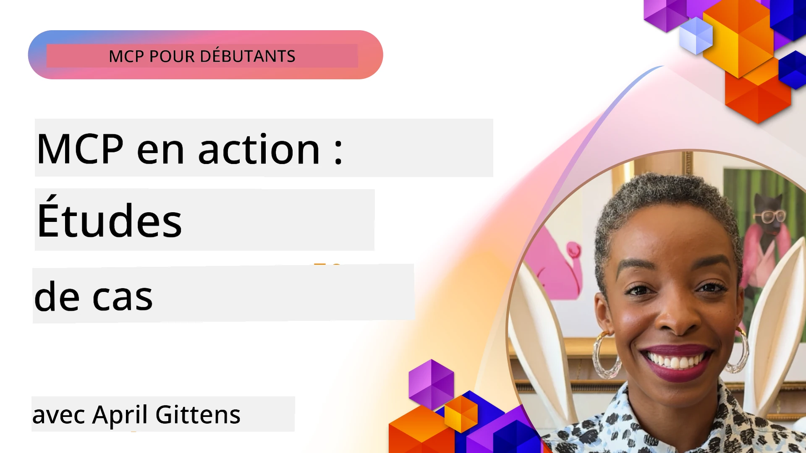

# MCP en Action : Études de Cas Réelles

_(Cliquez sur l'image ci-dessus pour voir la vidéo de cette leçon)_

Le Protocole de Contexte de Modèle (MCP) transforme la manière dont les applications d'IA interagissent avec les données, les outils et les services. Cette section présente des études de cas réelles qui démontrent les applications pratiques du MCP dans divers scénarios d'entreprise.

## Aperçu

Cette section présente des exemples concrets d'implémentations du MCP, mettant en lumière comment les organisations exploitent ce protocole pour résoudre des défis complexes en entreprise. En examinant ces études de cas, vous obtiendrez des informations sur la polyvalence, la scalabilité et les avantages pratiques du MCP dans des contextes réels.

## Objectifs Clés d'Apprentissage

En explorant ces études de cas, vous allez :

- Comprendre comment le MCP peut être appliqué pour résoudre des problèmes d'affaires spécifiques
- Apprendre différents schémas d'intégration et approches architecturales
- Reconnaître les meilleures pratiques pour la mise en œuvre du MCP en environnement d'entreprise
- Obtenir des insights sur les défis et solutions rencontrés dans les implémentations réelles
- Identifier des opportunités pour appliquer des schémas similaires dans vos propres projets

## Études de Cas Présentées

### 1. [Agents de Voyage Azure AI – Référence d’Implémentation](./travelagentsample.md)

Cette étude de cas examine la solution de référence complète de Microsoft qui démontre comment construire une application de planification de voyage multi-agents alimentée par l’IA en utilisant le MCP, Azure OpenAI et Azure AI Search. Le projet met en avant :

- L’orchestration multi-agents via MCP
- L’intégration des données d’entreprise avec Azure AI Search
- Une architecture sécurisée et évolutive utilisant les services Azure
- Des outils extensibles avec des composants MCP réutilisables
- Une expérience utilisateur conversationnelle alimentée par Azure OpenAI

L’architecture et les détails d’implémentation fournissent des enseignements précieux pour construire des systèmes complexes multi-agents avec MCP comme couche de coordination.

### 2. [Mise à Jour des Éléments Azure DevOps à partir des Données YouTube](./UpdateADOItemsFromYT.md)

Cette étude de cas illustre une application pratique du MCP pour automatiser les processus de workflow. Elle montre comment les outils MCP peuvent être utilisés pour :

- Extraire des données des plateformes en ligne (YouTube)
- Mettre à jour les éléments de travail dans les systèmes Azure DevOps
- Créer des workflows d’automatisation répétables
- Intégrer les données à travers des systèmes disparates

Cet exemple illustre comment des implémentations MCP relativement simples peuvent apporter des gains d’efficacité significatifs en automatisant les tâches routinières et en améliorant la cohérence des données entre systèmes.

### 3. [Récupération de Documentation en Temps Réel avec MCP](./docs-mcp/README.md)

Cette étude de cas vous guide dans la connexion d’un client console Python à un serveur Model Context Protocol (MCP) pour récupérer et enregistrer en temps réel la documentation Microsoft contextuelle. Vous apprendrez à :

- Vous connecter à un serveur MCP en utilisant un client Python et le SDK officiel MCP
- Utiliser des clients HTTP streaming pour une récupération efficace et en temps réel des données
- Appeler des outils de documentation sur le serveur et enregistrer les réponses directement dans la console
- Intégrer la documentation Microsoft à jour dans votre flux de travail sans quitter le terminal

Le chapitre inclut un exercice pratique, un exemple de code minimal fonctionnel, et des liens vers des ressources supplémentaires pour un apprentissage approfondi. Consultez le chapitre complet lié pour comprendre comment le MCP peut transformer l’accès à la documentation et la productivité des développeurs dans des environnements en console.

### 4. [Application Web Génératrice de Plans d’Étude Interactive avec MCP](./docs-mcp/README.md)

Cette étude de cas montre comment construire une application web interactive utilisant Chainlit et le Model Context Protocol (MCP) pour générer des plans d’étude personnalisés sur n’importe quel sujet. Les utilisateurs peuvent spécifier une matière (par exemple « certification AI-900 ») et une durée d’étude (par exemple 8 semaines), et l’application fournira une répartition semaine par semaine des contenus recommandés. Chainlit offre une interface de chat conversationnelle, rendant l’expérience interactive et adaptative.

- Application web conversationnelle alimentée par Chainlit
- Invites utilisateur pour sujet et durée
- Recommandations de contenu semaine par semaine via MCP
- Réponses adaptatives et en temps réel dans une interface de chat

Le projet illustre comment l’IA conversationnelle et MCP peuvent être combinés pour créer des outils éducatifs dynamiques et orientés utilisateur dans un environnement web moderne.

### 5. [Documentation Intégrée dans l’Éditeur avec le Serveur MCP dans VS Code](./docs-mcp/README.md)

Cette étude de cas montre comment intégrer les Microsoft Learn Docs directement dans votre environnement VS Code grâce au serveur MCP — plus besoin de changer d’onglet dans le navigateur ! Vous verrez comment :

- Rechercher et lire instantanément la documentation dans VS Code via le panneau MCP ou la palette de commandes
- Référencer la documentation et insérer des liens directement dans vos fichiers README ou markdown de cours
- Utiliser GitHub Copilot et MCP conjointement pour des workflows de documentation et de code alimentés par l’IA
- Valider et améliorer votre documentation avec des retours en temps réel et la précision de sources Microsoft
- Intégrer MCP aux workflows GitHub pour une validation continue de la documentation

L’implémentation comprend :

- Configuration exemple `.vscode/mcp.json` pour une mise en place facile
- Démonstrations en captures d’écran de l’expérience intégrée dans l’éditeur
- Conseils pour combiner Copilot et MCP pour une productivité maximale

Ce scénario est idéal pour les auteurs de cours, rédacteurs de documentation et développeurs souhaitant rester concentrés dans leur éditeur tout en travaillant avec docs, Copilot et outils de validation — tous alimentés par MCP.

### 6. [Création de Serveur MCP APIM](./apimsample.md)

Cette étude de cas fournit un guide étape par étape pour créer un serveur MCP en utilisant Azure API Management (APIM). Elle couvre :

- La configuration d’un serveur MCP dans Azure API Management
- L’exposition des opérations API en tant qu’outils MCP
- La configuration de politiques pour la limitation de débit et la sécurité
- Les tests du serveur MCP via Visual Studio Code et GitHub Copilot

Cet exemple illustre comment exploiter les capacités d’Azure pour créer un serveur MCP robuste pouvant être utilisé dans diverses applications, améliorant l’intégration des systèmes IA avec les APIs d’entreprise.

### 7. [Registre MCP GitHub — Accélération de l’Intégration Agentique](https://github.com/mcp)

Cette étude de cas examine comment le Registre MCP GitHub, lancé en septembre 2025, répond à un défi critique de l’écosystème IA : la découverte et le déploiement fragmentés des serveurs Model Context Protocol (MCP).

#### Aperçu  
Le **Registre MCP** résout la difficulté croissante des serveurs MCP dispersés à travers les dépôts et registres, ce qui rendait auparavant l’intégration lente et sujette aux erreurs. Ces serveurs permettent aux agents IA d’interagir avec des systèmes externes comme des APIs, des bases de données et des sources de documentation.

#### Problématique  
Les développeurs construisant des workflows agentiques faisaient face à plusieurs défis :  
- **Mauvaise découvrabilité** des serveurs MCP sur différentes plateformes  
- **Questions redondantes** dispersées sur les forums et documentations  
- **Risques de sécurité** liés à des sources non vérifiées et non fiables  
- **Manque de standardisation** sur la qualité et la compatibilité des serveurs

#### Architecture de la Solution  
Le registre MCP de GitHub centralise les serveurs MCP de confiance avec des fonctionnalités clés :  
- **Installation en un clic** via VS Code pour une configuration simplifiée  
- **Tri signal-sur-bruit** basé sur les étoiles, l’activité et la validation communautaire  
- **Intégration directe** avec GitHub Copilot et autres outils compatibles MCP  
- **Modèle de contribution ouvert** permettant aux communautés et partenaires d’entreprise de contribuer

#### Impact Business  
Le registre a apporté des améliorations mesurables :  
- **Intégration plus rapide** des développeurs utilisant des outils comme le serveur MCP Microsoft Learn, qui transmet la documentation officielle directement aux agents  
- **Productivité accrue** via des serveurs spécialisés comme `github-mcp-server`, permettant l’automatisation GitHub en langage naturel (création de PR, relances CI, scan de code)  
- **Confiance renforcée dans l’écosystème** grâce à des listes sélectionnées et des standards de configuration transparents

#### Valeur Stratégique  
Pour les praticiens spécialisés dans la gestion du cycle de vie des agents et les workflows reproductibles, le Registre MCP offre :  
- **Déploiement modulaire d’agents** avec des composants standardisés  
- **Pipelines d’évaluation appuyés par le registre** pour des tests et validations cohérents  
- **Interopérabilité inter-outils** permettant une intégration fluide entre différentes plateformes IA

Cette étude de cas démontre que le Registre MCP est plus qu’un simple annuaire — c’est une plateforme fondatrice pour l’intégration évolutive de modèles et le déploiement de systèmes agentiques réels.

## Conclusion

Ces sept études de cas complètes illustrent la remarquable polyvalence et les applications pratiques du Protocole de Contexte de Modèle à travers divers scénarios réels. Des systèmes complexes de planification de voyages multi-agents et la gestion des APIs d’entreprise aux workflows de documentation rationalisés et au révolutionnaire Registre MCP GitHub, ces exemples montrent comment MCP fournit un moyen standardisé et évolutif pour connecter les systèmes IA aux outils, données et services dont ils ont besoin pour offrir une valeur exceptionnelle.

Les études de cas couvrent plusieurs dimensions de l’implémentation MCP :  
- **Intégration d’Entreprise** : Gestion Azure API et automatisation Azure DevOps  
- **Orchestration Multi-Agents** : Planification de voyages avec agents IA coordonnés  
- **Productivité des Développeurs** : Intégration VS Code et accès temps réel à la documentation  
- **Développement d’Écosystème** : Registre MCP GitHub comme plateforme fondatrice  
- **Applications Éducatives** : Générateurs interactifs de plans d’étude et interfaces conversationnelles

En étudiant ces implémentations, vous obtenez des insights clés sur :  
- **Schémas architecturaux** adaptés à différentes échelles et cas d’usage  
- **Stratégies d’implémentation** équilibrant fonctionnalité et maintenabilité  
- **Considérations de sécurité et scalabilité** pour des déploiements en production  
- **Meilleures pratiques** pour le développement de serveurs MCP et l’intégration client  
- **Pensée écosystémique** pour construire des solutions IA interconnectées

Ces exemples démontrent collectivement que le MCP n’est pas qu’un cadre théorique mais un protocole mature et prêt pour la production, permettant des solutions pratiques à des défis d’affaires complexes. Que vous construisiez des outils simples d’automatisation ou des systèmes multi-agents sophistiqués, les schémas et approches illustrés ici fournissent une base solide pour vos propres projets MCP.

## Ressources Supplémentaires

- [Azure AI Travel Agents GitHub Repository](https://github.com/Azure-Samples/azure-ai-travel-agents)
- [Azure DevOps MCP Tool](https://github.com/microsoft/azure-devops-mcp)
- [Playwright MCP Tool](https://github.com/microsoft/playwright-mcp)
- [Microsoft Docs MCP Server](https://github.com/MicrosoftDocs/mcp)
- [GitHub MCP Registry — Accelerating Agentic Integration](https://github.com/mcp)
- [MCP Community Examples](https://github.com/microsoft/mcp)

## Ce Qui Suit

- Précédent : [Module 8 : Meilleures Pratiques](../08-BestPractices/README.md)
- Suivant : [Module 10 : Rationalisation des Workflows IA : Construction d’un Serveur MCP avec AI Toolkit](../10-StreamliningAIWorkflowsBuildingAnMCPServerWithAIToolkit/README.md)

---

<!-- CO-OP TRANSLATOR DISCLAIMER START -->
**Avertissement** :  
Ce document a été traduit à l'aide du service de traduction automatique [Co-op Translator](https://github.com/Azure/co-op-translator). Bien que nous nous efforçons d'assurer l'exactitude, veuillez noter que les traductions automatiques peuvent contenir des erreurs ou des inexactitudes. Le document original dans sa langue d'origine doit être considéré comme la source faisant autorité. Pour les informations critiques, une traduction professionnelle humaine est recommandée. Nous déclinons toute responsabilité en cas de malentendus ou d'interprétations erronées résultant de l'utilisation de cette traduction.
<!-- CO-OP TRANSLATOR DISCLAIMER END -->