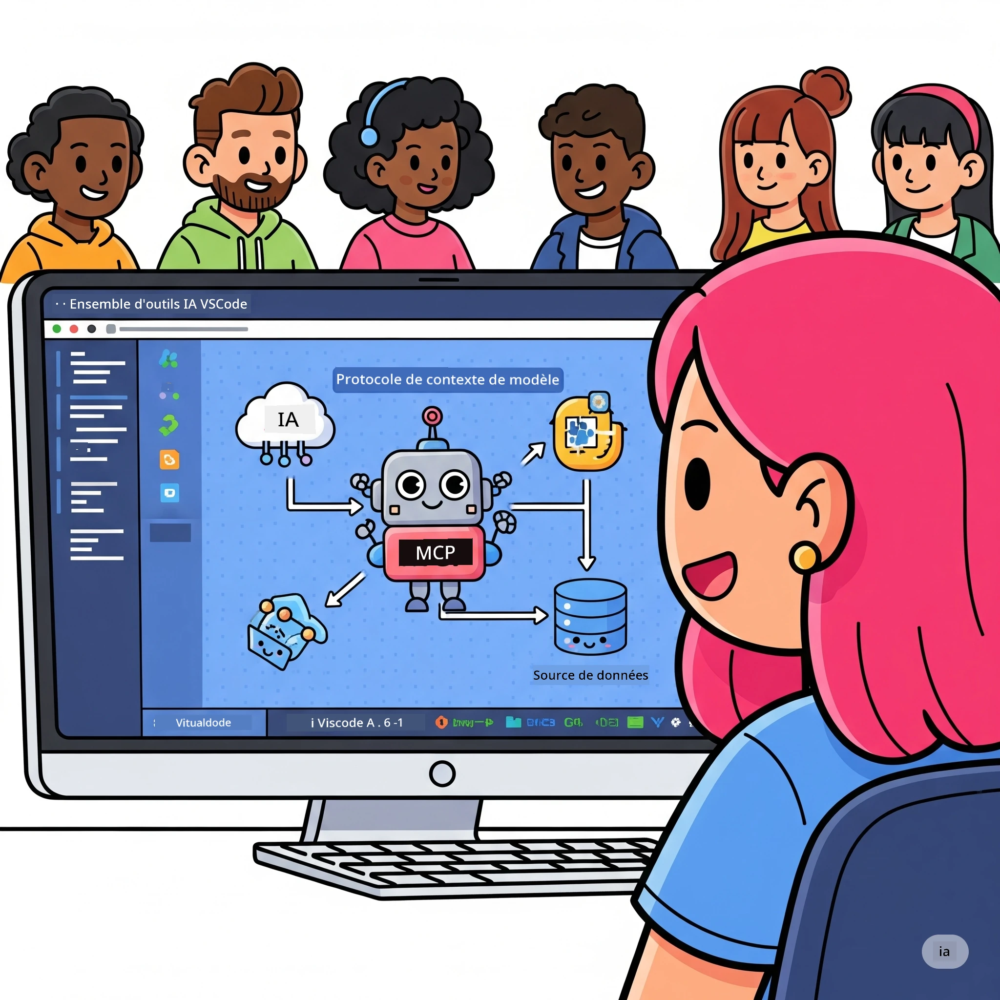
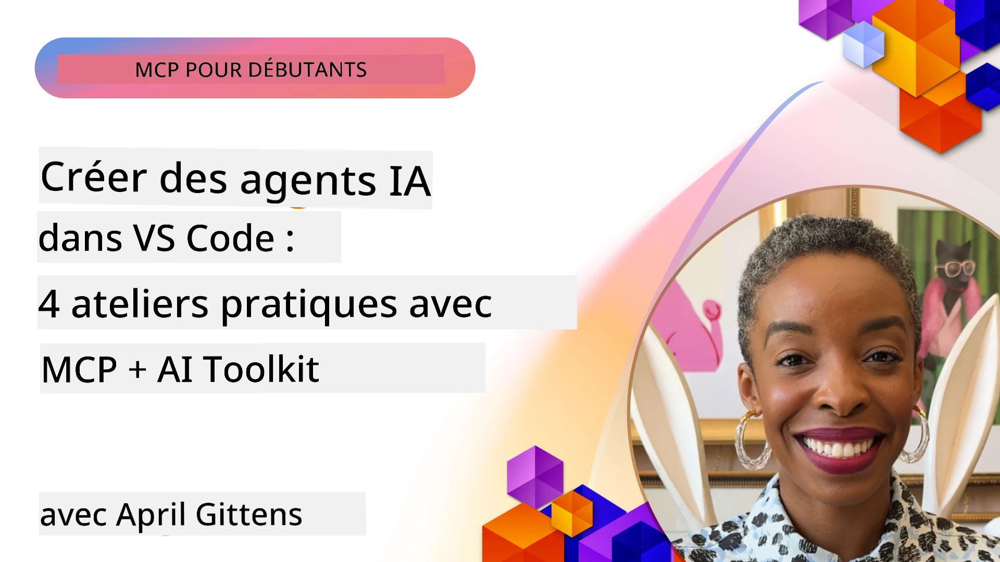

# Rationalisation des flux de travail IA : Construire un serveur MCP avec AI Toolkit

## 🎯 Aperçu

_(Cliquez sur l’image ci-dessus pour voir la vidéo de cette leçon)_

Bienvenue à l’**Atelier Model Context Protocol (MCP)** ! Cet atelier pratique complet combine deux technologies de pointe pour révolutionner le développement d’applications IA :

- **🔗 Model Context Protocol (MCP)** : une norme ouverte pour une intégration fluide des outils IA
- **🛠️ AI Toolkit pour Visual Studio Code (AITK)** : l’extension puissante de Microsoft pour le développement IA

### 🎓 Ce que vous apprendrez

À la fin de cet atelier, vous maîtriserez l’art de construire des applications intelligentes qui connectent les modèles IA aux outils et services réels. Du test automatisé aux intégrations API personnalisées, vous acquerrez des compétences pratiques pour résoudre des défis métiers complexes.

## 🏗️ Stack technologique

### 🔌 Model Context Protocol (MCP)

MCP est le **« USB-C pour l’IA »** — une norme universelle qui connecte les modèles IA aux outils et sources de données externes.

**✨ Fonctionnalités clés :**

- 🔄 **Intégration standardisée** : interface universelle pour les connexions outils IA
- 🏛️ **Architecture flexible** : serveurs locaux et distants via le transport stdio/SSE
- 🧰 **Écosystème riche** : outils, prompts et ressources réunis dans un même protocole
- 🔒 **Prêt pour l’entreprise** : sécurité et fiabilité intégrées

**🎯 Pourquoi MCP est important :**  
Tout comme l’USB-C a éliminé le chaos des câbles, MCP élimine la complexité des intégrations IA. Un protocole, des possibilités infinies.

### 🤖 AI Toolkit pour Visual Studio Code (AITK)

L’extension phare de Microsoft pour le développement IA qui transforme VS Code en une puissance IA.

**🚀 Capacités principales :**

- 📦 **Catalogue de modèles** : accès à des modèles Azure AI, GitHub, Hugging Face, Ollama
- ⚡ **Inférence locale** : exécution optimisée ONNX CPU/GPU/NPU
- 🏗️ **Agent Builder** : développement visuel d’agents IA avec intégration MCP
- 🎭 **Multi-modal** : support texte, vision et sorties structurées

**💡 Bénéfices pour le développement :**

- Déploiement de modèles sans configuration
- Conception visuelle de prompts
- Aire de test en temps réel
- Intégration fluide du serveur MCP

## 📚 Parcours d’apprentissage

### [🚀 Module 1 : Fondamentaux AI Toolkit](./lab1/README.md)

**Durée** : 15 minutes

- 🛠️ Installer et configurer AI Toolkit pour VS Code
- 🗂️ Explorer le catalogue de modèles (100+ modèles depuis GitHub, ONNX, OpenAI, Anthropic, Google)
- 🎮 Maîtriser le Interactive Playground pour tester les modèles en temps réel
- 🤖 Construire votre premier agent IA avec Agent Builder
- 📊 Évaluer la performance des modèles avec les métriques intégrées (F1, pertinence, similarité, cohérence)
- ⚡ Apprendre le traitement par lots et le support multimodal

**🎯 Résultat d’apprentissage** : Créer un agent IA fonctionnel avec une compréhension complète des capacités AITK

### [🌐 Module 2 : MCP avec AI Toolkit Fondamentaux](./lab2/README.md)

**Durée** : 20 minutes

- 🧠 Maîtriser l’architecture et les concepts du Model Context Protocol (MCP)
- 🌐 Explorer l’écosystème de serveurs MCP de Microsoft
- 🤖 Construire un agent d’automatisation de navigateur avec le serveur MCP Playwright
- 🔧 Intégrer les serveurs MCP avec AI Toolkit Agent Builder
- 📊 Configurer et tester les outils MCP dans vos agents
- 🚀 Exporter et déployer des agents propulsés par MCP pour la production

**🎯 Résultat d’apprentissage** : Déployer un agent IA surpuissant avec des outils externes via MCP

### [🔧 Module 3 : Développement avancé MCP avec AI Toolkit](./lab3/README.md)

**Durée** : 20 minutes

- 💻 Créer des serveurs MCP personnalisés avec AI Toolkit
- 🐍 Configurer et utiliser le SDK MCP Python le plus récent (v1.9.3)
- 🔍 Mettre en place et utiliser MCP Inspector pour le débogage
- 🛠️ Construire un serveur MCP météo avec des workflows de débogage professionnels
- 🧪 Déboguer les serveurs MCP dans les environnements Agent Builder et Inspector

**🎯 Résultat d’apprentissage** : Développer et déboguer des serveurs MCP personnalisés avec des outils modernes

### [🐙 Module 4 : Développement pratique MCP - Serveur GitHub Clone personnalisé](./lab4/README.md)

**Durée** : 30 minutes

- 🏗️ Construire un serveur GitHub Clone MCP pour les workflows de développement réels
- 🔄 Implémenter un clonage intelligent de dépôt avec validation et gestion des erreurs
- 📁 Créer une gestion intelligente des répertoires et une intégration VS Code
- 🤖 Utiliser le mode agent GitHub Copilot avec des outils MCP personnalisés
- 🛡️ Appliquer la fiabilité prête pour la production et la compatibilité multiplateforme

**🎯 Résultat d’apprentissage** : Déployer un serveur MCP prêt pour la production qui simplifie les workflows de développement réels

## 💡 Applications réelles et impact

### 🏢 Cas d’utilisation en entreprise

#### 🔄 Automatisation DevOps

Transformez votre workflow de développement avec l’automatisation intelligente :

- **Gestion intelligente des dépôts** : revue de code IA et décisions de fusion
- **CI/CD intelligent** : optimisation automatisée des pipelines selon les changements de code
- **Triage des incidents** : classification et assignation automatique des bugs

#### 🧪 Révolution de l’assurance qualité

Améliorez les tests avec l’automatisation pilotée par IA :

- **Génération intelligente de tests** : création automatique de suites de tests complètes
- **Tests visuels de régression** : détection IA des changements UI
- **Surveillance des performances** : identification proactive et résolution des problèmes

#### 📊 Intelligence des pipelines de données

Construisez des workflows de traitement de données plus intelligents :

- **Processus ETL adaptatifs** : transformations de données auto-optimisées
- **Détection d’anomalies** : surveillance en temps réel de la qualité des données
- **Routage intelligent** : gestion intelligente du flux des données

#### 🎧 Amélioration de l’expérience client

Créez des interactions clients exceptionnelles :

- **Support contextuel** : agents IA avec accès à l’historique client
- **Résolution proactive des problèmes** : service client prédictif
- **Intégration multi-canal** : expérience IA unifiée sur toutes les plateformes

## 🛠️ Prérequis et configuration

### 💻 Configuration système

| Composant            | Exigence                | Notes                      |
|----------------------|-------------------------|----------------------------|
| **Système d’exploitation** | Windows 10+, macOS 10.15+, Linux | Tout OS moderne              |
| **Visual Studio Code**     | Dernière version stable  | Requis pour AITK             |
| **Node.js**                | v18.0+ et npm            | Pour le développement serveur MCP |
| **Python**                 | 3.10+                    | Optionnel pour serveurs MCP Python |
| **Mémoire**                | Minimum 8 Go RAM         | 16 Go recommandés pour modèles locaux |

### 🔧 Environnement de développement

#### Extensions VS Code recommandées

- **AI Toolkit** (ms-windows-ai-studio.windows-ai-studio)
- **Python** (ms-python.python)
- **Débogueur Python** (ms-python.debugpy)
- **GitHub Copilot** (GitHub.copilot) - Optionnel mais utile

#### Outils optionnels

- **uv** : gestionnaire de paquets Python moderne
- **MCP Inspector** : outil visuel de débogage des serveurs MCP
- **Playwright** : pour exemples d’automatisation web

## 🎖️ Résultats d’apprentissage et parcours de certification

### 🏆 Liste de maîtrise des compétences

En complétant cet atelier, vous atteindrez la maîtrise de :

#### 🎯 Compétences principales

- [ ] **Maîtrise du protocole MCP** : compréhension approfondie de l’architecture et des patterns d’implémentation
- [ ] **Compétence AITK** : utilisation experte d’AI Toolkit pour un développement rapide
- [ ] **Développement de serveurs personnalisés** : construction, déploiement et maintenance de serveurs MCP en production
- [ ] **Excellence en intégration d’outils** : connexion fluide de l’IA aux workflows de développement existants
- [ ] **Application à la résolution de problèmes** : appliquer les compétences acquises à des défis métier réels

#### 🔧 Compétences techniques

- [ ] Installer et configurer AI Toolkit dans VS Code
- [ ] Concevoir et implémenter des serveurs MCP personnalisés
- [ ] Intégrer les modèles GitHub avec l’architecture MCP
- [ ] Construire des workflows de tests automatisés avec Playwright
- [ ] Déployer des agents IA en environnement de production
- [ ] Déboguer et optimiser la performance des serveurs MCP

#### 🚀 Capacités avancées

- [ ] Architecturer des intégrations IA à l’échelle entreprise
- [ ] Mettre en œuvre les meilleures pratiques de sécurité pour les applications IA
- [ ] Concevoir des architectures serveur MCP évolutives
- [ ] Créer des chaînes d’outils personnalisées pour des domaines spécifiques
- [ ] Former d'autres développeurs en développement natif IA

## 📖 Ressources complémentaires

- [Spécification MCP (2025-11-25)](https://spec.modelcontextprotocol.io/specification/2025-11-25/)
- [Dépôt GitHub AI Toolkit](https://github.com/microsoft/vscode-ai-toolkit)
- [Collection de serveurs MCP exemples](https://github.com/modelcontextprotocol/servers)
- [Guide des bonnes pratiques](https://modelcontextprotocol.io/docs/best-practices)
- [OWASP MCP Top 10](https://microsoft.github.io/mcp-azure-security-guide/mcp/) - Bonnes pratiques de sécurité

---

**🚀 Prêt à révolutionner votre workflow de développement IA ?**

Construisons ensemble le futur des applications intelligentes avec MCP et AI Toolkit !

## Quelle est la suite

Continuez vers : [Module 11 : Laboratoires pratiques serveur MCP](../11-MCPServerHandsOnLabs/README.md)

---

<!-- CO-OP TRANSLATOR DISCLAIMER START -->
**Avertissement** :  
Ce document a été traduit à l’aide du service de traduction automatique [Co-op Translator](https://github.com/Azure/co-op-translator). Bien que nous nous efforcions d’assurer l’exactitude, veuillez noter que les traductions automatiques peuvent contenir des erreurs ou des imprécisions. Le document original dans sa langue d’origine doit être considéré comme la source de référence. Pour des informations critiques, il est recommandé de recourir à une traduction professionnelle effectuée par un humain. Nous ne sommes pas responsables des malentendus ou des mauvaises interprétations résultant de l’utilisation de cette traduction.
<!-- CO-OP TRANSLATOR DISCLAIMER END -->