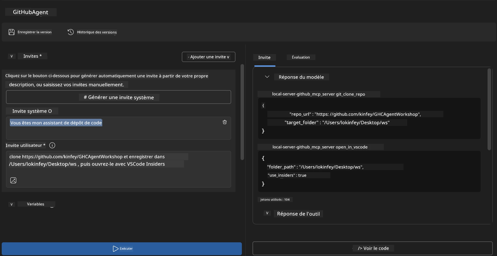
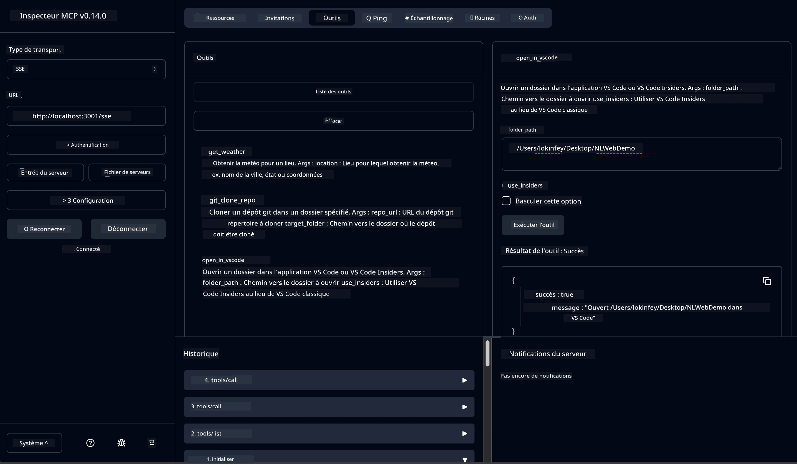

# 🐙 Module 4 : Développement MCP Pratique - Serveur personnalisé de clonage GitHub


> **⚡ Démarrage rapide :** Construisez un serveur MCP prêt pour la production qui automatise le clonage de dépôts GitHub et l’intégration VS Code en seulement 30 minutes !

## 🎯 Objectifs d'apprentissage

À la fin de ce laboratoire, vous serez capable de :

- ✅ Créer un serveur MCP personnalisé pour des workflows de développement réels
- ✅ Implémenter la fonctionnalité de clonage de dépôts GitHub via MCP
- ✅ Intégrer des serveurs MCP personnalisés avec VS Code et Agent Builder
- ✅ Utiliser le mode Agent de GitHub Copilot avec des outils MCP personnalisés
- ✅ Tester et déployer des serveurs MCP personnalisés en environnements de production

## 📋 Prérequis

- Avoir terminé les laboratoires 1 à 3 (fondamentaux MCP et développement avancé)
- Abonnement GitHub Copilot ([inscription gratuite disponible](https://github.com/github-copilot/signup))
- VS Code avec les extensions AI Toolkit et GitHub Copilot installées
- CLI Git installée et configurée

## 🏗️ Présentation du projet

### **Défi de développement réel**  
En tant que développeurs, nous utilisons fréquemment GitHub pour cloner des dépôts et les ouvrir dans VS Code ou VS Code Insiders. Ce processus manuel consiste à :  
1. Ouvrir un terminal ou un invite de commandes  
2. Se déplacer vers le répertoire désiré  
3. Exécuter la commande `git clone`  
4. Ouvrir VS Code dans le répertoire cloné  

**Notre solution MCP simplifie tout cela en une seule commande intelligente !**

### **Ce que vous allez construire**  
Un **serveur MCP GitHub Clone** (`git_mcp_server`) qui offre :

| Fonctionnalité | Description | Avantage |
|----------------|-------------|----------|
| 🔄 **Clonage intelligent de dépôts** | Cloner des dépôts GitHub avec validation | Vérification automatique des erreurs |
| 📁 **Gestion intelligente des répertoires** | Vérifier et créer des répertoires en toute sécurité | Évite les écrasements |
| 🚀 **Intégration multiplateforme VS Code** | Ouvrir des projets dans VS Code/Insiders | Transition fluide du workflow |
| 🛡️ **Gestion robuste des erreurs** | Gérer les problèmes réseau, permissions et chemins | Fiabilité prête pour la production |

---

## 📖 Mise en œuvre étape par étape

### Étape 1 : Créer un agent GitHub dans Agent Builder

1. **Lancez Agent Builder** via l’extension AI Toolkit  
2. **Créez un nouvel agent** avec la configuration suivante :  
   ```
   Agent Name: GitHubAgent
   ```
  
3. **Initialisez le serveur MCP personnalisé :**  
   - Allez dans **Outils** → **Ajouter un outil** → **Serveur MCP**  
   - Sélectionnez **« Créer un nouveau serveur MCP »**  
   - Choisissez **modèle Python** pour une flexibilité maximale  
   - **Nom du serveur :** `git_mcp_server`

### Étape 2 : Configurer le Mode Agent GitHub Copilot

1. **Ouvrez GitHub Copilot** dans VS Code (Ctrl/Cmd + Maj + P → « GitHub Copilot : Ouvrir »)  
2. **Sélectionnez le modèle Agent** dans l’interface Copilot  
3. **Choisissez le modèle Claude 3.7** pour des capacités de raisonnement améliorées  
4. **Activez l’intégration MCP** pour l’accès aux outils

> **💡 Astuce pro :** Claude 3.7 offre une meilleure compréhension des workflows de développement et des schémas de gestion des erreurs.

### Étape 3 : Implémenter la fonctionnalité principale du serveur MCP

**Utilisez la commande détaillée suivante avec le mode Agent GitHub Copilot :**  

```
Create two MCP tools with the following comprehensive requirements:

🔧 TOOL A: clone_repository
Requirements:
- Clone any GitHub repository to a specified local folder
- Return the absolute path of the successfully cloned project
- Implement comprehensive validation:
  ✓ Check if target directory already exists (return error if exists)
  ✓ Validate GitHub URL format (https://github.com/user/repo)
  ✓ Verify git command availability (prompt installation if missing)
  ✓ Handle network connectivity issues
  ✓ Provide clear error messages for all failure scenarios

🚀 TOOL B: open_in_vscode
Requirements:
- Open specified folder in VS Code or VS Code Insiders
- Cross-platform compatibility (Windows/Linux/macOS)
- Use direct application launch (not terminal commands)
- Auto-detect available VS Code installations
- Handle cases where VS Code is not installed
- Provide user-friendly error messages

Additional Requirements:
- Follow MCP 1.9.3 best practices
- Include proper type hints and documentation
- Implement logging for debugging purposes
- Add input validation for all parameters
- Include comprehensive error handling
```
  
### Étape 4 : Testez votre serveur MCP

#### 4a. Test dans Agent Builder

1. **Lancez la configuration de débogage** dans Agent Builder  
2. **Configurez votre agent avec cette invite système :**

```
SYSTEM_PROMPT:
You are my intelligent coding repository assistant. You help developers efficiently clone GitHub repositories and set up their development environment. Always provide clear feedback about operations and handle errors gracefully.
```
  
3. **Testez avec des scénarios utilisateurs réalistes :**

```
USER_PROMPT EXAMPLES:

Scenario : Basic Clone and Open
"Clone {Your GitHub Repo link such as https://github.com/kinfey/GHCAgentWorkshop
 } and save to {The global path you specify}, then open it with VS Code Insiders"
```
  


**Résultats attendus :**  
- ✅ Clonage réussi avec confirmation du chemin  
- ✅ Lancement automatique de VS Code  
- ✅ Messages d’erreur clairs pour les scénarios invalides  
- ✅ Gestion correcte des cas limites

#### 4b. Test dans MCP Inspector



---


**🎉 Félicitations !** Vous avez créé avec succès un serveur MCP pratique prêt pour la production qui règle des problèmes réels de workflow de développement. Votre serveur personnalisé de clonage GitHub démontre la puissance du MCP pour automatiser et améliorer la productivité des développeurs.

### 🏆 Succès débloqué :  
- ✅ **Développeur MCP** - Serveur MCP personnalisé créé  
- ✅ **Automatiseur de workflows** - Processus de développement simplifiés  
- ✅ **Expert en intégration** - Connexion de multiples outils de développement  
- ✅ **Prêt pour la production** - Solutions déployables construites

---

## 🎓 Fin de l’atelier : Votre parcours avec le Model Context Protocol

**Cher participant à l’atelier,**

Félicitations pour avoir terminé les quatre modules de l’atelier Model Context Protocol ! Vous avez parcouru un long chemin, depuis la compréhension des concepts fondamentaux de AI Toolkit jusqu’à la création de serveurs MCP prêts pour la production qui résolvent des défis réels de développement.

### 🚀 Récapitulatif de votre parcours d’apprentissage :

**[Module 1](../lab1/README.md)** : Vous avez commencé par explorer les fondamentaux d’AI Toolkit, le test de modèles et la création de votre premier agent IA.

**[Module 2](../lab2/README.md)** : Vous avez appris l’architecture MCP, intégré Playwright MCP et construit votre premier agent d’automatisation de navigateur.

**[Module 3](../lab3/README.md)** : Vous êtes passé au développement de serveurs MCP personnalisés avec le serveur MCP Météo et maîtrisé les outils de débogage.

**[Module 4](../lab4/README.md)** : Vous avez désormais appliqué tout cela pour créer un outil pratique d’automatisation des workflows de dépôts GitHub.

### 🌟 Ce que vous avez maîtrisé :

- ✅ **Écosystème AI Toolkit** : Modèles, agents, et schémas d’intégration  
- ✅ **Architecture MCP** : Conception client-serveur, protocoles de transport et sécurité  
- ✅ **Outils développeurs** : De Playground à Inspector jusqu’au déploiement en production  
- ✅ **Développement personnalisé** : Construction, test et déploiement de vos propres serveurs MCP  
- ✅ **Applications pratiques** : Résoudre des défis réels de workflows avec l’IA

### 🔮 Vos prochaines étapes :

1. **Construisez votre propre serveur MCP** : Appliquez ces compétences pour automatiser vos workflows uniques  
2. **Rejoignez la communauté MCP** : Partagez vos créations et apprenez des autres  
3. **Explorez l’intégration avancée** : Connectez les serveurs MCP aux systèmes d’entreprise  
4. **Contribuez à l’open source** : Aidez à améliorer les outils et la documentation MCP  

Rappelez-vous, cet atelier n’est que le début. L’écosystème Model Context Protocol évolue rapidement et vous êtes désormais prêt à être à l’avant-garde des outils de développement assistés par IA.

**Merci pour votre participation et votre engagement dans l’apprentissage !**

Nous espérons que cet atelier a suscité des idées qui transformeront votre manière de construire et d’interagir avec les outils IA dans votre parcours de développement.

**Bon codage !**

---

## Et ensuite

Félicitations pour avoir terminé tous les laboratoires du Module 10 !

- Retour à : [Vue d’ensemble du Module 10](../README.md)  
- Continuer vers : [Module 11 : Laboratoires pratiques serveur MCP](../../11-MCPServerHandsOnLabs/README.md)

---

<!-- CO-OP TRANSLATOR DISCLAIMER START -->
**Clause de non-responsabilité** :  
Ce document a été traduit à l’aide du service de traduction automatisée [Co-op Translator](https://github.com/Azure/co-op-translator). Bien que nous nous efforcions d’assurer l’exactitude, veuillez noter que les traductions automatiques peuvent comporter des erreurs ou des inexactitudes. Le document original dans sa langue d’origine doit être considéré comme la source faisant foi. Pour les informations critiques, il est recommandé de recourir à une traduction professionnelle humaine. Nous déclinons toute responsabilité en cas de malentendus ou d’interprétations erronées résultant de l’utilisation de cette traduction.
<!-- CO-OP TRANSLATOR DISCLAIMER END -->