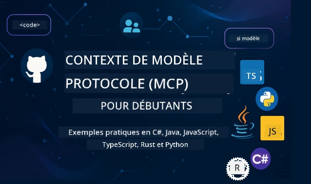

 

[](https://GitHub.com/microsoft/mcp-for-beginners/graphs/contributors)
[](https://GitHub.com/microsoft/mcp-for-beginners/issues)
[](https://GitHub.com/microsoft/mcp-for-beginners/pulls)
[](http://makeapullrequest.com)

[](https://GitHub.com/microsoft/mcp-for-beginners/watchers)
[](https://GitHub.com/microsoft/mcp-for-beginners/fork)
[](https://GitHub.com/microsoft/mcp-for-beginners/stargazers)


[](https://discord.gg/nTYy5BXMWG)

Suivez ces étapes pour commencer à utiliser ces ressources :
1. **Forkez le dépôt** : Cliquez sur [](https://GitHub.com/microsoft/mcp-for-beginners/fork)
2. **Clonez le dépôt** :   `git clone https://github.com/microsoft/mcp-for-beginners.git`
3. **Rejoignez le** [](https://discord.gg/nTYy5BXMWG)


### 🌐 Support Multilingue

#### Pris en charge via GitHub Action (Automatisé & Toujours à jour)

<!-- CO-OP TRANSLATOR LANGUAGES TABLE START -->
[Arabe](../ar/README.md) | [Bengali](../bn/README.md) | [Bulgare](../bg/README.md) | [Birman (Myanmar)](../my/README.md) | [Chinois (Simplifié)](../zh-CN/README.md) | [Chinois (Traditionnel, Hong Kong)](../zh-HK/README.md) | [Chinois (Traditionnel, Macao)](../zh-MO/README.md) | [Chinois (Traditionnel, Taïwan)](../zh-TW/README.md) | [Croate](../hr/README.md) | [Tchèque](../cs/README.md) | [Danois](../da/README.md) | [Néerlandais](../nl/README.md) | [Estonien](../et/README.md) | [Finnois](../fi/README.md) | [Français](./README.md) | [Allemand](../de/README.md) | [Grec](../el/README.md) | [Hébreu](../he/README.md) | [Hindi](../hi/README.md) | [Hongrois](../hu/README.md) | [Indonésien](../id/README.md) | [Italien](../it/README.md) | [Japonais](../ja/README.md) | [Kannada](../kn/README.md) | [Coréen](../ko/README.md) | [Lituanien](../lt/README.md) | [Malais](../ms/README.md) | [Malayalam](../ml/README.md) | [Marathi](../mr/README.md) | [Népalais](../ne/README.md) | [Pidgin nigérian](../pcm/README.md) | [Norvégien](../no/README.md) | [Persan (Farsi)](../fa/README.md) | [Polonais](../pl/README.md) | [Portugais (Brésil)](../pt-BR/README.md) | [Portugais (Portugal)](../pt-PT/README.md) | [Panjabi (Gurmukhi)](../pa/README.md) | [Roumain](../ro/README.md) | [Russe](../ru/README.md) | [Serbe (Cyrillique)](../sr/README.md) | [Slovaque](../sk/README.md) | [Slovène](../sl/README.md) | [Espagnol](../es/README.md) | [Swahili](../sw/README.md) | [Suédois](../sv/README.md) | [Tagalog (Filipino)](../tl/README.md) | [Tamoul](../ta/README.md) | [Télougou](../te/README.md) | [Thaï](../th/README.md) | [Turc](../tr/README.md) | [Ukrainien](../uk/README.md) | [Ourdou](../ur/README.md) | [Vietnamien](../vi/README.md)

> **Préférez cloner localement ?**
>
> Ce dépôt inclut plus de 50 traductions linguistiques ce qui augmente significativement la taille de téléchargement. Pour cloner sans les traductions, utilisez le sparse checkout :
>
> **Bash / macOS / Linux :**
> ```bash
> git clone --filter=blob:none --sparse https://github.com/microsoft/mcp-for-beginners.git
> cd mcp-for-beginners
> git sparse-checkout set --no-cone '/*' '!translations' '!translated_images'
> ```
>
> **CMD (Windows) :**
> ```cmd
> git clone --filter=blob:none --sparse https://github.com/microsoft/mcp-for-beginners.git
> cd mcp-for-beginners
> git sparse-checkout set --no-cone "/*" "!translations" "!translated_images"
> ```
>
> Cela vous donne tout ce dont vous avez besoin pour compléter le cours avec un téléchargement beaucoup plus rapide.
<!-- CO-OP TRANSLATOR LANGUAGES TABLE END -->

# 🚀 Programme du Model Context Protocol (MCP) pour débutants

## **Apprenez MCP avec des exemples de code pratiques en C#, Java, JavaScript, Rust, Python et TypeScript**

## 🧠 Aperçu du programme du Model Context Protocol
Bienvenue dans votre voyage à la découverte du Model Context Protocol ! Si vous vous êtes déjà demandé comment les applications d'IA communiquent avec différents outils et services, vous êtes sur le point de découvrir la solution élégante qui transforme la manière dont les développeurs créent des systèmes intelligents.

Pensez à MCP comme un traducteur universel pour les applications d'IA – tout comme les ports USB vous permettent de connecter n'importe quel appareil à votre ordinateur, MCP permet aux modèles d'IA de se connecter à n'importe quel outil ou service de manière normalisée. Que vous construisiez votre premier chatbot ou travailliez sur des workflows d'IA complexes, comprendre MCP vous donnera le pouvoir de créer des applications plus performantes et flexibles.

Ce programme est conçu avec patience et soin pour votre parcours d'apprentissage. Nous commencerons par des concepts simples que vous connaissez déjà et développerons progressivement votre expertise via la pratique dans votre langage de programmation préféré. Chaque étape comprend des explications claires, des exemples pratiques et beaucoup d'encouragements tout au long du chemin.

À la fin de ce parcours, vous aurez la confiance pour construire vos propres serveurs MCP, les intégrer aux plateformes d'IA populaires et comprendre comment cette technologie transforme l'avenir du développement IA. Commençons cette aventure passionnante ensemble !

### Documentation officielle et spécifications

Ce programme est aligné avec **la spécification MCP 2025-11-25** (la dernière version stable). La spécification MCP utilise une version basée sur la date (format AAAA-MM-JJ) pour assurer un suivi clair des versions du protocole.

Ces ressources deviennent plus précieuses à mesure que votre compréhension s'approfondit, mais ne vous sentez pas obligé de tout lire immédiatement. Commencez par les domaines qui vous intéressent le plus !
- 📘 [Documentation MCP](https://modelcontextprotocol.io/) – C’est votre ressource incontournable pour des tutoriels pas-à-pas et des guides utilisateurs. La documentation est écrite pour les débutants, avec des exemples clairs que vous pouvez suivre à votre rythme.
- 📜 [Spécification MCP](https://modelcontextprotocol.io/specification/2025-11-25) – Considérez cela comme votre manuel de référence complet. En travaillant le programme, vous reviendrez fréquemment ici pour chercher des détails spécifiques et explorer des fonctionnalités avancées.
- 📜 [Versionnage de la spécification MCP](https://modelcontextprotocol.io/specification/versioning) – Contient des informations sur l’historique des versions du protocole et comment MCP utilise le versionnage basé sur la date (format AAAA-MM-JJ).
- 🧑‍💻 [Dépôt GitHub MCP](https://github.com/modelcontextprotocol) – Vous y trouverez des SDKs, outils et exemples de code dans plusieurs langages de programmation. C’est une véritable mine d’exemples pratiques et de composants prêts à l’usage.
- 🌐 [Communauté MCP](https://github.com/orgs/modelcontextprotocol/discussions) – Rejoignez d’autres apprenants et développeurs expérimentés pour discuter de MCP. C’est une communauté bienveillante où les questions sont les bienvenues et le savoir partagé librement.

## Objectifs d’apprentissage

À la fin de ce programme, vous serez confiant et enthousiaste face à vos nouvelles compétences. Voici ce que vous accomplirez :

• **Comprendre les fondamentaux de MCP** : Vous saisirez ce qu’est le Model Context Protocol et pourquoi il révolutionne la façon dont les applications d’IA collaborent, grâce à des analogies et exemples parlants.

• **Construire votre premier serveur MCP** : Vous créerez un serveur MCP fonctionnel dans votre langage préféré, en commençant par des exemples simples et en développant vos compétences étape par étape.

• **Connecter des modèles d’IA à de vrais outils** : Vous apprendrez comment faire le lien entre modèles d’IA et services réels, offrant à vos applications des capacités puissantes et nouvelles.

• **Mettre en œuvre les bonnes pratiques de sécurité** : Vous comprendrez comment sécuriser vos implémentations MCP, protégeant applications et utilisateurs.

• **Déployer avec confiance** : Vous connaîtrez les stratégies pratiques pour passer vos projets MCP du développement à la production, efficaces en conditions réelles.

• **Rejoindre la communauté MCP** : Vous ferez partie d’une communauté grandissante de développeurs qui façonnent l’avenir du développement d’applications IA.

## Connaissances préalables essentielles

Avant d’entrer dans les détails du MCP, assurons-nous que vous êtes à l’aise avec quelques concepts clés. Pas d’inquiétude si vous n’êtes pas expert — nous expliquerons tout au fur et à mesure !

### Comprendre les protocoles (La base)

Pensez à un protocole comme aux règles d’une conversation. Quand vous appelez un ami, vous savez tous les deux dire « bonjour » à la réponse, prendre la parole à tour de rôle et dire « au revoir » à la fin. Les programmes informatiques ont besoin de règles similaires pour bien communiquer.

MCP est un protocole — un ensemble de règles convenues qui aide les modèles d’IA et applications à avoir des « conversations » productives avec des outils et services. Comme les règles rendent la communication humaine plus fluide, MCP rend la communication entre applications d’IA plus fiable et puissante.

### Relations client-serveur (Comment les programmes coopèrent)

Vous utilisez les relations client-serveur tous les jours ! Quand vous utilisez un navigateur (le client) pour visiter un site, vous vous connectez à un serveur web qui vous envoie le contenu de la page. Le navigateur sait demander des infos, le serveur répond.

Dans MCP, la relation est similaire : les modèles d’IA jouent le rôle de clients qui demandent des informations ou actions, tandis que les serveurs MCP fournissent ces capacités. C’est comme avoir un assistant utile (le serveur) que l’IA peut solliciter pour faire des tâches spécifiques.

### Pourquoi la normalisation est importante (Faire fonctionner ensemble)

Imaginez si chaque constructeur automobile utilisait des formes différentes pour les pompes à essence — il vous faudrait un adaptateur différent pour chaque voiture ! La normalisation signifie s’accorder sur des méthodes communes pour que les choses fonctionnent ensemble sans problème.

MCP apporte cette normalisation aux applications d’IA. Au lieu que chaque modèle ait besoin d’un code personnalisé pour chaque outil, MCP crée une manière universelle de communiquer. Cela signifie que les développeurs peuvent créer des outils une fois et les faire fonctionner avec de nombreux systèmes IA.

## 🧭 Aperçu de votre parcours d’apprentissage

Votre parcours MCP est soigneusement structuré pour renforcer progressivement vos compétences et votre confiance. Chaque phase introduit de nouveaux concepts tout en consolidant ceux déjà acquis.

### 🌱 Phase de fondation : Comprendre les bases (Modules 0-2)

C’est ici que commence votre aventure ! Nous vous présenterons les concepts MCP avec des analogies familières et des exemples simples. Vous comprendrez ce qu’est MCP, pourquoi il existe, et comment il s’insère dans l’univers plus large du développement IA.

• **Module 0 - Introduction au MCP** : Nous commencerons par explorer ce qu’est MCP et pourquoi il est si important pour les applications IA modernes. Vous verrez des exemples concrets d’utilisation de MCP et comprendrez comment il résout des problèmes courants rencontrés par les développeurs.

• **Module 1 - Concepts clés expliqués** : Vous apprendrez ici les éléments essentiels du MCP. Nous utiliserons beaucoup d’analogies et d’exemples visuels pour que ces concepts paraissent naturels et compréhensibles.

• **Module 2 - Sécurité dans MCP** : La sécurité peut paraître intimidante, mais nous vous montrerons comment MCP intègre des fonctions de sécurité dès le départ et vous enseignerons les meilleures pratiques pour protéger vos applications.

### 🔨 Phase de construction : Créer vos premières implémentations (Module 3)

Maintenant le vrai plaisir commence ! Vous aurez une expérience pratique en construisant de véritables serveurs et clients MCP. Pas d’inquiétude — nous commencerons simplement et vous guiderons à chaque étape.
Ce module comprend plusieurs guides pratiques qui vous permettent de vous exercer dans votre langage de programmation préféré. Vous créerez votre premier serveur, construirez un client pour s’y connecter, et intégrerez même des outils de développement populaires comme VS Code.

Chaque guide inclut des exemples de code complets, des conseils de dépannage, et des explications sur les raisons de certains choix de conception. À la fin de cette phase, vous aurez des implémentations MCP fonctionnelles dont vous pourrez être fier !

### 🚀 Phase de Croissance : Concepts Avancés et Application Réelle (Modules 4-5)

Une fois les bases maîtrisées, vous êtes prêt à explorer des fonctionnalités MCP plus sophistiquées. Nous couvrirons des stratégies pratiques d’implémentation, des techniques de débogage, et des sujets avancés comme l’intégration d’IA multimodale.

Vous apprendrez également comment faire évoluer vos implémentations MCP pour un usage en production et à les intégrer avec des plateformes cloud comme Azure. Ces modules vous préparent à créer des solutions MCP capables de gérer des exigences réelles.

### 🌟 Phase de Maîtrise : Communauté et Spécialisation (Modules 6-11)

La phase finale se concentre sur l’intégration à la communauté MCP et la spécialisation dans les domaines qui vous intéressent le plus. Vous apprendrez à contribuer aux projets MCP open-source, à implémenter des schémas d’authentification avancés, et à construire des solutions intégrées avec des bases de données complètes.

Le module 11 mérite une mention spéciale – c’est un parcours d’apprentissage pratique complet de 13 labs qui vous enseigne à bâtir des serveurs MCP prêts pour la production avec intégration PostgreSQL. C’est comme un projet de synthèse qui rassemble tout ce que vous avez appris !

### 📚 Structure Complète du Curriculum

| Module | Sujet | Description | Lien |
|--------|-------|-------------|------|
| **Modules 0-3 : Fondamentaux** | | | |
| 00 | Introduction au MCP | Vue d’ensemble du Model Context Protocol et son importance dans les pipelines IA | [En savoir plus](./00-Introduction/README.md) |
| 01 | Concepts de base expliqués | Exploration approfondie des concepts fondamentaux du MCP | [En savoir plus](./01-CoreConcepts/README.md) |
| 02 | Sécurité dans MCP | Menaces de sécurité et bonnes pratiques | [En savoir plus](./02-Security/README.md) |
| 03 | Premiers pas avec MCP | Configuration de l’environnement, serveurs/clients basiques, intégration | [En savoir plus](./03-GettingStarted/README.md) |
| **Module 3 : Construire votre premier serveur & client** | | | |
| 3.1 | Premier serveur | Créez votre premier serveur MCP | [Guide](./03-GettingStarted/01-first-server/README.md) |
| 3.2 | Premier client | Développez un client MCP basique | [Guide](./03-GettingStarted/02-client/README.md) |
| 3.3 | Client avec LLM | Intégrez des grands modèles de langage | [Guide](./03-GettingStarted/03-llm-client/README.md) |
| 3.4 | Intégration VS Code | Consommez les serveurs MCP dans VS Code | [Guide](./03-GettingStarted/04-vscode/README.md) |
| 3.5 | Serveur stdio | Créez des serveurs utilisant le transport stdio | [Guide](./03-GettingStarted/05-stdio-server/README.md) |
| 3.6 | Streaming HTTP | Implémentez le streaming HTTP dans MCP | [Guide](./03-GettingStarted/06-http-streaming/README.md) |
| 3.7 | Boîte à outils IA | Utilisez la boîte à outils IA avec MCP | [Guide](./03-GettingStarted/07-aitk/README.md) |
| 3.8 | Tests | Testez votre implémentation serveur MCP | [Guide](./03-GettingStarted/08-testing/README.md) |
| 3.9 | Déploiement | Déployez les serveurs MCP en production | [Guide](./03-GettingStarted/09-deployment/README.md) |
| 3.10 | Usage avancé du serveur | Utilisez des serveurs avancés pour des fonctionnalités avancées et une architecture améliorée | [Guide](./03-GettingStarted/10-advanced/README.md) |
| 3.11 | Authentification simple | Un chapitre vous montrant l’authentification depuis le début et RBAC | [Guide](./03-GettingStarted/11-simple-auth/README.md) |
| 3.12 | Hôtes MCP | Configurez Claude Desktop, Cursor, Cline et d’autres hôtes MCP | [Guide](./03-GettingStarted/12-mcp-hosts/README.md) |
| 3.13 | Inspecteur MCP | Déboguez et testez les serveurs MCP avec l’outil Inspecteur | [Guide](./03-GettingStarted/13-mcp-inspector/README.md) |
| **Modules 4-5 : Pratique & Avancé** | | | |
| 04 | Implémentation pratique | SDKs, débogage, tests, modèles d’invite réutilisables | [En savoir plus](./04-PracticalImplementation/README.md) |
| 4.1 | Pagination | Gérez de grands ensembles de résultats avec pagination par curseur | [Guide](./04-PracticalImplementation/pagination/README.md) |
| 05 | Sujets avancés en MCP | IA multimodale, montée en charge, usage entreprise | [En savoir plus](./05-AdvancedTopics/README.md) |
| 5.1 | Intégration Azure | Intégration MCP avec Azure | [Guide](./05-AdvancedTopics/mcp-integration/README.md) |
| 5.2 | Multimodalité | Travailler avec plusieurs modalités | [Guide](./05-AdvancedTopics/mcp-multi-modality/README.md) |
| 5.3 | Démo OAuth2 | Implémentez l’authentification OAuth2 | [Guide](./05-AdvancedTopics/mcp-oauth2-demo/README.md) |
| 5.4 | Contextes racine | Comprendre et implémenter les contextes racine | [Guide](./05-AdvancedTopics/mcp-root-contexts/README.md) |
| 5.5 | Routage | Stratégies de routage MCP | [Guide](./05-AdvancedTopics/mcp-routing/README.md) |
| 5.6 | Échantillonnage | Techniques d’échantillonnage dans MCP | [Guide](./05-AdvancedTopics/mcp-sampling/README.md) |
| 5.7 | Mise à l’échelle | Faites évoluer les implémentations MCP | [Guide](./05-AdvancedTopics/mcp-scaling/README.md) |
| 5.8 | Sécurité | Considérations avancées sur la sécurité | [Guide](./05-AdvancedTopics/mcp-security/README.md) |
| 5.9 | Recherche Web | Implémentez des capacités de recherche Web | [Guide](./05-AdvancedTopics/web-search-mcp/README.md) |
| 5.10 | Streaming temps réel | Construisez des fonctionnalités de streaming temps réel | [Guide](./05-AdvancedTopics/mcp-realtimestreaming/README.md) |
| 5.11 | Recherche temps réel | Implémentez la recherche en temps réel | [Guide](./05-AdvancedTopics/mcp-realtimesearch/README.md) |
| 5.12 | Authentification Entra ID | Authentification avec Microsoft Entra ID | [Guide](./05-AdvancedTopics/mcp-security-entra/README.md) |
| 5.13 | Intégration Foundry | Intégration avec Azure AI Foundry | [Guide](./05-AdvancedTopics/mcp-foundry-agent-integration/README.md) |
| 5.14 | Ingénierie contextuelle | Techniques d’ingénierie du contexte efficaces | [Guide](./05-AdvancedTopics/mcp-contextengineering/README.md) |
| 5.15 | Transport personnalisé MCP | Implémentations de transport personnalisées | [Guide](./05-AdvancedTopics/mcp-transport/README.md) |
| 5.16 | Fonctionnalités du protocole | Notifications de progression, annulation, modèles de ressources | [Guide](./05-AdvancedTopics/mcp-protocol-features/README.md) |
| **Modules 6-10 : Communauté & Bonnes pratiques** | | | |
| 06 | Contributions communautaires | Comment contribuer à l’écosystème MCP | [Guide](./06-CommunityContributions/README.md) |
| 07 | Leçons de l’adoption précoce | Histoires d’implémentations réelles | [Guide](./07-LessonsfromEarlyAdoption/README.md) |
| 08 | Bonnes pratiques pour MCP | Performance, tolérance aux pannes, résilience | [Guide](./08-BestPractices/README.md) |
| 09 | Études de cas MCP | Exemples d’implémentations pratiques | [Guide](./09-CaseStudy/README.md) |
| 10 | Atelier pratique | Construire un serveur MCP avec la boîte à outils IA | [Lab](./10-StreamliningAIWorkflowsBuildingAnMCPServerWithAIToolkit/README.md) |
| **Module 11 : Laboratoire pratique serveur MCP** | | | |
| 11 | Intégration serveur MCP avec base de données | Parcours complet de 13 labs pour intégration PostgreSQL | [Labs](./11-MCPServerHandsOnLabs/README.md) |
| 11.1 | Introduction | Vue d’ensemble de MCP avec intégration base de données et cas d’usage retail analytics | [Lab 00](./11-MCPServerHandsOnLabs/00-Introduction/README.md) |
| 11.2 | Architecture centrale | Comprendre l’architecture serveur MCP, couches base de données, schémas de sécurité | [Lab 01](./11-MCPServerHandsOnLabs/01-Architecture/README.md) |
| 11.3 | Sécurité & Multi-Tenancy | Sécurité au niveau des lignes, authentification et accès multi-tenant | [Lab 02](./11-MCPServerHandsOnLabs/02-Security/README.md) |
| 11.4 | Configuration de l’environnement | Mise en place de l’environnement de développement, Docker, ressources Azure | [Lab 03](./11-MCPServerHandsOnLabs/03-Setup/README.md) |
| 11.5 | Conception de la base de données | Configuration PostgreSQL, conception schéma retail, données d’exemple | [Lab 04](./11-MCPServerHandsOnLabs/04-Database/README.md) |
| 11.6 | Implémentation serveur MCP | Construction du serveur FastMCP avec intégration base de données | [Lab 05](./11-MCPServerHandsOnLabs/05-MCP-Server/README.md) |
| 11.7 | Développement d’outils | Création d’outils de requêtes base de données et introspection du schéma | [Lab 06](./11-MCPServerHandsOnLabs/06-Tools/README.md) |
| 11.8 | Recherche sémantique | Implémentation d’embeddings vectoriels avec Azure OpenAI et pgvector | [Lab 07](./11-MCPServerHandsOnLabs/07-Semantic-Search/README.md) |
| 11.9 | Tests & Débogage | Stratégies de test, outils de débogage et approches de validation | [Lab 08](./11-MCPServerHandsOnLabs/08-Testing/README.md) |
| 11.10 | Intégration VS Code | Configuration de l’intégration MCP VS Code et usage du Chat IA | [Lab 09](./11-MCPServerHandsOnLabs/09-VS-Code/README.md) |
| 11.11 | Stratégies de déploiement | Déploiement Docker, Azure Container Apps, considérations de montée en charge | [Lab 10](./11-MCPServerHandsOnLabs/10-Deployment/README.md) |
| 11.12 | Monitoring | Application Insights, journalisation, surveillance des performances | [Lab 11](./11-MCPServerHandsOnLabs/11-Monitoring/README.md) |
| 11.13 | Bonnes pratiques | Optimisation des performances, renforcement de la sécurité, conseils de production | [Lab 12](./11-MCPServerHandsOnLabs/12-Best-Practices/README.md) |

### 💻 Projets d’exemples de code

Une des parties les plus passionnantes de l’apprentissage MCP est de voir vos compétences en code progresser. Nous avons conçu nos exemples de code pour commencer simplement et devenir plus sophistiqués au fur et à mesure que votre compréhension s’approfondit. Voici comment nous introduisons les concepts – avec un code facile à comprendre mais qui illustre de vrais principes MCP, vous comprendrez non seulement ce que fait ce code, mais pourquoi il est structuré ainsi et comment il s’intègre dans des applications MCP plus larges.

#### Exemples basiques de calculatrice MCP

| Langage | Description | Lien |
|----------|-------------|------|
| C# | Exemple de serveur MCP | [Voir le code](./03-GettingStarted/samples/csharp/README.md) |
| Java | Calculatrice MCP | [Voir le code](./03-GettingStarted/samples/java/calculator/README.md) |
| JavaScript | Démo MCP | [Voir le code](./03-GettingStarted/samples/javascript/README.md) |
| Python | Serveur MCP | [Voir le code](../../03-GettingStarted/samples/python/mcp_calculator_server.py) |
| TypeScript | Exemple MCP | [Voir le code](./03-GettingStarted/samples/typescript/README.md) |
| Rust | Exemple MCP | [Voir le code](./03-GettingStarted/samples/rust/README.md) |

#### Implémentations avancées MCP

| Langage | Description | Lien |
|----------|-------------|------|
| C# | Exemple avancé | [Voir le code](./04-PracticalImplementation/samples/csharp/README.md) |
| Java avec Spring | Exemple Container App | [Voir le code](./04-PracticalImplementation/samples/java/containerapp/README.md) |
| JavaScript | Exemple avancé | [Voir le code](./04-PracticalImplementation/samples/javascript/README.md) |
| Python | Implémentation complexe | [Voir le code](./04-PracticalImplementation/samples/python/README.md) |
| TypeScript | Exemple Container | [Voir le code](./04-PracticalImplementation/samples/typescript/README.md) |

## 🎯 Prérequis pour apprendre MCP

Pour tirer le meilleur parti de ce curriculum, vous devriez avoir :

- Des connaissances de base en programmation dans au moins un des langages suivants : C#, Java, JavaScript, Python, ou TypeScript
- Compréhension du modèle client-serveur et des API
- Familiarité avec les concepts REST et HTTP
- (Optionnel) Connaissances de base en concepts d’IA/ML

- Participation à nos discussions communautaires pour obtenir du support

## 📚 Guide d’étude & Ressources

Ce dépôt comprend plusieurs ressources pour vous aider à naviguer et apprendre efficacement :

### Guide d’étude
Un [Guide d'Étude](./study_guide.md) complet est disponible pour vous aider à naviguer efficacement dans ce dépôt. Cette carte curriculaire visuelle montre comment tous les sujets sont connectés et fournit des conseils sur la manière d'utiliser efficacement les projets exemples. C'est particulièrement utile si vous êtes un apprenant visuel qui aime voir la vue d'ensemble.

Le guide comprend :
- Une carte curriculaire visuelle montrant tous les sujets couverts
- Une ventilation détaillée de chaque section du dépôt
- Des conseils sur l'utilisation des projets exemples
- Des parcours d'apprentissage recommandés pour différents niveaux de compétence
- Des ressources supplémentaires pour compléter votre parcours d'apprentissage

### Journal des modifications

Nous tenons un [Journal des modifications](./changelog.md) détaillé qui suit toutes les mises à jour significatives des matériaux du curriculum, afin que vous puissiez rester à jour avec les dernières améliorations et ajouts.
- Ajouts de nouveaux contenus
- Changements structurels
- Améliorations des fonctionnalités
- Mises à jour de la documentation

## 🛠️ Comment Utiliser Ce Curriculum Efficacement

Chaque leçon de ce guide comprend :

1. Explications claires des concepts MCP  
2. Exemples de code en direct dans plusieurs langages  
3. Exercices pour créer de vraies applications MCP  
4. Ressources supplémentaires pour les apprenants avancés

### Apprenons MCP avec C# - Série Tutoriel
Apprenons le Model Context Protocol (MCP), un cadre de pointe conçu pour standardiser les interactions entre les modèles IA et les applications clientes. Lors de cette session adaptée aux débutants, nous vous présenterons MCP et vous guiderons pour créer votre premier serveur MCP.
#### C#: [https://aka.ms/letslearnmcp-csharp](https://aka.ms/letslearnmcp-csharp)
#### Java: [https://aka.ms/letslearnmcp-java](https://aka.ms/letslearnmcp-java)
#### JavaScript: [https://aka.ms/letslearnmcp-javascript](https://aka.ms/letslearnmcp-javascript)
#### Python: [https://aka.ms/letslearnmcp-python](https://aka.ms/letslearnmcp-python)

## 🎓 Votre Parcours MCP Commence

Félicitations ! Vous venez de faire le premier pas dans un parcours passionnant qui élargira vos capacités en programmation et vous connectera à la pointe du développement IA.

### Ce Que Vous Avez Déjà Accompli

En lisant cette introduction, vous avez déjà commencé à construire votre base de connaissances MCP. Vous comprenez ce qu'est MCP, pourquoi c'est important, et comment ce curriculum soutiendra votre apprentissage. C'est un accomplissement significatif et le début de votre expertise dans cette technologie importante.

### L'Aventure Qui Vous Attend

Au fur et à mesure que vous avancez dans les modules, souvenez-vous que chaque expert a été un débutant un jour. Les concepts qui peuvent paraître complexes maintenant deviendront une seconde nature à mesure que vous pratiquez et appliquez. Chaque petit pas construit des capacités puissantes qui vous serviront tout au long de votre carrière de développeur.

### Votre Réseau de Soutien

Vous rejoignez une communauté d'apprenants et d'experts passionnés par MCP et désireux d'aider les autres à réussir. Que vous soyez bloqué sur un défi de codage ou enthousiaste à l'idée de partager une découverte, la communauté est là pour soutenir votre parcours.

Si vous êtes bloqué ou avez des questions sur la création d'applications IA, rejoignez d'autres apprenants et développeurs expérimentés dans des discussions sur MCP. C'est une communauté bienveillante où les questions sont les bienvenues et le savoir est partagé librement.

[](https://discord.gg/nTYy5BXMWG)

Si vous avez des retours sur le produit ou rencontrez des erreurs lors du développement, visitez :

[](https://aka.ms/foundry/forum)

### Prêt à Commencer ?

Votre aventure MCP commence maintenant ! Commencez par le Module 0 pour plonger dans vos premières expériences pratiques MCP, ou explorez les projets exemples pour voir ce que vous allez construire. Rappelez-vous - chaque expert a commencé exactement là où vous êtes maintenant, et avec de la patience et de la pratique, vous serez étonné de ce que vous pouvez accomplir.

Bienvenue dans le monde du développement Model Context Protocol. Construisons quelque chose d'incroyable ensemble !

## 🤝 Contribution à la Communauté d'Apprentissage

Ce curriculum se renforce grâce aux contributions d'apprenants comme vous ! Que vous corrigiez une faute de frappe, suggériez une explication plus claire, ou ajoutiez un nouvel exemple, vos contributions aident les autres débutants à réussir.

Merci au Microsoft Valued Professional [Shivam Goyal](https://www.linkedin.com/in/shivam2003/) pour avoir contribué des exemples de code.

Le processus de contribution est conçu pour être accueillant et encourageant. La plupart des contributions nécessitent un Accord de Licence de Contributeur (CLA), mais les outils automatisés vous guideront en douceur à travers le processus.

## 📜 Apprentissage Open Source

Ce curriculum complet est disponible sous la licence MIT [LICENSE](../../LICENSE), ce qui signifie que vous pouvez l'utiliser, le modifier et le partager librement. Cela soutient notre mission de rendre les connaissances MCP accessibles à tous les développeurs.
## 🤝 Règles de Contribution

Ce projet accueille les contributions et suggestions. La plupart des contributions exigent que vous acceptiez un
Accord de Licence de Contributeur (CLA) déclarant que vous avez le droit, et que vous concédez effectivement,
les droits d'utilisation de votre contribution. Pour plus de détails, visitez <https://cla.opensource.microsoft.com>.

Lorsque vous soumettez une demande de tirage, un robot CLA déterminera automatiquement si vous devez fournir
un CLA et décorera la PR en conséquence (par exemple, vérification d'état, commentaire). Suivez simplement les instructions
fournies par le robot. Vous n'aurez à faire cela qu'une seule fois pour tous les dépôts utilisant notre CLA.

Ce projet a adopté le [Code de Conduite Open Source Microsoft](https://opensource.microsoft.com/codeofconduct/).
Pour plus d'informations, consultez la [FAQ du Code de Conduite](https://opensource.microsoft.com/codeofconduct/faq/) ou
contactez [opencode@microsoft.com](mailto:opencode@microsoft.com) pour toute question ou commentaire supplémentaire.

---

*Prêt à commencer votre parcours MCP ? Commencez par [Module 00 - Introduction à MCP](./00-Introduction/README.md) et faites vos premiers pas dans le monde du développement Model Context Protocol !*


## 🎒 Autres Cours
Notre équipe produit d'autres cours ! Découvrez :

<!-- CO-OP TRANSLATOR OTHER COURSES START -->
### LangChain
[](https://aka.ms/langchain4j-for-beginners)
[](https://aka.ms/langchainjs-for-beginners?WT.mc_id=m365-94501-dwahlin)
[](https://github.com/microsoft/langchain-for-beginners?WT.mc_id=m365-94501-dwahlin)
---

### Azure / Edge / MCP / Agents
[](https://github.com/microsoft/AZD-for-beginners?WT.mc_id=academic-105485-koreyst)
[](https://github.com/microsoft/edgeai-for-beginners?WT.mc_id=academic-105485-koreyst)
[](https://github.com/microsoft/mcp-for-beginners?WT.mc_id=academic-105485-koreyst)
[](https://github.com/microsoft/ai-agents-for-beginners?WT.mc_id=academic-105485-koreyst)

---
 
### Série IA Générative
[](https://github.com/microsoft/generative-ai-for-beginners?WT.mc_id=academic-105485-koreyst)
[-9333EA?style=for-the-badge&labelColor=E5E7EB&color=9333EA)](https://github.com/microsoft/Generative-AI-for-beginners-dotnet?WT.mc_id=academic-105485-koreyst)
[-C084FC?style=for-the-badge&labelColor=E5E7EB&color=C084FC)](https://github.com/microsoft/generative-ai-for-beginners-java?WT.mc_id=academic-105485-koreyst)
[-E879F9?style=for-the-badge&labelColor=E5E7EB&color=E879F9)](https://github.com/microsoft/generative-ai-with-javascript?WT.mc_id=academic-105485-koreyst)

---
 
### Apprentissage Fondamental
[](https://aka.ms/ml-beginners?WT.mc_id=academic-105485-koreyst)
[](https://aka.ms/datascience-beginners?WT.mc_id=academic-105485-koreyst)
[](https://aka.ms/ai-beginners?WT.mc_id=academic-105485-koreyst)
[](https://github.com/microsoft/Security-101?WT.mc_id=academic-96948-sayoung)
[](https://aka.ms/webdev-beginners?WT.mc_id=academic-105485-koreyst)
[](https://aka.ms/iot-beginners?WT.mc_id=academic-105485-koreyst)
[](https://github.com/microsoft/xr-development-for-beginners?WT.mc_id=academic-105485-koreyst)

---
 
### Série Copilot
[](https://aka.ms/GitHubCopilotAI?WT.mc_id=academic-105485-koreyst)
[](https://github.com/microsoft/mastering-github-copilot-for-dotnet-csharp-developers?WT.mc_id=academic-105485-koreyst)
[](https://github.com/microsoft/CopilotAdventures?WT.mc_id=academic-105485-koreyst)
<!-- CO-OP TRANSLATOR OTHER COURSES END -->

---

<!-- CO-OP TRANSLATOR DISCLAIMER START -->
**Avertissement** :  
Ce document a été traduit à l’aide du service de traduction automatique [Co-op Translator](https://github.com/Azure/co-op-translator). Bien que nous nous efforcions d’assurer l’exactitude, veuillez noter que les traductions automatiques peuvent contenir des erreurs ou des imprécisions. Le document original dans sa langue d’origine doit être considéré comme la source faisant foi. Pour toute information critique, il est recommandé de recourir à une traduction professionnelle réalisée par un humain. Nous déclinons toute responsabilité en cas de malentendus ou de mauvaises interprétations résultant de l’utilisation de cette traduction.
<!-- CO-OP TRANSLATOR DISCLAIMER END -->