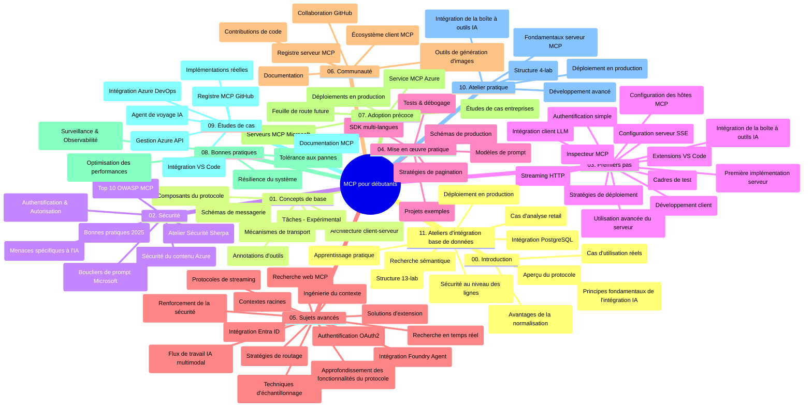

# Protocole de Contexte Modèle (MCP) pour Débutants - Guide d'Étude

Ce guide d'étude fournit une vue d'ensemble de la structure et du contenu du dépôt pour le curriculum "Protocole de Contexte Modèle (MCP) pour Débutants". Utilisez ce guide pour naviguer efficacement dans le dépôt et tirer le meilleur parti des ressources disponibles.

## Aperçu du Dépôt

Le Protocole de Contexte Modèle (MCP) est un cadre standardisé pour les interactions entre les modèles d'IA et les applications clientes. Initialement créé par Anthropic, le MCP est désormais maintenu par la communauté MCP plus large via l'organisation officielle GitHub. Ce dépôt offre un curriculum complet avec des exemples de code pratiques en C#, Java, JavaScript, Python et TypeScript, conçu pour les développeurs d'IA, les architectes systèmes et les ingénieurs logiciels.

## Carte Visuelle du Curriculum

## Structure du Dépôt

Le dépôt est organisé en onze sections principales, chacune se concentrant sur différents aspects du MCP :

1. **Introduction (00-Introduction/)**
   - Vue d'ensemble du Protocole de Contexte Modèle
   - Pourquoi la standardisation est importante dans les pipelines d'IA
   - Cas d'utilisation pratiques et avantages

2. **Concepts de Base (01-CoreConcepts/)**
   - Architecture client-serveur
   - Composants clés du protocole
   - Schémas de messagerie dans MCP

3. **Sécurité (02-Security/)**
   - Menaces de sécurité dans les systèmes basés sur MCP
   - Bonnes pratiques pour sécuriser les implémentations
   - Stratégies d'authentification et d'autorisation
   - **Documentation Complète sur la Sécurité** :
     - Meilleures pratiques de sécurité MCP 2025
     - Guide d'implémentation Azure Content Safety
     - Contrôles et techniques de sécurité MCP
     - Référence rapide des meilleures pratiques MCP
   - **Sujets clés de sécurité** :
     - Attaques d'injection de prompt et empoisonnement d'outils
     - Détournement de session et problèmes de délégué confus
     - Vulnérabilités du passage de jetons
     - Permissions excessives et contrôle d'accès
     - Sécurité de la chaîne d'approvisionnement pour les composants IA
     - Intégration Microsoft Prompt Shields

4. **Premiers Pas (03-GettingStarted/)**
   - Configuration et mise en place de l'environnement
   - Création des premiers serveurs et clients MCP
   - Intégration avec des applications existantes
   - Comprend des sections pour :
     - Première implémentation de serveur
     - Développement de client
     - Intégration client LLM
     - Intégration VS Code
     - Serveur Server-Sent Events (SSE)
     - Utilisation avancée du serveur
     - Streaming HTTP
     - Intégration AI Toolkit
     - Stratégies de test
     - Directives de déploiement

5. **Implémentation Pratique (04-PracticalImplementation/)**
   - Utilisation des SDKs dans différents langages de programmation
   - Techniques de débogage, test et validation
   - Élaboration de modèles de prompt et flux de travail réutilisables
   - Projets exemples avec exemples d'implémentation

6. **Sujets Avancés (05-AdvancedTopics/)**
   - Techniques d'ingénierie de contexte
   - Intégration de l'agent Foundry
   - Flux de travail IA multimodale
   - Démos d'authentification OAuth2
   - Capacités de recherche en temps réel
   - Streaming en temps réel
   - Implémentation des contextes racine
   - Stratégies de routage
   - Techniques d'échantillonnage
   - Approches de mise à l'échelle
   - Considérations de sécurité
   - Intégration de sécurité Entra ID
   - Intégration de recherche Web

7. **Contributions Communautaires (06-CommunityContributions/)**
   - Comment contribuer au code et à la documentation
   - Collaboration via GitHub
   - Améliorations et retours pilotés par la communauté
   - Utilisation de divers clients MCP (Claude Desktop, Cline, VSCode)
   - Travail avec des serveurs MCP populaires incluant la génération d'images

8. **Leçons des Premières Adoptions (07-LessonsfromEarlyAdoption/)**
   - Implémentations réelles et histoires à succès
   - Construction et déploiement de solutions basées sur MCP
   - Tendances et feuille de route future
   - **Guide des serveurs MCP Microsoft** : Guide complet des 10 serveurs MCP Microsoft prêts pour la production incluant :
     - Microsoft Learn Docs MCP Server
     - Azure MCP Server (15+ connecteurs spécialisés)
     - GitHub MCP Server
     - Azure DevOps MCP Server
     - MarkItDown MCP Server
     - SQL Server MCP Server
     - Playwright MCP Server
     - Dev Box MCP Server
     - Azure AI Foundry MCP Server
     - Microsoft 365 Agents Toolkit MCP Server

9. **Bonnes Pratiques (08-BestPractices/)**
   - Optimisation et réglage des performances
   - Conception de systèmes MCP tolérants aux pannes
   - Stratégies de test et de résilience

10. **Études de Cas (09-CaseStudy/)**
    - **Sept études de cas complètes** démontrant la polyvalence du MCP à travers divers scénarios :
    - **Agents de voyage Azure AI** : Orchestration multi-agent avec Azure OpenAI et AI Search
    - **Intégration Azure DevOps** : Automatisation des processus de workflow avec mises à jour de données YouTube
    - **Récupération de documentation en temps réel** : Client console Python avec streaming HTTP
    - **Générateur interactif de plan d'étude** : Application web Chainlit avec IA conversationnelle
    - **Documentation intégrée à l'éditeur** : Intégration VS Code avec workflows GitHub Copilot
    - **Gestion API Azure** : Intégration API entreprise avec création de serveur MCP
    - **Registre MCP GitHub** : Développement de l'écosystème et plateforme d'intégration agentique
    - Exemples d'implémentation couvrant intégration d'entreprise, productivité développeur et développement d'écosystème

11. **Atelier Pratique (10-StreamliningAIWorkflowsBuildingAnMCPServerWithAIToolkit/)**
    - Atelier pratique complet combinant MCP avec AI Toolkit
    - Création d'applications intelligentes reliant modèles IA et outils du monde réel
    - Modules pratiques couvrant les fondamentaux, développement de serveur personnalisé et stratégies de déploiement en production
    - **Structure de l'atelier** :
      - Atelier 1 : Fondamentaux du serveur MCP
      - Atelier 2 : Développement avancé du serveur MCP
      - Atelier 3 : Intégration AI Toolkit
      - Atelier 4 : Déploiement et mise à l'échelle en production
    - Approche d'apprentissage basée sur des laboratoires avec instructions étape par étape

12. **Labs d'Intégration Base de Données Serveur MCP (11-MCPServerHandsOnLabs/)**
    - **Parcours d'apprentissage complet avec 13 labs** pour construire des serveurs MCP prêts pour la production avec intégration PostgreSQL
    - **Implémentation d'analytique retail en conditions réelles** avec le cas d'usage Zava Retail
    - **Patrons de classe entreprise** incluant Row Level Security (RLS), recherche sémantique et accès multi-tenant aux données
    - **Structure Complète du Lab** :
      - **Labs 00-03 : Fondations** - Introduction, Architecture, Sécurité, Configuration de l'environnement
      - **Labs 04-06 : Construction du serveur MCP** - Conception base de données, Implémentation serveur MCP, Développement d'outils
      - **Labs 07-09 : Fonctionnalités avancées** - Recherche sémantique, Tests & débogage, Intégration VS Code
      - **Labs 10-12 : Production & Bonnes pratiques** - Déploiement, Supervision, Optimisation
    - **Technologies couvertes** : Framework FastMCP, PostgreSQL, Azure OpenAI, Azure Container Apps, Application Insights
    - **Résultats d'apprentissage** : Serveurs MCP prêts pour la production, patrons d'intégration base de données, analytique alimentée par IA, sécurité d'entreprise

## Ressources Supplémentaires

Le dépôt inclut des ressources de support :

- **Dossier Images** : Contient diagrammes et illustrations utilisés tout au long du curriculum
- **Traductions** : Support multilingue avec traductions automatisées de la documentation
- **Ressources Officielles MCP** :
  - [Documentation MCP](https://modelcontextprotocol.io/)
  - [Spécification MCP](https://spec.modelcontextprotocol.io/)
  - [Dépôt MCP GitHub](https://github.com/modelcontextprotocol)

## Comment Utiliser Ce Dépôt

1. **Apprentissage Séquentiel** : Suivez les chapitres dans l'ordre (00 à 11) pour une expérience d'apprentissage structurée.
2. **Focus sur un Langage Spécifique** : Si vous vous intéressez à un langage de programmation particulier, explorez les répertoires samples pour des implémentations dans le langage de votre choix.
3. **Implémentation Pratique** : Commencez par la section "Premiers Pas" pour configurer votre environnement et créer votre premier serveur et client MCP.
4. **Exploration Avancée** : Une fois à l'aise avec les bases, plongez dans les sujets avancés pour élargir votre savoir.
5. **Engagement Communautaire** : Rejoignez la communauté MCP via les discussions GitHub et les canaux Discord pour connecter avec des experts et d'autres développeurs.

## Clients et Outils MCP

Le curriculum couvre divers clients et outils MCP :

1. **Clients Officiels** :
   - Visual Studio Code
   - MCP dans Visual Studio Code
   - Claude Desktop
   - Claude dans VSCode
   - Claude API

2. **Clients Communautaires** :
   - Cline (basé terminal)
   - Cursor (éditeur de code)
   - ChatMCP
   - Windsurf

3. **Outils de Gestion MCP** :
   - MCP CLI
   - MCP Manager
   - MCP Linker
   - MCP Router

## Serveurs MCP Populaires

Le dépôt présente divers serveurs MCP, incluant :

1. **Serveurs MCP Microsoft Officiels** :
   - Microsoft Learn Docs MCP Server
   - Azure MCP Server (15+ connecteurs spécialisés)
   - GitHub MCP Server
   - Azure DevOps MCP Server
   - MarkItDown MCP Server
   - SQL Server MCP Server
   - Playwright MCP Server
   - Dev Box MCP Server
   - Azure AI Foundry MCP Server
   - Microsoft 365 Agents Toolkit MCP Server

2. **Serveurs de Référence Officiels** :
   - Filesystem
   - Fetch
   - Memory
   - Sequential Thinking

3. **Génération d'Images** :
   - Azure OpenAI DALL-E 3
   - Stable Diffusion WebUI
   - Replicate

4. **Outils de Développement** :
   - Git MCP
   - Terminal Control
   - Code Assistant

5. **Serveurs Spécialisés** :
   - Salesforce
   - Microsoft Teams
   - Jira & Confluence

## Contribution

Ce dépôt accueille les contributions de la communauté. Consultez la section Contributions Communautaires pour des conseils sur la façon de contribuer efficacement à l'écosystème MCP.

----

*Ce guide d'étude a été mis à jour pour la dernière fois le 5 février 2026, reflétant la dernière Spécification MCP 2025-11-25 et fournit une vue d'ensemble du dépôt à cette date. Le contenu du dépôt peut être mis à jour après cette date.*

---

<!-- CO-OP TRANSLATOR DISCLAIMER START -->
**Avertissement** :  
Ce document a été traduit à l'aide du service de traduction automatique [Co-op Translator](https://github.com/Azure/co-op-translator). Bien que nous nous efforçons d'assurer l'exactitude, veuillez noter que les traductions automatiques peuvent contenir des erreurs ou des imprécisions. Le document original dans sa langue d'origine doit être considéré comme la source faisant foi. Pour toute information critique, il est recommandé de recourir à une traduction humaine professionnelle. Nous déclinons toute responsabilité en cas de malentendus ou d'interprétations erronées résultant de l'utilisation de cette traduction.
<!-- CO-OP TRANSLATOR DISCLAIMER END -->