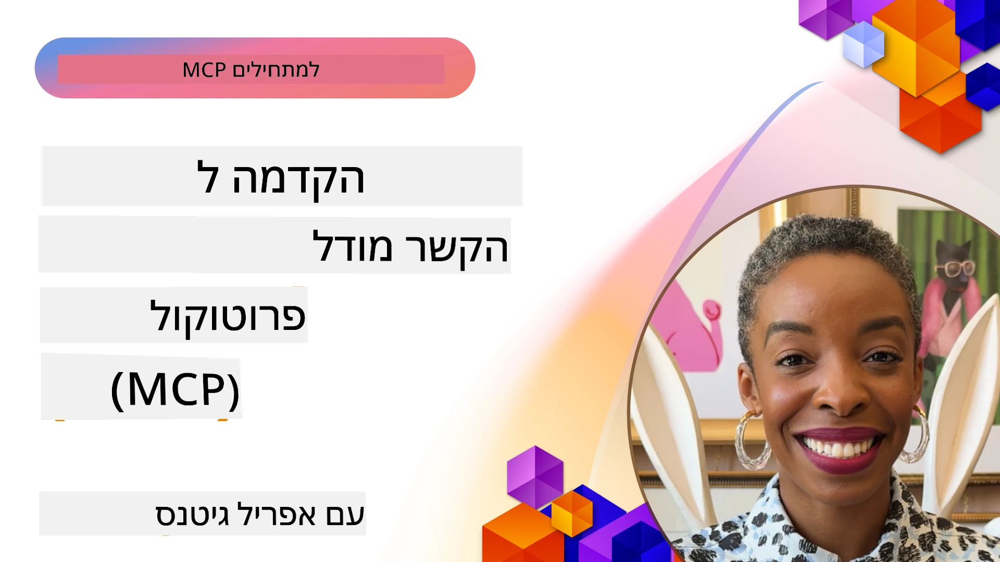
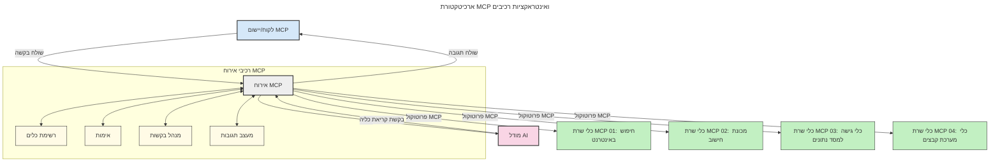

# מבוא לפרוטוקול הקשר למודל (MCP): מדוע זה חשוב ליישומי AI ניתנים להרחבה

[](https://youtu.be/agBbdiOPLQA)

_(לחצו על התמונה למעלה לצפייה בסרטון של השיעור הזה)_

יישומים של בינה מלאכותית יוצרת (Generative AI) הם צעד גדול קדימה, שכן הם לרוב מאפשרים למשתמש לתקשר עם האפליקציה באמצעות הוראות בשפה טבעית. עם זאת, ככל שמשקיעים יותר זמן ומשאבים באפליקציות כאלה, רוצים לוודא שניתן לשלב פונקציונליות ומשאבים בצורה פשוטה להרחבה, שהאפליקציה תוכל לתמוך ביותר מדגם אחד בו זמנית, ולטפל במורכבויות שונות של המודלים. בקיצור, בניית יישומי AI יוצרת קלה להתחלה, אך ככל שהן גדלות ומסתבכות, יש להתחיל להגדיר ארכיטקטורה ועלול להיות צורך להסתמך על תקן כדי להבטיח שהאפליקציות נבנות בצורה עקבית. כאן נכנס MCP לארגן ולספק תקן.

---

## **🔍 מהו פרוטוקול הקשר למודל (MCP)?**

**פרוטוקול הקשר למודל (MCP)** הוא **ממשק פתוח ומאוחד** שמאפשר למודלים לשפה גדולים (LLMs) לתקשר בצורה חלקה עם כלים חיצוניים, ממשקי API, ומקורות נתונים. הוא מספק ארכיטקטורה עקבית לשיפור הפונקציונליות של מודלי AI מעבר לנתוני האימון שלהם, מה שמאפשר מערכות AI חכמות, ניתנות להרחבה ותגובה מהירה.

---

## **🎯 מדוע תקנון ב-AI חשוב**

ככל שיישומי הבינה המלאכותית היוצרת הופכים למורכבים יותר, חיוני לאמץ תקנים המבטיחים **ניתנות להרחבה, היתכנות תחזוקה, ושימור חופש ספק**. MCP מטפל בצרכים אלו על ידי:

- איחוד אינטגרציות מודל-כלי
- הפחתת פתרונות מותאמים אישית שבריריים
- מתן אפשרות לריבוי מודלים מספקים שונים להתקיים באקו-סיסטם אחד

**הערה:** למרות ש-MCP מציג את עצמו כתקן פתוח, אין תוכניות לתקן את MCP דרך גופים תקניים קיימים כגון IEEE, IETF, W3C, ISO או גופים תקניים אחרים.

---

## **📚 יעדי הלמידה**

בסיום המאמר הזה, תדעו:

- להגדיר את **פרוטוקול הקשר למודל (MCP)** ואת מקרי השימוש שלו
- להבין כיצד MCP תקני את התקשורת בין מודלים לכלים
- לזהות את הרכיבים המרכזיים בארכיטקטורת MCP
- להכיר יישומים מעשיים של MCP בהקשרים ארגוניים ופיתוחיים

---

## **💡 מדוע פרוטוקול הקשר למודל (MCP) משנה את המשחק**

### **🔗 MCP פותר את השבר בפעילות ה-AI**

לפני MCP, אינטגרציה בין מודלים לכלים דרשה:

- קוד מותאם אישית לכל זוג כלי-מודל
- ממשקי API לא תקניים לכל ספק
- שברים תכופים עקב עדכונים
- ניתנות להרחבה לקויה עם יותר כלים

### **✅ יתרונות תקנון MCP**

| **יתרון**                | **תיאור**                                                                     |
|--------------------------|--------------------------------------------------------------------------------|
| יכולת פעולה בין-מערכתית  | LLMs פועלים בצורה חלקה עם כלים מספקים שונים                                  |
| עקביות                   | התנהגות אחידה בין פלטפורמות וכלים                                           |
| שימוש חוזר              | כלים שנבנו פעם אחת ניתנים לשימוש בכמה פרויקטים ומערכות                     |
| פיתוח מואץ              | הקטנת זמן פיתוח באמצעות ממשקים תקניים Plug-and-play                         |

---

## **🧱 סקירת ארכיטקטורת MCP ברמה גבוהה**

MCP פועל במסגרת **מודל לקוח-שרת**, כאשר:

- **מארחי MCP** מפעילים את מודלי ה-AI
- **לקוחות MCP** יוזמים בקשות
- **שרתים MCP** מספקים הקשר, כלים ויכולת

### **רכיבים עיקריים:**

- **משאבים** – נתונים סטטיים או דינמיים למודלים  
- **הנחיות (Prompts)** – תהליכים מוגדרים מראש ליצירה מונחית  
- **כלים** – פונקציות הניתנות להרצה כמו חיפוש, חישובים  
- **דגימה** – התנהגות סוכנית דרך אינטראקציות רקורסיביות  
- **שאילה** – בקשות שרת שנוצרות כדי לקבל קלט ממשתמש  
- **שורשים** – גבולות מערכת ההפעלה לבקרת גישה לשרת

### **ארכיטקטורת הפרוטוקול:**

MCP משתמש בארכיטקטורת שתי שכבות:
- **שכבת נתונים**: תקשורת מבוססת JSON-RPC 2.0 עם ניהול מחזור חיים ופרימיטיבים
- **שכבת תחבורה**: STDIO (מקומי) ו-HTTP Streamable עם SSE (רחוק)

---

## כיצד שרתי MCP פועלים

שרתים של MCP פועלים כך:

- **זרימת בקשה**:
    1. בקשה מיוזמת משתמש קצה או תוכנה הפועלת מטעמו.
    2. **לקוח MCP** שולח את הבקשה ל-**מארח MCP**, שמנהלים את סביבת הריצה של מודל ה-AI.
    3. **מודל ה-AI** מקבל את ההנחיה מהמשתמש ועלול לבקש גישה לכלים חיצוניים או נתונים דרך קריאות כלי מרובות.
    4. **מארח MCP**, ולא המודל ישירות, מתקשר עם **שרת(ים) MCP** מתאימים באמצעות הפרוטוקול התקני.
- **פונקציונליות מארח MCP**:
    - **רישום כלים**: שומר קטלוג של כלים זמינים ויכולותיהם.
    - **אימות**: מאמת הרשאות גישה לכלים.
    - **מנהל בקשות**: מעבד בקשות כלים נכנסות מהמודל.
    - **מעצב תגובות**: מארגן תוצרי כלי בפורמט שהמודל מבין.
- **ביצוע שרת MCP**:
    - **מארח MCP** מנתב קריאות כלים לשרת(ים) MCP, שכל אחד מהם מציג פונקציות מתמחות (למשל חיפוש, חישובים, שאילתות למסדי נתונים).
    - **שרתות MCP** מבצעות את הפעולות ומחזירות תוצאות למארח MCP בפורמט אחיד.
    - **מארח MCP** מעצב ומעביר את התוצאות ל-**מודל ה-AI**.
- **השלמת תגובה**:
    - **מודל ה-AI** משלב את תוצרי הכלים לתגובה סופית.
    - **מארח MCP** שולח תגובה זו בחזרה ל-**לקוח MCP**, שמגיש אותה למשתמש הקצה או לתוכנה המבקשת.
    


## 👨‍💻 כיצד לבנות שרת MCP (עם דוגמאות)

שרתות MCP מאפשרות להרחיב את יכולות ה-LLM באמצעות מתן נתונים ופונקציונליות.

מוכנים לנסות? הנה SDK ספציפיים לשפות ו/או סטאקים עם דוגמאות ליצירת שרתי MCP פשוטים בשפות/סטאקים שונים:

- **Python SDK**: https://github.com/modelcontextprotocol/python-sdk

- **TypeScript SDK**: https://github.com/modelcontextprotocol/typescript-sdk

- **Java SDK**: https://github.com/modelcontextprotocol/java-sdk

- **C#/.NET SDK**: https://github.com/modelcontextprotocol/csharp-sdk


## 🌍 מקרי שימוש מעשיים ל-MCP

MCP מאפשר מגוון רחב של יישומים על ידי הרחבת יכולות ה-AI:

| **יישום**                  | **תיאור**                                                                     |
|----------------------------|--------------------------------------------------------------------------------|
| אינטגרציית נתונים ארגונית | חיבור LLMs למסדי נתונים, CRM או כלים פנימיים                                 |
| מערכות AI סוכניות          | הפעלת סוכנים אוטונומיים עם גישה לכלים ותהליכי קבלת החלטות                   |
| יישומים מולטי-מודאליים    | שילוב כלים של טקסט, תמונה וקול בתוך אפליקציית AI אחת מאוחדת                 |
| אינטגרציית נתונים בזמן אמת | הכנסת נתונים חיים לאינטראקציות AI לדיוק תוצרים עדכניים יותר                  |


### 🧠 MCP = תקן אוניברסלי לאינטראקציות AI

פרוטוקול הקשר למודל (MCP) פועל כתקן אוניברסלי לאינטראקציות בינה מלאכותית, בדומה לאופן בו USB-C תיקן את חיבורי המכשירים הפיזיים. בעולם ה-AI, MCP מספק ממשק עקבי, המאפשר למודלים (לקוחות) לשלב בצורה חלקה עם כלים וספקי נתונים חיצוניים (שרתים). הדבר מבטל את הצורך בפרוטוקולים מותאמים ושונים לכל API או מקור נתונים.

תחת MCP, כלי התואם MCP (המכונה שרת MCP) פועל לפי תקן מאוחד. שרתים אלה יכולים לרשום את הכלים או הפעולות שהם מציעים, ולבצע אותן כאשר מבקשים אותם מסוכן AI. פלטפורמות סוכני AI התומכות ב-MCP יכולות לגלות כלים זמינים משרתי MCP ולהפעילם דרך פרוטוקול רגיל זה.

### 💡 מקל על הגישה לידע

מעבר להציע כלים, MCP מקל גם על גישה לידע. הוא מאפשר לאפליקציות לספק הקשר למודלי שפה גדולים (LLMs) על ידי קישורם למקורות נתונים שונים. לדוגמה, שרת MCP יכול לייצג מאגר מסמכים של חברה, ולאפשר לסוכנים לאתר מידע רלוונטי לפי דרישה. שרת אחר יכול לטפל בפעולות ספציפיות כמו שליחת מיילים או עדכון רשומות. מנקודת מבט של הסוכן, אלה פשוט כלים שהוא יכול להשתמש בהם — חלק מהכלים מחזירים נתונים (הקשר ידע), ואחרים מבצעים פעולות. MCP מנהל את שניהם ביעילות.

סוכן שמתחבר לשרת MCP לומד אוטומטית על היכולות והנתונים הזמינים בשרת דרך פורמט תקני. תקניה זו מאפשרת זמינות דינמית של כלים. לדוגמה, הוספת שרת MCP חדש למערכת הסוכן עושה את פונקציותיו זמינות מיד ללא צורך בהתאמה נוספת של הוראות הסוכן.

שילוב הולם זה תואם לזרימה שמוצגת בדיאגרמה הבאה, בה השרתים מספקים גם כלים וגם ידע, ומבטיחים שיתוף פעולה חלק בין מערכות. 

### 👉 דוגמה: פתרון סוכני בר-הרחבה

```mermaid
---
title: פתרון סוכן מדרגי עם MCP
description: דיאגרמה הממחישה כיצד משתמש מתקשר עם LLM שמתחבר למספר שרתי MCP, כאשר כל שרת מספק גם ידע וגם כלים, ויוצר ארכיטקטורת מערכת AI מדרגית
---
graph TD
    User -->|Prompt| LLM
    LLM -->|Response| User
    LLM -->|MCP| ServerA
    LLM -->|MCP| ServerB
    ServerA -->|Universal connector| ServerB
    ServerA --> KnowledgeA
    ServerA --> ToolsA
    ServerB --> KnowledgeB
    ServerB --> ToolsB

    subgraph Server A
        KnowledgeA[ידע]
        ToolsA[כלים]
    end

    subgraph Server B
        KnowledgeB[ידע]
        ToolsB[כלים]
    end
```המאגד האוניברסלי מאפשר לשרתי MCP לתקשר ולשתף יכולות זה עם זה, כך ששרת A יכול להאציל משימות לשרת B או לגשת לכלים ולידע שלו. זה מאחד כלים ונתונים בין שרתים, ותומך בארכיטקטורות סוכנים מודולריות וניתנות להרחבה. מאחר ש-MCP מייעד את חשיפת הכלים, סוכנים יכולים לגלות דינמית ולנתב בקשות בין שרתים ללא אינטגרציות בקוד קשיח.

איחוד כלים וידע: כלים ונתונים יכולים להיות נגישים בין שרתים, מה שמאפשר ארכיטקטורות סוכניות מודולריות וניתנות להרחבה.

### 🔄 תרחישי MCP מתקדמים עם אינטגרציית LLM בצד הלקוח

מעבר לארכיטקטורת MCP הבסיסית, קיימים תרחישים מתקדמים שבהם גם הלקוח וגם השרת מכילים LLMs, ומאפשרים אינטראקציות מתוחכמות יותר. בדיאגרמה הבאה, **אפליקציית לקוח** יכול להיות IDE עם מספר כלים MCP זמינים לשימוש ה-LLM:

```mermaid
---
title: תרחישי MCP מתקדמים עם שילוב LLM צד לקוח-שרת
description: דיאגרמת רצף המציגה את זרימת האינטראקציה המפורטת בין משתמש, אפליקציית לקוח, LLM לקוח, מספר שרתי MCP, ו-LLM שרת, המדגימה גילוי כלי, אינטראקציה עם משתמש, קריאה ישירה לכלי, ושלבי מו״מ על תכונות
---
sequenceDiagram
    autonumber
    actor User as 👤 משתמש
    participant ClientApp as 🖥️ אפליקציית לקוח
    participant ClientLLM as 🧠 LLM לקוח
    participant Server1 as 🔧 שרת MCP 1
    participant Server2 as 📚 שרת MCP 2
    participant ServerLLM as 🤖 LLM שרת
    
    %% Discovery Phase
    rect rgb(220, 240, 255)
        Note over ClientApp, Server2: שלב גילוי הכלים
        ClientApp->>+Server1: בקשת כלים/משאבים זמינים
        Server1-->>-ClientApp: החזרת רשימת כלים (JSON)
        ClientApp->>+Server2: בקשת כלים/משאבים זמינים
        Server2-->>-ClientApp: החזרת רשימת כלים (JSON)
        Note right of ClientApp: אחסון קטלוג כלים<br/>משולב במחשב המקומי
    end
    
    %% User Interaction
    rect rgb(255, 240, 220)
        Note over User, ClientLLM: שלב אינטראקציה עם המשתמש
        User->>+ClientApp: הזנת פקודה בשפה טבעית
        ClientApp->>+ClientLLM: העברת הפקודה + קטלוג כלים
        ClientLLM->>-ClientLLM: ניתוח הפקודה ובחירת כלים
    end
    
    %% Scenario A: Direct Tool Calling
    alt Direct Tool Calling
        rect rgb(220, 255, 220)
            Note over ClientApp, Server1: תרחיש א': קריאה ישירה לכלי
            ClientLLM->>+ClientApp: בקשה לביצוע כלי
            ClientApp->>+Server1: ביצוע כלי מסוים
            Server1-->>-ClientApp: החזרת תוצאות
            ClientApp->>+ClientLLM: עיבוד התוצאות
            ClientLLM-->>-ClientApp: יצירת תגובה
            ClientApp-->>-User: הצגת התשובה הסופית
        end
    
    %% Scenario B: Feature Negotiation (VS Code style)
    else Feature Negotiation (VS Code style)
        rect rgb(255, 220, 220)
            Note over ClientApp, ServerLLM: תרחיש ב': מו״מ על תכונות
            ClientLLM->>+ClientApp: זיהוי יכולות נדרשות
            ClientApp->>+Server2: משא ומתן על תכונות/יכולות
            Server2->>+ServerLLM: בקשת הקשר נוסף
            ServerLLM-->>-Server2: מתן הקשר
            Server2-->>-ClientApp: החזרת תכונות זמינות
            ClientApp->>+Server2: קריאה לכלים שנסכמו
            Server2-->>-ClientApp: החזרת תוצאות
            ClientApp->>+ClientLLM: עיבוד התוצאות
            ClientLLM-->>-ClientApp: יצירת תגובה
            ClientApp-->>-User: הצגת התשובה הסופית
        end
    end
```
## 🔐 יתרונות מעשיים של MCP

הנה היתרונות המעשיים בשימוש ב-MCP:

- **עדכניות**: מודלים יכולים לגשת למידע עדכני מעבר לנתוני האימון שלהם
- **הרחבת יכולת**: מודלים יכולים לנצל כלים מיוחדים למשימות שלא עוברו אימון עבורן
- **הפחתת הזיות**: מקורות נתונים חיצוניים מספקים עיגון עובדתי
- **פרטיות**: נתונים רגישים יכולים להישאר בסביבות מאובטחות במקום להשתלב בהנחיות

## 📌 נקודות מרכזיות

הנקודות המרכזיות לשימוש ב-MCP הן:

- **MCP** תקני את אופן האינטראקציה של מודלי AI עם כלים ונתונים
- מקדם **ניתנות להרחבה, עקביות ופעולה חוצת מערכות**
- MCP עוזר **להפחית זמן פיתוח, לשפר אמינות ולהרחיב יכולות מודל**
- ארכיטקטורת לקוח-שרת **מאפשרת יישומי AI גמישים וניתנים להרחבה**

## 🧠 תרגיל

חשבו על יישום AI שמעניין אתכם לבנות.

- אילו **כלים או נתונים חיצוניים** יכולים לשפר את היכולות שלו?
- כיצד MCP עשוי להפוך את האינטגרציה **לפשוטה ואמינה יותר?**

## משאבים נוספים

- [מאגר GitHub של MCP](https://github.com/modelcontextprotocol)


## מה הלאה

הבא: [פרק 1: מושגי יסוד](../01-CoreConcepts/README.md)

---

<!-- CO-OP TRANSLATOR DISCLAIMER START -->
**הצהרת שחרור**:  
מסמך זה תורגם באמצעות שירות תרגום מבוסס בינה מלאכותית [Co-op Translator](https://github.com/Azure/co-op-translator). בעוד שאנו שואפים לדיוק, יש לקחת בחשבון שתרגומים אוטומטיים עלולים לכלול שגיאות או אי דיוקים. המסמך המקורי בשפתו המקורית יש להיחשב כמקור הסמכותי. למידע קריטי מומלץ לבצע תרגום מקצועי על ידי בני אדם. אנו לא נושאים באחריות לכל הבנה מוטעית או פרשנות שגויה הנובעת מהשימוש בתרגום זה.
<!-- CO-OP TRANSLATOR DISCLAIMER END -->