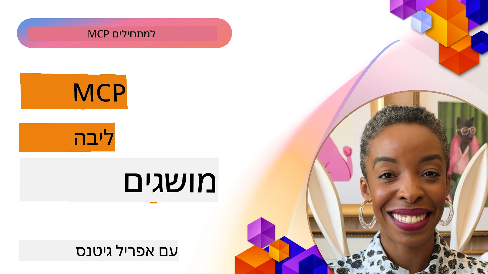
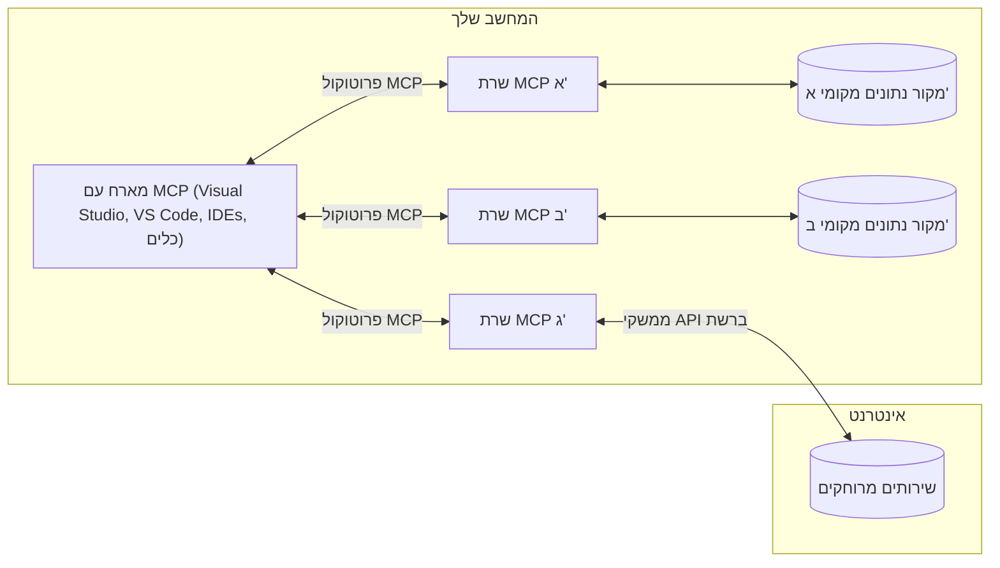

# מושגי ליבת MCP: שליטה בפרוטוקול הקשר מודל לשילוב AI

[](https://youtu.be/earDzWGtE84)

_(לחצו על התמונה למעלה לצפייה בסרטון השיעור)_

ה-[פרוטוקול הקשר מודל (MCP)](https://github.com/modelcontextprotocol) הוא מסגרת סטנדרטית וחזקה שמיישרת את התקשורת בין דגמי שפה גדולים (LLMs) לבין כלים חיצוניים, אפליקציות, ומקורות נתונים.  
מדריך זה ילווה אתכם דרך מושגי היסוד של MCP. תלמדו על אדריכלות לקוח-שרת, רכיבים חיוניים, מנגנוני תקשורת, ופרקטיקות הטמעה מיטביות.

- **אישור מפורש מהמשתמש**: כל גישה לנתונים ופעולות דורשות אישור מפורש מהמשתמש לפני ביצוע. על המשתמשים להבין בבירור אילו נתונים ייגשו ואילו פעולות יתבצעו, עם שליטה מפורטת על הרשאות ואישורים.

- **הגנה על פרטיות הנתונים**: נתוני המשתמש נחשפים רק בהסכמה מפורשת וחייבים להיות מוגנים על ידי בקרות גישה חזקה לאורך כל מחזור החיים של האינטראקציה. יש למנוע שידור נתונים לא מורשה ולשמור על גבולות פרטיות קפדניים.

- **בטיחות הפעלת כלים**: כל קריאה לכלי דורשת הסכמת משתמש מפורשת עם הבנה ברורה של פונקציונליות הכלי, פרמטרים, והשפעה פוטנציאלית. גבולות אבטחה חזקים חייבים למנוע הפעלה לא בטוחה, לא מכוונת או זדונית של כלים.

- **אבטחת שכבת הובלה**: כל ערוצי התקשורת צריכים להשתמש בהצפנה ואימות מתאימים. חיבורים מרוחקים צריכים ליישם פרוטוקולי הובלה מאובטחים וניהול הרשאות כראוי.

#### קווי הנחיה להטמעה:

- **ניהול הרשאות**: יישום מערכות הרשאה מדויקות שמאפשרות למשתמשים לשלוט באילו שרתים, כלים, ומשאבים נגישים  
- **אימות ואישורים**: שימוש בשיטות אימות מאובטחות (OAuth, מפתחות API) עם ניהול תקין של אסימונים ותוקף  
- **אימות קלט**: אימות כל הפרמטרים והקלט לפי סכימות מוגדרות למניעת התקפות הזרקה  
- **רישום ביקורת**: שמירת יומני פעולות מקיפים למעקב אבטחה ועמידה ברגולציות

## סקירה כללית

שיעור זה בוחן את האדריכלות היסודית והרכיבים שמהווים את מערכת האקוסיסטם של פרוטוקול הקשר מודל (MCP). תלמדו על ארכיטקטורת לקוח-שרת, רכיבים מרכזיים, ומנגנוני תקשורת שמניעים את אינטראקציות ה-MCP.

## מטרות למידה מרכזיות

בסוף שיעור זה, תוכל:

- להבין את האדריכלות לקוח-שרת של MCP.  
- לזהות תפקידים ואחריות של מארחים, לקוחות, ושרתים.  
- לנתח את התכונות המרכזיות שהופכות את MCP לשכבת אינטגרציה גמישה.  
- ללמוד כיצד זורמת המידע בתוך אקוסיסטם MCP.  
- לקבל תובנות מעשיות דרך דוגמאות קוד ב-.NET, Java, Python, ו-JavaScript.

## אדריכלות MCP: מבט מעמיק יותר

מערכת ה-MCP בנויה על מודל לקוח-שרת. מבנה מודולרי זה מאפשר לאפליקציות AI לתקשר ביעילות עם כלים, מאגרי נתונים, APIs, ומשאבים הקשריים. נפרק את האדריכלות לרכיביה המרכזיים.

בליבה שלה, MCP פועלת על אדריכלות לקוח-שרת שבה אפליקציית מארח יכולה להתחבר לשרתים מרובים:


- **מארחי MCP**: תוכניות כמו VSCode, Claude Desktop, IDEs, או כלים של AI שרוצים גישה לנתונים דרך MCP  
- **לקוחות MCP**: לקוחות הפרוטוקול שמנהלים חיבורים 1:1 עם שרתים  
- **שרתים של MCP**: תוכניות קלות שמשדרות יכולות ספציפיות דרך פרוטוקול הקשר מודל הסטנדרטי  
- **מקורות נתונים מקומיים**: קבצים, מאגרי נתונים, ושירותים במחשב שלכם שאליהם שרתי MCP יכולים לגשת בצורה מאובטחת  
- **שירותים מרוחקים**: מערכות חיצוניות הזמינות דרך האינטרנט שאליהן שרתי MCP יכולים להתחבר דרך APIs.

פרוטוקול MCP הוא תקן מתפתח המשתמש בגרסאות מבוססות תאריכים (פורמט YYYY-MM-DD). גרסת הפרוטוקול הנוכחית היא **2025-11-25**. ניתן לצפות בעדכונים האחרונים ב-[מפרט הפרוטוקול](https://modelcontextprotocol.io/specification/2025-11-25/)

### 1. מארחים

בפרוטוקול הקשר מודל (MCP), **מארחים** הם אפליקציות AI המשמשות כממשק ראשי דרכו המשתמשים מתקשרים עם הפרוטוקול. המארחים מתאמים ומנהלים חיבורים לשרתים מרובי MCP על ידי יצירת לקוחות MCP ייעודיים לכל חיבור שרת. דוגמאות למארחים:

- **אפליקציות AI**: Claude Desktop, Visual Studio Code, Claude Code  
- **סביבות פיתוח**: IDEs ועורכי קוד עם אינטגרציית MCP  
- **אפליקציות מותאמות אישית**: סוכני AI וכלים ייעודיים

**מארחים** הם אפליקציות שמאחדות אינטראקציות עם דגמי AI. הם:

- **מנחים דגמי AI**: מפעילים או מתקשרים עם LLMs כדי לייצר תגובות ולתאם זרימות עבודה של AI  
- **מנוהלים חיבורים ללקוחות**: יוצרים ומנהלים לקוח MCP אחד לכל חיבור שרת MCP  
- **שולטים בממשק המשתמש**: מטפלים בזרימת שיחה, אינטראקציות עם המשתמש והצגת תגובות  
- **אוכפים אבטחה**: שולטות בהרשאות, מגבלות אבטחה ואימות  
- **מטפלים באישור משתמש**: מנהלים את אישור המשתמש לשיתוף נתונים ולהפעלת כלים

### 2. לקוחות

**לקוחות** הם רכיבים חיוניים שמנהלים חיבורים ייעודיים של אחד לאחד בין מארחים לשרתי MCP. כל לקוח MCP מופעל על ידי המארח כדי להתחבר לשרת MCP מסוים, מה שמבטיח ערוצי תקשורת מאורגנים ומאובטחים. מספר לקוחות מאפשרים למארחים להתחבר לשרתים מרובים בו זמנית.

**לקוחות** הם רכיבי חיבור באפליקציית המארח. הם:

- **תקשורת פרוטוקולית**: שולחים בקשות JSON-RPC 2.0 לשרתים עם הנחיות ומדריכים  
- **משא ומתן על יכולות**: מוודאים תכונות וגרסאות פרוטוקול נתמכות עם השרתים בתחילת ההפעלה  
- **הפעלה של כלים**: מנהלים בקשות הפעלה של כלים מהמודלים ומעבדים תגובות  
- **עדכונים בזמן אמת**: מטפלים בהתראות ועדכונים חיים מהשרתים  
- **עיבוד תגובות**: מעבדים ומעצבנים תגובות של שרת להצגה למשתמשים

### 3. שרתים

**שרתים** הם תוכניות שמספקות הקשר, כלים, ויכולות ללקוחות MCP. הם יכולים לפעול מקומית (באותו מחשב כמו המארח) או מרחוק (בפלטפורמות חיצוניות), ואחראיים לטיפול בבקשות לקוח ולספק תגובות מובנות. שרתים חושפים פונקציונליות ספציפית דרך פרוטוקול הקשר מודל הסטנדרטי.

**שרתים** הם שירותים שמספקים הקשר ויכולות. הם:

- **רישום תכונות**: רושמים וחושפים פרימיטיבים זמינים (משאבים, הנחיות, כלים) ללקוחות  
- **עיבוד בקשות**: מקבלים ומפעילים קריאות כלים, בקשות למשאבים, ובקשות הנחיות מלקוחות  
- **מתן הקשר**: מספקים מידע הקשרי ונתונים לשיפור תגובות המודל  
- **ניהול מצב**: שומרים על מצב סשן ומטפלים באינטראקציות מדינות במידת הצורך  
- **התראות בזמן אמת**: שולחים התראות על שינויים ויכולות לעדכן לקוחות מחוברים

שרתים יכולים להיות מפותחים על ידי כל אחד להרחבת יכולות המודל עם פונקציונליות מיוחדת, ותומכים בפריסות מקומיות ומרוחקות.

### 4. פרימיטיבים של שרת

שרתים בפרוטוקול הקשר מודל (MCP) מספקים שלושה **פרימיטיבים** מרכזיים שמגדירים אבני בניין בסיסיות לאינטראקציות עשירות בין לקוחות, מארחים ודגמים לשוניים. הפרימיטיבים מגדירים את סוגי המידע ההקשרי והפעולות הזמינות דרך הפרוטוקול.

שרתי MCP יכולים לחשוף כל שילוב משלושת הפרימיטיבים הבסיסיים הבאים:

#### משאבים

**משאבים** הם מקורות נתונים המספקים מידע הקשרי לאפליקציות AI. הם מייצגים תוכן סטטי או דינמי שיכול לשפר את הבנת המודל ולקבלת החלטות:

- **נתונים הקשריים**: מידע מובנה והקשר לצריכת מודל ה-AI  
- **מאגרי ידע**: מאגרי מסמכים, מאמרים, מדריכים ומחקרים  
- **מקורות נתונים מקומיים**: קבצים, מסדי נתונים, ומידע מערכת מקומית  
- **נתונים חיצוניים**: תגובות API, שירותי רשת, ונתוני מערכות מרוחקות  
- **תוכן דינמי**: נתונים בזמן אמת שמתעדכנים בהתאם לתנאים חיצוניים

משאבים מזוהים על ידי URI ותומכים בגילוי דרך שיטות `resources/list` ושליפה דרך `resources/read`:

```text
file://documents/project-spec.md
database://production/users/schema
api://weather/current
```
  
#### הנחיות

**הנחיות** הן תבניות מחודשות שמסייעות במבנה האינטראקציה עם דגמי השפה. הן מספקות דפוסי אינטראקציה סטנדרטיים וזרימות עבודה מוכנות:

- **אינטראקציות מבוססות תבניות**: הודעות מובנות מראש ופותחי שיחה  
- **תבניות זרימת עבודה**: רצפים סטנדרטיים למשימות ואינטראקציות שכיחות  
- **דוגמאות בודדות**: תבניות מבוססות דוגמה להנחיית המודל  
- **הנחיות מערכת**: הנחיות יסוד המגדירות את התנהגות והקשר המודל  
- **תבניות דינמיות**: הנחיות פרמטריות שמותאמות להקשר ספציפי

הנחיות תומכות בהחלפת משתנים וניתנות לגילוי דרך `prompts/list` ולשליפה עם `prompts/get`:

```markdown
Generate a {{task_type}} for {{product}} targeting {{audience}} with the following requirements: {{requirements}}
```
  
#### כלים

**כלים** הם פונקציות ניתנות להפעלה שדגמי AI יכולים לקרוא לביצוע פעולות ספציפיות. הם מייצגים את ה"פועלים" באקוסיסטם MCP, ומאפשרים למודלים אינטראקציה עם מערכות חיצוניות:

- **פונקציות ניתנות להפעלה**: פעולות דיסקרטיות שהמודלים יכולים להפעיל עם פרמטרים ספציפיים  
- **אינטגרציה עם מערכות חיצוניות**: קריאות API, שאילתות מסד נתונים, פעולות על קבצים, חישובים  
- **זהות ייחודית**: לכל כלי יש שם ייחודי, תיאור, וסכימת פרמטרים  
- **I/O מובנה**: כלים מקבלים פרמטרים מאומתים ומחזירים תגובות מובנות ומטיפוסות  
- **יכולות פעולה**: מאפשרים למודלים לבצע פעולות בעולם האמיתי ולקבל נתונים חיים

כלים מוגדרים באמצעות JSON Schema לאימות פרמטרים וניתנים לגילוי דרך `tools/list` ומופעלים דרך `tools/call`. הכלים יכולים לכלול גם **אייקונים** כמטא-דטה נוספת להצגה טובה יותר של הממשק.

**הערות לכלים**: כלים תומכים בהערות התנהגותיות (כגון `readOnlyHint`, `destructiveHint`) המתארות האם הכלי הוא רק לקריאה או הרסני, ועוזרות ללקוחות לקבל החלטות מושכלות לגבי הפעלת הכלי.

דוגמה להגדרת כלי:

```typescript
server.tool(
  "search_products", 
  {
    query: z.string().describe("Search query for products"),
    category: z.string().optional().describe("Product category filter"),
    max_results: z.number().default(10).describe("Maximum results to return")
  }, 
  async (params) => {
    // הפעל חיפוש והחזר תוצאות מובנות
    return await productService.search(params);
  }
);
```
  
## פרימיטיבים של לקוח

בפרוטוקול הקשר מודל (MCP), **לקוחות** יכולים לחשוף פרימיטיבים שמאפשרים לשרתים לבקש יכולות נוספות מאפליקציית המארח. הפרימיטיבים בצד הלקוח מאפשרים מימושים עשירים ואינטראקטיביים של שרתים שיכולים לגשת ליכולות מודל AI ואינטראקציות עם המשתמש.

### דגימה

**דגימה** מאפשרת לשרתים לבקש השלמות ממודל השפה באפליקציית AI של הלקוח. פרימיטיב זה מאפשר לשרתים לגשת ליכולות LLM מבלי להשתמש ב-SDKים משלהם או לנהל גישה למודל:

- **גישה בלתי תלויה במודל**: שרתים יכולים לבקש השלמות ללא צורך בשילוב SDK של LLM או ניהול גישה למודל  
- **AI מיוזמת השרת**: מאפשר לשרתים לייצר תוכן באופן עצמאי באמצעות מודל AI של הלקוח  
- **אינטראקציות רקורסיביות עם LLM**: תומך בתרחישים מורכבים שבהם שרתים צריכים עזרת AI לעיבוד  
- **יצירת תוכן דינמית**: מאפשר לשרתים ליצור תגובות הקשריות באמצעות המודל של המארח  
- **תמיכה בקריאת כלים**: שרתים יכולים לכלול פרמטרים `tools` ו-`toolChoice` כדי לאפשר למודל הלקוח להפעיל כלים במהלך הדגימה

דגימה מופעלת דרך השיטה `sampling/complete`, שבה שרתים שולחים בקשות השלמה ללקוחות.

### שורשים

**שורשים** מספקים דרך סטנדרטית ללקוחות לחשוף גבולות מערכת קבצים לשרתים, כדי לעזור לשרתים להבין לאילו תיקיות וקבצים יש להם גישה:

- **גבולות מערכת קבצים**: מגדירים את הגבולות שבהם שרתים יכולים לפעול במערכת הקבצים  
- **בקרת גישה**: עוזרים לשרתים להבין לאילו תיקיות וקבצים יש להם הרשאה לגשת  
- **עדכונים דינמיים**: לקוחות יכולים להודיע לשרתים כשהרשימה של השורשים משתנה  
- **זיהוי מבוסס URI**: שורשים משתמשים ב-URI מסוג `file://` לזיהוי תיקיות וקבצים נגישים

שורשים מתגלים דרך השיטה `roots/list`, כאשר לקוחות שולחים `notifications/roots/list_changed` בעת שינוי שורשים.

### איתור מידע (Elicitation)  

**איתור מידע** מאפשר לשרתים לבקש מידע נוסף או אישור מהמשתמשים דרך ממשק הלקוח:

- **בקשות קלט משתמש**: שרתים יכולים לבקש מידע נוסף בעת צורך להפעלת כלים  
- **דיאלוגי אישור**: בקשת אישור משתמש עבור פעולות רגישות או בעלות השפעה  
- **זרימות עבודה אינטראקטיביות**: מאפשר לשרתים ליצור אינטראקציות שלב-אחר-שלב עם משתמשים  
- **איסוף פרמטרים דינמי**: לאסוף פרמטרים חסרים או אופציונליים במהלך הפעלת הכלי

בקשות איתור מידע מתבצעות באמצעות השיטה `elicitation/request` לאיסוף קלט משתמש דרך הממשק של הלקוח.

**איתור במצב URL**: שרתים יכולים גם לבקש אינטראקציות מבוססות URL, שמאפשרות לשרתים להפנות משתמשים לדפי רשת חיצוניים לאימות, אישור, או הזנת נתונים.

### רישום (Logging)

**רישום** מאפשר לשרתים לשלוח הודעות לוג מובנות ללקוחות לצרכי דיבוג, ניטור וראות תפעולית:

- **תמיכה בדיבוג**: מאפשר לשרתים לספק יומני ביצוע מפורטים לפתרון בעיות  
- **ניטור תפעולי**: שליחת עדכוני מצב ומדדי ביצועים ללקוחות  
- **דיווח על שגיאות**: מספק הקשר שגיאות מפורט ומידע אבחוני  
- **שבילי ביקורת**: יצירת יומנים מקיפים של פעולות והחלטות השרת

הודעות רישום נשלחות ללקוחות כדי לספק שקיפות לפעילות השרת ולהקל על דיבוג.

## זרימת מידע בפרוטוקול MCP

פרוטוקול הקשר מודל (MCP) מגדיר זרימה מובנית של מידע בין מארחים, לקוחות, שרתים, ודגמים. הבנת זרימה זו מסייעת להבהיר כיצד מעובדות בקשות משתמש ואיך כלים ונתונים חיצוניים משתלבים בתגובות המודל.

- **המארח מאתחל חיבור**  
  אפליקציית המארח (למשל IDE או ממשק שיחה) מקימה חיבור לשרת MCP, בדרך כלל דרך STDIO, WebSocket, או פרוטוקול הובלה נתמך אחר.

- **משא ומתן על יכולות**  
  הלקוח (שמשולב במארח) והשרת מחליפים מידע על תכונות, כלים, משאבים, וגרסאות פרוטוקול נתמכות. זה מבטיח שני הצדדים מבינים אילו יכולות זמינות למפגש.

- **בקשת משתמש**  
  המשתמש מתקשר עם המארח (לדוגמה, מזין בקשה או פקודה). המארח אוסף את הקלט ומעבירו ללקוח לעיבוד.

- **שימוש במשאב או כלי**  
  - הלקוח עשוי לבקש הקשר או משאבים נוספים מהשרת (כמו קבצים, רשומות מסד נתונים, או מאמרים) כדי להעשיר את הבנת המודל.  
  - אם המודל קובע כי יש צורך בכלי (לדוגמה, להשיג נתונים, לבצע חישוב או קריאת API), הלקוח שולח בקשה להפעיל כלי לשרת, ומפרט את שם הכלי והפרמטרים.

- **הפעלת שרת**  

השרת מקבל את בקשת המשאב או הכלי, מבצע את הפעולות הנדרשות (כגון הפעלת פונקציה, שאילתא למסד נתונים, או אחזור קובץ), ומחזיר את התוצאות ללקוח בפורמט מובנה.

- **יצירת תגובה**  
  הלקוח משלב את תגובות השרת (נתוני משאב, תוצאות כלים וכו') באינטראקציה השוטפת עם המודל. המודל משתמש במידע זה כדי ליצור תגובה מקיפה ורלוונטית להקשר.

- **הצגת התוצאה**  
  המארח מקבל את התוצר הסופי מהלקוח ומציגו למשתמש, לעיתים כולל גם את הטקסט שנוצר על ידי המודל וגם כל תוצאה מתוך הרצת כלים או אחזורי משאבים.

זרימה זו מאפשרת ל-MCP לתמוך ביישומי בינה מלאכותית מתקדמים, אינטראקטיביים ומבוססי הקשר באמצעות חיבור חלק בין מודלים לכלים ומשאבים חיצוניים.

## ארכיטקטורת הפרוטוקול ושכבותיו

MCP מורכב משני שכבות ארכיטקטוניות מובחנות שעובדות יחד כדי לספק מסגרת תקשורת שלמה:

### שכבת הנתונים

**שכבת הנתונים** מממשת את פרוטוקול MCP הבסיסי באמצעות **JSON-RPC 2.0**. שכבה זו מגדירה את מבנה ההודעות, הסמנטיקה ודפוסי האינטראקציה:

#### מרכיבים עיקריים:

- **פרוטוקול JSON-RPC 2.0**: כל התקשורת משתמשת בפורמט הודעות תקני JSON-RPC 2.0 לקריאות מתודות, תגובות והתראות  
- **ניהול מחזור חיים**: מטפלת באתחול חיבור, ניהול יכולות, וסיום סשן בין לקוחות לשרתים  
- **Primitive של שרת**: מאפשר לשרתים לספק פונקציונליות בסיסית דרך כלים, משאבים, והנחיות  
- **Primitive של לקוח**: מאפשר לשרתים לבקש דגימות מ-LLM, לעורר קלט משתמש ולשלוח הודעות יומן  
- **התראות בזמן אמת**: תומך בהתראות אסינכרוניות לעדכונים דינמיים ללא הצורך בפולינג  

#### תכונות מפתח:

- **משא ומתן על גרסת הפרוטוקול**: משתמש בתאריך כגרסה (YYYY-MM-DD) להבטחת תאימות  
- **גילוי יכולות**: לקוחות ושרתים מחליפים מידע על תכונות נתמכות בעת אתחול  
- **סשנים עם שמירת מצבים**: שומר מצב חיבור לאורך כמה אינטראקציות לשימור ההקשר  

### שכבת התחבורה

**שכבת התחבורה** מנהלת את ערוצי התקשורת, תיחומה של ההודעות ואימות בין משתתפי MCP:

#### מנגנוני תחבורה נתמכים:

1. **תחבורה STDIO**:  
   - משתמשת בזרמי קלט/פלט סטנדרטיים לתקשורת תהליכים ישירה  
   - אופטימלי לתהליכים מקומיים באותו מחשב ללא עומס רשת  
   - נפוץ למימושי שרת MCP מקומיים  

2. **תחבורה HTTP ניתנת לזרימה**:  
   - משתמשת ב-HTTP POST להודעות מלקוח לשרת  
   - אפשרות לאירועי שרת (SSE) לזרימה משרת ללקוח  
   - מאפשרת תקשורת עם שרתים מרוחקים דרך רשתות  
   - תומכת באימות HTTP סטנדרטי (אסימוני bearer, מפתחות API, כותרות מותאמות)  
   - MCP ממליץ על OAuth לאימות מאובטח המבוסס טוקנים  

#### הפשטת התחבורה:

שכבת התחבורה מפשטת פרטי תקשורת משכבת הנתונים, ומאפשרת שימוש באותו פורמט הודעות JSON-RPC 2.0 בכל מנגנוני התחבורה. הפשטה זו מאפשרת יישומים לעבור בקלות בין שרתים מקומיים למרוחקים.

### שיקולי אבטחה

מימושי MCP חייבים לעמוד במגוון עקרונות אבטחה קריטיים כדי להבטיח אינטראקציות בטוחות, אמינות ומוגנות בכל פעולות הפרוטוקול:

- **הסכמה ושליטה של המשתמש**: יש לדרוש הסכמה מפורשת של המשתמש לפני גישה לנתונים או ביצוע פעולות. על המשתמש להיות בעל שליטה ברורה על אילו נתונים משותפים ואילו פעולות מאושרות, נתמך בממשקי משתמש אינטואיטיביים לסקירה ואישור פעולות.

- **פרטיות נתונים**: נתוני המשתמש ייחשפו רק בהסכמה מפורשת ויש להגן עליהם באמצעות בקרות גישה ראויות. מימושי MCP חייבים למנוע העברת נתונים בלתי מורשית ולהבטיח שמירה על פרטיות לאורך כל האינטראקציות.

- **בטיחות הכלים**: לפני קריאה לכלי כלשהו יש לדרוש הסכמה מפורשת של המשתמש. יש לוודא הבנה ברורה של תפקוד כל כלי, ולהטיל גבולות אבטחה חזקים למניעת הרצת כלים בלתי רצויה או מסוכנת.

בהקפדה על עקרונות אבטחה אלה, MCP מבטיח אמון, פרטיות וביטחון למשתמשים בכל האינטראקציות בפרוטוקול, תוך אפשרות אינטגרציה חזקה של AI.

## דוגמאות קוד: מרכיבי מפתח

להלן דוגמאות קוד בשפות תכנות פופולריות המדגימות את מימוש מרכיבי MCP מרכזיים וכלים.

### דוגמת .NET: יצירת שרת MCP פשוט עם כלים

זו דוגמת קוד .NET מעשית הממחישה כיצד לממש שרת MCP פשוט עם כלים מותאמים אישית. הדוגמה מציגה כיצד להגדיר ולרשום כלים, לטפל בבקשות ולחבר את השרת באמצעות פרוטוקול Model Context.

```csharp
using System;
using System.Threading.Tasks;
using ModelContextProtocol.Server;
using ModelContextProtocol.Server.Transport;
using ModelContextProtocol.Server.Tools;

public class WeatherServer
{
    public static async Task Main(string[] args)
    {
        // Create an MCP server
        var server = new McpServer(
            name: "Weather MCP Server",
            version: "1.0.0"
        );
        
        // Register our custom weather tool
        server.AddTool<string, WeatherData>("weatherTool", 
            description: "Gets current weather for a location",
            execute: async (location) => {
                // Call weather API (simplified)
                var weatherData = await GetWeatherDataAsync(location);
                return weatherData;
            });
        
        // Connect the server using stdio transport
        var transport = new StdioServerTransport();
        await server.ConnectAsync(transport);
        
        Console.WriteLine("Weather MCP Server started");
        
        // Keep the server running until process is terminated
        await Task.Delay(-1);
    }
    
    private static async Task<WeatherData> GetWeatherDataAsync(string location)
    {
        // This would normally call a weather API
        // Simplified for demonstration
        await Task.Delay(100); // Simulate API call
        return new WeatherData { 
            Temperature = 72.5,
            Conditions = "Sunny",
            Location = location
        };
    }
}

public class WeatherData
{
    public double Temperature { get; set; }
    public string Conditions { get; set; }
    public string Location { get; set; }
}
```

### דוגמת Java: מרכיבי שרת MCP

דוגמה זו מדגימה את אותו שרת MCP ורישום כלים כפי בדוגמת .NET למעלה, אך מומשה ב-Java.

```java
import io.modelcontextprotocol.server.McpServer;
import io.modelcontextprotocol.server.McpToolDefinition;
import io.modelcontextprotocol.server.transport.StdioServerTransport;
import io.modelcontextprotocol.server.tool.ToolExecutionContext;
import io.modelcontextprotocol.server.tool.ToolResponse;

public class WeatherMcpServer {
    public static void main(String[] args) throws Exception {
        // צור שרת MCP
        McpServer server = McpServer.builder()
            .name("Weather MCP Server")
            .version("1.0.0")
            .build();
            
        // רשום כלי מזג אוויר
        server.registerTool(McpToolDefinition.builder("weatherTool")
            .description("Gets current weather for a location")
            .parameter("location", String.class)
            .execute((ToolExecutionContext ctx) -> {
                String location = ctx.getParameter("location", String.class);
                
                // השג נתוני מזג אוויר (מפושט)
                WeatherData data = getWeatherData(location);
                
                // החזר תשובה מעוצבת
                return ToolResponse.content(
                    String.format("Temperature: %.1f°F, Conditions: %s, Location: %s", 
                    data.getTemperature(), 
                    data.getConditions(), 
                    data.getLocation())
                );
            })
            .build());
        
        // חבר את השרת באמצעות תחבורה stdio
        try (StdioServerTransport transport = new StdioServerTransport()) {
            server.connect(transport);
            System.out.println("Weather MCP Server started");
            // שמור על השרת פועל עד שההליך יופסק
            Thread.currentThread().join();
        }
    }
    
    private static WeatherData getWeatherData(String location) {
        // המימוש יקרא ל-API של מזג אוויר
        // מפושט למטרות דוגמה
        return new WeatherData(72.5, "Sunny", location);
    }
}

class WeatherData {
    private double temperature;
    private String conditions;
    private String location;
    
    public WeatherData(double temperature, String conditions, String location) {
        this.temperature = temperature;
        this.conditions = conditions;
        this.location = location;
    }
    
    public double getTemperature() {
        return temperature;
    }
    
    public String getConditions() {
        return conditions;
    }
    
    public String getLocation() {
        return location;
    }
}
```

### דוגמת Python: בניית שרת MCP

דוגמה זו משתמשת ב-fastmcp, אנא ודא שקבעת אותו קודם:

```python
pip install fastmcp
```
 דוגמת קוד:

```python
#!/usr/bin/env python3
import asyncio
from fastmcp import FastMCP
from fastmcp.transports.stdio import serve_stdio

# צור שרת FastMCP
mcp = FastMCP(
    name="Weather MCP Server",
    version="1.0.0"
)

@mcp.tool()
def get_weather(location: str) -> dict:
    """Gets current weather for a location."""
    return {
        "temperature": 72.5,
        "conditions": "Sunny",
        "location": location
    }

# גישה חלופית באמצעות מחלקה
class WeatherTools:
    @mcp.tool()
    def forecast(self, location: str, days: int = 1) -> dict:
        """Gets weather forecast for a location for the specified number of days."""
        return {
            "location": location,
            "forecast": [
                {"day": i+1, "temperature": 70 + i, "conditions": "Partly Cloudy"}
                for i in range(days)
            ]
        }

# רשום כלים של המחלקה
weather_tools = WeatherTools()

# התחל את השרת
if __name__ == "__main__":
    asyncio.run(serve_stdio(mcp))
```

### דוגמת JavaScript: יצירת שרת MCP

דוגמה זו מציגה יצירת שרת MCP ב-JavaScript וכיצד לרשום שני כלים הקשורים למזג אוויר.

```javascript
// שימוש ב-SDK הרשמי של פרוטוקול הקשר מודל
import { McpServer } from "@modelcontextprotocol/sdk/server/mcp.js";
import { StdioServerTransport } from "@modelcontextprotocol/sdk/server/stdio.js";
import { z } from "zod"; // לאימות פרמטרים

// יצירת שרת MCP
const server = new McpServer({
  name: "Weather MCP Server",
  version: "1.0.0"
});

// הגדרת כלי מזג אוויר
server.tool(
  "weatherTool",
  {
    location: z.string().describe("The location to get weather for")
  },
  async ({ location }) => {
    // בדרך כלל היה קורא ל-API של מזג האוויר
    // מפושט להדגמה
    const weatherData = await getWeatherData(location);
    
    return {
      content: [
        { 
          type: "text", 
          text: `Temperature: ${weatherData.temperature}°F, Conditions: ${weatherData.conditions}, Location: ${weatherData.location}` 
        }
      ]
    };
  }
);

// הגדרת כלי תחזית
server.tool(
  "forecastTool",
  {
    location: z.string(),
    days: z.number().default(3).describe("Number of days for forecast")
  },
  async ({ location, days }) => {
    // בדרך כלל היה קורא ל-API של מזג האוויר
    // מפושט להדגמה
    const forecast = await getForecastData(location, days);
    
    return {
      content: [
        { 
          type: "text", 
          text: `${days}-day forecast for ${location}: ${JSON.stringify(forecast)}` 
        }
      ]
    };
  }
);

// פונקציות עזר
async function getWeatherData(location) {
  // סימולציה של קריאת API
  return {
    temperature: 72.5,
    conditions: "Sunny",
    location: location
  };
}

async function getForecastData(location, days) {
  // סימולציה של קריאת API
  return Array.from({ length: days }, (_, i) => ({
    day: i + 1,
    temperature: 70 + Math.floor(Math.random() * 10),
    conditions: i % 2 === 0 ? "Sunny" : "Partly Cloudy"
  }));
}

// חיבור השרת באמצעות תחבורה stdio
const transport = new StdioServerTransport();
server.connect(transport).catch(console.error);

console.log("Weather MCP Server started");
```

דוגמת JavaScript זו מדגימה כיצד ליצור לקוח MCP שמתחבר לשרת, שולח הנחיה, ומעבד את התגובה כולל קריאות לכלים שבוצעו.

## אבטחה ואישורים

MCP כולל מספר מושגים ומנגנונים מובנים לניהול אבטחה ואישורים במהלך הפרוטוקול:

1. **שליטה בהרשאות כלים**:  
   לקוחות יכולים לציין אילו כלים רשאי מודל להשתמש בהם במהלך סשן. זה מוודא שרק כלים שהורשו מפורשות זמינים, ומפחית סיכון לפעולות בלתי מורשות או לא בטוחות. הרשאות ניתנות לקונפיגורציה דינמית לפי העדפות משתמש, מדיניות ארגונית או הקשר האינטראקציה.

2. **אימות**:  
   שרתים יכולים לדרוש אימות לפני מתן גישה לכלים, משאבים, או פעולות רגישות. זה יכול לכלול מפתחות API, אסימוני OAuth, או שיטות אימות נוספות. אימות תקין מבטיח שרק לקוחות ומשתמשים מהימנים יכולים להפעיל פונקציונליות צד-שרת.

3. **אימות פרמטרים**:  
   אימות פרמטרים נאכף בכל קריאת כלי. כל כלי מגדיר את סוגי, פורמטים, והגבלות לפרמטרים שלו, והשרת מאמת בקשות נכנסות בהתאם. זה מונע קלט פגום או זדוני מלהגיע למימושי הכלים ותורם לשמירת שלמות הפעולות.

4. **הגבלת קצב**:  
   כדי למנוע ניצול לרעה ולהבטיח שימוש הוגן במשאבי השרת, שרתי MCP יכולים ליישם הגבלת קצב לקריאות כלים וגישה למשאבים. הגבלות יכולות להיות לפי משתמש, לפי סשן או גלובליות, ועוזרות בהגנה מפני התקפות מניעת שירות או צריכת משאבים מוגזמת.

בשילוב מנגנונים אלו, MCP מספק בסיס מאובטח למיזוג מודלים לשוניים עם כלים ומשאבים חיצוניים, תוך הענקת שליטה מדויקת למשתמשים ולמפתחים על גישה ושימוש.

## הודעות פרוטוקול וזרימת תקשורת

תקשורת MCP משתמשת בהודעות מובנות בפורמט **JSON-RPC 2.0** כדי לאפשר אינטראקציות ברורות ואמינות בין מארחים, לקוחות ושרתים. הפרוטוקול מגדיר דפוסי הודעות ספציפיים לסוגי פעולות שונים:

### סוגי הודעות עיקריים:

#### **הודעות אתחול**
- בקשת `initialize`: מקימה חיבור ומנהלת משא ומתן על גרסת פרוטוקול ויכולות  
- תגובת `initialize`: מאשרת תכונות נתמכות ומידע על השרת  
- `notifications/initialized`: מסמן כי האתחול הושלם והסשן מוכן  

#### **הודעות גילוי**
- בקשת `tools/list`: מגלה כלים זמינים מהשרת  
- בקשת `resources/list`: מציגה רשימת משאבים זמינים  
- בקשת `prompts/list`: מושך תבניות הנחיה זמינות  

#### **הודעות ביצוע**  
- בקשת `tools/call`: מפעילה כלי מסוים עם פרמטרים מסופקים  
- בקשת `resources/read`: מחזירה תוכן ממשאב מוגדר  
- בקשת `prompts/get`: מושכת תבנית הנחיה עם פרמטרים אופציונליים  

#### **הודעות מצד הלקוח**
- בקשת `sampling/complete`: השרת מבקש השלמת LLM מהלקוח  
- `elicitation/request`: השרת מבקש קלט משתמש דרך ממשק הלקוח  
- הודעות יומן: השרת שולח הודעות לוג מובנות ללקוח  

#### **הודעות התראה**
- `notifications/tools/list_changed`: השרת מודיע ללקוח על שינויים בכלים  
- `notifications/resources/list_changed`: השרת מודיע על שינויים במשאבים  
- `notifications/prompts/list_changed`: השרת מודיע על שינויים בתבניות הנחיה  

### מבנה ההודעות:

כל הודעות MCP עוקבות אחר פורמט JSON-RPC 2.0 עם:  
- **הודעות בקשה**: כוללות `id`, `method`, ופרמטרים אופציונליים `params`  
- **הודעות תגובה**: כוללות `id` ו-`result` או `error`  
- **הודעות התראה**: כוללות `method` ו-`params` אופציונליים (ללא `id` או תגובה צפויה)

תקשורת מובנית זו מבטיחה אינטראקציות אמינות, ברורות וניתנות להרחבה התומכות בתרחישים מתקדמים כגון עדכונים בזמן אמת, שרשור כלים וטיפול שגיאות יציב.

### משימות (ניסוי)

**משימות** הן תכונה ניסיונית המאפשרת עטיפות ביצוע עמידות המספקות אחזור תוצאות דחוי ומעקב אחר סטטוס בקשות MCP:

- **פעולות ממושכות**: מעקב אחר חישובים יקרים, אוטומציה של זרימות עבודה ועיבוד אצווה  
- **תוצאות דחויות**: פולינג למעקב סטטוס ומשיכת תוצאות בסיום פעולות  
- **מעקב סטטוס**: ניטור התקדמות המשימה באמצעות מצבי מחזור חיים מוגדרים  
- **פעולות ברב-שלבים**: תמיכה בזרימות עבודה מורכבות המשתרעות על פני מספר אינטראקציות  

משימות עוטפות בקשות MCP סטנדרטיות ומאפשרות דפוסי ביצוע אסינכרוניים לפעולות שאינן יכולות להתחבר מיידית.

## מסקנות עיקריות

- **ארכיטקטורה**: MCP משתמש בארכיטקטורת לקוח-שרת שבה מארחים מנהלים חיבורים מרובים בין לקוחות לשרתים  
- **משתתפים**: המערכת כוללת מארחים (יישומי AI), לקוחות (מחברים לפרוטוקול), ושרתים (ספקי יכולות)  
- **מנגנוני תחבורה**: התקשורת תומכת ב-STDIO (מקומי) ו-HTTP ניתנת לזרימה עם SSE אופציונלי (מרוחק)  
- **Primitive מרכזיים**: שרתים מציעים כלים (פונקציות ניתנות להרצה), משאבים (מקורות נתונים), והנחיות (תבניות)  
- **Primitive של לקוח**: שרתים יכולים לבקש דגימות (השלמות LLM עם תמיכה בקריאת כלים), לעורר קלט (כולל מצב URL), להגדיר גבולות קבצים, ולנהל יומן מהלקוחות  
- **תכונות ניסיוניות**: משימות מספקות עטיפות ביצוע עמידות לפעולות ארוכות  
- **יסוד הפרוטוקול**: בנוי על JSON-RPC 2.0 עם גרסת תאריך (נוכחית: 2025-11-25)  
- **יכולת בזמן אמת**: תומך בהתראות לעדכונים דינמיים וסנכרון בזמן אמת  
- **אבטחה במרכז**: הסכמה מפורשת של המשתמש, פרטיות נתונים, ותעבורה מאובטחת הן דרישות בסיסיות  

## תרגיל

עצב כלי MCP פשוט שיהיה שימושי בתחום שלך. הגדר:  
1. כיצד כלי זה יקרא  
2. אילו פרמטרים הוא יקבל  
3. איזו תוצאה יחזיר  
4. כיצד מודל עשוי להשתמש בכלי זה לפתרון בעיות משתמשים  

---

## מה הלאה

הבא: [פרק 2: אבטחה](../02-Security/README.md)

---

<!-- CO-OP TRANSLATOR DISCLAIMER START -->
**כתב ויתור**:  
מסמך זה תורגם באמצעות שירות תרגום מבוסס בינה מלאכותית [Co-op Translator](https://github.com/Azure/co-op-translator). אנו שואפים לדייק, אך יש לשים לב כי תרגומים אוטומטיים עלולים להכיל שגיאות או אי-דיוקים. המסמך המקורי בשפת המקור הוא המקור הסמכותי. למידע קריטי מומלץ להיעזר בתרגום מקצועי על ידי אדם. אנו לא נושאים באחריות לכל אי-הבנה או פרשנות שגויה הנובעות משימוש בתרגום זה.
<!-- CO-OP TRANSLATOR DISCLAIMER END -->