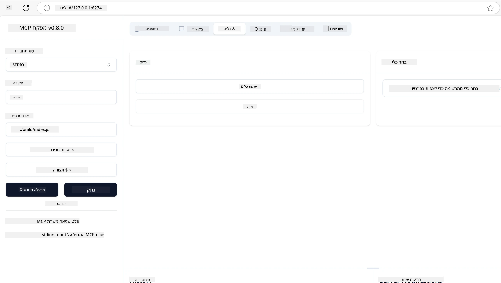
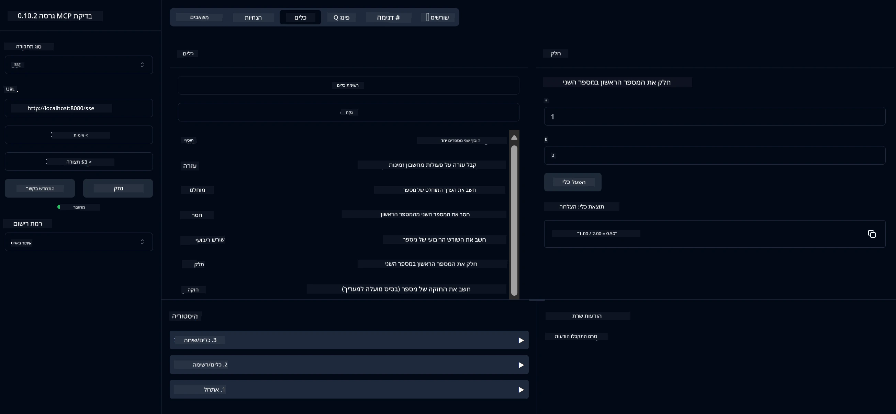
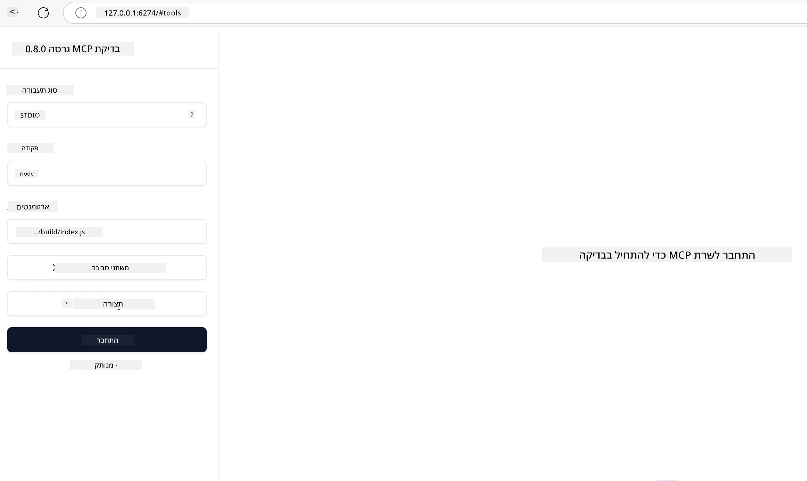
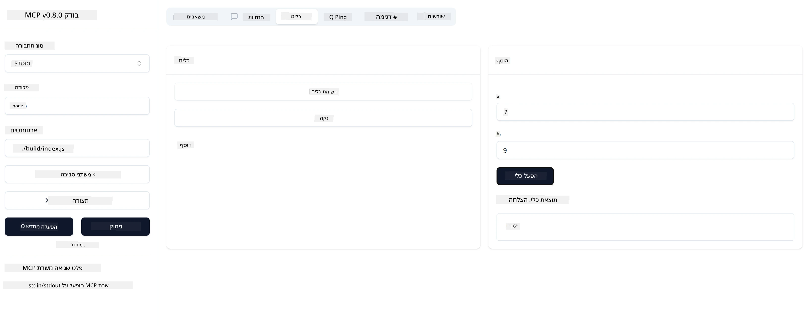

# התחלה עם MCP

ברוכים הבאים לצעדים הראשונים שלכם עם פרוטוקול הקשר למודל (MCP)! בין אם אתם חדשים ב-MCP או מחפשים להעמיק את ההבנה שלכם, מדריך זה ילווה אתכם בתהליך ההתקנה והפיתוח החיוני. תגלה כיצד MCP מאפשר אינטגרציה חלקה בין מודלים של בינה מלאכותית ליישומים, ולמד כיצד להכין במהירות את הסביבה שלך לבניית ובדיקת פתרונות מבוססי MCP.

> סיכום; אם אתם בונים אפליקציות בינה מלאכותית, אתם יודעים שניתן להוסיף כלים ומשאבים אחרים ל-LLM (מודל שפה גדול), כדי להפוך את ה-LLM ליותר ידעתי. עם זאת, אם אתם ממקמים את הכלים והמשאבים האלה על שרת, היישום ויכולות השרת יכולים לשמש כל לקוח עם/בלי LLM.

## סקירה כללית

שיעור זה מספק הנחיות מעשיות על הקמת סביבות MCP ובניית היישומים הראשונים שלך ב-MCP. תלמד כיצד להגדיר את הכלים והמסגרות הנדרשות, לבנות שרתי MCP בסיסיים, ליצור יישומי מארח, ולבדוק את היישומים שלך.

פרוטוקול הקשר למודל (MCP) הוא פרוטוקול פתוח שמאחד כיצד יישומים מספקים הקשר ל-LLM. חשבו על MCP כמו יציאת USB-C לאפליקציות בינה מלאכותית - הוא מספק דרך סטנדרטית לחבר מודלים של בינה מלאכותית למקורות נתונים וכלים שונים.

## מטרות הלמידה

בסיום שיעור זה, תוכל:

- להגדיר סביבות פיתוח ל-MCP ב-C#, Java, Python, TypeScript ו-Rust
- לבנות ולפרוס שרתי MCP בסיסיים עם תכונות מותאמות אישית (משאבים, תבניות, וכלים)
- ליצור יישומי מארח שמתחברים לשרתי MCP
- לבדוק ולפתור תקלות ביישומי MCP

## הגדרת סביבת ה-MCP שלך

לפני שתתחיל לעבוד עם MCP, חשוב להכין את סביבת הפיתוח שלך ולהבין את זרימת העבודה הבסיסית. חלק זה ידריך אותך בשלבי ההתקנה הראשוניים כדי להבטיח התחלה חלקה עם MCP.

### דרישות מוקדמות

לפני שתצלול לפיתוח MCP, ודא שיש לך:

- **סביבת פיתוח**: עבור השפה שבחרת (C#, Java, Python, TypeScript או Rust)
- **IDE/עורך**: Visual Studio, Visual Studio Code, IntelliJ, Eclipse, PyCharm, או כל עורך קוד מודרני
- **מנהל חבילות**: NuGet, Maven/Gradle, pip, npm/yarn, או Cargo
- **מפתחות API**: עבור כל שירותי בינה מלאכותית שאתה מתכנן להשתמש בהם ביישומי המארח שלך

## מבנה בסיסי של שרת MCP

שרת MCP כולל בדרך כלל:

- **הגדרות שרת**: הגדרת פורט, אימות, והגדרות נוספות
- **משאבים**: נתונים והקשר הזמינים ל-LLM
- **כלים**: פונקציונליות שהמודלים יכולים להפעיל
- **תבניות**: תבניות ליצירת או מבנה טקסט

הנה דוגמה מפושטת ב-TypeScript:

```typescript
import { McpServer, ResourceTemplate } from "@modelcontextprotocol/sdk/server/mcp.js";
import { StdioServerTransport } from "@modelcontextprotocol/sdk/server/stdio.js";
import { z } from "zod";

// צור שרת MCP
const server = new McpServer({
  name: "Demo",
  version: "1.0.0"
});

// הוסף כלי נוסף
server.tool("add",
  { a: z.number(), b: z.number() },
  async ({ a, b }) => ({
    content: [{ type: "text", text: String(a + b) }]
  })
);

// הוסף משאב ברכה דינמי
server.resource(
  "file",
  // הפרמטר 'list' שולט כיצד המשאב מציג את הקבצים הזמינים. הגדרת הפרמטר ל-undefined מבטלת את ההצגה עבור משאב זה.
  new ResourceTemplate("file://{path}", { list: undefined }),
  async (uri, { path }) => ({
    contents: [{
      uri: uri.href,
      text: `File, ${path}!`
    }]
  })
);

// הוסף משאב קובץ שקורא את תוכן הקובץ
server.resource(
  "file",
  new ResourceTemplate("file://{path}", { list: undefined }),
  async (uri, { path }) => {
    let text;
    try {
      text = await fs.readFile(path, "utf8");
    } catch (err) {
      text = `Error reading file: ${err.message}`;
    }
    return {
      contents: [{
        uri: uri.href,
        text
      }]
    };
  }
);

server.prompt(
  "review-code",
  { code: z.string() },
  ({ code }) => ({
    messages: [{
      role: "user",
      content: {
        type: "text",
        text: `Please review this code:\n\n${code}`
      }
    }]
  })
);

// התחל לקבל הודעות ב-stdin ולשלוח הודעות ב-stdout
const transport = new StdioServerTransport();
await server.connect(transport);
```

בקוד שלמעלה אנחנו:

- מייבאים את המחלקות הנדרשות מ-SDK של MCP ל-TypeScript.
- יוצרים ומגדירים מופע חדש של שרת MCP.
- רושמים כלי מותאם אישית (`calculator`) עם פונקציית מטפל.
- מפעילים את השרת להאזנה לבקשות MCP נכנסות.

## בדיקה ופתרון תקלות

לפני שתתחיל לבדוק את שרת ה-MCP שלך, חשוב להבין את הכלים הזמינים ואת שיטות העבודה המומלצות לפתרון תקלות. בדיקה יעילה מבטיחה שהשרת שלך מתנהג כמצופה ועוזרת לך לזהות ולפתור בעיות במהירות. החלק הבא מפרט גישות מומלצות לאימות יישום ה-MCP שלך.

MCP מספק כלים שיעזרו לך לבדוק ולפתור תקלות בשרתים שלך:

- **כלי Inspector**, ממשק גרפי זה מאפשר לך להתחבר לשרת שלך ולבדוק את הכלים, התבניות והמשאבים שלך.
- **curl**, ניתן גם להתחבר לשרת שלך באמצעות כלי שורת פקודה כמו curl או לקוחות אחרים שיכולים ליצור ולהריץ פקודות HTTP.

### שימוש ב-MCP Inspector

[מפקח MCP](https://github.com/modelcontextprotocol/inspector) הוא כלי בדיקה חזותי שעוזר לך:

1. **לגלות יכולות שרת**: לזהות אוטומטית משאבים, כלים ותבניות זמינים
2. **לבדוק הפעלת כלים**: לנסות פרמטרים שונים ולראות תגובות בזמן אמת
3. **לצפות במטא-נתוני השרת**: לבדוק מידע על השרת, סכימות והגדרות

```bash
# דוגמת TypeScript, התקנה והרצה של MCP Inspector
npx @modelcontextprotocol/inspector node build/index.js
```

כאשר אתה מריץ את הפקודות שלמעלה, MCP Inspector יפתח ממשק אינטרנט מקומי בדפדפן שלך. תוכל לצפות בלוח בקרה המציג את שרתי MCP הרשומים שלך, הכלים, המשאבים והתבניות הזמינים שלהם. הממשק מאפשר לך לבדוק אינטראקטיבית הפעלת כלים, לבדוק מטא-נתוני שרת ולראות תגובות בזמן אמת, מה שמקל על אימות ופתרון תקלות ביישומי שרת MCP שלך.

הנה צילום מסך של איך זה יכול להיראות:



## בעיות נפוצות בהגדרה ופתרונות

| בעיה | פתרון אפשרי |
|-------|-------------------|
| חיבור נדחה | בדוק אם השרת פועל והפורט נכון |
| שגיאות בהפעלת כלים | בדוק את אימות הפרמטרים וטיפול בשגיאות |
| כשלי אימות | אמת מפתחות API והרשאות |
| שגיאות אימות סכימה | ודא שהפרמטרים תואמים לסכימה המוגדרת |
| השרת לא מתחיל | בדוק קונפליקטים בפורט או תלות חסרה |
| שגיאות CORS | הגדר כותרות CORS נכונות לבקשות חוצות מקור |
| בעיות אימות | אמת את תוקף הטוקן והרשאות |

## פיתוח מקומי

לצורך פיתוח ובדיקה מקומיים, ניתן להריץ שרתי MCP ישירות על המחשב שלך:

1. **הפעל את תהליך השרת**: הרץ את יישום שרת ה-MCP שלך
2. **הגדר רשת**: ודא שהשרת נגיש בפורט הצפוי
3. **התחבר ללקוחות**: השתמש בכתובות חיבור מקומיות כמו `http://localhost:3000`

```bash
# דוגמה: הרצת שרת MCP ב-TypeScript באופן מקומי
npm run start
# השרת רץ בכתובת http://localhost:3000
```

## בניית שרת MCP ראשון שלך

כבר סקרנו [מושגים מרכזיים](/01-CoreConcepts/README.md) בשיעור קודם, עכשיו הגיע הזמן ליישם את הידע.

### מה שרת יכול לעשות

לפני שנתחיל לכתוב קוד, נזכיר לעצמנו מה שרת יכול לעשות:

שרת MCP יכול למשל:

- לגשת לקבצים ומסדי נתונים מקומיים
- להתחבר ל-APIs מרוחקים
- לבצע חישובים
- להשתלב עם כלים ושירותים אחרים
- לספק ממשק משתמש לאינטראקציה

מצוין, עכשיו כשאנחנו יודעים מה אפשר לעשות, נתחיל לקודד.

## תרגיל: יצירת שרת

כדי ליצור שרת, עליך לבצע את השלבים הבאים:

- התקן את SDK של MCP.
- צור פרויקט והגדר את מבנה הפרויקט.
- כתוב את קוד השרת.
- בדוק את השרת.

### -1- יצירת פרויקט

#### TypeScript

```sh
# צור תיקיית פרויקט ואתחל פרויקט npm
mkdir calculator-server
cd calculator-server
npm init -y
```

#### Python

```sh
# צור תיקיית פרויקט
mkdir calculator-server
cd calculator-server
# פתח את התיקייה ב-Visual Studio Code - דלג על כך אם אתה משתמש ב-IDE שונה
code .
```

#### .NET

```sh
dotnet new console -n McpCalculatorServer
cd McpCalculatorServer
```

#### Java

ל-Java, צור פרויקט Spring Boot:

```bash
curl https://start.spring.io/starter.zip \
  -d dependencies=web \
  -d javaVersion=21 \
  -d type=maven-project \
  -d groupId=com.example \
  -d artifactId=calculator-server \
  -d name=McpServer \
  -d packageName=com.microsoft.mcp.sample.server \
  -o calculator-server.zip
```

חלץ את קובץ ה-zip:

```bash
unzip calculator-server.zip -d calculator-server
cd calculator-server
# אפשרי להסיר את הבדיקה שלא בשימוש
rm -rf src/test/java
```

הוסף את ההגדרה המלאה הבאה לקובץ *pom.xml* שלך:

```xml
<?xml version="1.0" encoding="UTF-8"?>
<project xmlns="http://maven.apache.org/POM/4.0.0"
    xmlns:xsi="http://www.w3.org/2001/XMLSchema-instance"
    xsi:schemaLocation="http://maven.apache.org/POM/4.0.0 http://maven.apache.org/xsd/maven-4.0.0.xsd">
    <modelVersion>4.0.0</modelVersion>
    
    <!-- Spring Boot parent for dependency management -->
    <parent>
        <groupId>org.springframework.boot</groupId>
        <artifactId>spring-boot-starter-parent</artifactId>
        <version>3.5.0</version>
        <relativePath />
    </parent>

    <!-- Project coordinates -->
    <groupId>com.example</groupId>
    <artifactId>calculator-server</artifactId>
    <version>0.0.1-SNAPSHOT</version>
    <name>Calculator Server</name>
    <description>Basic calculator MCP service for beginners</description>

    <!-- Properties -->
    <properties>
        <java.version>21</java.version>
        <maven.compiler.source>21</maven.compiler.source>
        <maven.compiler.target>21</maven.compiler.target>
    </properties>

    <!-- Spring AI BOM for version management -->
    <dependencyManagement>
        <dependencies>
            <dependency>
                <groupId>org.springframework.ai</groupId>
                <artifactId>spring-ai-bom</artifactId>
                <version>1.0.0-SNAPSHOT</version>
                <type>pom</type>
                <scope>import</scope>
            </dependency>
        </dependencies>
    </dependencyManagement>

    <!-- Dependencies -->
    <dependencies>
        <dependency>
            <groupId>org.springframework.ai</groupId>
            <artifactId>spring-ai-starter-mcp-server-webflux</artifactId>
        </dependency>
        <dependency>
            <groupId>org.springframework.boot</groupId>
            <artifactId>spring-boot-starter-actuator</artifactId>
        </dependency>
        <dependency>
         <groupId>org.springframework.boot</groupId>
         <artifactId>spring-boot-starter-test</artifactId>
         <scope>test</scope>
      </dependency>
    </dependencies>

    <!-- Build configuration -->
    <build>
        <plugins>
            <plugin>
                <groupId>org.springframework.boot</groupId>
                <artifactId>spring-boot-maven-plugin</artifactId>
            </plugin>
            <plugin>
                <groupId>org.apache.maven.plugins</groupId>
                <artifactId>maven-compiler-plugin</artifactId>
                <configuration>
                    <release>21</release>
                </configuration>
            </plugin>
        </plugins>
    </build>

    <!-- Repositories for Spring AI snapshots -->
    <repositories>
        <repository>
            <id>spring-milestones</id>
            <name>Spring Milestones</name>
            <url>https://repo.spring.io/milestone</url>
            <snapshots>
                <enabled>false</enabled>
            </snapshots>
        </repository>
        <repository>
            <id>spring-snapshots</id>
            <name>Spring Snapshots</name>
            <url>https://repo.spring.io/snapshot</url>
            <releases>
                <enabled>false</enabled>
            </releases>
        </repository>
    </repositories>
</project>
```

#### Rust

```sh
mkdir calculator-server
cd calculator-server
cargo init
```

### -2- הוספת תלותים

כעת כשיצרת את הפרויקט, נוסיף תלותים:

#### TypeScript

```sh
# אם לא מותקן כבר, התקן את TypeScript באופן גלובלי
npm install typescript -g

# התקן את MCP SDK ואת Zod לאימות סכימות
npm install @modelcontextprotocol/sdk zod
npm install -D @types/node typescript
```

#### Python

```sh
# צור סביבה וירטואלית והתקן תלותים
python -m venv venv
venv\Scripts\activate
pip install "mcp[cli]"
```

#### Java

```bash
cd calculator-server
./mvnw clean install -DskipTests
```

#### Rust

```sh
cargo add rmcp --features server,transport-io
cargo add serde
cargo add tokio --features rt-multi-thread
```

### -3- יצירת קבצי פרויקט

#### TypeScript

פתח את הקובץ *package.json* והחלף את התוכן הבא כדי להבטיח שתוכל לבנות ולהריץ את השרת:

```json
{
  "name": "calculator-server",
  "version": "1.0.0",
  "main": "index.js",
  "type": "module",
  "scripts": {
    "build": "tsc",
    "start": "npm run build && node ./build/index.js",
  },
  "keywords": [],
  "author": "",
  "license": "ISC",
  "description": "A simple calculator server using Model Context Protocol",
  "dependencies": {
    "@modelcontextprotocol/sdk": "^1.16.0",
    "zod": "^3.25.76"
  },
  "devDependencies": {
    "@types/node": "^24.0.14",
    "typescript": "^5.8.3"
  }
}
```

צור קובץ *tsconfig.json* עם התוכן הבא:

```json
{
  "compilerOptions": {
    "target": "ES2022",
    "module": "Node16",
    "moduleResolution": "Node16",
    "outDir": "./build",
    "rootDir": "./src",
    "strict": true,
    "esModuleInterop": true,
    "skipLibCheck": true,
    "forceConsistentCasingInFileNames": true
  },
  "include": ["src/**/*"],
  "exclude": ["node_modules"]
}
```

צור תיקייה לקוד המקור שלך:

```sh
mkdir src
touch src/index.ts
```

#### Python

צור קובץ *server.py*

```sh
touch server.py
```

#### .NET

התקן את חבילות NuGet הנדרשות:

```sh
dotnet add package ModelContextProtocol --prerelease
dotnet add package Microsoft.Extensions.Hosting
```

#### Java

לפרויקטים של Java Spring Boot, מבנה הפרויקט נוצר אוטומטית.

#### Rust

ל-Rust, קובץ *src/main.rs* נוצר כברירת מחדל כשאתה מריץ `cargo init`. פתח את הקובץ ומחק את הקוד המוגדר כברירת מחדל.

### -4- כתיבת קוד השרת

#### TypeScript

צור קובץ *index.ts* והוסף את הקוד הבא:

```typescript
import { McpServer, ResourceTemplate } from "@modelcontextprotocol/sdk/server/mcp.js";
import { StdioServerTransport } from "@modelcontextprotocol/sdk/server/stdio.js";
import { z } from "zod";
 
// צור שרת MCP
const server = new McpServer({
  name: "Calculator MCP Server",
  version: "1.0.0"
});
```

כעת יש לך שרת, אבל הוא לא עושה הרבה, בוא נתקן את זה.

#### Python

```python
# server.py
from mcp.server.fastmcp import FastMCP

# יצירת שרת MCP
mcp = FastMCP("Demo")
```

#### .NET

```csharp
using Microsoft.Extensions.DependencyInjection;
using Microsoft.Extensions.Hosting;
using Microsoft.Extensions.Logging;
using ModelContextProtocol.Server;
using System.ComponentModel;

var builder = Host.CreateApplicationBuilder(args);
builder.Logging.AddConsole(consoleLogOptions =>
{
    // Configure all logs to go to stderr
    consoleLogOptions.LogToStandardErrorThreshold = LogLevel.Trace;
});

builder.Services
    .AddMcpServer()
    .WithStdioServerTransport()
    .WithToolsFromAssembly();
await builder.Build().RunAsync();

// add features
```

#### Java

ל-Java, צור את רכיבי השרת המרכזיים. ראשית, שנה את מחלקת היישום הראשית:

*src/main/java/com/microsoft/mcp/sample/server/McpServerApplication.java*:

```java
package com.microsoft.mcp.sample.server;

import org.springframework.ai.tool.ToolCallbackProvider;
import org.springframework.ai.tool.method.MethodToolCallbackProvider;
import org.springframework.boot.SpringApplication;
import org.springframework.boot.autoconfigure.SpringBootApplication;
import org.springframework.context.annotation.Bean;
import com.microsoft.mcp.sample.server.service.CalculatorService;

@SpringBootApplication
public class McpServerApplication {

    public static void main(String[] args) {
        SpringApplication.run(McpServerApplication.class, args);
    }
    
    @Bean
    public ToolCallbackProvider calculatorTools(CalculatorService calculator) {
        return MethodToolCallbackProvider.builder().toolObjects(calculator).build();
    }
}
```

צור את שירות המחשבון *src/main/java/com/microsoft/mcp/sample/server/service/CalculatorService.java*:

```java
package com.microsoft.mcp.sample.server.service;

import org.springframework.ai.tool.annotation.Tool;
import org.springframework.stereotype.Service;

/**
 * Service for basic calculator operations.
 * This service provides simple calculator functionality through MCP.
 */
@Service
public class CalculatorService {

    /**
     * Add two numbers
     * @param a The first number
     * @param b The second number
     * @return The sum of the two numbers
     */
    @Tool(description = "Add two numbers together")
    public String add(double a, double b) {
        double result = a + b;
        return formatResult(a, "+", b, result);
    }

    /**
     * Subtract one number from another
     * @param a The number to subtract from
     * @param b The number to subtract
     * @return The result of the subtraction
     */
    @Tool(description = "Subtract the second number from the first number")
    public String subtract(double a, double b) {
        double result = a - b;
        return formatResult(a, "-", b, result);
    }

    /**
     * Multiply two numbers
     * @param a The first number
     * @param b The second number
     * @return The product of the two numbers
     */
    @Tool(description = "Multiply two numbers together")
    public String multiply(double a, double b) {
        double result = a * b;
        return formatResult(a, "*", b, result);
    }

    /**
     * Divide one number by another
     * @param a The numerator
     * @param b The denominator
     * @return The result of the division
     */
    @Tool(description = "Divide the first number by the second number")
    public String divide(double a, double b) {
        if (b == 0) {
            return "Error: Cannot divide by zero";
        }
        double result = a / b;
        return formatResult(a, "/", b, result);
    }

    /**
     * Calculate the power of a number
     * @param base The base number
     * @param exponent The exponent
     * @return The result of raising the base to the exponent
     */
    @Tool(description = "Calculate the power of a number (base raised to an exponent)")
    public String power(double base, double exponent) {
        double result = Math.pow(base, exponent);
        return formatResult(base, "^", exponent, result);
    }

    /**
     * Calculate the square root of a number
     * @param number The number to find the square root of
     * @return The square root of the number
     */
    @Tool(description = "Calculate the square root of a number")
    public String squareRoot(double number) {
        if (number < 0) {
            return "Error: Cannot calculate square root of a negative number";
        }
        double result = Math.sqrt(number);
        return String.format("√%.2f = %.2f", number, result);
    }

    /**
     * Calculate the modulus (remainder) of division
     * @param a The dividend
     * @param b The divisor
     * @return The remainder of the division
     */
    @Tool(description = "Calculate the remainder when one number is divided by another")
    public String modulus(double a, double b) {
        if (b == 0) {
            return "Error: Cannot divide by zero";
        }
        double result = a % b;
        return formatResult(a, "%", b, result);
    }

    /**
     * Calculate the absolute value of a number
     * @param number The number to find the absolute value of
     * @return The absolute value of the number
     */
    @Tool(description = "Calculate the absolute value of a number")
    public String absolute(double number) {
        double result = Math.abs(number);
        return String.format("|%.2f| = %.2f", number, result);
    }

    /**
     * Get help about available calculator operations
     * @return Information about available operations
     */
    @Tool(description = "Get help about available calculator operations")
    public String help() {
        return "Basic Calculator MCP Service\n\n" +
               "Available operations:\n" +
               "1. add(a, b) - Adds two numbers\n" +
               "2. subtract(a, b) - Subtracts the second number from the first\n" +
               "3. multiply(a, b) - Multiplies two numbers\n" +
               "4. divide(a, b) - Divides the first number by the second\n" +
               "5. power(base, exponent) - Raises a number to a power\n" +
               "6. squareRoot(number) - Calculates the square root\n" + 
               "7. modulus(a, b) - Calculates the remainder of division\n" +
               "8. absolute(number) - Calculates the absolute value\n\n" +
               "Example usage: add(5, 3) will return 5 + 3 = 8";
    }

    /**
     * Format the result of a calculation
     */
    private String formatResult(double a, String operator, double b, double result) {
        return String.format("%.2f %s %.2f = %.2f", a, operator, b, result);
    }
}
```

**רכיבים אופציונליים לשירות מוכן לייצור:**

צור קונפיגורציית הפעלה *src/main/java/com/microsoft/mcp/sample/server/config/StartupConfig.java*:

```java
package com.microsoft.mcp.sample.server.config;

import org.springframework.boot.CommandLineRunner;
import org.springframework.context.annotation.Bean;
import org.springframework.context.annotation.Configuration;

@Configuration
public class StartupConfig {
    
    @Bean
    public CommandLineRunner startupInfo() {
        return args -> {
            System.out.println("\n" + "=".repeat(60));
            System.out.println("Calculator MCP Server is starting...");
            System.out.println("SSE endpoint: http://localhost:8080/sse");
            System.out.println("Health check: http://localhost:8080/actuator/health");
            System.out.println("=".repeat(60) + "\n");
        };
    }
}
```

צור בקר בריאות *src/main/java/com/microsoft/mcp/sample/server/controller/HealthController.java*:

```java
package com.microsoft.mcp.sample.server.controller;

import org.springframework.http.ResponseEntity;
import org.springframework.web.bind.annotation.GetMapping;
import org.springframework.web.bind.annotation.RestController;
import java.time.LocalDateTime;
import java.util.HashMap;
import java.util.Map;

@RestController
public class HealthController {
    
    @GetMapping("/health")
    public ResponseEntity<Map<String, Object>> healthCheck() {
        Map<String, Object> response = new HashMap<>();
        response.put("status", "UP");
        response.put("timestamp", LocalDateTime.now().toString());
        response.put("service", "Calculator MCP Server");
        return ResponseEntity.ok(response);
    }
}
```

צור מטפל בשגיאות *src/main/java/com/microsoft/mcp/sample/server/exception/GlobalExceptionHandler.java*:

```java
package com.microsoft.mcp.sample.server.exception;

import org.springframework.http.HttpStatus;
import org.springframework.http.ResponseEntity;
import org.springframework.web.bind.annotation.ExceptionHandler;
import org.springframework.web.bind.annotation.RestControllerAdvice;

@RestControllerAdvice
public class GlobalExceptionHandler {

    @ExceptionHandler(IllegalArgumentException.class)
    public ResponseEntity<ErrorResponse> handleIllegalArgumentException(IllegalArgumentException ex) {
        ErrorResponse error = new ErrorResponse(
            "Invalid_Input", 
            "Invalid input parameter: " + ex.getMessage());
        return new ResponseEntity<>(error, HttpStatus.BAD_REQUEST);
    }

    public static class ErrorResponse {
        private String code;
        private String message;

        public ErrorResponse(String code, String message) {
            this.code = code;
            this.message = message;
        }

        // גטרים
        public String getCode() { return code; }
        public String getMessage() { return message; }
    }
}
```

צור באנר מותאם אישית *src/main/resources/banner.txt*:

```text
_____      _            _       _             
 / ____|    | |          | |     | |            
| |     __ _| | ___ _   _| | __ _| |_ ___  _ __ 
| |    / _` | |/ __| | | | |/ _` | __/ _ \| '__|
| |___| (_| | | (__| |_| | | (_| | || (_) | |   
 \_____\__,_|_|\___|\__,_|_|\__,_|\__\___/|_|   
                                                
Calculator MCP Server v1.0
Spring Boot MCP Application
```

</details>

#### Rust

הוסף את הקוד הבא לראש קובץ *src/main.rs*. זה מייבא את הספריות והמודולים הנדרשים לשרת MCP שלך.

```rust
use rmcp::{
    handler::server::{router::tool::ToolRouter, tool::Parameters},
    model::{ServerCapabilities, ServerInfo},
    schemars, tool, tool_handler, tool_router,
    transport::stdio,
    ServerHandler, ServiceExt,
};
use std::error::Error;
```

שרת המחשבון יהיה פשוט שיכול לחבר שני מספרים יחד. ניצור מבנה לייצוג בקשת מחשבון.

```rust
#[derive(Debug, serde::Deserialize, schemars::JsonSchema)]
pub struct CalculatorRequest {
    pub a: f64,
    pub b: f64,
}
```

לאחר מכן, צור מבנה לייצוג שרת המחשבון. מבנה זה יחזיק את נתב הכלים, המשמש לרישום כלים.

```rust
#[derive(Debug, Clone)]
pub struct Calculator {
    tool_router: ToolRouter<Self>,
}
```

כעת, נוכל לממש את מבנה `Calculator` כדי ליצור מופע חדש של השרת ולממש את מטפל השרת לספק מידע על השרת.

```rust
#[tool_router]
impl Calculator {
    pub fn new() -> Self {
        Self {
            tool_router: Self::tool_router(),
        }
    }
}

#[tool_handler]
impl ServerHandler for Calculator {
    fn get_info(&self) -> ServerInfo {
        ServerInfo {
            instructions: Some("A simple calculator tool".into()),
            capabilities: ServerCapabilities::builder().enable_tools().build(),
            ..Default::default()
        }
    }
}
```

לבסוף, עלינו לממש את הפונקציה הראשית כדי להפעיל את השרת. פונקציה זו תיצור מופע של מבנה `Calculator` ותשרת אותו דרך קלט/פלט סטנדרטי.

```rust
#[tokio::main]
async fn main() -> Result<(), Box<dyn Error>> {
    let service = Calculator::new().serve(stdio()).await?;
    service.waiting().await?;
    Ok(())
}
```

השרת מוגדר כעת לספק מידע בסיסי על עצמו. לאחר מכן, נוסיף כלי לביצוע חיבור.

### -5- הוספת כלי ומשאב

הוסף כלי ומשאב על ידי הוספת הקוד הבא:

#### TypeScript

```typescript
server.tool(
  "add",
  { a: z.number(), b: z.number() },
  async ({ a, b }) => ({
    content: [{ type: "text", text: String(a + b) }]
  })
);

server.resource(
  "greeting",
  new ResourceTemplate("greeting://{name}", { list: undefined }),
  async (uri, { name }) => ({
    contents: [{
      uri: uri.href,
      text: `Hello, ${name}!`
    }]
  })
);
```

הכלי שלך מקבל פרמטרים `a` ו-`b` ומריץ פונקציה שמייצרת תגובה בצורת:

```typescript
{
  contents: [{
    type: "text", content: "some content"
  }]
}
```

המשאב שלך נגיש דרך מחרוזת "greeting" ומקבל פרמטר `name` ומייצר תגובה דומה לכלי:

```typescript
{
  uri: "<href>",
  text: "a text"
}
```

#### Python

```python
# הוסף כלי חיבור
@mcp.tool()
def add(a: int, b: int) -> int:
    """Add two numbers"""
    return a + b


# הוסף משאב ברכה דינמי
@mcp.resource("greeting://{name}")
def get_greeting(name: str) -> str:
    """Get a personalized greeting"""
    return f"Hello, {name}!"
```

בקוד שלמעלה הגדרנו:

- כלי `add` שלוקח פרמטרים `a` ו-`b`, שניהם מספרים שלמים.
- יצירת משאב בשם `greeting` שלוקח פרמטר `name`.

#### .NET

הוסף זאת לקובץ Program.cs שלך:

```csharp
[McpServerToolType]
public static class CalculatorTool
{
    [McpServerTool, Description("Adds two numbers")]
    public static string Add(int a, int b) => $"Sum {a + b}";
}
```

#### Java

הכלים כבר נוצרו בשלב הקודם.

#### Rust

הוסף כלי חדש בתוך בלוק `impl Calculator`:

```rust
#[tool(description = "Adds a and b")]
async fn add(
    &self,
    Parameters(CalculatorRequest { a, b }): Parameters<CalculatorRequest>,
) -> String {
    (a + b).to_string()
}
```

### -6- קוד סופי

נוסיף את הקוד האחרון הדרוש כדי שהשרת יוכל להתחיל:

#### TypeScript

```typescript
// התחלת קבלת הודעות ב-stdin ושליחת הודעות ב-stdout
const transport = new StdioServerTransport();
await server.connect(transport);
```

הנה הקוד המלא:

```typescript
// index.ts
import { McpServer, ResourceTemplate } from "@modelcontextprotocol/sdk/server/mcp.js";
import { StdioServerTransport } from "@modelcontextprotocol/sdk/server/stdio.js";
import { z } from "zod";

// צור שרת MCP
const server = new McpServer({
  name: "Calculator MCP Server",
  version: "1.0.0"
});

// הוסף כלי חיבור
server.tool(
  "add",
  { a: z.number(), b: z.number() },
  async ({ a, b }) => ({
    content: [{ type: "text", text: String(a + b) }]
  })
);

// הוסף משאב ברכה דינמי
server.resource(
  "greeting",
  new ResourceTemplate("greeting://{name}", { list: undefined }),
  async (uri, { name }) => ({
    contents: [{
      uri: uri.href,
      text: `Hello, ${name}!`
    }]
  })
);

// התחל לקבל הודעות ב-stdin ולשלוח הודעות ב-stdout
const transport = new StdioServerTransport();
server.connect(transport);
```

#### Python

```python
# server.py
from mcp.server.fastmcp import FastMCP

# יצירת שרת MCP
mcp = FastMCP("Demo")


# הוסף כלי חיבור
@mcp.tool()
def add(a: int, b: int) -> int:
    """Add two numbers"""
    return a + b


# הוסף משאב ברכה דינמי
@mcp.resource("greeting://{name}")
def get_greeting(name: str) -> str:
    """Get a personalized greeting"""
    return f"Hello, {name}!"

# בלוק ביצוע ראשי - זה נדרש כדי להפעיל את השרת
if __name__ == "__main__":
    mcp.run()
```

#### .NET

צור קובץ Program.cs עם התוכן הבא:

```csharp
using Microsoft.Extensions.DependencyInjection;
using Microsoft.Extensions.Hosting;
using Microsoft.Extensions.Logging;
using ModelContextProtocol.Server;
using System.ComponentModel;

var builder = Host.CreateApplicationBuilder(args);
builder.Logging.AddConsole(consoleLogOptions =>
{
    // Configure all logs to go to stderr
    consoleLogOptions.LogToStandardErrorThreshold = LogLevel.Trace;
});

builder.Services
    .AddMcpServer()
    .WithStdioServerTransport()
    .WithToolsFromAssembly();
await builder.Build().RunAsync();

[McpServerToolType]
public static class CalculatorTool
{
    [McpServerTool, Description("Adds two numbers")]
    public static string Add(int a, int b) => $"Sum {a + b}";
}
```

#### Java

מחלקת היישום הראשית המלאה שלך צריכה להיראות כך:

```java
// McpServerApplication.java
package com.microsoft.mcp.sample.server;

import org.springframework.ai.tool.ToolCallbackProvider;
import org.springframework.ai.tool.method.MethodToolCallbackProvider;
import org.springframework.boot.SpringApplication;
import org.springframework.boot.autoconfigure.SpringBootApplication;
import org.springframework.context.annotation.Bean;
import com.microsoft.mcp.sample.server.service.CalculatorService;

@SpringBootApplication
public class McpServerApplication {

    public static void main(String[] args) {
        SpringApplication.run(McpServerApplication.class, args);
    }
    
    @Bean
    public ToolCallbackProvider calculatorTools(CalculatorService calculator) {
        return MethodToolCallbackProvider.builder().toolObjects(calculator).build();
    }
}
```

#### Rust

הקוד הסופי לשרת Rust צריך להיראות כך:

```rust
use rmcp::{
    ServerHandler, ServiceExt,
    handler::server::{router::tool::ToolRouter, tool::Parameters},
    model::{ServerCapabilities, ServerInfo},
    schemars, tool, tool_handler, tool_router,
    transport::stdio,
};
use std::error::Error;

#[derive(Debug, serde::Deserialize, schemars::JsonSchema)]
pub struct CalculatorRequest {
    pub a: f64,
    pub b: f64,
}

#[derive(Debug, Clone)]
pub struct Calculator {
    tool_router: ToolRouter<Self>,
}

#[tool_router]
impl Calculator {
    pub fn new() -> Self {
        Self {
            tool_router: Self::tool_router(),
        }
    }
    
    #[tool(description = "Adds a and b")]
    async fn add(
        &self,
        Parameters(CalculatorRequest { a, b }): Parameters<CalculatorRequest>,
    ) -> String {
        (a + b).to_string()
    }
}

#[tool_handler]
impl ServerHandler for Calculator {
    fn get_info(&self) -> ServerInfo {
        ServerInfo {
            instructions: Some("A simple calculator tool".into()),
            capabilities: ServerCapabilities::builder().enable_tools().build(),
            ..Default::default()
        }
    }
}

#[tokio::main]
async fn main() -> Result<(), Box<dyn Error>> {
    let service = Calculator::new().serve(stdio()).await?;
    service.waiting().await?;
    Ok(())
}
```

### -7- בדוק את השרת

הפעל את השרת עם הפקודה הבאה:

#### TypeScript

```sh
npm run build
```

#### Python

```sh
mcp run server.py
```

> כדי להשתמש ב-MCP Inspector, השתמש ב-`mcp dev server.py` שמפעיל אוטומטית את ה-Inspector ומספק את טוקן הסשן הנדרש לפרוקסי. אם משתמשים ב-`mcp run server.py`, תצטרך להפעיל את ה-Inspector ידנית ולהגדיר את החיבור.

#### .NET

ודא שאתה בתיקיית הפרויקט שלך:

```sh
cd McpCalculatorServer
dotnet run
```

#### Java

```bash
./mvnw clean install -DskipTests
java -jar target/calculator-server-0.0.1-SNAPSHOT.jar
```

#### Rust

הרץ את הפקודות הבאות לעיצוב והרצת השרת:

```sh
cargo fmt
cargo run
```

### -8- הרצה באמצעות ה-Inspector

ה-Inspector הוא כלי מצוין שיכול להפעיל את השרת שלך ומאפשר לך אינטראקציה איתו כדי לבדוק שהוא עובד. נתחיל:

> [!NOTE]
> זה עשוי להיראות שונה בשדה "command" כי הוא מכיל את הפקודה להרצת שרת עם סביבת הריצה הספציפית שלך.

#### TypeScript

```sh
npx @modelcontextprotocol/inspector node build/index.js
```

או הוסף זאת ל-*package.json* שלך כך: `"inspector": "npx @modelcontextprotocol/inspector node build/index.js"` ואז הרץ `npm run inspector`

#### Python

Python עוטף כלי Node.js שנקרא inspector. אפשר לקרוא לכלי זה כך:

```sh
mcp dev server.py
```

עם זאת, הוא לא מממש את כל השיטות הזמינות בכלי ולכן מומלץ להריץ את כלי ה-Node.js ישירות כך:

```sh
npx @modelcontextprotocol/inspector mcp run server.py
```

אם אתה משתמש בכלי או IDE שמאפשר להגדיר פקודות וארגומנטים להרצת סקריפטים,
ודא להגדיר `python` בשדה `Command` ו-`server.py` כ-`Arguments`. זה מבטיח שהסקריפט ירוץ כראוי.

#### .NET

ודא שאתה בתיקיית הפרויקט שלך:

```sh
cd McpCalculatorServer
npx @modelcontextprotocol/inspector dotnet run
```

#### Java

ודא ששרת המחשבון שלך פועל
לאחר מכן הפעל את הבודק:

```cmd
npx @modelcontextprotocol/inspector
```

בממשק האינטרנטי של הבודק:

1. בחר "SSE" כסוג ההעברה
2. הגדר את ה-URL ל: `http://localhost:8080/sse`
3. לחץ על "Connect"



**כעת אתה מחובר לשרת**
**חלק הבדיקה של שרת ה-Java הושלם כעת**

החלק הבא עוסק באינטראקציה עם השרת.

עליך לראות את ממשק המשתמש הבא:



1. התחבר לשרת על ידי בחירת כפתור Connect
  לאחר שתתחבר לשרת, עליך לראות את הבא:

  

1. בחר "Tools" ו-"listTools", עליך לראות את "Add" מופיע, בחר "Add" ומלא את ערכי הפרמטרים.

  עליך לראות את התגובה הבאה, כלומר תוצאה מכלי "add":

  

מזל טוב, הצלחת ליצור ולהפעיל את השרת הראשון שלך!

#### Rust

כדי להפעיל את שרת ה-Rust עם MCP Inspector CLI, השתמש בפקודה הבאה:

```sh
npx @modelcontextprotocol/inspector cargo run --cli --method tools/call --tool-name add --tool-arg a=1 b=2
```

### SDKs רשמיים

MCP מספק SDKs רשמיים למספר שפות:

- [C# SDK](https://github.com/modelcontextprotocol/csharp-sdk) - מתוחזק בשיתוף עם מיקרוסופט
- [Java SDK](https://github.com/modelcontextprotocol/java-sdk) - מתוחזק בשיתוף עם Spring AI
- [TypeScript SDK](https://github.com/modelcontextprotocol/typescript-sdk) - המימוש הרשמי של TypeScript
- [Python SDK](https://github.com/modelcontextprotocol/python-sdk) - המימוש הרשמי של Python
- [Kotlin SDK](https://github.com/modelcontextprotocol/kotlin-sdk) - המימוש הרשמי של Kotlin
- [Swift SDK](https://github.com/modelcontextprotocol/swift-sdk) - מתוחזק בשיתוף עם Loopwork AI
- [Rust SDK](https://github.com/modelcontextprotocol/rust-sdk) - המימוש הרשמי של Rust

## נקודות מפתח

- הקמת סביבת פיתוח MCP היא פשוטה עם SDKs ספציפיים לשפה
- בניית שרתי MCP כוללת יצירה ורישום של כלים עם סכימות ברורות
- בדיקות וניפוי שגיאות הם חיוניים למימושים אמינים של MCP

## דוגמאות

- [Java Calculator](../samples/java/calculator/README.md)
- [.Net Calculator](../../../../03-GettingStarted/samples/csharp)
- [JavaScript Calculator](../samples/javascript/README.md)
- [TypeScript Calculator](../samples/typescript/README.md)
- [Python Calculator](../../../../03-GettingStarted/samples/python)
- [Rust Calculator](../../../../03-GettingStarted/samples/rust)

## משימה

צור שרת MCP פשוט עם כלי לבחירתך:

1. מימש את הכלי בשפתך המועדפת (.NET, Java, Python, TypeScript, או Rust).
2. הגדר פרמטרי קלט וערכי החזרה.
3. הפעל את כלי הבודק כדי לוודא שהשרת פועל כמתוכנן.
4. בדוק את המימוש עם קלטים שונים.

## פתרון

[Solution](./solution/README.md)

## משאבים נוספים

- [בניית סוכנים באמצעות Model Context Protocol ב-Azure](https://learn.microsoft.com/azure/developer/ai/intro-agents-mcp)
- [MCP מרוחק עם Azure Container Apps (Node.js/TypeScript/JavaScript)](https://learn.microsoft.com/samples/azure-samples/mcp-container-ts/mcp-container-ts/)
- [.NET OpenAI MCP Agent](https://learn.microsoft.com/samples/azure-samples/openai-mcp-agent-dotnet/openai-mcp-agent-dotnet/)

## מה הלאה

הבא: [התחלת עבודה עם לקוחות MCP](../02-client/README.md)

---

<!-- CO-OP TRANSLATOR DISCLAIMER START -->
**כתב ויתור**:  
מסמך זה תורגם באמצעות שירות תרגום מבוסס בינה מלאכותית [Co-op Translator](https://github.com/Azure/co-op-translator). למרות שאנו שואפים לדיוק, יש לקחת בחשבון כי תרגומים אוטומטיים עלולים להכיל שגיאות או אי-דיוקים. המסמך המקורי בשפת המקור שלו נחשב למקור הסמכותי. למידע קריטי מומלץ להשתמש בתרגום מקצועי על ידי אדם. אנו לא נושאים באחריות לכל אי-הבנה או פרשנות שגויה הנובעת משימוש בתרגום זה.
<!-- CO-OP TRANSLATOR DISCLAIMER END -->