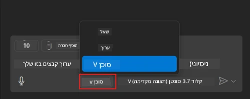
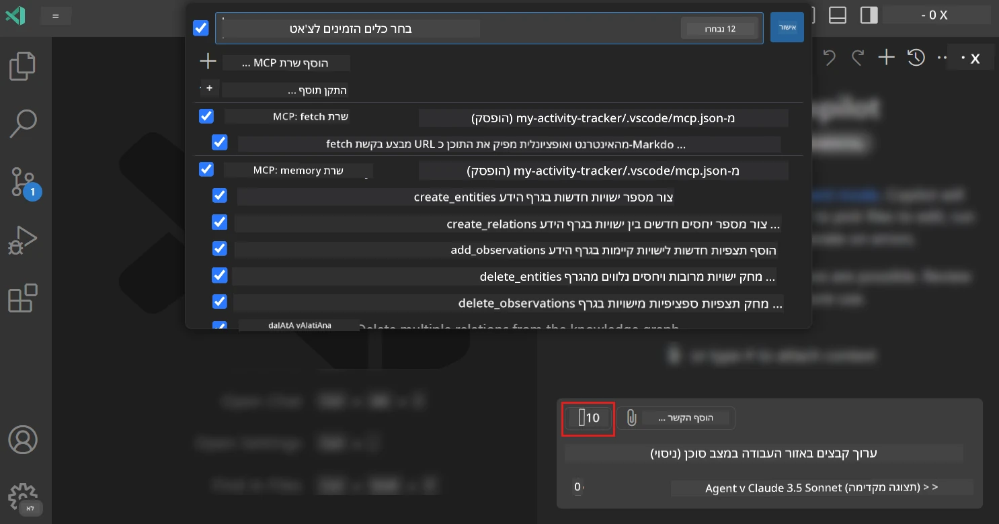
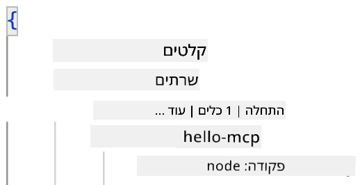
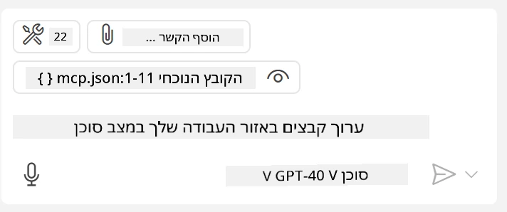
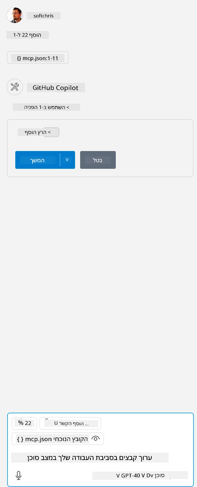

# שימוש בשרת ממצב Agent של GitHub Copilot

Visual Studio Code ו-GitHub Copilot יכולים לשמש כלקוח ולצרוך שרת MCP. למה שנרצה לעשות זאת, אתם שואלים? ובכן, זה אומר שכל הפיצ'רים שיש לשרת MCP יכולים כעת להיות בשימוש ישירות מתוך ה-IDE שלכם. דמיינו שאתם מוסיפים, למשל, את שרת ה-MCP של GitHub, מה שיאפשר לכם לשלוט ב-GitHub באמצעות פקודות בשפה טבעית במקום להקליד פקודות ספציפיות בטרמינל. או דמיינו כל דבר אחר שיכול לשפר את חוויית הפיתוח שלכם, והכול נשלט בשפה טבעית. עכשיו אתם מתחילים להבין את היתרון, נכון?

## סקירה כללית

שיעור זה מכסה כיצד להשתמש ב-Visual Studio Code ובמצב Agent של GitHub Copilot כלקוח עבור שרת MCP.

## מטרות למידה

בסיום השיעור, תוכלו:

- לצרוך שרת MCP באמצעות Visual Studio Code.
- להפעיל יכולות כמו כלים דרך GitHub Copilot.
- להגדיר את Visual Studio Code כדי למצוא ולנהל את שרת ה-MCP שלכם.

## שימוש

ניתן לשלוט בשרת ה-MCP שלכם בשתי דרכים שונות:

- ממשק משתמש: נראה כיצד עושים זאת בהמשך הפרק.
- טרמינל: ניתן לשלוט בדברים מהטרמינל באמצעות הפקודה `code`:

  כדי להוסיף שרת MCP לפרופיל המשתמש שלכם, השתמשו באפשרות שורת הפקודה --add-mcp, וספקו את תצורת השרת בפורמט JSON בצורה {\"name\":\"server-name\",\"command\":...}.

  ```
  code --add-mcp "{\"name\":\"my-server\",\"command\": \"uvx\",\"args\": [\"mcp-server-fetch\"]}"
  ```

### צילומי מסך

  
  
  

נדבר עוד על השימוש בממשק הוויזואלי בסעיפים הבאים.

## גישה

כך ניגש לנושא ברמה גבוהה:

- להגדיר קובץ שיאתר את שרת ה-MCP שלנו.
- להפעיל/להתחבר לשרת כדי שיציג את היכולות שלו.
- להשתמש ביכולות הללו דרך ממשק הצ'אט של GitHub Copilot.

מעולה, עכשיו כשאנחנו מבינים את הזרימה, בואו ננסה להשתמש בשרת MCP דרך Visual Studio Code בתרגיל.

## תרגיל: צריכת שרת

בתרגיל זה, נגדיר את Visual Studio Code כך שיאתר את שרת ה-MCP שלכם, כדי שניתן יהיה להשתמש בו דרך ממשק הצ'אט של GitHub Copilot.

### -0- שלב מקדים: הפעלת גילוי שרתי MCP

ייתכן שתצטרכו להפעיל את אפשרות גילוי שרתי MCP.

1. גשו ל-`File -> Preferences -> Settings` ב-Visual Studio Code.

1. חפשו "MCP" והפעילו את `chat.mcp.discovery.enabled` בקובץ settings.json.

### -1- יצירת קובץ תצורה

התחילו ביצירת קובץ תצורה בתיקיית הפרויקט שלכם. תצטרכו קובץ בשם MCP.json שיונח בתיקייה בשם .vscode. זה ייראה כך:

```text
.vscode
|-- mcp.json
```

כעת, בואו נראה כיצד ניתן להוסיף ערך של שרת.

### -2- הגדרת שרת

הוסיפו את התוכן הבא ל-*mcp.json*:

```json
{
    "inputs": [],
    "servers": {
       "hello-mcp": {
           "command": "node",
           "args": [
               "build/index.js"
           ]
       }
    }
}
```

הדוגמה הפשוטה למעלה מראה כיצד להפעיל שרת שנכתב ב-Node.js. עבור סביבות ריצה אחרות, ציינו את הפקודה המתאימה להפעלת השרת באמצעות `command` ו-`args`.

### -3- הפעלת השרת

כעת, לאחר שהוספתם ערך, בואו נפעיל את השרת:

1. מצאו את הערך שלכם ב-*mcp.json* וודאו שאתם רואים את סמל "הפעל":

    

1. לחצו על סמל "הפעל". אתם אמורים לראות שסמל הכלים בממשק הצ'אט של GitHub Copilot מציג מספר כלים זמין גדול יותר. אם תלחצו על סמל הכלים, תראו רשימה של כלים רשומים. ניתן לסמן/לבטל סימון של כל כלי בהתאם לשאלה אם אתם רוצים ש-GitHub Copilot ישתמש בהם כקונטקסט:

  

1. כדי להפעיל כלי, הקלידו פקודה שאתם יודעים שתתאים לתיאור של אחד הכלים שלכם, למשל פקודה כמו "add 22 to 1":

  

  אתם אמורים לראות תגובה שאומרת 23.

## משימה

נסו להוסיף ערך של שרת לקובץ *mcp.json* שלכם וודאו שאתם יכולים להפעיל/לעצור את השרת. וודאו גם שאתם יכולים לתקשר עם הכלים בשרת שלכם דרך ממשק הצ'אט של GitHub Copilot.

## פתרון

[פתרון](./solution/README.md)

## נקודות מפתח

הנקודות המרכזיות מהפרק הזה הן:

- Visual Studio Code הוא לקוח מצוין שמאפשר לצרוך מספר שרתי MCP וכלים שלהם.
- ממשק הצ'אט של GitHub Copilot הוא הדרך שבה אתם מתקשרים עם השרתים.
- ניתן לבקש מהמשתמש קלטים כמו מפתחות API שניתן להעביר לשרת MCP בעת הגדרת הערך בקובץ *mcp.json*.

## דוגמאות

- [מחשבון ב-Java](../samples/java/calculator/README.md)  
- [מחשבון ב-.Net](../../../../03-GettingStarted/samples/csharp)  
- [מחשבון ב-JavaScript](../samples/javascript/README.md)  
- [מחשבון ב-TypeScript](../samples/typescript/README.md)  
- [מחשבון ב-Python](../../../../03-GettingStarted/samples/python)  

## משאבים נוספים

- [תיעוד Visual Studio](https://code.visualstudio.com/docs/copilot/chat/mcp-servers)

## מה הלאה

- הבא: [יצירת שרת stdio](../05-stdio-server/README.md)  

---

**כתב ויתור**:  
מסמך זה תורגם באמצעות שירות תרגום מבוסס בינה מלאכותית [Co-op Translator](https://github.com/Azure/co-op-translator). למרות שאנו שואפים לדיוק, יש לקחת בחשבון שתרגומים אוטומטיים עשויים להכיל שגיאות או אי דיוקים. המסמך המקורי בשפתו המקורית צריך להיחשב כמקור סמכותי. עבור מידע קריטי, מומלץ להשתמש בתרגום מקצועי על ידי אדם. איננו נושאים באחריות לאי הבנות או לפרשנויות שגויות הנובעות משימוש בתרגום זה.