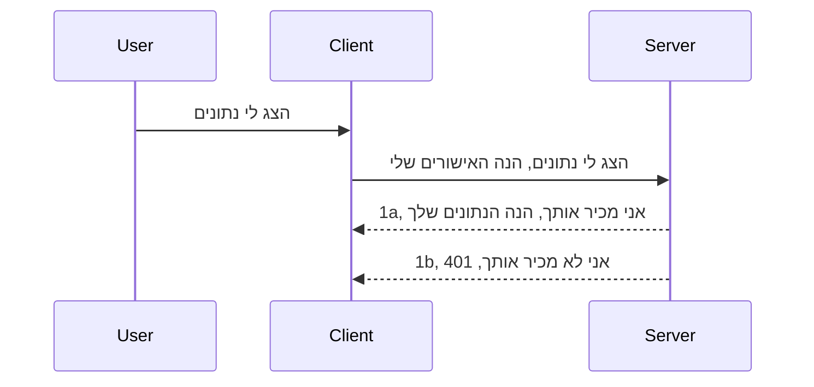

# אימות פשוט

MCP SDKs תומכות בשימוש ב-OAuth 2.1 שבאמת הוא תהליך מעמיק הכולל מושגים כמו שרת אימות, שרת משאבים, שליחת אישורים, קבלת קוד, החלפת הקוד בטוקן נושא עד שניתן בסופו של דבר לקבל את נתוני המשאב. אם אינך מורגל ב-OAuth שהוא דבר מצוין ליישום, כדאי להתחיל ברמת אימות בסיסית ולבנות לקראת אבטחה טובה וטובה יותר. לכן קיים פרק זה, כדי לבנות אותך לאימות מתקדם יותר.

## אימות, מה אנו מתכוונים?

אימות הוא קיצור של Authentication ו-Authorization. הרעיון הוא שעלינו לעשות שני דברים:

- **Authentication**, שהוא התהליך של לברר אם אנו מרשים לאדם להיכנס לבית שלנו, כלומר שיש לו את הזכות להיות "כאן" כלומר גישה לשרת המשאבים שלנו שבו מתכונות MCP Server שלנו נמצאות.
- **Authorization**, הוא התהליך של לברר אם למשתמש צריך להיות גישה למשאבים ספציפיים שהוא מבקש, למשל הזמנות אלה או מוצרים אלה או האם הוא מורשה לקרוא את התוכן אך לא למחוק, כדוגמה נוספת.

## אישורים: איך אנו אומרים למערכת מי אנחנו

ובכן, רוב מפתחי האינטרנט שם מתחילים לחשוב במונחים של מתן אישור לשרת, בדרך כלל סוד שאומר אם הם מורשים להיות כאן "Authentication". אישור זה הוא בדרך כלל גרסה מקודדת ב-base64 של שם משתמש וסיסמה או מפתח API שמזהה באופן ייחודי משתמש מסוים.

זה כרוך בשליחתו דרך כותרת שנקראת "Authorization" כך:

```json
{ "Authorization": "secret123" }
```

זה בדרך כלל מכונה אימות בסיסי. איך הזרימה הכללית פועלת אז היא כך:


עכשיו כשהבנו איך זה פועל מבחינת זרימה, איך מיישמים זאת? ובכן, רוב שרתי האינטרנט יש מושג שנקרא middleware, קטע קוד שרץ כחלק מהבקשה שיכול לאמת אישורים, ואם האישורים תקינים יכול לאפשר לבקשה לעבור. אם הבקשה לא מכילה אישורים תקינים אז אתה מקבל שגיאת אימות. בוא נראה איך זה יכול להיות מיושם:

**Python**

```python
class AuthMiddleware(BaseHTTPMiddleware):
    async def dispatch(self, request, call_next):

        has_header = request.headers.get("Authorization")
        if not has_header:
            print("-> Missing Authorization header!")
            return Response(status_code=401, content="Unauthorized")

        if not valid_token(has_header):
            print("-> Invalid token!")
            return Response(status_code=403, content="Forbidden")

        print("Valid token, proceeding...")
       
        response = await call_next(request)
        # הוסף כותרות לקוח כלשהן או שינוי בתגובה בדרך כלשהי
        return response


starlette_app.add_middleware(CustomHeaderMiddleware)
```

כאן יש לנו:

- יצרנו middleware בשם `AuthMiddleware` שבו מתודת `dispatch` שלו מופעלת על ידי שרת האינטרנט.
- הוספנו את ה-middleware לשרת האינטרנט:

    ```python
    starlette_app.add_middleware(AuthMiddleware)
    ```

- כתבנו לוגיקה של אימות שבודקת אם כותרת Authorization קיימת ואם הסוד שנשלח תקין:

    ```python
    has_header = request.headers.get("Authorization")
    if not has_header:
        print("-> Missing Authorization header!")
        return Response(status_code=401, content="Unauthorized")

    if not valid_token(has_header):
        print("-> Invalid token!")
        return Response(status_code=403, content="Forbidden")
    ```

    אם הסוד קיים ותקין אז אנו מאפשרים לבקשה לעבור על ידי קריאה ל-`call_next` ומחזירים את התגובה.

    ```python
    response = await call_next(request)
    # הוסף כל כותרות מותאמות אישית או תבצע שינוי כלשהו בתגובה
    return response
    ```

איך זה פועל הוא שאם מתבצעת בקשה לשרת ה-middleware יופעל ובהתאם למימוש שלו הוא או יאפשר לבקשה לעבור או יחזיר שגיאה שמציינת שהלקוח אינו מורשה להמשיך.

**TypeScript**

כאן אנו יוצרים middleware עם המסגרת הפופולרית Express ותופסים את הבקשה לפני שהיא מגיעה ל-MCP Server. הנה הקוד לכך:

```typescript
function isValid(secret) {
    return secret === "secret123";
}

app.use((req, res, next) => {
    // 1. האם כותרת האישור קיימת?
    if(!req.headers["Authorization"]) {
        res.status(401).send('Unauthorized');
    }
    
    let token = req.headers["Authorization"];

    // 2. בדוק תקפות.
    if(!isValid(token)) {
        res.status(403).send('Forbidden');
    }

   
    console.log('Middleware executed');
    // 3. מעביר את הבקשה לשלב הבא בצינור הבקשות.
    next();
});
```

בקוד זה אנו:

1. בודקים אם כותרת Authorization קיימת מלכתחילה, אם לא אנו שולחים שגיאה 401.
2. מוודאים שהאישור/טוקן תקין, אם לא אנו שולחים שגיאה 403.
3. לבסוף מעבירים את הבקשה דרך צינור הבקשה ומחזירים את המשאב שנדרש.

## תרגיל: יישום אימות

בואו ניקח את הידע שלנו וננסה ליישם זאת. הנה התוכנית:

שרת

- צור שרת אינטרנט ומופע MCP.
- יישם middleware עבור השרת.

לקוח

- שלח בקשת אינטרנט עם אישור דרך הכותרת.

### -1- צור שרת אינטרנט ומופע MCP

בשלב הראשון נצטרך ליצור את מופע שרת האינטרנט ושרת MCP.

**Python**

כאן אנו יוצרים מופע שרת MCP, יוצרים אפליקציית starlette ומאחסנים אותה עם uvicorn.

```python
# יצירת שרת MCP

app = FastMCP(
    name="MCP Resource Server",
    instructions="Resource Server that validates tokens via Authorization Server introspection",
    host=settings["host"],
    port=settings["port"],
    debug=True
)

# יצירת אפליקציית ווב starlette
starlette_app = app.streamable_http_app()

# הפעלת האפליקציה דרך uvicorn
async def run(starlette_app):
    import uvicorn
    config = uvicorn.Config(
            starlette_app,
            host=app.settings.host,
            port=app.settings.port,
            log_level=app.settings.log_level.lower(),
        )
    server = uvicorn.Server(config)
    await server.serve()

run(starlette_app)
```

בקוד זה אנו:

- יוצרים את שרת MCP.
- בונים את אפליקציית starlette מהשרת MCP, `app.streamable_http_app()`.
- מאחסנים ומפעילים את אפליקציית האינטרנט באמצעות uvicorn `server.serve()`.

**TypeScript**

כאן אנו יוצרים מופע שרת MCP.

```typescript
const server = new McpServer({
      name: "example-server",
      version: "1.0.0"
    });

    // ... להגדיר משאבי שרת, כלים, והנחיות ...
```

יצירת שרת MCP זה תצטרך להיעשות בתוך הגדרת הנתיב POST /mcp, אז בוא נעביר את הקוד מעלה כך:

```typescript
import express from "express";
import { randomUUID } from "node:crypto";
import { McpServer } from "@modelcontextprotocol/sdk/server/mcp.js";
import { StreamableHTTPServerTransport } from "@modelcontextprotocol/sdk/server/streamableHttp.js";
import { isInitializeRequest } from "@modelcontextprotocol/sdk/types.js"

const app = express();
app.use(express.json());

// מפה לאחסון תחבורה לפי מזהה סשן
const transports: { [sessionId: string]: StreamableHTTPServerTransport } = {};

// טיפול בבקשות POST לתקשורת מלקוח לשרת
app.post('/mcp', async (req, res) => {
  // בדיקה של קיום מזהה סשן
  const sessionId = req.headers['mcp-session-id'] as string | undefined;
  let transport: StreamableHTTPServerTransport;

  if (sessionId && transports[sessionId]) {
    // שימוש חוזר בתחבורה קיימת
    transport = transports[sessionId];
  } else if (!sessionId && isInitializeRequest(req.body)) {
    // בקשה לאתחול חדש
    transport = new StreamableHTTPServerTransport({
      sessionIdGenerator: () => randomUUID(),
      onsessioninitialized: (sessionId) => {
        // אחסון התחבורה לפי מזהה סשן
        transports[sessionId] = transport;
      },
      // הגנת DNS rebinding מנוטרלת כברירת מחדל לשמירת תאימות לאחור. אם אתם מפעילים את השרת הזה
      // מקומית, וודאו שתקבעו:
      // enableDnsRebindingProtection: true,
      // allowedHosts: ['127.0.0.1'],
    });

    // ניקוי התחבורה כאשר היא נסגרת
    transport.onclose = () => {
      if (transport.sessionId) {
        delete transports[transport.sessionId];
      }
    };
    const server = new McpServer({
      name: "example-server",
      version: "1.0.0"
    });

    // ... הקמת משאבים של השרת, כלים והנחות ...

    // התחברות לשרת MCP
    await server.connect(transport);
  } else {
    // בקשה לא חוקית
    res.status(400).json({
      jsonrpc: '2.0',
      error: {
        code: -32000,
        message: 'Bad Request: No valid session ID provided',
      },
      id: null,
    });
    return;
  }

  // טיפול בבקשה
  await transport.handleRequest(req, res, req.body);
});

// מטפל שניתן להשתמש בו עבור בקשות GET ו-DELETE
const handleSessionRequest = async (req: express.Request, res: express.Response) => {
  const sessionId = req.headers['mcp-session-id'] as string | undefined;
  if (!sessionId || !transports[sessionId]) {
    res.status(400).send('Invalid or missing session ID');
    return;
  }
  
  const transport = transports[sessionId];
  await transport.handleRequest(req, res);
};

// טיפול בבקשות GET עבור התראות משרת ללקוח באמצעות SSE
app.get('/mcp', handleSessionRequest);

// טיפול בבקשות DELETE לסיום הסשן
app.delete('/mcp', handleSessionRequest);

app.listen(3000);
```

עכשיו אתה רואה איך יצירת שרת MCP הועברה בתוך `app.post("/mcp")`.

בוא נמשיך לשלב הבא של יצירת ה-middleware כדי שנוכל לאמת את האישורים שנכנסים.

### -2- יישום middleware עבור השרת

נעבור עכשיו לחלק של ה-middleware. כאן ניצור middleware שמחפש אישור בכותרת `Authorization` ומאמת אותו. אם הוא מתקבל אז הבקשה תמשיך ותבצע את מה שצריך (למשל רשימת כלים, קריאת משאב או כל פונקציונליות MCP שהלקוח ביקש).

**Python**

כדי ליצור את ה-middleware, נצטרך ליצור מחלקה שיורשת מ-`BaseHTTPMiddleware`. יש שני חלקים מעניינים:

- הבקשה `request` , שממנה נקרא את פרטי הכותרת.
- `call_next` הקריאה החוזרת שצריך להפעיל אם ללקוח יש אישור שאנו מקבלים.

תחילה, צריך לטפל במצב בו כותרת `Authorization` חסרה:

```python
has_header = request.headers.get("Authorization")

# אין כותרת, נכשל עם 401, אחרת ממשיך.
if not has_header:
    print("-> Missing Authorization header!")
    return Response(status_code=401, content="Unauthorized")
```

כאן אנו שולחים הודעת 401 unauthorized מאחר שהלקוח נכשל באימות.

אחר כך, אם הוגש אישור, עלינו לבדוק את תקפותו כך:

```python
 if not valid_token(has_header):
    print("-> Invalid token!")
    return Response(status_code=403, content="Forbidden")
```

שים לב שאנו שולחים כאן הודעת 403 forbidden. בוא נראה את ה-middleware המלא למטה שמממש את כל הדברים שהזכרנו:

```python
class AuthMiddleware(BaseHTTPMiddleware):
    async def dispatch(self, request, call_next):

        has_header = request.headers.get("Authorization")
        if not has_header:
            print("-> Missing Authorization header!")
            return Response(status_code=401, content="Unauthorized")

        if not valid_token(has_header):
            print("-> Invalid token!")
            return Response(status_code=403, content="Forbidden")

        print("Valid token, proceeding...")
        print(f"-> Received {request.method} {request.url}")
        response = await call_next(request)
        response.headers['Custom'] = 'Example'
        return response

```

מצוין, אבל מה עם פונקציית `valid_token`? הנה היא מטה:
:

```python
# אל תשתמש בפרודקשן - שפר את זה !!
def valid_token(token: str) -> bool:
    # הסר את הקידומת "Bearer "
    if token.startswith("Bearer "):
        token = token[7:]
        return token == "secret-token"
    return False
```

כמובן שזה צריך להשתפר.

[!IMPORTANT] אסור לך לעולם לשים סודות כאלה בקוד. רצוי לקבל את הערך להשוואה ממקור נתונים או מ-IDP (ספק שירות זהות) או טוב יותר, לאפשר ל-IDP לאמת.

**TypeScript**

כדי ליישם זאת עם Express, נצטרך לקרוא למתודת `use` שלוקחת פונקציות middleware.

צריך:

- לתקשר עם משתנה הבקשה לבדוק את האישור שנשלח בתכונת `Authorization`.
- לאמת את האישורים ואם כן לאפשר לבקשה להמשיך ולהנחות את בקשת MCP של הלקוח לעשות את מה שצריך (למשל רשימת כלים, קריאת משאב או כל דבר אחר שקשור ל-MCP).

כאן, אנו בודקים אם כותרת `Authorization` קיימת ואם לא, אנו מפסיקים את הבקשה מללכת הלאה:

```typescript
if(!req.headers["authorization"]) {
    res.status(401).send('Unauthorized');
    return;
}
```

אם הכותרת לא נשלחה מלכתחילה, תקבל שגיאה 401.

אחר כך, אנו בודקים אם האישורים תקינים, אם לא אנו שוב מפסיקים את הבקשה אך עם הודעה שונה במעט:

```typescript
if(!isValid(token)) {
    res.status(403).send('Forbidden');
    return;
} 
```

שים לב שאתה מקבל עכשיו שגיאה 403.

הנה הקוד המלא:

```typescript
app.use((req, res, next) => {
    console.log('Request received:', req.method, req.url, req.headers);
    console.log('Headers:', req.headers["authorization"]);
    if(!req.headers["authorization"]) {
        res.status(401).send('Unauthorized');
        return;
    }
    
    let token = req.headers["authorization"];

    if(!isValid(token)) {
        res.status(403).send('Forbidden');
        return;
    }  

    console.log('Middleware executed');
    next();
});
```

הגדרנו את שרת האינטרנט לקבל middleware שיבדוק את האישורים שהלקוח מקווה לשלוח לנו. ומה לגבי הלקוח עצמו?

### -3- שליחת בקשת אינטרנט עם אישור דרך כותרת

אנחנו צריכים לוודא שהלקוח מעביר את האישור דרך הכותרת. מכיוון שנשתמש בלקוח MCP כדי לעשות זאת, עלינו להבין איך זה מבוצע.

**Python**

עבור הלקוח, צריך להעביר כותרת עם האישורים כך:

```python
# אל תקשיח את הערך, שמור אותו לפחות במשתנה סביבה או באחסון מאובטח יותר
token = "secret-token"

async with streamablehttp_client(
        url = f"http://localhost:{port}/mcp",
        headers = {"Authorization": f"Bearer {token}"}
    ) as (
        read_stream,
        write_stream,
        session_callback,
    ):
        async with ClientSession(
            read_stream,
            write_stream
        ) as session:
            await session.initialize()
      
            # יש לעשות, מה שרוצים לבצע בצד הלקוח, לדוגמה הצגת כלים, קריאת כלים וכו'
```

שים לב כיצד אנו ממלאים את המאפיין `headers` כך ` headers = {"Authorization": f"Bearer {token}"}`.

**TypeScript**

נוכל לפתור זאת בשני שלבים:

1. למלא אובייקט תצורה עם האישורים שלנו.
2. להעביר את אובייקט התצורה למנגנון התעבורה.

```typescript

// אל תקבע את הערך ישירות בקוד כפי שמוצג כאן. לפחות תהפוך אותו למשתנה סביבה ותשתמש במשהו כמו dotenv (במצב פיתוח).
let token = "secret123"

// הגדר אובייקט אפשרויות תחבורה ללקוח
let options: StreamableHTTPClientTransportOptions = {
  sessionId: sessionId,
  requestInit: {
    headers: {
      "Authorization": "secret123"
    }
  }
};

// העבר את אובייקט האפשרויות לתחבורה
async function main() {
   const transport = new StreamableHTTPClientTransport(
      new URL(serverUrl),
      options
   );
```

כאן אתה רואה כיצד נאלצנו ליצור אובייקט `options` ולמקם את הכותרות תחת `requestInit`.

[!IMPORTANT] איך נשתפר מזה ואילך? ובכן, היישום הנוכחי כולל כמה חסרונות. ראשית, שליחת אישורים כזו היא די מסוכנת אלא אם כן יש לך לפחות HTTPS. גם אז, האישורים יכולים להיגנב ולכן אתה צריך מערכת שבה אפשר לבטל בקלות את הטוקן ולהוסיף בדיקות נוספות כמו מאיפה בעולם הוא מגיע, האם הבקשה מתרחשת בתדירות גבוהה מדי (התנהגות של בוט), בקיצור, יש שורה ארוכה של דאגות.

עם זאת, יש לומר, עבור API פשוטים מאוד שבהם אינך רוצה שאף אחד יקרא ל-API שלך מבלי להיות מאומת ומה שיש לנו כאן הוא התחלה טובה.

עם זאת, בוא ננסה להקשות את האבטחה קצת על ידי שימוש בפורמט מוסכם כמו JSON Web Token, הידועים גם כ-JWT או "ג'ות" טוקנים.

## JSON Web Tokens, JWT

אז, אנו מנסים לשפר את הדברים במקום לשלוח אישורים פשוטים מאוד. מה הם השיפורים המיידיים שאנו מקבלים מאימוץ JWT?

- **שיפורי אבטחה**. באימות בסיסי, אתה שולח שם משתמש וסיסמה כטוקן מקודד ב-base64 (או שולח מפתח API) שוב ושוב, מה שמעלה את הסיכון. עם JWT, אתה שולח את שם המשתמש והסיסמה ומקבל טוקן בתמורה והוא גם מוגבל בזמן כלומר הוא יפוג תוקף. JWT מאפשר לך להשתמש בקלות בשליטה ברמת גישה מדויקת באמצעות תפקידים, סקופים והרשאות.
- **חוסר מדינה וסקלאביליות**. JWT מכילים את כל מידע המשתמש ומבטלים את הצורך באחסון מושב צד שרת. ניתן גם לאמת את הטוקן באופן מקומי.
- **אינטרופראביליות ופדרציה**. JWT הם מרכזיים ב-Open ID Connect ומשמשים עם ספקי זהות מוכרים כמו Entra ID, Google Identity ו-Auth0. הם גם מאפשרים שימוש בכניסה יחידה ועוד, מה שהופך אותם לדרגת ארגון.
- **מודולריות וגמישות**. JWT ניתן גם להשתמש שערי API כמו Azure API Management, NGINX ועוד. הוא גם תומך בתרחישי אימות ושירות-לשירות כולל חשבונות ייצוג והאצלת סמכויות.
- **ביצועים וקאשינג**. JWT ניתן לקאש אחרי הפענוח מה שמפחית את הצורך בניתוח חוזר. זה עוזר במיוחד באפליקציות עם תנועה גבוהה כי זה משפר את התפוקה ומפחית עומס על התשתית שבחרת.
- **תכונות מתקדמות**. תומך גם באינטראוסקפציה (בדיקת תקפות בשרת) ובביטול (הפיכת טוקן ללא תקף).

עם כל היתרונות הללו, בוא נראה איך אנו יכולים לקחת את היישום שלנו לשלב הבא.

## הפיכת אימות בסיסי ל-JWT

אז השינויים שאנו צריכים לעשות ברמת עיקרונית הם:

- **ללמוד לבנות טוקן JWT** ולעשות אותו מוכן לשליחה מלקוח לשרת.
- **לאמת טוקן JWT**, ואם כן, לאפשר ללקוח לקבל את המשאבים שלנו.
- **אחסון בטוח של הטוקן**. איך אנו מאחסנים את הטוקן הזה.
- **הגנת הנתיבים**. עלינו להגן על הנתיבים, במקרה שלנו, על הנתיבים ותכונות MCP ספציפיות.
- **הוספת טוקני רענון**. לוודא שאנו יוצרים טוקנים קצרים תוקף אך גם טוקני רענון ארוכי תוקף שיכולים לשמש להשגת טוקנים חדשים אם פגו. בנוסף לדאוג לנקודת קצה לרענון ואסטרטגיית סיבוב.

### -1- בניית טוקן JWT

קודם כל, לטוקן JWT יש את החלקים הבאים:

- **header**, האלגוריתם שבו השתמשו וסוג הטוקן.
- **payload**, טענות, כמו sub (המשתמש או הישות שהטוקן מייצג. בתרחיש אימות זה בדרך כלל userid), exp (מתי הוא פג) role (התפקיד)
- **signature**, חתום עם סוד או מפתח פרטי.

לשם כך, נצטרך לבנות את ה-header, ה-payload והטוקן המקודד.

**Python**

```python

import jwt
import jwt
from jwt.exceptions import ExpiredSignatureError, InvalidTokenError
import datetime

# מפתח סודי המשמש לחתום על JWT
secret_key = 'your-secret-key'

header = {
    "alg": "HS256",
    "typ": "JWT"
}

# מידע המשתמש, הטענות שלו וזמן התפוגה
payload = {
    "sub": "1234567890",               # נושא (מזהה משתמש)
    "name": "User Userson",                # טענה מותאמת אישית
    "admin": True,                     # טענה מותאמת אישית
    "iat": datetime.datetime.utcnow(),# תאריך ההנפקה
    "exp": datetime.datetime.utcnow() + datetime.timedelta(hours=1)  # תאריך התפוגה
}

# קידוד שלו
encoded_jwt = jwt.encode(payload, secret_key, algorithm="HS256", headers=header)
```

בקוד שלמעלה אנו:

- הגדירו header שמשתמש ב-HS256 כאלגוריתם וסוג להיות JWT.
- בנו payload שמכיל נושא או מזהה משתמש, שם משתמש, תפקיד, מתי הוא הונפק ומתי הוא צפוי לפוג תוקף ובכך מממשים את ההיבט של מגבלת הזמן שהזכרנו קודם.

**TypeScript**

כאן נצטרך כמה תלותים שיעזרו לנו לבנות את טוקן ה-JWT.

תלותים

```sh

npm install jsonwebtoken
npm install --save-dev @types/jsonwebtoken
```

כעת כשיש לנו את זה, בואו ניצור את ה-header, ה-payload ובאמצעות זה ניצור את הטוקן המקודד.

```typescript
import jwt from 'jsonwebtoken';

const secretKey = 'your-secret-key'; // השתמש במשתני סביבה בייצור

// הגדר את המטען
const payload = {
  sub: '1234567890',
  name: 'User usersson',
  admin: true,
  iat: Math.floor(Date.now() / 1000), // נוצר ב
  exp: Math.floor(Date.now() / 1000) + 60 * 60 // פג תוקף תוך שעה
};

// הגדר את הכותרת (אופציונלי, jsonwebtoken מגדיר ערכי בררת מחדל)
const header = {
  alg: 'HS256',
  typ: 'JWT'
};

// צור את הטוקן
const token = jwt.sign(payload, secretKey, {
  algorithm: 'HS256',
  header: header
});

console.log('JWT:', token);
```

טוקן זה:

חותם באמצעות HS256
תקף לשעה אחת
כולל טענות כמו sub, name, admin, iat ו-exp.

### -2- אימות טוקן

גם נצטרך לאמת טוקן, זה משהו שצריך לעשות בשרת כדי לוודא שמה שהלקוח שולח לנו הוא אכן תקין. יש הרבה בדיקות שצריך לעשות כאן מווידוא המבנה שלו ועד לתקפותו. מומלץ גם להוסיף בדיקות נוספות כדי לראות אם המשתמש קיים במערכת שלך ועוד.

כדי לאמת טוקן, עלינו לפענח אותו כדי שנוכל לקרוא אותו ואז להתחיל לבדוק את תקפותו:

**Python**

```python

# לפענח ולאמת את ה-JWT
try:
    decoded = jwt.decode(token, secret_key, algorithms=["HS256"])
    print("✅ Token is valid.")
    print("Decoded claims:")
    for key, value in decoded.items():
        print(f"  {key}: {value}")
except ExpiredSignatureError:
    print("❌ Token has expired.")
except InvalidTokenError as e:
    print(f"❌ Invalid token: {e}")

```

בקוד זה אנו קוראים ל-`jwt.decode` עם הטוקן, המפתח הסודי והאלגוריתם שנבחר כקלט. שים לב שאנו משתמשים במבנה try-catch כי אימות שנכשל מוביל לזריקת שגיאה.

**TypeScript**

כאן נצטרך לקרוא ל-`jwt.verify` כדי לקבל גרסה מפוענחת של הטוקן שנוכל לנתח הלאה. אם הקריאה הזו נכשלת, זה אומר שמבנה הטוקן אינו תקין או שהוא לא תקין עוד.

```typescript

try {
  const decoded = jwt.verify(token, secretKey);
  console.log('Decoded Payload:', decoded);
} catch (err) {
  console.error('Token verification failed:', err);
}
```

[!NOTE] כפי שהוזכר קודם, מומלץ לבצע בדיקות נוספות כדי לוודא שהטוקן מצביע על משתמש במערכת שלך ולוודא שלמשתמש יש את הזכויות שהוא טוען שיש לו.
הבא, נבחן בקרת גישה מבוססת תפקידים, הידועה גם כ-RBAC.

## הוספת בקרת גישה מבוססת תפקידים

הרעיון הוא שאנו רוצים לבטא שתפקידים שונים מקבלים הרשאות שונות. לדוגמה, אנו מניחים שמנהל יכול לעשות הכל, שמשתמשים רגילים יכולים לקרוא ולכתוב, ואורחים יכולים רק לקרוא. לכן, הנה כמה רמות הרשאה אפשריות:

- Admin.Write  
- User.Read  
- Guest.Read  

בואו נסתכל כיצד ניתן לממש בקרת גישה כזו באמצעות middleware. ניתן להוסיף middleware על כל מסלול בנפרד וגם על כל המסלולים.

**Python**

```python
from starlette.middleware.base import BaseHTTPMiddleware
from starlette.responses import JSONResponse
import jwt

# אל תשמור את הסוד בקוד כמו זה, זה למטרות הדגמה בלבד. קרא אותו ממקום בטוח.
SECRET_KEY = "your-secret-key" # שמור את זה במשתנה סביבה
REQUIRED_PERMISSION = "User.Read"

class JWTPermissionMiddleware(BaseHTTPMiddleware):
    async def dispatch(self, request, call_next):
        auth_header = request.headers.get("Authorization")
        if not auth_header or not auth_header.startswith("Bearer "):
            return JSONResponse({"error": "Missing or invalid Authorization header"}, status_code=401)

        token = auth_header.split(" ")[1]
        try:
            decoded = jwt.decode(token, SECRET_KEY, algorithms=["HS256"])
        except jwt.ExpiredSignatureError:
            return JSONResponse({"error": "Token expired"}, status_code=401)
        except jwt.InvalidTokenError:
            return JSONResponse({"error": "Invalid token"}, status_code=401)

        permissions = decoded.get("permissions", [])
        if REQUIRED_PERMISSION not in permissions:
            return JSONResponse({"error": "Permission denied"}, status_code=403)

        request.state.user = decoded
        return await call_next(request)


```
  
יש כמה דרכים שונות להוסיף את ה-middleware כמו למטה:

```python

# אפשרות 1: הוסף תוכן ביניים בעת בניית אפליקציית starlette
middleware = [
    Middleware(JWTPermissionMiddleware)
]

app = Starlette(routes=routes, middleware=middleware)

# אפשרות 2: הוסף תוכן ביניים לאחר שאפליקציית starlette כבר נבנתה
starlette_app.add_middleware(JWTPermissionMiddleware)

# אפשרות 3: הוסף תוכן ביניים לכל נתיב
routes = [
    Route(
        "/mcp",
        endpoint=..., # מטפל
        middleware=[Middleware(JWTPermissionMiddleware)]
    )
]
```
  
**TypeScript**

אפשר להשתמש ב-`app.use` וב-middleware שירוץ על כל הבקשות.

```typescript
app.use((req, res, next) => {
    console.log('Request received:', req.method, req.url, req.headers);
    console.log('Headers:', req.headers["authorization"]);

    // 1. בדוק אם נשלח כותרת הרשאה

    if(!req.headers["authorization"]) {
        res.status(401).send('Unauthorized');
        return;
    }
    
    let token = req.headers["authorization"];

    // 2. בדוק אם הטוקן תקף
    if(!isValid(token)) {
        res.status(403).send('Forbidden');
        return;
    }  

    // 3. בדוק אם משתמש הטוקן קיים במערכת שלנו
    if(!isExistingUser(token)) {
        res.status(403).send('Forbidden');
        console.log("User does not exist");
        return;
    }
    console.log("User exists");

    // 4. אמת שהטוקן מכיל את ההרשאות הנכונות
    if(!hasScopes(token, ["User.Read"])){
        res.status(403).send('Forbidden - insufficient scopes');
    }

    console.log("User has required scopes");

    console.log('Middleware executed');
    next();
});

```
  
יש כמה דברים שנוכל לאפשר ל-middleware שלנו לעשות ושה-middleware שלנו צריך לעשות, כלומר:

1. לבדוק אם כותרת Authorization קיימת  
2. לבדוק אם הטוקן תקין, אנחנו קוראים ל-`isValid` שהיא פונקציה שכתבנו שבודקת שלמות ותוקף של JWT  
3. לאמת שהמשתמש קיים במערכת שלנו, עלינו לבדוק זאת

   ```typescript
    // משתמשים במסד הנתונים
   const users = [
     "user1",
     "User usersson",
   ]

   function isExistingUser(token) {
     let decodedToken = verifyToken(token);

     // יש לעשות, לבדוק אם המשתמש קיים במסד הנתונים
     return users.includes(decodedToken?.name || "");
   }
   ```
  
מעל יצרנו רשימה מאוד פשוטה של `users`, שצריכה להיות כמובן במסד נתונים.

4. בנוסף, עלינו לבדוק שהטוקן מכיל את ההרשאות הנכונות.

   ```typescript
   if(!hasScopes(token, ["User.Read"])){
        res.status(403).send('Forbidden - insufficient scopes');
   }
   ```
  
בקוד שלמעלה מה-middleware, אנו בודקים שהטוקן מכיל את ההרשאה User.Read, אם לא אנחנו מחזירים שגיאת 403. להלן פונקציית העזר `hasScopes`.

   ```typescript
   function hasScopes(scope: string, requiredScopes: string[]) {
     let decodedToken = verifyToken(scope);
    return requiredScopes.every(scope => decodedToken?.scopes.includes(scope));
  }  
   ```

Have a think which additional checks you should be doing, but these are the absolute minimum of checks you should be doing.

Using Express as a web framework is a common choice. There are helpers library when you use JWT so you can write less code.

- `express-jwt`, helper library that provides a middleware that helps decode your token.
- `express-jwt-permissions`, this provides a middleware `guard` that helps check if a certain permission is on the token.

Here's what these libraries can look like when used:

```typescript
const express = require('express');
const jwt = require('express-jwt');
const guard = require('express-jwt-permissions')();

const app = express();
const secretKey = 'your-secret-key'; // put this in env variable

// Decode JWT and attach to req.user
app.use(jwt({ secret: secretKey, algorithms: ['HS256'] }));

// Check for User.Read permission
app.use(guard.check('User.Read'));

// multiple permissions
// app.use(guard.check(['User.Read', 'Admin.Access']));

app.get('/protected', (req, res) => {
  res.json({ message: `Welcome ${req.user.name}` });
});

// Error handler
app.use((err, req, res, next) => {
  if (err.code === 'permission_denied') {
    return res.status(403).send('Forbidden');
  }
  next(err);
});

```
  
כעת ראיתם כיצד ניתן להשתמש ב-middleware גם לאימות וגם להרשאה, אך מה עם MCP, האם זה משנה את אופן האימות? בואו נבדוק בפרק הבא.

### -3- הוספת RBAC ל-MCP

עד כה ראיתם כיצד להוסיף RBAC באמצעות middleware, אולם עבור MCP אין דרך פשוטה להוסיף RBAC לפריט פונקציונלי ספציפי ב-MCP, אז מה עושים? ובכן, פשוט נוסיף קוד כזה שבודק במקרה הזה אם ללקוח יש זכויות לקרוא לכלי מסוים:

יש לכם כמה אפשרויות שונות כיצד להשיג RBAC לפי פריט, הנה כמה:

- הוספת בדיקה עבור כל כלי, משאב או פקודה שבהם נדרש לבדוק רמת הרשאה.

   **python**

   ```python
   @tool()
   def delete_product(id: int):
      try:
          check_permissions(role="Admin.Write", request)
      catch:
        pass # הלקוח נכשל באישור, העלה שגיאת הרשאה
   ```
  
   **typescript**

   ```typescript
   server.registerTool(
    "delete-product",
    {
      title: Delete a product",
      description: "Deletes a product",
      inputSchema: { id: z.number() }
    },
    async ({ id }) => {
      
      try {
        checkPermissions("Admin.Write", request);
        // לעשות, לשלוח מזהה ל-productService ולכניסה מרחוק
      } catch(Exception e) {
        console.log("Authorization error, you're not allowed");  
      }

      return {
        content: [{ type: "text", text: `Deletected product with id ${id}` }]
      };
    }
   );
   ```


- שימוש בגישת שרת מתקדמת וב-handler של הבקשות כדי למזער את מספר המקומות שבהם נדרש לבצע את הבדיקה.

   **Python**

   ```python
   
   tool_permission = {
      "create_product": ["User.Write", "Admin.Write"],
      "delete_product": ["Admin.Write"]
   }

   def has_permission(user_permissions, required_permissions) -> bool:
      # user_permissions: רשימת ההרשאות שיש למשתמש
      # required_permissions: רשימת ההרשאות הנדרשות לכלי
      return any(perm in user_permissions for perm in required_permissions)

   @server.call_tool()
   async def handle_call_tool(
     name: str, arguments: dict[str, str] | None
   ) -> list[types.TextContent]:
    # הנח ש-request.user.permissions היא רשימת ההרשאות של המשתמש
     user_permissions = request.user.permissions
     required_permissions = tool_permission.get(name, [])
     if not has_permission(user_permissions, required_permissions):
        # העלה שגיאה "אין לך הרשאה לקרוא לכלי {name}"
        raise Exception(f"You don't have permission to call tool {name}")
     # להמשיך ולהפעיל את הכלי
     # ...
   ```   
    

   **TypeScript**

   ```typescript
   function hasPermission(userPermissions: string[], requiredPermissions: string[]): boolean {
       if (!Array.isArray(userPermissions) || !Array.isArray(requiredPermissions)) return false;
       // להחזיר נכון אם למשתמש יש לפחות רשות אחת נדרשת
       
       return requiredPermissions.some(perm => userPermissions.includes(perm));
   }
  
   server.setRequestHandler(CallToolRequestSchema, async (request) => {
      const { params: { name } } = request;
  
      let permissions = request.user.permissions;
  
      if (!hasPermission(permissions, toolPermissions[name])) {
         return new Error(`You don't have permission to call ${name}`);
      }
  
      // להמשיך..
   });
   ```
  
   שימו לב, תצטרכו לוודא שה-middleware שלכם מקצה טוקן מפוענח לשדה user שבבקשה כדי שהקוד למעלה יהיה פשוט.

### סיכום

כעת, לאחר שדיברנו כיצד להוסיף תמיכה ב-RBAC בכלל ועבור MCP בפרט, הגיע הזמן לנסות ליישם אבטחה בעצמכם כדי לוודא שהבנתם את המושגים שהוצגו לכם.

## משימה 1: לבנות שרת MCP ולקוח MCP עם אימות בסיסי

כאן תוכלו לקחת את מה שלמדתם לגבי שליחת אישורי גישה באמצעות כותרות.

## פתרון 1

[Solution 1](./code/basic/README.md)

## משימה 2: לשדרג את הפתרון ממשימה 1 לשימוש ב-JWT

קחו את הפתרון הראשון, אך הפעם, נשפר אותו.  

במקום להשתמש ב-Basic Auth, נשתמש ב-JWT.

## פתרון 2

[Solution 2](./solution/jwt-solution/README.md)

## אתגר

הוספת RBAC לפי כלי כפי שתואר בסעיף "הוספת RBAC ל-MCP".

## סיכום

מקווים שלמדתם הרבה בפרק זה, מאין אבטחה בכלל, דרך אבטחה בסיסית, ועד JWT ואיך ניתן להוסיף זאת ל-MCP.

בנינו בסיס איתן עם JWT מותאם אישית, אך ככל שאנו מתקדמים, אנו עוברים למודל זהות מבוסס סטנדרטים. אימוץ ספק זהות (IdP) כמו Entra או Keycloak מאפשר לנו להעביר את הניהול של הנפקת הטוקנים, אימותם וניהול מחזור החיים שלהם לפלטפורמה אמינה — וכך למקד את עצמנו בלוגיקת האפליקציה ובחוויית המשתמש.

לשם כך, יש לנו פרק [מתקדם יותר על Entra](../../05-AdvancedTopics/mcp-security-entra/README.md)

## מה הלאה

- הבא: [הגדרת מארחי MCP](../12-mcp-hosts/README.md)

---

<!-- CO-OP TRANSLATOR DISCLAIMER START -->
**כתב ויתור**:  
מסמך זה תורגם באמצעות שירות תרגום מבוסס בינה מלאכותית [Co-op Translator](https://github.com/Azure/co-op-translator). למרות שאנו שואפים לדיוק, יש לשים לב כי תרגומים ממוחשבים עלולים להכיל טעויות או אי-דיוקים. המסמך המקורי בשפת המקור יהווה את המקור הסמכותי. למידע קריטי מומלץ להשתמש בתרגום מקצועי בידי אדם. אנו לא נושאים באחריות לכל אי-הבנה או פרשנות שגויה הנובעים משימוש בתרגום זה.
<!-- CO-OP TRANSLATOR DISCLAIMER END -->