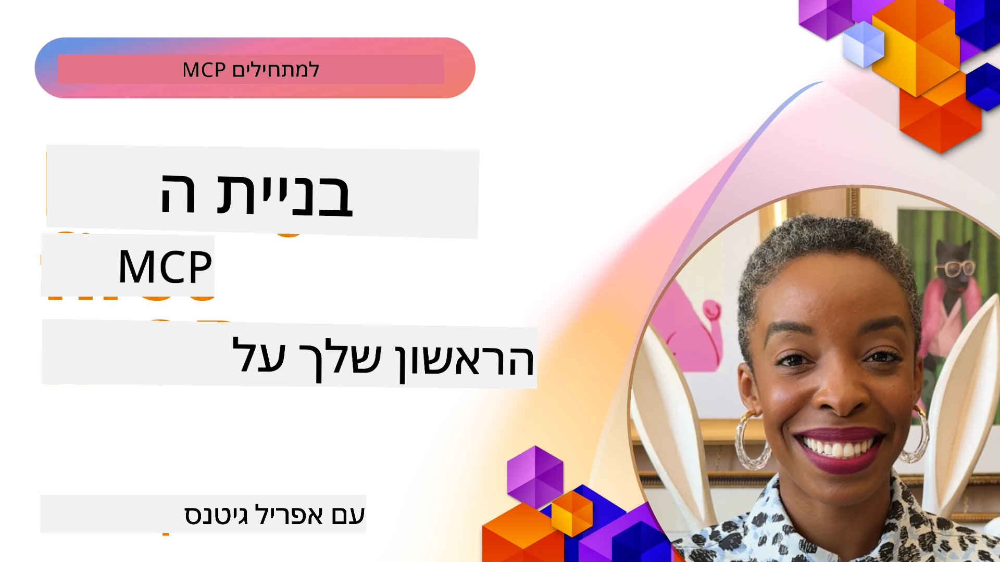

## התחלה

_(לחץ על התמונה למעלה לצפייה בווידאו של השיעור הזה)_

קבוצה זו מורכבת ממספר שיעורים:

- **1 השרת הראשון שלך**, בשיעור הראשון הזה תלמד כיצד ליצור את השרת הראשון שלך ולבדוק אותו עם כלי הבוחן (inspector), דרך חשובה לבדוק ולפתור תקלות בשרת שלך, [לשיעור](01-first-server/README.md)

- **2 לקוח**, בשיעור זה תלמד כיצד לכתוב לקוח שיכול להתחבר לשרת שלך, [לשיעור](02-client/README.md)

- **3 לקוח עם LLM**, דרך אפילו טובה יותר לכתוב לקוח היא על ידי הוספת LLM אליו כך שיוכל "לנהל משא ומתן" עם השרת שלך על מה לעשות, [לשיעור](03-llm-client/README.md)

- **4 צריכת מצב סוכן GitHub Copilot ב-Visual Studio Code**. כאן אנו מסתכלים על הפעלת שרת MCP שלנו מתוך Visual Studio Code, [לשיעור](04-vscode/README.md)

- **5 שרת תחבורה stdio** - תחבורה stdio היא התקן המומלץ לתקשורת מקומית בין שרת MCP ללקוח, המספקת תקשורת בטוחה מבוססת תהליכים עם בידוד תהליכים מובנה [לשיעור](05-stdio-server/README.md)

- **6 סטרימינג HTTP עם MCP (HTTP סטרימבילי)**. למד על תחבורת סטרימינג HTTP מודרנית (הגישה המומלצת לשרתי MCP מרוחקים לפי [מפרט MCP 2025-11-25](https://spec.modelcontextprotocol.io/specification/2025-11-25/basic/transports/#streamable-http)), הודעות התקדמות, ואיך לממש שרתי ולקוחות MCP בזמן אמת בקנה מידה תוך שימוש ב-HTTP סטרימבילי. [לשיעור](06-http-streaming/README.md)

- **7 שימוש בערכת כלים AI עבור VSCode** לצריכה ובדיקת לקוחות ושרתי MCP שלך [לשיעור](07-aitk/README.md)

- **8 בדיקות**. כאן נתמקד במיוחד איך ניתן לבדוק את השרת והלקוח שלנו בדרכים שונות, [לשיעור](08-testing/README.md)

- **9 פריסה**. פרק זה יבחן דרכים שונות לפרוס את פתרונות MCP שלך, [לשיעור](09-deployment/README.md)

- **10 שימוש מתקדם בשרת**. פרק זה מכסה שימוש מתקדם בשרת, [לשיעור](./10-advanced/README.md)

- **11 אימות**. פרק זה עוסק כיצד להוסיף אימות פשוט, מאימות בסיסי ועד שימוש ב-JWT ו-RBAC. מומלץ להתחיל כאן ואז להמשיך לנושאים מתקדמים בפרק 5 ולבצע חיזוק אבטחה נוסף לפי המלצות בפרק 2, [לשיעור](./11-simple-auth/README.md)

- **12 מארחי MCP**. קבע והשתמש בלקוחות מארח פופולריים של MCP כולל Claude Desktop, Cursor, Cline, ו-Windsurf. למד סוגי תחבורה ופתרון תקלות, [לשיעור](./12-mcp-hosts/README.md)

- **13 בוחן MCP**. נתח ותבדוק את שרתי MCP שלך אינטראקטיבית באמצעות כלי MCP Inspector. למד לטפל בכלים, משאבים, והודעות פרוטוקול, [לשיעור](./13-mcp-inspector/README.md)

פרוטוקול הקשר של המודל (MCP) הוא פרוטוקול פתוח המנרמל כיצד יישומים מספקים הקשר ל-LLM. תחשוב על MCP כמו על פורט USB-C ליישומי AI – הוא מספק דרך סטנדרטית לחבר מודלי AI למקורות נתונים וכלים שונים.

## מטרות לימוד

בסיום שיעור זה, תוכל:

- להקים סביבות פיתוח עבור MCP ב-C#, Java, Python, TypeScript ו-JavaScript
- לבנות ולפרוס שרתי MCP בסיסיים עם תכונות מותאמות (משאבים, פרומפטים, כלים)
- ליצור יישומי מארח שמתחברים לשרתי MCP
- לבדוק ולפתור תקלות במימושי MCP
- להבין אתגרים נפוצים בהגדרה ואת הפתרונות להם
- לחבר את מימושי MCP שלך לשירותים פופולריים של LLM

## הקמת סביבת MCP שלך

לפני שתתחיל לעבוד עם MCP, חשוב להכין את סביבת הפיתוח שלך ולהבין את זרימת העבודה הבסיסית. קטע זה ינחה אותך בשלבי ההגדרה הראשוניים כדי להבטיח התחלה חלקה עם MCP.

### דרישות מוקדמות

לפני שתצלול לפיתוח MCP, ודא שיש לך:

- **סביבת פיתוח**: עבור השפה שבחרת (C#, Java, Python, TypeScript או JavaScript)
- **IDE/עורך**: Visual Studio, Visual Studio Code, IntelliJ, Eclipse, PyCharm, או כל עורך קוד מודרני אחר
- **מנהל חבילות**: NuGet, Maven/Gradle, pip, או npm/yarn
- **מפתחות API**: עבור כל שירותי AI שתכנן להשתמש ביישומי המארח שלך

### ערכות SDK רשמיות

בפרקים הבאים תראה פתרונות שנבנו באמצעות Python, TypeScript, Java ו-.NET. להלן כל ערכות ה-SDK הנתמכות רשמית.

MCP מספק SDK רשמי למספר שפות (תואם ל-[מפרט MCP 2025-11-25](https://spec.modelcontextprotocol.io/specification/2025-11-25/)):
- [C# SDK](https://github.com/modelcontextprotocol/csharp-sdk) - מנוהל בשיתוף עם מייקרוסופט
- [Java SDK](https://github.com/modelcontextprotocol/java-sdk) - מנוהל בשיתוף עם Spring AI
- [TypeScript SDK](https://github.com/modelcontextprotocol/typescript-sdk) - מימוש רשמי ב-TypeScript
- [Python SDK](https://github.com/modelcontextprotocol/python-sdk) - המימוש הרשמי ב-Python (FastMCP)
- [Kotlin SDK](https://github.com/modelcontextprotocol/kotlin-sdk) - המימוש הרשמי ב-Kotlin
- [Swift SDK](https://github.com/modelcontextprotocol/swift-sdk) - מנוהל בשיתוף עם Loopwork AI
- [Rust SDK](https://github.com/modelcontextprotocol/rust-sdk) - המימוש הרשמי ב-Rust
- [Go SDK](https://github.com/modelcontextprotocol/go-sdk) - המימוש הרשמי ב-Go

## נקודות עיקריות להבנה

- הקמת סביבת פיתוח ל-MCP פשוטה עם SDK ספציפי לשפה
- בניית שרתי MCP מערבת יצירת כלי עבודה עם סכמות ברורות והרשמה שלהם
- לקוחות MCP מתחברים לשרתי ולמודלים כדי למנף יכולות מורחבות
- בדיקות ופתרון תקלות חיוניים למימושי MCP אמינים
- אפשרויות פריסה מגוונות מפתוח מקומי לפתרונות מבוססי ענן

## תרגול

יש לנו מערך דוגמאות שמשלים את התרגילים שתראה בכל הפרקים בקבוצה זו. בנוסף, לכל פרק יש תרגילים ומשימות משלו

- [מחשבון ב-Java](./samples/java/calculator/README.md)
- [מחשבון ב-.Net](../../../03-GettingStarted/samples/csharp)
- [מחשבון ב-JavaScript](./samples/javascript/README.md)
- [מחשבון ב-TypeScript](./samples/typescript/README.md)
- [מחשבון ב-Python](../../../03-GettingStarted/samples/python)

## משאבים נוספים

- [בניית סוכנים באמצעות פרוטוקול הקשר של מודל ב-Azure](https://learn.microsoft.com/azure/developer/ai/intro-agents-mcp)
- [MCP מרוחק עם Azure Container Apps (Node.js/TypeScript/JavaScript)](https://learn.microsoft.com/samples/azure-samples/mcp-container-ts/mcp-container-ts/)
- [סוכן MCP של OpenAI ב-.NET](https://learn.microsoft.com/samples/azure-samples/openai-mcp-agent-dotnet/openai-mcp-agent-dotnet/)

## מה הלאה

התחל עם השיעור הראשון: [יצירת שרת MCP ראשון שלך](01-first-server/README.md)

לאחר שסיימת מודול זה, המשך ל: [מודול 4: יישום מעשי](../04-PracticalImplementation/README.md)

---

<!-- CO-OP TRANSLATOR DISCLAIMER START -->
**כתב שחרור מאחריות**:  
מסמך זה תורגם באמצעות שירות תרגום מבוסס בינה מלאכותית [Co-op Translator](https://github.com/Azure/co-op-translator). למרות שאנו שואפים לדיוק, יש לקחת בחשבון שתרגומים אוטומטיים עלולים להכיל שגיאות או אי-דיוקים. יש להיעזר במסמך המקורי בשפת המקור כמקור מוסמך. למידע קריטי מומלץ להשתמש בתרגום מקצועי שנעשה על ידי מתרגם אנושי. אנו לא נושאים באחריות לכל אי-הבנה או פרשנות שגויה הנובעת משימוש בתרגום זה.
<!-- CO-OP TRANSLATOR DISCLAIMER END -->