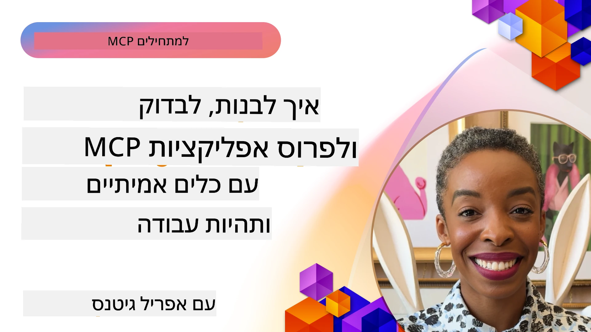

# יישום מעשי

[](https://youtu.be/vCN9-mKBDfQ)

_(לחץ על התמונה למעלה כדי לצפות בסרטון של השיעור)_

יישום מעשי הוא המקום שבו כוחו של פרוטוקול הקשר של המודל (MCP) נעשה מוחשי. בעוד שהבנת התיאוריה והארכיטקטורה מאחורי MCP חשובה, הערך האמיתי מתגלה כאשר אתה מיישם את המושגים האלה כדי לבנות, לבדוק ולפרוס פתרונות שמפתרים בעיות מהעולם האמיתי. פרק זה מחבר את הפער בין הידע הקונספטואלי לבין הפיתוח המעשי, ומנחה אותך בתהליך הבאת היישומים המבוססים על MCP לחיים.

בין אם אתה מפתח עוזרים אינטליגנטיים, משלב AI בתהליכי עבודה עסקיים, או בונה כלים מותאמים אישית לעיבוד נתונים, MCP מספק בסיס גמיש. עיצובו שאינו תלוי בשפה ו-SDKs הרשמיים לשפות תכנות פופולריות מאפשרים גישה למגוון רחב של מפתחים. באמצעות ניצול ה-SDKs האלה, תוכל ליצור אבטיפוס במהירות, לחזור על פיתוח ולהרחיב את הפתרונות שלך במגוון פלטפורמות וסביבות.

בפרקים הבאים, תמצא דוגמאות מעשיות, קוד לדוגמה, ואסטרטגיות פריסה הממחישות כיצד ליישם את MCP ב-C#, Java עם Spring, TypeScript, JavaScript ו-Python. תלמד גם כיצד לנפות ולבדוק את שרתי MCP שלך, לנהל APIים, ולפרוס פתרונות לענן באמצעות Azure. המשאבים המעשים האלה מיועדים להאיץ את הלמידה שלך ולעזור לך לבנות בביטחון אפליקציות MCP יציבות ומוכנות לפרודקשן.

## סקירה כללית

שיעור זה מתמקד בהיבטים מעשיים של יישום MCP במגוון שפות תכנות. נבחן כיצד להשתמש ב-SDKs של MCP ב-C#, Java עם Spring, TypeScript, JavaScript ו-Python כדי לבנות אפליקציות יציבות, לנפות ולבדוק שרתי MCP, וליצור משאבים, תבניות, וכלים לשימוש חוזר.

## יעדי למידה

בסוף שיעור זה תוכל:

- ליישם פתרונות MCP באמצעות SDKs רשמיים בשפות תכנות שונות
- לנפות ולבדוק שרתי MCP באופן שיטתי
- ליצור ולהשתמש בתכונות של שרת (משאבים, תבניות, וכלים)
- לעצב זרימות עבודה יעילות ב-MCP למשימות מורכבות
- לייעל יישומי MCP לביצועים ואמינות

## משאבים ל-SDK רשמי

פרוטוקול הקשר של המודל מציע SDKs רשמיים למספר שפות (תואם ל-[מפרט MCP 2025-11-25](https://spec.modelcontextprotocol.io/specification/2025-11-25/)):

- [C# SDK](https://github.com/modelcontextprotocol/csharp-sdk)
- [Java עם Spring SDK](https://github.com/modelcontextprotocol/java-sdk) **הערה:** דורש תלות ב-[Project Reactor](https://projectreactor.io). (ראה [דיון בנושא 246](https://github.com/orgs/modelcontextprotocol/discussions/246).)
- [TypeScript SDK](https://github.com/modelcontextprotocol/typescript-sdk)
- [Python SDK](https://github.com/modelcontextprotocol/python-sdk)
- [Kotlin SDK](https://github.com/modelcontextprotocol/kotlin-sdk)
- [Go SDK](https://github.com/modelcontextprotocol/go-sdk)

## עבודה עם SDKs של MCP

חלק זה מספק דוגמאות מעשיות ליישום MCP במגוון שפות תכנות. תוכל למצוא קוד לדוגמה בתיקיית `samples` המסודרת לפי שפה.

### דוגמאות זמינות

מאגר הקוד כולל [יישומים לדוגמה](../../../04-PracticalImplementation/samples) בשפות הבאות:

- [C#](./samples/csharp/README.md)
- [Java עם Spring](./samples/java/containerapp/README.md)
- [TypeScript](./samples/typescript/README.md)
- [JavaScript](./samples/javascript/README.md)
- [Python](./samples/python/README.md)

כל דוגמה ממחישה מושגי MCP מרכזיים ודפוסי יישום לאותה שפה ולסביבה הספציפית.

### מדריכים מעשיים

מדריכים נוספים ליישום MCP מעשי:

- [דפדוף ותוצאות גדולות](./pagination/README.md) - טיפול בדפדוף מבוסס מצביע לכלים, משאבים, ומאגרי נתונים גדולים

## תכונות מרכזיות של השרת

שרתי MCP יכולים ליישם כל שילוב של התכונות האלה:

### משאבים

משאבים מספקים הקשר ונתונים לשימוש המשתמש או מודל ה-AI:

- מאגרי מסמכים
- בסיסי ידע
- מקורות נתונים מובנים
- מערכות קבצים

### תבניות

תבניות הן הודעות וזרימות עבודה בתבנית עבור המשתמשים:

- תבניות שיחה מוגדרות מראש
- דפוסי אינטראקציה מונחים
- מבני דיאלוג מיוחדים

### כלים

כלים הם פונקציות שהמודל AI מבצע:

- כלי עיבוד נתונים
- אינטגרציה עם API חיצוני
- יכולות חישוביות
- פונקציונליות חיפוש

## דוגמות יישום: יישום ב-C#

מאגר ה-SDK הרשמי של C# מכיל מספר יישומי דוגמה הממחישים אספקטים שונים של MCP:

- **לקוח MCP בסיסי**: דוגמה פשוטה שמראה כיצד ליצור לקוח MCP ולהפעיל כלים
- **שרת MCP בסיסי**: יישום שרת מינימלי עם רישום כלים בסיסי
- **שרת MCP מתקדם**: שרת מלא בתכונות עם רישום כלים, אימות, וניהול שגיאות
- **אינטגרציה עם ASP.NET**: דוגמאות המדגימות אינטגרציה עם ASP.NET Core
- **דפוסי יישום כלים**: דפוסים שונים ליישום כלים עם רמות מורכבות שונות

 ה-SDK של MCP ב-C# נמצא בבטא וה-APIים עלולים להשתנות. נעודכן בלוג זה באופן רציף עם התפתחות ה-SDK.

### תכונות מפתח

- [C# MCP Nuget ModelContextProtocol](https://www.nuget.org/packages/ModelContextProtocol)
- בניית [שרת MCP ראשון שלך](https://devblogs.microsoft.com/dotnet/build-a-model-context-protocol-mcp-server-in-csharp/).

לקבלת דוגמאות יישום מלאות ב-C#, בקר במאגר הדוגמאות הרשמי של ה-SDK ב-C# [כאן](https://github.com/modelcontextprotocol/csharp-sdk)

## דוגמת יישום: יישום Java עם Spring

ה-SDK של Java עם Spring מציע אפשרויות יישום MCP מלאות עם תכונות ברמת ארגון.

### תכונות מפתח

- אינטגרציה עם פלטפורמת Spring
- בטיחות טיפוס חזקה
- תמיכה בתכנות ריאקטיבי
- ניהול מלא של שגיאות

לדוגמת יישום מלאה עבור Java עם Spring, ראה [דוגמת Java עם Spring](samples/java/containerapp/README.md) בתיקיית הדוגמאות.

## דוגמת יישום: יישום JavaScript

ה-SDK של JavaScript מספק גישה קלה וגמישה ליישום MCP.

### תכונות מפתח

- תמיכה ב-Node.js ודפדפן
- API מבוסס Promise
- אינטגרציה פשוטה עם Express ו-frameworks נוספים
- תמיכה ב-WebSocket לזרימה

לדוגמת יישום מלאה ב-JavaScript, ראה [דוגמת JavaScript](samples/javascript/README.md) בתיקיית הדוגמאות.

## דוגמת יישום: יישום Python

ה-SDK של Python מציע גישה פייתונית ליישום MCP עם אינטגרציות מצוינות למסגרות למידת מכונה.

### תכונות מפתח

- תמיכה ב-async/await עם asyncio
- אינטגרציה עם FastAPI
- רישום כלים פשוט
- אינטגרציה מקורית עם ספריות למידת מכונה פופולריות

לדוגמת יישום מלאה ב-Python, ראה [דוגמת Python](samples/python/README.md) בתיקיית הדוגמאות.

## ניהול API

ניהול API של Azure הוא פתרון מעולה לדרך שבה ניתן לאבטח שרתי MCP. הרעיון הוא למקם מופע Azure API Management לפני שרת MCP שלך ולתת לו לנהל תכונות שעשויות להיות רצויות כמו:

- מגבלת קצב
- ניהול טוקנים
- ניטור
- איזון עומסים
- אבטחה

### דוגמה ל-Azure

הנה דוגמה ל-Azure שעושה בדיוק את זה, כלומר [יצירת שרת MCP ואבטחתו באמצעות Azure API Management](https://github.com/Azure-Samples/remote-mcp-apim-functions-python).

ראה כיצד מתבצע תהליך האישור בתמונה למטה:


בתמונה הקודמת, מתרחשים הדברים הבאים:

- אימות/הרשאה מתבצעים באמצעות Microsoft Entra.
- Azure API Management משמש כשער ומפעיל מדיניות לכיוון וניהול התנועה.
- Azure Monitor מתעד את כל הבקשות לניתוח נוסף.

#### תהליך האישור

נבחן את זרימת האישור ביתר פירוט:


#### מפרט אישור MCP

למידע נוסף על [מפרט האישור של MCP](https://spec.modelcontextprotocol.io/specification/2025-11-25/basic/authorization/)

## פריסת שרת MCP מרוחק ב-Azure

בוא נראה אם נוכל לפרוס את הדוגמה שהוזכרה קודם:

1. לשכפל את המאגר

    ```bash
    git clone https://github.com/Azure-Samples/remote-mcp-apim-functions-python.git
    cd remote-mcp-apim-functions-python
    ```

1. הרשמה לספק המשאבים `Microsoft.App`.

   - אם אתה משתמש ב-Azure CLI, הפעל `az provider register --namespace Microsoft.App --wait`.
   - אם אתה משתמש ב-Azure PowerShell, הפעל `Register-AzResourceProvider -ProviderNamespace Microsoft.App`. לאחר מכן הפעל `(Get-AzResourceProvider -ProviderNamespace Microsoft.App).RegistrationState` לאחר זמן מה כדי לבדוק אם ההרשמה הושלמה.

1. הפעל את הפקודה [azd](https://aka.ms/azd) כדי להקצות את שירות ניהול ה-API, אפליקציית פונקציה (עם קוד) ואת כלל משאבי Azure הנדרשים

    ```shell
    azd up
    ```

    פקודות אלה אמורות לפרוס את כל משאבי הענן ב-Azure

### בדיקת השרת שלך עם MCP Inspector

1. ב-**חלון טרמינל חדש**, התקן והפעל את MCP Inspector

    ```shell
    npx @modelcontextprotocol/inspector
    ```

    עליך לראות ממשק דומה ל:

    

1. לחץ עם CTRL כדי לטעון את אפליקציית הרשת MCP Inspector מהכתובת שמופיעה באפליקציה (למשל [http://127.0.0.1:6274/#resources](http://127.0.0.1:6274/#resources))
1. הגדר את סוג התעבורה ל-`SSE`
1. הקטן את הכתובת לנקודת הסיום SSE של ניהול ה-API שלך המופיעה אחרי `azd up` ולחץ על **התחבר**:

    ```shell
    https://<apim-servicename-from-azd-output>.azure-api.net/mcp/sse
    ```

1. **רשום כלים**. לחץ על כלי והפעל את **להפעיל כלי**.

אם כל השלבים הושלמו, כעת אמורה להיות לך חיבור לשרת MCP והצלחת לקרוא לכלי.

## שרתי MCP לאזור Azure

[Remote-mcp-functions](https://github.com/Azure-Samples/remote-mcp-functions-dotnet): סדרת מאגרים היא תבנית התחלתית לבניית ופריסת שרתי MCP מרוחקים מותאמים אישית באמצעות Azure Functions בשפות Python, C# .NET או Node/TypeScript.

הדוגמאות מספקות פתרון מלא המאפשר למפתחים:

- בנייה והרצה מקומית: פיתוח וניפוי שגיאות של שרת MCP במכונה מקומית
- פריסה ל-Azure: פריסה פשוטה לענן באמצעות פקודת azd up פשוטה
- חיבור מלקוחות: התחברות לשרת MCP מלקוחות שונים כולל מצב הסוכן של VS Code Copilot וכלי MCP Inspector

### תכונות מפתח

- אבטחה בעיצוב: שרתי MCP מאובטחים באמצעות מפתחות ו-HTTPS
- אפשרויות אימות: תמיכה ב-OAuth עם אימות מובנה ו/או ניהול API
- בידוד רשת: מאפשר בידוד רשת באמצעות רשתות וירטואליות של Azure (VNET)
- ארכיטקטורת Serverless: משתמש בפונקציות Azure לביצוע מבוסס אירועים ומדרג
- פיתוח מקומי: תמיכה מקיפה בפיתוח וניפוי שגיאות מקומי
- פריסה פשוטה: תהליך פריסה מאורגן לאזור Azure

המאגר כולל את כל קבצי הקונפיגורציה, קוד המקור והגדרות התשתית הדרושים להתחלה מהירה עם יישום שרת MCP מוכן לפרודקשן.

- [Azure Remote MCP Functions Python](https://github.com/Azure-Samples/remote-mcp-functions-python) - דוגמת יישום ל-MCP באמצעות Azure Functions בפייתון

- [Azure Remote MCP Functions .NET](https://github.com/Azure-Samples/remote-mcp-functions-dotnet) - דוגמת יישום ל-MCP באמצעות Azure Functions ב-C# .NET

- [Azure Remote MCP Functions Node/Typescript](https://github.com/Azure-Samples/remote-mcp-functions-typescript) - דוגמת יישום ל-MCP באמצעות Azure Functions ב-Node/TypeScript.

## נקודות מפתח

- SDKs של MCP מספקים כלים ייעודיים לשפות ליישום פתרונות יציבים של MCP
- תהליך הניפוי והבדיקה קריטי לאפליקציות MCP אמינות
- תבניות תבונה שימושיות מאפשרות אינטראקציות AI עקביות
- זרימות עבודה מעוצבות היטב יכולות לארגן משימות מורכבות בעזרת כלים מרובים
- יישום פתרונות MCP דורש התחשבות באבטחה, ביצועים וניהול שגיאות

## תרגיל

עצב זרימת עבודה מעשית ב-MCP שמטפלת בבעיה אמיתית בתחום שלך:

1. זהה 3-4 כלים שיהיו שימושיים לפתרון הבעיה
2. צור דיאגרמת זרימת עבודה שמראה כיצד הכלים האלה מתקשרים
3. יישם גרסה בסיסית של אחד הכלים באמצעות השפה המועדפת עליך
4. צור תבנית תבונה שתעזור למודל להשתמש בכלי שלך בצורה יעילה

## משאבים נוספים

---

## מה הלאה

הבא: [נושאים מתקדמים](../05-AdvancedTopics/README.md)

---

<!-- CO-OP TRANSLATOR DISCLAIMER START -->
**כתב ויתור**:
מסמך זה תורגם באמצעות שירות תרגום מבוסס בינה מלאכותית [Co-op Translator](https://github.com/Azure/co-op-translator). למרות שאנו שואפים לדיוק, יש לקחת בחשבון כי תרגומים אוטומטיים עלולים להכיל שגיאות או אי-דיוקים. המסמך המקורי בשפת המקור שלו צריך להיחשב כמקור הרשמי. עבור מידע קריטי מומלץ לערוך תרגום מקצועי על ידי מתרגם אנושי. אנו לא נושאים באחריות לכל אי הבנה או פרשנות שגויה הנובעת מהשימוש בתרגום זה.
<!-- CO-OP TRANSLATOR DISCLAIMER END -->