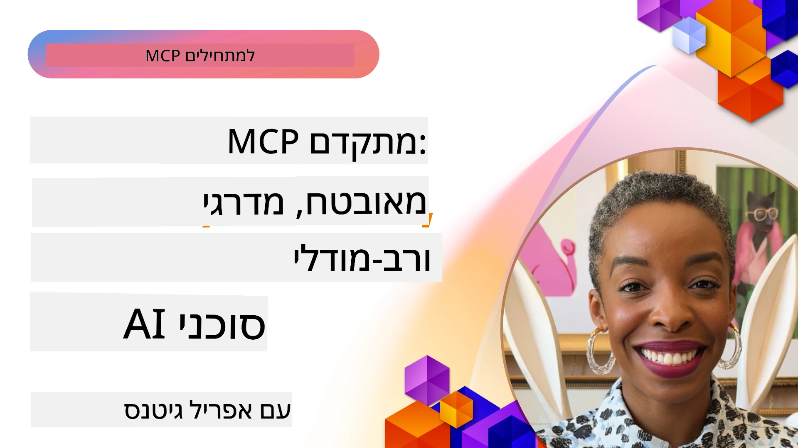

# נושאים מתקדמים ב-MCP

_(לחצו על התמונה למעלה לצפייה בסרטון של השיעור)_

פרק זה מכסה סדרת נושאים מתקדמים ביישום פרוטוקול הקשר מודל (MCP), כולל אינטגרציה מולטי-מודלית, קנה מידה, נוהלי אבטחה מיטביים ואינטגרציה ארגונית. נושאים אלה חיוניים לבניית יישומי MCP עמידים ומוכנים לייצור שיכולים לענות על דרישות מערכות בינה מלאכותית מודרניות.

## סקירה כללית

שיעור זה חוקר מושגים מתקדמים ביישום פרוטוקול הקשר מודל, עם דגש על אינטגרציה מולטי-מודלית, קנה מידה, נוהלי אבטחה מיטביים ואינטגרציה ארגונית. נושאים אלה חיוניים לבניית יישומי MCP ברמת ייצור שיכולים להתמודד עם דרישות מורכבות בסביבות ארגוניות.

## יעדי למידה

בסיום שיעור זה, תוכלו:

- ליישם יכולות מולטי-מודל במסגרת MCP
- לעצב ארכיטקטורות MCP מתקדמות לסביבות בעלות דרישה גבוהה
- ליישם נוהלי אבטחה מיטביים התואמים לעקרונות האבטחה של MCP
- לשלב את MCP עם מערכות ומסגרות בינה מלאכותית ארגוניות
- לאופטימיזציה של ביצועים ואמינות בסביבות ייצור

## שיעורים ודוגמאות לפרויקטים

| קישור | כותרת | תיאור |
|------|-------|-------------|
| [5.1 Integration with Azure](./mcp-integration/README.md) | אינטגרציה עם Azure | למדו כיצד לשלב את שרת MCP שלכם ב-Azure |
| [5.2 Multi modal sample](./mcp-multi-modality/README.md) | דוגמאות מולטי מודל ב-MCP | דוגמאות לתגובות קול, תמונה ורב-מודליות |
| [5.3 MCP OAuth2 sample](../../../05-AdvancedTopics/mcp-oauth2-demo) | דמו OAuth2 ב-MCP | אפליקציה מינימלית ב-Spring Boot המדגימה OAuth2 עם MCP, הן כשרת הרשאה והן כשרת משאבים. מציגה הנפקת טוקן מאובטחת, נקודות קצה מוגנות, פריסת Azure Container Apps ואינטגרציה עם ניהול API. |
| [5.4 Root Contexts](./mcp-root-contexts/README.md) | הקשרי שורש | למדו עוד על הקשר שורש ואיך ליישם אותו |
| [5.5 Routing](./mcp-routing/README.md) | ניתוב | למדו סוגים שונים של ניתוב |
| [5.6 Sampling](./mcp-sampling/README.md) | דגימה | למדו כיצד לעבוד עם דגימות |
| [5.7 Scaling](./mcp-scaling/README.md) | קנה מידה | למדו על קנה מידה |
| [5.8 Security](./mcp-security/README.md) | אבטחה | אבטחו את שרת MCP שלכם |
| [5.9 Web Search sample](./web-search-mcp/README.md) | חיפוש ווב ב-MCP | שרת ולקוח MCP בפייתון המשתלבים עם SerpAPI לחיפוש בזמן אמת באינטרנט, חדשות, מוצרים ושאלות ותשובות. מדגים תיאום מולטי-כלים, אינטגרציה עם API חיצוני וטיפול שגיאות מוצק. |
| [5.10 Realtime Streaming](./mcp-realtimestreaming/README.md) | סטרימינג | זרימת נתונים בזמן אמת הפכה חיונית בעולם הנוכחי המונע נתונים, כאשר עסקים ויישומים זקוקים לגישה מיידית למידע להחלטות מהירות. |
| [5.11 Realtime Web Search](./mcp-realtimesearch/README.md) | חיפוש ווב בזמן אמת | כיצד MCP משנה את חיפוש האינטרנט בזמן אמת על ידי מתן גישה מאוחדת לניהול הקשר בין דגמי AI, מנועי חיפוש ויישומים. |
| [5.12  Entra ID Authentication for Model Context Protocol Servers](./mcp-security-entra/README.md) | אימות Entra ID | Microsoft Entra ID מספק פתרון חזק לניהול זהויות וגישה מבוסס ענן, המסייע לוודא שרק משתמשים ויישומים מורשים יכולים לתקשר עם שרת MCP שלכם. |
| [5.13 Azure AI Foundry Agent Integration](./mcp-foundry-agent-integration/README.md) | אינטגרציה עם Azure AI Foundry | למדו כיצד לשלב שרתי MCP עם סוכני Azure AI Foundry, מה שמאפשר תיאום כלי עוצמתי ויכולות בינה מלאכותית ארגוניות עם חיבוריות מודולרית למקורות נתונים חיצוניים סטנדרטיים.|
| [5.14 Context Engineering](./mcp-contextengineering/README.md) | הנדסת הקשר | הזדמנות עתידית של טכניקות הנדסת הקשר עבור שרתי MCP, כולל אופטימיזציית הקשר, ניהול דינמי של ההקשר ואסטרטגיות להנדסת פרומפטים יעילה במסגרת MCP. |
| [5.15 MCP Custom Transport](./mcp-transport/README.md) | מעבר מותאם אישית | למדו כיצד ליישם מנגנוני מעבר מותאמים לתרחישי תקשורת ייחודיים ב-MCP. |
| [5.16 Protocol Features Deep Dive](./mcp-protocol-features/README.md) | תכונות פרוטוקול | שלטו בתכונות פרוטוקול מתקדמות הכוללות התראות התקדמות, ביטול בקשות, תבניות משאבים ודפוסי טיפול בשגיאות. |

> **חדש במפרט MCP 2025-11-25**: המפרט כולל כעת תמיכה ניסיונית ב-**משימות** (פעולות ארוכות טווח עם מעקב התקדמות), **הערות כלי** (מטא-נתונים על התנהגות כלים לשמירה על בטיחות), **איתור מצב URL** (בקשת תוכן URL ספציפי מלקוחות), ו-**שורשים משופרים** (לניהול הקשר סביבת עבודה). ראו את [יומן השינויים של מפרט MCP](https://spec.modelcontextprotocol.io/) לפרטים מלאים.

## הפניות נוספות

לקבלת המידע המעודכן ביותר על נושאים מתקדמים ב-MCP, עיינו ב:
- [תיעוד MCP](https://modelcontextprotocol.io/)
- [מפרט MCP (2025-11-25)](https://spec.modelcontextprotocol.io/specification/2025-11-25/)
- [מאגר GitHub](https://github.com/modelcontextprotocol)
- [OWASP MCP Top 10](https://microsoft.github.io/mcp-azure-security-guide/mcp/) - סיכוני אבטחה ופעולות מניעה
- [סדנת אבטחה של MCP (Sherpa)](https://azure-samples.github.io/sherpa/) - אימון מעשי באבטחה

## מסקנות מרכזיות

- יישומי MCP מולטי-מודליים מרחיבים את יכולות הבינה המלאכותית מעבר לעיבוד טקסט
- קנה מידה חיוני לפריסות ארגוניות וניתן לטיפול דרך הרחבה אופקית ואנכית
- צעדי אבטחה מקיפים מגנים על הנתונים ומבטיחים בקרת גישה נכונה
- אינטגרציה ארגונית עם פלטפורמות כמו Azure OpenAI ו-Microsoft AI Foundry משפרת את יכולות MCP
- יישומי MCP מתקדמים מפיקים תועלת מארכיטקטורות מותאמות וניהול זהיר של משאבים

## תרגיל

עצבו יישום MCP ברמת ארגון למקרה שימוש ספציפי:

1. זיהוי דרישות מולטי-מודל למקרה השימוש שלכם
2. תכנון בקרות אבטחה להגנה על נתונים רגישים
3. עיצוב ארכיטקטורה מתקדמת שיכולה להתמודד עם עומסים משתנים
4. תכנון נקודות אינטגרציה עם מערכות בינה מלאכותית ארגוניות
5. תיעוד צווארי בקבוק פוטנציאליים בביצועים ואסטרטגיות הפחתה

## משאבים נוספים

- [תיעוד Azure OpenAI](https://learn.microsoft.com/en-us/azure/ai-services/openai/)
- [תיעוד Microsoft AI Foundry](https://learn.microsoft.com/en-us/ai-services/)

---

## מה הלאה

חקור את השיעורים במודול זה החל מ: [5.1 אינטגרציית MCP](./mcp-integration/README.md)

לאחר שתסיים מודול זה, המשך ל: [מודול 6: תרומות הקהילה](../06-CommunityContributions/README.md)

---

<!-- CO-OP TRANSLATOR DISCLAIMER START -->
**כתב ויתור**:  
מסמך זה תורגם באמצעות שירות תרגום בינה מלאכותית [Co-op Translator](https://github.com/Azure/co-op-translator). למרות שאנו שואפים לדיוק, יש לקחת בחשבון שתרגומים אוטומטיים עלולים להכיל שגיאות או אי-דיוקים. יש להחשיב את המסמך המקורי בשפת המקור כמקור הסמכותי. למידע קריטי, מומלץ להשתמש בתרגום מקצועי אנושי. איננו אחראים לכל אי-הבנות או פרשנויות שגויות הנובעות משימוש בתרגום זה.
<!-- CO-OP TRANSLATOR DISCLAIMER END -->