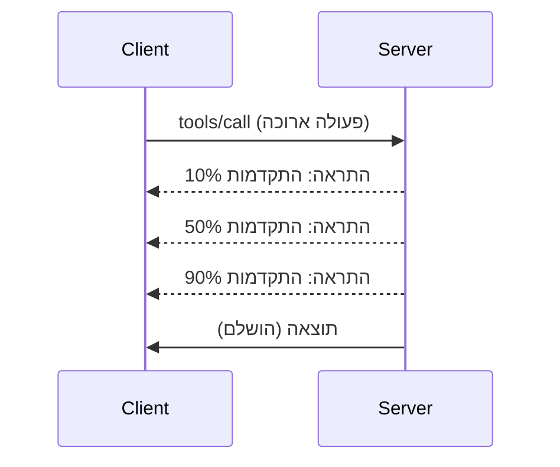

# ניתוח מעמיק של תכונות פרוטוקול MCP

מדריך זה חוקר תכונות מתקדמות של פרוטוקול MCP שמעבר לטיפול בסיסי בכלים ובמשאבים. הבנת תכונות אלו עוזרת לך לבנות שרתי MCP עמידים, ידידותיים למשתמש ומוכנים לפרודקשן.

## תכונות מכוסות

1. **התראות התקדמות** - דיווח על התקדמות עבור פעולות ארוכות זמן
2. **ביטול בקשות** - מאפשר ללקוחות לבטל בקשות בתהליך
3. **תבניות משאבים** - כתובות URI דינמיות עם פרמטרים
4. **אירועי מחזור חיים של השרת** - איתחול וסגירה נכונים
5. **בקרת רישום מערכת** - קונפיגורציה של רישום צד שרת
6. **דפוסי טיפול בשגיאות** - תגובות שגיאה עקביות

---

## 1. התראות התקדמות

עבור פעולות שלוקחות זמן (עיבוד נתונים, הורדות קבצים, קריאות API), התראות התקדמות שומרות על המשתמשים מעודכנים.

### איך זה עובד


### מימוש בפייתון

```python
from mcp.server import Server, NotificationOptions
from mcp.types import ProgressNotification
import asyncio

app = Server("progress-server")

@app.tool()
async def process_large_file(file_path: str, ctx) -> str:
    """Process a large file with progress updates."""
    
    # קבל את גודל הקובץ לחישוב ההתקדמות
    file_size = os.path.getsize(file_path)
    processed = 0
    
    with open(file_path, 'rb') as f:
        while chunk := f.read(8192):
            # עיבוד חלקה
            await process_chunk(chunk)
            processed += len(chunk)
            
            # שלח התראה על התקדמות
            progress = (processed / file_size) * 100
            await ctx.send_notification(
                ProgressNotification(
                    progressToken=ctx.request_id,
                    progress=progress,
                    total=100,
                    message=f"Processing: {progress:.1f}%"
                )
            )
    
    return f"Processed {file_size} bytes"

@app.tool()
async def batch_operation(items: list[str], ctx) -> str:
    """Process multiple items with progress."""
    
    results = []
    total = len(items)
    
    for i, item in enumerate(items):
        result = await process_item(item)
        results.append(result)
        
        # דווח על ההתקדמות לאחר כל פריט
        await ctx.send_notification(
            ProgressNotification(
                progressToken=ctx.request_id,
                progress=i + 1,
                total=total,
                message=f"Processed {i + 1}/{total}: {item}"
            )
        )
    
    return f"Completed {total} items"
```

### מימוש בטייפסקריפט

```typescript
import { Server } from "@modelcontextprotocol/sdk/server/index.js";

server.setRequestHandler(CallToolSchema, async (request, extra) => {
  const { name, arguments: args } = request.params;
  
  if (name === "process_data") {
    const items = args.items as string[];
    const results = [];
    
    for (let i = 0; i < items.length; i++) {
      const result = await processItem(items[i]);
      results.push(result);
      
      // לשלוח התראה על התקדמות
      await extra.sendNotification({
        method: "notifications/progress",
        params: {
          progressToken: request.id,
          progress: i + 1,
          total: items.length,
          message: `Processing item ${i + 1}/${items.length}`
        }
      });
    }
    
    return { content: [{ type: "text", text: JSON.stringify(results) }] };
  }
});
```

### טיפול בצד הלקוח (פייתון)

```python
async def handle_progress(notification):
    """Handle progress notifications from server."""
    params = notification.params
    print(f"Progress: {params.progress}/{params.total} - {params.message}")

# רישום מטפל
session.on_notification("notifications/progress", handle_progress)

# קריאה לכלי (עדכוני התקדמות יגיעו דרך המטפל)
result = await session.call_tool("process_large_file", {"file_path": "/data/large.csv"})
```

---

## 2. ביטול בקשות

מאפשר ללקוחות לבטל בקשות שכבר אינן נחוצות או שנמשכות זמן רב מדי.

### מימוש בפייתון

```python
from mcp.server import Server
from mcp.types import CancelledError
import asyncio

app = Server("cancellable-server")

@app.tool()
async def long_running_search(query: str, ctx) -> str:
    """Search that can be cancelled."""
    
    results = []
    
    try:
        for page in range(100):  # חפש דרך דפים רבים
            # בדוק אם נדרשה ביטול
            if ctx.is_cancelled:
                raise CancelledError("Search cancelled by user")
            
            # סימולציה של חיפוש בדף
            page_results = await search_page(query, page)
            results.extend(page_results)
            
            # עיכוב קטן מאפשר בדיקות ביטול
            await asyncio.sleep(0.1)
            
    except CancelledError:
        # החזר תוצאות חלקיות
        return f"Cancelled. Found {len(results)} results before cancellation."
    
    return f"Found {len(results)} total results"

@app.tool()
async def download_file(url: str, ctx) -> str:
    """Download with cancellation support."""
    
    async with aiohttp.ClientSession() as session:
        async with session.get(url) as response:
            total_size = int(response.headers.get('content-length', 0))
            downloaded = 0
            chunks = []
            
            async for chunk in response.content.iter_chunked(8192):
                if ctx.is_cancelled:
                    return f"Download cancelled at {downloaded}/{total_size} bytes"
                
                chunks.append(chunk)
                downloaded += len(chunk)
            
            return f"Downloaded {downloaded} bytes"
```

### מימוש הקשר ביטול

```python
class CancellableContext:
    """Context object that tracks cancellation state."""
    
    def __init__(self, request_id: str):
        self.request_id = request_id
        self._cancelled = asyncio.Event()
        self._cancel_reason = None
    
    @property
    def is_cancelled(self) -> bool:
        return self._cancelled.is_set()
    
    def cancel(self, reason: str = "Cancelled"):
        self._cancel_reason = reason
        self._cancelled.set()
    
    async def check_cancelled(self):
        """Raise if cancelled, otherwise continue."""
        if self.is_cancelled:
            raise CancelledError(self._cancel_reason)
    
    async def sleep_or_cancel(self, seconds: float):
        """Sleep that can be interrupted by cancellation."""
        try:
            await asyncio.wait_for(
                self._cancelled.wait(),
                timeout=seconds
            )
            raise CancelledError(self._cancel_reason)
        except asyncio.TimeoutError:
            pass  # פסק זמן רגיל, המשך
```

### ביטול בצד הלקוח

```python
import asyncio

async def search_with_timeout(session, query, timeout=30):
    """Search with automatic cancellation on timeout."""
    
    task = asyncio.create_task(
        session.call_tool("long_running_search", {"query": query})
    )
    
    try:
        result = await asyncio.wait_for(task, timeout=timeout)
        return result
    except asyncio.TimeoutError:
        # בקשת ביטול
        await session.send_notification({
            "method": "notifications/cancelled",
            "params": {"requestId": task.request_id, "reason": "Timeout"}
        })
        return "Search timed out"
```

---

## 3. תבניות משאבים

תבניות משאבים מאפשרות בניית URI דינמיים עם פרמטרים, שימושיות ל-APIs ומסדי נתונים.

### הגדרת תבניות

```python
from mcp.server import Server
from mcp.types import ResourceTemplate

app = Server("template-server")

@app.list_resource_templates()
async def list_templates() -> list[ResourceTemplate]:
    """Return available resource templates."""
    return [
        ResourceTemplate(
            uriTemplate="db://users/{user_id}",
            name="User Profile",
            description="Fetch user profile by ID",
            mimeType="application/json"
        ),
        ResourceTemplate(
            uriTemplate="api://weather/{city}/{date}",
            name="Weather Data",
            description="Historical weather for city and date",
            mimeType="application/json"
        ),
        ResourceTemplate(
            uriTemplate="file://{path}",
            name="File Content",
            description="Read file at given path",
            mimeType="text/plain"
        )
    ]

@app.read_resource()
async def read_resource(uri: str) -> str:
    """Read resource, expanding template parameters."""
    
    # פארס את ה-URI כדי להוציא פרמטרים
    if uri.startswith("db://users/"):
        user_id = uri.split("/")[-1]
        return await fetch_user(user_id)
    
    elif uri.startswith("api://weather/"):
        parts = uri.replace("api://weather/", "").split("/")
        city, date = parts[0], parts[1]
        return await fetch_weather(city, date)
    
    elif uri.startswith("file://"):
        path = uri.replace("file://", "")
        return await read_file(path)
    
    raise ValueError(f"Unknown resource URI: {uri}")
```

### מימוש בטייפסקריפט

```typescript
server.setRequestHandler(ListResourceTemplatesSchema, async () => {
  return {
    resourceTemplates: [
      {
        uriTemplate: "github://repos/{owner}/{repo}/issues/{issue_number}",
        name: "GitHub Issue",
        description: "Fetch a specific GitHub issue",
        mimeType: "application/json"
      },
      {
        uriTemplate: "db://tables/{table}/rows/{id}",
        name: "Database Row",
        description: "Fetch a row from a database table",
        mimeType: "application/json"
      }
    ]
  };
});

server.setRequestHandler(ReadResourceSchema, async (request) => {
  const uri = request.params.uri;
  
  // פרש URI של נושא GitHub
  const githubMatch = uri.match(/^github:\/\/repos\/([^/]+)\/([^/]+)\/issues\/(\d+)$/);
  if (githubMatch) {
    const [_, owner, repo, issueNumber] = githubMatch;
    const issue = await fetchGitHubIssue(owner, repo, parseInt(issueNumber));
    return {
      contents: [{
        uri,
        mimeType: "application/json",
        text: JSON.stringify(issue, null, 2)
      }]
    };
  }
  
  throw new Error(`Unknown resource URI: ${uri}`);
});
```

---

## 4. אירועי מחזור חיים של השרת

איתחול וסגירה נכונים מבטיחים ניהול משאבים נקי.

### ניהול מחזור חיים בפייתון

```python
from mcp.server import Server
from contextlib import asynccontextmanager

app = Server("lifecycle-server")

# מצב משותף
db_connection = None
cache = None

@asynccontextmanager
async def lifespan(server: Server):
    """Manage server lifecycle."""
    global db_connection, cache
    
    # הפעלה
    print("🚀 Server starting...")
    db_connection = await create_database_connection()
    cache = await create_cache_client()
    print("✅ Resources initialized")
    
    yield  # השרת רץ כאן
    
    # כיבוי
    print("🛑 Server shutting down...")
    await db_connection.close()
    await cache.close()
    print("✅ Resources cleaned up")

app = Server("lifecycle-server", lifespan=lifespan)

@app.tool()
async def query_database(sql: str) -> str:
    """Use the shared database connection."""
    result = await db_connection.execute(sql)
    return str(result)
```

### מחזור חיים בטייפסקריפט

```typescript
import { Server } from "@modelcontextprotocol/sdk/server/index.js";

class ManagedServer {
  private server: Server;
  private dbConnection: DatabaseConnection | null = null;
  
  constructor() {
    this.server = new Server({
      name: "lifecycle-server",
      version: "1.0.0"
    });
    
    this.setupHandlers();
  }
  
  async start() {
    // אתחול משאבים
    console.log("🚀 Server starting...");
    this.dbConnection = await createDatabaseConnection();
    console.log("✅ Database connected");
    
    // הפעלת השרת
    await this.server.connect(transport);
  }
  
  async stop() {
    // ניקוי משאבים
    console.log("🛑 Server shutting down...");
    if (this.dbConnection) {
      await this.dbConnection.close();
    }
    await this.server.close();
    console.log("✅ Cleanup complete");
  }
  
  private setupHandlers() {
    this.server.setRequestHandler(CallToolSchema, async (request) => {
      // השתמש ב-this.dbConnection בבטחה
      // ...
    });
  }
}

// שימוש עם כיבוי נקי
const server = new ManagedServer();

process.on('SIGINT', async () => {
  await server.stop();
  process.exit(0);
});

await server.start();
```

---

## 5. בקרת רישום מערכת

MCP תומך ברמות רישום צד שרת שניתן לשלוט עליהן מצד הלקוחות.

### מימוש רמות רישום

```python
from mcp.server import Server
from mcp.types import LoggingLevel
import logging

app = Server("logging-server")

# העתקת רמות MCP לרמות רישום של Python
LEVEL_MAP = {
    LoggingLevel.DEBUG: logging.DEBUG,
    LoggingLevel.INFO: logging.INFO,
    LoggingLevel.WARNING: logging.WARNING,
    LoggingLevel.ERROR: logging.ERROR,
}

logger = logging.getLogger("mcp-server")

@app.set_logging_level()
async def set_logging_level(level: LoggingLevel) -> None:
    """Handle client request to change logging level."""
    python_level = LEVEL_MAP.get(level, logging.INFO)
    logger.setLevel(python_level)
    logger.info(f"Logging level set to {level}")

@app.tool()
async def debug_operation(data: str) -> str:
    """Tool with various logging levels."""
    logger.debug(f"Processing data: {data}")
    
    try:
        result = process(data)
        logger.info(f"Successfully processed: {result}")
        return result
    except Exception as e:
        logger.error(f"Processing failed: {e}")
        raise
```

### שליחת הודעות לוג ללקוח

```python
@app.tool()
async def complex_operation(input: str, ctx) -> str:
    """Operation that logs to client."""
    
    # שלח התראה על יומן ללקוח
    await ctx.send_log(
        level="info",
        message=f"Starting complex operation with input: {input}"
    )
    
    # מבצע עבודה...
    result = await do_work(input)
    
    await ctx.send_log(
        level="debug",
        message=f"Operation complete, result size: {len(result)}"
    )
    
    return result
```

---

## 6. דפוסי טיפול בשגיאות

טיפול עקבי בשגיאות משפר את תהליך איתור הבאגים וחוויית המשתמש.

### קודי שגיאה ב-MCP

```python
from mcp.types import McpError, ErrorCode

class ToolError(McpError):
    """Base class for tool errors."""
    pass

class ValidationError(ToolError):
    """Invalid input parameters."""
    def __init__(self, message: str):
        super().__init__(ErrorCode.INVALID_PARAMS, message)

class NotFoundError(ToolError):
    """Requested resource not found."""
    def __init__(self, resource: str):
        super().__init__(ErrorCode.INVALID_REQUEST, f"Not found: {resource}")

class PermissionError(ToolError):
    """Access denied."""
    def __init__(self, action: str):
        super().__init__(ErrorCode.INVALID_REQUEST, f"Permission denied: {action}")

class InternalError(ToolError):
    """Internal server error."""
    def __init__(self, message: str):
        super().__init__(ErrorCode.INTERNAL_ERROR, message)
```

### תגובות שגיאה מובנות

```python
@app.tool()
async def safe_operation(input: str) -> str:
    """Tool with comprehensive error handling."""
    
    # אמת קלט
    if not input:
        raise ValidationError("Input cannot be empty")
    
    if len(input) > 10000:
        raise ValidationError(f"Input too large: {len(input)} chars (max 10000)")
    
    try:
        # בדוק הרשאות
        if not await check_permission(input):
            raise PermissionError(f"read {input}")
        
        # בצע פעולה
        result = await perform_operation(input)
        
        if result is None:
            raise NotFoundError(input)
        
        return result
        
    except ConnectionError as e:
        raise InternalError(f"Database connection failed: {e}")
    except TimeoutError as e:
        raise InternalError(f"Operation timed out: {e}")
    except Exception as e:
        # תעד שגיאות בלתי צפויות
        logger.exception(f"Unexpected error in safe_operation")
        raise InternalError(f"Unexpected error: {type(e).__name__}")
```

### טיפול בשגיאות בטייפסקריפט

```typescript
import { McpError, ErrorCode } from "@modelcontextprotocol/sdk/types.js";

function validateInput(data: unknown): asserts data is ValidInput {
  if (typeof data !== "object" || data === null) {
    throw new McpError(
      ErrorCode.InvalidParams,
      "Input must be an object"
    );
  }
  // יותר אימות...
}

server.setRequestHandler(CallToolSchema, async (request) => {
  try {
    validateInput(request.params.arguments);
    
    const result = await performOperation(request.params.arguments);
    
    return {
      content: [{ type: "text", text: JSON.stringify(result) }]
    };
    
  } catch (error) {
    if (error instanceof McpError) {
      throw error;  // כבר שגיאת MCP
    }
    
    // להמיר שגיאות אחרות
    if (error instanceof NotFoundError) {
      throw new McpError(ErrorCode.InvalidRequest, error.message);
    }
    
    // שגיאה לא ידועה
    console.error("Unexpected error:", error);
    throw new McpError(
      ErrorCode.InternalError,
      "An unexpected error occurred"
    );
  }
});
```

---

## תכונות ניסיוניות (MCP 2025-11-25)

תכונות אלו מסומנות כניסיוניות במפרט:

### משימות (פעולות ארוכות)

```python
# משימות מאפשרות מעקב אחר פעולות ארוכות עם מצב
@app.task()
async def training_task(model_id: str, data_path: str, ctx) -> str:
    """Long-running ML training task."""
    
    # דווח שהמשימה החלה
    await ctx.report_status("running", "Initializing training...")
    
    # לולאת אימון
    for epoch in range(100):
        await train_epoch(model_id, data_path, epoch)
        await ctx.report_status(
            "running",
            f"Training epoch {epoch + 1}/100",
            progress=epoch + 1,
            total=100
        )
    
    await ctx.report_status("completed", "Training finished")
    return f"Model {model_id} trained successfully"
```

### הערות על כלים

```python
# הערות מספקות מטא-נתונים לגבי התנהגות הכלי
@app.tool(
    annotations={
        "destructive": False,      # לא משנה את הנתונים
        "idempotent": True,        # בטוח לנסות שוב
        "timeout_seconds": 30,     # משך מקסימלי צפוי
        "requires_approval": False # אין צורך באישור משתמש
    }
)
async def safe_query(query: str) -> str:
    """A read-only database query tool."""
    return await execute_read_query(query)
```

---

## מה הלאה

- [מודול 8 - שיטות עבודה מומלצות](../../08-BestPractices/README.md)
- [5.14 - הנדסת הקשר](../mcp-contextengineering/README.md)
- [יומן שינויים של מפרט MCP](https://spec.modelcontextprotocol.io/)

---

## משאבים נוספים

- [מפרט MCP 2025-11-25](https://spec.modelcontextprotocol.io/specification/2025-11-25/)
- [קודי שגיאה JSON-RPC 2.0](https://www.jsonrpc.org/specification#error_object)
- [דוגמאות SDK בפייתון](https://github.com/modelcontextprotocol/python-sdk/tree/main/examples)
- [דוגמאות SDK בטייפסקריפט](https://github.com/modelcontextprotocol/typescript-sdk/tree/main/examples)

---

<!-- CO-OP TRANSLATOR DISCLAIMER START -->
**כתב הסכמה**:  
מסמך זה תורגם באמצעות שירות תרגום מבוסס בינה מלאכותית [Co-op Translator](https://github.com/Azure/co-op-translator). אכן אנו שואפים לדיוק, אך יש להיות מודעים לכך שתרגומים ממוחשבים עלולים להכיל שגיאות או אי-דיוקים. המסמך המקורי בשפתו המקורית מהווה את המקור המוסמך. עבור מידע קריטי מומלץ להיעזר בתרגום מקצועי אנושי. אנו לא אחראים לכל אי-הבנה או פרשנות שגוייה הנובעים משימוש בתרגום זה.
<!-- CO-OP TRANSLATOR DISCLAIMER END -->