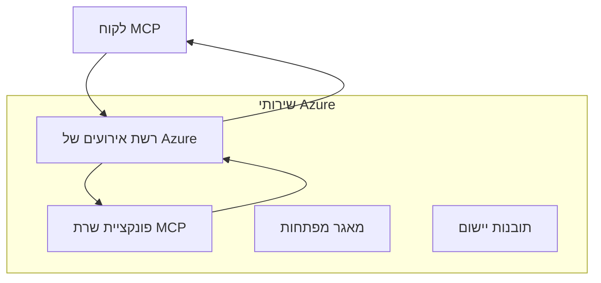
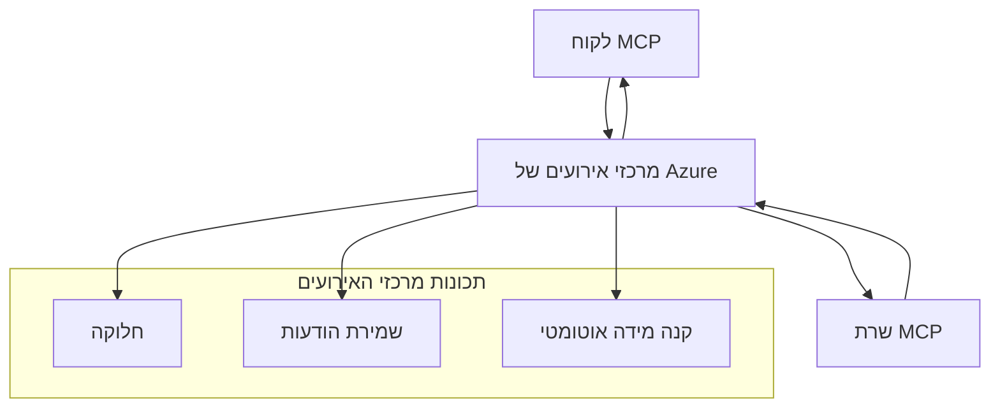

# MCP תחבורה מותאמת אישית - מדריך יישום מתקדם

פרוטוקול הקשר למודל (MCP) מספק גמישות במנגנוני התחבורה, ומאפשר יישומים מותאמים אישית לסביבות ארגוניות מיוחדות. מדריך מתקדם זה חוקר יישומי תחבורה מותאמים אישית באמצעות Azure Event Grid ו-Azure Event Hubs כדוגמאות מעשיות לבניית פתרונות MCP ניתנים להרחבה ומבוססי ענן.

## מבוא

בעוד שהתחבורה הסטנדרטית של MCP (stdio ו-HTTP streaming) משרתת את רוב מקרי השימוש, סביבות ארגוניות דורשות לעיתים מנגנוני תחבורה מיוחדים לשיפור הניתנות להרחבה, האמינות והאינטגרציה עם תשתיות ענן קיימות. תחבורה מותאמת אישית מאפשרת ל-MCP לנצל שירותי הודעות מבוססי ענן לתקשורת אסינכרונית, ארכיטקטורות מונעות אירועים ועיבוד מבוזר.

שיעור זה חוקר יישומי תחבורה מתקדמים המבוססים על מפרט MCP העדכני ביותר (2025-11-25), שירותי הודעות של Azure ודפוסי אינטגרציה ארגוניים מבוססים.

### **ארכיטקטורת תחבורה של MCP**

**ממפרט MCP (2025-11-25):**

- **תחבורה סטנדרטית**: stdio (מומלץ), HTTP streaming (לתרחישים מרוחקים)
- **תחבורה מותאמת אישית**: כל תחבורה שמממשת את פרוטוקול החלפת ההודעות של MCP
- **פורמט הודעה**: JSON-RPC 2.0 עם הרחבות ספציפיות ל-MCP
- **תקשורת דו-כיוונית**: דרושה תקשורת דו-כיוונית מלאה להודעות והתראות

## מטרות הלמידה

בסיום שיעור מתקדם זה, תוכל:

- **להבין דרישות תחבורה מותאמת אישית**: לממש פרוטוקול MCP על כל שכבת תחבורה תוך שמירה על תאימות
- **לבנות תחבורה באמצעות Azure Event Grid**: ליצור שרתי MCP מונעי אירועים באמצעות Azure Event Grid להרחבה ללא שרתים
- **לממש תחבורה באמצעות Azure Event Hubs**: לעצב פתרונות MCP בעלי קצב גבוה באמצעות Azure Event Hubs לזרימה בזמן אמת
- **ליישם דפוסי ארגון**: לשלב תחבורה מותאמת עם תשתיות Azure קיימות ומודלי אבטחה
- **לטפל באמינות התחבורה**: לממש עמידות הודעות, סידור וטיפול בשגיאות לתרחישים ארגוניים
- **לאופטם ביצועים**: לעצב פתרונות תחבורה לדרישות קנה מידה, השהיה וקצב העברה

## **דרישות תחבורה**

### **דרישות ליבה ממפרט MCP (2025-11-25):**

```yaml
Message Protocol:
  format: "JSON-RPC 2.0 with MCP extensions"
  bidirectional: "Full duplex communication required"
  ordering: "Message ordering must be preserved per session"
  
Transport Layer:
  reliability: "Transport MUST handle connection failures gracefully"
  security: "Transport MUST support secure communication"
  identification: "Each session MUST have unique identifier"
  
Custom Transport:
  compliance: "MUST implement complete MCP message exchange"
  extensibility: "MAY add transport-specific features"
  interoperability: "MUST maintain protocol compatibility"
```

## **יישום תחבורה באמצעות Azure Event Grid**

Azure Event Grid מספק שירות ניתוב אירועים ללא שרת אידיאלי לארכיטקטורות MCP מונעות אירועים. יישום זה מדגים כיצד לבנות מערכות MCP ניתנות להרחבה ומפוצלות ברופף.

### **סקירת ארכיטקטורה**


### **יישום ב-C# - תחבורה באמצעות Event Grid**

```csharp
using Azure.Messaging.EventGrid;
using Microsoft.Extensions.Azure;
using System.Text.Json;

public class EventGridMcpTransport : IMcpTransport
{
    private readonly EventGridPublisherClient _publisher;
    private readonly string _topicEndpoint;
    private readonly string _clientId;
    
    public EventGridMcpTransport(string topicEndpoint, string accessKey, string clientId)
    {
        _publisher = new EventGridPublisherClient(
            new Uri(topicEndpoint), 
            new AzureKeyCredential(accessKey));
        _topicEndpoint = topicEndpoint;
        _clientId = clientId;
    }
    
    public async Task SendMessageAsync(McpMessage message)
    {
        var eventGridEvent = new EventGridEvent(
            subject: $"mcp/{_clientId}",
            eventType: "MCP.MessageReceived",
            dataVersion: "1.0",
            data: JsonSerializer.Serialize(message))
        {
            Id = Guid.NewGuid().ToString(),
            EventTime = DateTimeOffset.UtcNow
        };
        
        await _publisher.SendEventAsync(eventGridEvent);
    }
    
    public async Task<McpMessage> ReceiveMessageAsync(CancellationToken cancellationToken)
    {
        // Event Grid is push-based, so implement webhook receiver
        // This would typically be handled by Azure Functions trigger
        throw new NotImplementedException("Use EventGridTrigger in Azure Functions");
    }
}

// Azure Function for receiving Event Grid events
[FunctionName("McpEventGridReceiver")]
public async Task<IActionResult> HandleEventGridMessage(
    [EventGridTrigger] EventGridEvent eventGridEvent,
    ILogger log)
{
    try
    {
        var mcpMessage = JsonSerializer.Deserialize<McpMessage>(
            eventGridEvent.Data.ToString());
        
        // Process MCP message
        var response = await _mcpServer.ProcessMessageAsync(mcpMessage);
        
        // Send response back via Event Grid
        await _transport.SendMessageAsync(response);
        
        return new OkResult();
    }
    catch (Exception ex)
    {
        log.LogError(ex, "Error processing Event Grid MCP message");
        return new BadRequestResult();
    }
}
```

### **יישום ב-TypeScript - תחבורה באמצעות Event Grid**

```typescript
import { EventGridPublisherClient, AzureKeyCredential } from "@azure/eventgrid";
import { McpTransport, McpMessage } from "./mcp-types";

export class EventGridMcpTransport implements McpTransport {
    private publisher: EventGridPublisherClient;
    private clientId: string;
    
    constructor(
        private topicEndpoint: string,
        private accessKey: string,
        clientId: string
    ) {
        this.publisher = new EventGridPublisherClient(
            topicEndpoint,
            new AzureKeyCredential(accessKey)
        );
        this.clientId = clientId;
    }
    
    async sendMessage(message: McpMessage): Promise<void> {
        const event = {
            id: crypto.randomUUID(),
            source: `mcp-client-${this.clientId}`,
            type: "MCP.MessageReceived",
            time: new Date(),
            data: message
        };
        
        await this.publisher.sendEvents([event]);
    }
    
    // קבלה מונעת אירועים באמצעות Azure Functions
    onMessage(handler: (message: McpMessage) => Promise<void>): void {
        // המימוש ישתמש בטריגר Event Grid של Azure Functions
        // זהו ממשק קונספטואלי למקבל ה-webhook
    }
}

// מימוש Azure Functions
import { app, InvocationContext, EventGridEvent } from "@azure/functions";

app.eventGrid("mcpEventGridHandler", {
    handler: async (event: EventGridEvent, context: InvocationContext) => {
        try {
            const mcpMessage = event.data as McpMessage;
            
            // עיבוד הודעת MCP
            const response = await mcpServer.processMessage(mcpMessage);
            
            // שליחת תגובה דרך Event Grid
            await transport.sendMessage(response);
            
        } catch (error) {
            context.error("Error processing MCP message:", error);
            throw error;
        }
    }
});
```

### **יישום ב-Python - תחבורה באמצעות Event Grid**

```python
from azure.eventgrid import EventGridPublisherClient, EventGridEvent
from azure.core.credentials import AzureKeyCredential
import asyncio
import json
from typing import Callable, Optional
import uuid
from datetime import datetime

class EventGridMcpTransport:
    def __init__(self, topic_endpoint: str, access_key: str, client_id: str):
        self.client = EventGridPublisherClient(
            topic_endpoint, 
            AzureKeyCredential(access_key)
        )
        self.client_id = client_id
        self.message_handler: Optional[Callable] = None
    
    async def send_message(self, message: dict) -> None:
        """Send MCP message via Event Grid"""
        event = EventGridEvent(
            data=message,
            subject=f"mcp/{self.client_id}",
            event_type="MCP.MessageReceived",
            data_version="1.0"
        )
        
        await self.client.send(event)
    
    def on_message(self, handler: Callable[[dict], None]) -> None:
        """Register message handler for incoming events"""
        self.message_handler = handler

# מימוש פונקציות Azure
import azure.functions as func
import logging

def main(event: func.EventGridEvent) -> None:
    """Azure Functions Event Grid trigger for MCP messages"""
    try:
        # ניתוח הודעת MCP מאירוע Event Grid
        mcp_message = json.loads(event.get_body().decode('utf-8'))
        
        # עיבוד הודעת MCP
        response = process_mcp_message(mcp_message)
        
        # שליחת תגובה חזרה דרך Event Grid
        # (המימוש ייצור לקוח Event Grid חדש)
        
    except Exception as e:
        logging.error(f"Error processing MCP Event Grid message: {e}")
        raise
```

## **יישום תחבורה באמצעות Azure Event Hubs**

Azure Event Hubs מספק יכולות זרימה בזמן אמת בקצב גבוה לתרחישי MCP הדורשים השהיה נמוכה ונפח הודעות גבוה.

### **סקירת ארכיטקטורה**


### **יישום ב-C# - תחבורה באמצעות Event Hubs**

```csharp
using Azure.Messaging.EventHubs;
using Azure.Messaging.EventHubs.Producer;
using Azure.Messaging.EventHubs.Consumer;
using System.Text;

public class EventHubsMcpTransport : IMcpTransport, IDisposable
{
    private readonly EventHubProducerClient _producer;
    private readonly EventHubConsumerClient _consumer;
    private readonly string _consumerGroup;
    private readonly CancellationTokenSource _cancellationTokenSource;
    
    public EventHubsMcpTransport(
        string connectionString, 
        string eventHubName,
        string consumerGroup = "$Default")
    {
        _producer = new EventHubProducerClient(connectionString, eventHubName);
        _consumer = new EventHubConsumerClient(
            consumerGroup, 
            connectionString, 
            eventHubName);
        _consumerGroup = consumerGroup;
        _cancellationTokenSource = new CancellationTokenSource();
    }
    
    public async Task SendMessageAsync(McpMessage message)
    {
        var messageBody = JsonSerializer.Serialize(message);
        var eventData = new EventData(Encoding.UTF8.GetBytes(messageBody));
        
        // Add MCP-specific properties
        eventData.Properties.Add("MessageType", message.Method ?? "response");
        eventData.Properties.Add("MessageId", message.Id);
        eventData.Properties.Add("Timestamp", DateTimeOffset.UtcNow);
        
        await _producer.SendAsync(new[] { eventData });
    }
    
    public async Task StartReceivingAsync(
        Func<McpMessage, Task> messageHandler)
    {
        await foreach (PartitionEvent partitionEvent in _consumer.ReadEventsAsync(
            _cancellationTokenSource.Token))
        {
            try
            {
                var messageBody = Encoding.UTF8.GetString(
                    partitionEvent.Data.EventBody.ToArray());
                var mcpMessage = JsonSerializer.Deserialize<McpMessage>(messageBody);
                
                await messageHandler(mcpMessage);
            }
            catch (Exception ex)
            {
                // Handle deserialization or processing errors
                Console.WriteLine($"Error processing message: {ex.Message}");
            }
        }
    }
    
    public void Dispose()
    {
        _cancellationTokenSource?.Cancel();
        _producer?.DisposeAsync().AsTask().Wait();
        _consumer?.DisposeAsync().AsTask().Wait();
        _cancellationTokenSource?.Dispose();
    }
}
```

### **יישום ב-TypeScript - תחבורה באמצעות Event Hubs**

```typescript
import { 
    EventHubProducerClient, 
    EventHubConsumerClient, 
    EventData 
} from "@azure/event-hubs";

export class EventHubsMcpTransport implements McpTransport {
    private producer: EventHubProducerClient;
    private consumer: EventHubConsumerClient;
    private isReceiving = false;
    
    constructor(
        private connectionString: string,
        private eventHubName: string,
        private consumerGroup: string = "$Default"
    ) {
        this.producer = new EventHubProducerClient(
            connectionString, 
            eventHubName
        );
        this.consumer = new EventHubConsumerClient(
            consumerGroup,
            connectionString,
            eventHubName
        );
    }
    
    async sendMessage(message: McpMessage): Promise<void> {
        const eventData: EventData = {
            body: JSON.stringify(message),
            properties: {
                messageType: message.method || "response",
                messageId: message.id,
                timestamp: new Date().toISOString()
            }
        };
        
        await this.producer.sendBatch([eventData]);
    }
    
    async startReceiving(
        messageHandler: (message: McpMessage) => Promise<void>
    ): Promise<void> {
        if (this.isReceiving) return;
        
        this.isReceiving = true;
        
        const subscription = this.consumer.subscribe({
            processEvents: async (events, context) => {
                for (const event of events) {
                    try {
                        const messageBody = event.body as string;
                        const mcpMessage: McpMessage = JSON.parse(messageBody);
                        
                        await messageHandler(mcpMessage);
                        
                        // עדכן נקודת בדיקה עבור משלוח לפחות פעם אחת
                        await context.updateCheckpoint(event);
                    } catch (error) {
                        console.error("Error processing Event Hubs message:", error);
                    }
                }
            },
            processError: async (err, context) => {
                console.error("Event Hubs error:", err);
            }
        });
    }
    
    async close(): Promise<void> {
        this.isReceiving = false;
        await this.producer.close();
        await this.consumer.close();
    }
}
```

### **יישום ב-Python - תחבורה באמצעות Event Hubs**

```python
from azure.eventhub import EventHubProducerClient, EventHubConsumerClient
from azure.eventhub import EventData
import json
import asyncio
from typing import Callable, Dict, Any
import logging

class EventHubsMcpTransport:
    def __init__(
        self, 
        connection_string: str, 
        eventhub_name: str,
        consumer_group: str = "$Default"
    ):
        self.producer = EventHubProducerClient.from_connection_string(
            connection_string, 
            eventhub_name=eventhub_name
        )
        self.consumer = EventHubConsumerClient.from_connection_string(
            connection_string,
            consumer_group=consumer_group,
            eventhub_name=eventhub_name
        )
        self.is_receiving = False
    
    async def send_message(self, message: Dict[str, Any]) -> None:
        """Send MCP message via Event Hubs"""
        event_data = EventData(json.dumps(message))
        
        # הוסף מאפיינים ספציפיים ל-MCP
        event_data.properties = {
            "messageType": message.get("method", "response"),
            "messageId": message.get("id"),
            "timestamp": "2025-01-14T10:30:00Z"  # השתמש בחותמת זמן אמיתית
        }
        
        async with self.producer:
            event_data_batch = await self.producer.create_batch()
            event_data_batch.add(event_data)
            await self.producer.send_batch(event_data_batch)
    
    async def start_receiving(
        self, 
        message_handler: Callable[[Dict[str, Any]], None]
    ) -> None:
        """Start receiving MCP messages from Event Hubs"""
        if self.is_receiving:
            return
        
        self.is_receiving = True
        
        async with self.consumer:
            await self.consumer.receive(
                on_event=self._on_event_received(message_handler),
                starting_position="-1"  # התחל מההתחלה
            )
    
    def _on_event_received(self, handler: Callable):
        """Internal event handler wrapper"""
        async def handle_event(partition_context, event):
            try:
                # נתח הודעת MCP מאירוע של Event Hubs
                message_body = event.body_as_str(encoding='UTF-8')
                mcp_message = json.loads(message_body)
                
                # עבד הודעת MCP
                await handler(mcp_message)
                
                # עדכן נקודת ביקורת למשלוח לפחות פעם אחת
                await partition_context.update_checkpoint(event)
                
            except Exception as e:
                logging.error(f"Error processing Event Hubs message: {e}")
        
        return handle_event
    
    async def close(self) -> None:
        """Clean up transport resources"""
        self.is_receiving = False
        await self.producer.close()
        await self.consumer.close()
```

## **דפוסי תחבורה מתקדמים**

### **עמידות ואמינות הודעות**

```csharp
// Implementing message durability with retry logic
public class ReliableTransportWrapper : IMcpTransport
{
    private readonly IMcpTransport _innerTransport;
    private readonly RetryPolicy _retryPolicy;
    
    public async Task SendMessageAsync(McpMessage message)
    {
        await _retryPolicy.ExecuteAsync(async () =>
        {
            try
            {
                await _innerTransport.SendMessageAsync(message);
            }
            catch (TransportException ex) when (ex.IsRetryable)
            {
                // Log and retry
                throw;
            }
        });
    }
}
```

### **אינטגרציית אבטחת תחבורה**

```csharp
// Integrating Azure Key Vault for transport security
public class SecureTransportFactory
{
    private readonly SecretClient _keyVaultClient;
    
    public async Task<IMcpTransport> CreateEventGridTransportAsync()
    {
        var accessKey = await _keyVaultClient.GetSecretAsync("EventGridAccessKey");
        var topicEndpoint = await _keyVaultClient.GetSecretAsync("EventGridTopic");
        
        return new EventGridMcpTransport(
            topicEndpoint.Value.Value,
            accessKey.Value.Value,
            Environment.MachineName
        );
    }
}
```

### **ניטור ויכולת תצפית של התחבורה**

```csharp
// Adding telemetry to custom transports
public class ObservableTransport : IMcpTransport
{
    private readonly IMcpTransport _transport;
    private readonly ILogger _logger;
    private readonly TelemetryClient _telemetryClient;
    
    public async Task SendMessageAsync(McpMessage message)
    {
        using var activity = Activity.StartActivity("MCP.Transport.Send");
        activity?.SetTag("transport.type", "EventGrid");
        activity?.SetTag("message.method", message.Method);
        
        var stopwatch = Stopwatch.StartNew();
        
        try
        {
            await _transport.SendMessageAsync(message);
            
            _telemetryClient.TrackDependency(
                "EventGrid",
                "SendMessage",
                DateTime.UtcNow.Subtract(stopwatch.Elapsed),
                stopwatch.Elapsed,
                true
            );
        }
        catch (Exception ex)
        {
            _telemetryClient.TrackException(ex);
            throw;
        }
    }
}
```

## **תרחישי אינטגרציה ארגוניים**

### **תרחיש 1: עיבוד MCP מבוזר**

שימוש ב-Azure Event Grid להפצת בקשות MCP בין מספר צמתים לעיבוד:

```yaml
Architecture:
  - MCP Client sends requests to Event Grid topic
  - Multiple Azure Functions subscribe to process different tool types
  - Results aggregated and returned via separate response topic
  
Benefits:
  - Horizontal scaling based on message volume
  - Fault tolerance through redundant processors
  - Cost optimization with serverless compute
```

### **תרחיש 2: זרימת MCP בזמן אמת**

שימוש ב-Azure Event Hubs לאינטראקציות MCP בתדירות גבוהה:

```yaml
Architecture:
  - MCP Client streams continuous requests via Event Hubs
  - Stream Analytics processes and routes messages
  - Multiple consumers handle different aspect of processing
  
Benefits:
  - Low latency for real-time scenarios
  - High throughput for batch processing
  - Built-in partitioning for parallel processing
```

### **תרחיש 3: ארכיטקטורת תחבורה היברידית**

שילוב מספר תחבורה למקרי שימוש שונים:

```csharp
public class HybridMcpTransport : IMcpTransport
{
    private readonly IMcpTransport _realtimeTransport; // Event Hubs
    private readonly IMcpTransport _batchTransport;    // Event Grid
    private readonly IMcpTransport _fallbackTransport; // HTTP Streaming
    
    public async Task SendMessageAsync(McpMessage message)
    {
        // Route based on message characteristics
        var transport = message.Method switch
        {
            "tools/call" when IsRealtime(message) => _realtimeTransport,
            "resources/read" when IsBatch(message) => _batchTransport,
            _ => _fallbackTransport
        };
        
        await transport.SendMessageAsync(message);
    }
}
```

## **אופטימיזציית ביצועים**

### **אצווה של הודעות עבור Event Grid**

```csharp
public class BatchingEventGridTransport : IMcpTransport
{
    private readonly List<McpMessage> _messageBuffer = new();
    private readonly Timer _flushTimer;
    private const int MaxBatchSize = 100;
    
    public async Task SendMessageAsync(McpMessage message)
    {
        lock (_messageBuffer)
        {
            _messageBuffer.Add(message);
            
            if (_messageBuffer.Count >= MaxBatchSize)
            {
                _ = Task.Run(FlushMessages);
            }
        }
    }
    
    private async Task FlushMessages()
    {
        List<McpMessage> toSend;
        lock (_messageBuffer)
        {
            toSend = new List<McpMessage>(_messageBuffer);
            _messageBuffer.Clear();
        }
        
        if (toSend.Any())
        {
            var events = toSend.Select(CreateEventGridEvent);
            await _publisher.SendEventsAsync(events);
        }
    }
}
```

### **אסטרטגיית פרטישנינג עבור Event Hubs**

```csharp
public class PartitionedEventHubsTransport : IMcpTransport
{
    public async Task SendMessageAsync(McpMessage message)
    {
        // Partition by client ID for session affinity
        var partitionKey = ExtractClientId(message);
        
        var eventData = new EventData(JsonSerializer.SerializeToUtf8Bytes(message))
        {
            PartitionKey = partitionKey
        };
        
        await _producer.SendAsync(new[] { eventData });
    }
}
```

## **בדיקות תחבורה מותאמת אישית**

### **בדיקות יחידה עם תחליפים**

```csharp
[Test]
public async Task EventGridTransport_SendMessage_PublishesCorrectEvent()
{
    // Arrange
    var mockPublisher = new Mock<EventGridPublisherClient>();
    var transport = new EventGridMcpTransport(mockPublisher.Object);
    var message = new McpMessage { Method = "tools/list", Id = "test-123" };
    
    // Act
    await transport.SendMessageAsync(message);
    
    // Assert
    mockPublisher.Verify(
        x => x.SendEventAsync(
            It.Is<EventGridEvent>(e => 
                e.EventType == "MCP.MessageReceived" &&
                e.Subject == "mcp/test-client"
            )
        ),
        Times.Once
    );
}
```

### **בדיקות אינטגרציה עם מכולות בדיקה של Azure**

```csharp
[Test]
public async Task EventHubsTransport_IntegrationTest()
{
    // Using Testcontainers for integration testing
    var eventHubsContainer = new EventHubsContainer()
        .WithEventHub("test-hub");
    
    await eventHubsContainer.StartAsync();
    
    var transport = new EventHubsMcpTransport(
        eventHubsContainer.GetConnectionString(),
        "test-hub"
    );
    
    // Test message round-trip
    var sentMessage = new McpMessage { Method = "test", Id = "123" };
    McpMessage receivedMessage = null;
    
    await transport.StartReceivingAsync(msg => {
        receivedMessage = msg;
        return Task.CompletedTask;
    });
    
    await transport.SendMessageAsync(sentMessage);
    await Task.Delay(1000); // Allow for message processing
    
    Assert.That(receivedMessage?.Id, Is.EqualTo("123"));
}
```

## **שיטות עבודה מומלצות והנחיות**

### **עקרונות עיצוב תחבורה**

1. **אידמפוטנטיות**: ודא שעיבוד ההודעות הוא אידמפוטנטי לטיפול בכפילויות
2. **טיפול בשגיאות**: מימוש טיפול שגיאות מקיף ותורים למכתבים מתים
3. **ניטור**: הוסף טלמטריה מפורטת ובדיקות בריאות
4. **אבטחה**: השתמש בזהויות מנוהלות וגישה במינימום הרשאות
5. **ביצועים**: עצב לפי דרישות השהיה וקצב העברה ספציפיות

### **המלצות ספציפיות ל-Azure**

1. **השתמש בזהות מנוהלת**: הימנע ממחרוזות חיבור בסביבת ייצור
2. **ממש שבירות מעגל**: הגן מפני הפסקות שירות של Azure
3. **נטר עלויות**: עקוב אחר נפח הודעות ועלויות עיבוד
4. **תכנן להרחבה**: עצב אסטרטגיות פרטישנינג והרחבה מוקדם
5. **בדוק ביסודיות**: השתמש ב-Azure DevTest Labs לבדיקות מקיפות

## **סיכום**

תחבורה מותאמת אישית ל-MCP מאפשרת תרחישים ארגוניים רבי עוצמה באמצעות שירותי ההודעות של Azure. באמצעות יישום תחבורה ב-Event Grid או Event Hubs, ניתן לבנות פתרונות MCP ניתנים להרחבה ואמינים המשתלבים בצורה חלקה עם תשתיות Azure קיימות.

הדוגמאות המסופקות מדגימות דפוסים מוכנים לייצור ליישום תחבורה מותאמת תוך שמירה על תאימות לפרוטוקול MCP ושיטות עבודה מומלצות של Azure.

## **משאבים נוספים**

- [מפרט MCP 2025-06-18](https://spec.modelcontextprotocol.io/specification/2025-06-18/)
- [תיעוד Azure Event Grid](https://docs.microsoft.com/azure/event-grid/)
- [תיעוד Azure Event Hubs](https://docs.microsoft.com/azure/event-hubs/)
- [טריגר Event Grid ב-Azure Functions](https://docs.microsoft.com/azure/azure-functions/functions-bindings-event-grid)
- [Azure SDK ל-.NET](https://github.com/Azure/azure-sdk-for-net)
- [Azure SDK ל-TypeScript](https://github.com/Azure/azure-sdk-for-js)
- [Azure SDK ל-Python](https://github.com/Azure/azure-sdk-for-python)

---

> *מדריך זה מתמקד בדפוסי יישום מעשיים למערכות MCP בייצור. תמיד אמת יישומי תחבורה מול הדרישות הספציפיות שלך ומגבלות שירות Azure.*
> **תקן נוכחי**: מדריך זה משקף את [מפרט MCP 2025-06-18](https://spec.modelcontextprotocol.io/specification/2025-06-18/) דרישות תחבורה ודפוסי תחבורה מתקדמים לסביבות ארגוניות.


## מה הלאה
- [6. תרומות קהילה](../../06-CommunityContributions/README.md)

---

<!-- CO-OP TRANSLATOR DISCLAIMER START -->
**כתב ויתור**:  
מסמך זה תורגם באמצעות שירות תרגום מבוסס בינה מלאכותית [Co-op Translator](https://github.com/Azure/co-op-translator). למרות שאנו שואפים לדיוק, יש לקחת בחשבון כי תרגומים אוטומטיים עלולים להכיל שגיאות או אי-דיוקים. המסמך המקורי בשפת המקור שלו נחשב למקור הסמכותי. למידע קריטי מומלץ להשתמש בתרגום מקצועי על ידי אדם. אנו לא נושאים באחריות לכל אי-הבנה או פרשנות שגויה הנובעת משימוש בתרגום זה.
<!-- CO-OP TRANSLATOR DISCLAIMER END -->