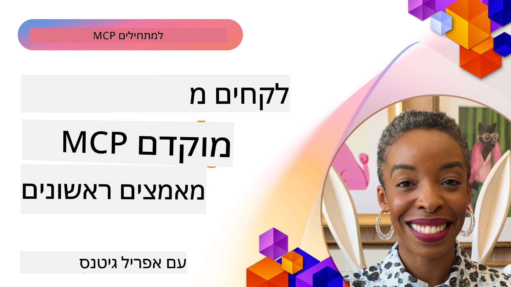

# 🌟 לקחים מאמצים מוקדמים

[](https://youtu.be/jds7dSmNptE)

_(לחצו על התמונה למעלה לצפייה בסרטון של השיעור)_

## 🎯 מה מודול זה מכסה

מודול זה בוחן כיצד ארגונים ומפתחים אמיתיים מנצלים את פרוטוקול ההקשר של המודל (MCP) כדי לפתור אתגרים ממשיים ולקדם חדשנות. דרך מחקרים מקרים מפורטים, פרויקטים מעשיים ודוגמאות פרקטיות, תגלה כיצד MCP מאפשר אינטגרציה בטוחה, ניתנת להרחבה של בינה מלאכותית שמחברת בין מודלי שפה, כלים ונתוני ארגון.

### 📚 ראו את MCP בפועל

רוצים לראות את העקרונות הללו מיושמים בכלים מוכנים לייצור? בדקו את [**10 שרתי MCP של מיקרוסופט שמשנים את פרודוקטיביות המפתחים**](microsoft-mcp-servers.md), שמציגים שרתי MCP אמיתיים של מיקרוסופט שניתן להשתמש בהם היום.

## סקירה כללית

שיעור זה בוחן כיצד אמצעי הדרך הראשונים מנצלים את פרוטוקול ההקשר של המודל (MCP) כדי לפתור אתגרים מהעולם האמיתי ולקדם חדשנות בתעשיות שונות. דרך מחקרים מקרים מפורטים ופרויקטים מעשיים, תראו כיצד MCP מאפשר אינטגרציה סטנדרטית, בטוחה וניתנת להרחבה של AI—מחברי מודלי שפה גדולים, כלים ונתוני ארגון במסגרת אחידה. תרכשו ניסיון מעשי בעיצוב ובניית פתרונות מבוססי MCP, תלמדו מדפוסי יישום מוכחים ותגלו פרקטיקות מיטביות להפעלת MCP בסביבות ייצור. השיעור גם מדגיש מגמות מתהוות, כיוונים עתידיים ומשאבים קוד פתוח שיעזרו לכם להישאר בחזית הטכנולוגיה והאקוסיסטם המתפתח של MCP.

## מטרות למידה

- לנתח יישומי MCP אמיתיים בתעשיות שונות  
- לעצב ולבנות אפליקציות שלמות מבוססות MCP  
- לחקור מגמות מתהוות וכיוונים עתידיים בטכנולוגיית MCP  
- ליישם פרקטיקות מיטביות בתרחישי פיתוח ממשיים  

## יישומי MCP מהעולם האמיתי

### מחקר מקרה 1: אוטומציה של תמיכת לקוחות ארגונית

תאגיד רב-לאומי יישם פתרון מבוסס MCP כדי לסטנדרט את האינטראקציות עם AI במערכות התמיכה בלקוחות שלו. זה אפשר להם:

- ליצור ממשק מאוחד לספקי LLM מרובים  
- לשמור על ניהול פרומפט אחיד בין מחלקות  
- ליישם בקרות אבטחה וציות קפדניות  
- להחליף בקלות בין דגמי AI שונים על פי צרכים ספציפיים  

**יישום טכני:**

```python
# מימוש שרת MCP בפייתון לתמיכת לקוחות
import logging
import asyncio
from modelcontextprotocol import create_server, ServerConfig
from modelcontextprotocol.server import MCPServer
from modelcontextprotocol.transports import create_http_transport
from modelcontextprotocol.resources import ResourceDefinition
from modelcontextprotocol.prompts import PromptDefinition
from modelcontextprotocol.tool import ToolDefinition

# הגדרת רישום
logging.basicConfig(level=logging.INFO)

async def main():
    # יצירת תצורת שרת
    config = ServerConfig(
        name="Enterprise Customer Support Server",
        version="1.0.0",
        description="MCP server for handling customer support inquiries"
    )
    
    # אתחול שרת MCP
    server = create_server(config)
    
    # רישום משאבי בסיס ידע
    server.resources.register(
        ResourceDefinition(
            name="customer_kb",
            description="Customer knowledge base documentation"
        ),
        lambda params: get_customer_documentation(params)
    )
    
    # רישום תבניות פרומפט
    server.prompts.register(
        PromptDefinition(
            name="support_template",
            description="Templates for customer support responses"
        ),
        lambda params: get_support_templates(params)
    )
    
    # רישום כלי תמיכה
    server.tools.register(
        ToolDefinition(
            name="ticketing",
            description="Create and update support tickets"
        ),
        handle_ticketing_operations
    )
    
    # הפעלת השרת עם תחבורה HTTP
    transport = create_http_transport(port=8080)
    await server.run(transport)

if __name__ == "__main__":
    asyncio.run(main())
```
  
**תוצאות:** הפחתה בעלויות הדגם ב-30%, שיפור בעקביות התגובה ב-45%, והגברת הציות ברחבי הפעילות הגלובלית.

### מחקר מקרה 2: עוזר אבחוני בתחום הבריאות

ספקית שירותי בריאות פיתחה תשתית MCP לשילוב מספר דגמי AI רפואיים ייעודיים תוך שמירה על הגנת נתוני המטופלים הרגישים:

- החלפה חלקה בין דגמי רפואת כללי ומומחה  
- בקרות פרטיות מחמירות ומסלולי ביקורת  
- אינטגרציה עם מערכות רשומות רפואיות אלקטרוניות (EHR) קיימות  
- הנדסת פרומפט עקבית למונחים רפואיים  

**יישום טכני:**

```csharp
// C# MCP host application implementation in healthcare application
using Microsoft.Extensions.DependencyInjection;
using ModelContextProtocol.SDK.Client;
using ModelContextProtocol.SDK.Security;
using ModelContextProtocol.SDK.Resources;

public class DiagnosticAssistant
{
    private readonly MCPHostClient _mcpClient;
    private readonly PatientContext _patientContext;
    
    public DiagnosticAssistant(PatientContext patientContext)
    {
        _patientContext = patientContext;
        
        // Configure MCP client with healthcare-specific settings
        var clientOptions = new ClientOptions
        {
            Name = "Healthcare Diagnostic Assistant",
            Version = "1.0.0",
            Security = new SecurityOptions
            {
                Encryption = EncryptionLevel.Medical,
                AuditEnabled = true
            }
        };
        
        _mcpClient = new MCPHostClientBuilder()
            .WithOptions(clientOptions)
            .WithTransport(new HttpTransport("https://healthcare-mcp.example.org"))
            .WithAuthentication(new HIPAACompliantAuthProvider())
            .Build();
    }
    
    public async Task<DiagnosticSuggestion> GetDiagnosticAssistance(
        string symptoms, string patientHistory)
    {
        // Create request with appropriate resources and tool access
        var resourceRequest = new ResourceRequest
        {
            Name = "patient_records",
            Parameters = new Dictionary<string, object>
            {
                ["patientId"] = _patientContext.PatientId,
                ["requestingProvider"] = _patientContext.ProviderId
            }
        };
        
        // Request diagnostic assistance using appropriate prompt
        var response = await _mcpClient.SendPromptRequestAsync(
            promptName: "diagnostic_assistance",
            parameters: new Dictionary<string, object>
            {
                ["symptoms"] = symptoms,
                patientHistory = patientHistory,
                relevantGuidelines = _patientContext.GetRelevantGuidelines()
            });
            
        return DiagnosticSuggestion.FromMCPResponse(response);
    }
}
```
  
**תוצאות:** שיפור בהצעות האבחון לרופאים תוך שמירה מלאה על תקנות HIPAA והפחתה משמעותית במעברי הקשר בין מערכות.

### מחקר מקרה 3: ניתוח סיכוני שירותים פיננסיים

מוסד פיננסי יישם MCP לסטנדרט את תהליכי ניתוח הסיכונים שלו בין מחלקות שונות:

- יצירת ממשק אחיד לדגמי סיכון אשראי, גילוי הונאות, וסיכון השקעה  
- יישום בקרות גישה מחמירות וניהול גרסאות למודלים  
- הבטחת עקיבות בייעוץ AI  
- שימור פורמט נתונים עקבי בין מערכות מגוונות  

**יישום טכני:**

```java
// שרת MCP בג'אווה להערכת סיכונים פיננסיים
import org.mcp.server.*;
import org.mcp.security.*;

public class FinancialRiskMCPServer {
    public static void main(String[] args) {
        // יצירת שרת MCP עם תכונות ציות פיננסי
        MCPServer server = new MCPServerBuilder()
            .withModelProviders(
                new ModelProvider("risk-assessment-primary", new AzureOpenAIProvider()),
                new ModelProvider("risk-assessment-audit", new LocalLlamaProvider())
            )
            .withPromptTemplateDirectory("./compliance/templates")
            .withAccessControls(new SOCCompliantAccessControl())
            .withDataEncryption(EncryptionStandard.FINANCIAL_GRADE)
            .withVersionControl(true)
            .withAuditLogging(new DatabaseAuditLogger())
            .build();
            
        server.addRequestValidator(new FinancialDataValidator());
        server.addResponseFilter(new PII_RedactionFilter());
        
        server.start(9000);
        
        System.out.println("Financial Risk MCP Server running on port 9000");
    }
}
```
  
**תוצאות:** תיאום רגולטורי משופר, מחזורי הפצה מהירים ב-40%, ועקיבות משופרת בהערכת סיכונים במחלקות.

### מחקר מקרה 4: שרת Playwright MCP של מיקרוסופט לאוטומציה בדפדפן

מיקרוסופט פיתחה את [שרת Playwright MCP](https://github.com/microsoft/playwright-mcp) כדי לאפשר אוטומציה בטוחה וסטנדרטית של דפדפנים דרך פרוטוקול ההקשר של המודל. שרת זה המוכן לייצור מאפשר לסוכני AI ו-LLMs אינטראקציה עם דפדפני רשת באופן מבוקר, ניתן לביקורת ומסוגל להרחבה—ומאפשר שימושים כגון בדיקות ווב אוטומטיות, חילוץ מידע, וזרימות עבודה מקצה לקצה.

> **🎯 כלי מוכן לייצור**  
>  
> מחקר מקרה זה מציג שרת MCP אמיתי שניתן להשתמש בו היום! למידע נוסף על שרת Playwright MCP ועל 9 שרתי MCP נוספים של מיקרוסופט ראו את [**מדריך שרתי MCP של מיקרוסופט**](microsoft-mcp-servers.md#8--playwright-mcp-server).

**תכונות עיקריות:**  
- חושף יכולות אוטומציה בדפדפן (ניווט, מילוי טפסים, צילום מסך וכו') ככלי MCP  
- מיישם בקרות גישה מחמירות וסביבת החול למניעת פעולות בלתי מורשות  
- מספק יומני ביקורת מפורטים לכל האינטראקציות עם הדפדפן  
- תומך באינטגרציה עם Azure OpenAI וספקי LLM נוספים לאוטומציה מבוססת סוכנים  
- מפעיל את סוכן הקידוד של GitHub Copilot עם יכולות גלישה  

**יישום טכני:**

```typescript
// TypeScript: רישום כלי האוטומציה של דפדפן Playwright בשרת MCP
import { createServer, ToolDefinition } from 'modelcontextprotocol';
import { launch } from 'playwright';

const server = createServer({
  name: 'Playwright MCP Server',
  version: '1.0.0',
  description: 'MCP server for browser automation using Playwright'
});

// רישום כלי לניווט לכתובת URL ולכידת צילום מסך
server.tools.register(
  new ToolDefinition({
    name: 'navigate_and_screenshot',
    description: 'Navigate to a URL and capture a screenshot',
    parameters: {
      url: { type: 'string', description: 'The URL to visit' }
    }
  }),
  async ({ url }) => {
    const browser = await launch();
    const page = await browser.newPage();
    await page.goto(url);
    const screenshot = await page.screenshot();
    await browser.close();
    return { screenshot };
  }
);

// הפעלת שרת MCP
server.listen(8080);
```
  
**תוצאות:**  

- אפשר אוטומציה בטוחה ומתוכנתת של דפדפן לסוכני AI ול-LLMs  
- הפחית מאמץ בדיקות ידניות ושיפר כיסוי בדיקות לאפליקציות ווב  
- סיפק תשתית מחודשת וניתנת להרחבה לאינטגרציה של כלים מבוססי דפדפן בסביבות ארגוניות  
- מפעיל את יכולות הגלישה של GitHub Copilot  

**מקורות:**

- [מאגר GitHub של שרת Playwright MCP](https://github.com/microsoft/playwright-mcp)  
- [פתרונות בינה מלאכותית ואוטומציה של מיקרוסופט](https://azure.microsoft.com/en-us/products/ai-services/)  

### מחקר מקרה 5: Azure MCP – פרוטוקול הקשר דגם ברמת ארגון כשירות

שרת Azure MCP ([https://aka.ms/azmcp](https://aka.ms/azmcp)) הוא יישום מנוהל ברמת ארגון של פרוטוקול הקשר דגם לפי מיקרוסופט, שנועד לספק יכולות שרת MCP ניתנות להרחבה, מאובטחות ותואמות כשרת ענן. Azure MCP מאפשר לארגונים לפרוס, לנהל ולשלב שרתי MCP במהירות עם שירותי AI, נתונים ואבטחה של Azure, תוך הפחתת עלויות הפעלה והאצת אימוץ AI.

> **🎯 כלי מוכן לייצור**  
>  
> זהו שרת MCP אמיתי שניתן להשתמש בו היום! לימדו עוד על שרת Azure AI Foundry MCP במדריך שרתי MCP של מיקרוסופט.

- אירוח שרת MCP מנוהל מלא עם קנה מידה מובנה, ניטור ואבטחה  
- אינטגרציה טבעית עם Azure OpenAI, Azure AI Search ושירותי Azure נוספים  
- אימות והרשאות ארגוניות באמצעות Microsoft Entra ID  
- תמיכה בכלים מותאמים, תבניות פרומפט וחיבורים למשאבים  
- תאימות לדרישות אבטחה ותקנות ארגוניות  

**יישום טכני:**

```yaml
# Example: Azure MCP server deployment configuration (YAML)
apiVersion: mcp.microsoft.com/v1
kind: McpServer
metadata:
  name: enterprise-mcp-server
spec:
  modelProviders:
    - name: azure-openai
      type: AzureOpenAI
      endpoint: https://<your-openai-resource>.openai.azure.com/
      apiKeySecret: <your-azure-keyvault-secret>
  tools:
    - name: document_search
      type: AzureAISearch
      endpoint: https://<your-search-resource>.search.windows.net/
      apiKeySecret: <your-azure-keyvault-secret>
  authentication:
    type: EntraID
    tenantId: <your-tenant-id>
  monitoring:
    enabled: true
    logAnalyticsWorkspace: <your-log-analytics-id>
```
  
**תוצאות:**  
- הפחתת זמן ערך לפרויקטים ארגוניים בינה מלאכותית באמצעות פלטפורמת שרת MCP מוכנה לשימוש  
- פישוט אינטגרציה של LLMים, כלים ונתוני ארגון  
- שיפור אבטחה, נראות ויעילות תפעולית לעומסי MCP  
- שיפור איכות קוד עם פרקטיקות מיטביות של Azure SDK ודפוסי אימות עדכניים  

**מקורות:**  
- [תיעוד Azure MCP](https://aka.ms/azmcp)  
- [מאגר GitHub של שרת Azure MCP](https://github.com/Azure/azure-mcp)  
- [שירותי Azure AI](https://azure.microsoft.com/en-us/products/ai-services/)  
- [מרכז MCP של מיקרוסופט](https://mcp.azure.com)  

## מחקר מקרה 6: NLWeb  
MCP (פרוטוקול הקשר של מודל) הוא פרוטוקול מתהווה לצ'אטבוטים ועוזרי AI לאינטראקציה עם כלים. כל מופע NLWeb הוא גם שרת MCP התומך בשיטה מרכזית אחת, ask, המשמשת לשאילת שאלות לאתר בשפה טבעית. התשובה המוחזרת משתמשת ב־schema.org, אוצר מילים נפוץ לתאור נתוני רשת. באופן כללי, MCP הוא כמו Http ל-HTML עבור NLWeb. NLWeb משלב פרוטוקולים, פורמטים של Schema.org וקוד לדוגמה כדי לסייע לאתרים ליצור במהירות נקודות קצה אלה, למען בני אדם דרך ממשקי שיח ולמען מכונות דרך אינטראקציה טבעית סוכן לסוכן.

יש שני רכיבים מובחנים ב-NLWeb:  
- פרוטוקול, פשוט להבנה, לממשק עם אתר בשפה טבעית ופורמט המבוסס על json ו-schema.org לתשובה מוחזרת. ראו את התיעוד על REST API לפרטים נוספים.  
- יישום פשוט של (1) המנצלת סימון קיים, לאתרים שניתן לייצגם כרשימות פריטים (מוצרים, מתכונים, אטרקציות, ביקורות וכו'). יחד עם אוסף ווידג'טים לממשק משתמש, אתרים יכולים לספק ממשקי שיח לתוכן שלהם. ראו את התיעוד על Life of a chat query לפרטים על אופן העבודה.  

**מקורות:**  
- [תיעוד Azure MCP](https://aka.ms/azmcp)  
- [NLWeb](https://github.com/microsoft/NlWeb)

### מחקר מקרה 7: שרת Azure AI Foundry MCP – אינטגרציה של סוכני AI ארגוניים

שרתי Azure AI Foundry MCP מציגים כיצד ניתן להשתמש ב-MCP לתזמור ולניהול סוכני AI וזרימות עבודה בסביבות ארגוניות. באמצעות אינטגרציה של MCP עם Azure AI Foundry, ארגונים יכולים לסטנדרט אינטראקציות סוכן, לנצל ניהול זרימות עבודה של Foundry, ולהבטיח פריסות מאובטחות וניתנות להרחבה.

> **🎯 כלי מוכן לייצור**  
>  
> זהו שרת MCP אמיתי שניתן להשתמש בו היום! למידע נוסף על שרת Azure AI Foundry MCP ראו את [**מדריך שרתי MCP של מיקרוסופט**](microsoft-mcp-servers.md#9--azure-ai-foundry-mcp-server).

**תכונות עיקריות:**  
- גישה מקיפה לאקוסיסטם ה-AI של Azure, כולל קטלוגי מודלים וניהול פריסות  
- אינדוקס ידע עם Azure AI Search ליישומי RAG  
- כלים להערכה של ביצועי מודלי AI והבטחת איכות  
- אינטגרציה עם קטלוג ומעבדות Azure AI Foundry למודלים מחקריים מובילים  
- ניהול והערכת סוכנים לתרחישי ייצור  

**תוצאות:**  
- פרוטוטייפ מהיר וניטור איתן של זרימות עבודה של סוכני AI  
- אינטגרציה חלקה עם שירותי Azure AI לתרחישים מתקדמים  
- ממשק מאוחד לבניית, פריסה וניטור צינורות סוכנים  
- שיפור אבטחה, ציות ויעילות תפעולית לארגונים  
- האצה באימוץ AI תוך שמירה על בקרה בתהליכים סבוכים המונעים על-ידי סוכנים  

**מקורות:**  
- [GitHub של שרת Azure AI Foundry MCP](https://github.com/azure-ai-foundry/mcp-foundry)  
- [אינטגרציה של סוכני Azure AI עם MCP (בלוג Microsoft Foundry)](https://devblogs.microsoft.com/foundry/integrating-azure-ai-agents-mcp/)

### מחקר מקרה 8: Foundry MCP Playground – ניסויים ופרוטוטייפ

Foundry MCP Playground מציע סביבה מוכנה לשימוש לניסויים עם שרתי MCP ואינטגרציות Azure AI Foundry. מפתחים יכולים ליצור במהירות אב-טיפוס, לבדוק ולהעריך דגמי AI וזרימות עבודה של סוכנים באמצעות משאבים מקטלוג ומעבדות Azure AI Foundry. המשחקייה מפשטת התקנה, מספקת פרויקטים לדוגמה ותומכת בפיתוח שיתופי, ומאפשרת בקלות לחקור פרקטיקות מיטביות ותסריטים חדשים עם מינימום עומס. זה שימושי במיוחד לצוותים שרוצים לאמת רעיונות, לשתף ניסויים ולהאיץ למידה בלי צורך בתשתית מורכבת. בכך שמורידה את חסם הכניסה, המשחקייה תורמת לחדשנות ולתרומות קהילתיות במערכת האקולוגית של MCP ו-Azure AI Foundry.

**מקורות:**

- [GitHub של Foundry MCP Playground](https://github.com/azure-ai-foundry/foundry-mcp-playground)

### מחקר מקרה 9: שרת Microsoft Learn Docs MCP – גישה לתיעוד מונע AI 

שרת Microsoft Learn Docs MCP הוא שירות מתארח בענן שמספק לעוזרי AI גישה בזמן אמת לתיעוד הרשמי של מיקרוסופט דרך פרוטוקול ההקשר של המודל. שרת זה המוכן לייצור מקשר לאקוסיסטם המקיף של Microsoft Learn ומאפשר חיפוש סמנטי ברחבי כל מקורות מיקרוסופט הרשמיים.

> **🎯 כלי מוכן לייצור**  
>  
> זהו שרת MCP אמיתי שניתן להשתמש בו היום! למידע נוסף על שרת Microsoft Learn Docs MCP ראו את [**מדריך שרתי MCP של מיקרוסופט**](microsoft-mcp-servers.md#1--microsoft-learn-docs-mcp-server).

**תכונות עיקריות:**  
- גישה בזמן אמת לתיעוד הרשמי של מיקרוסופט, תיעוד Azure ותיעוד Microsoft 365  
- יכולות חיפוש סמנטי מתקדמות שמבינות הקשר וכוונה  
- מידע תמיד מעודכן ככל שתוכן Microsoft Learn מתפרסם  
- כיסוי מקיף של Microsoft Learn, תיעוד Azure ומקורות Microsoft 365  
- מחזיר עד 10 קטעי תוכן איכותיים עם כותרות ומקורות  

**למה זה קריטי:**  
- פותר את בעיית "ידע AI מיושן" עבור טכנולוגיות מיקרוסופט  
- מבטיח לעוזרי AI גישה לתכונות העדכניות ביותר של .NET, C#, Azure ו-Microsoft 365  
- מספק מידע סמכותי מהמקור ליצירת קוד מדויק  
- חיוני למפתחים העובדים עם טכנולוגיות מיקרוסופט שמתפתחות במהירות  

**תוצאות:**  
- שיפור דרמטי בדיוק יצירת הקוד על ידי AI לטכנולוגיות מיקרוסופט  
- הפחתת זמן חיפוש אחר תיעוד מעודכן ופרקטיקות מיטביות  
- שיפור פרודוקטיביות המפתחים עם אחזור תיעוד מודע הקשר  
- אינטגרציה חלקה עם זרימות עבודה מבלי לעזוב את סביבת הפיתוח  

**מקורות:**  
- [מאגר GitHub של שרת Microsoft Learn Docs MCP](https://github.com/MicrosoftDocs/mcp)  
- [תיעוד Microsoft Learn](https://learn.microsoft.com/)

## פרויקטים מעשיים

### פרויקט 1: בניית שרת MCP עם ספקים מרובים

**מטרה:** ליצור שרת MCP שיכול לנטרל בקשות לספקי דגמי AI רבים בהתאם לקריטריונים ספציפיים.

**דרישות:**

- תמיכה בשלושה ספקים שונים לפחות (לדוגמה: OpenAI, Anthropic, דגמים מקומיים)  
- יישום מנגנון ניתוב המבוסס על מטאנתוני בקשה  
- יצירת מערכת תצורה לניהול אישורי ספקים  
- הוספת קשירה (Caching) לאופטימיזציה של ביצועים ועלויות  
- בנייה של לוח בקרה פשוט למעקב שימוש  

**שלבי יישום:**

1. הקמת תשתית שרת MCP בסיסית  
2. יישום מתאמים לספקים עבור כל שירות דגם AI  
3. יצירת לוגיקת ניתוב מבוססת מאפייני הבקשה  
4. הוספת מנגנוני קשירה לבקשות תכופות  
5. פיתוח לוח בקרה למעקב  
6. בדיקה עם תבניות בקשה שונות  

**טכנולוגיות:** בחרו בין Python (.NET/Java/Python בהתאם להעדפתכם), Redis לקשירה, ומסגרת ווב פשוטה ללוח הבקרה.

### פרויקט 2: מערכת ניהול פרומפט ארגונית
**מטרה:** לפתח מערכת מבוססת MCP לניהול, גרסה ופריסת תבניות פרומפטים בארגון.

**דרישות:**

- יצירת מאגר מרכזי לתבניות פרומפטים  
- יישום ניהול גרסאות ותהליכי אישור  
- בניית יכולות בדיקת תבניות עם קלטים לדוגמה  
- פיתוח בקרות גישה מבוססות תפקידים  
- יצירת API לשליפת תבניות ופריסתן  

**שלבי יישום:**

1. עיצוב סכמת בסיס הנתונים לאחסון תבניות  
2. יצירת ה-API המרכזי לפעולות CRUD על תבניות  
3. יישום מערכת ניהול הגרסאות  
4. בניית תהליך אישור  
5. פיתוח מסגרת בדיקות  
6. יצירת ממשק ווב פשוט לניהול  
7. אינטגרציה עם שרת MCP  

**טכנולוגיות:** בחירתך במסגרת Backend, בסיס נתונים SQL או NoSQL ומסגרת Frontend לממשק הניהול.

### פרויקט 3: פלטפורמת יצירת תוכן מבוססת MCP

**מטרה:** לבנות פלטפורמה ליצירת תוכן המשתמשת ב-MCP כדי לספק תוצאות עקביות בסוגי תוכן שונים.

**דרישות:**

- תמיכה בפורמטים שונים של תוכן (פוסטים לבלוג, מדיה חברתית, טקסט שיווקי)  
- יישום יצירה מבוססת תבניות עם אפשרויות התאמה אישית  
- יצירת מערכת ביקורת משוב לתוכן  
- מעקב אחרי מדדי ביצועים של התוכן  
- תמיכה בניהול גרסאות וחזרות תוכן  

**שלבי יישום:**

1. הקמת תשתית לקוח MCP  
2. יצירת תבניות לסוגי תוכן שונים  
3. בניית תהליך יצירת התוכן  
4. יישום מערכת ביקורת  
5. פיתוח מערכת מעקב מדדים  
6. יצירת ממשק משתמש לניהול תבניות ויצירת תוכן  

**טכנולוגיות:** שפת התכנות המועדפת עליך, מסגרת ווב ומערכת בסיס נתונים.

## כיווני עתיד לטכנולוגיית MCP

### מגמות עולות

1. **MCP רב-מודאלי**  
   - הרחבת MCP לסטנדרטיזציה של אינטראקציות עם דגמי תמונה, שמע ווידאו  
   - פיתוח יכולות היגיון חוצה-מודאליות  
   - פורמטים סטנדרטיים לפרומפטים למודאליות שונות  

2. **תשתית MCP מבוזרת (Federated)**  
   - רשתות MCP מבוזרות לשיתוף משאבים בין ארגונים  
   - פרוטוקולים סטנדרטיים לשיתוף מודלים מאובטח  
   - טכניקות חישוב לשמירה על פרטיות  

3. **שווקי MCP**  
   - מערכות אקולוגיות לשיתוף ומוניטיזציה של תבניות MCP ותוספים  
   - תהליכי הבטחת איכות והסמכה  
   - אינטגרציה עם שווקי מודלים  

4. **MCP למחשוב קצה**  
   - התאמת תקני MCP למכשירי קצה עם משאבים מוגבלים  
   - פרוטוקולים מותאמים לסביבות ברוחב פס נמוך  
   - יישומי MCP מיוחדים לאקוסיסטמות IoT  

5. **מסגרות רגולטוריות**  
   - פיתוח הרחבות MCP לציות לתקנות  
   - רישום ביקורת סטנדרטי וממשקי שפור  
   - אינטגרציה עם מסגרות ממשל AI חדשות  

### פתרונות MCP של מיקרוסופט

מיקרוסופט ו-Azure פיתחו מספר מאגרים בקוד פתוח המסייעים למפתחים ליישם MCP בתרחישים שונים:

#### ארגון Microsoft

1. [playwright-mcp](https://github.com/microsoft/playwright-mcp) - שרת MCP ל-Playwright לאוטומציה ובדיקות דפדפן  
2. [files-mcp-server](https://github.com/microsoft/files-mcp-server) - מימוש שרת MCP ל-OneDrive לבדיקות מקומיות ותרומת קהילה  
3. [NLWeb](https://github.com/microsoft/NlWeb) - אוסף פרוטוקולים וכלי קוד פתוח ליצירת שכבת יסוד לרשת AI  

#### ארגון Azure-Samples

1. [mcp](https://github.com/Azure-Samples/mcp) - קישורים לדוגמאות, כלים ומשאבים לבניית ואינטגרציה של שרתי MCP ב-Azure בשפות תכנות שונות  
2. [mcp-auth-servers](https://github.com/Azure-Samples/mcp-auth-servers) - שרתי MCP לדוגמא המדגימים אימות בהתאם למפרט MCP העכשווי  
3. [remote-mcp-functions](https://github.com/Azure-Samples/remote-mcp-functions) - עמוד נחיתה למימוש שרתי MCP מרוחקים ב-Azure Functions עם קישורים לרפוס ספציפיים לשפות  
4. [remote-mcp-functions-python](https://github.com/Azure-Samples/remote-mcp-functions-python) - תבנית התחלה מהירה לבניית ופריסת שרתי MCP מרוחקים מותאמים ב-Python ב-Azure Functions  
5. [remote-mcp-functions-dotnet](https://github.com/Azure-Samples/remote-mcp-functions-dotnet) - תבנית התחלה מהירה לבניית ופריסת שרתי MCP מרוחקים מותאמים ב-.NET/C# ב-Azure Functions  
6. [remote-mcp-functions-typescript](https://github.com/Azure-Samples/remote-mcp-functions-typescript) - תבנית התחלה מהירה לבניית ופריסת שרתי MCP מרוחקים מותאמים ב-TypeScript ב-Azure Functions  
7. [remote-mcp-apim-functions-python](https://github.com/Azure-Samples/remote-mcp-apim-functions-python) - ניהול API של Azure כ-Gateway לשרתי MCP מרוחקים ב-Python  
8. [AI-Gateway](https://github.com/Azure-Samples/AI-Gateway) - ניסויי APIM ❤️ AI כולל יכולות MCP, אינטגרציה עם Azure OpenAI ו-AI Foundry  

מאגרים אלה מספקים מימושים, תבניות ומשאבים לעבודה עם Model Context Protocol בשפות תכנות ושירותים שונים של Azure. הם מכסים מגוון תרחישי שימוש ממימוש שרת בסיסי ועד אימות, פריסת ענן ואינטגרציה ארגונית.

#### מדריך משאבים MCP

ספריית [MCP Resources directory](https://github.com/microsoft/mcp/tree/main/Resources) במאגר הרשמי של מיקרוסופט ל-MCP מספקת אוסף מובחר של משאבים לדוגמה, תבניות פרומפט, והגדרות כלים לשימוש עם שרתי Model Context Protocol. מדריך זה מיועד לסייע למפתחים להתחיל במהירות עם MCP על ידי הצעת בלוקים לבנייה חוזרת ודוגמאות לעיצוב מיטבי ל:

- **תבניות פרומפט:** תבניות מוכנות לשימוש למשימות ותסריטים AI נפוצים, המתאימות למימושים שלך של שרתי MCP.  
- **הגדרות כלים:** דוגמאות לסכמות וכלי מטה-דאטה לסטנדרטיזציה של אינטגרציה והפעלה בין כלים בשרתי MCP שונים.  
- **דוגמאות משאבים:** הגדרות משאבים לדוגמא לחיבור למקורות נתונים, API ושירותים חיצוניים במסגרת MCP.  
- **מימושים לדוגמה:** דוגמאות מעשיות המדגימות כיצד לארגן ולבנות משאבים, פרומפטים וכלים בפרויקטים ממשיים של MCP.  

משאבים אלו מאיצים פיתוח, מעודדים סטנדרטיזציה ומסייעים להבטחת מאמצי בנייה ופריסה מיטביים של פתרונות מבוססי MCP.

#### מדריך משאבים MCP

- [MCP Resources (תבניות פרומפט לדוגמה, כלים והגדרות משאבים)](https://github.com/microsoft/mcp/tree/main/Resources)

### הזדמנויות מחקר

- טכניקות אופטימיזציה יעילות לפרומפט במסגרת MCP  
- מודלים של אבטחה לפריסות MCP רב-שוכנות  
- מדידת ביצועים בין מימושים שונים של MCP  
- שיטות אימות פורמליות לשרתי MCP  

## סיכום

פרוטוקול הקשר מודל (MCP) מעצב במהירות את עתיד האינטגרציה הסטנדרטית, המאובטחת והמתפקדת של AI בתעשיות שונות. דרך מקרי מבחן ופרויקטים מעשיים בשיעור זה, נחשת כיצד מאמצים מוקדמים — ביניהם מיקרוסופט ו-Azure — מנצלים את MCP כדי לפתור אתגרים אמתיים, להאיץ אימוץ AI ולהבטיח ציות, אבטחה וסקלאביליות. הגישה המודולרית של MCP מאפשרת לארגונים לחבר דגמי שפה גדולים, כלים ונתוני ארגון במסגרת אחודה הניתנת לבדיקה. ככל ש-MCP ממשיכה להתפתח, שמירת קשר עם הקהילה, חקירת משאבים בקוד פתוח ויישום מיטב הפרקטיקות יהיה המפתח לבניית פתרונות AI עמידים ומוכנים לעתיד.

## משאבים נוספים

- [מאגר Foundry MCP ב-GitHub](https://github.com/azure-ai-foundry/mcp-foundry)  
- [Foundry MCP Playground](https://github.com/azure-ai-foundry/foundry-mcp-playground)  
- [אינטגרציה של סוכני Azure AI עם MCP (בלוג Microsoft Foundry)](https://devblogs.microsoft.com/foundry/integrating-azure-ai-agents-mcp/)  
- [מאגר MCP ב-GitHub (מיקרוסופט)](https://github.com/microsoft/mcp)  
- [מדריך משאבים MCP (תבניות פרומפט, כלים והגדרות משאבים)](https://github.com/microsoft/mcp/tree/main/Resources)  
- [קהילת MCP ותיעוד](https://modelcontextprotocol.io/introduction)  
- [מפרט MCP (2025-11-25)](https://spec.modelcontextprotocol.io/specification/2025-11-25/)  
- [תיעוד Azure MCP](https://aka.ms/azmcp)  
- [OWASP MCP Top 10](https://microsoft.github.io/mcp-azure-security-guide/mcp/) - מיטב פרקטיקות אבטחה  
- [Playwright MCP Server GitHub Repository](https://github.com/microsoft/playwright-mcp)  
- [Files MCP Server (OneDrive)](https://github.com/microsoft/files-mcp-server)  
- [Azure-Samples MCP](https://github.com/Azure-Samples/mcp)  
- [MCP Auth Servers (Azure-Samples)](https://github.com/Azure-Samples/mcp-auth-servers)  
- [Remote MCP Functions (Azure-Samples)](https://github.com/Azure-Samples/remote-mcp-functions)  
- [Remote MCP Functions Python (Azure-Samples)](https://github.com/Azure-Samples/remote-mcp-functions-python)  
- [Remote MCP Functions .NET (Azure-Samples)](https://github.com/Azure-Samples/remote-mcp-functions-dotnet)  
- [Remote MCP Functions TypeScript (Azure-Samples)](https://github.com/Azure-Samples/remote-mcp-functions-typescript)  
- [Remote MCP APIM Functions Python (Azure-Samples)](https://github.com/Azure-Samples/remote-mcp-apim-functions-python)  
- [AI-Gateway (Azure-Samples)](https://github.com/Azure-Samples/AI-Gateway)  
- [פתרונות AI ואוטומציה של מיקרוסופט](https://azure.microsoft.com/en-us/products/ai-services/)  

## תרגילים

1. נתח מקרה מבחן אחד והצע גישת יישום אלטרנטיבית.  
2. בחר רעיון פרויקט וכתוב מפרט טכני מפורט.  
3. חקור תעשייה שלא נכללה במקרי המבחן וסקור כיצד MCP יכולה לפתור את האתגרים הייחודיים שלה.  
4. חקור אחד מכיווני העתיד ופתח מושג להרחבת MCP חדשה לתמיכה בו.

## מה הלאה

חקור עוד: [Microsoft MCP Servers](./microsoft-mcp-servers.md)

המשך אל: [מודול 8: מיטב הפרקטיקות](../08-BestPractices/README.md)

---

<!-- CO-OP TRANSLATOR DISCLAIMER START -->
**כתב ויתור**:  
מסמך זה תורגם באמצעות שירות תרגום מבוסס בינה מלאכותית [Co-op Translator](https://github.com/Azure/co-op-translator). למרות שאנו שואפים לדיוק, יש לקחת בחשבון כי תרגומים אוטומטיים עלולים להכיל שגיאות או אי-דיוקים. המסמך המקורי בשפתו המקורית נחשב כמקור המוסמך. לצורך מידע קריטי, מומלץ להשתמש בתרגום מקצועי על ידי אדם. אנו לא נושאים באחריות לכל אי הבנה או פרשנות שגויה הנובעת משימוש בתרגום זה.
<!-- CO-OP TRANSLATOR DISCLAIMER END -->